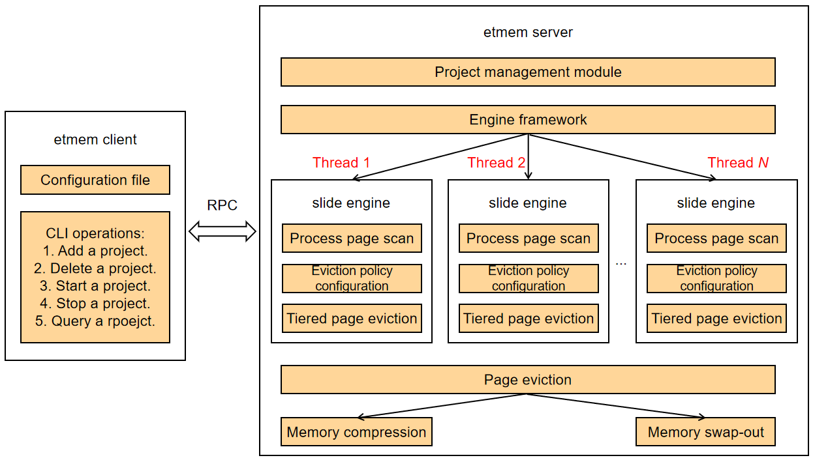

# etmem for Tiered Memory Expansion

## Introduction
The development of CPU computing power - particularly lower costs of ARM cores - makes memory cost and capacity become the core frustration that restricts business costs and performance. Therefore, the most pressing issue is how to save memory cost and how to expand memory capacity.

etmem is a tiered memory expansion technology that uses DRAM+memory compression/high-performance storage media to form tiered memory storage. Memory data is tiered, and cold data is migrated from memory media to high-performance storage media to release memory space and reduce memory costs. (Currently, non-volatile memory media are not supported.)

## Software Architecture


The etmem client interacts with the server through the socket communication mechanism and delivers commands for adding, deleting, starting, stopping, and querying a project. The server reads the project management configuration information and engine configuration information from the configuration file delivered by the client, and performs the operations delivered by the client. After a project is started, the server scans service processes and evicts pages by tier based on the scanning statistics and eviction policy to save memory.


## Compilation Tutorial

1. Download the etmem source code.
```
   # git clone https://gitee.com/src-openeuler/etmem.git
```
2. Install the compilation and running dependency.

   The compilation and running of etmem depend on the libboundscheck component.

   Install the libboundscheck component.
   ```
   yum install libboundscheck
   ```
   Confirm whether it is installed through the rpm package.
   ```
   rpm -qa |grep libboundscheck
   ```

3. Build source code.
```
   # cd etmem
   # mkdir build
   # cd build
   # cmake ..
   # make
```
## Instruction

### Starting etmemd

#### How to Use

Run the etmemd process in binary mode. For example:
```
# etmemd -l 0 -s etmemd_socket
```
#### Printing Help Information
```
options:
-l|--log-level <log-level>  Log level
-s|--socket <sockect name>  Socket name to listen to
-h|--help  Show this message
```
#### Command-Line Options

| Option           | Description                           | Mandatory (Yes/No)| With Parameters (Yes/No)| Value Range             | Example Description                                                    |
| --------------- | ---------------------------------- | -------- | ---------- | --------------------- | ------------------------------------------------------------ |
| `-l` or `--log-level` | etmemd log level                    | No      | Yes        | 0 to 3                  | `0`: debug level. `1`: info level. `2`: warning level. `3`: error level. Only logs of the level that is higher than or equal to the configured level are recorded in the `/var/log/message` file.|
| `-s` or `--socket`    | Name of the etmemd listener, which is used to interact with the client| Yes      | Yes        | A string of fewer than 107 characters| Name of the server listener.                                        |
| `-h` or `--help`      | Help information                          | No      | No        | N/A                   | If this option is specified, the command execution exits after the command output is printed.                                |

### etmem Configuration File

Before running the etmem process, the administrator needs to plan the processes that require memory expansion, configure the process information in the etmem configuration file, and configure the memory scan loops and times, and cold and hot memory thresholds.

The example configuration file is stored in `conf/example_conf.yaml` of the root directory of the source code in the source package. You are advised to store the example configuration file in the `/etc/etmem/` directory. The following is an example:

```
options:    
	loop : 3
    interval : 1
    sleep: 2
	policies:
		type : pid/name
   		value : 123456/mysql
    	max_threads: 3
    	engine : slide
			param:
				T: 3
```

Fields in the configuration file are described as follows.

| **Configuration Item**   | **Description**                                              | **Mandatory (Yes/No)**| **With Parameters (Yes/No)**| **Value Range**             | **Example Description**                                                |
| ----------- | ------------------------------------------------------------ | ------------ | -------------- | ------------------------- | ------------------------------------------------------------ |
| options     | Start flag of the project common configuration section                                   | Yes          | No            | N/A                       | Each configuration file has only one `options`·field, and the file starts with this field.        |
| loop        | Number of memory scan loops                                          | Yes          | Yes            | 1 to 120                    | `loop:3` // Scan for three times.                                            |
| interval    | Interval for memory scans                                      | Yes          | Yes            | 1 to 1200                   | `interval:5` // The scan interval is 5s.                             |
| sleep       | Interval between large loops of memory scans and operations                       | Yes          | Yes            | 1 to 1200                   | `sleep:10` // The interval between large loops is 10s.                            |
| policies    | Start flag of the configuration section of each task in the project                           | Yes          | No            | N/A                       | Multiple tasks can be configured in a project. Each task starts with `policies:`.      |
| type        | Method of identifying the target process                                          | Yes          | Yes            | `pid` or `name`                  | `pid` indicates that the process is identified by the process ID, and `name` indicates that the process is identified by the process name.             |
| value       | Specific fields identified by the target process                                      | Yes          | Yes            | Actual process ID/name    | This configuration item is used together with the `type` configuration item to specify the ID or name of the target process. Ensure that the configuration is correct and unique.|
| max_threads | Maximum number of threads in the etmemd internal thread pool. Each thread processes the memory scan and operation tasks of a process or child process.| No          | Yes            | 1 to 2 x Number of cores + 1. The default value is `1`.| This configuration item controls the number of internal processing threads of etmemd. When the target process has multiple child processes, a larger value of this configuration item indicates a larger number of concurrent executions but more occupied resources.|
| engine      | Engine type                                                | Yes          | Yes            | `slide`                     | The `slide` engine is used to identify cold and hot memory.                           |
| param       | Start flag of the private parameter configuration section of an engine                                | Yes          | No            | N/A                       | Start flag of the private parameter configuration section of an engine. Each task corresponds to an engine, and each engine corresponds to a `param` and its fields.|
| T           | Watermark of the `slide` engine                                         | Yes          | No            | 1 to 3 x `loop`               | Watermark. If the value is greater than or equal to the watermark, the memory is identified as hot memory. Otherwise, the memory is identified as cold memory.  |

### Adding, Deleting, and Querying an etmem Project

#### Scenario Description

1. The administrator adds an etmem project (a project can contain multiple etmem tasks).

2. The administrator queries an existing etmem project.

3. The administrator deletes an existing etmem project. (Before a project is deleted, all tasks in the project automatically stop.)

#### How to Use

Add, delete, or query a project using the etmem binary file. Ensure that the server is running properly and the content of the configuration file (for example, `/etc/etmem/example_conf.yaml`) is correct.

Add a project.
```
# etmem project add -n test -f /etc/etmem/example_conf.yaml -s etmemd_socket
```
Delete a project.
```
# etmem project del -n test -s etmemd_socket
```
Query a project.
```
# etmem project show -s etmemd_socket
```
Print help information.
```
# etmem project help
```
#### Printing Help Information
```
Usage:
 etmem project add [options]
 etmem project del [options]
 etmem project show
 etmem project help

 Options:
 -f|--file <conf_file> Add configuration file
 -n|--name <proj_name> Add project name
 -s|--sock <sock_name> Socket name to connect

 Notes:
 1. Project name and socket name must be given when execute add or del option.
 2. Configuration file must be given when execute add option.
 3. Socket name must be given when execute show option.
```
#### Command-Line Options

Command `add`

| Option        | Description                                                     | Mandatory (Yes/No)| With Parameters (Yes/No)| Example Description                                                |
| ------------ | ------------------------------------------------------------ | -------- | ---------- | -------------------------------------------------------- |
| `-n` or `--name`   | Project name                                             | Yes      | Yes        | Project name, which corresponds to the configuration file.                         |
| `-f` or `--file`  | Configuration file of a project                                       | Yes      | Yes        | File path.                                        |
| `-s` or `--socket` | Name of the socket for communicating with the etmemd server. The value must be the same as that specified when the etmemd server is started.| Yes      | Yes        | This option is mandatory. When there are multiple etmemd servers, the administrator selects an etmemd server to communicate with.|

Command `del`:

| Option        | Description                                                     | Mandatory (Yes/No)| With Parameters (Yes/No)| Example Description                                                |
| ------------ | ------------------------------------------------------------ | -------- | ---------- | -------------------------------------------------------- |
| `-n` or `--name`   | Project name                                             | Yes      | Yes        | Project name, which corresponds to the configuration file.                         |
| `-s` or `--socket` | Name of the socket for communicating with the etmemd server. The value must be the same as that specified when the etmemd server is started.| Yes      | Yes        | This option is mandatory. When there are multiple etmemd servers, the administrator selects an etmemd server to communicate with.|

Command `show`:

| Option        | Description                                                     | Mandatory (Yes/No)| With Parameters (Yes/No)| Example Description                                                |
| ------------ | ------------------------------------------------------------ | -------- | ---------- | -------------------------------------------------------- |
| `-s` or `--socket` | Name of the socket for communicating with the etmemd server. The value must be the same as that specified when the etmemd server is started.| Yes      | Yes        | This option is mandatory. When there are multiple etmemd servers, the administrator selects an etmemd server to communicate with.|

### Starting and Stopping an etmem Project

#### Scenario Description

After adding a project by running the `etmem project add` command, the administrator can start or stop the etmem project before running the `etmem project del` command to delete the project.

1. The administrator starts an added project.

2. The administrator stops a project that has been started.

When the administrator runs the `project del` command to delete a project, the project automatically stops if it has been started.

#### How to Use

Start or stop a project using the etmem binary file. Ensure that the server is running properly, the content of the configuration file (for example, `/etc/etmem/example_conf.yaml`) is correct, and the etmem project has been added.

Start a project.
```
# etmem migrate start -n test -s etmemd_socket
```
Stop a project.
```
# etmem migrate stop -n test -s etmemd_socket
```
Print help information.
```
# etmem migrate help
```
#### Printing Help Information
```
Usage:
 etmem migrate start [options]
 etmem migrate stop [options]
 etmem migrate help

 Options:
 -n|--name <proj_name> Add project name
 -s|--sock <sock_name> Socket name to connect

 Notes:
 Project name and socket name must be given when execute start or stop option.
```
#### Command-Line Options

| Option        | Description                                                     | Mandatory (Yes/No)| With Parameters (Yes/No)| Example Description                                                |
| ------------ | ------------------------------------------------------------ | -------- | ---------- | -------------------------------------------------------- |
| `-n` or `--name`   | Project name                                             | Yes      | Yes        | Project name, which corresponds to the configuration file.                         |
| `-s` or `--socket` | Name of the socket for communicating with the etmemd server. The value must be the same as that specified when the etmemd server is started.| Yes      | Yes        | This option is mandatory. When there are multiple etmemd servers, the administrator selects an etmemd server to communicate with.|
