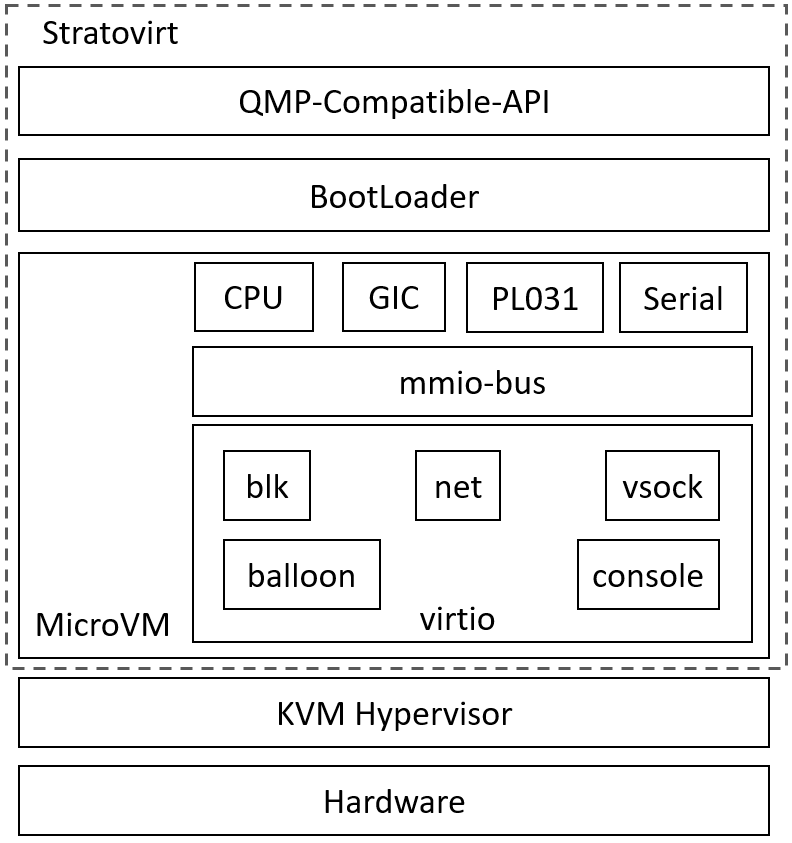

# Introduction to StratoVirt

## Overview

StratoVirt is an enterprise-level Virtual Machine Monitor (VMM) oriented to cloud data centers in the computing industry. It uses a unified architecture to support VMs, containers, and serverless scenarios. StratoVirt has competitive advantages in key technologies such as lightweight low noise, software and hardware synergy, and Rust language-level security.
StratoVirt reserves component-based assembling capabilities and APIs in the architecture design. Advanced features can be flexibly assembled as required until they evolve to support standard virtualization. In this way, StratoVirt can strike a balance between feature requirements, application scenarios, and flexibility.

## Architecture Description

The StratoVirt core architecture consists of three layers from top to bottom:

- OCI compatibility API: compatible with the QEMU Machine Protocol (QMP) and has complete OCI compatibility capabilities.
- BootLoader: discards the traditional BIOS+GRUB boot mode and implements a lighter and faster Bootloader.
- MicroVM: acts as the virtualization layer, fully utilizes the software and hardware collaboration capability to simplify the device model, and supports low-latency resource scaling capability.

Figure 1 shows the overall architecture.

**Figure 1** Overall architecture of StratoVirt

