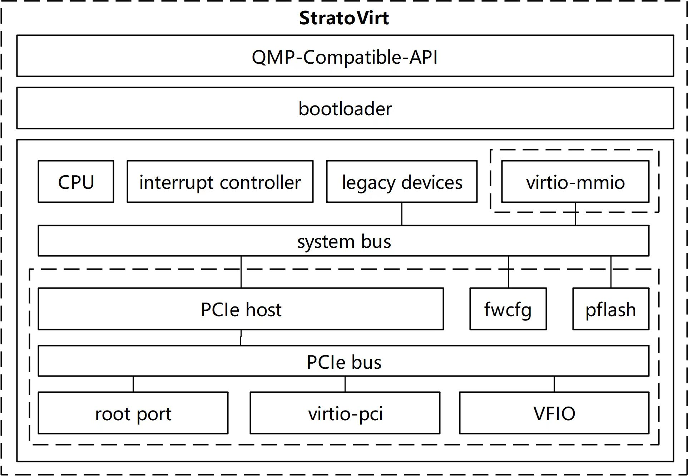

# Introduction to StratoVirt

## Overview

StratoVirt is an enterprise-class Virtual Machine Monitor (VMM) oriented to cloud data centers in the computing industry. It uses a unified architecture to support VM, container, and serverless scenarios. StratoVirt has competitive advantages in key technologies such as lightweight low noise, software and hardware synergy, and Rust language-level security.
StratoVirt reserves component-based assembling capabilities and APIs in the architecture design. Advanced features can be flexibly assembled as required until they evolve to support standard virtualization. In this way, StratoVirt can strike a balance between feature requirements, application scenarios, and flexibility.

## Architecture Description

The StratoVirt core architecture consists of three layers from top to bottom:

- External API: compatible with the QEMU Monitor Protocol (QMP), has complete OCI compatibility capabilities, and supports interconnection with libvirt.
- BootLoader: discards the traditional BIOS+GRUB boot mode to achieve fast boot in lightweight scenarios, and provides UEFI boot support for standard VMs.
- Emulated mainboard:
  - MicroVM: Fully utilizes software and hardware collaboration capabilities, simplifies device models, and provides low-latency resource scaling capabilities.
  - Standard VM: implements UEFI boot with constructed ACPI tables. Virtio-pci and VFIO devices can be attached to greatly improve the VM I/O performance.

Figure 1 shows the overall architecture.

**Figure 1** Overall architecture of StratoVirt

## Features

- Highly isolated based on hardware;
- Fast cold boot: Benefiting from the minimalist design, a microVM can be started within 50ms;
- Low memory overhead: StratoVirt works with a memory footprint less than 4MB;
- I/O enhancement: StratoVirt offers normal I/O ability and minimalist I/O device emulation;
- OCI compatibility: StratoVirt works with iSula and Kata container, and can be integrated into Kubernetes ecosystem perfectly;
- Multi-platform support: Fully supports Intel and Arm platforms;
- Expandability: StratoVirt has interface and design for importing more features, and can expand to standard virtualization support;
- Security: lower than 46 syscalls while running;

## Implementation

#### Running Architecture

- A StratoVirt VM is an independent process in Linux. The process has three types of threads: main thread, vCPU thread and I/O thread:
    - The main thread is a cycle for asynchronous collecting and processing events from external modules, such as a vCPU thread;
    - Each vCPU has a thread to handle trap events of this vCPU;
    - I/O threads can be configured for I/O devices to improve I/O performance;

## Restrictions

- Only the Linux operating system is supported; The recommended kernel version is 4.19;
- Only Linux is supported as the operating system of the VM, and the recommended kernel version is 4.19;
- Supports a maximum of 254 CPUs;
