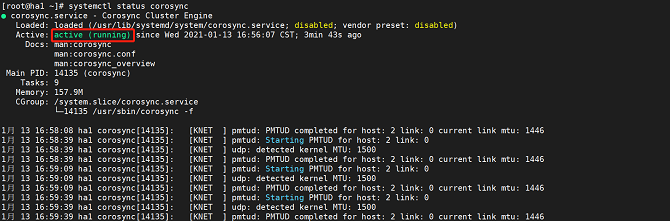

# Installing and Deploying HA

This chapter describes how to install and deploy an HA cluster.

<!-- TOC -->
- [Installing and Deploying HA](#installing-and-deploying-ha)
    - [Installation and Deployment](#installation-and-deployment)
        - [Modifying the Host Name and the **/etc/hosts** File](#modifying-the-host-name-and-the-etchosts-file)
        - [Configuring the Yum Repository](#configuring-the-yum-repository)
        - [Installing the HA Software Package Components](#installing-the-ha-software-package-components)
        - [Setting the hacluster User Password](#setting-the-hacluster-user-password)
        - [Modifying the **/etc/corosync/corosync.conf** File](#modifying-the-etccorosynccorosyncconf-file)
        - [Managing the Services](#managing-the-services)
            - [Disabling the firewall.](#disabling-the-firewall)
            - [Managing the pcs service](#managing-the-pcs-service)
            - [Managing the Pacemaker service](#managing-the-pacemaker-service)
            - [Managing the Corosync service](#managing-the-corosync-service)
        - [Performing Node Authentication](#performing-node-authentication)
        - [Accessing the Front-End Management Platform](#accessing-the-front-end-management-platform)
    <!-- /TOC -->

## Installation and Deployment

- Prepare the environment: At least two physical machines or VMs with openEuler 21.09 installed are required. (This section uses two physical machines or VMs as an example.) For details about how to install openEuler 21.09, see the *openEuler 21.09 Installation Guide*.

### Modifying the Host Name and the **/etc/hosts** File

- **Note: You need to perform the following operations on both hosts. The following takes one host as an example.**

Before using the HA software, ensure that all host names have been changed and written into the **/etc/hosts** file.

- Run the following command to change the host name:

```shell
hostnamectl set-hostname ha1
```

- Edit the **/etc/hosts** file and write the following fields:

```shell
172.30.30.65 ha1
172.30.30.66 ha2
```

### Configuring the Yum Repository

After the system is successfully installed, the Yum source is configured by default. The file location is stored in the **/etc/yum.repos.d/openEuler.repo** file. The HA software package uses the following sources:

```conf
[OS]
name=OS
baseurl=http://repo.openeuler.org/openEuler-21.09/OS/$basearch/
enabled=1
gpgcheck=1
gpgkey=http://repo.openeuler.org/openEuler-21.09/OS/$basearch/RPM-GPG-KEY-openEuler

[everything]
name=everything
baseurl=http://repo.openeuler.org/openEuler-21.09/everything/$basearch/
enabled=1
gpgcheck=1
gpgkey=http://repo.openeuler.org/openEuler-21.09/everything/$basearch/RPM-GPG-KEY-openEuler

[EPOL]
name=EPOL
baseurl=http://repo.openeuler.org/openEuler-21.09/EPOL/$basearch/
enabled=1
gpgcheck=1
gpgkey=http://repo.openeuler.org/openEuler-21.09/OS/$basearch/RPM-GPG-KEY-openEuler
```

### Installing the HA Software Package Components

```shell
yum install -y corosync pacemaker pcs fence-agents fence-virt corosync-qdevice sbd drbd drbd-utils
```

### Setting the hacluster User Password

```shell
passwd hacluster
```

### Modifying the **/etc/corosync/corosync.conf** File

```conf
totem {
        version: 2
        cluster_name: hacluster
         crypto_cipher: none
        crypto_hash: none
}
logging {         
        fileline: off
        to_stderr: yes
        to_logfile: yes
        logfile: /var/log/cluster/corosync.log
        to_syslog: yes
        debug: on
       logger_subsys {
               subsys: QUORUM
               debug: on
        }
}
quorum {
           provider: corosync_votequorum
           expected_votes: 2
           two_node: 1
       }
nodelist {
       node {
               name: ha1
               nodeid: 1
               ring0_addr: 172.30.30.65
               }
        node {
               name: ha2
               nodeid: 2
               ring0_addr: 172.30.30.66
               }
        }
```

### Managing the Services

#### Disabling the firewall

```shell
systemctl stop firewalld
```

Change the status of SELINUX in the /etc/selinux/config file to disabled.

```conf
SELINUX=disabled
```

#### Managing the pcs service

- Run the following command to start the pcs service:

```shell
systemctl start pcsd
```

- Run the following command to query the pcs service status:

```shell
systemctl status pcsd
```

The service is started successfully if the following information is displayed:


#### Managing the Pacemaker service

- Run the following command to start the Pacemaker service:

```shell
systemctl start pacemaker
```

- Run the following command to query the Pacemaker service status:

```shell
systemctl status pacemaker
```

The service is started successfully if the following information is displayed:


#### Managing the Corosync service

- Run the following command to start the Corosync service:

```shell
systemctl start corosync
```

- Run the following command to query the Corosync service status:

```shell
systemctl status corosync
```

The service is started successfully if the following information is displayed:



### Performing Node Authentication

- **Note: Run this command on only one node.**

```shell
pcs host auth ha1 ha2
```

### Accessing the Front-End Management Platform

After the preceding services are started, open the browser (Chrome or Firefox is recommended) and enter **<https://localhost:2224>** in the navigation bar.

- This page is the native management platform.


For details about how to install the management platform newly developed by the community, see <https://gitee.com/openeuler/ha-api/blob/master/docs/build.md>.

- The following is the management platform newly developed by the community.


- The next chapter describes how to quickly use an HA cluster and add an instance. For details, see the [HA Usage Example](./HA-usage-example.md).
