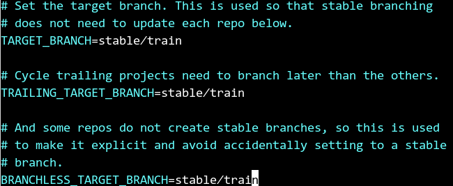
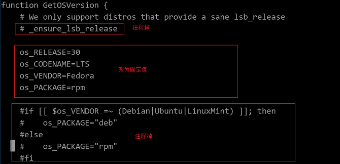
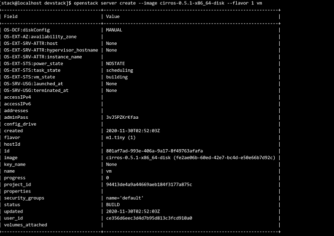

# Guide to Porting OpenStack-Train to openEuler

[[toc]]

## Software Overview

### OpenStack

OpenStack is an open source cloud computing infrastructure software project developed by the community. It provides an operating platform or toolset for deploying the cloud, offering scalable and flexible cloud computing for organizations.

OpenStack consists of several major components, such as nova、neutron、glance、keystone、horizon and so on.It supports almost all cloud environment types. The project aims to provide a cloud computing management platform that is easy-to-use, scalable, unified, and standardized. OpenStack provides an infrastructure as a service (IaaS) solution that combines complementary services, each of which provides an API for integration.

### Applicable Version

This document uses the Train release for adaptation. Unveiled on October 16, 2019, Train is the 20th release of the most widely deployed open source cloud software.

### DevStack

DevStack is a modular set of scripts that allow developers to quickly deploy OpenStack. The scripts can be run on a single node that is a bare metal server (BMS) or a virtual machine (VM). It can also be configured to deploy on multiple nodes.

By default, the core services for OpenStack are installed, but users can also modify the configuration file to deploy other services. All services are installed from source, which can be obtained from [devstack.github](https://github.com/OpenStack/devstack).

Generally, DevStack will pull the core services from git master unless configured to clone from a stable branch, such as stable/pike.

This document uses the **devstack** script for installation, deployment, and testing. The all-in-one mode is used to install DevStack on x86- or ARM-based servers. For the installation on these two architectures, only some commands or procedures are different. This document will elaborate the differences.

## Environment Configuration

It is recommended that the memory of the deployment environment be greater than 2 GB.

### Software Platform

|  Software   |Version Number  |Installation Method   | Remarks |
|:---  |:----  |:----  |:----  |
| openEuler | 20.03-LTS-SP1 |iso  | In terms of architecture, openEuler can be deployed on x86-based VMs and physical machines, but only on ARM-based physical machines.|
| gcc | 7.3.0 |Refer to Installing Required Libraries and Dependencies  |  |
| python3 | 3.7.9 |Refer to Installing Required Libraries and Dependencies |  |
| bash | 5.0 |Refer to Installing Required Libraries and Dependencies |  |
| devstack | Latest |Refer to Modifying the devstack Script and Related Configurations |[https://github.com/OpenStack/devstack](https://github.com/OpenStack/devstack) |

### Required Dependency Packages

| Software   |Version Number  |Installation Method   |
|:---  |:----  |:----  |
| python3-systemd | 234 |Refer to Installing Required Libraries and Dependencies  |
| pcp-system-tools | 4.1.3  |Refer to Installing Required Libraries and Dependencies  |
| haproxy | 2.0.14 |Refer to Installing Required Libraries and Dependencies |
| httpd httpd-devel | 2.4.43 |Refer to Installing Required Libraries and Dependencies |
| memcached | 1.5.10 |Refer to Installing Required Libraries and Dependencies |
| python3-devel | 3.7.9 |Refer to Installing Required Libraries and Dependencies |
| libffi-devel | 3.3.7 |Refer to Installing Required Libraries and Dependencies|
| open-iscsi-devel | 2.1.1 |Refer to Installing Required Libraries and Dependencies |
| libxml2 libxml2-devel python3-libxml2 | 2.9.10 |Refer to Installing Required Libraries and Dependencies |
| python3-lxml | 4.2.3 |Refer to Installing Required Libraries and Dependencies |
| libxslt libxslt-devel | 1.1.34 |Refer to Installing Required Libraries and Dependencies |
| edk2-ovmf(x86) edk2-aarch64(ARM) edk2-devel python3-edk2-devel | 202002 |Refer to Installing Required Libraries and Dependencies |
| qemu qemu-guest-agent | 4.1.0 |Refer to Installing Required Libraries and Dependencies |
| libvirt*  python3-libvirt | 6.2.0 |Refer to Installing Required Libraries and Dependencies |
| rabbitmq-server | 3.7.23 |Refer to Installing Required Libraries and Dependencies |
| python3-copr | 1.105 |Refer to Installing Required Libraries and Dependencies |
| python3-uWSGI | 2.0.19 |Refer to Installing Required Libraries and Dependencies |
| python3-mod_wsgi | 4.6.4 |Refer to Installing Required Libraries and Dependencies |
| python3-sqlalchemy python3-sqlalchemy-utils | 1.2.19 |Refer to Installing Required Libraries and Dependencies |
| python3-scss | 1.3.5 |Refer to Installing Required Libraries and Dependencies |
| openeuler-lsb | 5.0 |Refer to Installing Required Libraries and Dependencies |
| mariadb-server | 10.3.9 |Refer to Installing Required Libraries and Dependencies |

## System Configuration

### Disabling the Firewall

1. Run the following command to stop the firewall:
   
    ```
    # systemctl stop firewalld.service
    ```

2. Run the following command to disable the firewall:
   
    ```
    # systemctl disable firewalld.service
    ```

### Changing the Value of SELINUX to disabled

Run the following commands to disable SELINUX:

```
# sed -i 's/SELINUX=enforcing/SELINUX=disabled/g' /etc/sysconfig/selinux
# setenforce 0
```

## Software Compilation

### Installing Required Libraries and Dependencies (Local Yum Source)

>  **Note**   
> You can run the automation script **prep\_install.sh** to implement what is described in this section. For details, see the Appendix.

Run the following commands to install the libraries and dependencies required for executing the script:

```
# yum -y install tar git bash
# yum -y install python3-systemd
# yum -y install libffi-devel
# yum -y install open-iscsi-devel
# yum -y install libxml2-devel 
# yum -y install python3-lxml python3-libxml2 libxslt libxslt-devel
# yum -y install pcp-system-tools
# yum -y install haproxy
# yum -y install qemu qemu-guest-agent
# yum -y install libvirt*  python3-libvirt
# yum -y install httpd httpd-devel
# yum -y install memcached
# yum -y install mariadb-server
# yum -y install rabbitmq-server
# yum -y install python3-uWSGI
# yum -y install python3-mod_wsgi 
# yum -y install python3-copr
# yum -y install python3-scss
# yum -y install gcc-c++
# yum -y install python3-devel
# yum -y install python3-sqlalchemy python3-sqlalchemy-utils
# yum -y install openeuler-lsb
```

Use the Yum source to install UEFI-related libraries. The commands for the x86 and ARM architectures are as follows:

* x86 architecture

    ```
    # yum -y install edk2-ovmf edk2-devel  python3-edk2-devel
    ```

* ARM architecture

    ```
    # yum -y install edk2-aarch64 edk2-devel  python3-edk2-devel
    ```

### Creating an Execution User

1. Log in to the target host as root user and run the following command to create a stack user to execute the script:
   
    ```
    # useradd -s /bin/bash -d /home/stack -m stack
    ```

2. Perform the following operations to set root permission for the stack user:
   
    ```
    # chmod +w /etc/sudoers
    # vi /etc/sudoers //在sudoers文件的“root ALL=(ALL) ALL”下面，加入如下内容:stack  ALL=(ALL) NOPASSWD: ALL
    # chmod -w /etc/sudoers
    ```
   
    

### Downloading the devstack Script

Switch to the stack user and run the following command to download the **devstack** script file:

```
# su - stack
# git clone https://opendev.org/OpenStack/devstack  
```

Perform the following operations as the stack user.

### Modifying the Host Environment

>  **Note**   
> You can run the automation script **prep\_install.sh** to implement what is described in this section. For details, see the Appendix.

1. Run the `sudo vi /etc/httpd/conf/httpd.conf` command to add the following configuration to the `/etc/httpd/conf/httpd.conf` file as the administrator so that the third-party plug-in service can be loaded. The following figure shows the position where the configuration is added:
   
    ```
    LoadModule wsgi_module modules/mod_wsgi_python3.so
    ```
   
    

2. Run the following commands to fix the bug that occurs when Yum is used to install **edk2.x86\_64** (or **edk2.aarch64** for the ARM architecture). Pay attention to the directory and file permissions.
   
    * x86 architecture
     
        ```
        # cd /usr/share
        # sudo mkdir OVMF && sudo chmod -R 755 OVMF
        # cd OVMF
        # sudo ln -s ../edk2/ovmf/OVMF_CODE.fd OVMF_CODE.fd
        # sudo ln -s ../edk2/ovmf/OVMF_VARS.fd OVMF_VARS.fd
        ```
   
    * ARM architecture
     
        ```
	    # cd /usr/share
        # sudo mkdir AAVMF && chmod -R 755 AAVMF
        # cd AAVMF
        # sudo ln -s ../edk2/aarch64/QEMU_EFI-pflash.raw AAVMF_CODE.fd
        # sudo ln -s ../edk2/aarch64/vars-tmplate-pflash.raw AAVMF_VARS.fd
        ```

3. Add the following configuration to the `/etc/libvirt/qemu.conf` file to enable QEMU to support UEFI:
   
    * x86 architecture
     
        ```
        nvram = ["/usr/share/OVMF/OVMF_CODE.fd:/usr/share/OVMF/OVMF_VARS.fd","/usr/share/edk2/ovmf/OVMF_CODE.fd:/usr/share/edk2/ovmf/OVMF_VARS.fd"]
        ```
   
    * ARM architecture
     
        ```
        nvram = ["/usr/share/AAVMF/AAVMF_CODE.fd:/usr/share/AAVMF/AAVMF_VARS.fd","/usr/share/edk2/aarch64/QEMU_EFI-pflash.raw:/usr/share/edk2/aarch64/vars-template-pflash.raw"]
        ```

### Modifying the devstack Script and Related Configurations

1. Run the following commands to create the `local.conf` file:
   
    ```
    # cd /home/stack/devstack
    # touch local.conf 
    ```

2. Edit the `local.conf` file and configure the following information:
   
    * x86 architecture
     
        ```
        [[local|localrc]]
        HOST_IP=172.168.132.11    
        ADMIN_PASSWORD=a123456        
        DATABASE_PASSWORD=d123456
        RABBIT_PASSWORD=r123456
        SERVICE_PASSWORD=s123456
     
        disable_service tempest      
     
        GIT_BASE=http://git.trystack.cn   
        NOVNC_REPO=http://git.trystack.cn/kanaka/noVNC.git
        SPICE_REPO=http://git.trystack.cn/git/spice/spice-html5.git
     
        LOGFILE=$DEST/logs/stack.sh.log
     
        ```
   
    * ARM architecture
     
        ```
        [[local|localrc]]
        HOST_IP=192.168.122.8       
        ADMIN_PASSWORD=a123456      
        DATABASE_PASSWORD=d123456
        RABBIT_PASSWORD=r123456
        SERVICE_PASSWORD=s123456
     
        disable_service tempest      
     
        GIT_BASE=http://git.trystack.cn      
        NOVNC_REPO=http://git.trystack.cn/kanaka/noVNC.git
        SPICE_REPO=http://git.trystack.cn/git/spice/spice-html5.git
     
        DOWNLOAD_DEFAULT_IMAGES=False   
        IMAGE_URLS="https://github.com/cirros-dev/cirros/releases/download/0.5.1/cirros-0.5.1-aarch64-disk.img"
        ETCD_DOWNLOAD_LOCATION=https://mirrors.huaweicloud.com/etcd/v3.3.12/etcd-v3.3.12-linux-arm64.tar.gz       
     
        LOGFILE=$DEST/logs/stack.sh.log
     
        ```

>  **Note**   
> You can run the automation script **prep\_install.sh** to implement what is described in this section. For details, see the Appendix. 

3. Edit the `/home/stack/devstack/stackrc` file and change the value of the field shown in the following figure to **stable/train** to specify the OpenStack release to be installed.

    

4. The devstack currently does not maintain the openEuler platform. Modify the GetOSVersion function in the `/home/stack/devstack/functions-common` file so that the script uses the Fedora 30 installation mode by default. The following figure shows how to modify the function:
   
    

5. The default python-libvirt version in the script file does not adapt to openEuler. Therefore, you need to edit the `/home/stack/devstack/lib/nova_plugins/functions-libvirt` file and comment out the code related to python-libvirt installation. python-libvirt has been manually installed in the Yum source of openEuler-20.03-LTS-SP1.
   
    

6. Edit the `/home/stack/devstack/inc/python` file and change the value of the `cmd_pip` parameter to the Chinese source, as shown in the following figure:
   
    

7. Modify the `/home/stack/devstack/inc/python` file to install the **Glance** component by default.
   
    

8. Modify the `/home/stack/devstack/lib/neutron_plugins/services/l3` file and add the following configuration to the position shown in the following figure:
   
    ```
    # source openrc admin admin
    ```
   
    

9. Modify the `/home/stack/devstack/stackrc` file and change the value of `VIRTUALENV_CMD`.
   
    
   
    After the modification is completed, save the modification and exit. Then, run the following command:
   
    ```
    # pip3 install virtualenv
    ```

## Running the devstack Script to Install OpenStack

Run the following commands as the stack user to execute the **stack.sh** script to install OpenStack on a single-node system:

```
# cd  /home/stack/devstack
# FORCE=yes ./stack.sh 
    
```

The installation takes more than 10 minutes. The information displayed after the successful installation is the same for both x86 and ARM architectures. The following uses the ARM architecture as an example. If the installation is successful, the page shown in the following figure is displayed:


## Software Running

If the **devstack.sh** script is executed successfully, the specified sub-modules are installed on the current host according to the configuration information in the **local.conf** file. If no sub-module is specified in the **local.conf** file, all sub-modules are installed.

Run the following command as the stack user to log in to the OpenStack client as the administrator:

```
# source openrc admin admin
```

* Obtain the resource lists
  
    - Run the following command to obtain the image resource list:
        ```
        # openstack image list
        ```
    - Run the following command to obtain the network resource list:
        ```
        # openstack network list
        ```
    - Run the following command to obtain the VM configuration type list:
        ```
        # openstack flavor list
        ```

* Start an instance
  
    - Run the following command to create a VM using the queried resources:
        * x86 architecture
            ```
            # openstack server create -image cirros-0.5.1-x86_64-disk -flavor 1 vm
            ```
			
			
        * ARM architecture   

            ```
            # openstack server create --image cirros-0.5.1-aarch64-disk.img --flavor 1 vm
            ``` 
    - Run the following command to check the VM status:
    
        ```
        # openstack server list   //查看虚拟机状态
        ```
    
        

## Software Uninstallation

1. Run the following commands to uninstall and clear the files generated by devstack and the environment configuration:
   
    ```
    # cd /home/stack/devstack  
    # ./unstack.sh  
    # ./clean.sh
    ```

2. Delete the devstack.
   
    ```
    # cd /home/stack 
    # rm -rf devstack
    # rm -rf /opt/stack
    ```

## FAQs

### The OpenStack Project List Occasionally Fails Due to Network Problems

**Symptom** 

An error is reported when the script runs the `openstack project list` command.

**Cause Analysis** 

This is a network problem. After running the `source openrc admin admin` command, wait for a period of time and run the `openstack project list` command to make the execution take effect.

**Solution** 

Modify the `/home/stack/devstack/lib/neutron\_plugins/services/l3` file as shown in the following figure:


### The devstack@q-meta.service Occasionally Fails to Be Started

**Symptom** 

The `sudo systemctl start devstack@q-meta.service` command fails to be executed.

**Cause Analysis** 

After running the `systemctl enable devstack@q-meta.service` command, you need to wait for a period of time.

**Solution** 

After the service is enabled, wait for 30 seconds and then start the service.

Modify the `/home/stack/devstack/functions-common` file as shown in the following figure:


### The MariaDB Service Fails to Be Started

**Symptom** 

The MariaDB service fails to be started.

**Cause Analysis** 

The **mysql\_install\_db** database fails to be created, and a message is displayed indicating that the gssapi plug-in reports an error.

**Solution** 

The gssapi plug-in is not used. Run the following command to uninstall the **mariadb-gssapi-server** package:

```
# ./unstack.sh ./clean.sh && FORCE=yes ./stack.sh
```

### The Neutron Service Fails to Be Started

**Symptom** 

The Neutron service occasionally fails to be started.

**Cause Analysis** 

The network is unstable. As a result, the network node fails to be set up.

**Solution** 

Run the following command to execute the script again:

```
# ./unstack.sh && FORCE=yes ./stack.sh
```

### The pip Boot Fails

**Symptom** 

The pip boot fails, and the console displays the error message **ERROR: Links are not allowed as constraints**. 

**Cause Analysis** 

The latest pip 20.03 release has been available, but it does not adapt to openEuler.

**Solution** 

Refer to the community solution. Use the patch to modify the devstack source code. Run the following commands in the **/home/stack/devstack** directory:

```
# wget https://github.com/openstack/devstack/commit/7a3a7ce87.patch 
# sudo yum install patch -y  
# patch -p1 < 7a3a7ce87.patch
```

## Appendix

Click [prep\_install.sh](./prep_install.sh) to obtain the automation script **prep\_install.sh**. 

Save the script to the `/home/stack` directory and run the `bash -x prep_install.sh` command to install required libraries and dependencies, modify the host environment, and modify the **devstack** script and related configurations.