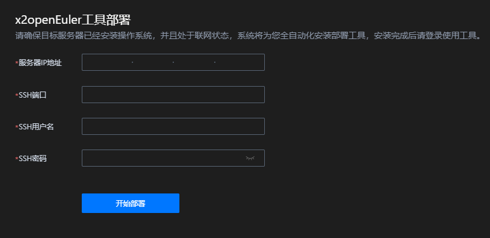
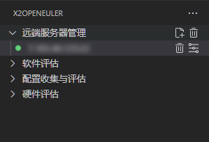
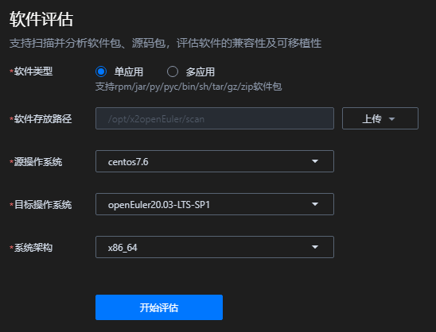
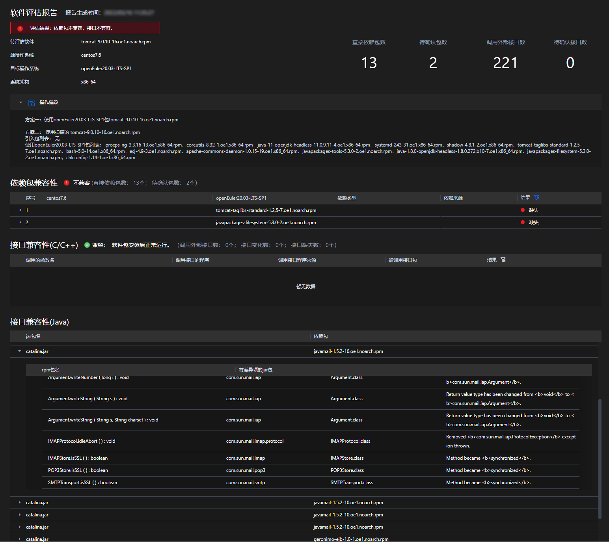
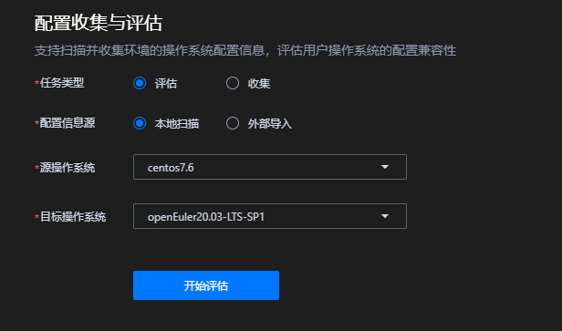
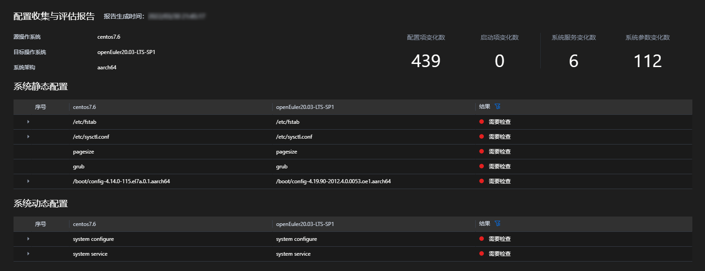
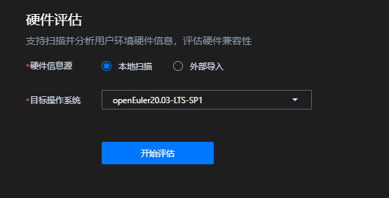
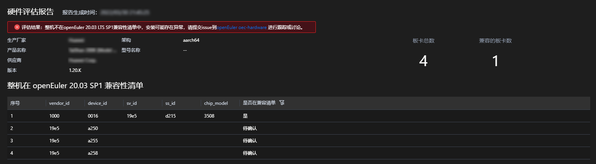
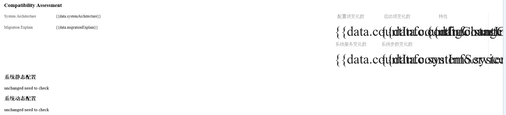
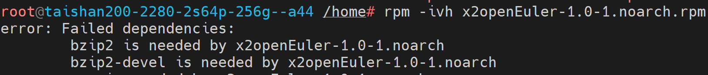

# x2openEuler User Guide
<!-- TOC -->
- [x2openEuler User Guide](#x2openeuler-user-guide)
  - [About this Document](#about-this-document)
  - [Disclaimer](#disclaimer)
  - [Overview](#overview)
  - [Installation](#installation)
    - [Installing x2openEuler](#installing-x2openeuler)
      - [Environment Requirements](#environment-requirements)
      - [Obtaining the Software Package](#obtaining-the-software-package)
      - [Performing the Installation](#performing-the-installation)
      - [Verification](#verification)
      - [Uninstallation](#uninstallation)
    - [Installing the x2openEuler Extension](#installing-the-x2openeuler-extension)
  - [Feature Guide](#feature-guide)
    - [Using x2openeuler Through the Extension](#using-x2openeuler-through-the-extension)
      - [Configuring the Remote Server](#configuring-the-remote-server)
      - [Remote Server Management](#remote-server-management)
      - [Software Assessment](#software-assessment)
        - [Description](#description)
        - [Execution](#execution)
      - [Configuration Collection and Assessment](#configuration-collection-and-assessment)
        - [Description](#information_assessment)
        - [Execution](#information_assessment_1)
      - [Hardware Assessment](#hardware-assessment)
        - [Description](#DeviceConfig)
        - [Execution](#DeviceConfig_1)
    - [Using x2openEuler through CLI](#using-x2openeuler-through-cli)
      - [Software Assessment](#SoftwareEvaluation)
        - [Description](#SoftwareEvaluation_1)
        - [Execution](#SoftwareEvaluation_2)
          - [Scanning Application Packages Using CLI](#scanning-application-packages-using-cli)
      - [Environment Configuration Collection and Assessment](#ConfigurationCollection)
        - [Description](#ConfigurationCollection_1)
        - [Execution](#ConfigurationCollection_2)
          - [Collecting Configuration and Hardware Information Using CLI Commands](#collecting-configuration-and-hardware-information-using-cli-commands)
          - [Analyzing Configuration Information Using CLI Commands](#analyzing-configuration-information-using-cli-commands)
      - [Hardware assessment](#HardwareEvaluation)
        - [Description](#HardwareEvaluation_1)
        - [Execution](#HardwareEvaluation_2)
          - [Analyzing Hardware Information Using CLI Commands](#analyzing-hardware-information-using-cli-commands)
  - [Common Operations](#common-operations)
    - [Viewing Command Parameter Description](#viewing-command-parameter-description)
    - [Viewing the x2openEuler Version Information Using CLI Commands](#viewing-the-x2openeuler-version-information-using-cli-commands)
    - [Viewing the Assessment Report Using CLI Commands](#viewing-the-assessment-report-using-cli-commands)
    - [Configuring the Yum Source for the OS](#configuring-the-yum-source-for-the-os)
    - [Querying OS Version Information](#querying-os-version-information)
    - [Configuring the Timeout Interval](#configuring-the-timeout-interval)
    - [Feedback](#feedback)
  - [FAQ](#faq)
    - [Page Not Properly Displayed When Viewing Assessment Reports](#page-not-properly-displayed-when-viewing-assessment-reports)
    - [Installation Fails Due to Missing Dependency Packages](#installation-fails-due-to-missing-dependency-packages)
  - [Appendixes](#appendixes)
    - [Running Environment Data Usage Description](#running-environment-data-usage-description)
    - [Related Links](#related-links)
    - [Terminology](#terminology)
    - [Abbreviations](#abbreviations)

<!-- /TOC -->

## About this Document

### Introduction

This document describes how to obtain the x2openEuler installation package, how to install and use the tool, and the UI and features of x2openEuler.

### Intended Audience

This document is intended for:

-   openEuler OS users
-   Software developers

### Symbol Conventions

The symbols that may be found in this guide are defined as follows:

<a name="table2622507016410"></a>
<table><thead align="left"><tr id="row1530720816410"><th class="cellrowborder" valign="top" width="20.580000000000002%" id="mcps1.1.3.1.1"><p id="p6450074116410"><a name="p6450074116410"></a><a name="p6450074116410"></a><strong id="b2136615816410"><a name="b2136615816410"></a><a name="b2136615816410"></a>Symbol</strong></p>
</th>
<th class="cellrowborder" valign="top" width="79.42%" id="mcps1.1.3.1.2"><p id="p5435366816410"><a name="p5435366816410"></a><a name="p5435366816410"></a><strong id="b5941558116410"><a name="b5941558116410"></a><a name="b5941558116410"></a>Description</strong></p>
</th>
</tr>
</thead>
<tbody><tr id="row1372280416410"><td class="cellrowborder" valign="top" width="20.580000000000002%" headers="mcps1.1.3.1.1 "><p id="p3734547016410"><a name="p3734547016410"></a><a name="p3734547016410"></a><a name="image2670064316410"></a><a name="image2670064316410"></a><span></span></p>
</td>
<td class="cellrowborder" valign="top" width="79.42%" headers="mcps1.1.3.1.2 "><p id="p1757432116410"><a name="p1757432116410"></a><a name="p1757432116410"></a>Indicates a hazard with a high level of risk which, if not avoided, will result in death or serious injury.</p>
</td>
</tr>
<tr id="row466863216410"><td class="cellrowborder" valign="top" width="20.580000000000002%" headers="mcps1.1.3.1.1 "><p id="p1432579516410"><a name="p1432579516410"></a><a name="p1432579516410"></a><a name="image4895582316410"></a><a name="image4895582316410"></a><span></span></p>
</td>
<td class="cellrowborder" valign="top" width="79.42%" headers="mcps1.1.3.1.2 "><p id="p959197916410"><a name="p959197916410"></a><a name="p959197916410"></a>Indicates a hazard with a medium level of risk which, if not avoided, could result in death or serious injury.</p>
</td>
</tr>
<tr id="row123863216410"><td class="cellrowborder" valign="top" width="20.580000000000002%" headers="mcps1.1.3.1.1 "><p id="p1232579516410"><a name="p1232579516410"></a><a name="p1232579516410"></a><a name="image1235582316410"></a><a name="image1235582316410"></a><span></span></p>
</td>
<td class="cellrowborder" valign="top" width="79.42%" headers="mcps1.1.3.1.2 "><p id="p123197916410"><a name="p123197916410"></a><a name="p123197916410"></a>Indicates a hazard with a low level of risk which, if not avoided, could result in minor or moderate injury.</p>
</td>
</tr>
<tr id="row5786682116410"><td class="cellrowborder" valign="top" width="20.580000000000002%" headers="mcps1.1.3.1.1 "><p id="p2204984716410"><a name="p2204984716410"></a><a name="p2204984716410"></a><a name="image4504446716410"></a><a name="image4504446716410"></a><span></span></p>
</td>
<td class="cellrowborder" valign="top" width="79.42%" headers="mcps1.1.3.1.2 "><p id="p4388861916410"><a name="p4388861916410"></a><a name="p4388861916410"></a>Indicates a potentially hazardous situation which, if not avoided, could result in equipment damage, data loss, performance deterioration, or unanticipated results.</p>
<p id="p1238861916410"><a name="p1238861916410"></a><a name="p1238861916410"></a>NOTICE is used to address practices not related to personal injury.</p>
</td>
</tr>
<tr id="row2856923116410"><td class="cellrowborder" valign="top" width="20.580000000000002%" headers="mcps1.1.3.1.1 "><p id="p5555360116410"><a name="p5555360116410"></a><a name="p5555360116410"></a><a name="image799324016410"></a><a name="image799324016410"></a><span></span></p>
</td>
<td class="cellrowborder" valign="top" width="79.42%" headers="mcps1.1.3.1.2 "><p id="p4612588116410"><a name="p4612588116410"></a><a name="p4612588116410"></a>Supplements the important information in the main text.</p>
<p id="p1232588116410"><a name="p1232588116410"></a><a name="p1232588116410"></a>NOTE is used to address information not related to personal injury, equipment damage, and environment deterioration.</p>
</td>
</tr>
</tbody>
</table>

### Command Format Conventions

<a name="table57396167"></a>
<table><thead align="left"><tr id="row54460779"><th class="cellrowborder" valign="top" width="30%" id="mcps1.1.3.1.1"><p id="p49246997"><a name="p49246997"></a><a name="p49246997"></a>Format</p>
</th>
<th class="cellrowborder" valign="top" width="70%" id="mcps1.1.3.1.2"><p id="p29583811"><a name="p29583811"></a><a name="p29583811"></a>Description</p>
</th>
</tr>
</thead>
<tbody><tr id="row47478494"><td class="cellrowborder" valign="top" width="30%" headers="mcps1.1.3.1.1 "><p id="p20552781"><a name="p20552781"></a><a name="p20552781"></a><strong id="b50757304"><a name="b50757304"></a><a name="b50757304"></a> Boldface</strong></p>
</td>
<td class="cellrowborder" valign="top" width="70%" headers="mcps1.1.3.1.2 "><p id="p17700929"><a name="p17700929"></a><a name="p17700929"></a>Command keywords which must be reserved exactly are in <strong id="b25090633"><a name="b25090633"></a><a name="b25090633"></a>boldface</strong>.</p>
</td>
</tr>
<tr id="row24489106"><td class="cellrowborder" valign="top" width="30%" headers="mcps1.1.3.1.1 "><p id="p37460564"><a name="p37460564"></a><a name="p37460564"></a><a name="i1600758"></a><a name="i1600758"></a>Italic</p>
</td>
<td class="cellrowborder" valign="top" width="70%" headers="mcps1.1.3.1.2 "><p id="p62552612"><a name="p62552612"></a><a name="p62552612"></a> Command parameters which must be replaced by specific values in an actual command, are in italics.</p>
</td>
</tr>
<tr id="row26102601"><td class="cellrowborder" valign="top" width="30%" headers="mcps1.1.3.1.1 "><p id="p33935949"><a name="p33935949"></a><a name="p33935949"></a>[ ]</p>
</td>
<td class="cellrowborder" valign="top" width="70%" headers="mcps1.1.3.1.2 "><p id="p64457312"><a name="p64457312"></a><a name="p64457312"></a>Items in square brackets [ ] are optional.</p>
</td>
</tr>
<tr id="row43244904"><td class="cellrowborder" valign="top" width="30%" headers="mcps1.1.3.1.1 "><p id="p13176344"><a name="p13176344"></a><a name="p13176344"></a>{ x | y | ... }</p>
</td>
<td class="cellrowborder" valign="top" width="70%" headers="mcps1.1.3.1.2 "><p id="p60650924"><a name="p60650924"></a><a name="p60650924"></a>Indicates that one option is selected from two or more options.</p>
</td>
</tr>
<tr id="row8987407"><td class="cellrowborder" valign="top" width="30%" headers="mcps1.1.3.1.1 "><p id="p56891381"><a name="p56891381"></a><a name="p56891381"></a>[ x | y | ... ]</p>
</td>
<td class="cellrowborder" valign="top" width="70%" headers="mcps1.1.3.1.2 "><p id="p44799155"><a name="p44799155"></a><a name="p44799155"></a>Indicates that one or no option is selected from two or more options.</p>
</td>
</tr>
<tr id="row539219"><td class="cellrowborder" valign="top" width="30%" headers="mcps1.1.3.1.1 "><p id="p43676810"><a name="p43676810"></a><a name="p43676810"></a>{ x | y | ... }*</p>
</td>
<td class="cellrowborder" valign="top" width="70%" headers="mcps1.1.3.1.2 "><p id="p48160684"><a name="p48160684"></a><a name="p48160684"></a>Indicates that multiple options are selected from two or more options. At least one option must be selected, and at most all options can be selected.</p>
</td>
</tr>
<tr id="row30792978"><td class="cellrowborder" valign="top" width="30%" headers="mcps1.1.3.1.1 "><p id="p11203266"><a name="p11203266"></a><a name="p11203266"></a>[ x | y | ... ]*</p>
</td>
<td class="cellrowborder" valign="top" width="70%" headers="mcps1.1.3.1.2 "><p id="p35049363"><a name="p35049363"></a><a name="p35049363"></a>Indicates that multiple options are selected or none is selected from two or more options.</p>
</td>
</tr>
<tr id="row47008815"><td class="cellrowborder" valign="top" width="30%" headers="mcps1.1.3.1.1 "><p id="p49617684"><a name="p49617684"></a><a name="p49617684"></a>&amp;&lt;1-n&gt;</p>
</td>
<td class="cellrowborder" valign="top" width="70%" headers="mcps1.1.3.1.2 "><p id="p59609453"><a name="p59609453"></a><a name="p59609453"></a>Indicates that the parameter before the & symbol can be repeated for 1~n times.</p>
</td>
</tr>
<tr id="row66723033"><td class="cellrowborder" valign="top" width="30%" headers="mcps1.1.3.1.1 "><p id="p35856572"><a name="p35856572"></a><a name="p35856572"></a>#</p>
</td>
<td class="cellrowborder" valign="top" width="70%" headers="mcps1.1.3.1.2 "><p id="p18701191"><a name="p18701191"></a><a name="p18701191"></a>Comment lines start with #.</p>
</td>
</tr>
</tbody>
</table>

### Change History

<a name="table1557726816410"></a>
<table><thead align="left"><tr id="row2942532716410"><th class="cellrowborder" valign="top" width="20.72%" id="mcps1.1.4.1.1"><p id="p3778275416410"><a name="p3778275416410"></a><a name="p3778275416410"></a><strong id="b5687322716410"><a name="b5687322716410"></a><a name="b5687322716410"></a>Issue</strong></p>
</th>
<th class="cellrowborder" valign="top" width="26.119999999999997%" id="mcps1.1.4.1.2"><p id="p5627845516410"><a name="p5627845516410"></a><a name="p5627845516410"></a><strong id="b5800814916410"><a name="b5800814916410"></a><a name="b5800814916410"></a>Date</strong></p>
</th>
<th class="cellrowborder" valign="top" width="53.16%" id="mcps1.1.4.1.3"><p id="p2382284816410"><a name="p2382284816410"></a><a name="p2382284816410"></a><strong id="b3316380216410"><a name="b3316380216410"></a><a name="b3316380216410"></a>Change Description</strong></p>
</th>
</tr>
</thead>
<tbody><tr id="row159705521204"><td class="cellrowborder" valign="top" width="20.72%" headers="mcps1.1.4.1.1 "><p id="p69701752202020"><a name="p69701752202020"></a><a name="p69701752202020"></a>03</p>
</td>
<td class="cellrowborder" valign="top" width="26.119999999999997%" headers="mcps1.1.4.1.2 "><p id="p139701152142013"><a name="p139701152142013"></a><a name="p139701152142013"></a>2022-03-30</p>
</td>
<td class="cellrowborder" valign="top" width="53.16%" headers="mcps1.1.4.1.3 "><p id="p11970952112019"><a name="p11970952112019"></a><a name="p11970952112019"></a>The issue is the third official release.</p>
</td>
</tr>
<tr id="row17666133462019"><td class="cellrowborder" valign="top" width="20.72%" headers="mcps1.1.4.1.1 "><p id="p1966693414204"><a name="p1966693414204"></a><a name="p1966693414204"></a>02</p>
</td>
<td class="cellrowborder" valign="top" width="26.119999999999997%" headers="mcps1.1.4.1.2 "><p id="p38071244142011"><a name="p38071244142011"></a><a name="p38071244142011"></a>2022-01-21</p>
</td>
<td class="cellrowborder" valign="top" width="53.16%" headers="mcps1.1.4.1.3 "><p id="p1807174422011"><a name="p1807174422011"></a><a name="p1807174422011"></a>The issue is the second official release.</p>
</td>
</tr>
<tr id="row5947359616410"><td class="cellrowborder" valign="top" width="20.72%" headers="mcps1.1.4.1.1 "><p id="p2149706016410"><a name="p2149706016410"></a><a name="p2149706016410"></a>01</p>
</td>
<td class="cellrowborder" valign="top" width="26.119999999999997%" headers="mcps1.1.4.1.2 "><p id="p648803616410"><a name="p648803616410"></a><a name="p648803616410"></a>2021-12-31</p>
</td>
<td class="cellrowborder" valign="top" width="53.16%" headers="mcps1.1.4.1.3 "><p id="p1946537916410"><a name="p1946537916410"></a><a name="p1946537916410"></a>The issue is the first official release.</p>
</td>
</tr>
</tbody>
</table>

## Disclaimer

> **NOTICE:** 
> This tool escalates the privileges of the following commands for the hardware assessment and configuration analysis purposes:
>-   /bin/cat /boot/grub2/grub.cfg
>-   /usr/sbin/lspci -nvvv
>-   /usr/sbin/lspci -xxx
>-   /bin/netstat -npl
>-   /usr/sbin/sysctl -a
>-   /usr/sbin/dmidecode -t bios -t system -t baseboard -t chassis -t processor -t memory -t cache -t connector -t slot
>-   /usr/sbin/dmidecode -s system-product-name
>-   /bin/cat /boot/efi/EFI/centos/grub.cfg
>
> This tool analyzes the system information and collect system configurations from the following files for the configuration analysis purpose:
>-   /boot/grub2/grub.cfg
>-   /etc/default/grub
>-   /usr/include/asm/unistd\_64.h
>-   /etc/fstab
>-   /etc/profile
>-   /etc/sysctl.conf
>-   /boot/conifg-\*

-   To prevent impact on services in the production environment, it is recommended that you use this tool in a non-production environment.
-   Before uploading the source code or software package, ensure that you are the owner of the source code or software package or have obtained full authorization and consent from the owner of the source code or software package.
-   No individual or organization shall use the source code for any purpose without the authorization of the source code owner. 
-   No individual or organization shall spread the source code or software package without the authorization of the owner of the source code or software package. 
-   The assessment reports are for reference only and do not have legal effect or constitute specific guidelines or legal suggestions of any kind.
-   You shall bear all risks arising from your use of the assessment suggestions and related content. 
-   The source code or software package will be uploaded to the working directory of the current server for compatibility assessment. This tool does not use the source code or software package for any other purposes. Users who log in to the same server using other user names do not have the permission to view the files in your working directory.
-   If the software package contain JAR packages, this tool decompiles the JAR packages for compatibility assessment and analysis. This tool does not use the JAR packages for any other purposes.


## Overview

The x2openEuler migration assessment tool is a lightweight end-to-end tool provided for developers based on Visual Studio Code to perform software migration analysis for openEuler. It supports software assessment, configuration collection and assessment, and hardware assessment. The x2openEuler plug-in functions as a client to invoke the server tool to scan and analyze the software to be migrated. It provides professional code migration guidance to greatly simplify the process of migrating applications from CentOS to openEuler. Before migrating software from CentOS to openEuler, you can use this tool to analyze the software portability and estimate migration workload. It addresses the problems of heavy workload, low accuracy, and poor overall efficiency in manual analysis.

The x2openEuler tool has the following features:

-   Software assessment

    Scans and assesses rpm, tar, zip, gzip, jar, py, pyc, sh, and bin packages by identifying the list of software packages on which the applications depend, and generates an assessment report in the HTML format.

-   Environment configuration collection and assessment

    Collects user environment data and generates JSON files. Collects information about hardware configurations, configuration interfaces, kernel option configuration parameters, system configuration parameters (**sysctl**, **proc**, and **sys**), environment variables, services, processes, ports, command interfaces, system call items, and device driver interfaces. Analyzes and assesses the configuration information.

-   Hardware assessment

    Checks whether the entire system (x86/AArch64) and plug-in cards (RAID/NIC/FC/IB/GPU/SSD/TPM) in the running environment are in the openEuler compatibility list.


## Installation
### Installing x2openEuler

#### Environment Requirements

> **NOTE**
>This tool applies only to development and testing environments.

##### Physical Machine Specifications

x2openEuler can be installed and run on physical machines. [Table 1](#zh-cn_topic_0000001115418740_zh-cn_topic_0228242408_zh-cn_topic_0190602888_table38928044) lists the requirements for physical machines.

**Table 1**  Hardware requirements

<a id="zh-cn_topic_0000001115418740_zh-cn_topic_0228242408_zh-cn_topic_0190602888_table38928044"></a>
<table><thead align="left"><tr id="zh-cn_topic_0000001115418740_zh-cn_topic_0228242408_zh-cn_topic_0190602888_row49314056"><th class="cellrowborder" valign="top" width="16.43%" id="mcps1.2.3.1.1"><p id="zh-cn_topic_0000001115418740_zh-cn_topic_0228242408_zh-cn_topic_0190602888_p35015599"><a name="zh-cn_topic_0000001115418740_zh-cn_topic_0228242408_zh-cn_topic_0190602888_p35015599"></a><a name="zh-cn_topic_0000001115418740_zh-cn_topic_0228242408_zh-cn_topic_0190602888_p35015599"></a> Hardware Type</p>
</th>
<th class="cellrowborder" valign="top" width="83.57%" id="mcps1.2.3.1.2"><p id="zh-cn_topic_0000001115418740_zh-cn_topic_0228242408_zh-cn_topic_0190602888_p17691262"><a name="zh-cn_topic_0000001115418740_zh-cn_topic_0228242408_zh-cn_topic_0190602888_p17691262"></a><a name="zh-cn_topic_0000001115418740_zh-cn_topic_0228242408_zh-cn_topic_0190602888_p17691262"></a> Requirements</p>
</th>
</tr>
</thead>
<tbody><tr id="zh-cn_topic_0000001115418740_zh-cn_topic_0228242408_zh-cn_topic_0190602888_row23706142"><td class="cellrowborder" valign="top" width="16.43%" headers="mcps1.2.3.1.1 "><p id="zh-cn_topic_0000001115418740_zh-cn_topic_0228242408_zh-cn_topic_0190602888_p41149367"><a name="zh-cn_topic_0000001115418740_zh-cn_topic_0228242408_zh-cn_topic_0190602888_p41149367"></a><a name="zh-cn_topic_0000001115418740_zh-cn_topic_0228242408_zh-cn_topic_0190602888_p41149367"></a> Server</p>
</td>
<td class="cellrowborder" valign="top" width="83.57%" headers="mcps1.2.3.1.2 "><a name="zh-cn_topic_0000001115418740_zh-cn_topic_0228242408_zh-cn_topic_0190602888_ul51741352182814"></a><a name="zh-cn_topic_0000001115418740_zh-cn_topic_0228242408_zh-cn_topic_0190602888_ul51741352182814"></a><ul id="zh-cn_topic_0000001115418740_zh-cn_topic_0228242408_zh-cn_topic_0190602888_ul51741352182814"><li>x86 server</li><li>Server based on the Kunpeng 916 or Kunpeng 920 processor</li></ul>
</td>
</tr>
<tr id="zh-cn_topic_0000001115418740_zh-cn_topic_0228242408_row1254216504409"><td class="cellrowborder" valign="top" width="16.43%" headers="mcps1.2.3.1.1 "><p id="zh-cn_topic_0000001115418740_zh-cn_topic_0228242408_p12542145015401"><a name="zh-cn_topic_0000001115418740_zh-cn_topic_0228242408_p12542145015401"></a><a name="zh-cn_topic_0000001115418740_zh-cn_topic_0228242408_p12542145015401"></a>CPU</p>
</td>
<td class="cellrowborder" valign="top" width="83.57%" headers="mcps1.2.3.1.2 "><p id="zh-cn_topic_0000001115418740_zh-cn_topic_0228242408_p175426505409"><a name="zh-cn_topic_0000001115418740_zh-cn_topic_0228242408_p175426505409"></a><a name="zh-cn_topic_0000001115418740_zh-cn_topic_0228242408_p175426505409"></a> At least 2 cores</p>
</td>
</tr>
<tr id="zh-cn_topic_0000001115418740_zh-cn_topic_0228242408_row339035314405"><td class="cellrowborder" valign="top" width="16.43%" headers="mcps1.2.3.1.1 "><p id="zh-cn_topic_0000001115418740_zh-cn_topic_0228242408_p13390125318409"><a name="zh-cn_topic_0000001115418740_zh-cn_topic_0228242408_p13390125318409"></a><a name="zh-cn_topic_0000001115418740_zh-cn_topic_0228242408_p13390125318409"></a> Memory</p>
</td>
<td class="cellrowborder" valign="top" width="83.57%" headers="mcps1.2.3.1.2 "><p id="zh-cn_topic_0000001115418740_zh-cn_topic_0228242408_p193901753184012"><a name="zh-cn_topic_0000001115418740_zh-cn_topic_0228242408_p193901753184012"></a><a name="zh-cn_topic_0000001115418740_zh-cn_topic_0228242408_p193901753184012"></a>At least 8 GB of available memory space</p>
</td>
</tr>
<tr id="row1950145145212"><td class="cellrowborder" valign="top" width="16.43%" headers="mcps1.2.3.1.1 "><p id="p767617616525"><a name="p767617616525"></a><a name="p767617616525"></a>Hard drive</p>
</td>
<td class="cellrowborder" valign="top" width="83.57%" headers="mcps1.2.3.1.2 "><p id="p8676460520"><a name="p8676460520"></a><a name="p8676460520"></a>20 GB or larger</p>
</td>
</tr>
</tbody>
</table>

##### Virtual Machine Specifications

x2openEuler can be installed on a VM. [Table 2](#table19116152811393) lists the VM requirements.

**Table 2**  VM requirements

<a id="table19116152811393"></a>
<table><thead align="left"><tr id="row141161128133913"><th class="cellrowborder" valign="top" width="16.43%" id="mcps1.2.3.1.1"><p id="p17116132815394"><a name="p17116132815394"></a><a name="p17116132815394"></a> Hardware Type</p>
</th>
<th class="cellrowborder" valign="top" width="83.57%" id="mcps1.2.3.1.2"><p id="p9116182811394"><a name="p9116182811394"></a><a name="p9116182811394"></a> Requirements</p>
</th>
</tr>
</thead>
<tbody><tr id="row1116132811397"><td class="cellrowborder" valign="top" width="16.43%" headers="mcps1.2.3.1.1 "><p id="p111160281398"><a name="p111160281398"></a><a name="p111160281398"></a> Architecture</p>
</td>
<td class="cellrowborder" valign="top" width="83.57%" headers="mcps1.2.3.1.2 "><p id="p12421174216461"><a name="p12421174216461"></a><a name="p12421174216461"></a>AArch64 or x86_64</p>
</td>
</tr>
<tr id="row1111610288391"><td class="cellrowborder" valign="top" width="16.43%" headers="mcps1.2.3.1.1 "><p id="p11116142803911"><a name="p11116142803911"></a><a name="p11116142803911"></a>CPU</p>
</td>
<td class="cellrowborder" valign="top" width="83.57%" headers="mcps1.2.3.1.2 "><p id="p811672883917"><a name="p811672883917"></a><a name="p811672883917"></a> At least 2 cores</p>
</td>
</tr>
<tr id="row111682813396"><td class="cellrowborder" valign="top" width="16.43%" headers="mcps1.2.3.1.1 "><p id="p111161828143911"><a name="p111161828143911"></a><a name="p111161828143911"></a> Memory</p>
</td>
<td class="cellrowborder" valign="top" width="83.57%" headers="mcps1.2.3.1.2 "><p id="p611652811393"><a name="p611652811393"></a><a name="p611652811393"></a>At least 8 GB of available memory space</p>
</td>
</tr>
<tr id="row812652017504"><td class="cellrowborder" valign="top" width="16.43%" headers="mcps1.2.3.1.1 "><p id="p1312672075016"><a name="p1312672075016"></a><a name="p1312672075016"></a> Hard drive</p>
</td>
<td class="cellrowborder" valign="top" width="83.57%" headers="mcps1.2.3.1.2 "><p id="p13126152014502"><a name="p13126152014502"></a><a name="p13126152014502"></a>20 GB or larger</p>
</td>
</tr>
</tbody>
</table>

##### Source OS Requirements

[Table 3](#table10913153312812) lists the OS requirements of the running environment.

**Table 3** Source OS requirements

<a id="table10913153312812"></a>
<table><thead align="left"><tr id="row591343318286"><th class="cellrowborder" valign="top" width="33.33333333333333%" id="mcps1.2.4.1.1"><p id="p2913193362819"><a name="p2913193362819"></a><a name="p2913193362819"></a> OS</p>
</th>
<th class="cellrowborder" valign="top" width="33.33333333333333%" id="mcps1.2.4.1.2"><p id="p491333310281"><a name="p491333310281"></a><a name="p491333310281"></a> Version</p>
</th>
<th class="cellrowborder" valign="top" width="33.33333333333333%" id="mcps1.2.4.1.3"><p id="p49131333142819"><a name="p49131333142819"></a><a name="p49131333142819"></a> OS Image File Name</p>
</th>
</tr>
</thead>
<tbody><tr id="row1091314333287"><td class="cellrowborder" rowspan="5" valign="top" width="33.33333333333333%" headers="mcps1.2.4.1.1 "><p id="p169139335286"><a name="p169139335286"></a><a name="p169139335286"></a>CentOS</p>
<p id="p20962184912117"><a name="p20962184912117"></a><a name="p20962184912117"></a></p>
</td>
<td class="cellrowborder" valign="top" width="33.33333333333333%" headers="mcps1.2.4.1.2 "><p id="p191333332811"><a name="p191333332811"></a><a name="p191333332811"></a>6.8</p>
</td>
<td class="cellrowborder" valign="top" width="33.33333333333333%" headers="mcps1.2.4.1.3 "><p id="p109131533162810"><a name="p109131533162810"></a><a name="p109131533162810"></a>x86_64: <a href="https://vault.centos.org/6.8/isos/x86_64/CentOS-6.8-x86_64-bin-DVD1.iso" target="_blank" rel="noopener noreferrer">CentOS-6.8-x86_64-bin-DVD1.iso</a></p>
</td>
</tr>
<tr id="row1191323312286"><td class="cellrowborder" rowspan="2" valign="top" headers="mcps1.2.4.1.1 "><p id="p15913933192812"><a name="p15913933192812"></a><a name="p15913933192812"></a>7.6</p>
</td>
<td class="cellrowborder" valign="top" headers="mcps1.2.4.1.2 "><p id="p1091343372814"><a name="p1091343372814"></a><a name="p1091343372814"></a>x86_64: <a href="https://vault.centos.org/7.6.1810/isos/x86_64/CentOS-7-x86_64-Everything-1810.iso" target="_blank" rel="noopener noreferrer">CentOS-7-x86_64-Everything-1810.iso</a></p>
</td>
</tr>
<tr id="row85491652181211"><td class="cellrowborder" valign="top" headers="mcps1.2.4.1.1 "><p id="p95491852121215"><a name="p95491852121215"></a><a name="p95491852121215"></a>aarch: <a href="https://vault.centos.org/altarch/7.6.1810/isos/aarch64/CentOS-7-aarch64-Everything-1810.iso" target="_blank" rel="noopener noreferrer">CentOS-7-aarch64-Everything-1810.iso</a></p>
</td>
</tr>
<tr id="row69133332289"><td class="cellrowborder" rowspan="2" valign="top" headers="mcps1.2.4.1.1 "><p id="p69139337287"><a name="p69139337287"></a><a name="p69139337287"></a>8.2</p>
</td>
<td class="cellrowborder" valign="top" headers="mcps1.2.4.1.2 "><p id="p1991333312281"><a name="p1991333312281"></a><a name="p1991333312281"></a>x86_64: <a href="https://vault.centos.org/8.2.2004/isos/x86_64/CentOS-8.2.2004-x86_64-dvd1.iso" target="_blank" rel="noopener noreferrer">CentOS-8.2.2004-x86_64-dvd1.iso</a></p>
</td>
</tr>
<tr id="row29622497214"><td class="cellrowborder" valign="top" headers="mcps1.2.4.1.1 "><p id="p13962154911212"><a name="p13962154911212"></a><a name="p13962154911212"></a>aarch: <a href="https://vault.centos.org/8.2.2004/isos/aarch64/CentOS-8.2.2004-aarch64-dvd1.iso" target="_blank" rel="noopener noreferrer">CentOS-8.2.2004-aarch64-dvd1.iso</a></p>
</td>
</tr>
</tbody>
</table>

> **NOTE**
>If the server cannot access the network or the Yum source of the OS has been modified, an OS image file is required for installing dependency packages during the tool installation. For details about the required OS image file, see [Table 3](#table10913153312812). Obtain the image file of the corresponding OS version.

##### Target OS Requirements

[Table 4](#table7664131873211) lists the requirements for the target OS.

**Table 4**  Target OS requirements

<a id="table7664131873211"></a>
<table><thead align="left"><tr id="row76649182329"><th class="cellrowborder" valign="top" width="33.33333333333333%" id="mcps1.2.4.1.1"><p id="p20664161812328"><a name="p20664161812328"></a><a name="p20664161812328"></a> OS</p>
</th>
<th class="cellrowborder" valign="top" width="33.33333333333333%" id="mcps1.2.4.1.2"><p id="p566471863217"><a name="p566471863217"></a><a name="p566471863217"></a> Version</p>
</th>
<th class="cellrowborder" valign="top" width="33.33333333333333%" id="mcps1.2.4.1.3"><p id="p16664161873219"><a name="p16664161873219"></a><a name="p16664161873219"></a> OS Image File Name</p>
</th>
</tr>
</thead>
<tbody><tr id="row7664918123213"><td class="cellrowborder" rowspan="2" valign="top" width="33.33333333333333%" headers="mcps1.2.4.1.1 "><p id="p5664151813326"><a name="p5664151813326"></a><a name="p5664151813326"></a>openEuler</p>
</td>
<td class="cellrowborder" rowspan="2" valign="top" width="33.33333333333333%" headers="mcps1.2.4.1.2 "><p id="p106645188326"><a name="p106645188326"></a><a name="p106645188326"></a>20.03 LTS SP1</p>
</td>
<td class="cellrowborder" valign="top" width="33.33333333333333%" headers="mcps1.2.4.1.3 "><p id="p13664141810328"><a name="p13664141810328"></a><a name="p13664141810328"></a>x86_64: <a href="https://repo.openeuler.org/openEuler-20.03-LTS-SP1/ISO/x86_64/openEuler-20.03-LTS-SP1-everything-x86_64-dvd.iso" target="_blank" rel="noopener noreferrer">openEuler-20.03-LTS-SP1-everything-x86_64-dvd.iso</a></p>
</td>
</tr>
<tr id="row8624654182312"><td class="cellrowborder" valign="top" headers="mcps1.2.4.1.1 "><p id="p1962505452311"><a name="p1962505452311"></a><a name="p1962505452311"></a>aarch: <a href="https://repo.openeuler.org/openEuler-20.03-LTS-SP1/ISO/aarch64/openEuler-20.03-LTS-SP1-everything-aarch64-dvd.iso" target="_blank" rel="noopener noreferrer">openEuler-20.03-LTS-SP1-everything-aarch64-dvd.iso</a></p>
</td>
</tr>
</tbody>
</table>

##### Dependencies

[Table 5](#table134317232714) lists the dependencies that will be installed during the x2openEuler installation.

**Table 5**  Dependencies

<a id="table134317232714"></a>
<table><thead align="left"><tr id="row543102315720"><th class="cellrowborder" valign="top" width="32.803280328032805%" id="mcps1.2.4.1.1"><p id="p44312231711"><a name="p44312231711"></a><a name="p44312231711"></a>Edition</p>
</th>
<th class="cellrowborder" valign="top" width="33.863386338633866%" id="mcps1.2.4.1.2"><p id="p6439231279"><a name="p6439231279"></a><a name="p6439231279"></a>Component</p>
</th>
<th class="cellrowborder" valign="top" width="33.33333333333333%" id="mcps1.2.4.1.3"><p id="p1543122319711"><a name="p1543122319711"></a><a name="p1543122319711"></a> Description</p>
</th>
</tr>
</thead>
<tbody><tr id="row106271317111411"><td class="cellrowborder" rowspan="24" valign="top" width="32.803280328032805%" headers="mcps1.2.4.1.1 "><p id="p55131015101115"><a name="p55131015101115"></a><a name="p55131015101115"></a>x2openEuler</p>
</td>
<td class="cellrowborder" valign="top" width="33.863386338633866%" headers="mcps1.2.4.1.2 "><p id="p56272017121413"><a name="p56272017121413"></a><a name="p56272017121413"></a>bzip2</p>
</td>
<td class="cellrowborder" valign="top" width="33.33333333333333%" headers="mcps1.2.4.1.3 "><p id="p1762713174142"><a name="p1762713174142"></a><a name="p1762713174142"></a> Decompression tool.</p>
</td>
</tr>
<tr id="row18411317224"><td class="cellrowborder" valign="top" headers="mcps1.2.4.1.1 "><p id="p351931229"><a name="p351931229"></a><a name="p351931229"></a>bzip2-devel</p>
</td>
<td class="cellrowborder" valign="top" headers="mcps1.2.4.1.2 "><p id="p10514314223"><a name="p10514314223"></a><a name="p10514314223"></a> Decompression tool.</p>
</td>
</tr>
<tr id="row1035810381755"><td class="cellrowborder" valign="top" headers="mcps1.2.4.1.1 "><p id="p9359113815519"><a name="p9359113815519"></a><a name="p9359113815519"></a>cmake</p>
</td>
<td class="cellrowborder" valign="top" headers="mcps1.2.4.1.2 "><p id="p133591738858"><a name="p133591738858"></a><a name="p133591738858"></a> Automatic build tool.</p>
</td>
</tr>
<tr id="row1832913589143"><td class="cellrowborder" valign="top" headers="mcps1.2.4.1.1 "><p id="p14329858161414"><a name="p14329858161414"></a><a name="p14329858161414"></a>dmidecode</p>
</td>
<td class="cellrowborder" valign="top" headers="mcps1.2.4.1.2 "><p id="p1329358141418"><a name="p1329358141418"></a><a name="p1329358141418"></a>Tool package for querying hardware information.</p>
</td>
</tr>
<tr id="row10253537115"><td class="cellrowborder" valign="top" headers="mcps1.2.4.1.1 "><p id="p4253163111111"><a name="p4253163111111"></a><a name="p4253163111111"></a>libxml2</p>
</td>
<td class="cellrowborder" valign="top" headers="mcps1.2.4.1.2 "><p id="p152531235119"><a name="p152531235119"></a><a name="p152531235119"></a>XML parsing function library.</p>
</td>
</tr>
<tr id="row85135155115"><td class="cellrowborder" valign="top" headers="mcps1.2.4.1.1 "><p id="p1151317150113"><a name="p1151317150113"></a><a name="p1151317150113"></a>libxml2-devel</p>
</td>
<td class="cellrowborder" valign="top" headers="mcps1.2.4.1.2 "><p id="p165139158117"><a name="p165139158117"></a><a name="p165139158117"></a>XML parsing function library.</p>
</td>
</tr>
<tr id="row1455035122"><td class="cellrowborder" valign="top" headers="mcps1.2.4.1.1 "><p id="p955133181214"><a name="p955133181214"></a><a name="p955133181214"></a>libxslt</p>
</td>
<td class="cellrowborder" valign="top" headers="mcps1.2.4.1.2 "><p id="p755934128"><a name="p755934128"></a><a name="p755934128"></a>XML parsing library.</p>
</td>
</tr>
<tr id="row14334191515120"><td class="cellrowborder" valign="top" headers="mcps1.2.4.1.1 "><p id="p933461517121"><a name="p933461517121"></a><a name="p933461517121"></a>libxslt-devel</p>
</td>
<td class="cellrowborder" valign="top" headers="mcps1.2.4.1.2 "><p id="p533421581220"><a name="p533421581220"></a><a name="p533421581220"></a>XML parsing library.</p>
</td>
</tr>
<tr id="row12721552111815"><td class="cellrowborder" valign="top" headers="mcps1.2.4.1.1 "><p id="p62721352181819"><a name="p62721352181819"></a><a name="p62721352181819"></a>libffi</p>
</td>
<td class="cellrowborder" valign="top" headers="mcps1.2.4.1.2 "><p id="p1272411511912"><a name="p1272411511912"></a><a name="p1272411511912"></a>Dependency package for compiling Python software.</p>
</td>
</tr>
<tr id="row960719881913"><td class="cellrowborder" valign="top" headers="mcps1.2.4.1.1 "><p id="p176071881191"><a name="p176071881191"></a><a name="p176071881191"></a>libffi-devel</p>
</td>
<td class="cellrowborder" valign="top" headers="mcps1.2.4.1.2 "><p id="p1576773361917"><a name="p1576773361917"></a><a name="p1576773361917"></a>Dependency package for compiling Python software.</p>
</td>
</tr>
<tr id="row98714484130"><td class="cellrowborder" valign="top" headers="mcps1.2.4.1.1 "><p id="p03001649181315"><a name="p03001649181315"></a><a name="p03001649181315"></a>net-tools</p>
</td>
<td class="cellrowborder" valign="top" headers="mcps1.2.4.1.2 "><p id="p6871548151312"><a name="p6871548151312"></a><a name="p6871548151312"></a> Network command toolbox.</p>
</td>
</tr>
<tr id="row16343948096"><td class="cellrowborder" valign="top" headers="mcps1.2.4.1.1 "><p id="p77522055391"><a name="p77522055391"></a><a name="p77522055391"></a>java-1.8.0-openjdk</p>
</td>
<td class="cellrowborder" valign="top" headers="mcps1.2.4.1.2 "><p id="p53449481895"><a name="p53449481895"></a><a name="p53449481895"></a>Java software development kit.</p>
</td>
</tr>
<tr id="row381417534915"><td class="cellrowborder" valign="top" headers="mcps1.2.4.1.1 "><p id="p19814125311918"><a name="p19814125311918"></a><a name="p19814125311918"></a>java-1.8.0-openjdk-devel</p>
</td>
<td class="cellrowborder" valign="top" headers="mcps1.2.4.1.2 "><p id="p1881415531912"><a name="p1881415531912"></a><a name="p1881415531912"></a>Java software development kit.</p>
</td>
</tr>
<tr id="row42899517918"><td class="cellrowborder" valign="top" headers="mcps1.2.4.1.1 "><p id="p182891851597"><a name="p182891851597"></a><a name="p182891851597"></a>java-1.8.0-openjdk-headless</p>
</td>
<td class="cellrowborder" valign="top" headers="mcps1.2.4.1.2 "><p id="p62891551493"><a name="p62891551493"></a><a name="p62891551493"></a>Java software development kit.</p>
</td>
</tr>
<tr id="row827915781611"><td class="cellrowborder" valign="top" headers="mcps1.2.4.1.1 "><p id="p727920578160"><a name="p727920578160"></a><a name="p727920578160"></a>openssl</p>
</td>
<td class="cellrowborder" valign="top" headers="mcps1.2.4.1.2 "><p id="p1127935715163"><a name="p1127935715163"></a><a name="p1127935715163"></a>Dependency package for compiling Python software.</p>
</td>
</tr>
<tr id="row2088690121712"><td class="cellrowborder" valign="top" headers="mcps1.2.4.1.1 "><p id="p9886130141711"><a name="p9886130141711"></a><a name="p9886130141711"></a>openssl-devel</p>
</td>
<td class="cellrowborder" valign="top" headers="mcps1.2.4.1.2 "><p id="p48866061713"><a name="p48866061713"></a><a name="p48866061713"></a>Dependency package for compiling Python software.</p>
</td>
</tr>
<tr id="row1015525512612"><td class="cellrowborder" valign="top" headers="mcps1.2.4.1.1 "><p id="p215511551615"><a name="p215511551615"></a><a name="p215511551615"></a>python3</p>
</td>
<td class="cellrowborder" valign="top" headers="mcps1.2.4.1.2 "><p id="p17155145519620"><a name="p17155145519620"></a><a name="p17155145519620"></a> Automatic build tool.</p>
</td>
</tr>
<tr id="row2834198201314"><td class="cellrowborder" valign="top" headers="mcps1.2.4.1.1 "><p id="p13834208151317"><a name="p13834208151317"></a><a name="p13834208151317"></a>pciutils</p>
</td>
<td class="cellrowborder" valign="top" headers="mcps1.2.4.1.2 "><p id="p1834168121317"><a name="p1834168121317"></a><a name="p1834168121317"></a>Portable library for accessing the PCI bus configuration register.</p>
</td>
</tr>
<tr id="row2071617380109"><td class="cellrowborder" valign="top" headers="mcps1.2.4.1.1 "><p id="p11717203821014"><a name="p11717203821014"></a><a name="p11717203821014"></a>rpm-build</p>
</td>
<td class="cellrowborder" valign="top" headers="mcps1.2.4.1.2 "><p id="p1971773818106"><a name="p1971773818106"></a><a name="p1971773818106"></a>RPM package build and management tool.</p>
</td>
</tr>
<tr id="row79560318419"><td class="cellrowborder" valign="top" headers="mcps1.2.4.1.1 "><p id="p1695783118410"><a name="p1695783118410"></a><a name="p1695783118410"></a>sqlite</p>
</td>
<td class="cellrowborder" valign="top" headers="mcps1.2.4.1.2 "><p id="p932314515418"><a name="p932314515418"></a><a name="p932314515418"></a> Database. The version must be 3.7.17 or later.</p>
<div class="note" id="note132312511445"><a name="note132312511445"></a><a name="note132312511445"></a><span class="notetitle"> Note: </span><div class="notebody"><p id="p103231351846"><a name="p103231351846"></a><a name="p103231351846"></a>For CentOS 6.8, the SQLite database integrated by the x2openEuler tool is used.</p>
</div></div>
</td>
</tr>
<tr id="row11177173920208"><td class="cellrowborder" valign="top" headers="mcps1.2.4.1.1 "><p id="p1733744019203"><a name="p1733744019203"></a><a name="p1733744019203"></a>sqlite-devel</p>
</td>
<td class="cellrowborder" valign="top" headers="mcps1.2.4.1.2 "><p id="p1717710393202"><a name="p1717710393202"></a><a name="p1717710393202"></a>Dependency package for accessing SQLite data.</p>
</td>
</tr>
<tr id="row183060366151"><td class="cellrowborder" valign="top" headers="mcps1.2.4.1.1 "><p id="p530633614151"><a name="p530633614151"></a><a name="p530633614151"></a>util-linux</p>
</td>
<td class="cellrowborder" valign="top" headers="mcps1.2.4.1.2 "><p id="p123061336151515"><a name="p123061336151515"></a><a name="p123061336151515"></a>Standard software suite of Linux.</p>
</td>
</tr>
<tr id="row478811574152"><td class="cellrowborder" valign="top" headers="mcps1.2.4.1.1 "><p id="p137893572155"><a name="p137893572155"></a><a name="p137893572155"></a>zlib</p>
</td>
<td class="cellrowborder" valign="top" headers="mcps1.2.4.1.2 "><p id="p0789125717159"><a name="p0789125717159"></a><a name="p0789125717159"></a> Decompression tool.</p>
</td>
</tr>
<tr id="row5544122122114"><td class="cellrowborder" valign="top" headers="mcps1.2.4.1.1 "><p id="p4544112262111"><a name="p4544112262111"></a><a name="p4544112262111"></a>zlib-devel</p>
</td>
<td class="cellrowborder" valign="top" headers="mcps1.2.4.1.2 "><p id="p35441722102111"><a name="p35441722102111"></a><a name="p35441722102111"></a> Decompression tool.</p>
</td>
</tr>
</tbody>
</table>

#### Obtaining the Software Package

[Table 6](#zh-cn_topic_0000001161818615_zh-cn_topic_0255418563_zh-cn_topic_0190602888_table960911505409) lists the software packages used for the installation.

**Table 6** Tool installation packages

<a id="zh-cn_topic_0000001161818615_zh-cn_topic_0255418563_zh-cn_topic_0190602888_table960911505409"></a>
<table><thead align="left"><tr id="zh-cn_topic_0000001161818615_zh-cn_topic_0255418563_zh-cn_topic_0190602888_row66102503401"><th class="cellrowborder" valign="top" width="50%" id="mcps1.2.4.1.1"><p id="zh-cn_topic_0000001161818615_zh-cn_topic_0255418563_zh-cn_topic_0190602888_p86102050194016"><a name="zh-cn_topic_0000001161818615_zh-cn_topic_0255418563_zh-cn_topic_0190602888_p86102050194016"></a><a name="zh-cn_topic_0000001161818615_zh-cn_topic_0255418563_zh-cn_topic_0190602888_p86102050194016"></a>Package Name</p>
</th>
<th class="cellrowborder" valign="top" width="20%" id="mcps1.2.4.1.2"><p id="zh-cn_topic_0000001161818615_zh-cn_topic_0255418563_zh-cn_topic_0190602888_p106105501402"><a name="zh-cn_topic_0000001161818615_zh-cn_topic_0255418563_zh-cn_topic_0190602888_p106105501402"></a><a name="zh-cn_topic_0000001161818615_zh-cn_topic_0255418563_zh-cn_topic_0190602888_p106105501402"></a> Package Description</p>
</th>
<th class="cellrowborder" valign="top" width="30%" id="mcps1.2.4.1.3"><p id="zh-cn_topic_0000001161818615_zh-cn_topic_0255418563_zh-cn_topic_0190602888_p16610125024012"><a name="zh-cn_topic_0000001161818615_zh-cn_topic_0255418563_zh-cn_topic_0190602888_p16610125024012"></a><a name="zh-cn_topic_0000001161818615_zh-cn_topic_0255418563_zh-cn_topic_0190602888_p16610125024012"></a>How to Obtain</p>
</th>
</tr>
</thead>
<tbody><tr id="zh-cn_topic_0000001161818615_zh-cn_topic_0255418563_zh-cn_topic_0190602888_row1561155054014"><td class="cellrowborder" valign="top" width="50%" headers="mcps1.2.4.1.1 "><p id="p55021148172513"><a name="p55021148172513"></a><a name="p55021148172513"></a>x2openEuler-x.x-x.aarch64.rpm</p>
<p id="p135420127383"><a name="p135420127383"></a><a name="p135420127383"></a>x2openEuler-x.x-x.x86_64.rpm</p>
</td>
<td class="cellrowborder" valign="top" width="20%" headers="mcps1.2.4.1.2 "><p id="zh-cn_topic_0000001161818615_zh-cn_topic_0255418563_zh-cn_topic_0190602888_p2611195014406"><a name="zh-cn_topic_0000001161818615_zh-cn_topic_0255418563_zh-cn_topic_0190602888_p2611195014406"></a><a name="zh-cn_topic_0000001161818615_zh-cn_topic_0255418563_zh-cn_topic_0190602888_p2611195014406"></a><span id="text13523152262720"><a name="text13523152262720"></a><a name="text13523152262720"></a>x2openEuler</span> installation package</p>
</td>
<td class="cellrowborder" valign="top" width="20%" headers="mcps1.2.4.1.3 "><a name="ul14693194665314"></a><a name="ul14693194665314"></a><ul id="ul14693194665314"><a href="https://repo.oepkgs.net/openEuler/rpm/openEuler-20.03-LTS-SP1/contrib/x2openEuler/" target="_blank" rel="noopener noreferrer">The oepkgs community</a></ul>
</td>
</tr>
</tbody>
</table>

> **NOTE**
>*x.x-x* in the software package name indicates the version.

#### Performing the Installation

##### Prerequisites

-   An x86 server or a Kunpeng server powered by 916 or 920 processors is available.
-   The OS has been installed. For details about the OS version requirements, see [Table 3](#table10913153312812).
-   An SSH remote login tool, such as Xshell, MobaXterm, and PuTTY, is installed.

##### Procedure

> **NOTICE**
>-   Before installing x2openEuler, ensure that the network connection is normal. If the OS cannot access the network, configure the Yum source by referring to [Configuring the Yum Source for the OS](#configuring-the-yum-source-for-the-os).
>-   Before reinstalling x2openEuler, uninstall x2openEuler of other versions.

This section uses CentOS (x86_64) as an example to describe how to install the x2openEuler tool using the following methods:

###### Manually Downloading and Installing x2openEuler on the Server

1.  Use an SSH tool to remotely log in to the CentOS CLI as a common user.
2.  Run the following command to switch to the **root** user.
    ```
    su - root
    ```

3.  Use an SSH remote login tool to copy the x2openEuler installation package obtained in [Obtaining the Software Package](#obtaining-the-software-package) to any path.
4.  Run the following command to go to the directory where the x2openEuler installation package is stored:

    ```
    cd PATH
    ```

5.  Run the following command to install x2openEuler. In the command, **x2openEuler-x.x-x.x86\_64.rpm** indicates the name of the x2openEuler installation package. Replace it with the actual name.

    > **NOTICE**
    >x2openEuler can be used only by the **x2openEuler** user. Therefore, the **x2openEuler** user is automatically created during the x2openEuler installation. If the **x2openEuler** user already exists in the system, ensure that the **x2openEuler** user has the permissions to use x2openEuler before installing the tool. Otherwise, the tool may fail to run properly.

    ```
    yum install x2openEuler-x.x-x.x86_64.rpm
    ```

    After the installation is complete, the user-related directories are as follows:

    ```
    /var/log/x2openEuler         # Directory for storing tool log files
    /var/log/aparser             # Directory for storing the log files of the configuration collector.
    /opt/x2openEuler/output      # Default report output directory
    /opt/x2openEuler/update      # Configuration file update directory (used to store update packages and corresponding license files)
    /etc/x2openEuler/config      # Directory for storing static configuration files
    /etc/x2openEuler/sqlite      # Directory for storing database files
    /usr/local/x2openEuler       # Directory for storing program files
    /opt/x2openEuler/source      # Directory for storing compatibility data files
    ```

    > **NOTE**
    >During the installation, if the message **error: Failed dependencies:** is displayed, the dependency packages are missing. Rectify the fault by referring to [Installation Fails Due to Missing Dependency Packages](#installation-fails-due-to-missing-dependency-packages).

6.  Set the password for the **x2openEuler** user.
        ```
        passwd x2openEuler
        ```

        > NOTE:
        >Password for logging in as the user. The password must meet the following complexity requirements:
        >-   Contains 8 to 32 characters.
        >-   Contains at least two types of the following characters: uppercase letters, lowercase letters, digits, and special characters (\`\~!@\#$%^&\*\(\)-\_=+\\|\[\{\}\];:'",<.\>/?).
        >-   Cannot contain any space.
        >-   Cannot be the same as the user name.


7.  Run the following command to switch to the **x2openEuler** user and the home directory **/home/x2openEuler** of the **x2openEuler** user:

    > **NOTICE**
    >The x2openEuler tool can be used only by the **x2openEuler** user. Before using the tool, switch to the **x2openEuler** user and change the working directory to the home directory of the **x2openEuler** user.

    ```
    su - x2openEuler
    ```

###### Using the x2openEuler Extension for One-click Installation
1.  After [Installing the x2openEuler Extension](#installing-the-x2openeuler-extension) Click . Read and accept the disclaimer. The **Configuration Guide** page of the x2openEuler extension is displayed. Choose **Deploying x2openEuler**. The tool deployment page is displayed.

    **Figure 1**  Configuration guide page<a id="fig18564682219"></a> 
    

2.  On the tool deployment page, configure tool deployment parameters to install x2openEuler. For details about the parameters, see [Table 7](#table689465815346).

    **Figure 2**Tool deployment page <a id="fig136096478334"></a> 
    

    **Table 7** Deployment parameters

    <a id="table689465815346"></a>
    <table><thead align="left"><tr id="row1789445813411"><th class="cellrowborder" valign="top" width="24.08%" id="mcps1.2.3.1.1"><p id="p2894195820342"><a name="p2894195820342"></a><a name="p2894195820342"></a> Parameter</p>
    </th>
    <th class="cellrowborder" valign="top" width="75.92%" id="mcps1.2.3.1.2"><p id="p68943582343"><a name="p68943582343"></a><a name="p68943582343"></a> Description</p>
    </th>
    </tr>
    </thead>
    <tbody><tr id="row1289405863417"><td class="cellrowborder" valign="top" width="24.08%" headers="mcps1.2.3.1.1 "><p id="p689413585348"><a name="p689413585348"></a><a name="p689413585348"></a> Server IP Address</p>
    </td>
    <td class="cellrowborder" valign="top" width="75.92%" headers="mcps1.2.3.1.2 "><p id="p289475810348"><a name="p289475810348"></a><a name="p289475810348"></a> IP address of the target server where x2openEuler is to be deployed.</p>
    </td>
    </tr>
    <tr id="row6894558123415"><td class="cellrowborder" valign="top" width="24.08%" headers="mcps1.2.3.1.1 "><p id="p178943589343"><a name="p178943589343"></a><a name="p178943589343"></a>SSH Port</p>
    </td>
    <td class="cellrowborder" valign="top" width="75.92%" headers="mcps1.2.3.1.2 "><p id="p7894115819349"><a name="p7894115819349"></a><a name="p7894115819349"></a>SSH port used to log in to the target server. The default value is 22.</p>
    </td>
    </tr>
    <tr id="row20894135820344"><td class="cellrowborder" valign="top" width="24.08%" headers="mcps1.2.3.1.1 "><p id="p148943583346"><a name="p148943583346"></a><a name="p148943583346"></a>SSH User Name</p>
    </td>
    <td class="cellrowborder" valign="top" width="75.92%" headers="mcps1.2.3.1.2 "><p id="p7894125803420"><a name="p7894125803420"></a><a name="p7894125803420"></a>Logging in to the target server as the <strong>root</strong> user is required to deploy x2openEuler. The value of this parameter must be <strong>root</strong>.</p>
    <div class="note" id="note1866716712453"><a name="note1866716712453"></a><a name="note1866716712453"></a><span class="notetitle"> Note: </span><div class="notebody"><p id="p2066710754518"><a name="p2066710754518"></a><a name="p2066710754518"></a> User <strong>root</strong> has all permissions. After the tool is deployed, you are advised to forbid user <strong>root</strong> to log in to the system using SSH to ensure the security of the running environment.</p>
    </div></div>
    </td>
    </tr>
    <tr id="row08941158173419"><td class="cellrowborder" valign="top" width="24.08%" headers="mcps1.2.3.1.1 "><p id="p11894135843416"><a name="p11894135843416"></a><a name="p11894135843416"></a>SSH Password</p>
    </td>
    <td class="cellrowborder" valign="top" width="75.92%" headers="mcps1.2.3.1.2 "><p id="p6894558103415"><a name="p6894558103415"></a><a name="p6894558103415"></a> Password of the <strong>root</strong> user for logging in to the target server to deploy the tool.</p>
    </td>
    </tr>
    </tbody>
    </table>

3.  After you click **Deploy**, the **Preparing for Installation** page is displayed. Set the password for the **x2openEuler** user. If the target server is not connected to the Internet, upload the x2openEuler installation package. Click **Next** to deploy the tool.

    **Figure 3** Preparing for installation<a id="fig05381329135314"></a> 
    

    > **NOTE:**
    >The password must meet the following complexity requirements:
    >-   Contains 8 to 32 characters.
    >-   Contains at least two types of the following characters: uppercase letters, lowercase letters, digits, and special characters (\`\~!@\#$%^&\*\(\)-\_=+\\|\[\{\}\];:'",<.\>/?).
    >-   Cannot contain any space.
    >-   Cannot be the same as the user name.

4.  After the tool is installed, the message **x2openEuler is deployed successfully** is displayed. Click **Configure Remote Server** and configure the server by referring to [Configuring Remote Servers](#configuring-remote-servers). If the tool fails to be deployed, deploy the tool again by referring to the information in the output at the bottom of VS Code.

#### Verification

##### Verifying the Installation Through Extension

Log in to the x2openEuler extension page by referring to [Using x2openeuler Through the Extension](#using-x2openeuler-through-the-extension). If the login is successful, x2openEuler is installed.

##### Verifying the Installation Through CLI

1.  Use an SSH tool to remotely log in to the CentOS CLI.
2.  Run the following command to switch to the **x2openEuler** user:

    ```
    su - x2openEuler
    ```

3.  Run the following command to check the tool version:

    ```
    x2openEuler -v
    ```

    If the following information is displayed, the installation is successful. In the command output, **x.x.x** indicates the version.

    ```
    x2openEuler x.x.x
    ```


#### Uninstallation

##### Prerequisites<a name="zh-cn_topic_0000001115258840_zh-cn_topic_0228242372_zh-cn_topic_0190602892_section19751229183511"></a>
No tasks are running.

##### Procedure<a name="zh-cn_topic_0000001115258840_zh-cn_topic_0228242372_zh-cn_topic_0190602892_section1963172611259"></a>

1.  Use an SSH tool to remotely log in to the CLI as the **root** user.
2.  Run the following command to uninstall the x2openEuler tool:

    **rpm -e x2openEuler**

    > **NOTE**
    >-   If a task is running, you need to stop the task or wait until the task is complete. Otherwise, the tasks that are running will be stopped.
    >-   After the uninstallation is complete, delete the **x2openEuler** user to ensure system security.


### Installing the x2openEuler Extension

#### Environment Requirements

The current version has been verified on the following OSs:

-   Windows 10
-   macOS 10.0 x86
-   macOS 10.0 ARM

#### Installation Methods
> **NOTE:**
>This extension is compatible with the latest VS Code.

##### Installing the Extension from Visual Studio Code Marketplace

In the **Extensions** menu of Visual Studio Code, search for **x2openEuler** and click **Install**.

After the installation is complete, choose  from the primary side bar to open the x2openEuler extension.

## Feature Guide

> **NOTICE:**
>-   If a user is idle for a long time after logging in to the server, security risks may exist. You are advised to perform the steps in [Configuring the Timeout Interval](#configuring-the-timeout-interval) on the server to improve system security.
>-   You are not advised to use multiple clients to operate the x2openEuler tool on the same remote server at the same time.
>-   When different clients upload files with the same name to the same remote server, the older file is overwritten.

### Using x2openeuler Through the Extension
 
#### Configuring the Remote Server

##### Prerequisites

The x2openEuler tool and x2openEuler extension have been installed.

##### Procedure

1.  Click  in the primary side bar of VS Code to open the x2openEuler extension.
2.  In the primary side bar, click **Configure Remote Server**. The page shown in [Figure 1](#zh-cn_topic_0303172996_zh-cn_topic_0301201532_fig15306105118267) is displayed. [Table 8](#zh-cn_topic_0303172992_zh-cn_topic_0301071780_table1357716326151) describes the parameters.

    **Figure 4**  Configuring the remote server<a id="zh-cn_topic_0303172996_zh-cn_topic_0301201532_fig15306105118267"></a>  
    

    **Table 8** Parameters for configuring the remote server

    <a id="zh-cn_topic_0303172992_zh-cn_topic_0301071780_table1357716326151"></a>
    <table><thead align="left"><tr id="zh-cn_topic_0303172992_zh-cn_topic_0301071780_row205771932111515"><th class="cellrowborder" valign="top" width="24%" id="mcps1.2.3.1.1"><p id="zh-cn_topic_0303172992_zh-cn_topic_0301071780_p1357713241519"><a name="zh-cn_topic_0303172992_zh-cn_topic_0301071780_p1357713241519"></a><a name="zh-cn_topic_0303172992_zh-cn_topic_0301071780_p1357713241519"></a> Parameter</p>
    </th>
    <th class="cellrowborder" valign="top" width="76%" id="mcps1.2.3.1.2"><p id="zh-cn_topic_0303172992_zh-cn_topic_0301071780_p0577232191520"><a name="zh-cn_topic_0303172992_zh-cn_topic_0301071780_p0577232191520"></a><a name="zh-cn_topic_0303172992_zh-cn_topic_0301071780_p0577232191520"></a> Description</p>
    </th>
    </tr>
    <tbody><tr id="zh-cn_topic_0303172992_zh-cn_topic_0301071780_row25781532161513"><td class="cellrowborder" valign="top" width="24%" headers="mcps1.2.3.1.1 "><p id="zh-cn_topic_0303172992_zh-cn_topic_0301071780_p55781932131514"><a name="zh-cn_topic_0303172992_zh-cn_topic_0301071780_p55781932131514"></a><a name="zh-cn_topic_0303172992_zh-cn_topic_0301071780_p55781932131514"></a> Server IP Address</p>
    </td>
    <td class="cellrowborder" valign="top" width="76%" headers="mcps1.2.3.1.2 "><p id="zh-cn_topic_0303172992_zh-cn_topic_0301071780_p12578732141510"><a name="zh-cn_topic_0303172992_zh-cn_topic_0301071780_p12578732141510"></a><a name="zh-cn_topic_0303172992_zh-cn_topic_0301071780_p12578732141510"></a>IP address of the remote server where x2openEuler is successfully deployed.</p>
    </td>
    </tr>
    <tr id="zh-cn_topic_0303172992_zh-cn_topic_0301071780_row957814326154"><td class="cellrowborder" valign="top" width="24%" headers="mcps1.2.3.1.1 "><p id="zh-cn_topic_0303172992_zh-cn_topic_0301071780_p1257883211520"><a name="zh-cn_topic_0303172992_zh-cn_topic_0301071780_p1257883211520"></a><a name="zh-cn_topic_0303172992_zh-cn_topic_0301071780_p1257883211520"></a>SSH Port</p>
    </td>
    <td class="cellrowborder" valign="top" width="76%" headers="mcps1.2.3.1.2 "><p id="zh-cn_topic_0303172992_zh-cn_topic_0301071780_p191432022192511"><a name="zh-cn_topic_0303172992_zh-cn_topic_0301071780_p191432022192511"></a><a name="zh-cn_topic_0303172992_zh-cn_topic_0301071780_p191432022192511"></a>SSH port set during the tool installation.</p>
    <div class="note" id="zh-cn_topic_0303172992_zh-cn_topic_0301071780_note17100172632511"><a name="zh-cn_topic_0303172992_zh-cn_topic_0301071780_note17100172632511"></a><a name="zh-cn_topic_0303172992_zh-cn_topic_0301071780_note17100172632511"></a><span class="notetitle"> Note: </span><div class="notebody"><p id="zh-cn_topic_0303172992_zh-cn_topic_0301071780_p1510072642512"><a name="zh-cn_topic_0303172992_zh-cn_topic_0301071780_p1510072642512"></a><a name="zh-cn_topic_0303172992_zh-cn_topic_0301071780_p1510072642512"></a> If the firewall on the server is enabled, ensure that the SSH port (<strong>22</strong> by default) has been enabled on the firewall before using x2openEuler.</p>
    </div></div>
    </td>
    </tr>
    <tr id="zh-cn_topic_0303172992_row82481366213"><td class="cellrowborder" valign="top" width="24%" headers="mcps1.2.3.1.1 "><p id="p8722101917387"><a name="p8722101917387"></a><a name="p8722101917387"></a>SSH User Name</p>
    </td>
    <td class="cellrowborder" valign="top" width="76%" headers="mcps1.2.3.1.2 "><p id="p317810436378"><a name="p317810436378"></a><a name="p317810436378"></a>SSH user name (<strong>x2openEuler</strong>) set during the tool installation.</p>
    </td>
    </tr>
    <tr id="row12312324113819"><td class="cellrowborder" valign="top" width="24%" headers="mcps1.2.3.1.1 "><p id="p331292416389"><a name="p331292416389"></a><a name="p331292416389"></a>SSH Password</p>
    </td>
    <td class="cellrowborder" valign="top" width="76%" headers="mcps1.2.3.1.2 "><p id="p203128247387"><a name="p203128247387"></a><a name="p203128247387"></a>Password of the SSH user (<strong>x2openEuler</strong>) set during the tool installation.</p>
    </td>
    </tr>
    </tbody>
    </table>

3.  Set the parameters based on the site requirements and click **Start Configuration**.

    After the configuration is successful, the **x2openEuler Wizard** page is displayed, as shown in [Figure 5](#zh-cn_topic_0303172996_zh-cn_topic_0301201532_fig162740213572). In **x2openEuler Wizard**, you can create an assessment task immediately.

    **Figure 5**  x2openEuler Wizard <a id="zh-cn_topic_0303172996_zh-cn_topic_0301201532_fig162740213572"></a> 
    

#### Remote Server Management

##### Prerequisites

-   The x2openEuler extension has been installed.
-   The remote server has been configured.

##### Procedure

1.  In the primary side bar of VS Code, select **Remote Server Management**. You can click  for [Configuring Remote Servers](#configuring-remote-servers).

    **Figure 6** Remote Server Management<a id="fig6482251121820"></a> 
    

2.  In the primary side bar of VS Code, select **Remote Server Management**. You can click  to clear the saved servers. In the dialog box that is displayed in the lower right corner, click **OK** to clear the saved servers.

    **Figure 7** Clearing the saved servers <a id="fig5228134851419"></a> 
    

3.  In the primary side bar of VS Code, select **Remote Server Management**. You can click  to expand the saved server list. Select a saved server record, click  to clear the saved server, or click  to edit the server.

#### Software Assessment

##### Description

Software migration assessment helps users assess the migrating from CentOS 6.8, 7.6, and 8.2 to openEuler 20.03 LTS SP1.

##### Execution

###### Prerequisites

The x2openEuler extension has been installed and the remote server has been configured.

The x2openEuler tool has been installed.

###### Procedure

1.  In the primary side bar, select **Software Assessment** and click  to create a task.
2.  In the analysis task creation area, select **Single Application** or **Multiple Applications** and set the following parameters:

    > **NOTE:**
    >**Single Application** and **Multiple Applications** are mutually exclusive. Select either of them based on the site requirements.

    **Figure 8** Creating a software assessment task<a id="zh-cn_topic_0303172996_zh-cn_topic_0301201532_fig15306105118267"></a> 
    

    **Table 9** Parameters for creating a software assessment task

    <a id="zh-cn_topic_0303172996_zh-cn_topic_0301201532_table1342162861919"></a>
    <table><thead align="left"><tr id="zh-cn_topic_0303172996_zh-cn_topic_0301201532_row1342122820197"><th class="cellrowborder" valign="top" width="25.81%" id="mcps1.2.3.1.1"><p id="zh-cn_topic_0303172996_zh-cn_topic_0301201532_p53433283196"><a name="zh-cn_topic_0303172996_zh-cn_topic_0301201532_p53433283196"></a><a name="zh-cn_topic_0303172996_zh-cn_topic_0301201532_p53433283196"></a> Parameter</p>
    </th>
    <th class="cellrowborder" valign="top" width="74.19%" id="mcps1.2.3.1.2"><p id="zh-cn_topic_0303172996_zh-cn_topic_0301201532_p1634342821915"><a name="zh-cn_topic_0303172996_zh-cn_topic_0301201532_p1634342821915"></a><a name="zh-cn_topic_0303172996_zh-cn_topic_0301201532_p1634342821915"></a> Description</p>
    </th>
    </tr>
    </thead>
    <tbody><tr id="zh-cn_topic_0303172996_zh-cn_topic_0301201532_row113435282199"><td class="cellrowborder" valign="top" width="25.81%" headers="mcps1.2.3.1.1 "><p id="zh-cn_topic_0303172996_zh-cn_topic_0301201532_p133431628131916"><a name="zh-cn_topic_0303172996_zh-cn_topic_0301201532_p133431628131916"></a><a name="zh-cn_topic_0303172996_zh-cn_topic_0301201532_p133431628131916"></a> Software Type</p>
    </td>
    <td class="cellrowborder" valign="top" width="74.19%" headers="mcps1.2.3.1.2 "><a name="ul17227257459"></a><a name="ul17227257459"></a><ul id="ul17227257459"><li> Single Application: Assesses the rpm/tar/zip/gzip/jar/py/pyc/sh/bin software package. </li><li>Multiple Applications: Assesses multiple binary files in a directory, and generates an assessment report for each binary file</li></ul>
    </td>
    </tr>
    <tr id="zh-cn_topic_0303172996_zh-cn_topic_0301201532_row1352711322206"><td class="cellrowborder" valign="top" width="25.81%" headers="mcps1.2.3.1.1 "><p id="zh-cn_topic_0303172996_zh-cn_topic_0301201532_p125272032152011"><a name="zh-cn_topic_0303172996_zh-cn_topic_0301201532_p125272032152011"></a><a name="zh-cn_topic_0303172996_zh-cn_topic_0301201532_p125272032152011"></a>Software Package Path</p>
    </td>
    <td class="cellrowborder" valign="top" width="74.19%" headers="mcps1.2.3.1.2 "><p id="zh-cn_topic_0303172996_zh-cn_topic_0301201532_p052720327206"><a name="zh-cn_topic_0303172996_zh-cn_topic_0301201532_p052720327206"></a><a name="zh-cn_topic_0303172996_zh-cn_topic_0301201532_p052720327206"></a> Click <strong>Upload</strong> to upload the software package.</p>
    <div class="note" id="zh-cn_topic_0303172996_zh-cn_topic_0301201532_note8722162652217"><a name="zh-cn_topic_0303172996_zh-cn_topic_0301201532_note8722162652217"></a><a name="zh-cn_topic_0303172996_zh-cn_topic_0301201532_note8722162652217"></a><span class="notetitle"> Note: In the </span><div class="notebody"><a name="zh-cn_topic_0303172996_zh-cn_topic_0284246214_ul01971525134213"></a><a name="zh-cn_topic_0303172996_zh-cn_topic_0284246214_ul01971525134213"></a><ul id="zh-cn_topic_0303172996_zh-cn_topic_0284246214_ul01971525134213"><li> In the Multiple Application mode, you can only upload a folder containing multiple binary files. </li><li>Only one software package can be uploaded at a time. The size of the software package must be less than or equal to 2 GB, and the size of the decompressed software file must be less than or equal to half of the remaining drive space. </li><li>The rpm/tar/zip/gzip/jar/py/pyc/sh/bin software packages are supported. </li></ul>
    </div></div>
    </td>
    </tr>
    <tr id="zh-cn_topic_0303172996_zh-cn_topic_0301201532_row143431228141912"><td class="cellrowborder" valign="top" width="25.81%" headers="mcps1.2.3.1.1 "><p id="zh-cn_topic_0303172996_zh-cn_topic_0301201532_p5343112851919"><a name="zh-cn_topic_0303172996_zh-cn_topic_0301201532_p5343112851919"></a><a name="zh-cn_topic_0303172996_zh-cn_topic_0301201532_p5343112851919"></a> Source OS</p>
    </td>
    <td class="cellrowborder" valign="top" width="74.19%" headers="mcps1.2.3.1.2 "><p id="zh-cn_topic_0303172996_zh-cn_topic_0301201532_p15343192813190"><a name="zh-cn_topic_0303172996_zh-cn_topic_0301201532_p15343192813190"></a><a name="zh-cn_topic_0303172996_zh-cn_topic_0301201532_p15343192813190"></a> Select the source OS. Available options:</p>
    <a name="ul1360149175511"></a><a name="ul1360149175511"></a><ul id="ul1360149175511"><li>CentOS 6.8</li><li>CentOS 7.6</li><li>CentOS 8.2</li></ul>
    </td>
    </tr>
    <tr id="zh-cn_topic_0303172996_zh-cn_topic_0301201532_row163441028151920"><td class="cellrowborder" valign="top" width="25.81%" headers="mcps1.2.3.1.1 "><p id="zh-cn_topic_0303172996_zh-cn_topic_0301201532_p93441628191913"><a name="zh-cn_topic_0303172996_zh-cn_topic_0301201532_p93441628191913"></a><a name="zh-cn_topic_0303172996_zh-cn_topic_0301201532_p93441628191913"></a> Target OS</p>
    </td>
    <td class="cellrowborder" valign="top" width="74.19%" headers="mcps1.2.3.1.2 "><p id="zh-cn_topic_0303172996_zh-cn_topic_0301201532_p1434432815197"><a name="zh-cn_topic_0303172996_zh-cn_topic_0301201532_p1434432815197"></a><a name="zh-cn_topic_0303172996_zh-cn_topic_0301201532_p1434432815197"></a> Select the target OS. Available options:</p>
    <p id="p7533121420569"><a name="p7533121420569"></a><a name="p7533121420569"></a>openEuler 20.03-LTS-SP1</p>
    </td>
    </tr>
    <tr id="row52112218588"><td class="cellrowborder" valign="top" width="25.81%" headers="mcps1.2.3.1.1 "><p id="p22115221587"><a name="p22115221587"></a><a name="p22115221587"></a> System Architecture</p>
    </td>
    The <td class="cellrowborder" valign="top" width="74.19%" headers="mcps1.2.3.1.2 "><p id="p92142285818"><a name="p92142285818"></a><a name="p92142285818"></a> Select the system architecture. Available options:</p>
    <a name="ul198673985812"></a><a name="ul198673985812"></a><ul id="ul198673985812"><li>x86_64</li><li>aarch64</li></ul>
    </td>
    </tr>
    </tbody>
    </table>

3.  Click **Start Assessment** to generate an assessment report.

    After the assessment is complete, the assessment report details page is displayed, as shown in [Figure 9](#zh-cn_topic_0303172996_fig1916475495217). For details about the parameters, see [Table 10](#zh-cn_topic_0303172996_zh-cn_topic_0301201532_table102746212572).

    > **NOTE:**
    >-   During the task execution, you can click **Cancel Assessment** to cancel the assessment task.
    >-   In the analysis report list, you can click the report name of a specified analysis task to view the analysis report.
    >-   The name of the analysis report consists of the name of the scanned software package and the time when the report is generated.

    **Figure 9** Software assessment report<a id="zh-cn_topic_0303172996_fig1916475495217"></a> 
    

    **Table 10** Parameters in the software assessment report

    <a id="zh-cn_topic_0303172996_zh-cn_topic_0301201532_table102746212572"></a>
    <table><thead align="left"><tr id="zh-cn_topic_0303172996_zh-cn_topic_0284251757_row171675241281"><th class="cellrowborder" valign="top" width="24.09%" id="mcps1.2.3.1.1"><p id="zh-cn_topic_0303172996_zh-cn_topic_0284251757_p1316713247285"><a name="zh-cn_topic_0303172996_zh-cn_topic_0284251757_p1316713247285"></a><a name="zh-cn_topic_0303172996_zh-cn_topic_0284251757_p1316713247285"></a> Parameter</p>
    </th>
    <th class="cellrowborder" valign="top" width="75.91%" id="mcps1.2.3.1.2"><p id="zh-cn_topic_0303172996_zh-cn_topic_0284251757_p10167132422819"><a name="zh-cn_topic_0303172996_zh-cn_topic_0284251757_p10167132422819"></a><a name="zh-cn_topic_0303172996_zh-cn_topic_0284251757_p10167132422819"></a> Description</p>
    </th>
    </tr>
    </thead>
    <tbody><tr id="zh-cn_topic_0303172996_zh-cn_topic_0284251757_row8321944141610"><td class="cellrowborder" valign="top" width="24.09%" headers="mcps1.2.3.1.1 "><p id="zh-cn_topic_0303172996_zh-cn_topic_0284251757_p19321044131618"><a name="zh-cn_topic_0303172996_zh-cn_topic_0284251757_p19321044131618"></a><a name="zh-cn_topic_0303172996_zh-cn_topic_0284251757_p19321044131618"></a> Assessment Result</p>
    </td>
    <td class="cellrowborder" valign="top" width="75.91%" headers="mcps1.2.3.1.2 "><p id="zh-cn_topic_0303172996_zh-cn_topic_0284251757_p1232194421610"><a name="zh-cn_topic_0303172996_zh-cn_topic_0284251757_p1232194421610"></a><a name="zh-cn_topic_0303172996_zh-cn_topic_0284251757_p1232194421610"></a> Displays the assessment task information, such as the assessed software name, source OS, target OS, system architecture, and assessment result.</p>
    </td>
    </tr>
    <tr id="row199271743191916"><td class="cellrowborder" valign="top" width="24.09%" headers="mcps1.2.3.1.1 "><p id="p17928943151914"><a name="p17928943151914"></a><a name="p17928943151914"></a> Suggested Operation</p>
    </td>
    The <td class="cellrowborder" valign="top" width="75.91%" headers="mcps1.2.3.1.2 "><p id="p102412211204"><a name="p102412211204"></a><a name="p102412211204"></a> Provides solutions based on the compatibility result in the assessment report.</p>
    </td>
    </tr>
    <tr id="zh-cn_topic_0303172996_zh-cn_topic_0284251757_row4141183071214"><td class="cellrowborder" valign="top" width="24.09%" headers="mcps1.2.3.1.1 "><p id="zh-cn_topic_0303172996_zh-cn_topic_0284251757_p1514418300123"><a name="zh-cn_topic_0303172996_zh-cn_topic_0284251757_p1514418300123"></a><a name="zh-cn_topic_0303172996_zh-cn_topic_0284251757_p1514418300123"></a> Dependency Package Compatibility</p>
    </td>
    <td class="cellrowborder" valign="top" width="75.91%" headers="mcps1.2.3.1.2 "><p id="zh-cn_topic_0303172996_zh-cn_topic_0284251757_p1972516235213"><a name="zh-cn_topic_0303172996_zh-cn_topic_0284251757_p1972516235213"></a><a name="zh-cn_topic_0303172996_zh-cn_topic_0284251757_p1972516235213"></a> Displays the direct dependencies required for software installation and the RPM packages corresponding to the dependency files on each OS.</p>
    <a name="ul128786216505"></a><a name="ul128786216505"></a><ul id="ul128786216505"><li>If the names and the versions of the RPM dependency package on the OSs are the same, <strong id="b158505286164"><a name="b158505286164"></a><a name="b158505286164"></a>Version is not changed</strong> is displayed.</li><li>If the versions of the RPM dependency package on the OSs are not the same, <strong id="b4550174319266"><a name="b4550174319266"></a><a name="b4550174319266"></a>Version is changed</strong> is displayed.</li><li>If the names of the RPM dependency package on the OSs are not the same, but the interface is not changed, <strong id="b18719201102816"><a name="b18719201102816"></a><a name="b18719201102816"></a>Package name is changed</strong> is displayed.</li><li>If the RPM package is missing on the target OS, <strong id="b8591917122810"><a name="b8591917122810"></a><a name="b8591917122810"></a>Missing</strong> is displayed.</li><li>If the RPM package is missing on the source OS, or the interface is changed, <strong id="b1323592572814"><a name="b1323592572814"></a><a name="b1323592572814"></a>Needs to be checked</strong> is displayed.</li><li>If the RPM package is missing on both source and target OSs, the package is placed in other, and <strong id="b6143192612919"><a name="b6143192612919"></a><a name="b6143192612919"></a>Needs to be checked</strong> is displayed.</li></ul>
    </td>
    </tr>
    <tr id="row19363134015510"><td class="cellrowborder" valign="top" width="24.09%" headers="mcps1.2.3.1.1 "><p id="p93635405511"><a name="p93635405511"></a><a name="p93635405511"></a> Interface Compatibility (C/C++)</p>
    </td>
    <td class="cellrowborder" valign="top" width="75.91%" headers="mcps1.2.3.1.2 "><a name="ul17593171015716"></a><a name="ul17593171015716"></a><ul id="ul17593171015716"><li> Invoked Function: Name of the function invoked in the assessed software. </li><li>Invoked Interface Program: Program that is invoked by a different external interface in the assessed software. </li><li>Results:<a name="ul1219994015015"></a><a name="ul1219994015015"></a><ul id="ul1219994015015"><li>Removed: Indicates a missing interface. </li><li>Changed: Indicates a changed input parameter, return value, or implementation of the function.</li></ul>
    </li><li>In the expanded details:<a name="ul3678201912312"></a><a name="ul3678201912312"></a><ul id="ul3678201912312"><li> OS: Indicates the name of the OS for the migration assessment. </li><li>Function Name: Representation of the interface. </li><li>File Name: Name of the file where the external interface is located. </li><li>Dependency Package: External .so library where the interface is located. </li><li>Interface Differences: Changes of the external interface. If an interface has been removed, this item is left blank. </li></ul>
    </li></ul>
    </td>
    </tr>
    <tr id="row1161611412259"><td class="cellrowborder" valign="top" width="24.09%" headers="mcps1.2.3.1.1 "><p id="p66172452511"><a name="p66172452511"></a><a name="p66172452511"></a> Interface Compatibility (JDK)</p>
    </td>
    <td class="cellrowborder" valign="top" width="75.91%" headers="mcps1.2.3.1.2 "><p id="p1461718417253"><a name="p1461718417253"></a><a name="p1461718417253"></a> Changes of the JDK interface invoked in the JAR package of the minimum JDK that meets the running environment requirements on the source OS.</p>
    <a name="ul180521153612"></a><a name="ul180521153612"></a><ul id="ul180521153612"><li>openEuler JDK: Minimum JDK version that meets the JAR package running environment requirements on openEuler. </li><li>Object build JDK: JDK version corresponding to the scanned JAR package. </li><li>JAR Package Name: Name of the JAR package scanned. </li><li>Method Name: Name of the method whose interface is changed. </li><li>Function Signature: Signature of the function whose interface is changed. </li><li>Package Name: Name of the package (packageName+className) where the method with a changed interface is located. </li><li>Difference: Interface difference. </li></ul>
    </td>
    </tr>
    <tr id="row647911561358"><td class="cellrowborder" valign="top" width="24.09%" headers="mcps1.2.3.1.1 "><p id="p4346301760"><a name="p4346301760"></a><a name="p4346301760"></a> Interface Compatibility (Java)</p>
    </td>
    <td class="cellrowborder" valign="top" width="75.91%" headers="mcps1.2.3.1.2 "><p id="p1479956654"><a name="p1479956654"></a><a name="p1479956654"></a>JAR interface differences describe the changes of the interfaces of the current JAR packages on the target OS.</p>
    <a name="ul118954081110"></a><a name="ul118954081110"></a><ul id="ul118954081110"><li> Invoked JAR package: Name of the JAR package that is invoked. </li><li>RPM Package: RPM package to which the current JAR package belongs. </li><li>In the expanded details, <a name="ul1615774151116"></a><a name="ul1615774151116"></a><ul id="ul1615774151116"><li><strong>centos7.6 Methods</strong> indicates the name of the interface from CentOS 7.6 that is incompatible with openEuler. <li>Package: JAR package to which the incompatible interface belongs. </li><li>Class: Class to which the incompatible interface belongs. </li><li>openEuler20.03-LTS-SP1 Change: Changes of incompatible interface on openEuler20.03-LTS-SP1. The changes include method removal, returned parameters, method signatures, method modifiers, and exceptions. </li></ul>
    </li></ul>
    </td>
    </tr>
    </tbody>
    </table>

4.  On the **Create Task** page, you can download or delete the software assessment reports from the **Historical Reports** area on the right.

    > **NOTE:**
    >The assessment reports are stored in the **/opt/x2openEuler/output/** directory in the running environment. If you delete an assessment report from the historical reports on the page, the assessment report will not be completely deleted. To completely delete an assessment report, delete the file in the running environment.


#### Configuration Collection and Assessment
##### <span id ="information_assessment">Description</span>

The configuration collection and assessment function helps users automatically identify the current server environment architecture and collects configuration information from the user environment for assessment and analysis.

##### <span id ="information_assessment_1">Execution</span>

###### Prerequisites

The x2openEuler extension has been installed and the remote server has been configured.

The x2openEuler tool has been installed.

###### Procedure

1.  In the primary side bar, choose **Configuration Collection and Assessment** and click to create a task.
2.  In the assessment task creation area, select **Assessment** or **Collection** and set the following parameters:

    > **NOTE:**
    >-   **Assessment** and **Collection** are Mutually exclusive. Select either of them as required.
    >-   The **Assessment** function can be used to assess the configuration information of the current server environment or analyze the environment of other servers using **Externally imported**.

    **Figure 10** Creating a configuration collection and assessment task <a id="zh-cn_topic_0303172996_zh-cn_topic_0301201532_fig15306105118267"></a> 
    

    **Table 11** Parameters for creating a configuration collection and assessment task

    <a id="zh-cn_topic_0303172996_zh-cn_topic_0301201532_table1342162861919"></a>
    <table><thead align="left"><tr id="zh-cn_topic_0303172996_zh-cn_topic_0301201532_row1342122820197"><th class="cellrowborder" valign="top" width="25.81%" id="mcps1.2.3.1.1"><p id="zh-cn_topic_0303172996_zh-cn_topic_0301201532_p53433283196"><a name="zh-cn_topic_0303172996_zh-cn_topic_0301201532_p53433283196"></a><a name="zh-cn_topic_0303172996_zh-cn_topic_0301201532_p53433283196"></a> Parameter</p>
    </th>
    <th class="cellrowborder" valign="top" width="74.19%" id="mcps1.2.3.1.2"><p id="zh-cn_topic_0303172996_zh-cn_topic_0301201532_p1634342821915"><a name="zh-cn_topic_0303172996_zh-cn_topic_0301201532_p1634342821915"></a><a name="zh-cn_topic_0303172996_zh-cn_topic_0301201532_p1634342821915"></a> Description</p>
    </th>
    </tr>
    </thead>
    <tbody><tr id="zh-cn_topic_0303172996_zh-cn_topic_0301201532_row113435282199"><td class="cellrowborder" valign="top" width="25.81%" headers="mcps1.2.3.1.1 "><p id="zh-cn_topic_0303172996_zh-cn_topic_0301201532_p133431628131916"><a name="zh-cn_topic_0303172996_zh-cn_topic_0301201532_p133431628131916"></a><a name="zh-cn_topic_0303172996_zh-cn_topic_0301201532_p133431628131916"></a> Task Type</p>
    </td>
    <td class="cellrowborder" valign="top" width="74.19%" headers="mcps1.2.3.1.2 "><a name="ul17227257459"></a><a name="ul17227257459"></a><ul id="ul17227257459"><li> Assessment: Automatically identifies and assesses the current server environment architecture and configuration information. </li><li>Collection: Collects configuration and hardware information about the current server. </li></ul>
    </td>
    </tr>
    <tr id="zh-cn_topic_0303172996_zh-cn_topic_0301201532_row1352711322206"><td class="cellrowborder" valign="top" width="25.81%" headers="mcps1.2.3.1.1 "><p id="p1232083718193"><a name="p1232083718193"></a><a name="p1232083718193"></a> Configuration Information Source</p>
    </td>
    <td class="cellrowborder" valign="top" width="74.19%" headers="mcps1.2.3.1.2 "><a name="ul9818175261915"></a><a name="ul9818175261915"></a><ul id="ul9818175261915"><li> Local: Scans and collects configuration information about the current server environment. </li><li>Externally Imported: Allows you to upload the information collected using <strong>Configuration and Assessment</strong> in the tar.gz format. <div class="note" id="note1347151022115"><a name="note1347151022115"></a><a name="note1347151022115"></a><span class="notetitle"> Note: </span><div class="notebody"><p id="p14350111010218"><a name="p14350111010218"></a><a name="p14350111010218"></a> Path of external configuration information is not supported.</p>
    </div></div>
    </li></ul>
    </td>
    </tr>
    <tr id="zh-cn_topic_0303172996_zh-cn_topic_0301201532_row143431228141912"><td class="cellrowborder" valign="top" width="25.81%" headers="mcps1.2.3.1.1 "><p id="zh-cn_topic_0303172996_zh-cn_topic_0301201532_p5343112851919"><a name="zh-cn_topic_0303172996_zh-cn_topic_0301201532_p5343112851919"></a><a name="zh-cn_topic_0303172996_zh-cn_topic_0301201532_p5343112851919"></a> Source OS</p>
    </td>
    <td class="cellrowborder" valign="top" width="74.19%" headers="mcps1.2.3.1.2 "><p id="zh-cn_topic_0303172996_zh-cn_topic_0301201532_p15343192813190"><a name="zh-cn_topic_0303172996_zh-cn_topic_0301201532_p15343192813190"></a><a name="zh-cn_topic_0303172996_zh-cn_topic_0301201532_p15343192813190"></a> Select the source OS. Available options:</p>
    <a name="ul1360149175511"></a><a name="ul1360149175511"></a><ul id="ul1360149175511"><li>CentOS 6.8</li><li>CentOS 7.6</li><li>CentOS 8.2</li></ul>
    </td>
    </tr>
    <tr id="zh-cn_topic_0303172996_zh-cn_topic_0301201532_row163441028151920"><td class="cellrowborder" valign="top" width="25.81%" headers="mcps1.2.3.1.1 "><p id="zh-cn_topic_0303172996_zh-cn_topic_0301201532_p93441628191913"><a name="zh-cn_topic_0303172996_zh-cn_topic_0301201532_p93441628191913"></a><a name="zh-cn_topic_0303172996_zh-cn_topic_0301201532_p93441628191913"></a> Target OS</p>
    </td>
    <td class="cellrowborder" valign="top" width="74.19%" headers="mcps1.2.3.1.2 "><p id="zh-cn_topic_0303172996_zh-cn_topic_0301201532_p1434432815197"><a name="zh-cn_topic_0303172996_zh-cn_topic_0301201532_p1434432815197"></a><a name="zh-cn_topic_0303172996_zh-cn_topic_0301201532_p1434432815197"></a> Select the target OS. Available options:</p>
    <p id="p7533121420569"><a name="p7533121420569"></a><a name="p7533121420569"></a>openEuler 20.03-LTS-SP1</p>
    </td>
    </tr>
    <tr id="row52112218588"><td class="cellrowborder" valign="top" width="25.81%" headers="mcps1.2.3.1.1 "><p id="p22115221587"><a name="p22115221587"></a><a name="p22115221587"></a> System Architecture</p>
    </td>
    The <td class="cellrowborder" valign="top" width="74.19%" headers="mcps1.2.3.1.2 "><p id="p92142285818"><a name="p92142285818"></a><a name="p92142285818"></a> Select the system architecture. Available options:</p>
    <a name="ul198673985812"></a><a name="ul198673985812"></a><ul id="ul198673985812"><li>x86_64</li><li>aarch64</li></ul>
    </td>
    </tr>
    </tbody>
    </table>

3.  Click **Start Assessment** to generate an assessment report.

    After the assessment is complete, the assessment report details page is displayed, as shown in [Figure 11](#zh-cn_topic_0303172996_fig1916475495217). For details about the parameters, see [Table 12](#zh-cn_topic_0303172996_zh-cn_topic_0301201532_table102746212572).

    > **NOTE:**
    >-   During the task execution, you can click **Cancel Assessment** to cancel the assessment task.
    >-   In the analysis report list, you can click the report name of a specified analysis task to view the analysis report.

    **Figure 11** Configuration collection and assessment report <a id="zh-cn_topic_0303172996_fig1916475495217"></a> 
    

    **Table 12** Parameters in the configuration collection and assessment report

    <a id="zh-cn_topic_0303172996_zh-cn_topic_0301201532_table102746212572"></a>
    <table><thead align="left"><tr id="zh-cn_topic_0303172996_zh-cn_topic_0284251757_row171675241281"><th class="cellrowborder" valign="top" width="24.09%" id="mcps1.2.3.1.1"><p id="zh-cn_topic_0303172996_zh-cn_topic_0284251757_p1316713247285"><a name="zh-cn_topic_0303172996_zh-cn_topic_0284251757_p1316713247285"></a><a name="zh-cn_topic_0303172996_zh-cn_topic_0284251757_p1316713247285"></a> Parameter</p>
    </th>
    <th class="cellrowborder" valign="top" width="75.91%" id="mcps1.2.3.1.2"><p id="zh-cn_topic_0303172996_zh-cn_topic_0284251757_p10167132422819"><a name="zh-cn_topic_0303172996_zh-cn_topic_0284251757_p10167132422819"></a><a name="zh-cn_topic_0303172996_zh-cn_topic_0284251757_p10167132422819"></a> Description</p>
    </th>
    </tr>
    </thead>
    <tbody><tr id="zh-cn_topic_0303172996_zh-cn_topic_0284251757_row8321944141610"><td class="cellrowborder" valign="top" width="24.09%" headers="mcps1.2.3.1.1 "><p id="zh-cn_topic_0303172996_zh-cn_topic_0284251757_p19321044131618"><a name="zh-cn_topic_0303172996_zh-cn_topic_0284251757_p19321044131618"></a><a name="zh-cn_topic_0303172996_zh-cn_topic_0284251757_p19321044131618"></a> Assessment Result</p>
    </td>
    <td class="cellrowborder" valign="top" width="75.91%" headers="mcps1.2.3.1.2 "><p id="zh-cn_topic_0303172996_zh-cn_topic_0284251757_p1232194421610"><a name="zh-cn_topic_0303172996_zh-cn_topic_0284251757_p1232194421610"></a><a name="zh-cn_topic_0303172996_zh-cn_topic_0284251757_p1232194421610"></a> Displays the architecture information and migration description of the assessed OS.</p>
    </td>
    </tr>
    <tr id="zh-cn_topic_0303172996_zh-cn_topic_0284251757_row4141183071214"><td class="cellrowborder" valign="top" width="24.09%" headers="mcps1.2.3.1.1 "><p id="zh-cn_topic_0303172996_zh-cn_topic_0284251757_p1514418300123"><a name="zh-cn_topic_0303172996_zh-cn_topic_0284251757_p1514418300123"></a><a name="zh-cn_topic_0303172996_zh-cn_topic_0284251757_p1514418300123"></a> System Static Configurations</p>
    </td>
    <td class="cellrowborder" valign="top" width="75.91%" headers="mcps1.2.3.1.2 "><p id="p1013323616182"><a name="p1013323616182"></a><a name="p1013323616182"></a> Comparison results of kernel configurations, kernel startup parameters, memory page sizes, kernel parameters, and mounting parameters.</p>
    <div class="note" id="note1015916432513"><a name="note1015916432513"></a><a name="note1015916432513"></a><span class="notetitle"> Note: </span><div class="notebody"><p id="p161597432519"><a name="p161597432519"></a><a name="p161597432519"></a> If the preceding information changes, <strong id="b78863741715"><a name="b78863741715"></a><a name="b78863741715"></a>Needs to be checked</strong> is displayed. You need to check the corresponding configurations manually. If the information is not changed, <strong id="b14187204018170"><a name="b14187204018170"></a><a name="b14187204018170"></a>Not changed</strong> is displayed.</p>
    </div></div>
    </td>
    </tr>
    <tr id="row19363134015510"><td class="cellrowborder" valign="top" width="24.09%" headers="mcps1.2.3.1.1 "><p id="p93635405511"><a name="p93635405511"></a><a name="p93635405511"></a> System Dynamic Configurations</p>
    </td>
    <td class="cellrowborder" valign="top" width="75.91%" headers="mcps1.2.3.1.2 "><p id="p7363164020515"><a name="p7363164020515"></a><a name="p7363164020515"></a> Comparison results of system configurations and system services.</p>
    <div class="note" id="note1746191112253"><a name="note1746191112253"></a><a name="note1746191112253"></a><span class="notetitle"> Note: </span><div class="notebody"><p id="p8746411172520"><a name="p8746411172520"></a><a name="p8746411172520"></a>If the preceding comparison information changes, <strong>Needs to be checked</strong> is displayed. You need to check the corresponding configurations manually. If the information is not changed, <strong id="b1049474419173"><a name="b1049474419173"></a><a name="b1049474419173"></a>Not changed</strong> is displayed.</p>
    </div></div>
    </td>
    </tr>
    </tbody>
    </table>

    On the **Create Task** page, you can download or delete the configuration assessment reports from the **Historical Reports** area on the right.

    > **NOTE:**
    >The assessment reports are stored in the **/opt/x2openEuler/output/** directory in the running environment. If you delete an assessment report from the historical reports on the page, the assessment report will not be completely deleted. To completely delete an assessment report, delete the file in the running environment.

#### Hardware Assessment

##### <span id="DeviceConfig">Description</span>
The hardware assessment function allows you to analyze and assess hardware information in the user environment.

> **NOTE:**
>Hardware assessment tasks can be performed only on physical machines.

##### <span id="DeviceConfig_1">Execution</span>
###### Prerequisites

The x2openEuler extension has been installed and the remote server has been configured.

The x2openEuler tool has been installed.

###### Procedure

1.  In the primary side bar, choose **Hardware Assessment** and click to create a task.
2.  In the analysis task creation area, select **Local** or **Externally Imported** and set the following parameters:

    > **NOTE:**
    >-   **Local** and **Externally Imported** are mutually exclusive. Select either of them as required.
    >-   It is recommended that hardware assessment tasks be performed on physical machines.

    **Figure 12** Creating a hardware assessment task <a id="zh-cn_topic_0303172996_zh-cn_topic_0301201532_fig15306105118267"></a> 
    

    **Table 13** Parameters for creating a hardware assessment task

    <a id="zh-cn_topic_0303172996_zh-cn_topic_0301201532_table1342162861919"></a>
    <table><thead align="left"><tr id="zh-cn_topic_0303172996_zh-cn_topic_0301201532_row1342122820197"><th class="cellrowborder" valign="top" width="25.81%" id="mcps1.2.3.1.1"><p id="zh-cn_topic_0303172996_zh-cn_topic_0301201532_p53433283196"><a name="zh-cn_topic_0303172996_zh-cn_topic_0301201532_p53433283196"></a><a name="zh-cn_topic_0303172996_zh-cn_topic_0301201532_p53433283196"></a> Parameter</p>
    </th>
    <th class="cellrowborder" valign="top" width="74.19%" id="mcps1.2.3.1.2"><p id="zh-cn_topic_0303172996_zh-cn_topic_0301201532_p1634342821915"><a name="zh-cn_topic_0303172996_zh-cn_topic_0301201532_p1634342821915"></a><a name="zh-cn_topic_0303172996_zh-cn_topic_0301201532_p1634342821915"></a> Description</p>
    </th>
    </tr>
    </thead>
    <tbody><tr id="zh-cn_topic_0303172996_zh-cn_topic_0301201532_row113435282199"><td class="cellrowborder" valign="top" width="25.81%" headers="mcps1.2.3.1.1 "><p id="p20653144143517"><a name="p20653144143517"></a><a name="p20653144143517"></a> Hardware Information Source</p>
    </td>
    <td class="cellrowborder" valign="top" width="74.19%" headers="mcps1.2.3.1.2 "><a name="ul17227257459"></a><a name="ul17227257459"></a><ul id="ul17227257459"><li> <strong>Local</strong>: Scans and collects hardware information about the current server environment. </li><li><strong>Externally Imported</strong>: Allows you to upload the information collected using Hardware Assessment in the tar.gz format. <div class="note" id="note1347151022115"><a name="note1347151022115"></a><a name="note1347151022115"></a><span class="notetitle"> Note: </span><div class="notebody"><p id="p14350111010218"><a name="p14350111010218"></a><a name="p14350111010218"></a> Path of external hardware information is not supported.</p>
    </div></div>
    </li></ul>
    </td>
    </tr>
    <tr id="zh-cn_topic_0303172996_zh-cn_topic_0301201532_row163441028151920"><td class="cellrowborder" valign="top" width="25.81%" headers="mcps1.2.3.1.1 "><p id="zh-cn_topic_0303172996_zh-cn_topic_0301201532_p93441628191913"><a name="zh-cn_topic_0303172996_zh-cn_topic_0301201532_p93441628191913"></a><a name="zh-cn_topic_0303172996_zh-cn_topic_0301201532_p93441628191913"></a> Target OS</p>
    </td>
    <td class="cellrowborder" valign="top" width="74.19%" headers="mcps1.2.3.1.2 "><p id="zh-cn_topic_0303172996_zh-cn_topic_0301201532_p1434432815197"><a name="zh-cn_topic_0303172996_zh-cn_topic_0301201532_p1434432815197"></a><a name="zh-cn_topic_0303172996_zh-cn_topic_0301201532_p1434432815197"></a>Select the target OS. Available options:</p>
    <p id="p7533121420569"><a name="p7533121420569"></a><a name="p7533121420569"></a>openEuler20.03-LTS-SP1</p>
    </td>
    </tr>
    </tbody>
    </table>

3.  Click **Start Assessment** to generate an assessment report.

    After the assessment is complete, the assessment report details page is displayed, as shown in [Figure 13](#zh-cn_topic_0303172996_fig1916475495217). For details about the parameters, see [Table 14](#zh-cn_topic_0303172996_zh-cn_topic_0301201532_table102746212572).

    > **NOTE:**
    >-   During the task execution, you can click **Cancel Assessment** to cancel the assessment task.
    >-   In the analysis report list, you can click the report name of a specified analysis task to view the analysis report.

    **Figure 13** Hardware assessment report<a id="zh-cn_topic_0303172996_fig1916475495217"></a> 
    

    **Table 14** Parameters in the hardware assessment report

    <a id="zh-cn_topic_0303172996_zh-cn_topic_0301201532_table102746212572"></a>
    <table><thead align="left"><tr id="zh-cn_topic_0303172996_zh-cn_topic_0284251757_row171675241281"><th class="cellrowborder" valign="top" width="24.09%" id="mcps1.2.3.1.1"><p id="zh-cn_topic_0303172996_zh-cn_topic_0284251757_p1316713247285"><a name="zh-cn_topic_0303172996_zh-cn_topic_0284251757_p1316713247285"></a><a name="zh-cn_topic_0303172996_zh-cn_topic_0284251757_p1316713247285"></a> Parameter</p>
    </th>
    <th class="cellrowborder" valign="top" width="75.91%" id="mcps1.2.3.1.2"><p id="zh-cn_topic_0303172996_zh-cn_topic_0284251757_p10167132422819"><a name="zh-cn_topic_0303172996_zh-cn_topic_0284251757_p10167132422819"></a><a name="zh-cn_topic_0303172996_zh-cn_topic_0284251757_p10167132422819"></a> Description</p>
    </th>
    </tr>
    </thead>
    <tbody><tr id="zh-cn_topic_0303172996_zh-cn_topic_0284251757_row8321944141610"><td class="cellrowborder" valign="top" width="24.09%" headers="mcps1.2.3.1.1 "><p id="zh-cn_topic_0303172996_zh-cn_topic_0284251757_p19321044131618"><a name="zh-cn_topic_0303172996_zh-cn_topic_0284251757_p19321044131618"></a><a name="zh-cn_topic_0303172996_zh-cn_topic_0284251757_p19321044131618"></a> Assessment Result</p>
    </td>
    <td class="cellrowborder" valign="top" width="75.91%" headers="mcps1.2.3.1.2 "><p id="zh-cn_topic_0303172996_zh-cn_topic_0284251757_p1232194421610"><a name="zh-cn_topic_0303172996_zh-cn_topic_0284251757_p1232194421610"></a><a name="zh-cn_topic_0303172996_zh-cn_topic_0284251757_p1232194421610"></a> Displays the OS, basic system, CPU, and device compatibility information in the assessed environment.</p>
    </td>
    </tr>
    <tr id="zh-cn_topic_0303172996_zh-cn_topic_0284251757_row4141183071214"><td class="cellrowborder" valign="top" width="24.09%" headers="mcps1.2.3.1.1 "><p id="zh-cn_topic_0303172996_zh-cn_topic_0284251757_p1514418300123"><a name="zh-cn_topic_0303172996_zh-cn_topic_0284251757_p1514418300123"></a><a name="zh-cn_topic_0303172996_zh-cn_topic_0284251757_p1514418300123"></a>Compatibility of Device with openEuler 20.03 LTS SP1</p>
    </td>
    <td class="cellrowborder" valign="top" width="75.91%" headers="mcps1.2.3.1.2 "><p id="p2014862381310"><a name="p2014862381310"></a><a name="p2014862381310"></a> A device is compatible only when vendorID, deviceID, svID, and ssID are the same as those in the compatibility list. If the field information is not completely the same, the device is <strong>To be confirmed</strong>.</p>
    </td>
    </tr>
    </tbody>
    </table>

    On the **Create Task** page, you can download or delete the hardware assessment reports from the **Historical Reports** area on the right.

    > **NOTE:**
    >The assessment reports are stored in the **/opt/x2openEuler/output/** directory in the running environment. If you delete an assessment report from the historical reports on the page, the assessment report will not be completely deleted. To completely delete an assessment report, delete the file in the running environment.

### Using x2openEuler through CLI
#### <span id="SoftwareEvaluation">Software Assessment</span>

##### <span id="SoftwareEvaluation_1">Description</span>

Software migration assessment helps users assess the migrating from CentOS 6.8, 7.6, and 8.2 to openEuler 20.03 LTS SP1.

##### <span id="SoftwareEvaluation_2">Execution</span>
  

###### Scanning Application Packages Using CLI

Prerequisites

> **NOTICE**
>The x2openEuler tool can be used only by the **x2openEuler** user. Before using the tool, switch to the **x2openEuler** user and change the working directory to the home directory of the **x2openEuler** user.

Use an SSH remote login tool to log in as the **x2openEuler** user.

Description

Scans and analyzes a single application or multiple applications to assess the feasibility of migrating applications from the source OS to the target OS.

Format

```
x2openEuler scan [-arch ARCH] [-os_name OS_NAME] [-target_os_name TARGET_OS_NAME] {filename | directoryname}
x2openEuler scan -batch [-arch ARCH] [-os_name OS_NAME] [-target_os_name TARGET_OS_NAME] directoryname
```

Parameter Description
**Table 15**  Parameter description

<a id="table421011513314"></a>
<table><thead align="left"><tr id="row1621012510312"><th class="cellrowborder" valign="top" width="15.261526152615263%" id="mcps1.2.4.1.1"><p id="p15210858312"><a name="p15210858312"></a><a name="p15210858312"></a> Parameter</p>
</th>
<th class="cellrowborder" valign="top" width="21.81218121812181%" id="mcps1.2.4.1.2"><p id="p132108516313"><a name="p132108516313"></a><a name="p132108516313"></a> Variable</p>
</th>
<th class="cellrowborder" valign="top" width="62.926292629262925%" id="mcps1.2.4.1.3"><p id="p22102056316"><a name="p22102056316"></a><a name="p22102056316"></a> Description</p>
</th>
</tr>
</thead>
<tbody><tr id="row330238104613"><td class="cellrowborder" valign="top" width="15.261526152615263%" headers="mcps1.2.4.1.1 "><p id="p16301538184620"><a name="p16301538184620"></a><a name="p16301538184620"></a>-batch</p>
</td>
<td class="cellrowborder" valign="top" width="21.81218121812181%" headers="mcps1.2.4.1.2 "><p id="p83023810462"><a name="p83023810462"></a><a name="p83023810462"></a>-</p>
</td>
<td class="cellrowborder" valign="top" width="62.926292629262925%" headers="mcps1.2.4.1.3 "><p id="p530538174613"><a name="p530538174613"></a><a name="p530538174613"></a> Specifies the multi-application scenario. If this parameter is not set, the single-application scenario is specified.</p>
</td>
</tr>
<tr id="row62101551332"><td class="cellrowborder" valign="top" width="15.261526152615263%" headers="mcps1.2.4.1.1 "><p id="p62103516318"><a name="p62103516318"></a><a name="p62103516318"></a>-arch</p>
</td>
<td class="cellrowborder" valign="top" width="21.81218121812181%" headers="mcps1.2.4.1.2 "><p id="p202321225102811"><a name="p202321225102811"></a><a name="p202321225102811"></a><em id="i112431328285"><a name="i112431328285"></a><a name="i112431328285"></a>ARCH</em></p>
</td>
<td class="cellrowborder" valign="top" width="62.926292629262925%" headers="mcps1.2.4.1.3 "><p id="p91841624162717"><a name="p91841624162717"></a><a name="p91841624162717"></a> OS architecture.</p>
<p id="p12837258273"><a name="p12837258273"></a><a name="p12837258273"></a> This parameter is optional.</p>
<p id="p162101151436"><a name="p162101151436"></a><a name="p162101151436"></a> The value can be <strong>x86_64</strong> or <strong>aarch64</strong>. The default value is <strong>x86_64</strong>.</p>
<p id="p17551655202710"><a name="p17551655202710"></a><a name="p17551655202710"></a>For example, <code>-arch x86_64</code> indicates the x86_64 architecture.</p>
</td>
</tr>
<tr id="row690019042610"><td class="cellrowborder" valign="top" width="15.261526152615263%" headers="mcps1.2.4.1.1 "><p id="p890019032611"><a name="p890019032611"></a><a name="p890019032611"></a>-os_name</p>
</td>
<td class="cellrowborder" valign="top" width="21.81218121812181%" headers="mcps1.2.4.1.2 "><p id="p15900120142610"><a name="p15900120142610"></a><a name="p15900120142610"></a><em id="i19905411643"><a name="i19905411643"></a><a name="i19905411643"></a>OS_NAME</em></p>
</td>
<td class="cellrowborder" valign="top" width="62.926292629262925%" headers="mcps1.2.4.1.3 "><p id="p1390080162616"><a name="p1390080162616"></a><a name="p1390080162616"></a>Source OS.</p>
<p id="p14988138318"><a name="p14988138318"></a><a name="p14988138318"></a> This parameter is optional.</p>
<p id="p1289403083211"><a name="p1289403083211"></a><a name="p1289403083211"></a>The default value is centos7.6</p>
<p id="p75576463326"><a name="p75576463326"></a><a name="p75576463326"></a>For example, <code>-os_name centos8.2</code> indicates that the source OS is CentOS 8.2.</p>
<div class="note" id="note158951390342"><a name="note158951390342"></a><a name="note158951390342"></a><span class="notetitle"> Note: </span><div class="notebody"><p id="p1897203963415"><a name="p1897203963415"></a><a name="p1897203963415"></a>Currently, the source OS can be CentOS 6.8, CentOS 7.6, or CentOS 8.2.</p>
</div></div>
</td>
</tr>
<tr id="row19758183352914"><td class="cellrowborder" valign="top" width="15.261526152615263%" headers="mcps1.2.4.1.1 "><p id="p1759193322913"><a name="p1759193322913"></a><a name="p1759193322913"></a>-target_os_name</p>
</td>
<td class="cellrowborder" valign="top" width="21.81218121812181%" headers="mcps1.2.4.1.2 "><p id="p1975973319294"><a name="p1975973319294"></a><a name="p1975973319294"></a><em id="i16662164517418"><a name="i16662164517418"></a><a name="i16662164517418"></a>TARGET_OS_NAME</em></p>
</td>
<td class="cellrowborder" valign="top" width="62.926292629262925%" headers="mcps1.2.4.1.3 "><p id="p119912324358"><a name="p119912324358"></a><a name="p119912324358"></a> Target OS.</p>
<p id="p7199153263519"><a name="p7199153263519"></a><a name="p7199153263519"></a>This parameter is optional.</p>
<p id="p16199932103511"><a name="p16199932103511"></a><a name="p16199932103511"></a>The default value is <strong>openEuler20.03-LTS-SP1</strong>.</p>
<p id="p191991232193516"><a name="p191991232193516"></a><a name="p191991232193516"></a>For example, <code>-target_os_name openEuler20.03-LTS-SP1</code> indicates that the target OS is openEuler20.03-LTS-SP1.</p>
<div class="note" id="note2199123219352"><a name="note2199123219352"></a><a name="note2199123219352"></a><span class="notetitle"> Note: </span><div class="notebody"><p id="p219913211354"><a name="p219913211354"></a><a name="p219913211354"></a>Currently, the target OS can be openEuler20.03-LTS-SP1.</p>
</div></div>
</td>
</tr>
<tr id="row134675363290"><td class="cellrowborder" valign="top" width="15.261526152615263%" headers="mcps1.2.4.1.1 "><p id="p946718362296"><a name="p946718362296"></a><a name="p946718362296"></a>-</p>
</td>
<td class="cellrowborder" valign="top" width="21.81218121812181%" headers="mcps1.2.4.1.2 "><p id="p846793602917"><a name="p846793602917"></a><a name="p846793602917"></a><em id="i58587371541"><a name="i58587371541"></a><a name="i58587371541"></a>filename</em></p>
</td>
<td class="cellrowborder" valign="top" width="62.926292629262925%" headers="mcps1.2.4.1.3 "><p id="p14484155393614"><a name="p14484155393614"></a><a name="p14484155393614"></a>Application package to be scanned.</p>
<p id="p14841053173619"><a name="p14841053173619"></a><a name="p14841053173619"></a>This parameter is mandatory.</p>
<p id="p19484353113619"><a name="p19484353113619"></a><a name="p19484353113619"></a>For example, <code>x2openEuler scan file_name_version.rpm</code> indicates that <strong>file_name_version.rpm</strong> is scanned.</p>
<div class="note" id="note748435310369"><a name="note748435310369"></a><a name="note748435310369"></a><span class="notetitle"> Note: </span><div class="notebody"><p id="p15484185353618"><a name="p15484185353618"></a><a name="p15484185353618"></a>Currently, the rpm, tar, zip, gzip, jar, py, pyc, sh, and bin files can be scanned.</p>
</div></div>
</td>
</tr>
<tr id="row813345218548"><td class="cellrowborder" valign="top" width="15.261526152615263%" headers="mcps1.2.4.1.1 "><p id="p5133165235411"><a name="p5133165235411"></a><a name="p5133165235411"></a>-</p>
</td>
<td class="cellrowborder" valign="top" width="21.81218121812181%" headers="mcps1.2.4.1.2 "><p id="p813305245410"><a name="p813305245410"></a><a name="p813305245410"></a><em id="i1693235811541"><a name="i1693235811541"></a><a name="i1693235811541"></a>directoryname</em></p>
</td>
<td class="cellrowborder" valign="top" width="62.926292629262925%" headers="mcps1.2.4.1.3 "><p id="p4614194025613"><a name="p4614194025613"></a><a name="p4614194025613"></a>Directory of the application package to be scanned.</p>
<p id="p813316525541"><a name="p813316525541"></a><a name="p813316525541"></a>This parameter is mandatory.</p>
<p id="p13766942185614"><a name="p13766942185614"></a><a name="p13766942185614"></a>For example, <code>x2openEuler scan directory1</code> indicates that the single application package in <strong>directory1</strong> is scanned.</p>
<p id="p1482310455710"><a name="p1482310455710"></a><a name="p1482310455710"></a>For example, <code>x2openEuler scan -batch directory2</code> indicates that the single application package in <strong>directory2</strong> is scanned.</p>
<div class="note" id="note276837195719"><a name="note276837195719"></a><a name="note276837195719"></a><span class="notetitle"> Note: </span><div class="notebody"><p id="p2076337205712"><a name="p2076337205712"></a><a name="p2076337205712"></a> Only single-level directories are supported.</p>
</div></div>
</td>
</tr>
</tbody>
</table>

Example

The following describes how to assess the **wpa_supplicant-2.6-1.el7.x86_64.rpm** application package and generate the software assessment report. Select the required parameters and replace the package name with the software package or directory to be scanned based on the site requirements.

```
 x2openEuler scan wpa_supplicant-2.6-1.el7.x86_64.rpm 
```

The command output is as follows:

```
2021-11-30 09:12:01,222 - INFO - x2openEuler scan /home/x2openEuler/wpa_supplicant-2.6-12.el7.x86_64.rpm -os_name centos7.6 -target_os_name openEuler20.03-LTS-SP1 -arch x86_64
2021-11-30 09:12:01,224 - INFO - Start unpacking package wpa_supplicant-2.6-12.el7.x86_64.rpm
2021-11-30 09:12:01,768 - INFO - Decompression completed
2021-11-30 09:12:01,768 - INFO - Start scanning so...
2021-11-30 09:12:06,046 - INFO - Start scanning dependencies...
2021-11-30 09:12:09,089 - INFO - Start scanning C/C++ interfaces...
2021-11-30 09:12:26,422 - INFO - Start scanning Jar interfaces...
2021-11-30 09:12:26,423 - WARNING - No jars found
2021-11-30 09:12:27,851 - INFO - Start scanning Python imcenport's package...
2021-11-30 09:12:35,942 - INFO - Start generating HTML report...
2021-11-30 09:12:35,960 - INFO - Generate Success! The results are saved: /opt/x2openEuler/output/wpa_supplicant-2.6-12.el7.x86_64-20211130091235.html
```

In the command output, **/opt/x2openEuler/output/wpa_supplicant-2.6-12.el7.x86_64-20211130091235.html** is the assessment report file.

> **NOTE:** 
>Software compatibility assessment report displays dependency package compatibility, C/C++ interface compatibility, JDK interface compatibility, and Java interface compatibility.
>-   Dependency package compatibility: shows the direct dependency of a software package. If the result is not 100%, the software package cannot be directly installed.
>-   Interface compatibility: shows the changes of the invocation of other software packages, dynamic libraries, and system interfaces by a software. If the result is not 100%, exception may occur when a function is invoked.
>You are advised to manually review the results. The suggested priority is: openEuler packages \> packages recompiled on openEuler\> CentOS packages.

#### <span id="ConfigurationCollection">Environment Configuration Collection and Assessment</span>


##### <span id="ConfigurationCollection_1">Description</span>

The configuration collection and assessment function helps users automatically identify the current server environment architecture and collects configuration information from the user environment for assessment and analysis.


##### <span id="ConfigurationCollection_2">Execution</span>


###### Collecting Configuration and Hardware Information Using CLI Commands

Prerequisites

> **NOTICE**
>-   The x2openEuler tool can be used only by the **x2openEuler** user. Before using the tool, switch to the **x2openEuler** user and change the working directory to the home directory of the **x2openEuler** user.
>-   You need to enter the password of the **x2openEuler** user for multiple times when using this function.

Use an SSH remote login tool to log in as the **x2openEuler** user.

###### Description
Collects the configuration and hardware information of the current environment.

###### Format

```
x2openEuler conf-collect
```

###### Example

The following uses the collection of the current environment configuration information as an example. No additional parameters are set. Determine whether to collect environment configuration information based on the site requirements.

```
x2openEuler conf-collect 
```

The command output is as follows:

```
2021-11-30 09:13:39,172 - INFO - x2openEuler conf-collect
2021-11-30 09:13:39,173 INFO manager/get_param_config/179: Parameter configuration file loaded.
2021-11-30 09:13:39,197 INFO manager/get_regex_config/218: Regex pattern compiled.
2021-11-30 09:13:39,197 INFO manager/load_parsers/233: All builtin parsers loaded.
2021-11-30 09:13:39,198 INFO manager/load_parsers/236: All custom parsers loaded.
2021-11-30 09:13:39,622 INFO time_utils/wrapper/21: 0.42s taken for running function [get_data]
2021-11-30 09:13:39,644 WARNING list/parse_content/47: no data in ls_usr_bin
2021-11-30 09:13:39,646 WARNING list/parse_content/47: no data in ls_usr_sbin
2021-11-30 09:13:39,720 INFO time_utils/wrapper/21: 0.10s taken for running function [get_parsed_content]
2021-11-30 09:13:39,720 INFO manager/write_res/135: write to /opt/x2openEuler/_tmp_6glzc3gv_/run/c0132d4a-517a-11ec-af45-000c296b94c0/sysconf/kernel_startup_param.json.
2021-11-30 09:13:39,721 INFO manager/write_res/135: write to /opt/x2openEuler/_tmp_6glzc3gv_/run/c0132d4a-517a-11ec-af45-000c296b94c0/sysconf/syscall_interface.json.
2021-11-30 09:13:39,721 INFO manager/write_res/135: write to /opt/x2openEuler/_tmp_6glzc3gv_/run/c0132d4a-517a-11ec-af45-000c296b94c0/sysconf/path.json.
2021-11-30 09:13:39,722 INFO manager/write_res/135: write to /opt/x2openEuler/_tmp_6glzc3gv_/run/c0132d4a-517a-11ec-af45-000c296b94c0/sysconf/port.json.
2021-11-30 09:13:39,722 INFO manager/write_res/135: write to /opt/x2openEuler/_tmp_6glzc3gv_/run/c0132d4a-517a-11ec-af45-000c296b94c0/sysconf/device_interface.json.
2021-11-30 09:13:39,722 INFO manager/write_res/135: write to /opt/x2openEuler/_tmp_6glzc3gv_/run/c0132d4a-517a-11ec-af45-000c296b94c0/sysconf/linux_command.json.
2021-11-30 09:13:39,730 INFO manager/write_res/135: write to /opt/x2openEuler/_tmp_6glzc3gv_/run/c0132d4a-517a-11ec-af45-000c296b94c0/sysconf/hardware_configure.json.
2021-11-30 09:13:39,732 INFO manager/write_res/135: write to /opt/x2openEuler/_tmp_6glzc3gv_/run/c0132d4a-517a-11ec-af45-000c296b94c0/sysconf/proc.json.
2021-11-30 09:13:39,734 INFO manager/write_res/135: write to /opt/x2openEuler/_tmp_6glzc3gv_/run/c0132d4a-517a-11ec-af45-000c296b94c0/sysconf/system_configure.json.
2021-11-30 09:13:39,736 INFO manager/write_res/135: write to /opt/x2openEuler/_tmp_6glzc3gv_/run/c0132d4a-517a-11ec-af45-000c296b94c0/sysconf/system_service.json.
2021-11-30 09:13:39,746 INFO manager/write_res/135: write to /opt/x2openEuler/_tmp_6glzc3gv_/run/c0132d4a-517a-11ec-af45-000c296b94c0/sysconf/kernel_configure.json.
2021-11-30 09:13:39,784 - INFO - The system configs are saved: /opt/x2openEuler/output/sysconf-20211130091339.tar.gz
```

In the command output, **/opt/x2openEuler/output/sysconf-20211130091339.tar.gz** is the collected information package. The JSON files in the information package are described as follows:

-   kernel_startup_param.json: configuration interfaces and kernel startup parameters
-   syscall_interface.json: system call interfaces
-   path.json: *PATH* environment variable information
-   port.json: port information, which is dynamic
-   device_interface.json: device driver interfaces to provided device interfaces in user mode
-   linux_command.json: Linux command interfaces
-   hardware_configure.json: hardware configuration information of the x86 or AArch64 devices
-   proc.json: process information, which is dynamic
-   system_configure.json: system configuration parameters (**sysctl**, **proc**, and **sys**), which is dynamic
-   system_service.json: system service
-   kernel_configure.json: kernel option configuration parameter information, which is static

###### Analyzing Configuration Information Using CLI Commands

Prerequisites

> **NOTICE**
>-   The x2openEuler tool can be used only by the **x2openEuler** user. Before using the tool, switch to the **x2openEuler** user and change the working directory to the home directory of the **x2openEuler** user.
>-   You need to enter the password of the **x2openEuler** user for multiple times when using this function.

Use an SSH remote login tool to log in as the **x2openEuler** user.

Description

Analyzes and assesses the configuration information scanned locally or imported externally.

Format

```
x2openEuler conf-analyse [-os_name OS_NAME][-target_os_name TARGET_OS_NAME] [-local | -load LOAD [-arch ARCH]]
```

Parameter Description

**Table 16**  Parameter description

<a name="table421011513314"></a>
<table><thead align="left"><tr id="row1621012510312"><th class="cellrowborder" valign="top" width="15.261526152615263%" id="mcps1.2.4.1.1"><p id="p15210858312"><a name="p15210858312"></a><a name="p15210858312"></a> Parameter</p>
</th>
<th class="cellrowborder" valign="top" width="21.81218121812181%" id="mcps1.2.4.1.2"><p id="p132108516313"><a name="p132108516313"></a><a name="p132108516313"></a> Variable</p>
</th>
<th class="cellrowborder" valign="top" width="62.926292629262925%" id="mcps1.2.4.1.3"><p id="p22102056316"><a name="p22102056316"></a><a name="p22102056316"></a> Description</p>
</th>
</tr>
</thead>
<tbody><tr id="row690019042610"><td class="cellrowborder" valign="top" width="15.261526152615263%" headers="mcps1.2.4.1.1 "><p id="p890019032611"><a name="p890019032611"></a><a name="p890019032611"></a>-os_name</p>
</td>
<td class="cellrowborder" valign="top" width="21.81218121812181%" headers="mcps1.2.4.1.2 "><p id="p15900120142610"><a name="p15900120142610"></a><a name="p15900120142610"></a><em id="i1394918261946"><a name="i1394918261946"></a><a name="i1394918261946"></a>OS_NAME</em></p>
</td>
<td class="cellrowborder" valign="top" width="62.926292629262925%" headers="mcps1.2.4.1.3 "><p id="p1390080162616"><a name="p1390080162616"></a><a name="p1390080162616"></a>Source OS.</p>
<p id="p14988138318"><a name="p14988138318"></a><a name="p14988138318"></a> This parameter is optional.</p>
<p id="p1289403083211"><a name="p1289403083211"></a><a name="p1289403083211"></a>The default value is centos7.6</p>
<p id="p75576463326"><a name="p75576463326"></a><a name="p75576463326"></a>For example, <code>-os_name centos8.2</code> indicates that the source OS is CentOS 8.2.</p>
<div class="note" id="note158951390342"><a name="note158951390342"></a><a name="note158951390342"></a><span class="notetitle"> Note: </span><div class="notebody"><p id="p1897203963415"><a name="p1897203963415"></a><a name="p1897203963415"></a>Currently, the source OS can be CentOS 6.8, CentOS 7.6, or CentOS 8.2.</p>
</div></div>
</td>
</tr>
<tr id="row19758183352914"><td class="cellrowborder" valign="top" width="15.261526152615263%" headers="mcps1.2.4.1.1 "><p id="p1759193322913"><a name="p1759193322913"></a><a name="p1759193322913"></a>-target_os_name</p>
</td>
<td class="cellrowborder" valign="top" width="21.81218121812181%" headers="mcps1.2.4.1.2 "><p id="p1975973319294"><a name="p1975973319294"></a><a name="p1975973319294"></a><em id="i7166153010414"><a name="i7166153010414"></a><a name="i7166153010414"></a>TARGET_OS_NAME</em></p>
</td>
<td class="cellrowborder" valign="top" width="62.926292629262925%" headers="mcps1.2.4.1.3 "><p id="p119912324358"><a name="p119912324358"></a><a name="p119912324358"></a> Target OS.</p>
<p id="p7199153263519"><a name="p7199153263519"></a><a name="p7199153263519"></a>This parameter is optional.</p>
<p id="p16199932103511"><a name="p16199932103511"></a><a name="p16199932103511"></a>The default value is <strong>openEuler20.03-LTS-SP1</strong>.</p>
<p id="p191991232193516"><a name="p191991232193516"></a><a name="p191991232193516"></a>For example, <code>-target_os_name openEuler20.03-LTS-SP1</code> indicates that the target OS is openEuler20.03-LTS-SP1.</p>
<div class="note" id="note2199123219352"><a name="note2199123219352"></a><a name="note2199123219352"></a><span class="notetitle"> Note: </span><div class="notebody"><p id="p219913211354"><a name="p219913211354"></a><a name="p219913211354"></a>Currently, the target OS can be openEuler20.03-LTS-SP1.</p>
</div></div>
</td>
</tr>
<tr id="row134675363290"><td class="cellrowborder" valign="top" width="15.261526152615263%" headers="mcps1.2.4.1.1 "><p id="p946718362296"><a name="p946718362296"></a><a name="p946718362296"></a>-local</p>
</td>
<td class="cellrowborder" valign="top" width="21.81218121812181%" headers="mcps1.2.4.1.2 "><p id="p122261457164219"><a name="p122261457164219"></a><a name="p122261457164219"></a>-</p>
</td>
<td class="cellrowborder" valign="top" width="62.926292629262925%" headers="mcps1.2.4.1.3 "><p id="p14484155393614"><a name="p14484155393614"></a><a name="p14484155393614"></a> Indicates that the data to be analyzed is the data generated by local scanning.</p>
<p id="p14841053173619"><a name="p14841053173619"></a><a name="p14841053173619"></a>This parameter is optional.</p>
<p id="p135351812212"><a name="p135351812212"></a><a name="p135351812212"></a>The default value is <strong>-local</strong>.</p>
<p id="p95571549821"><a name="p95571549821"></a><a name="p95571549821"></a>For example,</p>
<p id="p19484353113619"><a name="p19484353113619"></a><a name="p19484353113619"></a> <code>x2openEuler conf-analyse</code> indicates that the data to be analyzed is the data generated by local scan.</p>
</td>
</tr>
<tr id="row1686612510407"><td class="cellrowborder" valign="top" width="15.261526152615263%" headers="mcps1.2.4.1.1 "><p id="p686610517408"><a name="p686610517408"></a><a name="p686610517408"></a>-load</p>
</td>
<td class="cellrowborder" valign="top" width="21.81218121812181%" headers="mcps1.2.4.1.2 "><p id="p1286695164010"><a name="p1286695164010"></a><a name="p1286695164010"></a><em id="i122232537424"><a name="i122232537424"></a><a name="i122232537424"></a>LOAD</em></p>
</td>
<td class="cellrowborder" valign="top" width="62.926292629262925%" headers="mcps1.2.4.1.3 "><p id="p1482322142015"><a name="p1482322142015"></a><a name="p1482322142015"></a> Indicates that the data to be analyzed is the data imported externally.</p>
<p id="p4824152162010"><a name="p4824152162010"></a><a name="p4824152162010"></a>For example,</p>
<p id="p78241211202"><a name="p78241211202"></a><a name="p78241211202"></a> <code>x2openEuler conf-analyse -load <em id="i138241721172015"><a name="i138241721172015"></a><a name="i138241721172015"></a>file_Name</em>.tar.gz</code> indicates that the data to be analyzed is the data imported externally.</p>
<div class="note" id="note1782462113208"><a name="note1782462113208"></a><a name="note1782462113208"></a><span class="notetitle"> Note: </span><div class="notebody"><p id="p9824172114202"><a name="p9824172114202"></a><a name="p9824172114202"></a>The data imported externally must be collected by the configuration collection and assessment function and packaged into a tar.gz file.</p>
</div></div>
</td>
</tr>
<tr id="row12773185424318"><td class="cellrowborder" valign="top" width="15.261526152615263%" headers="mcps1.2.4.1.1 "><p id="p17774754114314"><a name="p17774754114314"></a><a name="p17774754114314"></a>-arch</p>
</td>
<td class="cellrowborder" valign="top" width="21.81218121812181%" headers="mcps1.2.4.1.2 "><p id="p977411541436"><a name="p977411541436"></a><a name="p977411541436"></a><em id="i12766150448"><a name="i12766150448"></a><a name="i12766150448"></a>ARCH</em></p>
</td>
<td class="cellrowborder" valign="top" width="62.926292629262925%" headers="mcps1.2.4.1.3 "><p id="p91841624162717"><a name="p91841624162717"></a><a name="p91841624162717"></a> OS architecture.</p>
<p id="p12837258273"><a name="p12837258273"></a><a name="p12837258273"></a> This parameter is optional.</p>
<p id="p162101151436"><a name="p162101151436"></a><a name="p162101151436"></a> The value can be <strong>x86_64</strong> or <strong>aarch64</strong>. The default value is <strong>x86_64</strong>.</p>
<p id="p17551655202710"><a name="p17551655202710"></a><a name="p17551655202710"></a>For example, <code>-arch x86_64</code> indicates the x86_64 architecture.</p>
</td>
</tr>
</tbody>
</table>

Example

The following uses the **sysconf-20211130091339.tar.gz** configuration information file imported from an external system as an example. Select the required parameters based on the site requirements and replace the file name with the imported file to be assessed.

```
 x2openEuler conf-analyse -load /opt/x2openEuler/output/sysconf-20211130091339.tar.gz 
```

The command output is as follows:

```
2021-11-30 09:24:13,191 - INFO - x2openEuler conf-analyse -load /opt/x2openEuler/output/sysconf-20211130091339.tar.gz -os_name centos7.6 -target_os_name openEuler20.03-LTS-SP1 -arch x86_64 
2021-11-30 09:24:14,052 - INFO - Producing report...
2021-11-30 09:24:14,053 - INFO - Generate Success! The results are saved: /opt/x2openEuler/output/conf_info_report-20211130092414.html
```

In the command output, **/opt/x2openEuler/output/conf_info_report-20211130092414.html** is the assessment report file.


#### <span id="HardwareEvaluation">Hardware assessment</span>

##### <span id="HardwareEvaluation_1">Description</span>
> **NOTICE**
>-   It is recommended that hardware assessment tasks be performed on physical machines. If hardware information analysis is performed on VMs, no analysis report can be generated.
>-   You need to enter the password of the **x2openEuler** user for multiple times when using this function.

The hardware assessment function allows you to analyze and assess hardware information in the user environment.

##### <span id="HardwareEvaluation_2">Execution</span>


###### Analyzing Hardware Information Using CLI Commands

Prerequisites

> **NOTICE**
>The x2openEuler tool can be used only by the **x2openEuler** user. Before using the tool, switch to the **x2openEuler** user and change the working directory to the home directory of the **x2openEuler** user.

Use an SSH remote login tool to log in as the **x2openEuler** user.

Description

Assesses the compatibility of hardware resources scanned locally or imported externally.

Format
```
x2openEuler hardware-analyse [-local | -load LOAD]
```

Parameter Description

**Table 17**  Parameter description

<a name="table421011513314"></a>
<table><thead align="left"><tr id="row1621012510312"><th class="cellrowborder" valign="top" width="15.221522152215222%" id="mcps1.2.4.1.1"><p id="p15210858312"><a name="p15210858312"></a><a name="p15210858312"></a>Parameter</p>
</th>
<th class="cellrowborder" valign="top" width="21.852185218521853%" id="mcps1.2.4.1.2"><p id="p132108516313"><a name="p132108516313"></a><a name="p132108516313"></a>Variable</p>
</th>
<th class="cellrowborder" valign="top" width="62.926292629262925%" id="mcps1.2.4.1.3"><p id="p22102056316"><a name="p22102056316"></a><a name="p22102056316"></a> Description</p>
</th>
</tr>
</thead>
<tbody><tr id="row134675363290"><td class="cellrowborder" valign="top" width="15.221522152215222%" headers="mcps1.2.4.1.1 "><p id="p946718362296"><a name="p946718362296"></a><a name="p946718362296"></a>-local</p>
</td>
<td class="cellrowborder" valign="top" width="21.852185218521853%" headers="mcps1.2.4.1.2 "><p id="p1490863752818"><a name="p1490863752818"></a><a name="p1490863752818"></a><em id="i13514114020597"><a name="i13514114020597"></a><a name="i13514114020597"></a>-</em></p>
</td>
<td class="cellrowborder" valign="top" width="62.926292629262925%" headers="mcps1.2.4.1.3 "><p id="p14484155393614"><a name="p14484155393614"></a><a name="p14484155393614"></a> Indicates that the data to be analyzed is the data generated by local scanning.</p>
<p id="p14841053173619"><a name="p14841053173619"></a><a name="p14841053173619"></a>This parameter is optional.</p>
<p id="p6152159121914"><a name="p6152159121914"></a><a name="p6152159121914"></a>The default value is <strong>-local</strong>.</p>
<p id="p95571549821"><a name="p95571549821"></a><a name="p95571549821"></a>For example,</p>
<p id="p19484353113619"><a name="p19484353113619"></a><a name="p19484353113619"></a> <code>x2openEuler conf-analyse</code> indicates that the data to be analyzed is the data generated by local scan.</p>
</td>
</tr>
<tr id="row13829202742818"><td class="cellrowborder" valign="top" width="15.221522152215222%" headers="mcps1.2.4.1.1 "><p id="p5830827162812"><a name="p5830827162812"></a><a name="p5830827162812"></a>-load</p>
</td>
<td class="cellrowborder" valign="top" width="21.852185218521853%" headers="mcps1.2.4.1.2 "><p id="p783012752816"><a name="p783012752816"></a><a name="p783012752816"></a><em id="i10309175702814"><a name="i10309175702814"></a><a name="i10309175702814"></a>LOAD</em></p>
</td>
<td class="cellrowborder" valign="top" width="62.926292629262925%" headers="mcps1.2.4.1.3 "><p id="p8830172792810"><a name="p8830172792810"></a><a name="p8830172792810"></a>Indicates that the data to be analyzed is the data imported externally.</p>
<p id="p224218516166"><a name="p224218516166"></a><a name="p224218516166"></a>For example,</p>
<p id="p224275131615"><a name="p224275131615"></a><a name="p224275131615"></a> <code>x2openEuler hardware-analyse -load <em id="i112424517167"><a name="i112424517167"></a><a name="i112424517167"></a>file_Name</em>.tar.gz</code> indicates that the data to be analyzed is the data imported externally.</p>
<div class="note" id="note182421151181612"><a name="note182421151181612"></a><a name="note182421151181612"></a><span class="notetitle"> Note: </span><div class="notebody"><p id="p424245110165"><a name="p424245110165"></a><a name="p424245110165"></a>The data imported externally must be collected by the configuration collection and assessment function and packaged into a tar.gz file.</p>
</div></div>
</td>
</tr>
</tbody>
</table>

Example

The following uses local hardware resource information as an example. You can choose to analyze local hardware resource information or import external hardware information based on the site requirements.

```
 x2openEuler hardware-analyse 
```

The command output is as follows:

```
2021-11-30 09:41:20,865 - INFO - Log save directory: /var/log/x2openEuler
2021-11-30 09:41:20,887 - INFO - x2openEuler hardware-analyse
2021-11-30 09:41:20,888 INFO manager/get_param_config/179: Parameter configuration file loaded.
2021-11-30 09:41:20,905 INFO manager/get_regex_config/218: Regex pattern compiled.
2021-11-30 09:41:20,905 INFO manager/load_parsers/233: All builtin parsers loaded.
2021-11-30 09:41:20,905 INFO manager/load_parsers/236: All custom parsers loaded.
2021-11-30 09:41:21,254 INFO time_utils/wrapper/21: 0.35s taken for running function [get_data]
2021-11-30 09:41:21,269 WARNING list/parse_content/47: no data in ls_dev
2021-11-30 09:41:21,377 INFO time_utils/wrapper/21: 0.12s taken for running function [get_parsed_content]
2021-11-30 09:41:21,377 INFO manager/write_res/135: write to /opt/x2openEuler/_tmp_18ambppj_/run/9e81f536-517e-11ec-ae65-a01c8dfeddfa/sysconf/kernel_startup_param.json.
2021-11-30 09:41:21,378 INFO manager/write_res/135: write to /opt/x2openEuler/_tmp_18ambppj_/run/9e81f536-517e-11ec-ae65-a01c8dfeddfa/sysconf/syscall_interface.json.
2021-11-30 09:41:21,378 INFO manager/write_res/135: write to /opt/x2openEuler/_tmp_18ambppj_/run/9e81f536-517e-11ec-ae65-a01c8dfeddfa/sysconf/path.json.
2021-11-30 09:41:21,379 INFO manager/write_res/135: write to /opt/x2openEuler/_tmp_18ambppj_/run/9e81f536-517e-11ec-ae65-a01c8dfeddfa/sysconf/port.json.
2021-11-30 09:41:21,379 INFO manager/write_res/135: write to /opt/x2openEuler/_tmp_18ambppj_/run/9e81f536-517e-11ec-ae65-a01c8dfeddfa/sysconf/device_interface.json.
2021-11-30 09:41:21,380 INFO manager/write_res/135: write to /opt/x2openEuler/_tmp_18ambppj_/run/9e81f536-517e-11ec-ae65-a01c8dfeddfa/sysconf/linux_command.json.
2021-11-30 09:41:21,387 INFO manager/write_res/135: write to /opt/x2openEuler/_tmp_18ambppj_/run/9e81f536-517e-11ec-ae65-a01c8dfeddfa/sysconf/hardware_configure.json.
2021-11-30 09:41:21,396 INFO manager/write_res/135: write to /opt/x2openEuler/_tmp_18ambppj_/run/9e81f536-517e-11ec-ae65-a01c8dfeddfa/sysconf/proc.json.
2021-11-30 09:41:21,404 INFO manager/write_res/135: write to /opt/x2openEuler/_tmp_18ambppj_/run/9e81f536-517e-11ec-ae65-a01c8dfeddfa/sysconf/system_configure.json.
2021-11-30 09:41:21,408 INFO manager/write_res/135: write to /opt/x2openEuler/_tmp_18ambppj_/run/9e81f536-517e-11ec-ae65-a01c8dfeddfa/sysconf/system_service.json.
2021-11-30 09:41:21,412 INFO manager/write_res/135: write to /opt/x2openEuler/_tmp_18ambppj_/run/9e81f536-517e-11ec-ae65-a01c8dfeddfa/sysconf/kernel_configure.json.
2021-11-30 09:41:21,426 - INFO - Producing report...
2021-11-30 09:41:21,427 - INFO - Generate Success! The results are saved: /opt/x2openEuler/output/hw_compat_report-20211130094121.html
```

In the command output, **/opt/x2openEuler/output/hw_compat_report-20211130094121.html** is the assessment report file.

## Common Operations
### Viewing Command Parameter Description

> **NOTICE**
>Currently, The x2openEuler tool can be used only by the **x2openEuler** user. Before using the tool, switch to the **x2openEuler** user.

#### Prerequisites

The **x2openEuler** user has been created.

The x2openEuler tool has been installed.

#### Procedure

1.  Use an SSH remote connection tool to log in to the server as the **x2openEuler** user.
2.  Run the following command to query the parameter description of all commands:

    ```
    x2openEuler -h
    ```

    The following description information is displayed:

    ```
    usage: x2openEuler [-h] [-v]
                           {scan,conf-collect,conf-analyse,hardware-analyse,update}
                           ...
    
    x2openEuler tool chain
    
    optional arguments:
      -h, --help            show this help message and exit
      -v, --version         Display version
    
    subcommands:
      subcommand parser
    
      {scan,conf-collect,conf-analyse,hardware-analyse,update}
        scan                migration assessment tool
        conf-collect        aparser tool
        conf-analyse        analyse system configures and generate report
        hardware-analyse    analyse system hardware and generate report
        update              update data
        init                init config libraries and environment check
        redis-db            Redis database configuration initialization and update
    
    ```


### Viewing the x2openEuler Version Information Using CLI Commands


#### Description

Checks the version of the installed x2openEuler tool.

#### Format

```
x2openEuler -v
```

> **NOTE:**
>Replace **/opt/x2openEuler** with the actual tool installation directory.

#### Example

Check the version of the installed x2openEuler by running the following command:

```
x2openEuler -v
```

In the command output, **x.x.x** indicates the version.

```
x2openEuler x.x.x
```
### Viewing the Assessment Report Using CLI Commands

#### Prerequisites

The assessment has been completed and the assessment report has been generated.

#### Procedure

1.  Use an SSH remote connection tool to log in to the server as the **x2openEuler** user.
2.  Run the following command to go to the assessment report directory:

    ```
    cd /opt/x2openEuler/output
    ```

3.  Use a file transfer tool to download the assessment report to the local PC and view the report in a browser.

    The name formats of the assessment reports are as follows:

    -   *yyy-xxx*: software assessment report, where *yyy* indicates the name of the software assessed and *xxx* indicates the assessment time.
    -   **conf_info_report-**_xxx_: configuration assessment report, where *xxx* indicates the assessment time.
    -   **hw_compat_report-**_xxx_: hardware assessment report, where *xxx* indicates the assessment time.

    > **NOTE:**
    >Internet Explorer may fail to display the assessment report properly. You are advised to use Chrome to view the downloaded HTML assessment report.


### Configuring the Yum Source for the OS

> **NOTICE**
>If the OS environment can access the Internet and the default Yum source of the OS is available, skip this section.

The following describes how to configure the Yum source on CentOS 7.6. The procedure for configuring the Yum source on other OSs is the same.

1.  Download the CentOS image file **CentOS-7-x86_64-Everything-1810.iso** from the CentOS official website.
2.  Use an SSH remote login tool to upload the CentOS 7.6 image to the **/root** directory.
3.  Use an SSH remote login tool to log in to the CentOS CLI.
4.  Run the following command to mount the CentOS 7.6 ISO image to a local directory:

    ```
    mount /root/CentOS-7-x86_64-Everything-1810.iso /media -o loop
    ```

    > **NOTICE**
    >After the OS is rebooted, mount the file again.

5.  Back up the original Yum source. In the `mv` command, replace *path* with the actual backup directory.

    ```
    cd /etc/yum.repos.d/    // Go to the Yum source configuration directory.
    mv ./* path             // Back up the original Yum source configuration.
    ```

6.  Configure the Yum source.
    1.  Open the **media.repo** file.

        ```
        vi /etc/yum.repos.d/media.repo
        ```

    2.  Press **I** to enter the insert mode and add the following information to the **media.repo** file:

        ```
        [InstallMedia]
        name=CentOS7.6
        metadata_expire=-1
        gpgcheck=0
        cost=500
        baseurl=file:///media
        enabled=1
        ```

    3.  Press **Esc**, type **:wq**, and press **Enter** to save the change and exit.

7.  Run the following commands to update the local cache information of the Yum source:

    ```
    yum clean all
    yum makecache
    ```


### Querying OS Version Information

Run the `uname -a` command to query the CPU hardware architecture. The tool supports only x86 servers or servers powered by Kunpeng 916 or 920 processors.

Query the OS version information.

-   If you do not know the OS type, try the following commands one by one to check the OS version:

    > **NOTE:**
    >According to [Table 18](#zh-cn_topic_0000001115418776_zh-cn_topic_0000001138533003_table16951181710103), the commands for version information on the compatible OSs are:

    -   cat /etc/os-release
    -   cat /etc/issue
    -   cat /etc/redhat-release
    -   nkvers

-   If you are sure about the OS type, you can run the corresponding command listed in [Table 18](#zh-cn_topic_0000001115418776_zh-cn_topic_0000001138533003_table16951181710103) to query the release version.

**Table 18** Commands for querying the OS versions

<a id="zh-cn_topic_0000001115418776_zh-cn_topic_0000001138533003_table16951181710103"></a>
<table><thead align="left"><tr id="zh-cn_topic_0000001115418776_zh-cn_topic_0000001138533003_row1995161771012"><th class="cellrowborder" valign="top" width="24.45244524452445%" id="mcps1.2.4.1.1"><p id="zh-cn_topic_0000001115418776_zh-cn_topic_0000001138533003_p5951101714100"><a name="zh-cn_topic_0000001115418776_zh-cn_topic_0000001138533003_p5951101714100"></a><a name="zh-cn_topic_0000001115418776_zh-cn_topic_0000001138533003_p5951101714100"></a>Compatible OS</p>
</th>
<th class="cellrowborder" valign="top" width="20.3020302030203%" id="mcps1.2.4.1.2"><p id="zh-cn_topic_0000001115418776_zh-cn_topic_0000001138533003_p29511917151013"><a name="zh-cn_topic_0000001115418776_zh-cn_topic_0000001138533003_p29511917151013"></a><a name="zh-cn_topic_0000001115418776_zh-cn_topic_0000001138533003_p29511917151013"></a> Command</p>
</th>
<th class="cellrowborder" valign="top" width="55.24552455245525%" id="mcps1.2.4.1.3"><p id="zh-cn_topic_0000001115418776_zh-cn_topic_0000001138533003_p1495141712108"><a name="zh-cn_topic_0000001115418776_zh-cn_topic_0000001138533003_p1495141712108"></a><a name="zh-cn_topic_0000001115418776_zh-cn_topic_0000001138533003_p1495141712108"></a>OS Full Name</p>
</th>
</tr>
</thead>
<tbody><tr id="zh-cn_topic_0000001115418776_zh-cn_topic_0000001138533003_row1795116173109"><td class="cellrowborder" valign="top" width="24.45244524452445%" headers="mcps1.2.4.1.1 "><p id="zh-cn_topic_0000001115418776_zh-cn_topic_0000001138533003_p16951917201018"><a name="zh-cn_topic_0000001115418776_zh-cn_topic_0000001138533003_p16951917201018"></a><a name="zh-cn_topic_0000001115418776_zh-cn_topic_0000001138533003_p16951917201018"></a>CentOS 7.6/8.2</p>
</td>
<td class="cellrowborder" valign="top" width="20.3020302030203%" headers="mcps1.2.4.1.2 "><p id="zh-cn_topic_0000001115418776_zh-cn_topic_0000001138533003_p18309616171214"><a name="zh-cn_topic_0000001115418776_zh-cn_topic_0000001138533003_p18309616171214"></a><a name="zh-cn_topic_0000001115418776_zh-cn_topic_0000001138533003_p18309616171214"></a>cat /etc/redhat-release</p>
</td>
<td class="cellrowborder" valign="top" width="55.24552455245525%" headers="mcps1.2.4.1.3 "><p id="zh-cn_topic_0000001115418776_zh-cn_topic_0000001138533003_p15267101144"><a name="zh-cn_topic_0000001115418776_zh-cn_topic_0000001138533003_p15267101144"></a><a name="zh-cn_topic_0000001115418776_zh-cn_topic_0000001138533003_p15267101144"></a>CentOS 7.6: CentOS Linux release 7.6.1810 (AltArch)</p>
<p id="zh-cn_topic_0000001115418776_zh-cn_topic_0000001138533003_p7974111610154"><a name="zh-cn_topic_0000001115418776_zh-cn_topic_0000001138533003_p7974111610154"></a><a name="zh-cn_topic_0000001115418776_zh-cn_topic_0000001138533003_p7974111610154"></a>CentOS 8.2: CentOS Linux release 8.2.2001 (Core)</p>
</td>
</tr>
<tr id="zh-cn_topic_0000001115418776_zh-cn_topic_0000001138533003_row69521817141010"><td class="cellrowborder" valign="top" width="24.45244524452445%" headers="mcps1.2.4.1.1 "><p id="zh-cn_topic_0000001115418776_zh-cn_topic_0000001138533003_p2569967358"><a name="zh-cn_topic_0000001115418776_zh-cn_topic_0000001138533003_p2569967358"></a><a name="zh-cn_topic_0000001115418776_zh-cn_topic_0000001138533003_p2569967358"></a>openEuler 20.03 SP1</p>
</td>
<td class="cellrowborder" valign="top" width="20.3020302030203%" headers="mcps1.2.4.1.2 "><p id="zh-cn_topic_0000001115418776_zh-cn_topic_0000001138533003_p153810249255"><a name="zh-cn_topic_0000001115418776_zh-cn_topic_0000001138533003_p153810249255"></a><a name="zh-cn_topic_0000001115418776_zh-cn_topic_0000001138533003_p153810249255"></a>cat /etc/os-release</p>
</td>
<td class="cellrowborder" valign="top" width="55.24552455245525%" headers="mcps1.2.4.1.3 "><p id="zh-cn_topic_0000001115418776_zh-cn_topic_0000001138533003_p1354914112256"><a name="zh-cn_topic_0000001115418776_zh-cn_topic_0000001138533003_p1354914112256"></a><a name="zh-cn_topic_0000001115418776_zh-cn_topic_0000001138533003_p1354914112256"></a></p>
<p id="zh-cn_topic_0000001115418776_zh-cn_topic_0000001138533003_p109251723162010"><a name="zh-cn_topic_0000001115418776_zh-cn_topic_0000001138533003_p109251723162010"></a><a name="zh-cn_topic_0000001115418776_zh-cn_topic_0000001138533003_p109251723162010"></a>openEuler 20.03 SP1: openEuler release 20.03 (LTS-SP1)</p>
<p id="zh-cn_topic_0000001115418776_zh-cn_topic_0000001138533003_p3884183962020"><a name="zh-cn_topic_0000001115418776_zh-cn_topic_0000001138533003_p3884183962020"></a><a name="zh-cn_topic_0000001115418776_zh-cn_topic_0000001138533003_p3884183962020"></a></p>
</td>
</tr>
</tbody>
</table>

### Configuring the Timeout Interval

#### Prerequisites

-   The x2openEuler tool and x2openEuler extension have been installed.

#### Procedure

1.  Use an SSH tool to remotely log in to the CentOS CLI as a common user.
2.  Run the following command to switch to the **root** user.

    ```
    su - root
    ```

3.  Open the SSH configuration file **/etc/ssh/sshd\_config**.

    ```
    vi /etc/ssh/sshd_config
    ```

    Set the following parameters:

    ```
    TCPKeepAlive yes
    ClientAliveInterval 60
    ClientAliveCountMax 5
    ```

    After the modification is complete, Press **Esc**, type **:wq**, and press **Enter** to save the change and exit.

4.  Restart the SSH service.

### Feedback

If you have any suggestions on the x2openEuler tool and extension, submit an issue at https://gitee.com/openeuler/oec-application/issues.

## FAQ


### Page Not Properly Displayed When Viewing Assessment Reports


#### Symptom
When you view the downloaded HTML assessment report, the page is not displayed properly.



#### Possible Cause

Internet Explorer is incompatible with the assessment report page. As a result, the assessment report is not properly displayed.

#### Solution

You are advised to use Chrome to view the downloaded HTML assessment report.


### Installation Fails Due to Missing Dependency Packages

#### Symptom

During the installation of x2openEuler, some dependency packages may be missing. As a result, the installation is interrupted and fails. If the following information is displayed, one or more dependency packages are missing:

**Figure 14**  Command output when dependency packages are missing<a name="fig6891110151519"></a>  


#### Possible Cause

The software package required for installing x2openEuler is not installed in the OS.

#### Solution

1.  Determine the names of the dependency packages required, for example, **bzip2** and **bzip2-devel**, based on the error information displayed during installation.
2.  Configure the Yum source by referring to [Configuring the Yum Source for the OS](#configuring-the-yum-source-for-the-os).
3.  Run the following command to install the dependency packages:

    ```
    yum install -y bzip2 bzip2-devel
    ```


## Appendixes


### Running Environment Data Usage Description

#### Precautions
The data usage scenarios of x2openEuler is listed in [Table 19](#table5582131519592). Take measures to protect your data accordingly.

#### Running Environment Data Usage Scenarios

**Table 19**  Data Usage Description

<a id="table5582131519592"></a>
<table><thead align="left"><tr id="row19582171535915"><th class="cellrowborder" valign="top" width="14.6985301469853%" id="mcps1.2.8.1.1"><p id="p14582121518596"><a name="p14582121518596"></a><a name="p14582121518596"></a>Scenario or Function That Collects Data</p>
</th>
<th class="cellrowborder" valign="top" width="31.096890310968906%" id="mcps1.2.8.1.2"><p id="p10846103513116"><a name="p10846103513116"></a><a name="p10846103513116"></a>Command or File Used for Data Collection</p>
</th>
<th class="cellrowborder" valign="top" width="6.979302069793021%" id="mcps1.2.8.1.3"><p id="p9851719124514"><a name="p9851719124514"></a><a name="p9851719124514"></a>Data Collection Necessity</p>
</th>
<th class="cellrowborder" valign="top" width="7.179282071792821%" id="mcps1.2.8.1.4"><p id="p181626618460"><a name="p181626618460"></a><a name="p181626618460"></a>Extra Data Collected</p>
</th>
<th class="cellrowborder" valign="top" width="14.378562143785622%" id="mcps1.2.8.1.5"><p id="p1858210155597"><a name="p1858210155597"></a><a name="p1858210155597"></a>Purpose</p>
</th>
<th class="cellrowborder" valign="top" width="11.538846115388461%" id="mcps1.2.8.1.6"><p id="p55825152595"><a name="p55825152595"></a><a name="p55825152595"></a>Data Storage and Protection Measures</p>
</th>
<th class="cellrowborder" valign="top" width="14.128587141285873%" id="mcps1.2.8.1.7"><p id="p11582131511595"><a name="p11582131511595"></a><a name="p11582131511595"></a>Data Removing</p>
</th>
</tr>
</thead>
<tbody><tr id="row2058214154598"><td class="cellrowborder" rowspan="2" valign="top" width="14.6985301469853%" headers="mcps1.2.8.1.1 "><a name="ul187572817495"></a><a name="ul187572817495"></a><ul id="ul187572817495"><li>Configuration and hardware information collection</li><li>Configuration information difference analysis</li><li>Hardware compatibility assessment</li></ul>
</td>
<td class="cellrowborder" valign="top" width="31.096890310968906%" headers="mcps1.2.8.1.2 "><a name="ul199307145106"></a><a name="ul199307145106"></a><ul id="ul199307145106"><li>/bin/cat /boot/grub2/grub.cfg</li><li>/usr/sbin/lspci -nvvv</li><li>/usr/sbin/lspci -xxx</li><li>/bin/netstat -npl</li><li>/usr/sbin/sysctl -a</li><li>/usr/sbin/dmidecode -t bios -t system -t baseboard -t chassis -t processor -t memory -t cache -t connector -t slot</li><li>/usr/sbin/dmidecode -s system-product-name</li><li>/bin/cat /boot/efi/EFI/centos/grub.cfg</li></ul>
</td>
<td class="cellrowborder" valign="top" width="6.979302069793021%" headers="mcps1.2.8.1.3 "><p id="p785116194452"><a name="p785116194452"></a><a name="p785116194452"></a>Necessary</p>
</td>
<td class="cellrowborder" valign="top" width="7.179282071792821%" headers="mcps1.2.8.1.4 "><p id="p20162963462"><a name="p20162963462"></a><a name="p20162963462"></a>None</p>
</td>
<td class="cellrowborder" valign="top" width="14.378562143785622%" headers="mcps1.2.8.1.5 "><p id="p13605012145413"><a name="p13605012145413"></a><a name="p13605012145413"></a>For hardware compatibility assessment and configuration information difference analysis.</p>
</td>
<td class="cellrowborder" rowspan="2" valign="top" width="11.538846115388461%" headers="mcps1.2.8.1.6 "><a name="ul4726811425"></a><a name="ul4726811425"></a><ul id="ul4726811425"><li>Data collected for hardware compatibility assessment is stored in the memory and is not stored persistently.</li><li>Data collected for configuration and hardware information collection is stored in files whose owner and owner group is <strong>x2openEuler</strong>. Other users cannot access the files. You can download the files using an IDE and save them secure.</li></ul>
</td>
<td class="cellrowborder" rowspan="2" valign="top" width="14.128587141285873%" headers="mcps1.2.8.1.7 "><a name="ul1193584016294"></a><a name="ul1193584016294"></a><ul id="ul1193584016294"><li>The x2openEuler user can delete data files saved for configuration and hardware information collection in the <span class="filepath" id="zh-cn_topic_0000001255987443_filepath16903015141915"><a name="zh-cn_topic_0000001255987443_filepath16903015141915"></a><a name="zh-cn_topic_0000001255987443_filepath16903015141915"></a><strong>/opt/x2openEuler/output/</strong></span> directory.</li><li>When the x2openEuler tool is uninstalled, the files saved for configuration and hardware information collection in the <span class="filepath" id="filepath924210143016"><a name="filepath924210143016"></a><a name="filepath924210143016"></a><strong>/opt/x2openEuler/output/</strong></span> directory are completely deleted.</li></ul>
</td>
</tr>
<tr id="row2058215156593"><td class="cellrowborder" valign="top" headers="mcps1.2.8.1.1 "><a name="ul143341119191010"></a><a name="ul143341119191010"></a><ul id="ul143341119191010"><li>/boot/grub2/grub.cfg</li><li>/etc/default/grub</li><li>/usr/include/asm/unistd_64.h</li><li>/etc/fstab</li><li>/etc/profile</li><li>/etc/sysctl.conf</li><li>/boot/conifg-*</li></ul>
</td>
<td class="cellrowborder" valign="top" headers="mcps1.2.8.1.2 "><p id="p385161916455"><a name="p385161916455"></a><a name="p385161916455"></a>Necessary</p>
</td>
<td class="cellrowborder" valign="top" headers="mcps1.2.8.1.3 "><p id="p6162116174611"><a name="p6162116174611"></a><a name="p6162116174611"></a>None</p>
</td>
<td class="cellrowborder" valign="top" headers="mcps1.2.8.1.4 "><p id="p17192918185414"><a name="p17192918185414"></a><a name="p17192918185414"></a>For configuration difference analysis.</p>
</td>
</tr>
</tbody>
</table>

### Related Links

**Table 20** Related links

<a id="table1656344955412"></a>
<table><thead align="left"><tr id="row1856304918547"><th class="cellrowborder" valign="top" width="36.19%" id="mcps1.2.3.1.1"><p id="p9563154911541"><a name="p9563154911541"></a><a name="p9563154911541"></a> Website</p>
</th>
<th class="cellrowborder" valign="top" width="63.81%" id="mcps1.2.3.1.2"><p id="p356384917540"><a name="p356384917540"></a><a name="p356384917540"></a> Link</p>
</th>
</tr>
</thead>
<tbody><tr id="row1920775885710"><td class="cellrowborder" valign="top" width="36.19%" headers="mcps1.2.3.1.1 "><p id="p15207258125710"><a name="p15207258125710"></a><a name="p15207258125710"></a>openEuler Community</p>
</td>
<td class="cellrowborder" valign="top" width="63.81%" headers="mcps1.2.3.1.2 "><p id="p220725816577"><a name="p220725816577"></a><a name="p220725816577"></a>https://www.openeuler.org/en/</p>
</td>
</tr>
<tr id="row1456313494548"><td class="cellrowborder" valign="top" width="36.19%" headers="mcps1.2.3.1.1 "><p id="p1856364975417"><a name="p1856364975417"></a><a name="p1856364975417"></a>openEuler Development Resources</p>
</td>
<td class="cellrowborder" valign="top" width="63.81%" headers="mcps1.2.3.1.2 "><p id="p3563149105411"><a name="p3563149105411"></a><a name="p3563149105411"></a>https://www.hikunpeng.com/developer/openEuler</p>
</td>
</tr>
<tr id="row72318611015"><td class="cellrowborder" valign="top" width="36.19%" headers="mcps1.2.3.1.1 "><p id="p11243691014"><a name="p11243691014"></a><a name="p11243691014"></a>openEuler Repo</p>
</td>
<td class="cellrowborder" valign="top" width="63.81%" headers="mcps1.2.3.1.2 "><p id="p7241617104"><a name="p7241617104"></a><a name="p7241617104"></a>https://repo.openeuler.org/openEuler-20.03-LTS/ISO/</p>
</td>
</tr>
<tr id="row20826955016"><td class="cellrowborder" valign="top" width="36.19%" headers="mcps1.2.3.1.1 "><p id="p3901102010016"><a name="p3901102010016"></a><a name="p3901102010016"></a>openEuler oec-application Project Communication</p>
</td>
<td class="cellrowborder" valign="top" width="63.81%" headers="mcps1.2.3.1.2 "><p id="p1882755906"><a name="p1882755906"></a><a name="p1882755906"></a>https://gitee.com/openeuler/oec-application</p>
</td>
</tr>
<tr id="row178821330135618"><td class="cellrowborder" valign="top" width="36.19%" headers="mcps1.2.3.1.1 "><p id="p088312305566"><a name="p088312305566"></a><a name="p088312305566"></a> Huawei Mirrors Repository</p>
</td>
<td class="cellrowborder" valign="top" width="63.81%" headers="mcps1.2.3.1.2 "><p id="zh-cn_topic_0308075319_p1162181375914"><a name="zh-cn_topic_0308075319_p1162181375914"></a><a name="zh-cn_topic_0308075319_p1162181375914"></a>https://mirrors.huaweicloud.com/repository/conf/CentOS-AltArch-7.repo</p>
<p id="zh-cn_topic_0308075319_p14621713185911"><a name="zh-cn_topic_0308075319_p14621713185911"></a><a name="zh-cn_topic_0308075319_p14621713185911"></a>https://mirrors.huaweicloud.com/epel/7/$basearch</p>
</td>
</tr>
</tbody>
</table>


### Terminology
<a name="zh-cn_topic_0229761957_zh-cn_topic_0195271714_table1000233"></a>
<table><tbody><tr id="zh-cn_topic_0229761957_row1364614118328"><td class="cellrowborder" style="border:none" colspan="2" valign="top"><p id="zh-cn_topic_0229761957_p964611163212"><a name="zh-cn_topic_0229761957_p964611163212"></a><a name="zh-cn_topic_0229761957_p964611163212"></a><strong id="b1810417544345"><a name="b1810417544345"></a><a name="b1810417544345"></a>P</strong></p>
</td>
</tr>
<tr id="zh-cn_topic_0229761957_row24341820123119"><td class="cellrowborder" style="border:none" valign="top" width="18.12%"><p id="zh-cn_topic_0229761957_p843452017312"><a name="zh-cn_topic_0229761957_p843452017312"></a><a name="zh-cn_topic_0229761957_p843452017312"></a> Plug-in card</p>
</td>
<td class="cellrowborder" style="border:none" valign="top" width="81.88%"><p id="zh-cn_topic_0229761957_p6434102073119"><a name="zh-cn_topic_0229761957_p6434102073119"></a><a name="zh-cn_topic_0229761957_p6434102073119"></a> A card device installed on a board.</p>
</td>
</tr>
<tr id="zh-cn_topic_0229761957_zh-cn_topic_0195271714_row53083271"><td class="nocellnorowborder" style="border:none" valign="top" width="18.12%"><p id="zh-cn_topic_0229761957_zh-cn_topic_0195271714_p0682199193114"><a name="zh-cn_topic_0229761957_zh-cn_topic_0195271714_p0682199193114"></a><a name="zh-cn_topic_0229761957_zh-cn_topic_0195271714_p0682199193114"></a> Physical machine</p>
</td>
<td class="cell-norowborder" style="border:none" valign="top" width="81.88%"><p id="zh-cn_topic_0229761957_zh-cn_topic_0195271714_p1668213913313"><a name="zh-cn_topic_0229761957_zh-cn_topic_0195271714_p1668213913313"></a><a name="zh-cn_topic_0229761957_zh-cn_topic_0195271714_p1668213913313"></a>Different from the host machine, a physical machine is a computer running a common OS or a bare metal device where no OS is deployed.</p>
</td>
</tr>
<tr id="row189631351114215"><td class="cellrowborder" style="border:none" colspan="2" valign="top"><p id="p09631851154214"><a name="p09631851154214"></a><a name="p09631851154214"></a><strong id="b8427194944317"><a name="b8427194944317"></a><a name="b8427194944317"></a>S</strong></p>
</td>
</tr>
<tr id="row6870055184219"><td class="cellrowborder" style="border:none" valign="top" width="18.12%"><p id="p787025584215"><a name="p787025584215"></a><a name="p787025584215"></a> Server</p>
</td>
<td class="cellrowborder" style="border:none" valign="top" width="81.88%"><p id="p28701855104216"><a name="p28701855104216"></a><a name="p28701855104216"></a> A server is a computer that provides services for clients on a network.</p>
</td>
</tr>
<tr id="row915212143920"><td class="cellrowborder" style="border:none" valign="top" width="18.12%"><p id="p1152162193917"><a name="p1152162193917"></a><a name="p1152162193917"></a><strong id="b1644821814394"><a name="b1644821814394"></a><a name="b1644821814394"></a>V</strong></p>
</td>
<td class="cellrowborder" style="border:none" valign="top" width="81.88%">&nbsp;&nbsp;</td>
</tr>
<tr id="row1539717512399"><td class="cellrowborder" style="border:none" valign="top" width="18.12%"><p id="p53979513394"><a name="p53979513394"></a><a name="p53979513394"></a> Virtual machine</p>
</td>
<td class="cellrowborder" style="border:none" valign="top" width="81.88%"><p id="p173979510394"><a name="p173979510394"></a><a name="p173979510394"></a>A piece of software that simulates a computer. It creates an environment between the computer platform and end users, who can perform operations on the software within that environment.</p>
</td>
</tr>
</tbody>
</table>

### Abbreviations

<a name="zh-cn_topic_0229761958_zh-cn_topic_0195271715_table166084911276"></a>
<table><tbody><tr id="zh-cn_topic_0229761958_zh-cn_topic_0195271715_row13429252131613"><td class="cell-norowborder" style="border:none" colspan="3" valign="top"><p id="zh-cn_topic_0229761958_zh-cn_topic_0195271715_p15986185513165"><a name="zh-cn_topic_0229761958_zh-cn_topic_0195271715_p15986185513165"></a><a name="zh-cn_topic_0229761958_zh-cn_topic_0195271715_p15986185513165"></a><strong id="b1768811243719"><a name="b1768811243719"></a><a name="b1768811243719"></a>B</strong></p>
</td>
</tr>
<tr id="zh-cn_topic_0229761958_zh-cn_topic_0195271715_row1761104992719"><td class="nocellnorowborder" style="border:none" valign="top" width="10.03684856992455%"><p id="zh-cn_topic_0229761958_zh-cn_topic_0195271715_p19611949172720"><a name="zh-cn_topic_0229761958_zh-cn_topic_0195271715_p19611949172720"></a><a name="zh-cn_topic_0229761958_zh-cn_topic_0195271715_p19611949172720"></a>BIN</p>
</td>
<td class="nocellnorowborder" style="border:none" valign="top" width="18.108440077206527%"><p id="p098315269241"><a name="p098315269241"></a><a name="p098315269241"></a>Binary</p>
</td>
<td class="cell-norowborder" style="border:none" valign="top" width="71.85471135286893%"><p id="p18982152617242"><a name="p18982152617242"></a><a name="p18982152617242"></a>A binary file format.</p>
</td>
</tr>
<tr id="zh-cn_topic_0229761958_zh-cn_topic_0195271715_row62511248469"><td class="cellrowborder" style="border:none" colspan="3" valign="top"><p id="zh-cn_topic_0229761958_zh-cn_topic_0195271715_p72511142463"><a name="zh-cn_topic_0229761958_zh-cn_topic_0195271715_p72511142463"></a><a name="zh-cn_topic_0229761958_zh-cn_topic_0195271715_p72511142463"></a><strong id="zh-cn_topic_0229761958_zh-cn_topic_0195271715_b46600822316"><a name="zh-cn_topic_0229761958_zh-cn_topic_0195271715_b46600822316"></a><a name="zh-cn_topic_0229761958_zh-cn_topic_0195271715_b46600822316"></a>G</strong></p>
</td>
</tr>
<tr id="zh-cn_topic_0229761958_zh-cn_topic_0195271715_row16131104616"><td class="cellrowborder" style="border:none" valign="top" width="10.03684856992455%"><p id="zh-cn_topic_0229761958_zh-cn_topic_0195271715_p4115110464"><a name="zh-cn_topic_0229761958_zh-cn_topic_0195271715_p4115110464"></a><a name="zh-cn_topic_0229761958_zh-cn_topic_0195271715_p4115110464"></a>GZIP</p>
</td>
<td class="cellrowborder" style="border:none" valign="top" width="18.108440077206527%"><p id="zh-cn_topic_0229761958_zh-cn_topic_0195271715_p21191114612"><a name="zh-cn_topic_0229761958_zh-cn_topic_0195271715_p21191114612"></a><a name="zh-cn_topic_0229761958_zh-cn_topic_0195271715_p21191114612"></a>GNU ZIP</p>
</td>
<td class="cellrowborder" style="border:none" valign="top" width="71.85471135286893%"><p id="zh-cn_topic_0229761958_zh-cn_topic_0195271715_p2110154611"><a name="zh-cn_topic_0229761958_zh-cn_topic_0195271715_p2110154611"></a><a name="zh-cn_topic_0229761958_zh-cn_topic_0195271715_p2110154611"></a>A compressed file format.</p>
</td>
</tr>
<tr id="zh-cn_topic_0229761958_zh-cn_topic_0195271715_row5708175710451"><td class="cellrowborder" style="border:none" colspan="3" valign="top"><p id="zh-cn_topic_0229761958_zh-cn_topic_0195271715_p19708155794518"><a name="zh-cn_topic_0229761958_zh-cn_topic_0195271715_p19708155794518"></a><a name="zh-cn_topic_0229761958_zh-cn_topic_0195271715_p19708155794518"></a><strong id="zh-cn_topic_0229761958_zh-cn_topic_0195271715_b4156101822315"><a name="zh-cn_topic_0229761958_zh-cn_topic_0195271715_b4156101822315"></a><a name="zh-cn_topic_0229761958_zh-cn_topic_0195271715_b4156101822315"></a>J</strong></p>
</td>
</tr>
<tr id="zh-cn_topic_0229761958_zh-cn_topic_0195271715_row1657385304516"><td class="cellrowborder" style="border:none" valign="top" width="10.03684856992455%"><p id="zh-cn_topic_0229761958_zh-cn_topic_0195271715_p15573165334519"><a name="zh-cn_topic_0229761958_zh-cn_topic_0195271715_p15573165334519"></a><a name="zh-cn_topic_0229761958_zh-cn_topic_0195271715_p15573165334519"></a>JAR</p>
</td>
<td class="cellrowborder" style="border:none" valign="top" width="18.108440077206527%"><p id="zh-cn_topic_0229761958_zh-cn_topic_0195271715_p057313535456"><a name="zh-cn_topic_0229761958_zh-cn_topic_0195271715_p057313535456"></a><a name="zh-cn_topic_0229761958_zh-cn_topic_0195271715_p057313535456"></a>Java Archive</p>
</td>
<td class="cellrowborder" style="border:none" valign="top" width="71.85471135286893%"><p id="zh-cn_topic_0229761958_zh-cn_topic_0195271715_p457325304514"><a name="zh-cn_topic_0229761958_zh-cn_topic_0195271715_p457325304514"></a><a name="zh-cn_topic_0229761958_zh-cn_topic_0195271715_p457325304514"></a>A Java software package format.</p>
</td>
</tr>
<tr id="row10395151413201"><td class="cellrowborder" style="border:none" colspan="3" valign="top"><p id="p1872411252202"><a name="p1872411252202"></a><a name="p1872411252202"></a><strong id="b1509193115207"><a name="b1509193115207"></a><a name="b1509193115207"></a>P</strong></p>
</td>
</tr>
<tr id="row1511141813205"><td class="cellrowborder" style="border:none" valign="top" width="10.03684856992455%"><p id="p411115184203"><a name="p411115184203"></a><a name="p411115184203"></a>PY</p>
</td>
<td class="cellrowborder" style="border:none" valign="top" width="18.108440077206527%"><p id="p10111181814206"><a name="p10111181814206"></a><a name="p10111181814206"></a>-</p>
</td>
<td class="cellrowborder" style="border:none" valign="top" width="71.85471135286893%"><p id="p10111918192017"><a name="p10111918192017"></a><a name="p10111918192017"></a> A Python script file format.</p>
</td>
</tr>
<tr id="row39131339182014"><td class="cellrowborder" style="border:none" valign="top" width="10.03684856992455%"><p id="p189131839102011"><a name="p189131839102011"></a><a name="p189131839102011"></a>PYC</p>
</td>
<td class="cellrowborder" style="border:none" valign="top" width="18.108440077206527%"><p id="p0913203972011"><a name="p0913203972011"></a><a name="p0913203972011"></a>-</p>
</td>
<td class="cellrowborder" style="border:none" valign="top" width="71.85471135286893%"><p id="p139131439192014"><a name="p139131439192014"></a><a name="p139131439192014"></a>A binary file format.</p>
</td>
</tr>
<tr id="zh-cn_topic_0229761958_zh-cn_topic_0195271715_row1570342184715"><td class="cellrowborder" style="border:none" colspan="3" valign="top"><p id="zh-cn_topic_0229761958_zh-cn_topic_0195271715_p137031427475"><a name="zh-cn_topic_0229761958_zh-cn_topic_0195271715_p137031427475"></a><a name="zh-cn_topic_0229761958_zh-cn_topic_0195271715_p137031427475"></a><strong id="zh-cn_topic_0229761958_zh-cn_topic_0195271715_b588532714235"><a name="zh-cn_topic_0229761958_zh-cn_topic_0195271715_b588532714235"></a><a name="zh-cn_topic_0229761958_zh-cn_topic_0195271715_b588532714235"></a>R</strong></p>
</td>
</tr>
<tr id="zh-cn_topic_0229761958_zh-cn_topic_0195271715_row19755359104619"><td class="cellrowborder" style="border:none" valign="top" width="10.03684856992455%"><p id="zh-cn_topic_0229761958_zh-cn_topic_0195271715_p2755105964613"><a name="zh-cn_topic_0229761958_zh-cn_topic_0195271715_p2755105964613"></a><a name="zh-cn_topic_0229761958_zh-cn_topic_0195271715_p2755105964613"></a>RPM</p>
</td>
<td class="cellrowborder" style="border:none" valign="top" width="18.108440077206527%"><p id="zh-cn_topic_0229761958_zh-cn_topic_0195271715_p1375525924616"><a name="zh-cn_topic_0229761958_zh-cn_topic_0195271715_p1375525924616"></a><a name="zh-cn_topic_0229761958_zh-cn_topic_0195271715_p1375525924616"></a>RHEL Package Manager</p>
</td>
<td class="cellrowborder" style="border:none" valign="top" width="71.85471135286893%"><p id="zh-cn_topic_0229761958_zh-cn_topic_0195271715_p6755155994612"><a name="zh-cn_topic_0229761958_zh-cn_topic_0195271715_p6755155994612"></a><a name="zh-cn_topic_0229761958_zh-cn_topic_0195271715_p6755155994612"></a>A Linux software package format.</p>
</td>
</tr>
<tr id="zh-cn_topic_0229761958_zh-cn_topic_0195271715_row1137775612468"><td class="cellrowborder" style="border:none" colspan="3" valign="top"><p id="zh-cn_topic_0229761958_zh-cn_topic_0195271715_p1337711567461"><a name="zh-cn_topic_0229761958_zh-cn_topic_0195271715_p1337711567461"></a><a name="zh-cn_topic_0229761958_zh-cn_topic_0195271715_p1337711567461"></a><strong id="zh-cn_topic_0229761958_zh-cn_topic_0195271715_b20954194082312"><a name="zh-cn_topic_0229761958_zh-cn_topic_0195271715_b20954194082312"></a><a name="zh-cn_topic_0229761958_zh-cn_topic_0195271715_b20954194082312"></a>T</strong></p>
</td>
</tr>
<tr id="zh-cn_topic_0229761958_zh-cn_topic_0195271715_row750735264619"><td class="cellrowborder" style="border:none" valign="top" width="10.03684856992455%"><p id="zh-cn_topic_0229761958_zh-cn_topic_0195271715_p2507952114616"><a name="zh-cn_topic_0229761958_zh-cn_topic_0195271715_p2507952114616"></a><a name="zh-cn_topic_0229761958_zh-cn_topic_0195271715_p2507952114616"></a>TAR</p>
</td>
<td class="cellrowborder" style="border:none" valign="top" width="18.108440077206527%"><p id="zh-cn_topic_0229761958_zh-cn_topic_0195271715_p1750717527460"><a name="zh-cn_topic_0229761958_zh-cn_topic_0195271715_p1750717527460"></a><a name="zh-cn_topic_0229761958_zh-cn_topic_0195271715_p1750717527460"></a>-</p>
</td>
<td class="cellrowborder" style="border:none" valign="top" width="71.85471135286893%"><p id="zh-cn_topic_0229761958_zh-cn_topic_0195271715_p2507652134614"><a name="zh-cn_topic_0229761958_zh-cn_topic_0195271715_p2507652134614"></a><a name="zh-cn_topic_0229761958_zh-cn_topic_0195271715_p2507652134614"></a>A Linux software package format.</p>
</td>
</tr>
<tr id="zh-cn_topic_0229761958_zh-cn_topic_0195271715_row16927635485"><td class="cellrowborder" style="border:none" colspan="3" valign="top"><p id="zh-cn_topic_0229761958_zh-cn_topic_0195271715_p1292711311482"><a name="zh-cn_topic_0229761958_zh-cn_topic_0195271715_p1292711311482"></a><a name="zh-cn_topic_0229761958_zh-cn_topic_0195271715_p1292711311482"></a><strong id="zh-cn_topic_0229761958_zh-cn_topic_0195271715_b48293142417"><a name="zh-cn_topic_0229761958_zh-cn_topic_0195271715_b48293142417"></a><a name="zh-cn_topic_0229761958_zh-cn_topic_0195271715_b48293142417"></a>Z</strong></p>
</td>
</tr>
<tr id="zh-cn_topic_0229761958_zh-cn_topic_0195271715_row5486102485"><td class="cellrowborder" style="border:none" valign="top" width="10.03684856992455%"><p id="zh-cn_topic_0229761958_zh-cn_topic_0195271715_p194862005485"><a name="zh-cn_topic_0229761958_zh-cn_topic_0195271715_p194862005485"></a><a name="zh-cn_topic_0229761958_zh-cn_topic_0195271715_p194862005485"></a>ZIP</p>
</td>
<td class="cellrowborder" style="border:none" valign="top" width="18.108440077206527%"><p id="zh-cn_topic_0229761958_zh-cn_topic_0195271715_p124863054819"><a name="zh-cn_topic_0229761958_zh-cn_topic_0195271715_p124863054819"></a><a name="zh-cn_topic_0229761958_zh-cn_topic_0195271715_p124863054819"></a>-</p>
</td>
<td class="cellrowborder" style="border:none" valign="top" width="71.85471135286893%"><p id="zh-cn_topic_0229761958_zh-cn_topic_0195271715_p174861301487"><a name="zh-cn_topic_0229761958_zh-cn_topic_0195271715_p174861301487"></a><a name="zh-cn_topic_0229761958_zh-cn_topic_0195271715_p174861301487"></a>A compressed file format</p>
</td>
</tr>
</tbody>
</table>
