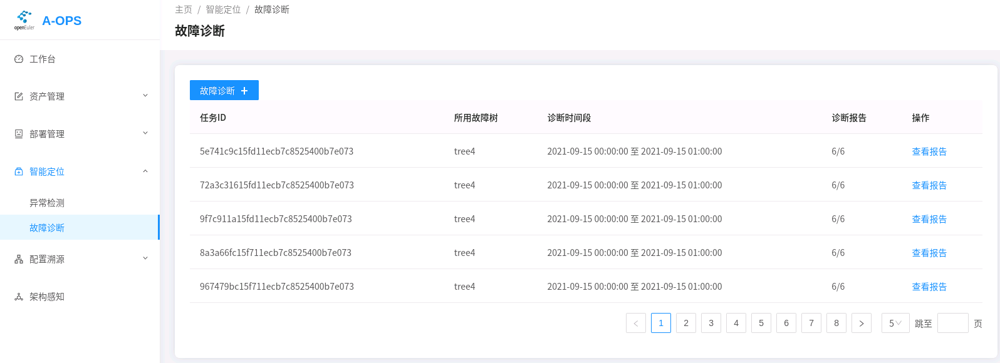

[TOC]

# A-Ops框架服务部署手册

## 1 介绍

A-Ops是一款智能运维工具，通过实现智能运维基本框架，提供配置溯源，架构感知，故障定位基础能力，支持快速排障和运维成本降低。

## 2 架构


## 3 运行环境

- 硬件配置：

  | 配置项   | 推荐规格  |
  | -------- | --------- |
  | CPU      | 8核       |
  | 内存     | 3G        |
  | 网络带宽 | 300M      |
  | I/O      | 375MB/sec |

- 软件配置：

  | 软件名        | 版本      |
  | ------------- | --------- |
  | Python        | 3.8及以上 |
  | Mysql         | 8.0.26    |
  | Elasticsearch | 7.14.0-1  |
  | Kafka         | 2.4.0     |
  | Prometheus    | 2.20.0    |


## 4 安装下载

### 4.1 yum下载安装

1. 配置yum源：openEuler21.09 和 openEuler21.09:Epol，repo源路径：/etc/yum.repos.d/openEuler.repo。

   ```repo
   [openEuler21.09] # openEuler 21.09 官方发布源
   name=openEuler21.09
   baseurl=https://repo.openeuler.org/openEuler-21.09/everything/$basearch/ 
   enabled=1
   gpgcheck=1
   gpgkey=https://repo.openeuler.org/openEuler-21.09/everything/$basearch/RPM-GPG-KEY-openEuler
   
   [Epol] # openEuler 21.09:Epol 官方发布源
   name=Epol
   baseurl=https://repo.openeuler.org/openEuler-21.09/EPOL/main/$basearch/ 
   enabled=1
   gpgcheck=1
   gpgkey=https://repo.openeuler.org/openEuler-21.09/OS/$basearch/RPM-GPG-KEY-openEuler
   ```

   

2. 通过yum install 安装

   ```shell
   # 管理节点:
   
   yum install aops-utils # A-Ops 的基础设施，是其他A-Ops服务的依赖项
   
   yum install aops-manager # A-Ops 管理中心服务：主机管理、部署管理、模板管理、任务管理4个模块。
   
   yum install aops-database # A-Ops 数据中心服务：数据存放和数据库管理。
   
   yum install aops-cli # A-Ops 基础命令行：主机管理、部署管理、模板管理、任务管理。
   ```


### 4.2 rpm下载安装

rpm包版本下载地址：

​	arrch64版本：https://repo.openeuler.org/openEuler-21.09/EPOL/main/aarch64/Packages/

​	x86_64版本：https://repo.openeuler.org/openEuler-21.09/EPOL/main/x86_64/Packages/

 搜索aops，下载以下rpm包：

- aops-cli-vx.x.x.x-x.oe1.arch.rpm
- aops-database-vx.x.x.x-x.oe1.arch.rpm
- aops-manager-vx.x.x.x-x.oe1.arch.rpm
- aops-utils-vx.x.x.x-x.oe1.arch.rpm
- aops-web-vx.x.x.x-x.oe1.arch.rpm

执行如下命令进行安装（其中“x.x.x-x”表示版本号，"arch"代表架构类型，请用实际情况代替）。

```shell
# 管理节点:
rpm -ivh aops-utils-vx.x.x-x.oe1.arch.rpm

rpm -ivh aops-manager-vx.x.x-x.oe1.arch.rpm

rpm -ivh aops-database-vx.x.x-x.oe1.arch.rpm

rpm -ivh aops-cli-vx.x.x-x.oe1.arch.rpm
```


### 4.3 源码下载

​	源码下载地址: https://gitee.com/openeuler/A-Ops


## 5 安装后配置数据库

如果环境没有安装Elasticsearch或者mysql，可以在aops-utils安装之后执行自动化安装脚本。 

```shell
aops-basedatabase mysql # 安装21.09源中的mysql数据库并启动
```

```shell
aops-basedatabase elasticsearch # 安装eleasticsearch官方源中的elasticsearch数据库并启动
```

> **说明:** 因为A-Ops以免密方式连接数据库，以rpm包方式安装Elasticsearch和Mysql默认为无密码模式。出于安全性考虑，当前建议Elasticsearch和Mysql需安装在同一管理节点。 


## 6 配置参数

### 6.1 系统配置

系统默认配置文件存放在/etc/aops/system.ini,请根据实际情况对配置进行更改。

```shell
vim /etc/aops/system.ini
```

```ini
# log module 日志设置
[log]
log_level=INFO # 日志级别 可设置为 DEBUG 查看运行详细
log_dir=/var/log/aops # 日志存放目录
max_bytes=31457280 # 日志最大储存
backup_count=40 # 备份数量

# 服务ip和端口，根据实际情况设置，主要由于cli的restful请求
[manager] # aops-manager 端口
ip=172.16.0.0
port=11111

[database] # aops-database 端口
ip=172.16.0.0
port=11119

[check_scheduler] # aops-check-scheduler 端口
ip=172.16.0.0
port=11112

[diag_scheduler] # aops-diag-scheduler 端口
ip=172.16.0.0
port=11113
```


### 6.2 管理中心配置

管理中心默认配置文件存放在/etc/aops/manager.ini,请根据实际情况对配置进行更改。

```shell
vim /etc/aops/manager.ini
```

```ini
[manager] 
ip=172.16.0.0 # 管理中心ip
port=11111 # 管理中心端口
host_vault_dir=/opt/aops # 加密文件文件夹
host_vars=/opt/aops/host_vars/ # 加密主机文件夹

[database]
ip=172.16.0.0 # 数据中心ip
port=11112 # 数据中心端口

[uwsgi]
wsgi-file=manage.py # flask启动脚本
daemonize=/var/log/aops/uwsgi/manager.log # 管理中心日志文件路径
http-timeout=600 # 响应超时时间
harakiri=600 # 后端运行超时时间
```


### 6.3 数据中心配置

数据中心默认配置文件存放在/etc/aops/database.ini,请根据实际情况对配置进行更改。

```shell
vim /etc/aops/database.ini
```

```ini
[database]
ip=172.16.0.0 # 数据中心ip
port=11119 # 数据中心端口

[elasticsearch]
ip=172.16.0.0 # elasticsearch ip
port=9200 # elasticsearch 端口
max_es_query_num=10000000 # es最大查询数量

[mysql]
ip=172.16.0.0 # mysql ip
port=3306 # mysql 端口
database_name=aops # A-Ops 数据库名称
engine_format=mysql+pymysql://@%s:%s/%s # mysql连接，默认免密
pool_size=10000 # mysql 连接池最大连接数
pool_recycle=7200  # mysql DBAPI最大存活时间

[prometheus]
ip=172.16.0.0 # prometheus ip
port=9090 # prometheus 端口
disable_ssl=True # 取消ssl认证

[uwsgi]
wsgi-file=manage.py # flask启动脚本
daemonize=/var/log/aops/uwsgi/database.log # 数据中心日志文件路径
http-timeout=600 # 响应超时时间
harakiri=600 # 后端运行超时时间
```

### 6.4 其他配置

1. 默认任务配置：/etc/aops/default.json 修改默认执行任务的主机列表ip，需要启动数据库前修改，没有修改的话但已经启动数据库服务的话，需要执行task delete 命令删除task后，重启数据库，方可正确导入默认任务。

   ```shell
   vim /etc/aops/default.json
   ```

   ```json
   {
       "tasks": [
           {
               "task_id": "95c3e692ff3811ebbcd3a89d3a259eef",
               "task_name": "Default deployment",
               "username": "admin",
               "host_list": [
                   {
                       "host_name": "xx.xx.xx.xx",
                       "host_id": "xxxxxxxxxxxxxxxxxxxxxxxxxxxxxxxxxxx"
                   },
                   {
                       "host_name": "xx.xx.xx.xx",
                       "host_id": "xxxxxxxxxxxxxxxxxxxxxxxxxxxxxxxxxxxx"
                   },
                   {
                       "host_name": "xx.xx.xx.xx",
                       "host_id": "xxxxxxxxxxxxxxxxxxxxxxxxxxxxxxxxxxxxx"
                   }
               ]
           }
       ]
   }
   ```

   

2. 修改/etc/ansible/ansible.cfg ， 需要取消#71注释host_key_checking 的注释.

   ```shell
   vim /etc/ansible/ansible.cfg
   ```

   ```cfg
   # uncomment this to disable SSH key host checking
   host_key_checking = False 
   ```


## 7 服务启动和停止

A-Ops 服务可以通过systemd 启动、停止和重启。

```shell
systemctl start aops-database # 启动服务
systemctl stop aops-database # 停止服务
systemctl restart aops-database # 重启服务

# 其他可选项有
aops-manager 
aops-web
```


## 8 网页服务启动

### 8.1 网页服务配置与启动

   - web的配置文件为/etc/nginx/aops-nginx.conf。
   - 主要修改以下内容：
     - web服务端口号，默认为80。
     - 后端服务路由地址，需与后端每个服务对应，其中/api/表示机器管理和用户管理服。务，/api/domain、/api/host、/api/confs、/api/management表示配置溯源服务，/api/check表示异常检测服务，/api/diag表示诊断服务，/api/gala-spider表示架构感知服务，IP请根据实际服务部署设置。

   ```conf
   	server {
           # 设置前端端口号,默认为80端口
           listen       80 default_server;
           listen       [::]:80 default_server;
           # 设置IP/域名
           server_name  localhost;
   
           location /api/ {
               proxy_pass http://172.16.0.0:11111/;
           }
   
           location /api/domain {
               proxy_pass http://172.16.0.0:11114/;
               rewrite ^/api/(.*) /$1 break;
           }
   
           location /api/host {
               proxy_pass http://172.16.0.0:11114/;
               rewrite ^/api/(.*) /$1 break;
           }
   
           location /api/confs {
               proxy_pass http://172.16.0.0:11114/;
               rewrite ^/api/(.*) /$1 break;
           }
   
           location /api/management {
               proxy_pass http://172.16.0.0:11114/;
               rewrite ^/api/(.*) /$1 break;
           }
   
           location /api/check {
               proxy_pass http://172.16.0.0:11112/;
               rewrite ^/api/(.*) /$1 break;
           }
   
           location /api/diag {
               proxy_pass http://172.16.0.0:11113/;
               rewrite ^/api/(.*) /$1 break;
           }
           
           location /api/gala-spider {
           	   proxy_pass http://172.16.0.0:11115/;
               rewrite ^/api/(.*) /$1 break;
           }
   ```

   - 关闭selinux

     ```shell
     setenforce 0
     ```

   - 关闭防火墙

     ```shell
     systemctl stop firewalld 
     ```

   - 启动web服务

     ```shell
     systemctl start aops-web
     ```

   - 访问

     - 方法一：假设web服务启动在172.16.0.0:80，则访问172.16.0.0:80即可访问页面（注意浏览器所在的机器与web服务的机器需要能ping通）。
     - 方法二：通过vscode转发。

       1. vscode安装remote_ssh插件。

       2. 修改remote_ssh config 配置。

       3. 修改部署web服务机器的/etc/ssh/sshd_config:

          ```conf
          StricModes yes 
          AllowTcpForwarding yes 
          AllowAgentForwarding yes 
          GatewayPorts yes 
          PermitTunnel yes  
          ```

          ```shell
          systemctl restart sshd.service 
          ```

       4. 启动remote_ssh, 通过vscode 插件reomote_ssh 转发 部署web服务机器的80端口。

   - 登录

     默认账户名为admin，密码为changeme。

     

### 8.2 网页页面功能介绍   

#### 8.2.1 工作台

该页面为数据看板页面，用户登录后就在此页。

 

   （1）数据信息支持查看：

   - 当前纳管的主机数量
   - 异常检测规则数量
   - 每个主机异常情况的统计
   - 异常情况的具体记录。
   - 目前业务域相关信息尚不支持。

   （2）用户账户操作（右上角）：

   - 修改密码
   - 输入解密密钥
   - 登出

   

#### 8.2.2 资产管理

主机管理相关操作指导参见[资产管理使用手册](资产管理使用手册.md)。

（1）主机组页面支持操作：

   

   - 添加主机组
   - 查看当前所有主机组（支持通过主机组名称、拥有主机数进行排序）
   - 查看每个主机组下的主机信息
   - 删除主机组

   

 （2）  主机管理页面支持操作：

   

   - 添加主机
   - 查看主机（可根据主机组、管理节点进行筛选， 可根据主机名称进行排序）
   - 查看主机详细信息（目前暂不支持）
   - 删除主机


   

#### 8.2.3 部署管理

  部署管理相关操作指导参见[部署管理使用手册](部署管理使用手册.md)。


   部署管理支持操作：

   - 查看部署任务列表
   - 新建部署任务
   - 新增模板（yaml格式）
   - 查看当前模板
   - 删除模板
   - 删除任务
   - 执行任务（只支持执行默认任务，且由于当前没有查询任务进度的接口，前台直接会显示成功，但后台还是会在执行任务）

   

#### 8.2.4 智能定位

​	使用职能定位功能需安装异常检测与故障诊断服务，异常检测相关操作参见[异常检测服务使用手册](异常检测服务使用手册.md)，故障诊断相关操作参见[故障诊断服务使用手册](故障诊断服务使用手册.md)。

​	（1）异常检测页面支持操作：

   

   - 查看当前异常检测规则数量
   - 查看异常检测结果统计
   - 新建规则（传入json文件）
   - 查看所有规则
   - 查看所有异常检测记录

   

  （2） 故障诊断页面支持操作：

   

   - 查看所有任务
   - 创建故障诊断任务并执行
   - 查看某个任务的进度
   - 查看某个任务的报告
   - 删除web尚不支持
   - 新增故障树（json文件）
   - 查看当前故障树
   - 删除故障树
   - 查看某报告详细内容

   

#### 8.2.5 配置管理

使用配置管理功能需安装配置溯源服务，配置溯源相关操作参见[配置溯源服务使用手册](配置溯源服务使用手册.md)。   

（1）业务域管理页面支持操作：

   

   - 查看当前业务域
   - 添加业务域
   - 域内添加主机
   - 查看业务域内主机列表
   - 进入主机列表查看当前配置（收集配置）
   - 删除业务域

   

   （2）业务域配置管理页面支持操作：

   

   - 查看配置项

   - 新增配置项（目前仅支持/etc/yum.repos.d/openEuler.repo 和 /etc/coremail/coremail.conf，格式需正确）

   - 查看配置文件（期望配置）

   - 查看配置变更日志

     

####   8.2.6 架构感知

​	使用架构感知功能需安装架构感知服务，架构感知相关操作参见[架构感知服务使用手册](架构感知服务使用手册.md)。

 	架构感知页面支持操作：

  

- 支持对集群整体架构的查看
- 支持节点和链路纤细信息的查看

  
- 探针采集到实时的tcp连接已经包括lvs、nginx等中间件连接情况，绘制拓扑图，展示节点之间、进程之间的连接情况。
- 上层可以根据拓扑情况、链路指标数据等，进行故障定位定界。


## 9 日志查看

### 9.1 A-Ops日志

**路径**：/var/log/aops/

功能记录A-Ops的操作信息以及内部运行状态，方便维护和故障检查。使用python中logging模块设置日志大小和备份数量。

> ; Maximum capacity of each file, the unit is byte, default is 30 M
>
> max_bytes=31457280
>
> ; Number of old logs to keep;default is 30
>
> backup_count=40

- aops.log： A-Ops运行整体日志

  功能：负责显示A-Ops整体运行的日志，包括管理中心、数据中心等。

- manager.log: 管理中心日志

  功能：负责显示主机管理、主机组管理、模板管理、任务管理的运行日志。

- database.log: 数据中心日志

  功能：负责显示其他功能模块与数据库的交互日志。

- check_scheduler.log: 异常检测日志

  功能：负责显示异常检测模块运行日志。

- diag_scheduler.log: 故障诊断日志

  功能：负责显示异常诊断模块运行日志。

-  架构感知日志：通过 journal 和 systemctl status 查看

- 配置溯源日志：通过 journal 和 systemctl status 查看

  
