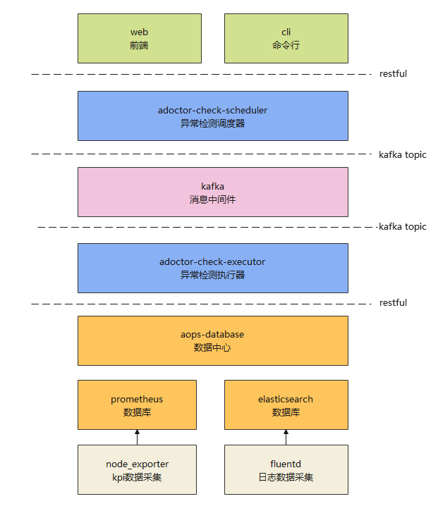
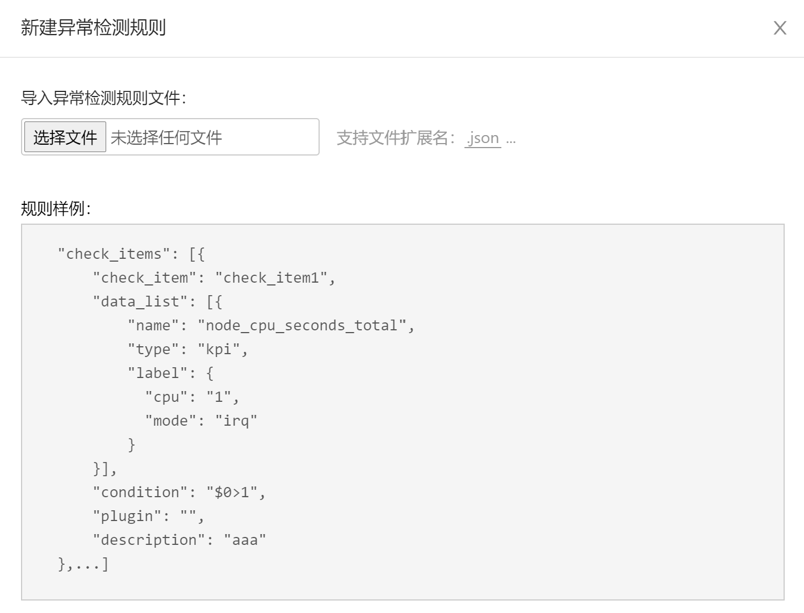
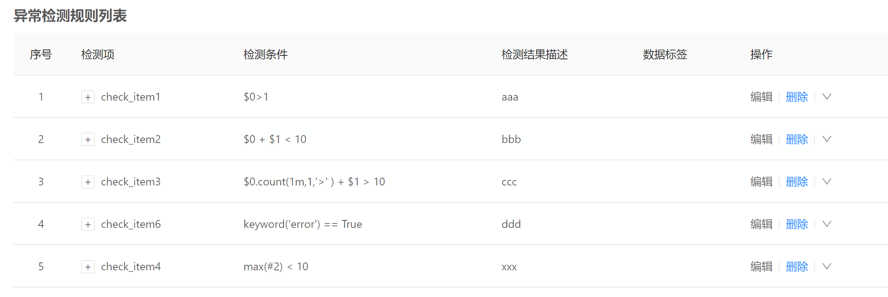
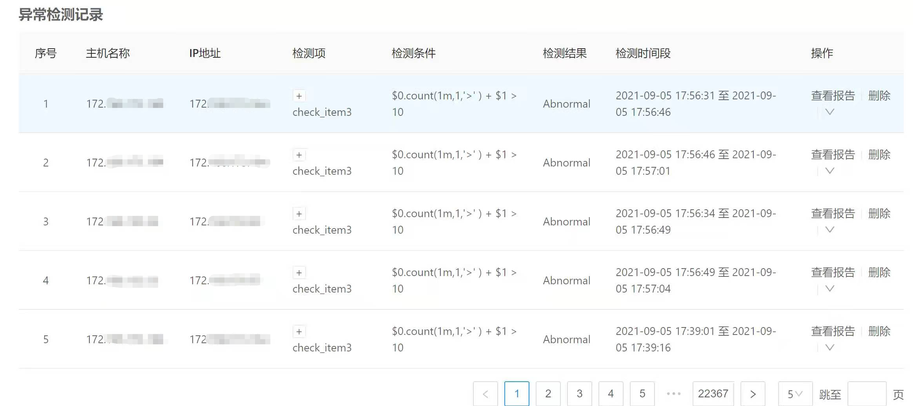

# adoctor-check 异常检测模块

# 1 介绍

adoctor-check异常检测模块主要是通过对收集到的集群内机器节点上各类运行数据进行计算与分析，来确认数据项是否存在异常的工具。

# 2 架构

异常检测工具依托于aops框架运行，主要分为scheduler和executor两个模块。

 


# 3 软件下载

- Repo源挂载正式发布地址：<https://repo.openeuler.org/>
- 源码获取地址：<https://gitee.com/openeuler/A-Ops>
- RPM包获取地址：<https://repo.openeuler.org/openEuler-21.09/EPOL/main/>


# 4 运行环境

- 硬件配置

  | 配置项   | 推荐规格    |
  | -------- | ----------- |
  | CPU      | 8核         |
  | 内存     | 32G，最小4G |
  | 网络带宽 | 300M        |
  | I/O      | 375MB/sec   |

- 软件配置

  | 软件名                       | 版本和规格    |
  | ---------------------------- | ------------- |
  | Python                       | 版本3.8及以上 |
  | mysql                        | 8.0.26        |
  | kafka                        | 2.6.0         |
  | zookeeper                    | 3.6.2         |
  | elasticsearch                | 7.14.0        |
  | prometheus                   | 2.20.0        |
  | node_exporter                | 1.0.1         |
  | aops-database                | 1.0.1         |
  | aops-manager                 | 1.0.1         |
  | fluentd                      | 1.13.3        |
  | fluentd-plugin-elasticsearch | 5.0.5         |

  

# 5 安装

## 5.1 Aops框架安装

异常检测模块运行依赖于aops框架，框架的安装步骤参见[Aops框架使用手册](Aops框架使用手册.md)


## 5.2 依赖组件安装

异常检测模块依赖消息中间件与数据采集模块，需要保证环境中部署组件zookeeper，kafka，prometheus，node_exporter，elasticsearch，fluentd。其中elasticsearch在aops框架安装中会进行部署，需要注意修改相关配置，适配多主机的fluentd采集数据推送。

### 5.2.1 使用Aops部署服务安装

adoctor-check-scheduler，adoctor-check-executor可以与本步骤合并操作。

#### 5.2.1.1 编辑任务列表

修改部署任务列表，打开zookeeper，kafka，prometheus，node_exporter，fluentd组件步骤的开关：

```yaml
---
step_list:
 zookeeper:
  enable: true
  continue: false
 kafka:
  enable: true
  continue: false
 prometheus:
  enable: true
  continue: false
 node_exporter:
   enable: true
   continue: false
 fluentd:
   enable: true
   continue: false
 ...
```

#### 5.2.1.2 编辑主机清单

具体步骤参见[部署管理使用手册](部署管理使用手册.md)章节2.2.2各组件主机配置

#### 5.2.1.3 编辑变量列表

具体步骤参见[部署管理使用手册](部署管理使用手册.md)章节2.2.2各组件变量配置

#### 5.2.1.4 执行部署任务

具体步骤参见[部署管理使用手册](部署管理使用手册.md)章节3执行部署任务

### 5.2.2 手动安装

以上依赖组件可以配置openeuler的repo源安装，具体的参数配置与集群搭建可参见各软件的官网文档。

## 5.3 adoctor-check安装

### 5.3.1 手动安装

- 通过yum挂载repo源实现

  配置yum源：openEuler21.09 和 openEuler21.09:Epol，repo源路径：/etc/yum.repos.d/openEuler.repo。

  ```ini
  [openEuler21.09] # openEuler 21.09 官方发布源
  name=openEuler21.09
  baseurl=https://repo.openeuler.org/openEuler-21.09/everything/$basearch/ 
  enabled=1
  gpgcheck=1
  gpgkey=https://repo.openeuler.org/openEuler-21.09/everything/$basearch/RPM-GPG-KEY-openEuler
  
  [Epol] # openEuler 21.09:Epol 官方发布源
  name=Epol
  baseurl=https://repo.openeuler.org/openEuler-21.09/EPOL/main/$basearch/ 
  enabled=1
  gpgcheck=1
  gpgkey=https://repo.openeuler.org/openEuler-21.09/OS/$basearch/RPM-GPG-KEY-openEuler
  ```

  然后执行如下指令下载以及安装adoctor-check及其依赖。

  ```shell
  yum install adoctor-check-scheduler
  yum install adoctor-check-executor
  ```

- 通过安装rpm包实现。先下载adoctor-check-scheduler, adoctor-check-executor, aops-utils，然后执行如下命令进行安装（其中x.x-x表示版本号，请用实际情况替代）。

  ```shell
  rpm -ivh adoctor-check-scheduler-x.x-x.oe1.noarch.rpm
  rpm -ivh adoctor-check-executor-x.x-x.oe1.noarch.rpm
  ```


### 5.3.2 使用Aops部署服务安装

可以与5.2.1章节依赖组件合并任务操作。

#### 5.3.2.1 编辑任务列表

修改部署任务列表，打开adoctor-check-scheduler，adoctor-check-executor步骤开关：

```yaml
---
step_list:
 ...
 adoctor_check_executor:
   enable: true
   continue: false
 adoctor_check_scheduler:
   enable: true
   continue: false
 ...
```


#### 5.3.2.2 编辑主机清单

具体步骤参见[部署管理使用手册](部署管理使用手册.md)章节2.2.2.8章节check模块主机配置

#### 5.3.2.3 编辑变量列表

具体步骤参见[部署管理使用手册](部署管理使用手册.md)章节2.2.2.8章节check模块变量配置

#### 5.3.2.4 执行部署任务

具体步骤参见[部署管理使用手册](部署管理使用手册.md)章节3执行部署任务


# 6 异常检测规则定义

异常检测规则根据系统可采集的数据进行定义。

## 6.1 异常检测规则文件格式

异常检测规则需要以json格式导入，不同用户可以导入不同的检测规则。检测规则列表由检测项组成。检测项的实例如下所示：

``` json
"check_items": [
    {
        "check_item": "check_item2",
        "data_list": [
            {
                "name": "data1",
                "type": "kpi",
                "label": {
                    "cpu": "1",
                    "mode": "irq"
                 }
            }
        ],
        "condition": "$0>1",
        "plugin": "",
        "description": "data 1"
    },
    {
        "check_item": "check_item2",
        ...
    }
]
```

异常检测规则主要包含如下几个字段：

| 字段名称    | 含义                         | 类型   | 备注                                                         |
| ----------- | ---------------------------- | ------ | ------------------------------------------------------------ |
| check_item  | 异常检测规则名称             | string | 一个用户的异常检测规则名称唯一                               |
| data_list   | 本项异常检测所需要的数据列表 | list   |                                                              |
| condition   | 检测规则描述                 | string | 字符串中描述异常的情况。描述data_list中的数据在满足什么条件的情况下视为某种异常 |
| plugin      | 异常检测规则插件名称         | string | 如果选择使用自定义的异常检测规则插件，此处填写插件名称。填写空字符串，则默认会使用内置的表达式插件解析检测规则。 |
| description | 异常检测项描述               | string |                                                              |


## 6.2 异常检测数据项说明

每一个异常检测项都需要描述其计算所需要的数据，在data_list中列出。data_list的主要字段说明

| 字段名称 | 含义       | 类型   | 备注                                                         |
| -------- | ---------- | ------ | ------------------------------------------------------------ |
| name     | 数据项名称 | string | 在一个data_list中数据项名称是唯一的                          |
| type     | 数据类型   | string | 可选kpi（指标类数据）或log（日志类数据）                     |
| label    | 数据标签   | dict   | 字典中记录数据项的键值对，需要完整描述一项数据的所有label。具体取值kpi类数据可以参考node_exporter的metrics列表，log类数据可以不带label字段 |

- kpi类数据

  kpi类数据当前主要由node_exporter采集，存储在prometheus中。不同的node_exporter版本可以采集的数据指标会有一些差异，需以实际部署的node_exporter版本支持的数据项为准。

  - 数据类型

  主要包括以下类目：

  | 数据项                                          | 数据类型                   |
  | ----------------------------------------------- | -------------------------- |
  | node_cpu*                                       | 系统cpu相关指标            |
  | node_disk*                                      | 磁盘IO指标                 |
  | node_filesystem*                                | 文件系统相关指标           |
  | node_memory* 、node_zoneinfo*                   | 系统内存使用相关指标       |
  | node_netstat* 、node_network* 、 node_sockstat* | 网络相关指标               |
  | node_load*                                      | 系统负载相关指标           |
  | node_systemd*                                   | service相关指标            |
  | node_time*                                      | 时间相关指标               |
  | process*                                        | prometheus自身进程相关指标 |
  | go_*                                            | go环境相关指标             |

  

  - 数据标签

    kpi数据通常会带有能够表征自身特点的标签，在label中以字典的形式描述。一组标签可以唯一地标识一条指标数据。标签的维度可以是该监控数据的状态、特征、环境定义等。例如：

    ```
    node_cpu_seconds_total{cpu="0",mode="idle"} 
    node_cpu_seconds_total{cpu="0",mode="iowait"}
    node_cpu_seconds_total{cpu="0",mode="irq"}
    node_cpu_seconds_total{cpu="0",mode="nice"} 
    node_cpu_seconds_total{cpu="0",mode="softirq"} 
    node_cpu_seconds_total{cpu="0",mode="steal"}
    node_cpu_seconds_total{cpu="0",mode="system"} 
    node_cpu_seconds_total{cpu="0",mode="user"} 
    ...
    node_cpu_seconds_total{cpu="95",mode="softirq"} 
    node_cpu_seconds_total{cpu="95",mode="steal"
    node_cpu_seconds_total{cpu="95",mode="system"} 
    node_cpu_seconds_total{cpu="95",mode="user"}
    ```

    上面的一组数据中，每一项数据有的cpu和mode标签。cpu标签表述所属cpu核，共96个，mode表示cpu的空闲状态(idle)，用户空间进程使用状态(user)，系统空间进程使用状态(system)等8种状态。

  

  node_exporter支持的数据项的详细说明参见node_exporter[官网文档说明](https://prometheus.io/docs/guides/node-exporter/)

  

- log类数据

  日志类数据主要是由fluentd采集，存储在elasticsearch中。目前支持采集的数据包括系统的history日志和demesg日志。


## 6.3 异常检测规则条件说明

### 6.3.1 异常检测表达式

异常检测过程的规则中默认使用表达式来创建关于采集数据的表示。常规的表达式如下：

```
<expression><operator><constant>
<expression><operator><expression>
```

expression是包含数据变量的表达式。数据变量来自于data_list中的描述，并且按照在data_list中的数据列表顺序以$i宏来表述。

举例，若data_list为：

```json
"data_list": 
[{
	"name": "node_cpu_frequency_min_hertz",
	"type": "kpi",
	
},
{
	"name": "node_cpu_guest_seconds_total",
	"type": "kpi",
	"label": {
		"cpu": "1",
		
	}
},
{
	"name": "node_cpu_seconds_total",
	"type": "kpi"
}]
```

则condition应类似如下描述：

```
$0 + $1 * $2 >100
```

其计算时的含义为：

```
node_cpu_frequency_min_hertz + node_cpu_guest_seconds_total * node_cpu_seconds_total > 100
```


### 6.3.2 运算符

当前支持以下运算符

| 优先级 | 运算符 | 定义           | 使用形式                                                     |
| ------ | ------ | -------------- | ------------------------------------------------------------ |
| 1      | （）   | 圆括号         | （expression)、function(parameter)                           |
| 2      | -      | 负号运算符     | -expression                                                  |
|        | +      | 正号运算符     | +expression                                                  |
| +      | !      | 逻辑非运算符   | !expression                                                  |
|        | ~      | 按位取反运算符 | ~expression                                                  |
| 3      | /      | 除             | expression1 / expression2                                    |
|        | *      | 乘             | expression1 * expression2                                    |
|        | %      | 余数(取模)     | expression1 % expression2                                    |
| 4      | +      | 加             | expression1 + expression2                                    |
|        | -      | 减             | expression1 - expression2                                    |
| 5      | <<     | 左移           | expression1 << expression2                                   |
|        | >>     | 右移           | expression1 >> expression2                                   |
| 6      | >      | 大于           | expression1 > expression2                                    |
|        | >=     | 大于等于       | expression1 >= expression2                                   |
|        | <      | 小于           | expression1 < expression2                                    |
|        | <=     | 小于等于       | expression1 <= expression2                                   |
| 7      | ==     | 等于           | expression1 == expression2                                   |
|        | !=     | 不等于         | expression1 != expression2                                   |
|        | in     | 包含           | {key: value} in {ke1:value1, key2:value2,...}    key与value可为表达式 |
|        | notin  | 不包含         | {key: value} notin {ke1:value1, key2:value2,...}     key与value可为表达式 |
| 8      | &      | 按位与         | expression1 & expression2                                    |
| 9      | ^      | 按位异或       | expression1 ^ expression2                                    |
| 10     | \|     | 按位或         | expression1 \| expression2                                   |
| 11     | &&     | 逻辑与         | expression1 && expression2                                   |
| 12     | \|\|   | 逻辑或         | expression1 \|\| expression2                                 |
| 13     | ?:     | 条件运算符     | judege_expression ? expression_true : expression_false       |


### 6.3.3 函数

表达式中支持对数据进行函数运算，表达式格式如下：

```
# 针对指定data_name做函数计算后与constant比较
<data_name>.function(<parameter>)<operator><constant>
# 针对$0数据进行function运算后与constant作比较
function(<parameter>)<operator><constant>
```

- 函数参数

  函数中支持时间与个数作为过滤器。

  | 函数调用 | 含义                |
  | -------- | ------------------- |
  | max(30s) | 30秒内数据的最大值  |
  | max(#5)  | 最近5个数据的最大值 |

  时间偏移量支持单位符号s(秒)，m(分)，h(时)

- 函数列表

  | 函数名                              | 描述                                 | 参数                                                         | 数据类型        | 备注                                                         |
  | ----------------------------------- | ------------------------------------ | ------------------------------------------------------------ | --------------- | ------------------------------------------------------------ |
  | count(sec\|#num, pattern, operator) | 计算指定一段数据中符合条件的数据个数 | sec\|#num：时间或个数的偏移量                 \<pattern>：判断的对比项 \<operator>：判断的关系 | float, int,str  | count(10m,1,">"):十分钟内大于1的数据的个数  count(#15,"error","=="):最近15个数据中等于error的个数 |
  | max(sec\|#num)                      | 计算指定一段数据的最大值             | sec\|#num：时间或个数的偏移量                                | float, int      | max(#5):最近5个数的最大值                                 max(5s):最近5秒内数据的最大值 |
  | min(sec\|#num)                      | 计算指定一段数据的最小值             | sec\|#num：时间或个数的偏移量                                | float, int      | min(#5):最近5个数的最小值                                 min(5s):最近5秒内数据的最小值 |
  | sum(sec\|#num)                      | 计算指定一段数据的总和               | sec\|#num：时间或个数的偏移量                                | float, int      | sum(#5):最近5个数的总和 sum(5s):最近5秒内数据的总和          |
  | avg(sec\|#num)                      | 计算指定一段数据的平均值             | sec\|#num：时间或个数的偏移量                                | float, int      | avg(#5):最近5个数的平均值 avg(5s):最近5秒内数据的平均值      |
  | keyword(pattern)                    | 判断当前数据中是否包含指定关键字符串 | pattern：关键字符                                            | str             | keyword("error"):数据中包含error关键字返回true,否则返回false |
  | diff(sec\|#num)                     | 当前值与之前的值是否相同             | sec\|#num：时间或个数的偏移量                                | float,int, str, | true:两个值相同        false：两个值不同                     |
  | abschange(sec\|#num)                | 当前值与之前的值差值的绝对值         | sec\|#num：时间或个数的偏移量                                | float,int       | pre:1 cur:5 return: 4       pre:3 cur:1 return:2             pre:0 cur:-2.5 return 2.5 |
  | change(sec\|#num)                   | 当前值与之前的值差值                 | sec\|#num：时间或个数的偏移量                                | float,int       | pre:1 cur:5 return: 4        pre:3 cur:1 return:-2             pre:0 cur:-2.5 return -2.5 |

  

## 6.4 自定义异常检测插件

- 自定义异常检测插件接口

  自定义异常检测插件需要继承adoctor_check_executor.check_rule_plugins.check_rule_plugin中的CheckRulePlugin类。

  | 接口            | 功能           | 输入值                                                       | 返回值                            |
  | --------------- | -------------- | ------------------------------------------------------------ | --------------------------------- |
  | judge_condition | 判断是否有异常 | index:在时序数据段中的坐标                        data_vector:时序数据段                          main_data_name:主数据 | true:存在异常        false:无异常 |
  |                 | 设置插件管理器 | plugin_manager ：插件管理器                                  |                                   |

- 配置插件文件

  在/etc/aops/check_rule_plugin.yml中添加自己的自定义异常检测规则插件：

  ```yaml
  ---
  plugin_list:
    - plugin_name: expression_rule_plugin
      file_name: expression_rule
      module_name: ExpressionCheckRule
    - plugin_name: my_plugin #插件名
    	file_name: my_plugin #插件文件
    	module_name: Myplugin #插件类名
  ```

  1. 将my_plugin.py以及需要引用的文件移动到adoctor_check_executor的安装目录下：adoctor_check_executor/check_rule_plugins

  2. 重启adoctor-check-executor，将会加载自定义插件

     

# 7 配置参数

## 7.1 配置adoctor-check-scheduler

adoctor-check-scheduler默认的配置文件存放在/etc/aops/check_scheduler.ini中，请根据实际情况修改：

```shell
vim /etc/aops/check_scheduler.ini
```

```ini
; kafka producer相关参数
[producer] 
; kafka服务器列表，为host:port组成的列表，端口默认是9092，IP默认取localhost
kafka_server_list = 192.168.1.1:9092
; kafka API的版本，默认取0.11.5
api_version = 0.11.5
; kafka的leader在确认请求完成前收到的ack数量。默认为1。
;   0：producer不会等待服务器的ack。消息会立即添加到套接字缓冲区，并置为已发送。不保证服务器已经收到消息，每个消息返回的偏移量始终为-1。
;   1：leader只将记录写入本地。broker不会等待所有的follower返回响应。
;   all：等待所有的同步副本都写入。
acks = 1
; 取值大于0时，当客户端发送失败时会重新发送
retries = 3
; 重试错误时后退的毫秒数
retry_backoff_ms = 100

; kafka consumer相关参数
[consumer]
; kafka服务器列表，为host:port组成的列表，端口默认是9092，IP默认取localhost
kafka_server_list = 192.168.1.1:9092
; 如果为True, consumer的offset会在后台定期commit
enable_auto_commit = False
; 针对OffsetOutOfRange错误的offset重置策略。
;   earliest: 移动到最早的可用的消息
;   latest: 移动到最新的消息
auto_offset_reset = earliest
; consumer进行poll操作时，如果缓冲区没有数据，在轮询中等待的时间。取0则立即返回缓冲区中当前的可用记录。否则返回空
timeout_ms = 5
; consumer进行poll操作时，单次调用返回的最大记录数
max_records = 3

; check scheduler的相关配置参数
[check_scheduler]
; check scheduler监听的地址
ip = 127.0.0.1
; check scheduler监听的端口
port = 11112
; 异常检测过程中出现无数据或内部错误的异常情况时，触发任务重试的最大次数
max_retry_num = 3
; 重试一次后仍然失败，等待下一次重试的冷却时间
cool_down_time = 120
; 超过最大重试次数的任务，即死亡任务，任务ID在缓存中记录个数。超过之后会清理缓存
max_dead_retry_task = 10000
; 清理死亡任务时的清除比例。默认配置下，即超过10000时，默认删掉50%的缓存
dead_retry_task_discount = 0.5
; 从启动check scheduler开始后向任务（逆时间轴）的检测时间步长
backward_task_step = 60
; 触发后向任务的时间间隔
backward_task_interval = 30
; 触发前向任务（顺时间轴）的时间间隔
forward_task_interval = 30
; 触发前向任务的最大时间间隔
forward_max_task_step = 86400

; uwsgi的相关配置参数
[uwsgi]
; uwsgi的启动脚本
wsgi-file=manage.py
; check uwsgi 服务的日志
daemonize=/var/log/aops/uwsgi/check_scheduler.log
; HTTP连接超时时间
http-timeout=600
; 服务器响应时间
harakiri=600
```

注意，check_scheduler服务监听的IP和Port修改后，/etc/aops/system.ini中check_scheduler的IP与Port需要同步修改。

## 7.2 配置adoctor-check-executor

### 7.2.1 基本参数配置

adoctor-check-executor默认的配置文件存放在/etc/aops/check_executor.ini中，请根据实际情况修改：

```shell
vim /etc/aops/check_executor.ini
```

```ini
; check scheduler的相关配置参数
[consumer]
; kafka服务器列表，为host:port组成的列表，端口默认是9092，IP默认取localhost
kafka_server_list=192.168.1.1:9092
; 如果为True, consumer的offset会在后台定期commit
enable_auto_commit=False
; 针对OffsetOutOfRange错误的offset重置策略。
;   earliest: 移动到最早的可用的消息
;   latest: 移动到最新的消息
auto_offset_reset=earliest
; consumer进行poll操作时，如果缓冲区没有数据，在轮询中等待的时间。取0则立即返回缓冲区中当前的可用记录。否则返回空
timeout_ms=5
; consumer进行poll操作时，单次调用返回的最大记录数
max_records=3

; kafka producer相关参数
[producer]
; kafka服务器列表，为host:port组成的列表，端口默认是9092，IP默认取localhost
kafka_server_list=192.168.1.1:9092
; kafka API的版本，默认取0.11.5
api_version=0.11.5
; kafka的leader在确认请求完成前收到的ack数量。默认为1。
;   0：producer不会等待服务器的ack。消息会立即添加到套接字缓冲区，并置为已发送。不保证服务器已经收到消息，每个消息返回的偏移量始终为-1。
;   1：leader只将记录写入本地。broker不会等待所有的follower返回响应。
;   all：等待所有的同步副本都写入。
acks=1
; 取值大于0时，当客户端发送失败时会重新发送
retries=3
; 重试错误时后退的毫秒数
retry_backoff_ms=100

; check executor相关配置参数
[executor]
; 插件加载的相对路径，从adoctor_check_executor的Python包引用相对路径
plugin_path = adoctor_check_executor.check_rule_plugins
; 执行具体异常检测的consumer数量
do_check_consumer_num = 2
; 采集数据的采样周期，需要与prometheus的scrape周期配置一致，否则检测结果将不准确
sample_period = 15
```


### 7.2.2 自定义异常检测规则插件配置

/etc/aops/check_rule_plugin.yml中配置了异常检测的规则插件，默认配置内置的expression_rule_plugin，可以根据章节6.4中添加自定义插件的配置。


# 8 异常检测规则管理

## 8.1 导入异常检测规则

### 8.1.1 前端操作

1. 准备异常检测规则json文件。
2. 打开规则管理页面，新建异常检测规则。




### 8.1.2 命令行操作

1. 登录到部署adoctor-check-scheduler的服务器后端。

2. 准备异常检测规则json文件，拷贝至服务器环境上。

3. 则输入命令：

   ```shell
   adoctor checkrule [--action] add [--conf] [check.json] [--access_token] [token]
   ```

   参数说明：

   - action：取add表示添加操作
   - conf： 待导入的规则文件
   - access_token: 访问令牌

4. 举例，导入check_rule.json文件，则输入命令：

   ```shell
   adoctor checkrule --action add --conf check_rule.json --access_token "1111"
   ```

   

## 8.2 删除异常检测规则

### 8.2.1 前端操作

1. 打开规则管理页面
2. 在规则列表中删除规则


### 8.2.2 命令行操作

1. 登录到部署adoctor-check-scheduler的服务器后端。

2. 输入命令：

   ```shell
   adoctor checkrule [--action] delete [--check_items] [items] [--access_token] [token]
   ```

   参数说明：

   - action：取delete表示删除操作
   - check_items：表示删除指定的检测项，以逗号分隔，为空时不删除任何检测项
   - access_token: 访问令牌

3. 举例，删除检测项cpu_usage_overflow，输入命令：

   ```shell
   adoctor checkrule --action delete --check_items cpu_usage_overflow --access_token "1111"
   ```

   

## 8.3 获取异常检测规则

### 8.3.1 前端操作

1. 打开异常检测规则列表，查看异常检测规则。




### 8.3.2 命令行操作

1. 登录到部署adoctor-check-scheduler的服务器后端。

2. 输入命令：

   ```shell
   adoctor checkrule [--action] get [--check_items] [items] [--export] [path] [--sort] [{check_item}] [--direction] [{asc, desc}] [--page] [page] [--per_page] [per_page] [--access_token] [token]
   ```

   参数说明：

   - action：取get表示获取操作
   - check_items：表示获取指定的检测项，以逗号分隔，为空时表示获取全部检测项
   - sort: 对异常检测结果进行排序，目前可选start或end或check_item，为空表示不排序
   - direction: 异常结果排序可选升序(asc)，降序(desc)，默认:asc
   - page: 当前的页码
   - per_page: 每页的数量，最大为50
   - access_token: 访问令牌

3.  举例，导出检测项cpu_usage_overflow，仅获取第1页，每页显示30个，按check_item升序排序，保存到/tmp目录:

   ```shell
   adoctor checkrule --action get --check_items cpu_usage_overflow --export /tmp --sort check_item --direction asc --page 1 --per_page 30 --access_token "1111"
   ```

   

# 9 异常检测功能使用

## 9.1 异常检测执行

在adoctor-check-scheduler与adoctor-check-executor服务启动之后，即会从启动时间开始进行实时异常检测，以及历史时间的检测，历史时间的检测会按照配置的时间步长，逐步回溯。

## 9.2 获取异常检测结果

### 9.2.1 前端操作

1. 查看异常检测结果列表。



2. 查看异常检测结果统计。


### 9.2.2 命令行操作

1. 登录到部署adoctor-check-scheduler的服务器后端。

2. 输入命令：

   ```shell
   adoctor check [--check_items] [items] [--host_list] [list] [--start] [time1] [--end] [time2] [--sort] [{check_item, start, end}] [--direction] [{asc, desc}] [--page] [page] [--per_page] [per_page] [--access_token] [token]
   ```

   参数说明：

   - check_items：指定检测项，以逗号分隔，为空表示所有
   - host_list：为指定主机列表，以逗号分隔，为空表示所有
   - start：指定异常检测的起始时间，格式类似20200101-11:11:11，不指定时默认以截止时间往前推1小时
   - end：指定异常检测的截止时间，不指定时默认为当前时间
   - sort: 对异常检测结果进行排序，目前可选start或end或check_item，为空表示不排序
   - direction: 异常结果排序可选升序(asc)，降序(desc)，默认:asc
   - page: 当前的页码
   - per_page: 每页的数量，最大为50
   - access_token: 访问令牌

3. 举例，获取主机host1上check_item1在2021-9-8 11:24:10~2021-9-9 09:00:00的异常检测结果，仅获取第1页，每页显示30个，按check_item升序排序，：

   ```shell
   adoctor check --check_items check_item1 --host_list host1 --start 20210908-11:24:10 --end 20210909-09:00:00 --sort check_item --direction asc --page 1 --per_page 30 --access_token "1111"
   ```

   

# 10 日志查看与转储

1. adoctor-check-scheduler日志
   - 路径：/var/log/aops/uwsgi/check_scheduler.log
   - 功能：主要记录代码内部运行的日志，方便定位问题
   - 权限：路径权限755，日志权限644， 普通用户可以查看
   - debug日志开关：/etc/aops/system.ini中log_level配置项
2. adoctor-check-executor日志
   - 路径：/var/log/aops/aops.log
   - 功能：主要记录代码内部运行的日志，方便定位问题
   - 权限：路径权限755，日志权限600， 普通用户可以查看
   - debug日志开关：/etc/aops/system.ini中log_level配置项