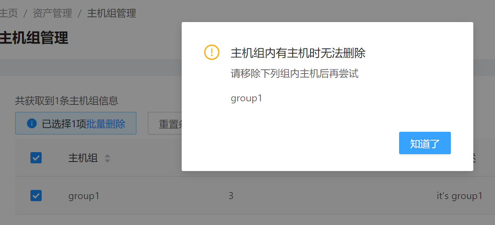

## 机器管理

### 1.添加主机组

添加主机组需要输入主机组名称与描述

- 界面示例：

	


- 命令行示例：

	```aops group --action add --host_group_name group1 --description "it's group1" --access_token token```
### 2.查看主机组
添加主机组成功后会在界面上看到主机组的信息，包括了每个主机组里面的主机数量，并且可以查看里面所包含的主机
- 界面示例:

 

 

- 命令行示例：

  ```aops group --action query --access_token token```

### 3.添加主机
为保证权限最小化，使用非root用户进行操作，若主机没有除root外的用户，执行以下命令添加用户。

```
useradd -m aops
passwd aops
usermod -G wheel aops
```

添加主机需要输入以下必选参数

- 主机名，表示主机名称，如果与已存在的主机名冲突则会失败
- 主机组名，在下拉菜单里可选择相应的主机组
- 主机ip，能访问的主机公网ip，目前仅支持ipv4
- ssh登录端口
- management：表示该主机是否为管理节点
- 用户名：登录主机的用户名
- 密码：登录主机的密码
- 管理员密码：主机的root密码
- 密钥：给该主机密码等信息加密的密钥，用户后续进行一些操作需要输入该密钥方能继续执行，目前因为功能限制，所有主机的密钥需保持一致

添加成功后，该主机会显示在列表中。

- 界面示例：

	

- 命令行示例：

	```aops host --action add --host_name host1 --host_group_name group1 --public_ip 192.168.0.0 --ssh_port 22 --management False --username test --password 123 --sudo_password aaa123 --key mi --access_token token```

### 4.查看主机

可通过主机组以及是否为管理节点筛选出要查看的主机

- 界面示例：

  

- 命令行示例:

  ```aops host --action query --host_group_name group1 --access_token token```

### 5.主机认证

涉及到主机的部署、配置收集等需要登录的操作需要主机的密码等信息，这时候需要用到之前输入的密钥来进行解密操作，该密钥认证一次即可。

- 界面示例：

	

- 命令行示例：

  ```aops certificate --key mi --access_token token```

### 6.删除主机

删除主机直接选中一项或多项主机，点击删除即可

- 界面示例:

	

- 命令行示例:

  ```aops host --action delete --host_list 111 --access_token token```

### 7.删除主机组

删除主机组直接选中若干个主机组进行删除，若主机组内存在主机则无法删除

- 界面示例:

  

- 命令行示例:

  ```aops group --action delete --host_group_list group1 --access_token token```
