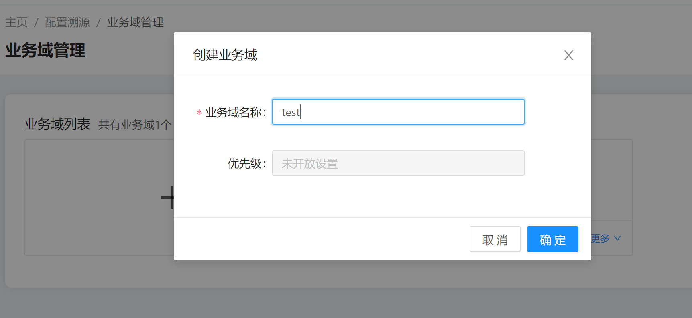
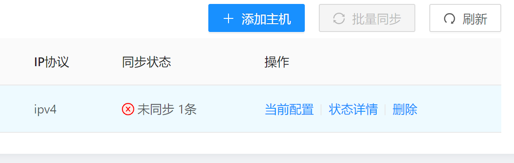

gala-ragdoll的使用指导
============================

## 安装

#### 手动安装

- 通过yum挂载repo源实现

  配置yum源：openEuler21.09 和 openEuler21.09:Epol，repo源路径：/etc/yum.repos.d/openEuler.repo。

  ```ini
  [openEuler21.09] # openEuler 21.09 官方发布源
  name=openEuler21.09
  baseurl=https://repo.openeuler.org/openEuler-21.09/everything/$basearch/ 
  enabled=1
  gpgcheck=1
  gpgkey=https://repo.openeuler.org/openEuler-21.09/everything/$basearch/RPM-GPG-KEY-openEuler
  
  [Epol] # openEuler 21.09:Epol 官方发布源
  name=Epol
  baseurl=https://repo.openeuler.org/openEuler-21.09/EPOL/main/$basearch/ 
  enabled=1
  gpgcheck=1
  gpgkey=https://repo.openeuler.org/openEuler-21.09/OS/$basearch/RPM-GPG-KEY-openEuler
  ```

  然后执行如下指令下载以及安装gala-ragdoll及其依赖。

  ```shell
  yum install gala-ragdoll # A-Ops 配置溯源
  yum install python3-gala-ragdoll
  
  yum install gala-spider # A-Ops 架构感知
  yum install python3-gala-spider
  ```

- 通过安装rpm包实现。先下载gala-ragdoll-vx.x.x-x.oe1.aarch64.rpm，然后执行如下命令进行安装（其中x.x-x表示版本号，请用实际情况替代）

  ```shell
  rpm -ivh gala-ragdoll-vx.x.x-x.oe1.aarch64.rpm
  ```


#### 使用Aops部署服务安装

##### 编辑任务列表

修改部署任务列表，打开gala_ragdoll步骤开关：

```yaml
---
step_list:
 ...
 gala_ragdoll:
   enable: false
   continue: false
 ...
```

##### 编辑主机清单

具体步骤参见[部署管理使用手册](部署管理使用手册.md)章节2.2.2.10章节gala-ragdoll模块主机配置

##### 编辑变量列表

具体步骤参见[部署管理使用手册](部署管理使用手册.md)章节2.2.2.10章节gala-ragdoll模块变量配置

##### 执行部署任务

具体步骤参见[部署管理使用手册](部署管理使用手册.md)章节3执行部署任务


### 配置文件介绍

```/etc/yum.repos.d/openEuler.repo```是用来规定yum源地址的配置文件，该配置文件内容为：

```
[OS]
name=OS
baseurl=http://repo.openeuler.org/openEuler-20.09/OS/$basearch/
enabled=1
gpgcheck=1
gpgkey=http://repo.openeuler.org/openEuler-20.09/OS/$basearch/RPM-GPG-KEY-openEuler
```

### yang模型介绍

`/etc/yum.repos.d/openEuler.repo`采用yang语言进行表示，参见`gala-ragdoll/yang_modules/openEuler-logos-openEuler.repo.yang`;
其中增加了三个拓展字段：

| 拓展字段名称 | 拓展字段格式           | 样例                                      |
| ------------ | ---------------------- | ----------------------------------------- |
| path         | OS类型：配置文件的路径 | openEuler:/etc/yum.repos.d/openEuler.repo |
| type         | 配置文件类型           | ini、key-value、json、text等              |
| spacer       | 配置项和配置值的中间键 | “ ”、“=”、“：”等                          |

附：yang语言的学习地址：https://tonydeng.github.io/rfc7950-zh/

### 通过配置溯源创建域

#### 查看配置文件

gala-ragdoll中存在配置溯源的配置文件

```
[root@openeuler-development-1-1drnd ~]# cat /etc/ragdoll/gala-ragdoll.conf
[git]                                       // 定义当前的git信息：包括git仓的目录和用户信息
git_dir = "/home/confTraceTestConf" 
user_name = "user"
user_email = "email"

[collect]                                  // A-OPS 对外提供的collect接口
collect_address = "http://192.168.0.0:11111"
collect_api = "/manage/config/collect"

[ragdoll]
port = 11114

```

#### 创建配置域





#### 添加配置域纳管node


#### 添加配置域配置


#### 查询预期配置


#### 删除配置


#### 查询实际配置


#### 配置校验





#### 配置同步

暂未提供
