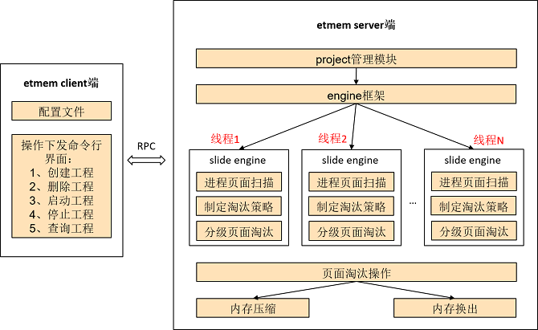

# etmem内存管理
[[toc]]

## 介绍
随着CPU算力的发展，尤其是ARM核成本的降低，内存成本和内存容量成为约束业务成本和性能的核心痛点，因此如何节省内存成本，如何扩大内存容量成为存储迫切要解决的问题。

etmem内存垂直扩展技术，通过DRAM+内存压缩/高性能存储新介质形成多级内存存储，对内存数据进行分级，将分级后的内存冷数据从内存介质迁移到高性能存储介质中，达到内存容量扩展的目的，从而实现内存成本下降。

## 软件架构


etmem客户端通过rpc通信机制与服务端进行交互，下发创建/删除工程、启动/停止工程、查询工程的命令，服务端通过客户端下发的配置文件，读取project管理配置信息，以及engine配置信息，并执行客户端下发的操作。启动工程之后，服务端会对业务进程进行扫描，并根据扫描统计结果以及淘汰策略，对页面进行分级淘汰，实现节省内存的目标。


## 安装教程

1. 下载etmem源码
```
   # git clone https://gitee.com/src-openeuler/etmem.git
```

2. 编译安装
```
   # cd etmem
   # mkdir build
   # cd build
   # cmake ..
   # make
   # make install
```
## 使用说明

### 启动etmemd进程

#### 使用方法

通过运行etmemd二进制运行服务端进程，例如：
```
# etmemd -l 0 -s etmemd_socket
```
#### 帮助信息
```
options：
-l|--log-level <log-level>  Log level
-s|--socket <sockect name>  Socket name to listen to
-h|--help  Show this message
```
#### 命令行参数说明

| 参数            | 参数含义                           | 是否必须 | 是否有参数 | 参数范围              | 示例说明                                                     |
| --------------- | ---------------------------------- | -------- | ---------- | --------------------- | ------------------------------------------------------------ |
| -l或--log-level | etmemd日志级别                     | 否       | 是         | 0~3                   | 0：debug级别   1：info级别   2：warning级别   3：error级别   只有大于等于配置的级别才会打印到/var/log/message文件中 |
| -s或--socket    | etmemd监听的名称，用于与客户端交互 | 是       | 是         | 107个字符之内的字符串 | 指定服务端监听的名称                                         |
| -h或--help      | 帮助信息                           | 否       | 否         | NA                    | 执行时带有此参数会打印后退出                                 |

### etmem配置文件

在运行etmem进程之前，需要管理员预先规划哪些进程需要做内存扩展，将进程信息配置到etmem配置文件中，并配置内存扫描的周期、扫描次数、内存冷热阈值等信息。

配置文件的示例文件在安装etmem软件包后，放置在/etc/etmem/example_conf.yaml，示例内容为：

```
options:    
	loop : 3
    interval : 1
    sleep: 2
	policies:
		type : pid/name
   		value : 123456/mysql
    	max_threads: 3
    	engine : slide
			param:
				T: 3
```

配置文件各字段说明：

| **置项**    | **配置项含义**                                               | **是否必须** | **是否有参数** | **参数范围**              | **示例说明**                                                 |
| ----------- | ------------------------------------------------------------ | ------------ | -------------- | ------------------------- | ------------------------------------------------------------ |
| options     | project公用配置段起始标识                                    | 是           | 否             | NA                        | 每个配置文件有且仅有一个此字段，并且文件以此字段开始         |
| loop        | 内存扫描的循环次数                                           | 是           | 是             | 1~120                     | loop:3 //扫描3次                                             |
| interval    | 每次内存扫描的时间间隔                                       | 是           | 是             | 1~1200                    | interval:5 //每次扫描之间间隔5s                              |
| sleep       | 每个内存扫描+操作的大周期之间时间间隔                        | 是           | 是             | 1~1200                    | sleep:10 //每次大周期之间间隔10s                             |
| policies    | project中各task任务配置段起始标识                            | 是           | 否             | NA                        | 一个project中可以配置多个task，每个task以policies:开头       |
| type        | 目标进程识别的方式                                           | 是           | 是             | pid/name                  | pid代表通过进程号识别，name代表通过进程名称识别              |
| value       | 目标进程识别的具体字段                                       | 是           | 是             | 实际的进程号/进程名称     | 与type字段配合使用，指定目标进程的进程号或进程名称，由使用者保证配置的正确及唯一性 |
| max_threads | etmemd内部线程池最大线程数，每个线程处理一个进程/子进程的内存扫描+操作任务 | 否           | 是             | 1~2 * core数 + 1，默认为1 | 对外部无表象，控制etmemd服务端内部处理线程个数，当目标进程有多个子进程时，配置越大，并发执行的个数也多，但占用资源也越多 |
| engine      | 扫描引擎类型                                                 | 是           | 是             | slide                     | 声明使用slide引擎进行冷热内存识别                            |
| param       | 扫描引擎私有参数配置起始标识                                 | 是           | 否             | NA                        | 引擎私有参数配置段以此标识起始，每个task对应一种引擎，每个引擎对应一个param及其字段 |
| T           | slide引擎的水线配置                                          | 是           | 否             | 1~3 * loop                | 水线阈值，大于等于此值的内存会被识别为热内存，反之为冷内存   |

### etmem工程创建、删除、查询

#### 场景描述

1）管理员创建etmem工程（一个工程可包含多个etmem任务）

2）管理员查询已有的etmem工程

3）管理员删除已有的etmem工程（删除工程前，会自动先停止该工程中的所有任务）

#### 使用方法

通过etmem二进制执行工程创建/删除/查询操作，前提是服务端已经成功运行，并且配置文件/etc/etmem/example_conf.yaml内容正确。

添加工程：
```
# etmem project add -n test -f /etc/etmem/example_conf.yaml -s etmemd_socket
```
删除工程：
```
# etmem project del -n test -s etmemd_socket
```
查询工程：
```
# etmem project show -s etmemd_socket
```
打印帮助：
```
# etmem project help
```
#### 帮助信息
```
Usage:
 etmem project add [options]
 etmem project del [options]
 etmem project show
 etmem project help

 Options:
 -f|--file <conf_file> Add configuration file
 -n|--name <proj_name> Add project name
 -s|--sock <sock_name> Socket name to connect

 Notes:
 1. Project name and socket name must be given when execute add or del option.
 2. Configuration file must be given when execute add option.
 3. Socket name must be given when execute show option.
```
#### 命令行参数说明

add命令：

| 参数         | 参数含义                                                     | 是否必须 | 是否有参数 | 示例说明                                                 |
| ------------ | ------------------------------------------------------------ | -------- | ---------- | -------------------------------------------------------- |
| -n或--name   | 指定project名称                                              | 是       | 是         | project名称，与配置文件一一对应                          |
| -f或--file   | 指定project的配置文件                                        | 是       | 是         | 需要指定路径名称                                         |
| -s或--socket | 与etmemd服务端通信的socket名称，需要与etmemd启动时指定的保持一致 | 是       | 是         | 必须配置，在有多个etmemd时，由管理员选择与哪个etmemd通信 |

del命令：

| 参数         | 参数含义                                                     | 是否必须 | 是否有参数 | 示例说明                                                 |
| ------------ | ------------------------------------------------------------ | -------- | ---------- | -------------------------------------------------------- |
| -n或--name   | 指定project名称                                              | 是       | 是         | project名称，与配置文件一一对应                          |
| -s或--socket | 与etmemd服务端通信的socket名称，需要与etmemd启动时指定的保持一致 | 是       | 是         | 必须配置，在有多个etmemd时，由管理员选择与哪个etmemd通信 |

show命令：

| 参数         | 参数含义                                                     | 是否必须 | 是否有参数 | 示例说明                                                 |
| ------------ | ------------------------------------------------------------ | -------- | ---------- | -------------------------------------------------------- |
| -s或--socket | 与etmemd服务端通信的socket名称，需要与etmemd启动时指定的保持一致 | 是       | 是         | 必须配置，在有多个etmemd时，由管理员选择与哪个etmemd通信 |

### etmem任务启动、停止

#### 场景描述

在已经通过etmem project add添加工程之后，在还未调用etmem project del删除工程之前，可以对etmem的工程进行启动和停止。

1）管理员启动已添加的工程

2）管理员停止已启动的工程

在管理员调用project del删除工程时，如果工程已经启动，则会自动停止。

#### 使用方法

通过etmem二进制执行任务启动/停止操作，前提是服务端已经成功运行，配置文件/etc/etmem/example_conf.yaml内容正确，且etmem工程已经创建。

启动工程
```
# etmem migrate start -n test -s etmemd_socket
```
停止工程
```
# etmem migrate stop -n test -s etmemd_socket
```
打印帮助
```
# etmem migrate help
```
#### 帮助信息
```
Usage:
 etmem migrate start [options]
 etmem migrate stop [options]
 etmem migrate help

 Options:
 -n|--name <proj_name> Add project name
 -s|--sock <sock_name> Socket name to connect

 Notes:
 Project name and socket name must be given when execute start or stop option.
```
#### 命令行参数说明

| 参数         | 参数含义                                                     | 是否必须 | 是否有参数 | 示例说明                                                 |
| ------------ | ------------------------------------------------------------ | -------- | ---------- | -------------------------------------------------------- |
| -n或--name   | 指定project名称                                              | 是       | 是         | project名称，与配置文件一一对应                          |
| -s或--socket | 与etmemd服务端通信的socket名称，需要与etmemd启动时指定的保持一致 | 是       | 是         | 必须配置，在有多个etmemd时，由管理员选择与哪个etmemd通信 |
