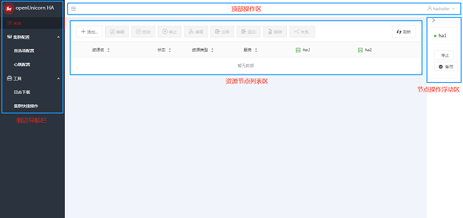
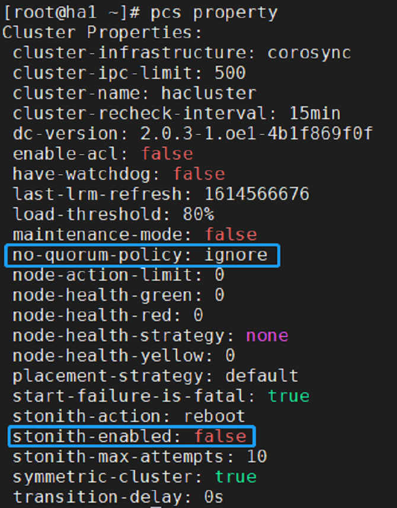
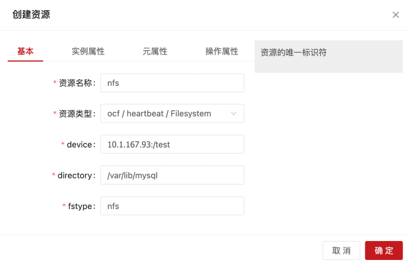
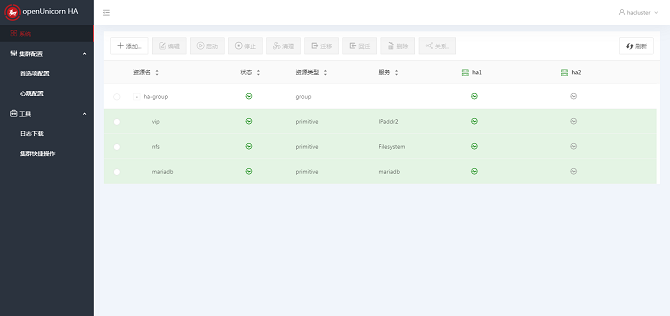
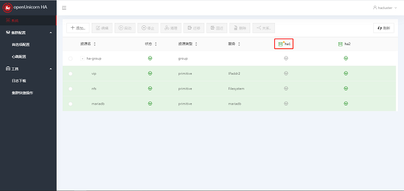

# HA使用实例

本章介绍如何快速使用HA高可用集群，以及添加一个实例。若不了解怎么安装，请参考[HA的安装与部署文档](https://docs.openeuler.org/zh/docs/21.03/docs/desktop/installha.html)。


## 快速使用指南

以下操作均以社区新开发的管理平台为例。

### 登陆页面
用户名为`hacluster`，密码为该用户在主机上设置的密码。


### 主页面
登录系统后显示主页面，主页面由四部分组成：侧边导航栏、顶部操作区、资源节点列表区以及节点操作浮动区。

以下将详细介绍这四部分的特点与使用方法。



#### 导航栏
侧边导航栏由两部分组成：高可用集群软件名称和 logo 以及系统导航。系统导航由三项组成：【系统】、【集群配置】和【工具】。【系统】是默认选项，也是主页面的对应项，主要展示系统中所有资源的相关信息以及操作入口；【集群配置】下设【首选项配置】和【心跳配置】两项；【工具】下设【日志下载】和【集群快捷操作】两项，点击后以弹出框的形式出现。

#### 顶部操作区
登录用户是静态显示，鼠标滑过用户图标，出现操作菜单项，包括【刷新设置】和【退出登录】两项，点击【刷新设置】，弹出【刷新设置】对话框，包含【刷新设置】选项，可以设置系统的自动刷新模式，包括【不自动刷新】、【每 5 秒刷新】和【每 10 秒刷新】三种选择，默认选择【不自动刷新】、【退出登录】即可注销本次登录，系统将自动跳到登录页面，此时，如果希望继续访问系统，则需要重新进行登录。


#### 资源节点列表区
资源节点列表集中展现系统中所有资源的【资源名】、【状态】、【资源类型】、【服务】、【运行节点】等资源信息，以及系统中所有的节点和节点的运行情况等节点信息。同时提供资源的【添加】、【编辑】、【启动】、【停止】、【清理】、【迁移】、【回迁】、【删除】和【关系】操作。

#### 节点操作浮动区
节点操作浮动区域默认是收起的状态，每当点击资源节点列表表头中的节点时，右侧会弹出节点操作扩展区域，如图所示，该区域由收起按钮、节点名称、停止和备用四个部分组成，提供节点的【停止】和【备用】操作。点击区域左上角的箭头，该区域收起。

### 首选项配置
以下操作均可用命令行配置，现只做简单示例，若想使用更多命令可以使用``pcs --help``进行查询。

- 命令行方式
    ```
    # pcs property set stonith-enabled=false
    # pcs property set no-quorum-policy=ignore
    ```
    执行如下命令，可以查看全部配置。
    ```
    pcs property
    ```
    

-  图形界面方式
    点击侧边导航栏中的【首选项配置】按钮，弹出【首选项配置】对话框。将No Quorum Policy和Stonith Enabled由默认状态改为如下对应状态；修改完成后，点击【确定】按钮完成配置。

    

### 添加资源

#### 添加普通资源

1. 点击【添加普通资源】，弹出【创建资源】对话框。
    其中资源的所有必填配置项均在【基本】页面内，选择【基本】页面内的【资源类型】后会进一步给出该类资源的其他必填配置项以及选填配置项。
	
2. 填写资源配置信息。
    对话框右侧会出现灰色文字区域，对当前的配置项进行解释说明。全部必填项配置完毕后，点击【确定】按钮即可创建普通资源，点击【取消】按钮，取消本次添加动作。
	【实例属性】、【元属性】或者【操作属性】页面中的选填配置项为选填项，不配置不会影响资源的创建过程，可以根据场景需要可选择修改，否则将按照系统默认值处理。

下面以Apache为例，分别以命令行方式和图形界面方式介绍添加资源的方法。

- 命令行方式
    ```
    # pcs resource create httpd ocf:heartbeat:apache
    ```
    查看资源运行状态
    ```
    # pcs status
    ```

    

-  图形界面方式
1. 填写资源名称和资源类型，如下图所示。

    

2. 回显为如下，则资源添加成功并启动，运行于其中一个节点上，例如ha1。

    
3. 访问apache界面成功。

    

#### 添加组资源

>**须知：**
> 添加组资源时，集群中需要至少存在一个普通资源。

1. 点击【添加组资源】，弹出【创建资源】对话框。
    【基本】页面内均为必填项，填写完毕后，点击【确定】按钮，即可完成资源的添加，点击【取消】按钮，取消本次添加动作。

    

    >**注意：**
    > 组资源的启动是按照子资源的顺序启动的，所以选择子资源时需要注意按照顺序选择。

2. 回显如下，资源添加成功。

    

#### 添加克隆资源

1. 点击【添加克隆资源】，弹出【创建资源】对话框。
    【基本】页面内填写克隆对象，资源名称会自动生成，填写完毕后，点击【确定】按钮，即可完成资源的添加，点击【取消】按钮，取消本次添加动作。

    

2. 回显如下，资源添加成功。

    

### 编辑资源

-  启动资源：资源节点列表中选中一个目标资源，要求：该资源处于非运行状态。对该资源执行启动动作。
-  停止资源：资源节点列表中选中一个目标资源，要求：该资源处于运行状态。对该资源执行停止操作。
-  清理资源：资源节点列表中选中一个目标资源，对该资源执行清理操作。
-  迁移资源：资源节点列表中选中一个目标资源，要求：该资源为处于运行状态的普通资源或者组资源，执行迁移操作可以将资源迁移到指定节点上运行。
-  回迁资源：资源节点列表中选中一个目标资源，要求：该资源已经完成迁移动作，执行回迁操作，可以清除该资源的迁移设置，资源重新迁回到原来的节点上运行。
点击按钮后，列表中该资源项的变化状态与启动资源时一致。
-  删除资源：资源节点列表中选中一个目标资源，对该资源执行删除操作。

### 设置资源关系

资源关系即为目标资源设定限制条件，资源的限制条件分为三种：资源位置、资源协同和资源顺序。
-  资源位置：设置集群中的节点对于该资源的运行级别，由此确定启动或者切换时资源在哪个节点上运行，运行级别按照从高到低的顺序依次为：Primary Node、Standby 1。
-  资源协同：设置目标资源与集群中的其他资源是否运行在同一节点上，同节点资源表示该资源与目标资源必须运行在相同节点上，互斥节点资源表示该资源与目标资源不能运行在相同的节点上。
-  资源顺序：设置目标资源与集群中的其他资源启动时的先后顺序，前置资源是指目标资源运行之前，该资源必须已经运行；后置资源是指目标资源运行之后，该资源才能运行。

## 高可用mysql实例配置

### 配置虚拟IP

1. 在首页中点击“添加”，再选择添加普通资源，并按如下进行配置。

    

2. 资源创建成功并启动，运行于其中一个节点上，例如ha1。
3. 可以ping通并连接，登录后可正常执行各种操作；资源切换到ha2运行；能够正常访问。如下图所示。
    

### 配置NFS存储

另找一台机器 10.1.167.93 作为 nfs 服务端进行配置，操作步骤如下：

1. 安装软件包

    ```
    # yum install -y nfs-utils rpcbind
    ```
2. 关闭防火墙
    ```
    # systemctl stop firewalld && systemctl disable firewalld
    ```
3. 修改/etc/selinux/config文件中SELINUX状态为disabled
    ```
    # SELINUX=disabled
    ```
4. 启动服务
    ```
    # systemctl start rpcbind && systemctl enable rpcbind
    # systemctl start nfs-server && systemctl enable nfs-server
    ```
5. 服务端创建一个共享目录
    ```
    # mkdir -p /test
    ```
6. 修改NFS配置文件
    ```
    # vim /etc/exports
    # /test *(rw,no_root_squash)
    ```
7. 重新加载服务
    ```
    # systemctl reload nfs
    ```

8. 在部署了HA高可用集群的机器安装软件包，需要先安装mysql，可以将nfs挂载到mysql数据路径。
    ```
    # yum install -y nfs-utils mariadb-server
    ```
9. 在首页中依次点击“添加”，“添加普通资源”，并按如下进行配置NFS资源。

    

10. 资源创建成功并启动，运行于其中一个节点上，例如ha1；nfs成功挂载到`/var/lib/mysql`路径下。资源切换到ha2运行；nfs从ha1节点取消挂载，并自动在ha2节点上挂载成功。如下图所示。
    

### 配置mysql

1. 在首页中依次点击“添加”，“添加普通资源”，并按如下进行配置mysql资源。

    

2. 若回显为如下，则资源添加成功。

    

### 添加上述资源为组资源

1. 按资源启动顺序添加三个资源

    在首页中依次点击“添加”，“添加组资源”，并按如下进行配置组资源。

    

2. 组资源创建成功并启动，若回显与上述三个普通资源成功现象一致，则资源添加成功。

    

3. 将ha1节点备用，成功迁移到ha2节点，运行正常。

    