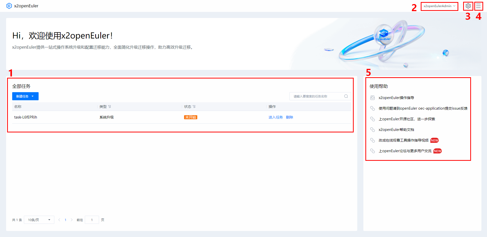
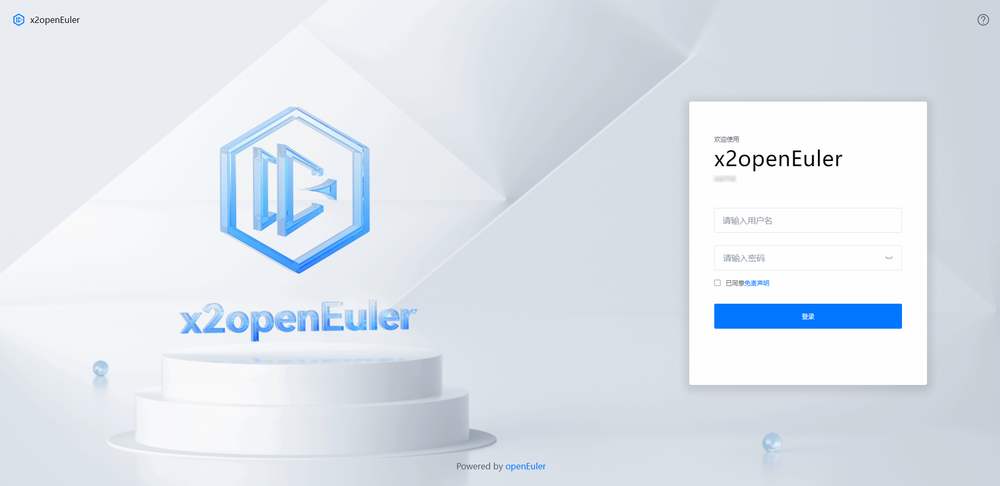
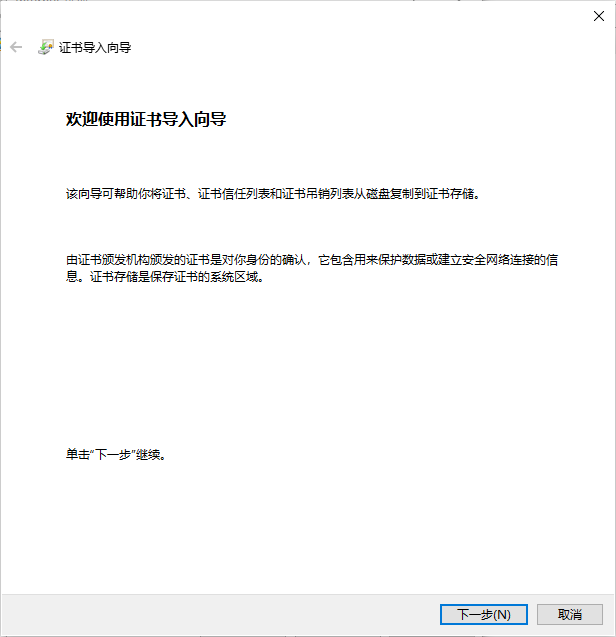
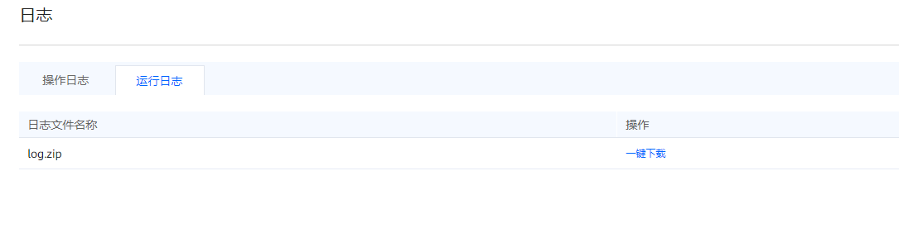

# x2openEuler 用户指南

## 前言

### 概述

本文档介绍了获取x2openEuler工具安装包，以及对其进行安装、使用的方法，对x2openEuler工具的web界面的各项功能做了详细介绍，同时提供了常见的问题解答及故障处理方法，详细请参考对应手册。

### 读者对象

本文档主要适用于升级的操作人员。操作人员必须具备以下经验和技能：

-   熟悉待升级操作系统相关情况。
-   有服务器维护操作经验。

### 符号约定

在本文中可能出现下列标志，它们所代表的含义如下。

<a name="table2622507016410"></a>

<table><thead align="left"><tr id="row1530720816410"><th class="cellrowborder" valign="top" width="20.580000000000002%" id="mcps1.1.3.1.1"><p id="p6450074116410"><a name="p6450074116410"></a><a name="p6450074116410"></a><strong id="b2136615816410"><a name="b2136615816410"></a><a name="b2136615816410"></a>符号</strong></p>
</th>
<th class="cellrowborder" valign="top" width="79.42%" id="mcps1.1.3.1.2"><p id="p5435366816410"><a name="p5435366816410"></a><a name="p5435366816410"></a><strong id="b5941558116410"><a name="b5941558116410"></a><a name="b5941558116410"></a>说明</strong></p>
</th>
</tr>
</thead>
<tbody><tr id="row1372280416410"><td class="cellrowborder" valign="top" width="20.580000000000002%" headers="mcps1.1.3.1.1 "><p id="p3734547016410"><a name="p3734547016410"></a><a name="p3734547016410"></a><a name="image2670064316410"></a><a name="image2670064316410"></a><span></span></p>
</td>
<td class="cellrowborder" valign="top" width="79.42%" headers="mcps1.1.3.1.2 "><p id="p1757432116410"><a name="p1757432116410"></a><a name="p1757432116410"></a>表示如不避免则将会导致死亡或严重伤害的具有高等级风险的危害。</p>
</td>
</tr>
<tr id="row466863216410"><td class="cellrowborder" valign="top" width="20.580000000000002%" headers="mcps1.1.3.1.1 "><p id="p1432579516410"><a name="p1432579516410"></a><a name="p1432579516410"></a><a name="image4895582316410"></a><a name="image4895582316410"></a><span></span></p>
</td>
<td class="cellrowborder" valign="top" width="79.42%" headers="mcps1.1.3.1.2 "><p id="p959197916410"><a name="p959197916410"></a><a name="p959197916410"></a>表示如不避免则可能导致死亡或严重伤害的具有中等级风险的危害。</p>
</td>
</tr>
<tr id="row123863216410"><td class="cellrowborder" valign="top" width="20.580000000000002%" headers="mcps1.1.3.1.1 "><p id="p1232579516410"><a name="p1232579516410"></a><a name="p1232579516410"></a><a name="image1235582316410"></a><a name="image1235582316410"></a><span></span></p>
</td>
<td class="cellrowborder" valign="top" width="79.42%" headers="mcps1.1.3.1.2 "><p id="p123197916410"><a name="p123197916410"></a><a name="p123197916410"></a>表示如不避免则可能导致轻微或中度伤害的具有低等级风险的危害。</p>
</td>
</tr>
<tr id="row5786682116410"><td class="cellrowborder" valign="top" width="20.580000000000002%" headers="mcps1.1.3.1.1 "><p id="p2204984716410"><a name="p2204984716410"></a><a name="p2204984716410"></a><a name="image4504446716410"></a><a name="image4504446716410"></a><span></span></p>
</td>
<td class="cellrowborder" valign="top" width="79.42%" headers="mcps1.1.3.1.2 "><p id="p4388861916410"><a name="p4388861916410"></a><a name="p4388861916410"></a>用于传递设备或环境安全警示信息。如不避免则可能会导致设备损坏、数据丢失、设备性能降低或其它不可预知的结果。</p>
<p id="p1238861916410"><a name="p1238861916410"></a><a name="p1238861916410"></a>“须知”不涉及人身伤害。</p>
</td>
</tr>
<tr id="row2856923116410"><td class="cellrowborder" valign="top" width="20.580000000000002%" headers="mcps1.1.3.1.1 "><p id="p5555360116410"><a name="p5555360116410"></a><a name="p5555360116410"></a><a name="image799324016410"></a><a name="image799324016410"></a><span></span></p>
</td>
<td class="cellrowborder" valign="top" width="79.42%" headers="mcps1.1.3.1.2 "><p id="p4612588116410"><a name="p4612588116410"></a><a name="p4612588116410"></a>对正文中重点信息的补充说明。</p>
<p id="p1232588116410"><a name="p1232588116410"></a><a name="p1232588116410"></a>“说明”不是安全警示信息，不涉及人身、设备及环境伤害信息。</p>
</td>
</tr>
</tbody>
</table>


### 命令行格式约定

<a name="table57396167"></a>

<table><thead align="left"><tr id="row54460779"><th class="cellrowborder" valign="top" width="30%" id="mcps1.1.3.1.1"><p id="p49246997"><a name="p49246997"></a><a name="p49246997"></a>格式</p>
</th>
<th class="cellrowborder" valign="top" width="70%" id="mcps1.1.3.1.2"><p id="p29583811"><a name="p29583811"></a><a name="p29583811"></a>意义</p>
</th>
</tr>
</thead>
<tbody><tr id="row47478494"><td class="cellrowborder" valign="top" width="30%" headers="mcps1.1.3.1.1 "><p id="p20552781"><a name="p20552781"></a><a name="p20552781"></a><strong id="b50757304"><a name="b50757304"></a><a name="b50757304"></a>粗体</strong></p>
</td>
<td class="cellrowborder" valign="top" width="70%" headers="mcps1.1.3.1.2 "><p id="p17700929"><a name="p17700929"></a><a name="p17700929"></a>命令行关键字（命令中保持不变、必须照输的部分）采用<strong id="b25090633"><a name="b25090633"></a><a name="b25090633"></a>加粗</strong>字体表示。</p>
</td>
</tr>
<tr id="row24489106"><td class="cellrowborder" valign="top" width="30%" headers="mcps1.1.3.1.1 "><p id="p37460564"><a name="p37460564"></a><a name="p37460564"></a><em id="i1600758"><a name="i1600758"></a><a name="i1600758"></a>斜体</em></p>
</td>
<td class="cellrowborder" valign="top" width="70%" headers="mcps1.1.3.1.2 "><p id="p62552612"><a name="p62552612"></a><a name="p62552612"></a>命令行参数（命令中必须由实际值进行替代的部分）采用斜体表示。</p>
</td>
</tr>
<tr id="row26102601"><td class="cellrowborder" valign="top" width="30%" headers="mcps1.1.3.1.1 "><p id="p33935949"><a name="p33935949"></a><a name="p33935949"></a>[ ]</p>
</td>
<td class="cellrowborder" valign="top" width="70%" headers="mcps1.1.3.1.2 "><p id="p64457312"><a name="p64457312"></a><a name="p64457312"></a>表示用“[ ]”括起来的部分在命令配置时是可选的。</p>
</td>
</tr>
<tr id="row43244904"><td class="cellrowborder" valign="top" width="30%" headers="mcps1.1.3.1.1 "><p id="p13176344"><a name="p13176344"></a><a name="p13176344"></a>{ x | y | ... }</p>
</td>
<td class="cellrowborder" valign="top" width="70%" headers="mcps1.1.3.1.2 "><p id="p60650924"><a name="p60650924"></a><a name="p60650924"></a>表示从两个或多个选项中选取一个。</p>
</td>
</tr>
<tr id="row8987407"><td class="cellrowborder" valign="top" width="30%" headers="mcps1.1.3.1.1 "><p id="p56891381"><a name="p56891381"></a><a name="p56891381"></a>[ x | y | ... ]</p>
</td>
<td class="cellrowborder" valign="top" width="70%" headers="mcps1.1.3.1.2 "><p id="p44799155"><a name="p44799155"></a><a name="p44799155"></a>表示从两个或多个选项中选取一个或者不选。</p>
</td>
</tr>
<tr id="row539219"><td class="cellrowborder" valign="top" width="30%" headers="mcps1.1.3.1.1 "><p id="p43676810"><a name="p43676810"></a><a name="p43676810"></a>{ x | y | ... }*</p>
</td>
<td class="cellrowborder" valign="top" width="70%" headers="mcps1.1.3.1.2 "><p id="p48160684"><a name="p48160684"></a><a name="p48160684"></a>表示从两个或多个选项中选取多个，最少选取一个，最多选取所有选项。</p>
</td>
</tr>
<tr id="row30792978"><td class="cellrowborder" valign="top" width="30%" headers="mcps1.1.3.1.1 "><p id="p11203266"><a name="p11203266"></a><a name="p11203266"></a>[ x | y | ... ]*</p>
</td>
<td class="cellrowborder" valign="top" width="70%" headers="mcps1.1.3.1.2 "><p id="p35049363"><a name="p35049363"></a><a name="p35049363"></a>表示从两个或多个选项中选取多个或者不选。</p>
</td>
</tr>
<tr id="row47008815"><td class="cellrowborder" valign="top" width="30%" headers="mcps1.1.3.1.1 "><p id="p49617684"><a name="p49617684"></a><a name="p49617684"></a>&amp;&lt;1-n&gt;</p>
</td>
<td class="cellrowborder" valign="top" width="70%" headers="mcps1.1.3.1.2 "><p id="p59609453"><a name="p59609453"></a><a name="p59609453"></a>表示符号“&amp;”前面的参数可以重复1～n次。</p>
</td>
</tr>
<tr id="row66723033"><td class="cellrowborder" valign="top" width="30%" headers="mcps1.1.3.1.1 "><p id="p35856572"><a name="p35856572"></a><a name="p35856572"></a>#</p>
</td>
<td class="cellrowborder" valign="top" width="70%" headers="mcps1.1.3.1.2 "><p id="p18701191"><a name="p18701191"></a><a name="p18701191"></a>表示由“#”开始的行为注释行。</p>
</td>
</tr>
</tbody>
</table>


### 修改记录

<a name="table1557726816410"></a>

<table><thead align="left"><tr id="row2942532716410"><th class="cellrowborder" valign="top" width="20.72%" id="mcps1.1.4.1.1"><p id="p3778275416410"><a name="p3778275416410"></a><a name="p3778275416410"></a><strong id="b5687322716410"><a name="b5687322716410"></a><a name="b5687322716410"></a>文档版本</strong></p>
</th>
<th class="cellrowborder" valign="top" width="26.119999999999997%" id="mcps1.1.4.1.2"><p id="p5627845516410"><a name="p5627845516410"></a><a name="p5627845516410"></a><strong id="b5800814916410"><a name="b5800814916410"></a><a name="b5800814916410"></a>发布日期</strong></p>
</th>
<th class="cellrowborder" valign="top" width="53.16%" id="mcps1.1.4.1.3"><p id="p2382284816410"><a name="p2382284816410"></a><a name="p2382284816410"></a><strong id="b3316380216410"><a name="b3316380216410"></a><a name="b3316380216410"></a>修改说明</strong></p>
</th>
</tr>
</thead>
<tbody><tr id="row5947359616410"><td class="cellrowborder" valign="top" width="20.72%" headers="mcps1.1.4.1.1 "><p id="p2149706016410"><a name="p2149706016410"></a><a name="p2149706016410"></a>01</p>
</td>
<td class="cellrowborder" valign="top" width="26.119999999999997%" headers="mcps1.1.4.1.2 "><p id="p648803616410"><a name="p648803616410"></a><a name="p648803616410"></a>2022-08-20</p>
</td>
<td class="cellrowborder" valign="top" width="53.16%" headers="mcps1.1.4.1.3 "><p id="p1946537916410"><a name="p1946537916410"></a><a name="p1946537916410"></a>第一次正式发布。</p>
</td>
</tr>
<tr id="row113056229487"><td class="cellrowborder" valign="top" width="20.72%" headers="mcps1.1.4.1.1 "><p id="p83061422144813"><a name="p83061422144813"></a><a name="p83061422144813"></a>02</p>
</td>
<td class="cellrowborder" valign="top" width="26.119999999999997%" headers="mcps1.1.4.1.2 "><p id="p11306822114813"><a name="p11306822114813"></a><a name="p11306822114813"></a>2022-09-30</p>
</td>
<td class="cellrowborder" valign="top" width="53.16%" headers="mcps1.1.4.1.3 "><p id="p6306022184820"><a name="p6306022184820"></a><a name="p6306022184820"></a>第二次正式发布。</p>
</td>
</tr>
</tbody>
</table>


## 介绍


### 免责声明

-   在生产环境使用之前，需要在测试环境上进行过测试，避免影响生产业务运行。
-   使用过程中涉及的非工具本身验证功能所用的用户名和密码，不作他用，且不会被保存在系统环境中。
-   在您进行分析或操作前应当确认您为应用程序的所有者或已获得所有者的充足授权同意。
-   分析结果中可能包含您所分析应用的内部信息和相关数据，请妥善管理。
-   除非法律法规或双方合同另有规定，本工具对分析结果不做任何明示或暗示的声明和保证,不对分析结果的适销性、满意度、非侵权性或特定用途适用性等作出任何保证或者承诺。
-   您根据分析记录所采取的任何行为均应符合法律法规的要求，并由您自行承担风险。
-   未经所有者授权，任何个人或组织均不得使用应用程序及相关分析记录从事任何活动。

### x2openEuler 原地升级工具简介

x2openEuler工具是一款将源操作系统升级为目标操作系统的搬迁工具套件。工具支持原地升级功能，当前支持将CentOS 7.6升级至openEuler 20.03-LTS-SP1。

当客户运行环境的操作系统生命周期即将EOS，但依托于业务运行的相关应用软件和产品还未到结束生命周期时，为了保障业务的持续性和安全性，可使用x2openEuler工具将源操作系统升级到新的目标操作系统。

x2openEuler工具提供web界面方式进行操作，以供使用者能够在图形化界面便捷的进行升级操作。

同时，为了面向全面的数字化改造，配合产品信息化改造，使用x2openEuler工具升级的目标操作系统采用欧拉技术线，对于已有的业务系统完成数字化改造后可实现无缝迁移，保证业务的稳定性和高可用性。

### 应用场景

升级任务：当用户运行环境操作系统生命周期即将EOS时，可使用该工具将本地操作系统升级到新的目标操作系统。

### 部署方式

单机部署，即将x2openEuler工具部署在用户的安装Cent OS 7.6服务器上。

### 访问和使用

x2openEuler工具提供命令行或者web使用方式，用户在安装完成后选择使用方式。工具的使用方法请参考章节[通过web界面使用x2openEuler工具](#通过web界面使用x2openeuler工具)。

> **须知：** 
>
>-   待升级节点升级过程中需要root权限。


#### 界面说明

##### 界面分区

x2openEuler工具首页界面主要由如所示的区域组成，各个区域的作用如图所示。

**图 1**  x2openEuler工具首页界面<a name="fig14369194612411"></a>  


**表 1**  x2openEuler工具首页界面参数说明

<a name="table12281714194218"></a>

<table><thead align="left"><tr id="row172288142423"><th class="cellrowborder" valign="top" width="6.380638063806381%" id="mcps1.2.4.1.1"><p id="p32287147425"><a name="p32287147425"></a><a name="p32287147425"></a><strong id="b470814119432"><a name="b470814119432"></a><a name="b470814119432"></a>区域</strong></p>
</th>
<th class="cellrowborder" valign="top" width="27.912791279127912%" id="mcps1.2.4.1.2"><p id="p62281014124210"><a name="p62281014124210"></a><a name="p62281014124210"></a><strong id="b67267120439"><a name="b67267120439"></a><a name="b67267120439"></a>名称</strong></p>
</th>
<th class="cellrowborder" valign="top" width="65.70657065706571%" id="mcps1.2.4.1.3"><p id="p19228191418424"><a name="p19228191418424"></a><a name="p19228191418424"></a><strong id="b17745161164319"><a name="b17745161164319"></a><a name="b17745161164319"></a>说明</strong></p>
</th>
</tr>
</thead>
<tbody><tr id="row1722851413422"><td class="cellrowborder" valign="top" width="6.380638063806381%" headers="mcps1.2.4.1.1 "><p id="p52282140425"><a name="p52282140425"></a><a name="p52282140425"></a>1</p>
</td>
<td class="cellrowborder" valign="top" width="27.912791279127912%" headers="mcps1.2.4.1.2 "><p id="p922981416428"><a name="p922981416428"></a><a name="p922981416428"></a>任务管理区</p>
</td>
<td class="cellrowborder" valign="top" width="65.70657065706571%" headers="mcps1.2.4.1.3 "><p id="p1444817396303"><a name="p1444817396303"></a><a name="p1444817396303"></a>升级任务管理入口，用户可进行创建、启动、删除任务等操作。</p>
</td>
</tr>
<tr id="row17229114194210"><td class="cellrowborder" valign="top" width="6.380638063806381%" headers="mcps1.2.4.1.1 "><p id="p62296147422"><a name="p62296147422"></a><a name="p62296147422"></a>2</p>
</td>
<td class="cellrowborder" valign="top" width="27.912791279127912%" headers="mcps1.2.4.1.2 "><p id="p9229171412423"><a name="p9229171412423"></a><a name="p9229171412423"></a>当前用户</p>
</td>
<td class="cellrowborder" valign="top" width="65.70657065706571%" headers="mcps1.2.4.1.3 "><p id="p42291414144213"><a name="p42291414144213"></a><a name="p42291414144213"></a>展示当前登录用户，并提供修改密码和用户登出的操作入口。</p>
</td>
</tr>
<tr id="row522911416424"><td class="cellrowborder" valign="top" width="6.380638063806381%" headers="mcps1.2.4.1.1 "><p id="p1822971474210"><a name="p1822971474210"></a><a name="p1822971474210"></a>3</p>
</td>
<td class="cellrowborder" valign="top" width="27.912791279127912%" headers="mcps1.2.4.1.2 "><p id="p0229121415427"><a name="p0229121415427"></a><a name="p0229121415427"></a>配置</p>
</td>
<td class="cellrowborder" valign="top" width="65.70657065706571%" headers="mcps1.2.4.1.3 "><p id="p1922961474213"><a name="p1922961474213"></a><a name="p1922961474213"></a>提供用户管理，弱口令字典，系统配置，日志和web服务端证书功能入口。</p>
</td>
</tr>
<tr id="row7597171003218"><td class="cellrowborder" valign="top" width="6.380638063806381%" headers="mcps1.2.4.1.1 "><p id="p125981610153214"><a name="p125981610153214"></a><a name="p125981610153214"></a>4</p>
</td>
<td class="cellrowborder" valign="top" width="27.912791279127912%" headers="mcps1.2.4.1.2 "><p id="p6598510113213"><a name="p6598510113213"></a><a name="p6598510113213"></a>更多</p>
</td>
<td class="cellrowborder" valign="top" width="65.70657065706571%" headers="mcps1.2.4.1.3 "><p id="p659891073215"><a name="p659891073215"></a><a name="p659891073215"></a>提供中英文切换，联机帮助、免责声明和<span id="text562174003813"><a name="text562174003813"></a><a name="text562174003813"></a>x2openEuler工具</span>发布信息入口。</p>
</td>
</tr>
<tr id="row37000158325"><td class="cellrowborder" valign="top" width="6.380638063806381%" headers="mcps1.2.4.1.1 "><p id="p107004159328"><a name="p107004159328"></a><a name="p107004159328"></a>5</p>
</td>
<td class="cellrowborder" valign="top" width="27.912791279127912%" headers="mcps1.2.4.1.2 "><p id="p370011553218"><a name="p370011553218"></a><a name="p370011553218"></a>案例链接区</p>
</td>
<td class="cellrowborder" valign="top" width="65.70657065706571%" headers="mcps1.2.4.1.3 "><p id="zh-cn_topic_0000001234342694_zh-cn_topic_0228242391_zh-cn_topic_0188408909_p138187261471"><a name="zh-cn_topic_0000001234342694_zh-cn_topic_0228242391_zh-cn_topic_0188408909_p138187261471"></a><a name="zh-cn_topic_0000001234342694_zh-cn_topic_0228242391_zh-cn_topic_0188408909_p138187261471"></a>提供典型案例链接，并为每个功能提供示例代码。</p>
</td>
</tr>
</tbody>
</table>


##### 图标及按钮说明

x2openEuler工具中出现的图标/按钮及其说明如[表2](#zh-cn_topic_0000001234342694_zh-cn_topic_0228242391_zh-cn_topic_0188408909_table810511366261)所示。

**表 2**  图标/按钮说明

<a name="zh-cn_topic_0000001234342694_zh-cn_topic_0228242391_zh-cn_topic_0188408909_table810511366261"></a>

<table><thead align="left"><tr id="zh-cn_topic_0000001234342694_zh-cn_topic_0228242391_zh-cn_topic_0188408909_row610533642618"><th class="cellrowborder" valign="top" width="23%" id="mcps1.2.4.1.1"><p id="zh-cn_topic_0000001234342694_zh-cn_topic_0228242391_zh-cn_topic_0188408909_p1010512362262"><a name="zh-cn_topic_0000001234342694_zh-cn_topic_0228242391_zh-cn_topic_0188408909_p1010512362262"></a><a name="zh-cn_topic_0000001234342694_zh-cn_topic_0228242391_zh-cn_topic_0188408909_p1010512362262"></a>类型</p>
</th>
<th class="cellrowborder" valign="top" width="16.98%" id="mcps1.2.4.1.2"><p id="zh-cn_topic_0000001234342694_zh-cn_topic_0228242391_zh-cn_topic_0188408909_p2105836172611"><a name="zh-cn_topic_0000001234342694_zh-cn_topic_0228242391_zh-cn_topic_0188408909_p2105836172611"></a><a name="zh-cn_topic_0000001234342694_zh-cn_topic_0228242391_zh-cn_topic_0188408909_p2105836172611"></a>图标/按钮</p>
</th>
<th class="cellrowborder" valign="top" width="60.019999999999996%" id="mcps1.2.4.1.3"><p id="zh-cn_topic_0000001234342694_zh-cn_topic_0228242391_zh-cn_topic_0188408909_p610583611263"><a name="zh-cn_topic_0000001234342694_zh-cn_topic_0228242391_zh-cn_topic_0188408909_p610583611263"></a><a name="zh-cn_topic_0000001234342694_zh-cn_topic_0228242391_zh-cn_topic_0188408909_p610583611263"></a>说明</p>
</th>
</tr>
</thead>
<tbody><tr id="zh-cn_topic_0000001234342694_zh-cn_topic_0228242391_zh-cn_topic_0188408909_row12707159133115"><td class="cellrowborder" rowspan="2" valign="top" width="23%" headers="mcps1.2.4.1.1 "><p id="zh-cn_topic_0000001234342694_zh-cn_topic_0228242391_zh-cn_topic_0188408909_p268910230347"><a name="zh-cn_topic_0000001234342694_zh-cn_topic_0228242391_zh-cn_topic_0188408909_p268910230347"></a><a name="zh-cn_topic_0000001234342694_zh-cn_topic_0228242391_zh-cn_topic_0188408909_p268910230347"></a>信息图标</p>
</td>
<td class="cellrowborder" valign="top" width="16.98%" headers="mcps1.2.4.1.2 "><p id="zh-cn_topic_0000001234342694_zh-cn_topic_0228242391_zh-cn_topic_0188408909_p490344411436"><a name="zh-cn_topic_0000001234342694_zh-cn_topic_0228242391_zh-cn_topic_0188408909_p490344411436"></a><a name="zh-cn_topic_0000001234342694_zh-cn_topic_0228242391_zh-cn_topic_0188408909_p490344411436"></a><a name="image520520402015"></a><a name="image520520402015"></a><span></span></p>
</td>
<td class="cellrowborder" valign="top" width="60.019999999999996%" headers="mcps1.2.4.1.3 "><p id="zh-cn_topic_0000001234342694_zh-cn_topic_0228242391_zh-cn_topic_0188408909_p119032449436"><a name="zh-cn_topic_0000001234342694_zh-cn_topic_0228242391_zh-cn_topic_0188408909_p119032449436"></a><a name="zh-cn_topic_0000001234342694_zh-cn_topic_0228242391_zh-cn_topic_0188408909_p119032449436"></a>配置。</p>
</td>
</tr>
<tr id="zh-cn_topic_0000001234342694_zh-cn_topic_0228242391_zh-cn_topic_0188408909_row3767138112818"><td class="cellrowborder" valign="top" headers="mcps1.2.4.1.1 "><p id="zh-cn_topic_0000001234342694_zh-cn_topic_0228242391_zh-cn_topic_0188408909_p27671738152818"><a name="zh-cn_topic_0000001234342694_zh-cn_topic_0228242391_zh-cn_topic_0188408909_p27671738152818"></a><a name="zh-cn_topic_0000001234342694_zh-cn_topic_0228242391_zh-cn_topic_0188408909_p27671738152818"></a><a name="image143545944619"></a><a name="image143545944619"></a><span></span></p>
</td>
<td class="cellrowborder" valign="top" headers="mcps1.2.4.1.2 "><p id="zh-cn_topic_0000001234342694_zh-cn_topic_0228242391_zh-cn_topic_0188408909_p17767173812289"><a name="zh-cn_topic_0000001234342694_zh-cn_topic_0228242391_zh-cn_topic_0188408909_p17767173812289"></a><a name="zh-cn_topic_0000001234342694_zh-cn_topic_0228242391_zh-cn_topic_0188408909_p17767173812289"></a>更多。</p>
</td>
</tr>
<tr id="zh-cn_topic_0000001234342694_zh-cn_topic_0228242391_zh-cn_topic_0188408909_row1461975872418"><td class="cellrowborder" rowspan="3" valign="top" width="23%" headers="mcps1.2.4.1.1 "><p id="zh-cn_topic_0000001234342694_zh-cn_topic_0228242391_zh-cn_topic_0188408909_p1851122214381"><a name="zh-cn_topic_0000001234342694_zh-cn_topic_0228242391_zh-cn_topic_0188408909_p1851122214381"></a><a name="zh-cn_topic_0000001234342694_zh-cn_topic_0228242391_zh-cn_topic_0188408909_p1851122214381"></a>标志符号</p>
</td>
<td class="cellrowborder" valign="top" width="16.98%" headers="mcps1.2.4.1.2 "><p id="zh-cn_topic_0000001234342694_zh-cn_topic_0228242391_zh-cn_topic_0188408909_p1651132233813"><a name="zh-cn_topic_0000001234342694_zh-cn_topic_0228242391_zh-cn_topic_0188408909_p1651132233813"></a><a name="zh-cn_topic_0000001234342694_zh-cn_topic_0228242391_zh-cn_topic_0188408909_p1651132233813"></a><a name="zh-cn_topic_0000001234342694_zh-cn_topic_0228242391_zh-cn_topic_0188408909_image6999175355916"></a><a name="zh-cn_topic_0000001234342694_zh-cn_topic_0228242391_zh-cn_topic_0188408909_image6999175355916"></a><span></span></p>
</td>
<td class="cellrowborder" valign="top" width="60.019999999999996%" headers="mcps1.2.4.1.3 "><p id="zh-cn_topic_0000001234342694_zh-cn_topic_0228242391_zh-cn_topic_0188408909_p351117229388"><a name="zh-cn_topic_0000001234342694_zh-cn_topic_0228242391_zh-cn_topic_0188408909_p351117229388"></a><a name="zh-cn_topic_0000001234342694_zh-cn_topic_0228242391_zh-cn_topic_0188408909_p351117229388"></a>用于提示操作警示信息。</p>
</td>
</tr>
<tr id="zh-cn_topic_0000001234342694_row831115356595"><td class="cellrowborder" valign="top" headers="mcps1.2.4.1.1 "><p id="zh-cn_topic_0000001234342694_p5311173585919"><a name="zh-cn_topic_0000001234342694_p5311173585919"></a><a name="zh-cn_topic_0000001234342694_p5311173585919"></a><a name="zh-cn_topic_0000001234342694_image1140320351801"></a><a name="zh-cn_topic_0000001234342694_image1140320351801"></a><span></span></p>
</td>
<td class="cellrowborder" valign="top" headers="mcps1.2.4.1.2 "><p id="zh-cn_topic_0000001234342694_p1311133575910"><a name="zh-cn_topic_0000001234342694_p1311133575910"></a><a name="zh-cn_topic_0000001234342694_p1311133575910"></a>用于提示操作提醒信息。</p>
</td>
</tr>
<tr id="zh-cn_topic_0000001234342694_row9615837532"><td class="cellrowborder" valign="top" headers="mcps1.2.4.1.1 "><p id="zh-cn_topic_0000001234342694_p26159372319"><a name="zh-cn_topic_0000001234342694_p26159372319"></a><a name="zh-cn_topic_0000001234342694_p26159372319"></a><a name="zh-cn_topic_0000001234342694_image18781951354"></a><a name="zh-cn_topic_0000001234342694_image18781951354"></a><span></span></p>
</td>
<td class="cellrowborder" valign="top" headers="mcps1.2.4.1.2 "><p id="zh-cn_topic_0000001234342694_p14615173719319"><a name="zh-cn_topic_0000001234342694_p14615173719319"></a><a name="zh-cn_topic_0000001234342694_p14615173719319"></a>用于提示操作异常信息。</p>
</td>
</tr>
<tr id="zh-cn_topic_0000001234342694_zh-cn_topic_0228242391_zh-cn_topic_0188408909_row1740103733419"><td class="cellrowborder" rowspan="12" valign="top" width="23%" headers="mcps1.2.4.1.1 "><p id="zh-cn_topic_0000001234342694_zh-cn_topic_0228242391_zh-cn_topic_0188408909_p11191182865415"><a name="zh-cn_topic_0000001234342694_zh-cn_topic_0228242391_zh-cn_topic_0188408909_p11191182865415"></a><a name="zh-cn_topic_0000001234342694_zh-cn_topic_0228242391_zh-cn_topic_0188408909_p11191182865415"></a>用户控件图标</p>
</td>
<td class="cellrowborder" valign="top" width="16.98%" headers="mcps1.2.4.1.2 "><p id="zh-cn_topic_0000001234342694_zh-cn_topic_0228242391_zh-cn_topic_0188408909_p2302192116285"><a name="zh-cn_topic_0000001234342694_zh-cn_topic_0228242391_zh-cn_topic_0188408909_p2302192116285"></a><a name="zh-cn_topic_0000001234342694_zh-cn_topic_0228242391_zh-cn_topic_0188408909_p2302192116285"></a><a name="zh-cn_topic_0000001234342694_zh-cn_topic_0228242391_zh-cn_topic_0188408909_image159098818019"></a><a name="zh-cn_topic_0000001234342694_zh-cn_topic_0228242391_zh-cn_topic_0188408909_image159098818019"></a><span></span></p>
</td>
<td class="cellrowborder" valign="top" width="60.019999999999996%" headers="mcps1.2.4.1.3 "><p id="zh-cn_topic_0000001234342694_zh-cn_topic_0228242391_zh-cn_topic_0188408909_p1056721517387"><a name="zh-cn_topic_0000001234342694_zh-cn_topic_0228242391_zh-cn_topic_0188408909_p1056721517387"></a><a name="zh-cn_topic_0000001234342694_zh-cn_topic_0228242391_zh-cn_topic_0188408909_p1056721517387"></a>下载：将操作对象保存在本地。</p>
</td>
</tr>
<tr id="zh-cn_topic_0000001234342694_zh-cn_topic_0228242391_zh-cn_topic_0188408909_row137911040173410"><td class="cellrowborder" valign="top" headers="mcps1.2.4.1.1 "><p id="zh-cn_topic_0000001234342694_zh-cn_topic_0228242391_zh-cn_topic_0188408909_p15941133223015"><a name="zh-cn_topic_0000001234342694_zh-cn_topic_0228242391_zh-cn_topic_0188408909_p15941133223015"></a><a name="zh-cn_topic_0000001234342694_zh-cn_topic_0228242391_zh-cn_topic_0188408909_p15941133223015"></a><a name="zh-cn_topic_0000001234342694_zh-cn_topic_0228242391_zh-cn_topic_0188408909_image159153292017"></a><a name="zh-cn_topic_0000001234342694_zh-cn_topic_0228242391_zh-cn_topic_0188408909_image159153292017"></a><span></span></p>
</td>
<td class="cellrowborder" valign="top" headers="mcps1.2.4.1.2 "><p id="zh-cn_topic_0000001234342694_zh-cn_topic_0228242391_zh-cn_topic_0188408909_p2567191515381"><a name="zh-cn_topic_0000001234342694_zh-cn_topic_0228242391_zh-cn_topic_0188408909_p2567191515381"></a><a name="zh-cn_topic_0000001234342694_zh-cn_topic_0228242391_zh-cn_topic_0188408909_p2567191515381"></a>删除所选条目。</p>
</td>
</tr>
<tr id="zh-cn_topic_0000001234342694_zh-cn_topic_0228242391_zh-cn_topic_0188408909_row1755758203019"><td class="cellrowborder" valign="top" headers="mcps1.2.4.1.1 "><p id="zh-cn_topic_0000001234342694_zh-cn_topic_0228242391_zh-cn_topic_0188408909_p123518277349"><a name="zh-cn_topic_0000001234342694_zh-cn_topic_0228242391_zh-cn_topic_0188408909_p123518277349"></a><a name="zh-cn_topic_0000001234342694_zh-cn_topic_0228242391_zh-cn_topic_0188408909_p123518277349"></a><a name="zh-cn_topic_0000001234342694_zh-cn_topic_0228242391_zh-cn_topic_0188408909_image19294141333515"></a><a name="zh-cn_topic_0000001234342694_zh-cn_topic_0228242391_zh-cn_topic_0188408909_image19294141333515"></a><span></span></p>
</td>
<td class="cellrowborder" valign="top" headers="mcps1.2.4.1.2 "><p id="zh-cn_topic_0000001234342694_zh-cn_topic_0228242391_zh-cn_topic_0188408909_p55671015153820"><a name="zh-cn_topic_0000001234342694_zh-cn_topic_0228242391_zh-cn_topic_0188408909_p55671015153820"></a><a name="zh-cn_topic_0000001234342694_zh-cn_topic_0228242391_zh-cn_topic_0188408909_p55671015153820"></a>展开：展开已折叠的列表项。</p>
</td>
</tr>
<tr id="zh-cn_topic_0000001234342694_zh-cn_topic_0228242391_zh-cn_topic_0188408909_row114181353183213"><td class="cellrowborder" valign="top" headers="mcps1.2.4.1.1 "><p id="zh-cn_topic_0000001234342694_zh-cn_topic_0228242391_zh-cn_topic_0188408909_p1241925363217"><a name="zh-cn_topic_0000001234342694_zh-cn_topic_0228242391_zh-cn_topic_0188408909_p1241925363217"></a><a name="zh-cn_topic_0000001234342694_zh-cn_topic_0228242391_zh-cn_topic_0188408909_p1241925363217"></a><a name="zh-cn_topic_0000001234342694_zh-cn_topic_0228242391_zh-cn_topic_0188408909_image59742028113415"></a><a name="zh-cn_topic_0000001234342694_zh-cn_topic_0228242391_zh-cn_topic_0188408909_image59742028113415"></a><span></span></p>
</td>
<td class="cellrowborder" valign="top" headers="mcps1.2.4.1.2 "><p id="zh-cn_topic_0000001234342694_zh-cn_topic_0228242391_zh-cn_topic_0188408909_p8419195313325"><a name="zh-cn_topic_0000001234342694_zh-cn_topic_0228242391_zh-cn_topic_0188408909_p8419195313325"></a><a name="zh-cn_topic_0000001234342694_zh-cn_topic_0228242391_zh-cn_topic_0188408909_p8419195313325"></a>折叠：折叠已展开的列表项。</p>
</td>
</tr>
<tr id="zh-cn_topic_0000001234342694_zh-cn_topic_0228242391_zh-cn_topic_0188408909_row1178491718468"><td class="cellrowborder" valign="top" headers="mcps1.2.4.1.1 "><p id="zh-cn_topic_0000001234342694_zh-cn_topic_0228242391_zh-cn_topic_0188408909_p1978481718469"><a name="zh-cn_topic_0000001234342694_zh-cn_topic_0228242391_zh-cn_topic_0188408909_p1978481718469"></a><a name="zh-cn_topic_0000001234342694_zh-cn_topic_0228242391_zh-cn_topic_0188408909_p1978481718469"></a><a name="zh-cn_topic_0000001234342694_zh-cn_topic_0228242391_zh-cn_topic_0188408909_image766212139119"></a><a name="zh-cn_topic_0000001234342694_zh-cn_topic_0228242391_zh-cn_topic_0188408909_image766212139119"></a><span></span></p>
</td>
<td class="cellrowborder" valign="top" headers="mcps1.2.4.1.2 "><p id="zh-cn_topic_0000001234342694_zh-cn_topic_0228242391_zh-cn_topic_0188408909_p67841517194614"><a name="zh-cn_topic_0000001234342694_zh-cn_topic_0228242391_zh-cn_topic_0188408909_p67841517194614"></a><a name="zh-cn_topic_0000001234342694_zh-cn_topic_0228242391_zh-cn_topic_0188408909_p67841517194614"></a>保存：保存修改。</p>
</td>
</tr>
<tr id="zh-cn_topic_0000001234342694_zh-cn_topic_0228242391_zh-cn_topic_0188408909_row71441329184612"><td class="cellrowborder" valign="top" headers="mcps1.2.4.1.1 "><p id="zh-cn_topic_0000001234342694_zh-cn_topic_0228242391_zh-cn_topic_0188408909_p4144229164610"><a name="zh-cn_topic_0000001234342694_zh-cn_topic_0228242391_zh-cn_topic_0188408909_p4144229164610"></a><a name="zh-cn_topic_0000001234342694_zh-cn_topic_0228242391_zh-cn_topic_0188408909_p4144229164610"></a><a name="zh-cn_topic_0000001234342694_zh-cn_topic_0228242391_zh-cn_topic_0188408909_image95061921611"></a><a name="zh-cn_topic_0000001234342694_zh-cn_topic_0228242391_zh-cn_topic_0188408909_image95061921611"></a><span></span></p>
</td>
<td class="cellrowborder" valign="top" headers="mcps1.2.4.1.2 "><p id="zh-cn_topic_0000001234342694_zh-cn_topic_0228242391_zh-cn_topic_0188408909_p13622184865214"><a name="zh-cn_topic_0000001234342694_zh-cn_topic_0228242391_zh-cn_topic_0188408909_p13622184865214"></a><a name="zh-cn_topic_0000001234342694_zh-cn_topic_0228242391_zh-cn_topic_0188408909_p13622184865214"></a>回退：回退到前一步。</p>
</td>
</tr>
<tr id="zh-cn_topic_0000001234342694_zh-cn_topic_0228242391_zh-cn_topic_0188408909_row109441126184612"><td class="cellrowborder" valign="top" headers="mcps1.2.4.1.1 "><p id="zh-cn_topic_0000001234342694_zh-cn_topic_0228242391_zh-cn_topic_0188408909_p11944182614618"><a name="zh-cn_topic_0000001234342694_zh-cn_topic_0228242391_zh-cn_topic_0188408909_p11944182614618"></a><a name="zh-cn_topic_0000001234342694_zh-cn_topic_0228242391_zh-cn_topic_0188408909_p11944182614618"></a><a name="zh-cn_topic_0000001234342694_zh-cn_topic_0228242391_zh-cn_topic_0188408909_image8909153511117"></a><a name="zh-cn_topic_0000001234342694_zh-cn_topic_0228242391_zh-cn_topic_0188408909_image8909153511117"></a><span></span></p>
</td>
<td class="cellrowborder" valign="top" headers="mcps1.2.4.1.2 "><p id="zh-cn_topic_0000001234342694_zh-cn_topic_0228242391_zh-cn_topic_0188408909_p4531157165313"><a name="zh-cn_topic_0000001234342694_zh-cn_topic_0228242391_zh-cn_topic_0188408909_p4531157165313"></a><a name="zh-cn_topic_0000001234342694_zh-cn_topic_0228242391_zh-cn_topic_0188408909_p4531157165313"></a>取消：取消修改。</p>
</td>
</tr>
<tr id="zh-cn_topic_0000001234342694_zh-cn_topic_0228242391_zh-cn_topic_0188408909_row05851424174620"><td class="cellrowborder" valign="top" headers="mcps1.2.4.1.1 "><p id="zh-cn_topic_0000001234342694_zh-cn_topic_0228242391_zh-cn_topic_0188408909_p13585192494611"><a name="zh-cn_topic_0000001234342694_zh-cn_topic_0228242391_zh-cn_topic_0188408909_p13585192494611"></a><a name="zh-cn_topic_0000001234342694_zh-cn_topic_0228242391_zh-cn_topic_0188408909_p13585192494611"></a><a name="zh-cn_topic_0000001234342694_zh-cn_topic_0228242391_zh-cn_topic_0188408909_image15624595215"></a><a name="zh-cn_topic_0000001234342694_zh-cn_topic_0228242391_zh-cn_topic_0188408909_image15624595215"></a><span></span></p>
</td>
<td class="cellrowborder" valign="top" headers="mcps1.2.4.1.2 "><p id="zh-cn_topic_0000001234342694_zh-cn_topic_0228242391_zh-cn_topic_0188408909_p1858502413467"><a name="zh-cn_topic_0000001234342694_zh-cn_topic_0228242391_zh-cn_topic_0188408909_p1858502413467"></a><a name="zh-cn_topic_0000001234342694_zh-cn_topic_0228242391_zh-cn_topic_0188408909_p1858502413467"></a>上一个：移动到上一个建议修改处。</p>
</td>
</tr>
<tr id="zh-cn_topic_0000001234342694_zh-cn_topic_0228242391_zh-cn_topic_0188408909_row5112922194620"><td class="cellrowborder" valign="top" headers="mcps1.2.4.1.1 "><p id="zh-cn_topic_0000001234342694_zh-cn_topic_0228242391_zh-cn_topic_0188408909_p131128221461"><a name="zh-cn_topic_0000001234342694_zh-cn_topic_0228242391_zh-cn_topic_0188408909_p131128221461"></a><a name="zh-cn_topic_0000001234342694_zh-cn_topic_0228242391_zh-cn_topic_0188408909_p131128221461"></a><a name="zh-cn_topic_0000001234342694_zh-cn_topic_0228242391_zh-cn_topic_0188408909_image5314626171210"></a><a name="zh-cn_topic_0000001234342694_zh-cn_topic_0228242391_zh-cn_topic_0188408909_image5314626171210"></a><span></span></p>
</td>
<td class="cellrowborder" valign="top" headers="mcps1.2.4.1.2 "><p id="zh-cn_topic_0000001234342694_zh-cn_topic_0228242391_zh-cn_topic_0188408909_p18112132216466"><a name="zh-cn_topic_0000001234342694_zh-cn_topic_0228242391_zh-cn_topic_0188408909_p18112132216466"></a><a name="zh-cn_topic_0000001234342694_zh-cn_topic_0228242391_zh-cn_topic_0188408909_p18112132216466"></a>下一个：移动到下一个建议修改处。</p>
</td>
</tr>
<tr id="zh-cn_topic_0000001234342694_zh-cn_topic_0228242391_zh-cn_topic_0188408909_row13238337293"><td class="cellrowborder" valign="top" headers="mcps1.2.4.1.1 "><p id="zh-cn_topic_0000001234342694_zh-cn_topic_0228242391_zh-cn_topic_0188408909_p1132317335294"><a name="zh-cn_topic_0000001234342694_zh-cn_topic_0228242391_zh-cn_topic_0188408909_p1132317335294"></a><a name="zh-cn_topic_0000001234342694_zh-cn_topic_0228242391_zh-cn_topic_0188408909_p1132317335294"></a><a name="zh-cn_topic_0000001234342694_zh-cn_topic_0228242391_zh-cn_topic_0188408909_image14969195416302"></a><a name="zh-cn_topic_0000001234342694_zh-cn_topic_0228242391_zh-cn_topic_0188408909_image14969195416302"></a><span></span></p>
</td>
<td class="cellrowborder" valign="top" headers="mcps1.2.4.1.2 "><p id="zh-cn_topic_0000001234342694_zh-cn_topic_0228242391_zh-cn_topic_0188408909_p1032317333296"><a name="zh-cn_topic_0000001234342694_zh-cn_topic_0228242391_zh-cn_topic_0188408909_p1032317333296"></a><a name="zh-cn_topic_0000001234342694_zh-cn_topic_0228242391_zh-cn_topic_0188408909_p1032317333296"></a>排序。</p>
</td>
</tr>
<tr id="zh-cn_topic_0000001234342694_zh-cn_topic_0228242391_zh-cn_topic_0188408909_row185483415567"><td class="cellrowborder" valign="top" headers="mcps1.2.4.1.1 "><p id="zh-cn_topic_0000001234342694_zh-cn_topic_0228242391_zh-cn_topic_0188408909_p19854163435616"><a name="zh-cn_topic_0000001234342694_zh-cn_topic_0228242391_zh-cn_topic_0188408909_p19854163435616"></a><a name="zh-cn_topic_0000001234342694_zh-cn_topic_0228242391_zh-cn_topic_0188408909_p19854163435616"></a><a name="zh-cn_topic_0000001234342694_zh-cn_topic_0228242391_zh-cn_topic_0188408909_image1417752105612"></a><a name="zh-cn_topic_0000001234342694_zh-cn_topic_0228242391_zh-cn_topic_0188408909_image1417752105612"></a><span></span></p>
</td>
<td class="cellrowborder" valign="top" headers="mcps1.2.4.1.2 "><p id="zh-cn_topic_0000001234342694_zh-cn_topic_0228242391_zh-cn_topic_0188408909_p108541634115610"><a name="zh-cn_topic_0000001234342694_zh-cn_topic_0228242391_zh-cn_topic_0188408909_p108541634115610"></a><a name="zh-cn_topic_0000001234342694_zh-cn_topic_0228242391_zh-cn_topic_0188408909_p108541634115610"></a>建议反馈。</p>
</td>
</tr>
<tr id="row1784812711492"><td class="cellrowborder" valign="top" headers="mcps1.2.4.1.1 "><p id="p68496277492"><a name="p68496277492"></a><a name="p68496277492"></a><a name="image10135830124919"></a><a name="image10135830124919"></a><span></span></p>
</td>
<td class="cellrowborder" valign="top" headers="mcps1.2.4.1.2 "><p id="p11536149115017"><a name="p11536149115017"></a><a name="p11536149115017"></a>条件选择筛选。</p>
</td>
</tr>
</tbody>
</table>


#### 登录x2openEuler工具web界面

本章节以Windows 10操作系统安装的Chrome 105.0浏览器为例介绍登录x2openEuler工具web界面的操作步骤。

##### 浏览器要求

浏览器要求如[表3](#zh-cn_topic_0000001278742309_zh-cn_topic_0000001085632596_zh-cn_topic_0188408926_table1037673612464)所示。

**表 3**  浏览器要求

<a name="zh-cn_topic_0000001278742309_zh-cn_topic_0000001085632596_zh-cn_topic_0188408926_table1037673612464"></a>

<table><thead align="left"><tr id="zh-cn_topic_0000001278742309_zh-cn_topic_0000001085632596_zh-cn_topic_0188408926_row153767361464"><th class="cellrowborder" valign="top" width="24.62%" id="mcps1.2.3.1.1"><p id="zh-cn_topic_0000001278742309_zh-cn_topic_0000001085632596_zh-cn_topic_0188408926_p8376153613461"><a name="zh-cn_topic_0000001278742309_zh-cn_topic_0000001085632596_zh-cn_topic_0188408926_p8376153613461"></a><a name="zh-cn_topic_0000001278742309_zh-cn_topic_0000001085632596_zh-cn_topic_0188408926_p8376153613461"></a>浏览器类型</p>
</th>
<th class="cellrowborder" valign="top" width="75.38%" id="mcps1.2.3.1.2"><p id="zh-cn_topic_0000001278742309_zh-cn_topic_0000001085632596_zh-cn_topic_0188408926_p9377143624616"><a name="zh-cn_topic_0000001278742309_zh-cn_topic_0000001085632596_zh-cn_topic_0188408926_p9377143624616"></a><a name="zh-cn_topic_0000001278742309_zh-cn_topic_0000001085632596_zh-cn_topic_0188408926_p9377143624616"></a>说明</p>
</th>
</tr>
</thead>
<tbody><tr id="zh-cn_topic_0000001278742309_zh-cn_topic_0000001085632596_zh-cn_topic_0188408926_row1937723684610"><td class="cellrowborder" valign="top" width="24.62%" headers="mcps1.2.3.1.1 "><p id="zh-cn_topic_0000001278742309_zh-cn_topic_0000001085632596_zh-cn_topic_0188408926_p12377936194615"><a name="zh-cn_topic_0000001278742309_zh-cn_topic_0000001085632596_zh-cn_topic_0188408926_p12377936194615"></a><a name="zh-cn_topic_0000001278742309_zh-cn_topic_0000001085632596_zh-cn_topic_0188408926_p12377936194615"></a>Google Chrome</p>
</td>
<td class="cellrowborder" valign="top" width="75.38%" headers="mcps1.2.3.1.2 "><p id="zh-cn_topic_0000001278742309_zh-cn_topic_0000001085632596_zh-cn_topic_0188408926_p18377736144617"><a name="zh-cn_topic_0000001278742309_zh-cn_topic_0000001085632596_zh-cn_topic_0188408926_p18377736144617"></a><a name="zh-cn_topic_0000001278742309_zh-cn_topic_0000001085632596_zh-cn_topic_0188408926_p18377736144617"></a>Google Chrome 72.0及以上版本</p>
</td>
</tr>
<tr id="zh-cn_topic_0000001278742309_zh-cn_topic_0000001085632596_zh-cn_topic_0188408926_row1337713612464"><td class="cellrowborder" valign="top" width="24.62%" headers="mcps1.2.3.1.1 "><p id="zh-cn_topic_0000001278742309_zh-cn_topic_0000001085632596_zh-cn_topic_0188408926_p53775367462"><a name="zh-cn_topic_0000001278742309_zh-cn_topic_0000001085632596_zh-cn_topic_0188408926_p53775367462"></a><a name="zh-cn_topic_0000001278742309_zh-cn_topic_0000001085632596_zh-cn_topic_0188408926_p53775367462"></a>Internet Explorer</p>
</td>
<td class="cellrowborder" valign="top" width="75.38%" headers="mcps1.2.3.1.2 "><p id="zh-cn_topic_0000001278742309_zh-cn_topic_0000001085632596_zh-cn_topic_0188408926_p9377193664618"><a name="zh-cn_topic_0000001278742309_zh-cn_topic_0000001085632596_zh-cn_topic_0188408926_p9377193664618"></a><a name="zh-cn_topic_0000001278742309_zh-cn_topic_0000001085632596_zh-cn_topic_0188408926_p9377193664618"></a>Internet Explorer 11.0及以上版本</p>
</td>
</tr>
<tr id="zh-cn_topic_0000001278742309_zh-cn_topic_0000001085632596_zh-cn_topic_0188408926_row1612822410312"><td class="cellrowborder" valign="top" width="24.62%" headers="mcps1.2.3.1.1 "><p id="zh-cn_topic_0000001278742309_zh-cn_topic_0000001085632596_zh-cn_topic_0188408926_zh-cn_topic_0187929302_p5827193247"><a name="zh-cn_topic_0000001278742309_zh-cn_topic_0000001085632596_zh-cn_topic_0188408926_zh-cn_topic_0187929302_p5827193247"></a><a name="zh-cn_topic_0000001278742309_zh-cn_topic_0000001085632596_zh-cn_topic_0188408926_zh-cn_topic_0187929302_p5827193247"></a>Microsoft Edge</p>
</td>
<td class="cellrowborder" valign="top" width="75.38%" headers="mcps1.2.3.1.2 "><p id="zh-cn_topic_0000001278742309_zh-cn_topic_0000001085632596_zh-cn_topic_0188408926_zh-cn_topic_0187929302_p68276912420"><a name="zh-cn_topic_0000001278742309_zh-cn_topic_0000001085632596_zh-cn_topic_0188408926_zh-cn_topic_0187929302_p68276912420"></a><a name="zh-cn_topic_0000001278742309_zh-cn_topic_0000001085632596_zh-cn_topic_0188408926_zh-cn_topic_0187929302_p68276912420"></a>Microsoft Edge 79.0及以上版本</p>
</td>
</tr>
</tbody>
</table>


> **说明：** 
>建议使用Google Chrome或Microsoft Edge浏览器，主要因素如下：
>
>1.  Internet Explorer 11.0版本与工具中的编译器存在部分兼容性问题，主要体现在修改源码时的单步回退和批量修改问题上，建议用户在进行以上操作时使用Chrome浏览器。
>2.  微软 Office 365 于 2021 年 8 月 17 日后停止支持 IE 11 浏览器。
>3.  2022 年 6 月 15 日删除消费者版本 Win10 中的 Internet Explore（IE）浏览器，不再预装，停止对IE的维护。

##### 操作步骤

> **须知：** 
>
>-   默认连续5次登录失败，系统将对此用户进行锁定，锁定3分钟后可以重新登录。
>-   默认情况下，系统超时时间为30分钟，即在30分钟内，如果您未在webUI界面执行任何操作，系统将自动登出，此时需输入用户名和密码重新登录webUI界面。管理员可在x2openEuler工具首页中的选项中选择“系统配置”，手动配置会话超时时间，可配置范围为10\~240分钟。
>-   为保证系统的安全性，初次登录时，请及时修改初始密码，并定期更新。
>-   默认允许10个普通用户同时登录使用，管理员用户不受此限制。管理员用户可在x2openEuler工具首页中的菜单选项中选择“系统配置”，手动配置“最大在线普通用户数”，可配置范围为1\~20。
>-   单个用户只允许1个活跃会话，如果当前用户已经在登录使用，重复登录会挤掉前面的登录。
>-   用户首次登录时会弹出免责声明弹窗，用户仔细阅读后，勾选“我已阅读以上内容“，点击“确认“后才能使用本工具，如点击“取消“将会退出工具。

1. 打开本地PC机的浏览器，在地址栏输入**https://_部署服务器的ip__:端口号_**（例如：https://10.254.206.190:18082），按“Enter”。

   > **说明：** 
   >HTTPS默认端口为18082，请确认使用该工具之前OS防火墙已开通18082端口。

2. 在如[图2](#zh-cn_topic_0000001278742309_zh-cn_topic_0000001085632596_zh-cn_topic_0188408926_bmc_user_0082_fig02)所示的安全告警窗口中选择“继续浏览此网站”。

   > **说明：** 
   >登录时可能会弹出“安全告警”界面，您可以选择忽略此告警信息，详细步骤请参见[为x2openEuler Upgrade工具导入根证书](#自定义服务器证书信息并导入)。

   **图 2**  安全告警<a name="zh-cn_topic_0000001278742309_zh-cn_topic_0000001085632596_zh-cn_topic_0188408926_bmc_user_0082_fig02"></a>  
   

   打开首次登录界面，如[图3](#zh-cn_topic_0000001278742309_zh-cn_topic_0000001085632596_zh-cn_topic_0188408926_fig127661116445)所示，参数说明如[表4](#zh-cn_topic_0000001278742309_zh-cn_topic_0000001085632596_zh-cn_topic_0188408926_table22002056103214)所示。

   **图 3**  首次登录x2openEuler工具<a name="zh-cn_topic_0000001278742309_zh-cn_topic_0000001085632596_zh-cn_topic_0188408926_fig127661116445"></a>  
   

   **表 4**  首次登录x2openEuler工具参数说明

   <a name="zh-cn_topic_0000001278742309_zh-cn_topic_0000001085632596_zh-cn_topic_0188408926_table22002056103214"></a>

   <table><thead align="left"><tr id="zh-cn_topic_0000001278742309_zh-cn_topic_0000001085632596_zh-cn_topic_0188408926_row17200205610321"><th class="cellrowborder" valign="top" width="23.14%" id="mcps1.2.3.1.1"><p id="zh-cn_topic_0000001278742309_zh-cn_topic_0000001085632596_zh-cn_topic_0188408926_p92001156113219"><a name="zh-cn_topic_0000001278742309_zh-cn_topic_0000001085632596_zh-cn_topic_0188408926_p92001156113219"></a><a name="zh-cn_topic_0000001278742309_zh-cn_topic_0000001085632596_zh-cn_topic_0188408926_p92001156113219"></a>参数</p>
   </th>
   <th class="cellrowborder" valign="top" width="76.86%" id="mcps1.2.3.1.2"><p id="zh-cn_topic_0000001278742309_zh-cn_topic_0000001085632596_zh-cn_topic_0188408926_p8200135613320"><a name="zh-cn_topic_0000001278742309_zh-cn_topic_0000001085632596_zh-cn_topic_0188408926_p8200135613320"></a><a name="zh-cn_topic_0000001278742309_zh-cn_topic_0000001085632596_zh-cn_topic_0188408926_p8200135613320"></a>说明</p>
   </th>
   </tr>
   </thead>
   <tbody><tr id="zh-cn_topic_0000001278742309_zh-cn_topic_0000001085632596_zh-cn_topic_0188408926_row13682131322914"><td class="cellrowborder" valign="top" width="23.14%" headers="mcps1.2.3.1.1 "><p id="zh-cn_topic_0000001278742309_zh-cn_topic_0000001085632596_zh-cn_topic_0188408926_zh-cn_topic_0116018405_p64917379"><a name="zh-cn_topic_0000001278742309_zh-cn_topic_0000001085632596_zh-cn_topic_0188408926_zh-cn_topic_0116018405_p64917379"></a><a name="zh-cn_topic_0000001278742309_zh-cn_topic_0000001085632596_zh-cn_topic_0188408926_zh-cn_topic_0116018405_p64917379"></a>用户名</p>
   </td>
   <td class="cellrowborder" valign="top" width="76.86%" headers="mcps1.2.3.1.2 "><p id="zh-cn_topic_0000001278742309_zh-cn_topic_0000001085632596_zh-cn_topic_0188408926_p4200185611323"><a name="zh-cn_topic_0000001278742309_zh-cn_topic_0000001085632596_zh-cn_topic_0188408926_p4200185611323"></a><a name="zh-cn_topic_0000001278742309_zh-cn_topic_0000001085632596_zh-cn_topic_0188408926_p4200185611323"></a>登录x2openEuler工具的用户。</p>
   <div class="note" id="zh-cn_topic_0000001278742309_zh-cn_topic_0000001085632596_zh-cn_topic_0188408926_note129617954014"><a name="zh-cn_topic_0000001278742309_zh-cn_topic_0000001085632596_zh-cn_topic_0188408926_note129617954014"></a><a name="zh-cn_topic_0000001278742309_zh-cn_topic_0000001085632596_zh-cn_topic_0188408926_note129617954014"></a><span class="notetitle"> 说明： </span><div class="notebody"><p id="zh-cn_topic_0000001278742309_zh-cn_topic_0000001085632596_zh-cn_topic_0188408926_p197621911452"><a name="zh-cn_topic_0000001278742309_zh-cn_topic_0000001085632596_zh-cn_topic_0188408926_p197621911452"></a><a name="zh-cn_topic_0000001278742309_zh-cn_topic_0000001085632596_zh-cn_topic_0188408926_p197621911452"></a>系统的默认管理员为<strong id="b991355135011"><a name="b991355135011"></a><a name="b991355135011"></a>x2openEulerAdmin</strong>，工具安装完成后首次登录需要设置管理员密码。</p>
   </div></div>
   </td>
   </tr>
   <tr id="zh-cn_topic_0000001278742309_zh-cn_topic_0000001085632596_zh-cn_topic_0188408926_row104851144296"><td class="cellrowborder" valign="top" width="23.14%" headers="mcps1.2.3.1.1 "><p id="zh-cn_topic_0000001278742309_zh-cn_topic_0000001085632596_zh-cn_topic_0188408926_zh-cn_topic_0116018405_p66762427"><a name="zh-cn_topic_0000001278742309_zh-cn_topic_0000001085632596_zh-cn_topic_0188408926_zh-cn_topic_0116018405_p66762427"></a><a name="zh-cn_topic_0000001278742309_zh-cn_topic_0000001085632596_zh-cn_topic_0188408926_zh-cn_topic_0116018405_p66762427"></a>密码</p>
   </td>
   <td class="cellrowborder" valign="top" width="76.86%" headers="mcps1.2.3.1.2 "><p id="zh-cn_topic_0000001278742309_zh-cn_topic_0000001085632596_zh-cn_topic_0188408926_p1151759154115"><a name="zh-cn_topic_0000001278742309_zh-cn_topic_0000001085632596_zh-cn_topic_0188408926_p1151759154115"></a><a name="zh-cn_topic_0000001278742309_zh-cn_topic_0000001085632596_zh-cn_topic_0188408926_p1151759154115"></a>登录用户的密码。密码需要满足如下复杂度要求：</p>
   <a name="zh-cn_topic_0000001278742309_zh-cn_topic_0000001085632596_zh-cn_topic_0188408926_ul58691739151319"></a><a name="zh-cn_topic_0000001278742309_zh-cn_topic_0000001085632596_zh-cn_topic_0188408926_ul58691739151319"></a><ul id="zh-cn_topic_0000001278742309_zh-cn_topic_0000001085632596_zh-cn_topic_0188408926_ul58691739151319"><li>密码长度为8~32个字符</li><li>必须包含大写字母、小写字母、数字、特殊字符（`~!@#$%^&amp;*()-_=+\|[{}];:'",&lt;.&gt;/?）中的两种及以上类型的组合</li><li>密码不能包含空格</li><li>密码不能是用户名</li><li>密码不能在<a href="#管理弱口令字典">弱口令字典</a>中</li></ul>
   </td>
   </tr>
   <tr id="zh-cn_topic_0000001278742309_zh-cn_topic_0000001085632596_zh-cn_topic_0188408926_row11841951144511"><td class="cellrowborder" valign="top" width="23.14%" headers="mcps1.2.3.1.1 "><p id="zh-cn_topic_0000001278742309_zh-cn_topic_0000001085632596_zh-cn_topic_0188408926_p1389913139114"><a name="zh-cn_topic_0000001278742309_zh-cn_topic_0000001085632596_zh-cn_topic_0188408926_p1389913139114"></a><a name="zh-cn_topic_0000001278742309_zh-cn_topic_0000001085632596_zh-cn_topic_0188408926_p1389913139114"></a>确认密码</p>
   </td>
   <td class="cellrowborder" valign="top" width="76.86%" headers="mcps1.2.3.1.2 "><p id="zh-cn_topic_0000001278742309_zh-cn_topic_0000001085632596_zh-cn_topic_0188408926_p289901313115"><a name="zh-cn_topic_0000001278742309_zh-cn_topic_0000001085632596_zh-cn_topic_0188408926_p289901313115"></a><a name="zh-cn_topic_0000001278742309_zh-cn_topic_0000001085632596_zh-cn_topic_0188408926_p289901313115"></a>再次输入设置的密码。</p>
   </td>
   </tr>
   </tbody>
   </table>

3. 设置管理员密码，单击“确认”。

   打开登录界面，如[图4](#zh-cn_topic_0000001278742309_zh-cn_topic_0000001085632596_zh-cn_topic_0188408926_fig14978362918)所示，参数说明如[表5](#zh-cn_topic_0000001278742309_zh-cn_topic_0000001085632596_zh-cn_topic_0188408926_table19256162318436)所示。

   **图 4**  非首次登录x2openEuler工具<a name="zh-cn_topic_0000001278742309_zh-cn_topic_0000001085632596_zh-cn_topic_0188408926_fig14978362918"></a>  
   

   **表 5**  非首次登录x2openEuler工具参数说明

   <a name="zh-cn_topic_0000001278742309_zh-cn_topic_0000001085632596_zh-cn_topic_0188408926_table19256162318436"></a>

   <table><thead align="left"><tr id="zh-cn_topic_0000001278742309_zh-cn_topic_0000001085632596_zh-cn_topic_0188408926_row725617236436"><th class="cellrowborder" valign="top" width="23.14%" id="mcps1.2.3.1.1"><p id="zh-cn_topic_0000001278742309_zh-cn_topic_0000001085632596_zh-cn_topic_0188408926_p1225612364311"><a name="zh-cn_topic_0000001278742309_zh-cn_topic_0000001085632596_zh-cn_topic_0188408926_p1225612364311"></a><a name="zh-cn_topic_0000001278742309_zh-cn_topic_0000001085632596_zh-cn_topic_0188408926_p1225612364311"></a>参数</p>
   </th>
   <th class="cellrowborder" valign="top" width="76.86%" id="mcps1.2.3.1.2"><p id="zh-cn_topic_0000001278742309_zh-cn_topic_0000001085632596_zh-cn_topic_0188408926_p325642313431"><a name="zh-cn_topic_0000001278742309_zh-cn_topic_0000001085632596_zh-cn_topic_0188408926_p325642313431"></a><a name="zh-cn_topic_0000001278742309_zh-cn_topic_0000001085632596_zh-cn_topic_0188408926_p325642313431"></a>说明</p>
   </th>
   </tr>
   </thead>
   <tbody><tr id="zh-cn_topic_0000001278742309_zh-cn_topic_0000001085632596_zh-cn_topic_0188408926_row52564231436"><td class="cellrowborder" valign="top" width="23.14%" headers="mcps1.2.3.1.1 "><p id="zh-cn_topic_0000001278742309_zh-cn_topic_0000001085632596_zh-cn_topic_0188408926_p10256152384317"><a name="zh-cn_topic_0000001278742309_zh-cn_topic_0000001085632596_zh-cn_topic_0188408926_p10256152384317"></a><a name="zh-cn_topic_0000001278742309_zh-cn_topic_0000001085632596_zh-cn_topic_0188408926_p10256152384317"></a>用户名</p>
   </td>
   <td class="cellrowborder" valign="top" width="76.86%" headers="mcps1.2.3.1.2 "><p id="zh-cn_topic_0000001278742309_zh-cn_topic_0000001085632596_zh-cn_topic_0188408926_p13256723174315"><a name="zh-cn_topic_0000001278742309_zh-cn_topic_0000001085632596_zh-cn_topic_0188408926_p13256723174315"></a><a name="zh-cn_topic_0000001278742309_zh-cn_topic_0000001085632596_zh-cn_topic_0188408926_p13256723174315"></a>登录<span id="zh-cn_topic_0000001278742309_zh-cn_topic_0000001085632596_zh-cn_topic_0188408926_ph178551350183011"><a name="zh-cn_topic_0000001278742309_zh-cn_topic_0000001085632596_zh-cn_topic_0188408926_ph178551350183011"></a><a name="zh-cn_topic_0000001278742309_zh-cn_topic_0000001085632596_zh-cn_topic_0188408926_ph178551350183011"></a><span id="text19277493519"><a name="text19277493519"></a><a name="text19277493519"></a>x2openEuler工具</span></span>的用户。</p>
   <div class="note" id="zh-cn_topic_0000001278742309_zh-cn_topic_0000001085632596_zh-cn_topic_0188408926_note162571123164319"><a name="zh-cn_topic_0000001278742309_zh-cn_topic_0000001085632596_zh-cn_topic_0188408926_note162571123164319"></a><a name="zh-cn_topic_0000001278742309_zh-cn_topic_0000001085632596_zh-cn_topic_0188408926_note162571123164319"></a><span class="notetitle"> 说明： </span><div class="notebody"><p id="zh-cn_topic_0000001278742309_zh-cn_topic_0000001085632596_zh-cn_topic_0188408926_p325752374311"><a name="zh-cn_topic_0000001278742309_zh-cn_topic_0000001085632596_zh-cn_topic_0188408926_p325752374311"></a><a name="zh-cn_topic_0000001278742309_zh-cn_topic_0000001085632596_zh-cn_topic_0188408926_p325752374311"></a>系统的默认管理员为<strong id="zh-cn_topic_0000001278742309_zh-cn_topic_0000001085632596_zh-cn_topic_0188408926_b7257223124314"><a name="zh-cn_topic_0000001278742309_zh-cn_topic_0000001085632596_zh-cn_topic_0188408926_b7257223124314"></a><a name="zh-cn_topic_0000001278742309_zh-cn_topic_0000001085632596_zh-cn_topic_0188408926_b7257223124314"></a>x2openEulerAdmin。</strong></p>
   </div></div>
   </td>
   </tr>
   <tr id="zh-cn_topic_0000001278742309_zh-cn_topic_0000001085632596_zh-cn_topic_0188408926_row225752310430"><td class="cellrowborder" valign="top" width="23.14%" headers="mcps1.2.3.1.1 "><p id="zh-cn_topic_0000001278742309_zh-cn_topic_0000001085632596_zh-cn_topic_0188408926_p625742314430"><a name="zh-cn_topic_0000001278742309_zh-cn_topic_0000001085632596_zh-cn_topic_0188408926_p625742314430"></a><a name="zh-cn_topic_0000001278742309_zh-cn_topic_0000001085632596_zh-cn_topic_0188408926_p625742314430"></a>密码</p>
   </td>
   <td class="cellrowborder" valign="top" width="76.86%" headers="mcps1.2.3.1.2 "><p id="zh-cn_topic_0000001278742309_zh-cn_topic_0000001085632596_zh-cn_topic_0188408926_p142571123124316"><a name="zh-cn_topic_0000001278742309_zh-cn_topic_0000001085632596_zh-cn_topic_0188408926_p142571123124316"></a><a name="zh-cn_topic_0000001278742309_zh-cn_topic_0000001085632596_zh-cn_topic_0188408926_p142571123124316"></a>登录用户的密码。为了保证安全，用户应定期修改自己的登录密码。</p>
   </td>
   </tr>
   </tbody>
   </table>

4. 输入用户名和密码，单击“登录“。

   首次登录web的普通用户，系统提示修改默认密码。请按提示修改密码，密码需要满足如下复杂度要求：

   -   密码长度为8\~32个字符
   -   密码至少包含以下字符中的两种：
       -   大写字母：A\~Z
       -   小写字母：a\~z
       -   数字：0\~9
       -   特殊字符：\`\~!@\#$%^&\*\(\)-\_=+\\|\[\{\}\\];:'",<.\>/?

   -   密码不能是用户名。
   -   新密码与旧密码必须不同。
   -   新密码不能是旧密码的逆序。
   -   新密码不能在弱口令字典中。

   > **说明：** 
   >x2openEuler工具用户的密码有效期为90天，建议在密码有效期到达之前设置新密码。若密码已过期，则需要在登录后先进行密码修改操作。

   成功登录后，显示首页界面，界面右上角将显示登录的用户名。


#### 使用前配置


##### 创建用户

###### 前提条件

已成功登录x2openEuler工具。

> **说明：** 
>只有管理员用户（x2openEulerAdmin）可以执行创建用户操作。

###### 操作步骤

1. 在页面右上角的下拉菜单中，选择“用户管理“。

   打开用户管理界面。

2. 单击“创建“。

   打开“创建”界面，如[图5](#zh-cn_topic_0000001234661914_zh-cn_topic_0228242365_zh-cn_topic_0189814930_fig17366144012513)所示，需配置的参数如[表6](#zh-cn_topic_0000001234661914_zh-cn_topic_0228242365_zh-cn_topic_0189814930_table423624975820)所示。

   **图 5**  创建用户<a name="zh-cn_topic_0000001234661914_zh-cn_topic_0228242365_zh-cn_topic_0189814930_fig17366144012513"></a>  
   

   **表 6**  创建用户参数说明

   <a name="zh-cn_topic_0000001234661914_zh-cn_topic_0228242365_zh-cn_topic_0189814930_table423624975820"></a>

   <table><thead align="left"><tr id="zh-cn_topic_0000001234661914_zh-cn_topic_0228242365_zh-cn_topic_0189814930_row323612494584"><th class="cellrowborder" valign="top" width="18.360000000000003%" id="mcps1.2.3.1.1"><p id="zh-cn_topic_0000001234661914_zh-cn_topic_0228242365_zh-cn_topic_0189814930_p52362498581"><a name="zh-cn_topic_0000001234661914_zh-cn_topic_0228242365_zh-cn_topic_0189814930_p52362498581"></a><a name="zh-cn_topic_0000001234661914_zh-cn_topic_0228242365_zh-cn_topic_0189814930_p52362498581"></a>参数</p>
   </th>
   <th class="cellrowborder" valign="top" width="81.64%" id="mcps1.2.3.1.2"><p id="zh-cn_topic_0000001234661914_zh-cn_topic_0228242365_zh-cn_topic_0189814930_p6236124911583"><a name="zh-cn_topic_0000001234661914_zh-cn_topic_0228242365_zh-cn_topic_0189814930_p6236124911583"></a><a name="zh-cn_topic_0000001234661914_zh-cn_topic_0228242365_zh-cn_topic_0189814930_p6236124911583"></a>说明</p>
   </th>
   </tr>
   </thead>
   <tbody><tr id="zh-cn_topic_0000001234661914_zh-cn_topic_0228242365_zh-cn_topic_0189814930_row2236144985819"><td class="cellrowborder" valign="top" width="18.360000000000003%" headers="mcps1.2.3.1.1 "><p id="zh-cn_topic_0000001234661914_zh-cn_topic_0228242365_zh-cn_topic_0189814930_p1623604911584"><a name="zh-cn_topic_0000001234661914_zh-cn_topic_0228242365_zh-cn_topic_0189814930_p1623604911584"></a><a name="zh-cn_topic_0000001234661914_zh-cn_topic_0228242365_zh-cn_topic_0189814930_p1623604911584"></a>用户名</p>
   </td>
   <td class="cellrowborder" valign="top" width="81.64%" headers="mcps1.2.3.1.2 "><p id="zh-cn_topic_0000001234661914_zh-cn_topic_0228242365_zh-cn_topic_0189814930_p445915916487"><a name="zh-cn_topic_0000001234661914_zh-cn_topic_0228242365_zh-cn_topic_0189814930_p445915916487"></a><a name="zh-cn_topic_0000001234661914_zh-cn_topic_0228242365_zh-cn_topic_0189814930_p445915916487"></a>输入新建用户的名称。用户名需要满足如下要求：</p>
   <a name="zh-cn_topic_0000001234661914_zh-cn_topic_0228242365_zh-cn_topic_0189814930_ul142221421145017"></a><a name="zh-cn_topic_0000001234661914_zh-cn_topic_0228242365_zh-cn_topic_0189814930_ul142221421145017"></a><ul id="zh-cn_topic_0000001234661914_zh-cn_topic_0228242365_zh-cn_topic_0189814930_ul142221421145017"><li>用户名必须以英文字母开头</li></ul>
   <a name="zh-cn_topic_0000001234661914_zh-cn_topic_0228242365_zh-cn_topic_0189814930_ul1163512124486"></a><a name="zh-cn_topic_0000001234661914_zh-cn_topic_0228242365_zh-cn_topic_0189814930_ul1163512124486"></a><ul id="zh-cn_topic_0000001234661914_zh-cn_topic_0228242365_zh-cn_topic_0189814930_ul1163512124486"><li>默认长度范围为：6~32</li><li>可以包含字母、数字、“-”和“_”</li></ul>
   </td>
   </tr>
   <tr id="zh-cn_topic_0000001234661914_zh-cn_topic_0228242365_zh-cn_topic_0189814930_row1488716566615"><td class="cellrowborder" valign="top" width="18.360000000000003%" headers="mcps1.2.3.1.1 "><p id="zh-cn_topic_0000001234661914_zh-cn_topic_0228242365_zh-cn_topic_0189814930_p388795616618"><a name="zh-cn_topic_0000001234661914_zh-cn_topic_0228242365_zh-cn_topic_0189814930_p388795616618"></a><a name="zh-cn_topic_0000001234661914_zh-cn_topic_0228242365_zh-cn_topic_0189814930_p388795616618"></a>管理员密码</p>
   </td>
   <td class="cellrowborder" valign="top" width="81.64%" headers="mcps1.2.3.1.2 "><p id="zh-cn_topic_0000001234661914_zh-cn_topic_0228242365_zh-cn_topic_0189814930_p18876561762"><a name="zh-cn_topic_0000001234661914_zh-cn_topic_0228242365_zh-cn_topic_0189814930_p18876561762"></a><a name="zh-cn_topic_0000001234661914_zh-cn_topic_0228242365_zh-cn_topic_0189814930_p18876561762"></a>输入管理员密码。</p>
   </td>
   </tr>
   <tr id="zh-cn_topic_0000001234661914_zh-cn_topic_0228242365_zh-cn_topic_0189814930_row156132793516"><td class="cellrowborder" valign="top" width="18.360000000000003%" headers="mcps1.2.3.1.1 "><p id="zh-cn_topic_0000001234661914_zh-cn_topic_0228242365_zh-cn_topic_0189814930_p4611127133515"><a name="zh-cn_topic_0000001234661914_zh-cn_topic_0228242365_zh-cn_topic_0189814930_p4611127133515"></a><a name="zh-cn_topic_0000001234661914_zh-cn_topic_0228242365_zh-cn_topic_0189814930_p4611127133515"></a>密码</p>
   </td>
   <td class="cellrowborder" valign="top" width="81.64%" headers="mcps1.2.3.1.2 "><p id="zh-cn_topic_0000001234661914_zh-cn_topic_0228242365_zh-cn_topic_0189814930_p561122733511"><a name="zh-cn_topic_0000001234661914_zh-cn_topic_0228242365_zh-cn_topic_0189814930_p561122733511"></a><a name="zh-cn_topic_0000001234661914_zh-cn_topic_0228242365_zh-cn_topic_0189814930_p561122733511"></a>输入新建用户的密码。密码需要满足如下复杂度要求：</p>
   <a name="zh-cn_topic_0000001234661914_zh-cn_topic_0228242365_zh-cn_topic_0189814930_ul246764483612"></a><a name="zh-cn_topic_0000001234661914_zh-cn_topic_0228242365_zh-cn_topic_0189814930_ul246764483612"></a><ul id="zh-cn_topic_0000001234661914_zh-cn_topic_0228242365_zh-cn_topic_0189814930_ul246764483612"><li>密码长度为8~32个字符</li><li>必须包含大写字母、小写字母、数字、特殊字符（`~!@#$%^&amp;*()-_=+\|[{}];:'",&lt;.&gt;/?）中的两种及以上类型的组合</li><li>密码不能包含空格</li><li>密码不能是用户名</li><li>密码不能在弱口令字典中</li></ul>
   </td>
   </tr>
   <tr id="zh-cn_topic_0000001234661914_zh-cn_topic_0228242365_zh-cn_topic_0189814930_row09671924103512"><td class="cellrowborder" valign="top" width="18.360000000000003%" headers="mcps1.2.3.1.1 "><p id="zh-cn_topic_0000001234661914_zh-cn_topic_0228242365_zh-cn_topic_0189814930_p696712242353"><a name="zh-cn_topic_0000001234661914_zh-cn_topic_0228242365_zh-cn_topic_0189814930_p696712242353"></a><a name="zh-cn_topic_0000001234661914_zh-cn_topic_0228242365_zh-cn_topic_0189814930_p696712242353"></a>确认密码</p>
   </td>
   <td class="cellrowborder" valign="top" width="81.64%" headers="mcps1.2.3.1.2 "><p id="zh-cn_topic_0000001234661914_zh-cn_topic_0228242365_zh-cn_topic_0189814930_p2967182410356"><a name="zh-cn_topic_0000001234661914_zh-cn_topic_0228242365_zh-cn_topic_0189814930_p2967182410356"></a><a name="zh-cn_topic_0000001234661914_zh-cn_topic_0228242365_zh-cn_topic_0189814930_p2967182410356"></a>再次输入设置的密码。</p>
   </td>
   </tr>
   </tbody>
   </table>

3. 参考[表6](#zh-cn_topic_0000001234661914_zh-cn_topic_0228242365_zh-cn_topic_0189814930_table423624975820)配置新用户后，单击“确认”。

   > **说明：** 
   >
   >-   创建的普通用户数量没有限制。
   >-   普通用户支持创建升级任务；支持查看和下载操作日志；支持配置扫描参数；支持查看web服务端证书信息；支持查看和搜索弱口令；所有用户都只能查看、下载、删除自己的历史报告。


## 安装x2openEuler工具

### 环境要求

#### 操作系统要求

- x2openEuler  web工具部署要求

  **表 7**  操作系统要求

  <a name="table3351213615"></a>

  <table><thead align="left"><tr id="row173616210368"><th class="cellrowborder" valign="top" width="21.89%" id="mcps1.2.3.1.1"><p id="p1733317517367"><a name="p1733317517367"></a><a name="p1733317517367"></a>部署环境</p>
  </th>
  <th class="cellrowborder" valign="top" width="78.11%" id="mcps1.2.3.1.2"><p id="p036182203615"><a name="p036182203615"></a><a name="p036182203615"></a>描述</p>
  </th>
  </tr>
  </thead>
  <tbody><tr id="row163617263613"><td class="cellrowborder" valign="top" width="21.89%" headers="mcps1.2.3.1.1 "><p id="p1836122153619"><a name="p1836122153619"></a><a name="p1836122153619"></a>CentOS 7.6</p>
  </td>
  <td class="cellrowborder" valign="top" width="78.11%" headers="mcps1.2.3.1.2 "><p id="p103619217364"><a name="p103619217364"></a><a name="p103619217364"></a>保持与待升级节点连接的内部网络联通。</p>
  </td>
  </tr>
  </tbody>
  </table>

- x2openEuler  CLI 工具部署要求（CLI工具会通过web工具自动完成部署）

  **表 8**  操作系统要求

  <a name="table13168628123213"></a>

  <table><thead align="left"><tr id="row51691028193219"><th class="cellrowborder" valign="top" width="21.89%" id="mcps1.2.3.1.1"><p id="p17178144713218"><a name="p17178144713218"></a><a name="p17178144713218"></a>待升级操作系统</p>
  </th>
  <th class="cellrowborder" valign="top" width="78.11%" id="mcps1.2.3.1.2"><p id="p1816913284328"><a name="p1816913284328"></a><a name="p1816913284328"></a>升级目标操作系统</p>
  </th>
  </tr>
  </thead>
  <tbody><tr id="row2169152853214"><td class="cellrowborder" valign="top" width="21.89%" headers="mcps1.2.3.1.1 "><p id="p11169828163217"><a name="p11169828163217"></a><a name="p11169828163217"></a>CentOS 7.6</p>
  </td>
  <td class="cellrowborder" valign="top" width="78.11%" headers="mcps1.2.3.1.2 "><p id="p616962812327"><a name="p616962812327"></a><a name="p616962812327"></a>openEuler 20.03-LTS-SP1</p>
  <div class="note" id="note5359229173413"><a name="note5359229173413"></a><a name="note5359229173413"></a><span class="notetitle"> 说明： </span><div class="notebody"><p id="p3360132912340"><a name="p3360132912340"></a><a name="p3360132912340"></a>待升级环境必须能够保证兼容安装openEuler 20.03-LTS-SP1操作系统。</p>
  </div></div>
  </td>
  </tr>
  </tbody>
  </table>


### 获取软件包

安装过程中所需软件包如[表9](#table157514228369)所示。

**表 9**  获取工具软件包

<a name="table157514228369"></a>

<table><thead align="left"><tr id="row375162223618"><th class="cellrowborder" valign="top" width="38.01380138013801%" id="mcps1.2.4.1.1"><p id="p17751102243611"><a name="p17751102243611"></a><a name="p17751102243611"></a>软件包名称</p>
</th>
<th class="cellrowborder" valign="top" width="28.65286528652865%" id="mcps1.2.4.1.2"><p id="p1875132213369"><a name="p1875132213369"></a><a name="p1875132213369"></a>软件包说明</p>
</th>
<th class="cellrowborder" valign="top" width="33.33333333333333%" id="mcps1.2.4.1.3"><p id="p1175110225367"><a name="p1175110225367"></a><a name="p1175110225367"></a>获取方法</p>
</th>
</tr>
</thead>
<tbody><tr id="row145981059204317"><td class="cellrowborder" valign="top" width="38.01380138013801%" headers="mcps1.2.4.1.1 "><a name="ul011262510506"></a><a name="ul011262510506"></a><ul id="ul011262510506"><li>x86服务器：<p id="p68635316914"><a name="p68635316914"></a><a name="p68635316914"></a>x2openEuler-core-<em id="i148635312911"><a name="i148635312911"></a><a name="i148635312911"></a>x.x.x-xx</em>.x86_64.rpm</p>
</li><li>基于鲲鹏916/920的服务器：<p id="p1659917593431"><a name="p1659917593431"></a><a name="p1659917593431"></a>x2openEuler-core-<em id="i2061525725318"><a name="i2061525725318"></a><a name="i2061525725318"></a>x.x.x-xx</em>.aarch64.rpm</p>
</li></ul>
</td>
<td class="cellrowborder" valign="top" width="28.65286528652865%" headers="mcps1.2.4.1.2 "><p id="p1659920594431"><a name="p1659920594431"></a><a name="p1659920594431"></a>x2openEuler工具安装包</p>
</td>
<td class="cellrowborder" valign="top" width="33.33333333333333%" headers="mcps1.2.4.1.3 "><p id="p165993595439"><a name="p165993595439"></a><a name="p165993595439"></a><a href="https://repo.oepkgs.net/openEuler/rpm/openEuler-20.03-LTS-SP1/contrib/x2openEuler/" target="_blank" rel="noopener noreferrer">下载</a></p>
</td>
</tr>
</tbody>
</table>


> **说明：** 
>
>-   软件包名称中的“x.x.x”表示版本号。
>-   软件包中包含有针对待升级节点的分析工具接口。

### 安装

#### 前提条件

-   已获取x2openEuler工具安装包。
-   已安装远程SSH登录工具，如Xshell、MobaXterm、PuTTY等。
-   已安装sftp工具。
-   待升级环境可以通过网络访问本地配置的CentOS yum源。
-   工具安装环境需开启工具端口。
-   工具安装环境需要关闭SELinux。

#### 操作步骤

1. 此处以在x86环境上安装x2openEuler工具为例，使用sftp工具将upgrade安装包x2openEuler-core-_x.x.x-xx_.x86\_64.rpm上传至远程服务器的/root目录下。

2. 使SSH远程登录工具以root用户登录至需要远程服务器命令行界面。

3. （可选）如果服务器OS防火墙已开启，执行如下操作开通服务器OS防火墙端口（如果服务器OS防火墙没有开启，请跳过此步骤）。

   > **说明：** 
   >
   >-   以下命令中的18082端口是在启动web服务时默认的HTTPS端口号，请根据实际情况修改。
   >-   若用户还配置了硬件防火墙，则需要用户联系相关的网络管理员同步完成对硬件防火墙的配置，开通需要访问的端口。

   1. 执行以下命令查看防火墙是否开启：

      ```
      systemctl status firewalld
      ```

      显示“inactive”表示防火墙没有开启，请跳过以下步骤。

   2. 执行以下命令查看端口是否开通：

      ```
      firewall-cmd --query-port=18082/tcp
      ```

      提示“no”表示端口未开通。

   3. 执行以下命令永久开通端口：

      ```
      firewall-cmd --add-port=18082/tcp --permanent
      ```

      提示“success”表示开通成功。

   4. 执行以下命令重新载入配置。

      ```
      firewall-cmd --reload
      ```

   5. 再次执行以下命令查看端口是否开通：

      ```
      firewall-cmd --query-port=18082/tcp
      ```

      提示“yes”表示端口已开通。

      > **说明：** 
      >
      >- 如果想要移除端口，请执行以下命令：
      >
      >  ```
      >  firewall-cmd --permanent --remove-port=18082/tcp
      >  ```
      >
      >  提示“success”表示端口移除成功。
      >  移除成功后再执行以下命令重新载入配置。
      >
      >  ```
      >  firewall-cmd --reload
      >  ```


4. 执行以下命令安装x2openEuler工具。

   ```
   yum install -y /root/x2openEuler-core-x.x.x-xx.x86_64.rpm
   ```

5. 工具包安装成功后，执行以下命令启动web服务。

   > **说明：** 
   >如web服务受SELinux策略无法正常运行，请更改SELinux策略或[关闭SELinux](#关闭selinux)。

   ```
   cd /usr/local/x2openEuler/portal/service
   bash service_start.sh
   ```

   回显如下：

   ```
   =====================================================
   Original IP address and x2openEuler number: HTTPSPORT
   =====================================================
   Ip address list:
   sequence_number         ip_address              device
   [1]             	 x.x.x.x       	eth0
   [2]             	 y.y.y.y       	docker0
   Enter the sequence number of listed ip as web server ip(default: 1): 
   Set the web server IP address 10.175.119.19
   Please enter HTTPS port(default: 18082):
   The HTTPS port  is in use. Set the HTTPS port to 18082 (y/n default: y):
   Set the HTTPS port 18082
   Please enter django port(default: 18080):
   The DJANGO port  is in use. Set the DJANGO port to 18080 (y/n default: y):
   Set the DJANGO port 18080
   
   the nginx and django port are ok
   START SERVICE
   Compiling 'local_vars.py'...
   Migrations for 'certificatemanager':
     /usr/local/x2openEuler/portal/src/certificatemanager/migrations/0001_initial.py
       - Create model CertificateInfo
       - Create model CertPathConfig
       - Create model ScheduleTask
   ...
     Applying sessions.0001_initial... OK
     Applying weakpasswordmanager.0001_initial... OK
   Installed 1 object(s) from 1 fixture(s)
   Installed 1 object(s) from 1 fixture(s)
   Installed 8 object(s) from 1 fixture(s)
   Installed 52 object(s) from 1 fixture(s)
   V0j0X5FJSL2Mie5GocJ0
   Signature ok
   subject=/C=CN/CN=x2openEuler_WebServer
   Getting CA Private Key
   Locking password for user x2openEuler_web.
   passwd: Success
   Web console is now running, go to: https://x.x.x.x:18082/x2openEuler/#/login
   ```


### 验证

#### web模式下验证安装结果

登录Web界面，详细步骤请参见[登录x2openEuler工具Web界面](#登录x2openeuler工具web界面)，能够成功登录说明x2openEuler工具安装成功。

#### CLI模式下验证安装结果

1. 使用SSH远程登录工具，进入待升级节点命令行界面。

2. 执行如下命令查看版本信息。

   ```
   rpm -qa x2openEuler-core
   ```

   显示如下格式内容说明安装成功（其中“x.x.x-x”表示版本号，请以实际情况为准）。

   ```
   x2openEuler-core-x.x.x-x.x86_64
   ```


### 卸载

#### 前提条件

没有正在运行中的任务。

#### 操作步骤

1. 使用SSH远程登录工具，以root用户进入操作系统命令行界面_。_

2. 执行如下命令卸载x2openEuler工具。

   ```
   yum remove x2openEuler-core-x.x.x-x.x86_64
   ```

   > **说明：** 
   >
   >-   当用户执行卸载命令时，如果有正在运行的任务，用户需要先终止或等待运行的任务结束。若用户仍选择卸载，当前运行的任务会直接中断。
   >-   当用户执行卸载命令时，需要确保当前用户所在客户端为唯一操作远端服务器x2openEuler工具的客户端，否则可能会因删除用户失败而导致工具卸载失败。
   >-   卸载完成后，x2openEuler用户、“/home/x2openEuler“和“/var/spool/mail/x2openEuler“相关文件目录会被自动移除，以保证系统环境安全。


## 特性指南


### 通过web界面使用x2openEuler工具


#### 升级任务

升级任务帮助用户将待升级节点的CentOS 7.6 操作系统升级为目标操作系统 openEuler 20.03-LTS-SP1 ，保障业务的连续性和安全性。


##### 创建升级任务

###### 前提条件

已成功登录x2openEuler工具。

###### 操作步骤

> **须知：** 
>x2openEuler工具最多支持50个节点的升级任务。

1. 在页面左侧，单击“新建任务”，选择“升级任务”进入“新建升级任务”界面。

2. 在“新建升级任务”输入“任务名称”后，选择“批量导入”或“添加节点”，并对以下参数进行配置。

   - 批量导入:通过模板表格导入多个节点的节点信息。

     > **说明：** 
     >批量导入节点过程中，工具会对导入的节点信息进行校验，若校验不通过则需按照提示修改导入信息，并重新进行批量导入操作。

     1. 在批量导入界面中，单击“模板表格”获取模板后参考[表10](#table163103351210)填写节点信息。

        **图 6**  批量导入<a name="fig20848122884119"></a>  
        

     2. 完成节点信息的填写后单击“上传文件”阅读“SSH传输须知”，选择已填写节点信息的批量导入文件进行上传。

        **图 7**  SSH传输须知<a name="fig148499286418"></a>  
        

   - 添加节点：添加单个节点的节点节点信息。

     在“添加节点”页面，参考[表10](#table163103351210)输入相应信息后，单击“确定”进行节点添加。

     **表 10**  节点信息参数说明

     <a name="table163103351210"></a>

     <table><thead align="left"><tr id="row6631103381215"><th class="cellrowborder" valign="top" width="21.33%" id="mcps1.2.3.1.1"><p id="p1631153314128"><a name="p1631153314128"></a><a name="p1631153314128"></a>参数</p>
     </th>
     <th class="cellrowborder" valign="top" width="78.67%" id="mcps1.2.3.1.2"><p id="p1631433191211"><a name="p1631433191211"></a><a name="p1631433191211"></a>说明</p>
     </th>
     </tr>
     </thead>
     <tbody><tr id="row12631193391220"><td class="cellrowborder" valign="top" width="21.33%" headers="mcps1.2.3.1.1 "><p id="p2631163381215"><a name="p2631163381215"></a><a name="p2631163381215"></a>SSH传输须知</p>
     </td>
     <td class="cellrowborder" valign="top" width="78.67%" headers="mcps1.2.3.1.2 "><p id="p132162015650"><a name="p132162015650"></a><a name="p132162015650"></a>节点管理使用服务器默认的SSH传输通道，为了保护数据的安全完整，建议使用安全的ssh服务，如使用安全的ssh版本，配置使用安全的加密算法等。</p>
     </td>
     </tr>
     <tr id="row1363193314129"><td class="cellrowborder" valign="top" width="21.33%" headers="mcps1.2.3.1.1 "><p id="p15595154141714"><a name="p15595154141714"></a><a name="p15595154141714"></a>待升级节点IP</p>
     </td>
     <td class="cellrowborder" valign="top" width="78.67%" headers="mcps1.2.3.1.2 "><p id="p19631183317122"><a name="p19631183317122"></a><a name="p19631183317122"></a>待升级节点IP地址。</p>
     <div class="note" id="note13915111817615"><a name="note13915111817615"></a><a name="note13915111817615"></a><span class="notetitle"> 说明： </span><div class="notebody"><p id="p2915171820612"><a name="p2915171820612"></a><a name="p2915171820612"></a>待升级节点与部署openEuler  web工具的环境需要保持可联通状态。</p>
     </div></div>
     </td>
     </tr>
     <tr id="row77611713101719"><td class="cellrowborder" valign="top" width="21.33%" headers="mcps1.2.3.1.1 "><p id="p1762201301718"><a name="p1762201301718"></a><a name="p1762201301718"></a>节点别名</p>
     </td>
     <td class="cellrowborder" valign="top" width="78.67%" headers="mcps1.2.3.1.2 "><p id="p27625132172"><a name="p27625132172"></a><a name="p27625132172"></a>待升级节点别名，该别名用于标记该节点用途。</p>
     </td>
     </tr>
     <tr id="row16184026124416"><td class="cellrowborder" valign="top" width="21.33%" headers="mcps1.2.3.1.1 "><p id="p6185726134416"><a name="p6185726134416"></a><a name="p6185726134416"></a>端口</p>
     </td>
     <td class="cellrowborder" valign="top" width="78.67%" headers="mcps1.2.3.1.2 "><p id="p146664151216"><a name="p146664151216"></a><a name="p146664151216"></a>登录待升级节点的SSH协议端口。</p>
     </td>
     </tr>
     <tr id="row19931133311441"><td class="cellrowborder" valign="top" width="21.33%" headers="mcps1.2.3.1.1 "><p id="p139321733204414"><a name="p139321733204414"></a><a name="p139321733204414"></a>用户名</p>
     </td>
     <td class="cellrowborder" valign="top" width="78.67%" headers="mcps1.2.3.1.2 "><p id="p11792257161211"><a name="p11792257161211"></a><a name="p11792257161211"></a>登录待升级节点的用户名。</p>
     </td>
     </tr>
     <tr id="row1134474411446"><td class="cellrowborder" rowspan="2" valign="top" width="21.33%" headers="mcps1.2.3.1.1 "><p id="p1234494424415"><a name="p1234494424415"></a><a name="p1234494424415"></a>认证方式</p>
     <p id="p277964811710"><a name="p277964811710"></a><a name="p277964811710"></a></p>
     </td>
     <td class="cellrowborder" valign="top" width="78.67%" headers="mcps1.2.3.1.2 "><p id="p186923589177"><a name="p186923589177"></a><a name="p186923589177"></a>密钥认证：通过私钥文件和私钥文件的密码短语进行认证。</p>
     <a name="ul16885151414195"></a><a name="ul16885151414195"></a><ul id="ul16885151414195"><li>私钥文件：登录待升级节点私钥文件的绝对路径。</li><li>密码短语：登录待升级节点私钥文件的密码短语。</li></ul>
     </td>
     </tr>
     <tr id="row15778248161710"><td class="cellrowborder" valign="top" headers="mcps1.2.3.1.1 "><p id="p3779114861714"><a name="p3779114861714"></a><a name="p3779114861714"></a>口令认证：通过口令进行认证。</p>
     <p id="p936816107228"><a name="p936816107228"></a><a name="p936816107228"></a>口令：登录待升级节点的密码口令。</p>
     </td>
     </tr>
     <tr id="row1647714127452"><td class="cellrowborder" valign="top" width="21.33%" headers="mcps1.2.3.1.1 "><p id="p147771215454"><a name="p147771215454"></a><a name="p147771215454"></a>源操作系统版本</p>
     </td>
     <td class="cellrowborder" valign="top" width="78.67%" headers="mcps1.2.3.1.2 "><p id="p14774121459"><a name="p14774121459"></a><a name="p14774121459"></a>待升级节点的操作系统。</p>
     </td>
     </tr>
     <tr id="row687112217459"><td class="cellrowborder" valign="top" width="21.33%" headers="mcps1.2.3.1.1 "><p id="p1687110228458"><a name="p1687110228458"></a><a name="p1687110228458"></a>目标操作系统版本</p>
     </td>
     <td class="cellrowborder" valign="top" width="78.67%" headers="mcps1.2.3.1.2 "><p id="p18871152244517"><a name="p18871152244517"></a><a name="p18871152244517"></a>待升级节点进行升级的目标操作系统。</p>
     </td>
     </tr>
     <tr id="row1581583719460"><td class="cellrowborder" valign="top" width="21.33%" headers="mcps1.2.3.1.1 "><p id="p78151373465"><a name="p78151373465"></a><a name="p78151373465"></a>repo源配置</p>
     </td>
     <td class="cellrowborder" valign="top" width="78.67%" headers="mcps1.2.3.1.2 "><p id="p1681510375464"><a name="p1681510375464"></a><a name="p1681510375464"></a>输入已配置的repo源名称或单击右侧“选择”进行选择已配置的待升级节点在升级过程中需要的repo源，可参考进行配置。</p>
     </td>
     </tr>
     <tr id="row16670525184717"><td class="cellrowborder" valign="top" width="21.33%" headers="mcps1.2.3.1.1 "><p id="p1767112516470"><a name="p1767112516470"></a><a name="p1767112516470"></a>备份目录</p>
     </td>
     <td class="cellrowborder" valign="top" width="78.67%" headers="mcps1.2.3.1.2 "><p id="p20697133482614"><a name="p20697133482614"></a><a name="p20697133482614"></a>待升级操作系统需要进行备份的目录。</p>
     <p id="p176712255471"><a name="p176712255471"></a><a name="p176712255471"></a>默认备份目录：/etc/,/usr/,/boot/,/var/,/run/,/opt/sutcheck_result,以及所有rpm包文件，多个备份目录间需要用用逗号隔开。</p>
     </td>
     </tr>
     <tr id="row13467185612820"><td class="cellrowborder" valign="top" width="21.33%" headers="mcps1.2.3.1.1 "><p id="p1179610316293"><a name="p1179610316293"></a><a name="p1179610316293"></a>排除目录</p>
     </td>
     <td class="cellrowborder" valign="top" width="78.67%" headers="mcps1.2.3.1.2 "><p id="p84680565285"><a name="p84680565285"></a><a name="p84680565285"></a>待升级操作系统中不需要备份的目录，多个备份目录间需要用用逗号隔开。</p>
     </td>
     </tr>
     <tr id="row41935418479"><td class="cellrowborder" valign="top" width="21.33%" headers="mcps1.2.3.1.1 "><p id="p18569811193013"><a name="p18569811193013"></a><a name="p18569811193013"></a>业务软件（rpm包）</p>
     </td>
     <td class="cellrowborder" valign="top" width="78.67%" headers="mcps1.2.3.1.2 "><p id="p161931741164712"><a name="p161931741164712"></a><a name="p161931741164712"></a>待升级节点需要保留的RPM包，多个软件包之间用逗号隔开。</p>
     </td>
     </tr>
     <tr id="row14346132164811"><td class="cellrowborder" valign="top" width="21.33%" headers="mcps1.2.3.1.1 "><p id="p12346532184815"><a name="p12346532184815"></a><a name="p12346532184815"></a>业务软件（目录）</p>
     </td>
     <td class="cellrowborder" valign="top" width="78.67%" headers="mcps1.2.3.1.2 "><p id="p8346143254810"><a name="p8346143254810"></a><a name="p8346143254810"></a>待升级节点进行相关业务的软件目录，多个软件目录之间用逗号隔开。</p>
     </td>
     </tr>
     <tr id="row1383254754816"><td class="cellrowborder" valign="top" width="21.33%" headers="mcps1.2.3.1.1 "><p id="p183234719484"><a name="p183234719484"></a><a name="p183234719484"></a>不需要升级的业务软件（rpm包）</p>
     </td>
     <td class="cellrowborder" valign="top" width="78.67%" headers="mcps1.2.3.1.2 "><p id="p14117711378"><a name="p14117711378"></a><a name="p14117711378"></a>待升级节点不需要进行升级的业务软件包名称，多个软件包之间用逗号隔开。</p>
     </td>
     </tr>
     </tbody>
     </table>

3. 此处以添加单个节点进行指纹验证为例，工具对导入的节点信息校验完成后，进入节点指纹验证页面，确认节点指纹无误后，单击“确定”。

   **图 8**  指纹验证<a name="fig1064010347529"></a>  
   

4. 节点添加完成，确认添加节点信息无误后，单击任务名称右侧“确定”，完成升级任务创建。若需要修改或删除相应节点，单击右侧“操作”项下的“修改”或“删除”对节点进行操作。单击右下角“确认”启动升级任务，单击右下角“取消”，取消升级任务。

   **图 9**  升级任务信息确认<a name="fig793711713286"></a>  
   


##### 进行节点升级

###### 前提条件

-   已登录x2openEuler工具。
-   已创建升级任务。

###### 操作步骤

1. 在页面“全部任务”下选择需要进行升级的任务，单击右侧“进入任务”，进入任务详情页面。

2. 单击节点信息右侧的“开始分析”，可对单个节点进行升级。同时勾选多个节点，单击左上角“批量操作”，可对多个节点启动分析任务。

   节点升级过程分为5个阶段，其中任意阶段失败都会导致后续升级过程终止。

   1. 初始化节点

      初始化节点会让待升级节点进入待测试状态，若初始化节点失败，则无法进入后续升级阶段。

      > **说明：** 
      >后续升级过程中，也可进行初始化节点，使待升级节点回归待测试状态。

      **图 10**  初始化节点<a name="fig15684151114911"></a>  
      

   2. 连通性测试

      连通性测试用于分析x2openEuler工具与待升级节点的连通性，验证环境信息是否正常，若连通性检测无法通过，则需修改节点配置信息。

      **图 11**  连通性测试页面<a name="fig645065083019"></a>  
      

   3. 升级前检查

      针对待升级节点进行软件、硬件兼容性评估及软件冲突检查，产生相应评估报告，确认待升级节点是否符合升级要求。若出现兼容性不通过的情况，则需参考评估报告进行软件适配。评估报告参数详细说明请参考[表11](#zh-cn_topic_0303172996_zh-cn_topic_0301201532_table102746212572)、[表12](#table1523112191012)。

      **图 12**  升级前检查<a name="fig447143316714"></a>  
      

      **表 11**  软件评估报告结果参数说明

      <a name="zh-cn_topic_0303172996_zh-cn_topic_0301201532_table102746212572"></a>

      <table><thead align="left"><tr id="zh-cn_topic_0303172996_zh-cn_topic_0284251757_row171675241281"><th class="cellrowborder" valign="top" width="24.09%" id="mcps1.2.3.1.1"><p id="zh-cn_topic_0303172996_zh-cn_topic_0284251757_p1316713247285"><a name="zh-cn_topic_0303172996_zh-cn_topic_0284251757_p1316713247285"></a><a name="zh-cn_topic_0303172996_zh-cn_topic_0284251757_p1316713247285"></a>参数</p>
      </th>
      <th class="cellrowborder" valign="top" width="75.91%" id="mcps1.2.3.1.2"><p id="zh-cn_topic_0303172996_zh-cn_topic_0284251757_p10167132422819"><a name="zh-cn_topic_0303172996_zh-cn_topic_0284251757_p10167132422819"></a><a name="zh-cn_topic_0303172996_zh-cn_topic_0284251757_p10167132422819"></a>说明</p>
      </th>
      </tr>
      </thead>
      <tbody><tr id="zh-cn_topic_0303172996_zh-cn_topic_0284251757_row8321944141610"><td class="cellrowborder" valign="top" width="24.09%" headers="mcps1.2.3.1.1 "><p id="zh-cn_topic_0303172996_zh-cn_topic_0284251757_p19321044131618"><a name="zh-cn_topic_0303172996_zh-cn_topic_0284251757_p19321044131618"></a><a name="zh-cn_topic_0303172996_zh-cn_topic_0284251757_p19321044131618"></a>评估结果</p>
      </td>
      <td class="cellrowborder" valign="top" width="75.91%" headers="mcps1.2.3.1.2 "><p id="zh-cn_topic_0303172996_zh-cn_topic_0284251757_p1232194421610"><a name="zh-cn_topic_0303172996_zh-cn_topic_0284251757_p1232194421610"></a><a name="zh-cn_topic_0303172996_zh-cn_topic_0284251757_p1232194421610"></a>显示评估软件名称、源操作系统、目标操作系统、系统架构以及评估结果等评估任务信息。</p>
      </td>
      </tr>
      <tr id="row199271743191916"><td class="cellrowborder" valign="top" width="24.09%" headers="mcps1.2.3.1.1 "><p id="p17928943151914"><a name="p17928943151914"></a><a name="p17928943151914"></a>操作建议</p>
      </td>
      <td class="cellrowborder" valign="top" width="75.91%" headers="mcps1.2.3.1.2 "><p id="p102412211204"><a name="p102412211204"></a><a name="p102412211204"></a>依据评估报告中的兼容性结果，提供对应解决方案建议。</p>
      </td>
      </tr>
      <tr id="zh-cn_topic_0303172996_zh-cn_topic_0284251757_row4141183071214"><td class="cellrowborder" valign="top" width="24.09%" headers="mcps1.2.3.1.1 "><p id="zh-cn_topic_0303172996_zh-cn_topic_0284251757_p1514418300123"><a name="zh-cn_topic_0303172996_zh-cn_topic_0284251757_p1514418300123"></a><a name="zh-cn_topic_0303172996_zh-cn_topic_0284251757_p1514418300123"></a>依赖包兼容性</p>
      </td>
      <td class="cellrowborder" valign="top" width="75.91%" headers="mcps1.2.3.1.2 "><p id="zh-cn_topic_0303172996_zh-cn_topic_0284251757_p1972516235213"><a name="zh-cn_topic_0303172996_zh-cn_topic_0284251757_p1972516235213"></a><a name="zh-cn_topic_0303172996_zh-cn_topic_0284251757_p1972516235213"></a>显示软件安装所需要的直接依赖以及依赖文件在各个系统上对应的rpm包。</p>
      <a name="ul128786216505"></a><a name="ul128786216505"></a><ul id="ul128786216505"><li>若查询到的直接依赖的rpm的名字和版本都一样，会显示<strong id="b158505286164"><a name="b158505286164"></a><a name="b158505286164"></a> 版本未变更</strong></li><li>若查询到的直接依赖的rpm的版本不一样，但接口无差异，会显示 <strong id="b4550174319266"><a name="b4550174319266"></a><a name="b4550174319266"></a>版本有变更</strong></li><li>若查询到的直接依赖的rpm的包名发生变化，但接口无差异，会显示 <strong id="b18719201102816"><a name="b18719201102816"></a><a name="b18719201102816"></a>包名有变更</strong></li><li>若源操作系统查到rpm，目标操作系统没有查到，会显示 <strong id="b8591917122810"><a name="b8591917122810"></a><a name="b8591917122810"></a>缺失</strong></li><li>若源操作系统没有查到rpm，目标操作系统有查到，或者所在包有接口变化则会显示， <strong id="b1323592572814"><a name="b1323592572814"></a><a name="b1323592572814"></a>需要检查</strong></li><li>若源操作系统和目标操作系统都没有查到rpm，则会放到 other 里边，并显示 <strong id="b6143192612919"><a name="b6143192612919"></a><a name="b6143192612919"></a>需要检查</strong></li></ul>
      </td>
      </tr>
      <tr id="row19363134015510"><td class="cellrowborder" valign="top" width="24.09%" headers="mcps1.2.3.1.1 "><p id="p93635405511"><a name="p93635405511"></a><a name="p93635405511"></a>接口兼容性（C/C++）</p>
      </td>
      <td class="cellrowborder" valign="top" width="75.91%" headers="mcps1.2.3.1.2 "><a name="ul17593171015716"></a><a name="ul17593171015716"></a><ul id="ul17593171015716"><li>调用函数名称：表示被评估软件中调用的函数名称。</li><li>调用的接口程序：表示被评估软件中被存在差异的外部接口调用的程序。</li><li>结果：<a name="ul1219994015015"></a><a name="ul1219994015015"></a><ul id="ul1219994015015"><li>已移除：表示缺失的接口。</li><li>已变更：表示函数入参，返回值，或者实现有变化</li></ul>
      </li><li>展开的详细信息中：<a name="ul3678201912312"></a><a name="ul3678201912312"></a><ul id="ul3678201912312"><li>操作系统：表示迁移评估的系统名称。</li><li>函数名：接口表示。</li><li>文件名：表示外部接口所在的文件名。</li><li>依赖包：表示接口所在的外部so库。</li><li>接口差异项：表示外部接口的变化差异，如果是已移除接口，则此项为空。</li></ul>
      </li></ul>
      </td>
      </tr>
      <tr id="row1161611412259"><td class="cellrowborder" valign="top" width="24.09%" headers="mcps1.2.3.1.1 "><p id="p66172452511"><a name="p66172452511"></a><a name="p66172452511"></a>接口兼容性（JDK）</p>
      </td>
      <td class="cellrowborder" valign="top" width="75.91%" headers="mcps1.2.3.1.2 "><p id="p1461718417253"><a name="p1461718417253"></a><a name="p1461718417253"></a>表示扫描Jar包中调用的jdk接口在待迁移的系统上对应满足运行条件的最小jdk上发生的变更。</p>
      <a name="ul180521153612"></a><a name="ul180521153612"></a><ul id="ul180521153612"><li>openEuler jdk：openEuler上满足Jar包运行环境的最小jdk版本。</li><li>对象构建jdk：扫描jar包对应构建的jdk版本。</li><li>jar包名：扫描的jar包名称。</li><li>方法名：存在接口差异的方法名。</li><li>函数调用签名：存在接口差异的方法函数签名。</li><li>包名：存在接口差异的方法所在的包（packageName+className）。</li><li>差异项：接口差异选项。</li></ul>
      </td>
      </tr>
      <tr id="row647911561358"><td class="cellrowborder" valign="top" width="24.09%" headers="mcps1.2.3.1.1 "><p id="p4346301760"><a name="p4346301760"></a><a name="p4346301760"></a>接口兼容性（Java）</p>
      </td>
      <td class="cellrowborder" valign="top" width="75.91%" headers="mcps1.2.3.1.2 "><p id="p1479956654"><a name="p1479956654"></a><a name="p1479956654"></a>Jar接口差异主要描述了当前jar包接口在待迁移的系统上发生的变更。</p>
      <a name="ul118954081110"></a><a name="ul118954081110"></a><ul id="ul118954081110"><li>调用的jar包：表示当前被调用的jar包名称。</li><li>所属的rpm包：表示当前的jar包所属的rpm包。</li><li>展开的详细信息中：<a name="ul1615774151116"></a><a name="ul1615774151116"></a><ul id="ul1615774151116"><li>centos7.6 Methods：表示CentOS 7.6上不兼容的接口名称。</li><li>package：表示不兼容的接口所属的jar包。</li><li>class：表示不兼容的接口所属的类。</li><li>openEuler20.03-LTS-SP1 Change：表示不兼容的接口在openEuler20.03-LTS-SP1上发生的变更，这部分变更描述包含了方法的移除，方法返回参数、方法签名、方法修饰、异常等变更。</li></ul>
      </li></ul>
      </td>
      </tr>
      </tbody>
      </table>


      **表 12**  硬件评估报告结果参数说明

      <a name="table1523112191012"></a>

      <table><thead align="left"><tr id="row123921131011"><th class="cellrowborder" valign="top" width="24.09%" id="mcps1.2.3.1.1"><p id="p1823142161016"><a name="p1823142161016"></a><a name="p1823142161016"></a>参数</p>
      </th>
      <th class="cellrowborder" valign="top" width="75.91%" id="mcps1.2.3.1.2"><p id="p92316215103"><a name="p92316215103"></a><a name="p92316215103"></a>说明</p>
      </th>
      </tr>
      </thead>
      <tbody><tr id="row6233214101"><td class="cellrowborder" valign="top" width="24.09%" headers="mcps1.2.3.1.1 "><p id="p6239217101"><a name="p6239217101"></a><a name="p6239217101"></a>评估结果</p>
      </td>
      <td class="cellrowborder" valign="top" width="75.91%" headers="mcps1.2.3.1.2 "><p id="p1823182114106"><a name="p1823182114106"></a><a name="p1823182114106"></a>显示评估环境中的系统、基本系统、CPU以及整机兼容性信息。</p>
      </td>
      </tr>
      <tr id="row2023182111011"><td class="cellrowborder" valign="top" width="24.09%" headers="mcps1.2.3.1.1 "><p id="p102342117104"><a name="p102342117104"></a><a name="p102342117104"></a>板卡在openEuler 20.03 LTS SP1 兼容性清单</p>
      </td>
      <td class="cellrowborder" valign="top" width="75.91%" headers="mcps1.2.3.1.2 "><p id="p2014862381310"><a name="p2014862381310"></a><a name="p2014862381310"></a>板卡兼容必须满足 vendorID、deviceID、svID、 ssID 与已有板卡清单列表中的信息都保持一致才算兼容。若对比字段信息不完全一致，则属于待确认板卡。</p>
      <p id="p8545232133611"><a name="p8545232133611"></a><a name="p8545232133611"></a>各参数项具体描述如下：</p>
      <a name="ul9989105813339"></a><a name="ul9989105813339"></a><ul id="ul9989105813339"><li>vendorID：芯片厂商ID</li><li>deviceID：设备ID</li><li>svID：二级厂商制造ID</li><li>ssID：二级设备ID</li><li>chip_model:芯片型号</li></ul>
      </td>
      </tr>
      </tbody>
      </table>


      **表 13**  软件冲突检查报告

      <a name="table19674154594619"></a>

      <table><thead align="left"><tr id="row7675134511464"><th class="cellrowborder" valign="top" width="23.93%" id="mcps1.2.3.1.1"><p id="p15675154514612"><a name="p15675154514612"></a><a name="p15675154514612"></a>参数</p>
      </th>
      <th class="cellrowborder" valign="top" width="76.07000000000001%" id="mcps1.2.3.1.2"><p id="p16675245164615"><a name="p16675245164615"></a><a name="p16675245164615"></a>说明</p>
      </th>
      </tr>
      </thead>
      <tbody><tr id="row1467514515461"><td class="cellrowborder" valign="top" width="23.93%" headers="mcps1.2.3.1.1 "><p id="p19675194515461"><a name="p19675194515461"></a><a name="p19675194515461"></a>软件冲突检查统计</p>
      </td>
      <td class="cellrowborder" valign="top" width="76.07000000000001%" headers="mcps1.2.3.1.2 "><p id="p1467594594614"><a name="p1467594594614"></a><a name="p1467594594614"></a>显示评估环境升级中存在的冲突信息、源操作系统保留包、升级到目标系统包、升级到openEuler拓展仓库包、源操作系统删除的软件包和目标操作系统额外安装包等相关信息。</p>
      </td>
      </tr>
      <tr id="row19675164519466"><td class="cellrowborder" valign="top" width="23.93%" headers="mcps1.2.3.1.1 "><p id="p136750453461"><a name="p136750453461"></a><a name="p136750453461"></a>冲突信息</p>
      </td>
      <td class="cellrowborder" valign="top" width="76.07000000000001%" headers="mcps1.2.3.1.2 "><p id="p9601163120594"><a name="p9601163120594"></a><a name="p9601163120594"></a>描述了源操作系统与升级目标操作系统中存在的软件包冲突信息。</p>
      </td>
      </tr>
      <tr id="row116755454461"><td class="cellrowborder" valign="top" width="23.93%" headers="mcps1.2.3.1.1 "><p id="p1567534524618"><a name="p1567534524618"></a><a name="p1567534524618"></a>源操作系统保留包</p>
      </td>
      <td class="cellrowborder" valign="top" width="76.07000000000001%" headers="mcps1.2.3.1.2 "><p id="p1167544513467"><a name="p1167544513467"></a><a name="p1167544513467"></a>升级至目标操作系统后保留的源操作系统软件包。</p>
      </td>
      </tr>
      <tr id="row62352744910"><td class="cellrowborder" valign="top" width="23.93%" headers="mcps1.2.3.1.1 "><p id="p1424122764915"><a name="p1424122764915"></a><a name="p1424122764915"></a>升级到目标操作系统包</p>
      </td>
      <td class="cellrowborder" valign="top" width="76.07000000000001%" headers="mcps1.2.3.1.2 "><p id="p132114718915"><a name="p132114718915"></a><a name="p132114718915"></a>升级至目标操作系统后的同时升级的软件包信息。</p>
      </td>
      </tr>
      <tr id="row2049154516493"><td class="cellrowborder" valign="top" width="23.93%" headers="mcps1.2.3.1.1 "><p id="p950204519499"><a name="p950204519499"></a><a name="p950204519499"></a>源操作系统删除的软件包</p>
      </td>
      <td class="cellrowborder" valign="top" width="76.07000000000001%" headers="mcps1.2.3.1.2 "><p id="p450145144919"><a name="p450145144919"></a><a name="p450145144919"></a>升级至目标操作系统后移除的源操作系统软件包。</p>
      </td>
      </tr>
      <tr id="row133110498495"><td class="cellrowborder" valign="top" width="23.93%" headers="mcps1.2.3.1.1 "><p id="p1131134915493"><a name="p1131134915493"></a><a name="p1131134915493"></a>目标操作系统额外安装包</p>
      </td>
      <td class="cellrowborder" valign="top" width="76.07000000000001%" headers="mcps1.2.3.1.2 "><p id="p6312049124910"><a name="p6312049124910"></a><a name="p6312049124910"></a>升级至目标操作系统后额外安装的软件包。</p>
      </td>
      </tr>
      </tbody>
      </table>

   4. 升级

      > **说明：** 
      >升级过程中会自动备份数据。默认备份 **/usr **、**/run **、**/boot **、**/var**和 **/etc**目录当中的文件，备份文件将被储存在 **/.osbak**目录下。

      连通性测试和升级前检查通过后，进入节点升级阶段。升级完成后，需要手动启动升级节点，确保升级完成。

      **图 13**  节点升级<a name="fig1062347152016"></a>  
      

   5. 环境清理

      升级完成后建议清理备份数据，以节约节点空间。如需进行回退操作，则可以选择保留备份数据。

      > **说明：** 
      >升级完成后，需进行业务运行验证，若业务运行正常，即可进行备份数据清理，以释放占用空间。


3.  升级完成后，参考[升级后验证](#升级后验证)进行升级后环境验证。


##### 升级后验证

###### 前提条件

升级完成后，需进行以下操作对升级后环境进行验证，确保升级完成。

###### 操作步骤

1. 执行以下命令，检查操作系统版本是否已升级至目标操作系统。

   ```
   cat /etc/os-release
   ```

   如图显示则表示已升级至目标操作系统。

   **图 15**  验证信息<a name="fig175744371128"></a>  
   

2. 进行openEuler系统命令验证，能够正常运行即表示已升级至目标操作系统。

3. （可选）升级完成后，可根据业务需求，执行业务恢复或适配脚本。

4. 由于升级后操作系统内核依旧为原内核，需要执行以下命令重启操作系统，完成内核切换。

   ```
   reboot
   ```

5. 检查业务状态是否运行正常。

## 常用操作

### （可选）为x2openEuler工具导入根证书

使用浏览器登录x2openEuler工具时，若弹出安全告警提示，可以在浏览器中为x2openEuler工具导入根证书来屏蔽此安全告警提示。

本指南以Chrome 105.0为例介绍为x2openEuler工具导入根证书的操作步骤。

1. 登录x2openEuler工具，在页面右上方选择“  \> web服务端证书”，单击“下载根证书“下载根证书。

2. 打开浏览器，依次选择“设置 \> 隐私设置和安全性 \> 安全\>管理证书”。

3. 在弹出“证书”的对话框中，选择“受信任的根证书颁发机构”页签，单击“导入”，如[图16](#zh-cn_topic_0000001136461098_zh-cn_topic_0000001161738671_zh-cn_topic_0230797645_fig17189781385)所示。

   **图 16**  证书<a name="zh-cn_topic_0000001136461098_zh-cn_topic_0000001161738671_zh-cn_topic_0230797645_fig17189781385"></a>  
   

4. 在弹出的“证书导入向导”对话框中，单击“下一步”，如[图17](#zh-cn_topic_0000001136461098_zh-cn_topic_0000001161738671_zh-cn_topic_0230797645_fig11891193855019)所示。

   **图 17**  证书导入向导欢迎页面<a name="zh-cn_topic_0000001136461098_zh-cn_topic_0000001161738671_zh-cn_topic_0230797645_fig11891193855019"></a>  
   

5. 进入选择证书页面，单击“浏览”，如[图18](#zh-cn_topic_0000001136461098_zh-cn_topic_0000001161738671_zh-cn_topic_0230797645_fig13105444538)所示。

   **图 18**  导入证书文件<a name="zh-cn_topic_0000001136461098_zh-cn_topic_0000001161738671_zh-cn_topic_0230797645_fig13105444538"></a>  
   

6. 从本地PC路径中选择待导入的证书。

7. 单击“下一步”。

   进入选择证书存储位置页面，选择如[图19](#zh-cn_topic_0000001136461098_zh-cn_topic_0000001161738671_zh-cn_topic_0230797645_fig434861615572)中的存放位置。

   **图 19**  选择证书存储位置<a name="zh-cn_topic_0000001136461098_zh-cn_topic_0000001161738671_zh-cn_topic_0230797645_fig434861615572"></a>  
   

8. 单击“下一步 \> 完成”。

   弹出“安全警告”对话框。

9. 单击“是”。

   弹出“导入成功”提示框，则表示成功导入证书。

10. 单击“确定”完成证书导入。

11. 由于颁发的证书是针对工具的名称，需要修改本地的Hosts映射。

    1. 在“C:\\Windows\\System32\\drivers\\etc”路径下，打开“hosts”文件。

       **图 20**  hosts文件<a name="zh-cn_topic_0000001136461098_zh-cn_topic_0000001161738671_zh-cn_topic_0230797645_fig2972645734"></a>  
       

    2. 在“hosts”文件中增加如下内容后保存并退出。

       _服务器__IP__地址_  x2openEuler

       例如：10.254.206.190 x2openEuler

12. 打开本地PC机的浏览器，在地址栏输入**https://x2openEuler_:端口号_**（例如：https://x2openEuler:8084），按“Enter”。

### 关闭SELinux

若存在环境节点需要关闭SElinux强制模式，执行以下操作。

- **临时关闭**

  1. 执行以下命令查询SELinux状态。

     ```
     sestatus
     ```

     “Current mode“显示“enforcing“表示SELinux已开启强制模式。

  2. 执行如下命令将SELinux模式设置为“permissive“。

     ```
     setenforce 0
     ```

  3. 再次查询SELinux状态。

     “Current mode“显示“permissive“表示SELinux已临时关闭强制模式。

  > **须知：** 
  >服务器重启后失效，工具使用过程中可能会出现服务异常。

- **永久关闭**

  1. 执行以下命令查询SELinux状态。

     ```
     sestatus
     ```

     “SELinux status“显示“enabled“表示SELinux已开启。

  2. 执行如下命令修改“/etc/selinux/config“文件。

     ```
     vi /etc/selinux/config
     ```

  3. 按“i”进入编辑模式，将“SELINUX=enforcing“改为“SELINUX=disabled“。

  4. 按“ESC”，输入“:wq”，按“Enter”保存并退出。

  5. 执行以下命令重启服务器。

     ```
     reboot
     ```

  6. 再次查询SELinux状态。

     “SELinux status“显示“disabled“表示SELinux已关闭。


### 查询操作系统的版本信息

执行**uname -r**命令查询cpu硬件架构，工具只支持x86或者基于鲲鹏916/920的CentOS 7.6服务器。

查询操作系统的版本信息。

- 若不清楚操作系统类型，用户可以依次执行下列命令查看操作系统的版本信息，以确认待升级节点操作系统是否符合升级要求。

  > **说明：** 
  >根据[表15](#zh-cn_topic_0000001182700593_zh-cn_topic_0000001115418776_zh-cn_topic_0000001138533003_table16951181710103)所知，查询待升级节点的操作系统的命令分成以下四种。

  -   cat /etc/os-release
  -   cat /etc/issue
  -   cat /etc/redhat-release
  -   nkvers

- 若已确定操作系统类型，需要查询具体的发行版本，可以根据[表15](#zh-cn_topic_0000001182700593_zh-cn_topic_0000001115418776_zh-cn_topic_0000001138533003_table16951181710103)执行对应的命令查询。

**表 15**  查询操作系统版本信息

<a name="zh-cn_topic_0000001182700593_zh-cn_topic_0000001115418776_zh-cn_topic_0000001138533003_table16951181710103"></a>

<table><thead align="left"><tr id="zh-cn_topic_0000001182700593_zh-cn_topic_0000001115418776_zh-cn_topic_0000001138533003_row1995161771012"><th class="cellrowborder" valign="top" width="24.45244524452445%" id="mcps1.2.4.1.1"><p id="zh-cn_topic_0000001182700593_zh-cn_topic_0000001115418776_zh-cn_topic_0000001138533003_p5951101714100"><a name="zh-cn_topic_0000001182700593_zh-cn_topic_0000001115418776_zh-cn_topic_0000001138533003_p5951101714100"></a><a name="zh-cn_topic_0000001182700593_zh-cn_topic_0000001115418776_zh-cn_topic_0000001138533003_p5951101714100"></a>操作系统</p>
</th>
<th class="cellrowborder" valign="top" width="20.3020302030203%" id="mcps1.2.4.1.2"><p id="zh-cn_topic_0000001182700593_zh-cn_topic_0000001115418776_zh-cn_topic_0000001138533003_p29511917151013"><a name="zh-cn_topic_0000001182700593_zh-cn_topic_0000001115418776_zh-cn_topic_0000001138533003_p29511917151013"></a><a name="zh-cn_topic_0000001182700593_zh-cn_topic_0000001115418776_zh-cn_topic_0000001138533003_p29511917151013"></a>查看操作系统的命令</p>
</th>
<th class="cellrowborder" valign="top" width="55.24552455245525%" id="mcps1.2.4.1.3"><p id="zh-cn_topic_0000001182700593_zh-cn_topic_0000001115418776_zh-cn_topic_0000001138533003_p1495141712108"><a name="zh-cn_topic_0000001182700593_zh-cn_topic_0000001115418776_zh-cn_topic_0000001138533003_p1495141712108"></a><a name="zh-cn_topic_0000001182700593_zh-cn_topic_0000001115418776_zh-cn_topic_0000001138533003_p1495141712108"></a>操作系统全称</p>
</th>
</tr>
</thead>
<tbody><tr id="zh-cn_topic_0000001182700593_zh-cn_topic_0000001115418776_zh-cn_topic_0000001138533003_row5634191213811"><td class="cellrowborder" valign="top" width="24.45244524452445%" headers="mcps1.2.4.1.1 "><p id="zh-cn_topic_0000001182700593_zh-cn_topic_0000001115418776_zh-cn_topic_0000001138533003_p2063515120815"><a name="zh-cn_topic_0000001182700593_zh-cn_topic_0000001115418776_zh-cn_topic_0000001138533003_p2063515120815"></a><a name="zh-cn_topic_0000001182700593_zh-cn_topic_0000001115418776_zh-cn_topic_0000001138533003_p2063515120815"></a>BC-Linux 7.6/7.7</p>
</td>
<td class="cellrowborder" valign="top" width="20.3020302030203%" headers="mcps1.2.4.1.2 "><p id="zh-cn_topic_0000001182700593_zh-cn_topic_0000001115418776_zh-cn_topic_0000001138533003_p14635212482"><a name="zh-cn_topic_0000001182700593_zh-cn_topic_0000001115418776_zh-cn_topic_0000001138533003_p14635212482"></a><a name="zh-cn_topic_0000001182700593_zh-cn_topic_0000001115418776_zh-cn_topic_0000001138533003_p14635212482"></a>cat /etc/os-release</p>
</td>
<td class="cellrowborder" valign="top" width="55.24552455245525%" headers="mcps1.2.4.1.3 "><p id="zh-cn_topic_0000001182700593_zh-cn_topic_0000001115418776_zh-cn_topic_0000001138533003_p146187568119"><a name="zh-cn_topic_0000001182700593_zh-cn_topic_0000001115418776_zh-cn_topic_0000001138533003_p146187568119"></a><a name="zh-cn_topic_0000001182700593_zh-cn_topic_0000001115418776_zh-cn_topic_0000001138533003_p146187568119"></a>BCLInux 7.6：BigCloud Enterprise Linux 7.6（Core）</p>
<p id="zh-cn_topic_0000001182700593_zh-cn_topic_0000001115418776_zh-cn_topic_0000001138533003_p1614817168120"><a name="zh-cn_topic_0000001182700593_zh-cn_topic_0000001115418776_zh-cn_topic_0000001138533003_p1614817168120"></a><a name="zh-cn_topic_0000001182700593_zh-cn_topic_0000001115418776_zh-cn_topic_0000001138533003_p1614817168120"></a>BCLInux 7.7：BigCloud Enterprise Linux 7.7（AltArch）</p>
</td>
</tr>
<tr id="zh-cn_topic_0000001182700593_zh-cn_topic_0000001115418776_zh-cn_topic_0000001138533003_row1795116173109"><td class="cellrowborder" valign="top" width="24.45244524452445%" headers="mcps1.2.4.1.1 "><p id="zh-cn_topic_0000001182700593_zh-cn_topic_0000001115418776_zh-cn_topic_0000001138533003_p16951917201018"><a name="zh-cn_topic_0000001182700593_zh-cn_topic_0000001115418776_zh-cn_topic_0000001138533003_p16951917201018"></a><a name="zh-cn_topic_0000001182700593_zh-cn_topic_0000001115418776_zh-cn_topic_0000001138533003_p16951917201018"></a>CentOS 7.4/7.5/7.6/7.7/8.0/8.1/8.2</p>
</td>
<td class="cellrowborder" valign="top" width="20.3020302030203%" headers="mcps1.2.4.1.2 "><p id="zh-cn_topic_0000001182700593_zh-cn_topic_0000001115418776_zh-cn_topic_0000001138533003_p18309616171214"><a name="zh-cn_topic_0000001182700593_zh-cn_topic_0000001115418776_zh-cn_topic_0000001138533003_p18309616171214"></a><a name="zh-cn_topic_0000001182700593_zh-cn_topic_0000001115418776_zh-cn_topic_0000001138533003_p18309616171214"></a>cat /etc/redhat-release</p>
</td>
<td class="cellrowborder" valign="top" width="55.24552455245525%" headers="mcps1.2.4.1.3 "><p id="zh-cn_topic_0000001182700593_zh-cn_topic_0000001115418776_zh-cn_topic_0000001138533003_p753463281310"><a name="zh-cn_topic_0000001182700593_zh-cn_topic_0000001115418776_zh-cn_topic_0000001138533003_p753463281310"></a><a name="zh-cn_topic_0000001182700593_zh-cn_topic_0000001115418776_zh-cn_topic_0000001138533003_p753463281310"></a>CentOS 7.4： CentOS Linux release 7.4.1708（AltArch）</p>
<p id="zh-cn_topic_0000001182700593_zh-cn_topic_0000001115418776_zh-cn_topic_0000001138533003_p12983185518161"><a name="zh-cn_topic_0000001182700593_zh-cn_topic_0000001115418776_zh-cn_topic_0000001138533003_p12983185518161"></a><a name="zh-cn_topic_0000001182700593_zh-cn_topic_0000001115418776_zh-cn_topic_0000001138533003_p12983185518161"></a>CentOS 7.5： CentOS Linux release 7.5.1804（AltArch）</p>
<p id="zh-cn_topic_0000001182700593_zh-cn_topic_0000001115418776_zh-cn_topic_0000001138533003_p15267101144"><a name="zh-cn_topic_0000001182700593_zh-cn_topic_0000001115418776_zh-cn_topic_0000001138533003_p15267101144"></a><a name="zh-cn_topic_0000001182700593_zh-cn_topic_0000001115418776_zh-cn_topic_0000001138533003_p15267101144"></a>CentOS 7.6： CentOS Linux release 7.6.1810（AltArch）</p>
<p id="zh-cn_topic_0000001182700593_zh-cn_topic_0000001115418776_zh-cn_topic_0000001138533003_p181827415143"><a name="zh-cn_topic_0000001182700593_zh-cn_topic_0000001115418776_zh-cn_topic_0000001138533003_p181827415143"></a><a name="zh-cn_topic_0000001182700593_zh-cn_topic_0000001115418776_zh-cn_topic_0000001138533003_p181827415143"></a>CentOS 7.7： CentOS Linux release 7.7.1908（AltArch）</p>
<p id="zh-cn_topic_0000001182700593_zh-cn_topic_0000001115418776_zh-cn_topic_0000001138533003_p387013273155"><a name="zh-cn_topic_0000001182700593_zh-cn_topic_0000001115418776_zh-cn_topic_0000001138533003_p387013273155"></a><a name="zh-cn_topic_0000001182700593_zh-cn_topic_0000001115418776_zh-cn_topic_0000001138533003_p387013273155"></a>CentOS 8.0： CentOS Linux release 8.0.1905（Core）</p>
<p id="zh-cn_topic_0000001182700593_zh-cn_topic_0000001115418776_zh-cn_topic_0000001138533003_p8796113991515"><a name="zh-cn_topic_0000001182700593_zh-cn_topic_0000001115418776_zh-cn_topic_0000001138533003_p8796113991515"></a><a name="zh-cn_topic_0000001182700593_zh-cn_topic_0000001115418776_zh-cn_topic_0000001138533003_p8796113991515"></a>CentOS 8.1： CentOS Linux release 8.1.1911（Core）</p>
<p id="zh-cn_topic_0000001182700593_zh-cn_topic_0000001115418776_zh-cn_topic_0000001138533003_p7974111610154"><a name="zh-cn_topic_0000001182700593_zh-cn_topic_0000001115418776_zh-cn_topic_0000001138533003_p7974111610154"></a><a name="zh-cn_topic_0000001182700593_zh-cn_topic_0000001115418776_zh-cn_topic_0000001138533003_p7974111610154"></a>CentOS 8.2： CentOS Linux release 8.2.2001（Core）</p>
</td>
</tr>
<tr id="zh-cn_topic_0000001182700593_zh-cn_topic_0000001115418776_zh-cn_topic_0000001138533003_row379312322318"><td class="cellrowborder" valign="top" width="24.45244524452445%" headers="mcps1.2.4.1.1 "><p id="zh-cn_topic_0000001182700593_zh-cn_topic_0000001115418776_zh-cn_topic_0000001138533003_p14675174314318"><a name="zh-cn_topic_0000001182700593_zh-cn_topic_0000001115418776_zh-cn_topic_0000001138533003_p14675174314318"></a><a name="zh-cn_topic_0000001182700593_zh-cn_topic_0000001115418776_zh-cn_topic_0000001138533003_p14675174314318"></a>Deepin V15.2</p>
</td>
<td class="cellrowborder" valign="top" width="20.3020302030203%" headers="mcps1.2.4.1.2 "><p id="zh-cn_topic_0000001182700593_zh-cn_topic_0000001115418776_zh-cn_topic_0000001138533003_p14675943133115"><a name="zh-cn_topic_0000001182700593_zh-cn_topic_0000001115418776_zh-cn_topic_0000001138533003_p14675943133115"></a><a name="zh-cn_topic_0000001182700593_zh-cn_topic_0000001115418776_zh-cn_topic_0000001138533003_p14675943133115"></a>cat /etc/issue</p>
</td>
<td class="cellrowborder" valign="top" width="55.24552455245525%" headers="mcps1.2.4.1.3 "><p id="zh-cn_topic_0000001182700593_zh-cn_topic_0000001115418776_zh-cn_topic_0000001138533003_p867515434318"><a name="zh-cn_topic_0000001182700593_zh-cn_topic_0000001115418776_zh-cn_topic_0000001138533003_p867515434318"></a><a name="zh-cn_topic_0000001182700593_zh-cn_topic_0000001115418776_zh-cn_topic_0000001138533003_p867515434318"></a>Deepin GNU/Linux 15.2</p>
</td>
</tr>
<tr id="zh-cn_topic_0000001182700593_zh-cn_topic_0000001115418776_zh-cn_topic_0000001138533003_row165721815183219"><td class="cellrowborder" valign="top" width="24.45244524452445%" headers="mcps1.2.4.1.1 "><p id="zh-cn_topic_0000001182700593_zh-cn_topic_0000001115418776_zh-cn_topic_0000001138533003_p1124142115322"><a name="zh-cn_topic_0000001182700593_zh-cn_topic_0000001115418776_zh-cn_topic_0000001138533003_p1124142115322"></a><a name="zh-cn_topic_0000001182700593_zh-cn_topic_0000001115418776_zh-cn_topic_0000001138533003_p1124142115322"></a>Debian 10</p>
</td>
<td class="cellrowborder" valign="top" width="20.3020302030203%" headers="mcps1.2.4.1.2 "><p id="zh-cn_topic_0000001182700593_zh-cn_topic_0000001115418776_zh-cn_topic_0000001138533003_p12241212320"><a name="zh-cn_topic_0000001182700593_zh-cn_topic_0000001115418776_zh-cn_topic_0000001138533003_p12241212320"></a><a name="zh-cn_topic_0000001182700593_zh-cn_topic_0000001115418776_zh-cn_topic_0000001138533003_p12241212320"></a>cat /etc/os-release</p>
</td>
<td class="cellrowborder" valign="top" width="55.24552455245525%" headers="mcps1.2.4.1.3 "><p id="zh-cn_topic_0000001182700593_zh-cn_topic_0000001115418776_zh-cn_topic_0000001138533003_p1024112120325"><a name="zh-cn_topic_0000001182700593_zh-cn_topic_0000001115418776_zh-cn_topic_0000001138533003_p1024112120325"></a><a name="zh-cn_topic_0000001182700593_zh-cn_topic_0000001115418776_zh-cn_topic_0000001138533003_p1024112120325"></a>Debian GNU/Linux 10（buster）</p>
</td>
</tr>
<tr id="zh-cn_topic_0000001182700593_zh-cn_topic_0000001115418776_zh-cn_topic_0000001138533003_row89521517171013"><td class="cellrowborder" valign="top" width="24.45244524452445%" headers="mcps1.2.4.1.1 "><p id="zh-cn_topic_0000001182700593_zh-cn_topic_0000001115418776_zh-cn_topic_0000001138533003_p184556402178"><a name="zh-cn_topic_0000001182700593_zh-cn_topic_0000001115418776_zh-cn_topic_0000001138533003_p184556402178"></a><a name="zh-cn_topic_0000001182700593_zh-cn_topic_0000001115418776_zh-cn_topic_0000001138533003_p184556402178"></a>EulerOS 2.8</p>
</td>
<td class="cellrowborder" valign="top" width="20.3020302030203%" headers="mcps1.2.4.1.2 "><p id="zh-cn_topic_0000001182700593_zh-cn_topic_0000001115418776_zh-cn_topic_0000001138533003_p0847250181720"><a name="zh-cn_topic_0000001182700593_zh-cn_topic_0000001115418776_zh-cn_topic_0000001138533003_p0847250181720"></a><a name="zh-cn_topic_0000001182700593_zh-cn_topic_0000001115418776_zh-cn_topic_0000001138533003_p0847250181720"></a>cat /etc/redhat-release</p>
</td>
<td class="cellrowborder" valign="top" width="55.24552455245525%" headers="mcps1.2.4.1.3 "><p id="zh-cn_topic_0000001182700593_zh-cn_topic_0000001115418776_zh-cn_topic_0000001138533003_p12121155917175"><a name="zh-cn_topic_0000001182700593_zh-cn_topic_0000001115418776_zh-cn_topic_0000001138533003_p12121155917175"></a><a name="zh-cn_topic_0000001182700593_zh-cn_topic_0000001115418776_zh-cn_topic_0000001138533003_p12121155917175"></a>EulerOS release 2.0（SP8）</p>
</td>
</tr>
<tr id="zh-cn_topic_0000001182700593_zh-cn_topic_0000001115418776_zh-cn_topic_0000001138533003_row37781854285"><td class="cellrowborder" valign="top" width="24.45244524452445%" headers="mcps1.2.4.1.1 "><p id="zh-cn_topic_0000001182700593_zh-cn_topic_0000001115418776_zh-cn_topic_0000001138533003_p17779185418812"><a name="zh-cn_topic_0000001182700593_zh-cn_topic_0000001115418776_zh-cn_topic_0000001138533003_p17779185418812"></a><a name="zh-cn_topic_0000001182700593_zh-cn_topic_0000001115418776_zh-cn_topic_0000001138533003_p17779185418812"></a>iSoft 5.1</p>
</td>
<td class="cellrowborder" valign="top" width="20.3020302030203%" headers="mcps1.2.4.1.2 "><p id="zh-cn_topic_0000001182700593_zh-cn_topic_0000001115418776_zh-cn_topic_0000001138533003_p107790544815"><a name="zh-cn_topic_0000001182700593_zh-cn_topic_0000001115418776_zh-cn_topic_0000001138533003_p107790544815"></a><a name="zh-cn_topic_0000001182700593_zh-cn_topic_0000001115418776_zh-cn_topic_0000001138533003_p107790544815"></a>cat /etc/os-release</p>
</td>
<td class="cellrowborder" valign="top" width="55.24552455245525%" headers="mcps1.2.4.1.3 "><p id="zh-cn_topic_0000001182700593_zh-cn_topic_0000001115418776_zh-cn_topic_0000001138533003_p154137395166"><a name="zh-cn_topic_0000001182700593_zh-cn_topic_0000001115418776_zh-cn_topic_0000001138533003_p154137395166"></a><a name="zh-cn_topic_0000001182700593_zh-cn_topic_0000001115418776_zh-cn_topic_0000001138533003_p154137395166"></a>iSoft Server OS V5.1（aarch64）</p>
</td>
</tr>
<tr id="zh-cn_topic_0000001182700593_zh-cn_topic_0000001115418776_zh-cn_topic_0000001138533003_row93561245153214"><td class="cellrowborder" valign="top" width="24.45244524452445%" headers="mcps1.2.4.1.1 "><p id="zh-cn_topic_0000001182700593_zh-cn_topic_0000001115418776_zh-cn_topic_0000001138533003_p517817506320"><a name="zh-cn_topic_0000001182700593_zh-cn_topic_0000001115418776_zh-cn_topic_0000001138533003_p517817506320"></a><a name="zh-cn_topic_0000001182700593_zh-cn_topic_0000001115418776_zh-cn_topic_0000001138533003_p517817506320"></a>Kylin V10 SP1/SP2</p>
</td>
<td class="cellrowborder" valign="top" width="20.3020302030203%" headers="mcps1.2.4.1.2 "><p id="zh-cn_topic_0000001182700593_zh-cn_topic_0000001115418776_zh-cn_topic_0000001138533003_p171787505323"><a name="zh-cn_topic_0000001182700593_zh-cn_topic_0000001115418776_zh-cn_topic_0000001138533003_p171787505323"></a><a name="zh-cn_topic_0000001182700593_zh-cn_topic_0000001115418776_zh-cn_topic_0000001138533003_p171787505323"></a>cat /etc/os-release</p>
</td>
<td class="cellrowborder" valign="top" width="55.24552455245525%" headers="mcps1.2.4.1.3 "><p id="zh-cn_topic_0000001182700593_zh-cn_topic_0000001115418776_zh-cn_topic_0000001138533003_p2178950193217"><a name="zh-cn_topic_0000001182700593_zh-cn_topic_0000001115418776_zh-cn_topic_0000001138533003_p2178950193217"></a><a name="zh-cn_topic_0000001182700593_zh-cn_topic_0000001115418776_zh-cn_topic_0000001138533003_p2178950193217"></a>Kylin Linux Advanced Server V10（Tercel）</p>
</td>
</tr>
<tr id="zh-cn_topic_0000001182700593_zh-cn_topic_0000001115418776_zh-cn_topic_0000001138533003_row318814716336"><td class="cellrowborder" valign="top" width="24.45244524452445%" headers="mcps1.2.4.1.1 "><p id="zh-cn_topic_0000001182700593_zh-cn_topic_0000001115418776_zh-cn_topic_0000001138533003_p482601320339"><a name="zh-cn_topic_0000001182700593_zh-cn_topic_0000001115418776_zh-cn_topic_0000001138533003_p482601320339"></a><a name="zh-cn_topic_0000001182700593_zh-cn_topic_0000001115418776_zh-cn_topic_0000001138533003_p482601320339"></a>LinxOS 6.0.90</p>
</td>
<td class="cellrowborder" valign="top" width="20.3020302030203%" headers="mcps1.2.4.1.2 "><p id="zh-cn_topic_0000001182700593_zh-cn_topic_0000001115418776_zh-cn_topic_0000001138533003_p88261613153315"><a name="zh-cn_topic_0000001182700593_zh-cn_topic_0000001115418776_zh-cn_topic_0000001138533003_p88261613153315"></a><a name="zh-cn_topic_0000001182700593_zh-cn_topic_0000001115418776_zh-cn_topic_0000001138533003_p88261613153315"></a>cat /etc/os-release</p>
</td>
<td class="cellrowborder" valign="top" width="55.24552455245525%" headers="mcps1.2.4.1.3 "><p id="zh-cn_topic_0000001182700593_zh-cn_topic_0000001115418776_zh-cn_topic_0000001138533003_p128261613173316"><a name="zh-cn_topic_0000001182700593_zh-cn_topic_0000001115418776_zh-cn_topic_0000001138533003_p128261613173316"></a><a name="zh-cn_topic_0000001182700593_zh-cn_topic_0000001115418776_zh-cn_topic_0000001138533003_p128261613173316"></a>Linx GNU/Linux 6.0.90（stretch）</p>
</td>
</tr>
<tr id="zh-cn_topic_0000001182700593_zh-cn_topic_0000001115418776_zh-cn_topic_0000001138533003_row149524170108"><td class="cellrowborder" valign="top" width="24.45244524452445%" headers="mcps1.2.4.1.1 "><p id="zh-cn_topic_0000001182700593_zh-cn_topic_0000001115418776_zh-cn_topic_0000001138533003_p7820229161815"><a name="zh-cn_topic_0000001182700593_zh-cn_topic_0000001115418776_zh-cn_topic_0000001138533003_p7820229161815"></a><a name="zh-cn_topic_0000001182700593_zh-cn_topic_0000001115418776_zh-cn_topic_0000001138533003_p7820229161815"></a>Neokylin V7U5/V7U6</p>
</td>
<td class="cellrowborder" valign="top" width="20.3020302030203%" headers="mcps1.2.4.1.2 "><p id="zh-cn_topic_0000001182700593_zh-cn_topic_0000001115418776_zh-cn_topic_0000001138533003_p6574844151820"><a name="zh-cn_topic_0000001182700593_zh-cn_topic_0000001115418776_zh-cn_topic_0000001138533003_p6574844151820"></a><a name="zh-cn_topic_0000001182700593_zh-cn_topic_0000001115418776_zh-cn_topic_0000001138533003_p6574844151820"></a>nkvers</p>
</td>
<td class="cellrowborder" valign="top" width="55.24552455245525%" headers="mcps1.2.4.1.3 "><p id="zh-cn_topic_0000001182700593_zh-cn_topic_0000001115418776_zh-cn_topic_0000001138533003_p135194278237"><a name="zh-cn_topic_0000001182700593_zh-cn_topic_0000001115418776_zh-cn_topic_0000001138533003_p135194278237"></a><a name="zh-cn_topic_0000001182700593_zh-cn_topic_0000001115418776_zh-cn_topic_0000001138533003_p135194278237"></a>Neokylin V7U5：NeoKylin Linux Advanced Server releaseV7Update5（Vanadium）</p>
<p id="zh-cn_topic_0000001182700593_zh-cn_topic_0000001115418776_zh-cn_topic_0000001138533003_p1351932714231"><a name="zh-cn_topic_0000001182700593_zh-cn_topic_0000001115418776_zh-cn_topic_0000001138533003_p1351932714231"></a><a name="zh-cn_topic_0000001182700593_zh-cn_topic_0000001115418776_zh-cn_topic_0000001138533003_p1351932714231"></a>Neokylin V7U6：NeoKylin Linux Advanced Server release V7Update6（Chromium）</p>
</td>
</tr>
<tr id="zh-cn_topic_0000001182700593_zh-cn_topic_0000001115418776_zh-cn_topic_0000001138533003_row69521817141010"><td class="cellrowborder" valign="top" width="24.45244524452445%" headers="mcps1.2.4.1.1 "><p id="zh-cn_topic_0000001182700593_zh-cn_topic_0000001115418776_zh-cn_topic_0000001138533003_p2569967358"><a name="zh-cn_topic_0000001182700593_zh-cn_topic_0000001115418776_zh-cn_topic_0000001138533003_p2569967358"></a><a name="zh-cn_topic_0000001182700593_zh-cn_topic_0000001115418776_zh-cn_topic_0000001138533003_p2569967358"></a>openEuler 20.03/20.03 SP1/20.03 SP2/20.03 SP3/22.03</p>
</td>
<td class="cellrowborder" valign="top" width="20.3020302030203%" headers="mcps1.2.4.1.2 "><p id="zh-cn_topic_0000001182700593_zh-cn_topic_0000001115418776_zh-cn_topic_0000001138533003_p153810249255"><a name="zh-cn_topic_0000001182700593_zh-cn_topic_0000001115418776_zh-cn_topic_0000001138533003_p153810249255"></a><a name="zh-cn_topic_0000001182700593_zh-cn_topic_0000001115418776_zh-cn_topic_0000001138533003_p153810249255"></a>cat /etc/os-release</p>
</td>
<td class="cellrowborder" valign="top" width="55.24552455245525%" headers="mcps1.2.4.1.3 "><p id="zh-cn_topic_0000001182700593_zh-cn_topic_0000001115418776_zh-cn_topic_0000001138533003_p1354914112256"><a name="zh-cn_topic_0000001182700593_zh-cn_topic_0000001115418776_zh-cn_topic_0000001138533003_p1354914112256"></a><a name="zh-cn_topic_0000001182700593_zh-cn_topic_0000001115418776_zh-cn_topic_0000001138533003_p1354914112256"></a>openEuler 20.03：openEuler release 20.03（LTS）</p>
<p id="zh-cn_topic_0000001182700593_zh-cn_topic_0000001115418776_zh-cn_topic_0000001138533003_p109251723162010"><a name="zh-cn_topic_0000001182700593_zh-cn_topic_0000001115418776_zh-cn_topic_0000001138533003_p109251723162010"></a><a name="zh-cn_topic_0000001182700593_zh-cn_topic_0000001115418776_zh-cn_topic_0000001138533003_p109251723162010"></a>openEuler 20.03 SP1：openEuler release 20.03（LTS-SP1）</p>
<p id="zh-cn_topic_0000001182700593_zh-cn_topic_0000001115418776_zh-cn_topic_0000001138533003_p3884183962020"><a name="zh-cn_topic_0000001182700593_zh-cn_topic_0000001115418776_zh-cn_topic_0000001138533003_p3884183962020"></a><a name="zh-cn_topic_0000001182700593_zh-cn_topic_0000001115418776_zh-cn_topic_0000001138533003_p3884183962020"></a>openEuler 20.03 SP2：openEuler release 20.03（LTS-SP2）</p>
<p id="zh-cn_topic_0000001182700593_p17522153406"><a name="zh-cn_topic_0000001182700593_p17522153406"></a><a name="zh-cn_topic_0000001182700593_p17522153406"></a>openEuler 20.03 SP3：openEuler release 20.03（LTS-SP3）</p>
<p id="zh-cn_topic_0000001182700593_p0321422114019"><a name="zh-cn_topic_0000001182700593_p0321422114019"></a><a name="zh-cn_topic_0000001182700593_p0321422114019"></a>openEuler 22.03 ：openEuler release 22.03（LTS）</p>
</td>
</tr>
<tr id="zh-cn_topic_0000001182700593_zh-cn_topic_0000001115418776_zh-cn_topic_0000001138533003_row92582026153517"><td class="cellrowborder" valign="top" width="24.45244524452445%" headers="mcps1.2.4.1.1 "><p id="zh-cn_topic_0000001182700593_zh-cn_topic_0000001115418776_zh-cn_topic_0000001138533003_p888203283515"><a name="zh-cn_topic_0000001182700593_zh-cn_topic_0000001115418776_zh-cn_topic_0000001138533003_p888203283515"></a><a name="zh-cn_topic_0000001182700593_zh-cn_topic_0000001115418776_zh-cn_topic_0000001138533003_p888203283515"></a>SUSE SLES 15.1</p>
</td>
<td class="cellrowborder" valign="top" width="20.3020302030203%" headers="mcps1.2.4.1.2 "><p id="zh-cn_topic_0000001182700593_zh-cn_topic_0000001115418776_zh-cn_topic_0000001138533003_p98893212355"><a name="zh-cn_topic_0000001182700593_zh-cn_topic_0000001115418776_zh-cn_topic_0000001138533003_p98893212355"></a><a name="zh-cn_topic_0000001182700593_zh-cn_topic_0000001115418776_zh-cn_topic_0000001138533003_p98893212355"></a>cat /etc/os-release</p>
</td>
<td class="cellrowborder" valign="top" width="55.24552455245525%" headers="mcps1.2.4.1.3 "><p id="zh-cn_topic_0000001182700593_zh-cn_topic_0000001115418776_zh-cn_topic_0000001138533003_p988153212353"><a name="zh-cn_topic_0000001182700593_zh-cn_topic_0000001115418776_zh-cn_topic_0000001138533003_p988153212353"></a><a name="zh-cn_topic_0000001182700593_zh-cn_topic_0000001115418776_zh-cn_topic_0000001138533003_p988153212353"></a>SUSE Linux Enterprise Server 15 SP1</p>
</td>
</tr>
<tr id="zh-cn_topic_0000001182700593_zh-cn_topic_0000001115418776_zh-cn_topic_0000001138533003_row119521317151020"><td class="cellrowborder" valign="top" width="24.45244524452445%" headers="mcps1.2.4.1.1 "><p id="zh-cn_topic_0000001182700593_zh-cn_topic_0000001115418776_zh-cn_topic_0000001138533003_p85848122615"><a name="zh-cn_topic_0000001182700593_zh-cn_topic_0000001115418776_zh-cn_topic_0000001138533003_p85848122615"></a><a name="zh-cn_topic_0000001182700593_zh-cn_topic_0000001115418776_zh-cn_topic_0000001138533003_p85848122615"></a>Ubuntu 18.04.x/20.04.x</p>
</td>
<td class="cellrowborder" valign="top" width="20.3020302030203%" headers="mcps1.2.4.1.2 "><p id="zh-cn_topic_0000001182700593_zh-cn_topic_0000001115418776_zh-cn_topic_0000001138533003_p14821121182615"><a name="zh-cn_topic_0000001182700593_zh-cn_topic_0000001115418776_zh-cn_topic_0000001138533003_p14821121182615"></a><a name="zh-cn_topic_0000001182700593_zh-cn_topic_0000001115418776_zh-cn_topic_0000001138533003_p14821121182615"></a>cat /etc/issue</p>
</td>
<td class="cellrowborder" valign="top" width="55.24552455245525%" headers="mcps1.2.4.1.3 "><p id="zh-cn_topic_0000001182700593_zh-cn_topic_0000001115418776_zh-cn_topic_0000001138533003_p23876316268"><a name="zh-cn_topic_0000001182700593_zh-cn_topic_0000001115418776_zh-cn_topic_0000001138533003_p23876316268"></a><a name="zh-cn_topic_0000001182700593_zh-cn_topic_0000001115418776_zh-cn_topic_0000001138533003_p23876316268"></a>Ubuntu 18.04.x：Ubuntu 18.04.x LTS</p>
<p id="zh-cn_topic_0000001182700593_zh-cn_topic_0000001115418776_zh-cn_topic_0000001138533003_p138733119267"><a name="zh-cn_topic_0000001182700593_zh-cn_topic_0000001115418776_zh-cn_topic_0000001138533003_p138733119267"></a><a name="zh-cn_topic_0000001182700593_zh-cn_topic_0000001115418776_zh-cn_topic_0000001138533003_p138733119267"></a>Ubuntu 20.04.x：Ubuntu 20.04.x LTS</p>
</td>
</tr>
<tr id="zh-cn_topic_0000001182700593_zh-cn_topic_0000001115418776_zh-cn_topic_0000001138533003_row129524174109"><td class="cellrowborder" valign="top" width="24.45244524452445%" headers="mcps1.2.4.1.1 "><p id="zh-cn_topic_0000001182700593_zh-cn_topic_0000001115418776_zh-cn_topic_0000001138533003_p1495241715108"><a name="zh-cn_topic_0000001182700593_zh-cn_topic_0000001115418776_zh-cn_topic_0000001138533003_p1495241715108"></a><a name="zh-cn_topic_0000001182700593_zh-cn_topic_0000001115418776_zh-cn_topic_0000001138533003_p1495241715108"></a>UOS 20 SP1</p>
</td>
<td class="cellrowborder" valign="top" width="20.3020302030203%" headers="mcps1.2.4.1.2 "><p id="zh-cn_topic_0000001182700593_zh-cn_topic_0000001115418776_zh-cn_topic_0000001138533003_p1340124314299"><a name="zh-cn_topic_0000001182700593_zh-cn_topic_0000001115418776_zh-cn_topic_0000001138533003_p1340124314299"></a><a name="zh-cn_topic_0000001182700593_zh-cn_topic_0000001115418776_zh-cn_topic_0000001138533003_p1340124314299"></a>cat /etc/os-release</p>
</td>
<td class="cellrowborder" valign="top" width="55.24552455245525%" headers="mcps1.2.4.1.3 "><p id="zh-cn_topic_0000001182700593_zh-cn_topic_0000001115418776_zh-cn_topic_0000001138533003_p1231191114018"><a name="zh-cn_topic_0000001182700593_zh-cn_topic_0000001115418776_zh-cn_topic_0000001138533003_p1231191114018"></a><a name="zh-cn_topic_0000001182700593_zh-cn_topic_0000001115418776_zh-cn_topic_0000001138533003_p1231191114018"></a>UOS 20 SP1</p>
</td>
</tr>
<tr id="zh-cn_topic_0000001182700593_zh-cn_topic_0000001115418776_zh-cn_topic_0000001138533003_row113546181895"><td class="cellrowborder" valign="top" width="24.45244524452445%" headers="mcps1.2.4.1.1 "><p id="zh-cn_topic_0000001182700593_zh-cn_topic_0000001115418776_zh-cn_topic_0000001138533003_p23549181497"><a name="zh-cn_topic_0000001182700593_zh-cn_topic_0000001115418776_zh-cn_topic_0000001138533003_p23549181497"></a><a name="zh-cn_topic_0000001182700593_zh-cn_topic_0000001115418776_zh-cn_topic_0000001138533003_p23549181497"></a>uosEuler 20</p>
</td>
<td class="cellrowborder" valign="top" width="20.3020302030203%" headers="mcps1.2.4.1.2 "><p id="zh-cn_topic_0000001182700593_zh-cn_topic_0000001115418776_zh-cn_topic_0000001138533003_p8987734396"><a name="zh-cn_topic_0000001182700593_zh-cn_topic_0000001115418776_zh-cn_topic_0000001138533003_p8987734396"></a><a name="zh-cn_topic_0000001182700593_zh-cn_topic_0000001115418776_zh-cn_topic_0000001138533003_p8987734396"></a>cat /etc/os-release</p>
</td>
<td class="cellrowborder" valign="top" width="55.24552455245525%" headers="mcps1.2.4.1.3 "><p id="zh-cn_topic_0000001182700593_zh-cn_topic_0000001115418776_zh-cn_topic_0000001138533003_p1730775513164"><a name="zh-cn_topic_0000001182700593_zh-cn_topic_0000001115418776_zh-cn_topic_0000001138533003_p1730775513164"></a><a name="zh-cn_topic_0000001182700593_zh-cn_topic_0000001115418776_zh-cn_topic_0000001138533003_p1730775513164"></a>UOS Server Euler 20</p>
</td>
</tr>
<tr id="zh-cn_topic_0000001182700593_row3906114753513"><td class="cellrowborder" valign="top" width="24.45244524452445%" headers="mcps1.2.4.1.1 "><p id="zh-cn_topic_0000001182700593_p190714717350"><a name="zh-cn_topic_0000001182700593_p190714717350"></a><a name="zh-cn_topic_0000001182700593_p190714717350"></a>UOS 20-1020e</p>
</td>
<td class="cellrowborder" valign="top" width="20.3020302030203%" headers="mcps1.2.4.1.2 "><p id="zh-cn_topic_0000001182700593_p199072476356"><a name="zh-cn_topic_0000001182700593_p199072476356"></a><a name="zh-cn_topic_0000001182700593_p199072476356"></a>cat /etc/os-release</p>
</td>
<td class="cellrowborder" valign="top" width="55.24552455245525%" headers="mcps1.2.4.1.3 "><p id="zh-cn_topic_0000001182700593_p190718471356"><a name="zh-cn_topic_0000001182700593_p190718471356"></a><a name="zh-cn_topic_0000001182700593_p190718471356"></a>UnionTech OS Server 20 uos 1020e</p>
</td>
</tr>
</tbody>
</table>


### 管理日志


#### 日志说明

##### 操作日志说明

操作日志主要用来记录用户的各种修改操作信息或者系统定时任务信息，记录的信息如下所示：

-   用户登录或退出
-   上传文件
-   创建任务
-   创建/删除用户
-   用户锁定/解锁
-   更改用户配置
-   修改密码
-   下载/删除报告
-   设置最大在线用户
-   设置运行日志级别
-   导入/替换证书
-   设置证书过期告警阈值
-   管理弱口令字典
-   更新工作密钥

##### 运行日志说明

运行日志主要用来记录程序运行过程中一些必要的信息，用于帮助开发人员或客户快速定位问题，处理程序运行中的异常信息。

一键下载的日志压缩包中包含如下模块：

**表 16**  运行日志模块说明

<a name="zh-cn_topic_0000001278465425_zh-cn_topic_0254785321_zh-cn_topic_0254628243_table1539816521419"></a>

<table><thead align="left"><tr id="zh-cn_topic_0000001278465425_zh-cn_topic_0254785321_zh-cn_topic_0254628243_row839855274119"><th class="cellrowborder" valign="top" width="16.07%" id="mcps1.2.3.1.1"><p id="zh-cn_topic_0000001278465425_zh-cn_topic_0254785321_zh-cn_topic_0254628243_p18398145212413"><a name="zh-cn_topic_0000001278465425_zh-cn_topic_0254785321_zh-cn_topic_0254628243_p18398145212413"></a><a name="zh-cn_topic_0000001278465425_zh-cn_topic_0254785321_zh-cn_topic_0254628243_p18398145212413"></a>运行日志模块</p>
</th>
<th class="cellrowborder" valign="top" width="83.93%" id="mcps1.2.3.1.2"><p id="zh-cn_topic_0000001278465425_zh-cn_topic_0254785321_zh-cn_topic_0254628243_p1639813521417"><a name="zh-cn_topic_0000001278465425_zh-cn_topic_0254785321_zh-cn_topic_0254628243_p1639813521417"></a><a name="zh-cn_topic_0000001278465425_zh-cn_topic_0254785321_zh-cn_topic_0254628243_p1639813521417"></a>说明</p>
</th>
</tr>
</thead>
<tbody><tr id="row138832716449"><td class="cellrowborder" valign="top" width="16.07%" headers="mcps1.2.3.1.1 "><p id="p173891027114419"><a name="p173891027114419"></a><a name="p173891027114419"></a>certificate_manager.log</p>
</td>
<td class="cellrowborder" valign="top" width="83.93%" headers="mcps1.2.3.1.2 "><p id="p23591856145111"><a name="p23591856145111"></a><a name="p23591856145111"></a>记录工具证书管理操作信息。</p>
</td>
</tr>
<tr id="row1073965218441"><td class="cellrowborder" valign="top" width="16.07%" headers="mcps1.2.3.1.1 "><p id="p57391552164415"><a name="p57391552164415"></a><a name="p57391552164415"></a>config.log</p>
</td>
<td class="cellrowborder" valign="top" width="83.93%" headers="mcps1.2.3.1.2 "><p id="p1373915526443"><a name="p1373915526443"></a><a name="p1373915526443"></a>记录工具配置操作信息。</p>
</td>
</tr>
<tr id="row1778311114455"><td class="cellrowborder" valign="top" width="16.07%" headers="mcps1.2.3.1.1 "><p id="p197838118453"><a name="p197838118453"></a><a name="p197838118453"></a>operationlog_manager.log</p>
</td>
<td class="cellrowborder" valign="top" width="83.93%" headers="mcps1.2.3.1.2 "><p id="p197831718457"><a name="p197831718457"></a><a name="p197831718457"></a>记录操作日志管理操作信息。</p>
</td>
</tr>
<tr id="row12102182394516"><td class="cellrowborder" valign="top" width="16.07%" headers="mcps1.2.3.1.1 "><p id="p810217238454"><a name="p810217238454"></a><a name="p810217238454"></a>requests.log</p>
</td>
<td class="cellrowborder" valign="top" width="83.93%" headers="mcps1.2.3.1.2 "><p id="p14102923184514"><a name="p14102923184514"></a><a name="p14102923184514"></a>记录访问请求信息。</p>
</td>
</tr>
<tr id="row2018915443451"><td class="cellrowborder" valign="top" width="16.07%" headers="mcps1.2.3.1.1 "><p id="p81891447455"><a name="p81891447455"></a><a name="p81891447455"></a>ssh_connect.log</p>
</td>
<td class="cellrowborder" valign="top" width="83.93%" headers="mcps1.2.3.1.2 "><p id="p1418924434516"><a name="p1418924434516"></a><a name="p1418924434516"></a>记录使用SSH协议进行连接的信息。</p>
</td>
</tr>
<tr id="row25201557134516"><td class="cellrowborder" valign="top" width="16.07%" headers="mcps1.2.3.1.1 "><p id="p1521105718454"><a name="p1521105718454"></a><a name="p1521105718454"></a>user_manager.log</p>
</td>
<td class="cellrowborder" valign="top" width="83.93%" headers="mcps1.2.3.1.2 "><p id="p35218575452"><a name="p35218575452"></a><a name="p35218575452"></a>记录用户管理信息操作的日志文件。</p>
</td>
</tr>
<tr id="row174881396467"><td class="cellrowborder" valign="top" width="16.07%" headers="mcps1.2.3.1.1 "><p id="p1648816984611"><a name="p1648816984611"></a><a name="p1648816984611"></a>work_key_manager.log</p>
</td>
<td class="cellrowborder" valign="top" width="83.93%" headers="mcps1.2.3.1.2 "><p id="p1648815944613"><a name="p1648815944613"></a><a name="p1648815944613"></a>记录工作密钥相关操作日志</p>
</td>
</tr>
<tr id="row102661730124610"><td class="cellrowborder" valign="top" width="16.07%" headers="mcps1.2.3.1.1 "><p id="p14266133064611"><a name="p14266133064611"></a><a name="p14266133064611"></a>cipher.log</p>
</td>
<td class="cellrowborder" valign="top" width="83.93%" headers="mcps1.2.3.1.2 "><p id="p126615306466"><a name="p126615306466"></a><a name="p126615306466"></a>记录登录用户密码变更操作的日志文件。</p>
</td>
</tr>
<tr id="row136315399463"><td class="cellrowborder" valign="top" width="16.07%" headers="mcps1.2.3.1.1 "><p id="p936318397467"><a name="p936318397467"></a><a name="p936318397467"></a>get_node_finger_print.log</p>
</td>
<td class="cellrowborder" valign="top" width="83.93%" headers="mcps1.2.3.1.2 "><p id="p536373920468"><a name="p536373920468"></a><a name="p536373920468"></a>获取节点指纹信息输出日志。</p>
</td>
</tr>
<tr id="row9461181510490"><td class="cellrowborder" valign="top" width="16.07%" headers="mcps1.2.3.1.1 "><p id="p8461715114918"><a name="p8461715114918"></a><a name="p8461715114918"></a>permission.log</p>
</td>
<td class="cellrowborder" valign="top" width="83.93%" headers="mcps1.2.3.1.2 "><p id="p16461171519497"><a name="p16461171519497"></a><a name="p16461171519497"></a>工具权限控制变更日志。</p>
</td>
</tr>
<tr id="zh-cn_topic_0000001278465425_zh-cn_topic_0254785321_zh-cn_topic_0254628243_row103981652194118"><td class="cellrowborder" valign="top" width="16.07%" headers="mcps1.2.3.1.1 "><p id="p1516044119365"><a name="p1516044119365"></a><a name="p1516044119365"></a>runlog_manager.log</p>
</td>
<td class="cellrowborder" valign="top" width="83.93%" headers="mcps1.2.3.1.2 "><p id="zh-cn_topic_0000001278465425_zh-cn_topic_0254785321_zh-cn_topic_0254628243_p1598814017426"><a name="zh-cn_topic_0000001278465425_zh-cn_topic_0254785321_zh-cn_topic_0254628243_p1598814017426"></a><a name="zh-cn_topic_0000001278465425_zh-cn_topic_0254785321_zh-cn_topic_0254628243_p1598814017426"></a>主要用来记录获取运行日志操作时的动作信息。</p>
</td>
</tr>
<tr id="zh-cn_topic_0000001278465425_zh-cn_topic_0254785321_zh-cn_topic_0254628243_row1011851134912"><td class="cellrowborder" valign="top" width="16.07%" headers="mcps1.2.3.1.1 "><p id="zh-cn_topic_0000001278465425_zh-cn_topic_0254785321_zh-cn_topic_0254628243_p1012115194914"><a name="zh-cn_topic_0000001278465425_zh-cn_topic_0254785321_zh-cn_topic_0254628243_p1012115194914"></a><a name="zh-cn_topic_0000001278465425_zh-cn_topic_0254785321_zh-cn_topic_0254628243_p1012115194914"></a>task_manager.log</p>
</td>
<td class="cellrowborder" valign="top" width="83.93%" headers="mcps1.2.3.1.2 "><p id="zh-cn_topic_0000001278465425_zh-cn_topic_0254785321_zh-cn_topic_0254628243_p91275154912"><a name="zh-cn_topic_0000001278465425_zh-cn_topic_0254785321_zh-cn_topic_0254628243_p91275154912"></a><a name="zh-cn_topic_0000001278465425_zh-cn_topic_0254785321_zh-cn_topic_0254628243_p91275154912"></a>记录升级任务的操作信息。</p>
</td>
</tr>
<tr id="row158671749134917"><td class="cellrowborder" valign="top" width="16.07%" headers="mcps1.2.3.1.1 "><p id="p586724984917"><a name="p586724984917"></a><a name="p586724984917"></a>weakpassword_manager.log</p>
</td>
<td class="cellrowborder" valign="top" width="83.93%" headers="mcps1.2.3.1.2 "><p id="p54164614572"><a name="p54164614572"></a><a name="p54164614572"></a>弱口令管理变更日志。</p>
</td>
</tr>
<tr id="zh-cn_topic_0000001278465425_zh-cn_topic_0254785321_zh-cn_topic_0254628243_row11822104335418"><td class="cellrowborder" colspan="2" valign="top" headers="mcps1.2.3.1.1 mcps1.2.3.1.2 "><div class="note" id="zh-cn_topic_0000001278465425_zh-cn_topic_0254785321_zh-cn_topic_0254628243_note16522165615547"><a name="zh-cn_topic_0000001278465425_zh-cn_topic_0254785321_zh-cn_topic_0254628243_note16522165615547"></a><a name="zh-cn_topic_0000001278465425_zh-cn_topic_0254785321_zh-cn_topic_0254628243_note16522165615547"></a><span class="notetitle"> 说明： </span><div class="notebody"><p id="p1784569359"><a name="p1784569359"></a><a name="p1784569359"></a>运行日志保存在“/usr/local/x2openEuler/portal/logs/backend”目录下。</p>
</div></div>
</td>
</tr>
</tbody>
</table>


#### 操作日志管理

##### 前提条件

已成功登录x2openEuler工具。

> **说明：** 
>
>-   普通用户只可查看和下载自己的操作日志，管理员可以查看所有用户的操作日志。
>-   操作日志保存在“/usr/local/x2openEuler/portal/src”目录下的数据库文件“db.sqlite3”中。
>-   操作日志默认保存30天，工具每天凌晨1点自动检查、删除超过30天的操作日志。

##### 操作步骤

1. 在页面右上角下拉菜单中，选择“日志“。

   打开“日志“界面，选择“操作日志“，如[图21](#zh-cn_topic_0000001234345414_zh-cn_topic_0239776338_zh-cn_topic_0237992755_fig13230172620106)所示。

   **图 21**  操作日志<a name="zh-cn_topic_0000001234345414_zh-cn_topic_0239776338_zh-cn_topic_0237992755_fig13230172620106"></a>  
   

2. （可选）下载操作日志。

   单击页面上的“下载”下载csv格式日志文件。


#### 运行日志管理

##### 前提条件

已成功登录x2openEuler工具。

> **说明：** 
>
>-   只有管理员（**x2openEulerAdmin**）可以查看，下载运行日志和修改运行日志级别。
>-   管理员可以在工具首页下拉菜单的“系统配置“，手动设置“日志级别“，工具只会记录配置的级别及以上级别的日志。

##### 操作步骤

1. 在页面右上角下拉菜单中，选择“日志“。

   打开“日志“界面，选择“运行日志“，如[图22](#zh-cn_topic_0000001278745005_zh-cn_topic_0239776341_zh-cn_topic_0239539015_fig13230172620106)所示。

   **图 22**  运行日志<a name="zh-cn_topic_0000001278745005_zh-cn_topic_0239776341_zh-cn_topic_0239539015_fig13230172620106"></a>  
   

2. 单击“一键下载”，可下载运行日志。

   下载的运行日志的格式如下：

   \[时间\] \[日志级别\] \[进程ID\] \[线程名称\] \[模块名称:函数名:行数\] 日志详情

   例如：

   ```
   [2020-08-20 09:50:21] [INFO] [processID:18508] [MainThread] [solution_api:get_solution_category:143] get_solution_category
   ```

   日志级别用来表示日志信息的重要程度，默认为INFO。工具运行日志级别分DEBUG、INFO、WARNING、ERROR四级。

   -   DEBUG：调试级别，记录调试信息，便于开发人员或维护人员定位问题。
   -   INFO：信息级别，记录服务正常运行的关键信息。
   -   WARNING：警告级别，记录系统和预期的状态不一致的事件，但这些事件不影响整个系统的运行。
   -   ERROR：一般错误级别，记录错误事件，但应用可能还能继续运行。


### 管理用户


#### 重置密码

##### 前提条件

已成功登录x2openEuler工具。

> **说明：** 
>只有管理员（**x2openEulerAdmin**）可以执行重置密码操作。

##### 操作步骤

1. 在页面右上角下拉菜单中，选择“用户管理“。

   打开用户管理界面。

2. 单击操作栏中指定用户后的“重置密码”。

   打开“重置密码”界面，如[图23](#zh-cn_topic_0000001234185474_zh-cn_topic_0228242383_zh-cn_topic_0189814931_fig17366144012513)所示，需配置的参数如[表17](#zh-cn_topic_0000001234185474_zh-cn_topic_0228242383_zh-cn_topic_0189814931_table423624975820)所示。

   **图 23**  重置密码<a name="zh-cn_topic_0000001234185474_zh-cn_topic_0228242383_zh-cn_topic_0189814931_fig17366144012513"></a>  
   

   **表 17**  重置密码参数说明

   <a name="zh-cn_topic_0000001234185474_zh-cn_topic_0228242383_zh-cn_topic_0189814931_table423624975820"></a>

   <table><thead align="left"><tr id="zh-cn_topic_0000001234185474_zh-cn_topic_0228242383_zh-cn_topic_0189814931_row323612494584"><th class="cellrowborder" valign="top" width="18.360000000000003%" id="mcps1.2.3.1.1"><p id="zh-cn_topic_0000001234185474_zh-cn_topic_0228242383_zh-cn_topic_0189814931_p52362498581"><a name="zh-cn_topic_0000001234185474_zh-cn_topic_0228242383_zh-cn_topic_0189814931_p52362498581"></a><a name="zh-cn_topic_0000001234185474_zh-cn_topic_0228242383_zh-cn_topic_0189814931_p52362498581"></a>参数</p>
   </th>
   <th class="cellrowborder" valign="top" width="81.64%" id="mcps1.2.3.1.2"><p id="zh-cn_topic_0000001234185474_zh-cn_topic_0228242383_zh-cn_topic_0189814931_p6236124911583"><a name="zh-cn_topic_0000001234185474_zh-cn_topic_0228242383_zh-cn_topic_0189814931_p6236124911583"></a><a name="zh-cn_topic_0000001234185474_zh-cn_topic_0228242383_zh-cn_topic_0189814931_p6236124911583"></a>说明</p>
   </th>
   </tr>
   </thead>
   <tbody><tr id="zh-cn_topic_0000001234185474_zh-cn_topic_0228242383_zh-cn_topic_0189814931_row103951918174817"><td class="cellrowborder" valign="top" width="18.360000000000003%" headers="mcps1.2.3.1.1 "><p id="zh-cn_topic_0000001234185474_zh-cn_topic_0228242383_zh-cn_topic_0189814931_p8383171815480"><a name="zh-cn_topic_0000001234185474_zh-cn_topic_0228242383_zh-cn_topic_0189814931_p8383171815480"></a><a name="zh-cn_topic_0000001234185474_zh-cn_topic_0228242383_zh-cn_topic_0189814931_p8383171815480"></a>用户名</p>
   </td>
   <td class="cellrowborder" valign="top" width="81.64%" headers="mcps1.2.3.1.2 "><p id="zh-cn_topic_0000001234185474_zh-cn_topic_0228242383_zh-cn_topic_0189814931_p8684101605711"><a name="zh-cn_topic_0000001234185474_zh-cn_topic_0228242383_zh-cn_topic_0189814931_p8684101605711"></a><a name="zh-cn_topic_0000001234185474_zh-cn_topic_0228242383_zh-cn_topic_0189814931_p8684101605711"></a>待重置密码的用户名。重置密码时不允许修改。</p>
   </td>
   </tr>
   <tr id="zh-cn_topic_0000001234185474_zh-cn_topic_0228242383_zh-cn_topic_0189814931_row439516185481"><td class="cellrowborder" valign="top" width="18.360000000000003%" headers="mcps1.2.3.1.1 "><p id="zh-cn_topic_0000001234185474_zh-cn_topic_0228242383_zh-cn_topic_0189814931_p153841218144819"><a name="zh-cn_topic_0000001234185474_zh-cn_topic_0228242383_zh-cn_topic_0189814931_p153841218144819"></a><a name="zh-cn_topic_0000001234185474_zh-cn_topic_0228242383_zh-cn_topic_0189814931_p153841218144819"></a>管理员密码</p>
   </td>
   <td class="cellrowborder" valign="top" width="81.64%" headers="mcps1.2.3.1.2 "><p id="zh-cn_topic_0000001234185474_zh-cn_topic_0228242383_zh-cn_topic_0189814931_p1038415188485"><a name="zh-cn_topic_0000001234185474_zh-cn_topic_0228242383_zh-cn_topic_0189814931_p1038415188485"></a><a name="zh-cn_topic_0000001234185474_zh-cn_topic_0228242383_zh-cn_topic_0189814931_p1038415188485"></a>输入管理员密码。</p>
   </td>
   </tr>
   <tr id="zh-cn_topic_0000001234185474_zh-cn_topic_0228242383_zh-cn_topic_0189814931_row53941218124819"><td class="cellrowborder" valign="top" width="18.360000000000003%" headers="mcps1.2.3.1.1 "><p id="zh-cn_topic_0000001234185474_zh-cn_topic_0228242383_zh-cn_topic_0189814931_p153843184489"><a name="zh-cn_topic_0000001234185474_zh-cn_topic_0228242383_zh-cn_topic_0189814931_p153843184489"></a><a name="zh-cn_topic_0000001234185474_zh-cn_topic_0228242383_zh-cn_topic_0189814931_p153843184489"></a>密码</p>
   </td>
   <td class="cellrowborder" valign="top" width="81.64%" headers="mcps1.2.3.1.2 "><p id="zh-cn_topic_0000001234185474_zh-cn_topic_0228242383_zh-cn_topic_0189814931_p1238431884813"><a name="zh-cn_topic_0000001234185474_zh-cn_topic_0228242383_zh-cn_topic_0189814931_p1238431884813"></a><a name="zh-cn_topic_0000001234185474_zh-cn_topic_0228242383_zh-cn_topic_0189814931_p1238431884813"></a>输入新建用户的密码。密码需要满足如下复杂度要求：</p>
   <a name="zh-cn_topic_0000001234185474_zh-cn_topic_0228242383_zh-cn_topic_0189814931_ul6384818134817"></a><a name="zh-cn_topic_0000001234185474_zh-cn_topic_0228242383_zh-cn_topic_0189814931_ul6384818134817"></a><ul id="zh-cn_topic_0000001234185474_zh-cn_topic_0228242383_zh-cn_topic_0189814931_ul6384818134817"><li>密码长度为8~32个字符</li><li>必须包含大写字母、小写字母、数字、特殊字符（`~!@#$%^&amp;*()-_=+\|[{}];:'",&lt;.&gt;/?）中的两种及以上类型的组合</li><li>密码不能包含空格</li><li>密码不能是用户名</li><li>密码不能在弱口令字典中</li></ul>
   </td>
   </tr>
   <tr id="zh-cn_topic_0000001234185474_zh-cn_topic_0228242383_zh-cn_topic_0189814931_row1039301813487"><td class="cellrowborder" valign="top" width="18.360000000000003%" headers="mcps1.2.3.1.1 "><p id="zh-cn_topic_0000001234185474_zh-cn_topic_0228242383_zh-cn_topic_0189814931_p53851618194814"><a name="zh-cn_topic_0000001234185474_zh-cn_topic_0228242383_zh-cn_topic_0189814931_p53851618194814"></a><a name="zh-cn_topic_0000001234185474_zh-cn_topic_0228242383_zh-cn_topic_0189814931_p53851618194814"></a>确认密码</p>
   </td>
   <td class="cellrowborder" valign="top" width="81.64%" headers="mcps1.2.3.1.2 "><p id="zh-cn_topic_0000001234185474_zh-cn_topic_0228242383_zh-cn_topic_0189814931_p16385151817482"><a name="zh-cn_topic_0000001234185474_zh-cn_topic_0228242383_zh-cn_topic_0189814931_p16385151817482"></a><a name="zh-cn_topic_0000001234185474_zh-cn_topic_0228242383_zh-cn_topic_0189814931_p16385151817482"></a>再次输入设置的密码。</p>
   </td>
   </tr>
   </tbody>
   </table>

3. 参考[表17](#zh-cn_topic_0000001234185474_zh-cn_topic_0228242383_zh-cn_topic_0189814931_table423624975820)重置完密码后，单击“确认”。

   > **说明：** 
   >重置密码后，被重置密码的用户如果处于登录状态将会自动退出到登陆页面，需要使用重置后的密码重新登录入页面。


#### 删除用户

##### 前提条件

已成功登录。

> **说明：** 
>
>-   只有管理员（**x2openEulerAdmin**）可以执行删除用户操作。
>-   系统默认的管理员不可删除。

##### 操作步骤

1. 在页面右上角下拉菜单中，选择“用户管理“。

   打开用户管理界面。

2. 单击操作栏中指定用户后的“删除”。

   > **须知：** 
   >删除用户后，该用户相关的所有历史数据都会被删除，请谨慎操作。

3. 输入管理员的密码，单击“确认”。

#### 修改当前登录用户密码

##### 前提条件

已成功登录x2openEuler工具。

> **说明：** 
>x2openEuler工具用户的密码有效期为90天，建议在密码有效期到达之前设置新密码。若密码已过期，则需要在登录后先进行密码修改操作。

##### 操作步骤

1. 在页面右上角登录用户的下拉菜单中，选择“修改密码“。

   打开用户修改密码界面，如[图24](#zh-cn_topic_0000001234664622_zh-cn_topic_0228242269_zh-cn_topic_0189814933_fig149031625121310)所示，需配置的参数如[表18](#zh-cn_topic_0000001234664622_zh-cn_topic_0228242269_zh-cn_topic_0189814933_table423624975820)所示。

   **图 24**  修改密码<a name="zh-cn_topic_0000001234664622_zh-cn_topic_0228242269_zh-cn_topic_0189814933_fig149031625121310"></a>  
   

   **表 18**  修改密码参数说明

   <a name="zh-cn_topic_0000001234664622_zh-cn_topic_0228242269_zh-cn_topic_0189814933_table423624975820"></a>

   <table><thead align="left"><tr id="zh-cn_topic_0000001234664622_zh-cn_topic_0228242269_zh-cn_topic_0189814933_row323612494584"><th class="cellrowborder" valign="top" width="18.360000000000003%" id="mcps1.2.3.1.1"><p id="zh-cn_topic_0000001234664622_zh-cn_topic_0228242269_zh-cn_topic_0189814933_p52362498581"><a name="zh-cn_topic_0000001234664622_zh-cn_topic_0228242269_zh-cn_topic_0189814933_p52362498581"></a><a name="zh-cn_topic_0000001234664622_zh-cn_topic_0228242269_zh-cn_topic_0189814933_p52362498581"></a>参数</p>
   </th>
   <th class="cellrowborder" valign="top" width="81.64%" id="mcps1.2.3.1.2"><p id="zh-cn_topic_0000001234664622_zh-cn_topic_0228242269_zh-cn_topic_0189814933_p6236124911583"><a name="zh-cn_topic_0000001234664622_zh-cn_topic_0228242269_zh-cn_topic_0189814933_p6236124911583"></a><a name="zh-cn_topic_0000001234664622_zh-cn_topic_0228242269_zh-cn_topic_0189814933_p6236124911583"></a>说明</p>
   </th>
   </tr>
   </thead>
   <tbody><tr id="zh-cn_topic_0000001234664622_zh-cn_topic_0228242269_zh-cn_topic_0189814933_row1695814202359"><td class="cellrowborder" valign="top" width="18.360000000000003%" headers="mcps1.2.3.1.1 "><p id="zh-cn_topic_0000001234664622_zh-cn_topic_0228242269_zh-cn_topic_0189814933_p159581420193515"><a name="zh-cn_topic_0000001234664622_zh-cn_topic_0228242269_zh-cn_topic_0189814933_p159581420193515"></a><a name="zh-cn_topic_0000001234664622_zh-cn_topic_0228242269_zh-cn_topic_0189814933_p159581420193515"></a>用户名</p>
   </td>
   <td class="cellrowborder" valign="top" width="81.64%" headers="mcps1.2.3.1.2 "><p id="zh-cn_topic_0000001234664622_zh-cn_topic_0228242269_zh-cn_topic_0189814933_p9959162012355"><a name="zh-cn_topic_0000001234664622_zh-cn_topic_0228242269_zh-cn_topic_0189814933_p9959162012355"></a><a name="zh-cn_topic_0000001234664622_zh-cn_topic_0228242269_zh-cn_topic_0189814933_p9959162012355"></a>当前登录用户的用户名。</p>
   </td>
   </tr>
   <tr id="zh-cn_topic_0000001234664622_zh-cn_topic_0228242269_zh-cn_topic_0189814933_row439516185481"><td class="cellrowborder" valign="top" width="18.360000000000003%" headers="mcps1.2.3.1.1 "><p id="zh-cn_topic_0000001234664622_zh-cn_topic_0228242269_zh-cn_topic_0189814933_p153841218144819"><a name="zh-cn_topic_0000001234664622_zh-cn_topic_0228242269_zh-cn_topic_0189814933_p153841218144819"></a><a name="zh-cn_topic_0000001234664622_zh-cn_topic_0228242269_zh-cn_topic_0189814933_p153841218144819"></a>旧密码</p>
   </td>
   <td class="cellrowborder" valign="top" width="81.64%" headers="mcps1.2.3.1.2 "><p id="zh-cn_topic_0000001234664622_zh-cn_topic_0228242269_zh-cn_topic_0189814933_p1038415188485"><a name="zh-cn_topic_0000001234664622_zh-cn_topic_0228242269_zh-cn_topic_0189814933_p1038415188485"></a><a name="zh-cn_topic_0000001234664622_zh-cn_topic_0228242269_zh-cn_topic_0189814933_p1038415188485"></a>输入用户当前密码。</p>
   </td>
   </tr>
   <tr id="zh-cn_topic_0000001234664622_zh-cn_topic_0228242269_zh-cn_topic_0189814933_row53941218124819"><td class="cellrowborder" valign="top" width="18.360000000000003%" headers="mcps1.2.3.1.1 "><p id="zh-cn_topic_0000001234664622_zh-cn_topic_0228242269_zh-cn_topic_0189814933_p153843184489"><a name="zh-cn_topic_0000001234664622_zh-cn_topic_0228242269_zh-cn_topic_0189814933_p153843184489"></a><a name="zh-cn_topic_0000001234664622_zh-cn_topic_0228242269_zh-cn_topic_0189814933_p153843184489"></a>新密码</p>
   </td>
   <td class="cellrowborder" valign="top" width="81.64%" headers="mcps1.2.3.1.2 "><p id="zh-cn_topic_0000001234664622_zh-cn_topic_0228242269_zh-cn_topic_0189814933_p1238431884813"><a name="zh-cn_topic_0000001234664622_zh-cn_topic_0228242269_zh-cn_topic_0189814933_p1238431884813"></a><a name="zh-cn_topic_0000001234664622_zh-cn_topic_0228242269_zh-cn_topic_0189814933_p1238431884813"></a>输入新密码。密码需要满足如下复杂度要求：</p>
   <a name="zh-cn_topic_0000001234664622_zh-cn_topic_0228242269_zh-cn_topic_0189814933_ul6384818134817"></a><a name="zh-cn_topic_0000001234664622_zh-cn_topic_0228242269_zh-cn_topic_0189814933_ul6384818134817"></a><ul id="zh-cn_topic_0000001234664622_zh-cn_topic_0228242269_zh-cn_topic_0189814933_ul6384818134817"><li>密码长度为8~32个字符</li><li>必须包含大写字母、小写字母、数字、特殊字符（`~!@#$%^&amp;*()-_=+\|[{}];:'",&lt;.&gt;/?）中的两种及以上类型的组合</li><li>密码不能包含空格</li><li>密码不能是用户名</li><li>新密码与旧密码必须不同</li><li>新密码不能是旧密码的逆序</li><li>新密码不能在弱口令字典中</li></ul>
   </td>
   </tr>
   <tr id="zh-cn_topic_0000001234664622_zh-cn_topic_0228242269_zh-cn_topic_0189814933_row1039301813487"><td class="cellrowborder" valign="top" width="18.360000000000003%" headers="mcps1.2.3.1.1 "><p id="zh-cn_topic_0000001234664622_zh-cn_topic_0228242269_zh-cn_topic_0189814933_p53851618194814"><a name="zh-cn_topic_0000001234664622_zh-cn_topic_0228242269_zh-cn_topic_0189814933_p53851618194814"></a><a name="zh-cn_topic_0000001234664622_zh-cn_topic_0228242269_zh-cn_topic_0189814933_p53851618194814"></a>确认密码</p>
   </td>
   <td class="cellrowborder" valign="top" width="81.64%" headers="mcps1.2.3.1.2 "><p id="zh-cn_topic_0000001234664622_zh-cn_topic_0228242269_zh-cn_topic_0189814933_p16385151817482"><a name="zh-cn_topic_0000001234664622_zh-cn_topic_0228242269_zh-cn_topic_0189814933_p16385151817482"></a><a name="zh-cn_topic_0000001234664622_zh-cn_topic_0228242269_zh-cn_topic_0189814933_p16385151817482"></a>再次输入设置的密码。</p>
   </td>
   </tr>
   </tbody>
   </table>

2. 参考[表18](#zh-cn_topic_0000001234664622_zh-cn_topic_0228242269_zh-cn_topic_0189814933_table423624975820)修改密码后，单击“确认”。

   > **说明：** 
   >密码修改完成后，当前用户会退出到登录页面，需要使用修改后的密码重新进行登录。


### 管理弱口令字典

弱口令通常是指容易被别人猜测到或被破解工具破解的口令。在设置或修改密码时，如果密码是弱口令字典中的口令，则系统会强制用户重新设置，以提升用户密码的安全性。

#### 前提条件

已成功登录x2openEuler工具。

> **说明：** 
>
>-   用户可以查看和搜索弱口令。
>-   只有管理员（**x2openEulerAdmin**）可以添加和删除弱口令。
>-   工具提供52条默认的弱口令。
>-   最多可添加至1000条弱口令。

#### 操作步骤

1. 在菜单选项中选择“弱口令字典“。

2. 单击“添加“，弹出对话框，如所示。

   **图 25**  添加弱口令<a name="zh-cn_topic_0000001234185478_zh-cn_topic_0272086558_zh-cn_topic_0269630302_fig112261223163211"></a>  
   

3. 在文本框中输入需要添加的弱口令。弱口令需要满足如下要求：

   -   长度为8\~32个字符
   -   至少包含以下字符中的两种：
       -   大写字母：A\~Z
       -   小写字母：a\~z
       -   数字：0\~9
       -   特殊字符：\`\~!@\#$%^&\*\(\)-\_=+\\|\[\{\}\];:'",<.\>/?

4. 单击“确认”添加弱口令。

   > **说明：** 
   >如需删除弱口令，单击对应弱口令“操作”列的“删除”。在弹出的“删除弱口令”对话框中单击“确认”。


### 管理web服务端证书

web服务端证书用于客户端浏览器和web服务器之间的通讯，实现数据信息在客户端和web服务器之间的加密传输，可以防止数据信息的泄露。为提高安全性，建议替换成自己的证书，并及时更新证书，保证证书的有效性。

#### 前提条件

已成功登录x2openEuler工具。

> **说明：** 
>只有管理员（**x2openEulerAdmin**）可以执行生成CSR文件、导入web服务器证书、下载根证书，重启和更换工作密钥的操作。

#### 查看当前web端服务证书

1. <a name="zh-cn_topic_0000001278745013_zh-cn_topic_0254527453_zh-cn_topic_0251823105_li681951883619"></a>在页面右上方选择“  \> web服务端证书”。

2. 查看证书信息，如[图26](#zh-cn_topic_0000001278745013_zh-cn_topic_0254527453_zh-cn_topic_0251823105_fig13817116161310)所示，界面参数描述如[表19](#zh-cn_topic_0000001278745013_zh-cn_topic_0254527453_zh-cn_topic_0251823105_table166535474558)所示。

   **图 26**  web服务端证书信息<a name="zh-cn_topic_0000001278745013_zh-cn_topic_0254527453_zh-cn_topic_0251823105_fig13817116161310"></a>  
   

   **表 19**  web服务端证书参数说明

   <a name="zh-cn_topic_0000001278745013_zh-cn_topic_0254527453_zh-cn_topic_0251823105_table166535474558"></a>

   <table><thead align="left"><tr id="zh-cn_topic_0000001278745013_zh-cn_topic_0254527453_zh-cn_topic_0251823105_row19653647105517"><th class="cellrowborder" valign="top" width="25.979999999999997%" id="mcps1.2.3.1.1"><p id="zh-cn_topic_0000001278745013_zh-cn_topic_0254527453_zh-cn_topic_0251823105_p16531147175517"><a name="zh-cn_topic_0000001278745013_zh-cn_topic_0254527453_zh-cn_topic_0251823105_p16531147175517"></a><a name="zh-cn_topic_0000001278745013_zh-cn_topic_0254527453_zh-cn_topic_0251823105_p16531147175517"></a>参数</p>
   </th>
   <th class="cellrowborder" valign="top" width="74.02%" id="mcps1.2.3.1.2"><p id="zh-cn_topic_0000001278745013_zh-cn_topic_0254527453_zh-cn_topic_0251823105_p565311472558"><a name="zh-cn_topic_0000001278745013_zh-cn_topic_0254527453_zh-cn_topic_0251823105_p565311472558"></a><a name="zh-cn_topic_0000001278745013_zh-cn_topic_0254527453_zh-cn_topic_0251823105_p565311472558"></a>说明</p>
   </th>
   </tr>
   </thead>
   <tbody><tr id="zh-cn_topic_0000001278745013_zh-cn_topic_0254527453_zh-cn_topic_0251823105_row1865364735510"><td class="cellrowborder" valign="top" width="25.979999999999997%" headers="mcps1.2.3.1.1 "><p id="zh-cn_topic_0000001278745013_zh-cn_topic_0254527453_zh-cn_topic_0251823105_p1765304712554"><a name="zh-cn_topic_0000001278745013_zh-cn_topic_0254527453_zh-cn_topic_0251823105_p1765304712554"></a><a name="zh-cn_topic_0000001278745013_zh-cn_topic_0254527453_zh-cn_topic_0251823105_p1765304712554"></a>证书名称</p>
   </td>
   <td class="cellrowborder" valign="top" width="74.02%" headers="mcps1.2.3.1.2 "><p id="zh-cn_topic_0000001278745013_zh-cn_topic_0254527453_zh-cn_topic_0251823105_p16532478555"><a name="zh-cn_topic_0000001278745013_zh-cn_topic_0254527453_zh-cn_topic_0251823105_p16532478555"></a><a name="zh-cn_topic_0000001278745013_zh-cn_topic_0254527453_zh-cn_topic_0251823105_p16532478555"></a>显示证书名称。</p>
   </td>
   </tr>
   <tr id="zh-cn_topic_0000001278745013_zh-cn_topic_0254527453_zh-cn_topic_0251823105_row19653247145514"><td class="cellrowborder" valign="top" width="25.979999999999997%" headers="mcps1.2.3.1.1 "><p id="zh-cn_topic_0000001278745013_zh-cn_topic_0254527453_zh-cn_topic_0251823105_p9653114725510"><a name="zh-cn_topic_0000001278745013_zh-cn_topic_0254527453_zh-cn_topic_0251823105_p9653114725510"></a><a name="zh-cn_topic_0000001278745013_zh-cn_topic_0254527453_zh-cn_topic_0251823105_p9653114725510"></a>证书到期时间</p>
   </td>
   <td class="cellrowborder" valign="top" width="74.02%" headers="mcps1.2.3.1.2 "><p id="zh-cn_topic_0000001278745013_zh-cn_topic_0254527453_zh-cn_topic_0251823105_p15653184745517"><a name="zh-cn_topic_0000001278745013_zh-cn_topic_0254527453_zh-cn_topic_0251823105_p15653184745517"></a><a name="zh-cn_topic_0000001278745013_zh-cn_topic_0254527453_zh-cn_topic_0251823105_p15653184745517"></a>显示证书到期时间。</p>
   </td>
   </tr>
   <tr id="zh-cn_topic_0000001278745013_zh-cn_topic_0254527453_zh-cn_topic_0251823105_row205792116576"><td class="cellrowborder" valign="top" width="25.979999999999997%" headers="mcps1.2.3.1.1 "><p id="zh-cn_topic_0000001278745013_zh-cn_topic_0254527453_zh-cn_topic_0251823105_p55796110573"><a name="zh-cn_topic_0000001278745013_zh-cn_topic_0254527453_zh-cn_topic_0251823105_p55796110573"></a><a name="zh-cn_topic_0000001278745013_zh-cn_topic_0254527453_zh-cn_topic_0251823105_p55796110573"></a>状态</p>
   </td>
   <td class="cellrowborder" valign="top" width="74.02%" headers="mcps1.2.3.1.2 "><p id="zh-cn_topic_0000001278745013_zh-cn_topic_0254527453_zh-cn_topic_0251823105_p8580101165720"><a name="zh-cn_topic_0000001278745013_zh-cn_topic_0254527453_zh-cn_topic_0251823105_p8580101165720"></a><a name="zh-cn_topic_0000001278745013_zh-cn_topic_0254527453_zh-cn_topic_0251823105_p8580101165720"></a>显示证书的当前状态。</p>
   <p id="zh-cn_topic_0000001278745013_zh-cn_topic_0254527453_zh-cn_topic_0251823105_p43231815412"><a name="zh-cn_topic_0000001278745013_zh-cn_topic_0254527453_zh-cn_topic_0251823105_p43231815412"></a><a name="zh-cn_topic_0000001278745013_zh-cn_topic_0254527453_zh-cn_topic_0251823105_p43231815412"></a>有效：证书剩余有效时间超过证书过期告警阈值。</p>
   <p id="zh-cn_topic_0000001278745013_zh-cn_topic_0254527453_zh-cn_topic_0251823105_p17487111918116"><a name="zh-cn_topic_0000001278745013_zh-cn_topic_0254527453_zh-cn_topic_0251823105_p17487111918116"></a><a name="zh-cn_topic_0000001278745013_zh-cn_topic_0254527453_zh-cn_topic_0251823105_p17487111918116"></a>即将过期：证书剩余有效时间小于或等于证书过期告警阈值。</p>
   <p id="zh-cn_topic_0000001278745013_zh-cn_topic_0254527453_zh-cn_topic_0251823105_p10231325413"><a name="zh-cn_topic_0000001278745013_zh-cn_topic_0254527453_zh-cn_topic_0251823105_p10231325413"></a><a name="zh-cn_topic_0000001278745013_zh-cn_topic_0254527453_zh-cn_topic_0251823105_p10231325413"></a>已过期：已过证书到期时间。</p>
   <div class="note" id="zh-cn_topic_0000001278745013_zh-cn_topic_0254527453_zh-cn_topic_0251823105_note1974172616215"><a name="zh-cn_topic_0000001278745013_zh-cn_topic_0254527453_zh-cn_topic_0251823105_note1974172616215"></a><a name="zh-cn_topic_0000001278745013_zh-cn_topic_0254527453_zh-cn_topic_0251823105_note1974172616215"></a><span class="notetitle"> 说明： </span><div class="notebody"><a name="zh-cn_topic_0000001278745013_zh-cn_topic_0254527453_zh-cn_topic_0251823105_ul11341124911219"></a><a name="zh-cn_topic_0000001278745013_zh-cn_topic_0254527453_zh-cn_topic_0251823105_ul11341124911219"></a><ul id="zh-cn_topic_0000001278745013_zh-cn_topic_0254527453_zh-cn_topic_0251823105_ul11341124911219"><li>工具每天自动检查并更新证书状态。</li><li>web服务证书自动告警时间默认为90天。管理员可在<span id="zh-cn_topic_0000001278745013_zh-cn_topic_0254527453_zh-cn_topic_0251823105_ph4493210133414"><a name="zh-cn_topic_0000001278745013_zh-cn_topic_0254527453_zh-cn_topic_0251823105_ph4493210133414"></a><a name="zh-cn_topic_0000001278745013_zh-cn_topic_0254527453_zh-cn_topic_0251823105_ph4493210133414"></a>鲲鹏代码迁移工具</span>首页中的<a name="zh-cn_topic_0000001278745013_zh-cn_topic_0254527453_zh-cn_topic_0251823105_image2533129203215"></a><a name="zh-cn_topic_0000001278745013_zh-cn_topic_0254527453_zh-cn_topic_0251823105_image2533129203215"></a><span></span>选项中选择“系统配置”，手动配置“证书过期告警阈值”，可配置范围为7~180天。</li></ul>
   </div></div>
   </td>
   </tr>
   <tr id="zh-cn_topic_0000001278745013_zh-cn_topic_0254527453_zh-cn_topic_0251823105_row9971511102310"><td class="cellrowborder" valign="top" width="25.979999999999997%" headers="mcps1.2.3.1.1 "><p id="zh-cn_topic_0000001278745013_zh-cn_topic_0254527453_zh-cn_topic_0251823105_p1698711112314"><a name="zh-cn_topic_0000001278745013_zh-cn_topic_0254527453_zh-cn_topic_0251823105_p1698711112314"></a><a name="zh-cn_topic_0000001278745013_zh-cn_topic_0254527453_zh-cn_topic_0251823105_p1698711112314"></a>操作</p>
   </td>
   <td class="cellrowborder" valign="top" width="74.02%" headers="mcps1.2.3.1.2 "><p id="zh-cn_topic_0000001278745013_zh-cn_topic_0254527453_zh-cn_topic_0251823105_p19141544579"><a name="zh-cn_topic_0000001278745013_zh-cn_topic_0254527453_zh-cn_topic_0251823105_p19141544579"></a><a name="zh-cn_topic_0000001278745013_zh-cn_topic_0254527453_zh-cn_topic_0251823105_p19141544579"></a>可执行如下操作：</p>
   <a name="zh-cn_topic_0000001278745013_zh-cn_topic_0254527453_zh-cn_topic_0251823105_ul63211537185810"></a><a name="zh-cn_topic_0000001278745013_zh-cn_topic_0254527453_zh-cn_topic_0251823105_ul63211537185810"></a><ul id="zh-cn_topic_0000001278745013_zh-cn_topic_0254527453_zh-cn_topic_0251823105_ul63211537185810"><li>下载根证书<div class="note" id="zh-cn_topic_0000001278745013_zh-cn_topic_0254527453_zh-cn_topic_0251823105_note4713191180"><a name="zh-cn_topic_0000001278745013_zh-cn_topic_0254527453_zh-cn_topic_0251823105_note4713191180"></a><a name="zh-cn_topic_0000001278745013_zh-cn_topic_0254527453_zh-cn_topic_0251823105_note4713191180"></a><span class="notetitle"> 说明： </span><div class="notebody"><p id="zh-cn_topic_0000001278745013_zh-cn_topic_0254527453_zh-cn_topic_0251823105_zh-cn_topic_0230797645_p134791571746"><a name="zh-cn_topic_0000001278745013_zh-cn_topic_0254527453_zh-cn_topic_0251823105_zh-cn_topic_0230797645_p134791571746"></a><a name="zh-cn_topic_0000001278745013_zh-cn_topic_0254527453_zh-cn_topic_0251823105_zh-cn_topic_0230797645_p134791571746"></a>使用浏览器登录<span id="zh-cn_topic_0000001278745013_zh-cn_topic_0254527453_zh-cn_topic_0251823105_zh-cn_topic_0230797645_ph14162124773613"><a name="zh-cn_topic_0000001278745013_zh-cn_topic_0254527453_zh-cn_topic_0251823105_zh-cn_topic_0230797645_ph14162124773613"></a><a name="zh-cn_topic_0000001278745013_zh-cn_topic_0254527453_zh-cn_topic_0251823105_zh-cn_topic_0230797645_ph14162124773613"></a>鲲鹏代码迁移工具</span>时，若弹出安全告警提示，可以在浏览器中为<span id="zh-cn_topic_0000001278745013_zh-cn_topic_0254527453_zh-cn_topic_0251823105_zh-cn_topic_0230797645_ph12775501367"><a name="zh-cn_topic_0000001278745013_zh-cn_topic_0254527453_zh-cn_topic_0251823105_zh-cn_topic_0230797645_ph12775501367"></a><a name="zh-cn_topic_0000001278745013_zh-cn_topic_0254527453_zh-cn_topic_0251823105_zh-cn_topic_0230797645_ph12775501367"></a>鲲鹏代码迁移工具</span><a href="https://support.huaweicloud.com/porting-operation/kunpengpt_06_0080.html" target="_blank" rel="noopener noreferrer">导入根证书</a>来屏蔽此安全告警提示。</p>
   </div></div>
   </li><li>生成CSR文件<div class="note" id="zh-cn_topic_0000001278745013_zh-cn_topic_0254527453_zh-cn_topic_0251823105_note4139101571315"><a name="zh-cn_topic_0000001278745013_zh-cn_topic_0254527453_zh-cn_topic_0251823105_note4139101571315"></a><a name="zh-cn_topic_0000001278745013_zh-cn_topic_0254527453_zh-cn_topic_0251823105_note4139101571315"></a><span class="notetitle"> 说明： </span><div class="notebody"><p id="zh-cn_topic_0000001278745013_zh-cn_topic_0254527453_zh-cn_topic_0251823105_p8707152641913"><a name="zh-cn_topic_0000001278745013_zh-cn_topic_0254527453_zh-cn_topic_0251823105_p8707152641913"></a><a name="zh-cn_topic_0000001278745013_zh-cn_topic_0254527453_zh-cn_topic_0251823105_p8707152641913"></a>CSR（Certificate Signing Request）是证书请求文件。证书申请者在申请数字证书时，由CSP（加密服务提供者）在生成私钥的同时也生成证书请求文件。证书申请者把CSR文件提交给证书颁发机构后，证书颁发机构使用其根证书私钥签名就生成了证书公钥文件，即证书。</p>
   </div></div>
   </li><li>导入web服务器证书</li><li>重启服务</li><li>更新工作密钥</li></ul>
   </td>
   </tr>
   </tbody>
   </table>


#### 自定义服务器证书信息并导入

1. 在“web服务端证书”页面中单击“生成CSR文件”。

   打开“生成CSR文件”对话框，如[图27](#zh-cn_topic_0000001278745013_zh-cn_topic_0254527453_zh-cn_topic_0251823105_fig542418764017)所示，界面参数描述如[表2](#zh-cn_topic_0000001278745013_zh-cn_topic_0254527453_zh-cn_topic_0251823105_table2512136142515)所示。

   **图 27**  生成CSR文件<a name="zh-cn_topic_0000001278745013_zh-cn_topic_0254527453_zh-cn_topic_0251823105_fig542418764017"></a>  
   

   **表 20**  CSR文件参数说明

   <a name="zh-cn_topic_0000001278745013_zh-cn_topic_0254527453_zh-cn_topic_0251823105_table2512136142515"></a>

   <table><thead align="left"><tr id="zh-cn_topic_0000001278745013_zh-cn_topic_0254527453_zh-cn_topic_0251823105_row451213692510"><th class="cellrowborder" valign="top" width="15.32%" id="mcps1.2.3.1.1"><p id="zh-cn_topic_0000001278745013_zh-cn_topic_0254527453_zh-cn_topic_0251823105_p185940272125"><a name="zh-cn_topic_0000001278745013_zh-cn_topic_0254527453_zh-cn_topic_0251823105_p185940272125"></a><a name="zh-cn_topic_0000001278745013_zh-cn_topic_0254527453_zh-cn_topic_0251823105_p185940272125"></a>参数</p>
   </th>
   <th class="cellrowborder" valign="top" width="84.68%" id="mcps1.2.3.1.2"><p id="zh-cn_topic_0000001278745013_zh-cn_topic_0254527453_zh-cn_topic_0251823105_p35947271122"><a name="zh-cn_topic_0000001278745013_zh-cn_topic_0254527453_zh-cn_topic_0251823105_p35947271122"></a><a name="zh-cn_topic_0000001278745013_zh-cn_topic_0254527453_zh-cn_topic_0251823105_p35947271122"></a>说明</p>
   </th>
   </tr>
   </thead>
   <tbody><tr id="zh-cn_topic_0000001278745013_zh-cn_topic_0254527453_zh-cn_topic_0251823105_row45121616258"><td class="cellrowborder" valign="top" width="15.32%" headers="mcps1.2.3.1.1 "><p id="zh-cn_topic_0000001278745013_zh-cn_topic_0254527453_zh-cn_topic_0251823105_p056103214123"><a name="zh-cn_topic_0000001278745013_zh-cn_topic_0254527453_zh-cn_topic_0251823105_p056103214123"></a><a name="zh-cn_topic_0000001278745013_zh-cn_topic_0254527453_zh-cn_topic_0251823105_p056103214123"></a>国家</p>
   </td>
   <td class="cellrowborder" valign="top" width="84.68%" headers="mcps1.2.3.1.2 "><p id="zh-cn_topic_0000001278745013_zh-cn_topic_0254527453_zh-cn_topic_0251823105_p59651910136"><a name="zh-cn_topic_0000001278745013_zh-cn_topic_0254527453_zh-cn_topic_0251823105_p59651910136"></a><a name="zh-cn_topic_0000001278745013_zh-cn_topic_0254527453_zh-cn_topic_0251823105_p59651910136"></a>使用者所在的国家。</p>
   <p id="zh-cn_topic_0000001278745013_zh-cn_topic_0254527453_zh-cn_topic_0251823105_p0962191136"><a name="zh-cn_topic_0000001278745013_zh-cn_topic_0254527453_zh-cn_topic_0251823105_p0962191136"></a><a name="zh-cn_topic_0000001278745013_zh-cn_topic_0254527453_zh-cn_topic_0251823105_p0962191136"></a>支持字母，长度为2个字符，为必填项。</p>
   </td>
   </tr>
   <tr id="zh-cn_topic_0000001278745013_zh-cn_topic_0254527453_zh-cn_topic_0251823105_row125121166256"><td class="cellrowborder" valign="top" width="15.32%" headers="mcps1.2.3.1.1 "><p id="zh-cn_topic_0000001278745013_zh-cn_topic_0254527453_zh-cn_topic_0251823105_p14551832141213"><a name="zh-cn_topic_0000001278745013_zh-cn_topic_0254527453_zh-cn_topic_0251823105_p14551832141213"></a><a name="zh-cn_topic_0000001278745013_zh-cn_topic_0254527453_zh-cn_topic_0251823105_p14551832141213"></a>省份</p>
   </td>
   <td class="cellrowborder" valign="top" width="84.68%" headers="mcps1.2.3.1.2 "><p id="zh-cn_topic_0000001278745013_zh-cn_topic_0254527453_zh-cn_topic_0251823105_p14824322131317"><a name="zh-cn_topic_0000001278745013_zh-cn_topic_0254527453_zh-cn_topic_0251823105_p14824322131317"></a><a name="zh-cn_topic_0000001278745013_zh-cn_topic_0254527453_zh-cn_topic_0251823105_p14824322131317"></a>使用者所在的省份。</p>
   <p id="zh-cn_topic_0000001278745013_zh-cn_topic_0254527453_zh-cn_topic_0251823105_p1824422141313"><a name="zh-cn_topic_0000001278745013_zh-cn_topic_0254527453_zh-cn_topic_0251823105_p1824422141313"></a><a name="zh-cn_topic_0000001278745013_zh-cn_topic_0254527453_zh-cn_topic_0251823105_p1824422141313"></a>支持字母、数字、“-”、“_”、“.”和空格，最大长度128个字符。</p>
   </td>
   </tr>
   <tr id="zh-cn_topic_0000001278745013_zh-cn_topic_0254527453_zh-cn_topic_0251823105_row851219612513"><td class="cellrowborder" valign="top" width="15.32%" headers="mcps1.2.3.1.1 "><p id="zh-cn_topic_0000001278745013_zh-cn_topic_0254527453_zh-cn_topic_0251823105_p654632191218"><a name="zh-cn_topic_0000001278745013_zh-cn_topic_0254527453_zh-cn_topic_0251823105_p654632191218"></a><a name="zh-cn_topic_0000001278745013_zh-cn_topic_0254527453_zh-cn_topic_0251823105_p654632191218"></a>城市</p>
   </td>
   <td class="cellrowborder" valign="top" width="84.68%" headers="mcps1.2.3.1.2 "><p id="zh-cn_topic_0000001278745013_zh-cn_topic_0254527453_zh-cn_topic_0251823105_p46396262136"><a name="zh-cn_topic_0000001278745013_zh-cn_topic_0254527453_zh-cn_topic_0251823105_p46396262136"></a><a name="zh-cn_topic_0000001278745013_zh-cn_topic_0254527453_zh-cn_topic_0251823105_p46396262136"></a>使用者所在的城市。</p>
   <p id="zh-cn_topic_0000001278745013_zh-cn_topic_0254527453_zh-cn_topic_0251823105_p96399266139"><a name="zh-cn_topic_0000001278745013_zh-cn_topic_0254527453_zh-cn_topic_0251823105_p96399266139"></a><a name="zh-cn_topic_0000001278745013_zh-cn_topic_0254527453_zh-cn_topic_0251823105_p96399266139"></a>支持字母、数字、“-”、“_”、“.”和空格，最大长度128个字符。</p>
   </td>
   </tr>
   <tr id="zh-cn_topic_0000001278745013_zh-cn_topic_0254527453_zh-cn_topic_0251823105_row145121062253"><td class="cellrowborder" valign="top" width="15.32%" headers="mcps1.2.3.1.1 "><p id="zh-cn_topic_0000001278745013_zh-cn_topic_0254527453_zh-cn_topic_0251823105_p850432201217"><a name="zh-cn_topic_0000001278745013_zh-cn_topic_0254527453_zh-cn_topic_0251823105_p850432201217"></a><a name="zh-cn_topic_0000001278745013_zh-cn_topic_0254527453_zh-cn_topic_0251823105_p850432201217"></a>公司</p>
   </td>
   <td class="cellrowborder" valign="top" width="84.68%" headers="mcps1.2.3.1.2 "><p id="zh-cn_topic_0000001278745013_zh-cn_topic_0254527453_zh-cn_topic_0251823105_p1946413304135"><a name="zh-cn_topic_0000001278745013_zh-cn_topic_0254527453_zh-cn_topic_0251823105_p1946413304135"></a><a name="zh-cn_topic_0000001278745013_zh-cn_topic_0254527453_zh-cn_topic_0251823105_p1946413304135"></a>使用者所在的公司。</p>
   <p id="zh-cn_topic_0000001278745013_zh-cn_topic_0254527453_zh-cn_topic_0251823105_p144641730191311"><a name="zh-cn_topic_0000001278745013_zh-cn_topic_0254527453_zh-cn_topic_0251823105_p144641730191311"></a><a name="zh-cn_topic_0000001278745013_zh-cn_topic_0254527453_zh-cn_topic_0251823105_p144641730191311"></a>支持字母、数字、“-”、“_”、“.”和空格，最大长度64个字符。</p>
   </td>
   </tr>
   <tr id="zh-cn_topic_0000001278745013_zh-cn_topic_0254527453_zh-cn_topic_0251823105_row105127642518"><td class="cellrowborder" valign="top" width="15.32%" headers="mcps1.2.3.1.1 "><p id="zh-cn_topic_0000001278745013_zh-cn_topic_0254527453_zh-cn_topic_0251823105_p14701832131"><a name="zh-cn_topic_0000001278745013_zh-cn_topic_0254527453_zh-cn_topic_0251823105_p14701832131"></a><a name="zh-cn_topic_0000001278745013_zh-cn_topic_0254527453_zh-cn_topic_0251823105_p14701832131"></a>部门</p>
   </td>
   <td class="cellrowborder" valign="top" width="84.68%" headers="mcps1.2.3.1.2 "><p id="zh-cn_topic_0000001278745013_zh-cn_topic_0254527453_zh-cn_topic_0251823105_p114311834131318"><a name="zh-cn_topic_0000001278745013_zh-cn_topic_0254527453_zh-cn_topic_0251823105_p114311834131318"></a><a name="zh-cn_topic_0000001278745013_zh-cn_topic_0254527453_zh-cn_topic_0251823105_p114311834131318"></a>使用者所在部门。</p>
   <p id="zh-cn_topic_0000001278745013_zh-cn_topic_0254527453_zh-cn_topic_0251823105_p243110341139"><a name="zh-cn_topic_0000001278745013_zh-cn_topic_0254527453_zh-cn_topic_0251823105_p243110341139"></a><a name="zh-cn_topic_0000001278745013_zh-cn_topic_0254527453_zh-cn_topic_0251823105_p243110341139"></a>支持字母、数字、“-”、“_”、“.”和空格，最大长度64个字符。</p>
   </td>
   </tr>
   <tr id="zh-cn_topic_0000001278745013_zh-cn_topic_0254527453_zh-cn_topic_0251823105_row17512567250"><td class="cellrowborder" valign="top" width="15.32%" headers="mcps1.2.3.1.1 "><p id="zh-cn_topic_0000001278745013_zh-cn_topic_0254527453_zh-cn_topic_0251823105_p423071051312"><a name="zh-cn_topic_0000001278745013_zh-cn_topic_0254527453_zh-cn_topic_0251823105_p423071051312"></a><a name="zh-cn_topic_0000001278745013_zh-cn_topic_0254527453_zh-cn_topic_0251823105_p423071051312"></a>常用名</p>
   </td>
   <td class="cellrowborder" valign="top" width="84.68%" headers="mcps1.2.3.1.2 "><p id="zh-cn_topic_0000001278745013_zh-cn_topic_0254527453_zh-cn_topic_0251823105_p15118193812133"><a name="zh-cn_topic_0000001278745013_zh-cn_topic_0254527453_zh-cn_topic_0251823105_p15118193812133"></a><a name="zh-cn_topic_0000001278745013_zh-cn_topic_0254527453_zh-cn_topic_0251823105_p15118193812133"></a>使用者的名称。</p>
   <p id="zh-cn_topic_0000001278745013_zh-cn_topic_0254527453_zh-cn_topic_0251823105_p911823813133"><a name="zh-cn_topic_0000001278745013_zh-cn_topic_0254527453_zh-cn_topic_0251823105_p911823813133"></a><a name="zh-cn_topic_0000001278745013_zh-cn_topic_0254527453_zh-cn_topic_0251823105_p911823813133"></a>支持字母、数字、“-”、“_”、“.”和空格，最大长度64个字符，为必填项。</p>
   </td>
   </tr>
   </tbody>
   </table>

2. 单击“确认“生成CSR文件。

3. 将导出的CSR文件发往SSL证书颁发机构，并申请SSL证书。

   获取到正式的证书后，保存到本地。

   > **说明：** 
   >用户也可以使用其根证书进行自签名获取正式的证书。

4. 单击“导入web服务端证书“。

   弹出“导入web服务端证书“对话框。

5. 单击，选择需要导入证书文件，单击“导入“。

   > **说明：** 
   >
   >-   导入的证书文件不得大于1MB，支持的格式为\*.crt、\*.cer、\*.pem。
   >-   [1](#zh-cn_topic_0000001278745013_zh-cn_topic_0254527453_zh-cn_topic_0251823105_li681951883619)中生成的CSR文件与向CA机构申请的服务器证书是一一对应的，在导入服务器证书之前请不要再次生成新的CSR文件，否则需要向CA机构重新申请服务器证书。
   >-   导入的SSL证书如果不是从正式的证书颁发机构获取，而是用户自己使用工具生成，在导入该SSL证书后，还需要确认客户端浏览器中是否已存在对应的根证书。

6. 单击“确认“导入web服务端证书。

7. 单击“更多  \>  重启服务“使证书生效。

   > **说明：** 
   >用户手动在服务器上重启Nginx服务，证书不会生效，必须在web上进行重启操作。


#### 更新工作密钥

工作密钥用于加密启动Nginx服务的口令。为提高系统安全性，建议定期更新。

1. 在页面右上方选项中选择“web服务端证书”。

2. 单击“更多  \>  更新工作密钥“，如[图28](#zh-cn_topic_0000001278745013_zh-cn_topic_0254527453_zh-cn_topic_0251823105_fig819916865318)所示。

   **图 28**  更新工作密钥<a name="zh-cn_topic_0000001278745013_zh-cn_topic_0254527453_zh-cn_topic_0251823105_fig819916865318"></a>  
   

3. 单击“更多  \>  重启服务“使工作密钥生效。

### 查询工具发布信息

#### 前提条件

已成功登录鲲鹏代码迁移工具。

#### 操作步骤

1. 在页面右上方选择“  \> 关于”。

2. 查询工具的版本信息和发布时间，如[图29](#zh-cn_topic_0000001278625277_zh-cn_topic_0228242425_zh-cn_topic_0224501691_fig146401211465)所示。

   **图 29**  工具详细发布信息<a name="zh-cn_topic_0000001278625277_zh-cn_topic_0228242425_zh-cn_topic_0224501691_fig146401211465"></a>  
   


### 查看工具免责声明

#### 前提条件

已成功登录鲲鹏代码迁移工具。

#### 操作步骤

1. 在页面右上方选择“  \> 免责声明”，如[图30](#zh-cn_topic_0000001234185482_zh-cn_topic_0254527452_zh-cn_topic_0251460189_fig587014206813)所示。

   **图 30**  免责声明<a name="zh-cn_topic_0000001234185482_zh-cn_topic_0254527452_zh-cn_topic_0251460189_fig587014206813"></a>  
   

2. 仔细阅读免责声明。

### 版本查看（CLI）

#### 命令功能

查看当前安装的x2openEuler工具的版本信息。

#### 命令格式

```
x2openEuler -v
```

> **说明：** 
>“/usr/local/x2openEuler“为工具安装目录，请根据实际情况替换。

#### 使用实例
1. 执行以下命令确定x2openEuler用户是否具备登录权限。
   ```
   vi /etc/passwd
   ```
   若回显信息包含如下信息，则表示具备登录权限，否则需要修改以下内容只“/etc/passwd”中并保存。
   ```
   x2openEuler:x:1000:1000::/home/x2openEuler:/bin/bash
   ```
2. 执行以下命令切换到x2openEuler用户。
   ```
   su x2openEuler
   ```
3. 执行以下命令查看x2openEuler工具版本信息
   ```
   x2openEuler -v
   ```
   返回信息即为工具版本信息。
   ```
   x2openEuler x.x.x.x
   ```

## FAQ

### CLI模式下升级失败后回滚

#### 现象描述

升级过程中，工具会进行系统文件备份，产生日志如下图所示：

**图 31**  系统文件备份日志<a name="fig1153733016313"></a>  


在系统文件备份结束之前，若工具运行发生错误，系统无需进行回滚操作。若系统文件备份结束，工具运行发生错误，则需进行回滚操作。

#### 处理步骤

1. 使SSH远程登录工具以root用户登录至待进行回滚操作的环境操作系统命令行界面。

2. 执行以下命令进行回滚。

   ```
   x2openEuler-upgrade pre-rollback
   ```

   > **说明：** 
   >该命令的具体使用方式，可以通过执行**x2openEuler-upgrade pre-rollback –h**进行查阅。
   >若执行**x2openEuler-upgrade pre-rollback -y**发生OS version error错误，可以在命令中添加“--force“选项，跳过系统版本号检查，直接进行回滚操作。


### x2openEuler升级失败-救援模式

#### 现象描述

升级完成后，无法进入操作系统且无法通过回退方式恢复源操作系统，可通过使用ISO镜像光驱进入救援模式进行系统救援。

#### 处理步骤

1. 获取标准ISO发布镜像。（例如  [openEuler-20.03-LTS-SP1-x86\_64-dvd.iso](https://repo.openeuler.org/openEuler-20.03-LTS-SP1/ISO/x86_64/openEuler-20.03-LTS-SP1-x86_64-dvd.iso)）

2. 光驱挂载ISO镜像并重启机器通过光驱引导。

3. 在光驱的GRUB菜单界面中进入“系统救援”，具体操作如下：

   - UEFI启动模式

     1. 选择“Troubleshooting”

        **图 32**  UEFI grub菜单<a name="fig2073914244218"></a>  
        

     2. 选择“rescue”

        **图 33**  选择恢复模式<a name="fig3828143162215"></a>  
        

   - Legacy启动模式

     1. 选择“Troubleshooting”

        **图 34**  Legacy grub菜单<a name="fig164926425287"></a>  
        

     2. 选择“rescue”

        **图 35**  选择恢复模式<a name="fig1829641111298"></a>  
        


4. 进入“救援模式”后，按下数字键“1”选择“Continue”。

   **图 36**  救援模式<a name="fig156761928327"></a>  
   

   按下回车键后，进入“Rescue Shell”

   **图 37**  Rescue Shell<a name="fig3768321194816"></a>  
   

5. 为当前环境配置可用的ip地址。

   **图 37**  配置可用ip地址<a name="fig74681138115217"></a>  
   

6. 执行以下命令，开启SSH服务，上传SUT软件包至“/root”目录下。

   ```
   mv /etc/ssh/sshd_config.anaconda /etc/ssh/sshd_config
   systemctl restart sshd
   scp root@xxx.xxx.xxx.xxx:/xxx/sut* /root/ 
   ```

   **图 38**  启动SSH服务<a name="fig580224295617"></a>  
   

   **图 39**  上传SUT安装包至/root目录下<a name="fig49347485719"></a>  
   

7. 执行以下命令安装SUT软件包。

   ```
   ln -s /usr/bin/python3 /usr/bin/python
   rpm -ivh /root/sut-* --nodeps
   ```

   **图 40**  安装SUT软件包<a name="fig1651419521472"></a>  
   

8. 执行以下命令，修改SUT配置文件，不对“/run/install”进行回滚。

   ```
   vim /mnt/sysroot/etc/sut/sut.conf 
   ```

   **图 41**  修改SUT配置文件<a name="fig240083919117"></a>  
   

9. 执行以下命令，进行系统救援。

   ```
   sut rescue -p /mnt/sysroot/
   ```

   **图 42**  SUT系统救援<a name="fig143011864231"></a>  
   

10. 系统救援完成后，执行以下命令重启系统。

    ```
    reboot
    ```

    > **说明：** 
    >系统重启之后，SELinux会进行relabel动作，物理机可能耗时较长。relabel动作触发完成后，系统会自动进行重启，此时才真正回退至最初的源操作系统。


### 升级后部分命令无法执行

#### 现象描述

升级完成后，目标操作系统部分命令无法正常执行，报错原因为“找不到符号链接”。

#### 可能原因

升级前配置了高版本的动态依赖库，升级后会出现系统冲突。

#### 操作步骤

排查“/etc/ld.so.conf.d”目录下是存在和系统目录下的so文件冲突的配置。

### 升级失败-DNF升级报错

#### 现象描述

升级失败，排查日志为DNF软件升级报错。

#### 可能原因

查看repo源配置，检查升级软件数量。正常情况下，90%的软件包都可以升级，若升级数量较低需要检查配置的repo源是否正确，是否存在配置repo源不完全的情况。

#### 操作步骤

完整配置 everything、epol和update源。

### 升级过程漫长

#### 现象描述

源操作系统升级至目标操作系统过程耗费时间过长。

#### 可能原因

固定备份目录下存在大文件。

#### 操作步骤

1. 执行以下命令查看升级节点的文件系统，查看固定备份目录下是否存在大文件。

   ```
   df -h
   ```

2. 如有需要将对应目录填写在排查目录中。

### 升级前检查grub2版本不满足要求

#### 现象描述

升级前检查报告grub2版本不满足要求。

#### 操作步骤

若升级的目标系统为“openEuler-20.03-LTS-SP1”,需要挂载update源。

