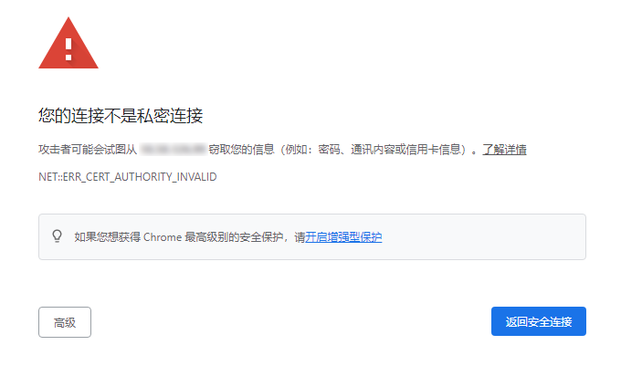
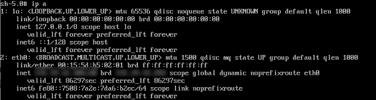
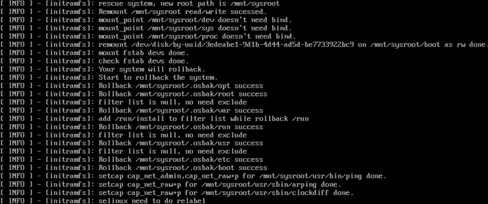

# x2openEuler 用户指南
## 前言

### 概述

本文档介绍了获取x2openEuler工具安装包，以及对其进行安装、使用的方法，对x2openEuler工具的web界面的各项功能做了详细介绍，同时提供了常见的问题解答及故障处理方法，详细请参考对应手册。

### 读者对象

本文档主要适用于升级的操作人员。操作人员必须具备以下经验和技能：

-   熟悉待升级操作系统相关情况。
-   有服务器维护操作经验。

### 符号约定

在本文中可能出现下列标志，它们所代表的含义如下。

<a name="table2622507016410"></a>
<table><thead align="left"><tr id="row1530720816410"><th class="cellrowborder" valign="top" width="20.580000000000002%" id="mcps1.1.3.1.1"><p id="p6450074116410"><a name="p6450074116410"></a><a name="p6450074116410"></a><strong id="b2136615816410"><a name="b2136615816410"></a><a name="b2136615816410"></a>符号</strong></p>
</th>
<th class="cellrowborder" valign="top" width="79.42%" id="mcps1.1.3.1.2"><p id="p5435366816410"><a name="p5435366816410"></a><a name="p5435366816410"></a><strong id="b5941558116410"><a name="b5941558116410"></a><a name="b5941558116410"></a>说明</strong></p>
</th>
</tr>
</thead>
<tbody><tr id="row1372280416410"><td class="cellrowborder" valign="top" width="20.580000000000002%" headers="mcps1.1.3.1.1 "><p id="p3734547016410"><a name="p3734547016410"></a><a name="p3734547016410"></a><a name="image2670064316410"></a><a name="image2670064316410"></a><span></span></p>
</td>
<td class="cellrowborder" valign="top" width="79.42%" headers="mcps1.1.3.1.2 "><p id="p1757432116410"><a name="p1757432116410"></a><a name="p1757432116410"></a>表示如不避免则将会导致死亡或严重伤害的具有高等级风险的危害。</p>
</td>
</tr>
<tr id="row466863216410"><td class="cellrowborder" valign="top" width="20.580000000000002%" headers="mcps1.1.3.1.1 "><p id="p1432579516410"><a name="p1432579516410"></a><a name="p1432579516410"></a><a name="image4895582316410"></a><a name="image4895582316410"></a><span></span></p>
</td>
<td class="cellrowborder" valign="top" width="79.42%" headers="mcps1.1.3.1.2 "><p id="p959197916410"><a name="p959197916410"></a><a name="p959197916410"></a>表示如不避免则可能导致死亡或严重伤害的具有中等级风险的危害。</p>
</td>
</tr>
<tr id="row123863216410"><td class="cellrowborder" valign="top" width="20.580000000000002%" headers="mcps1.1.3.1.1 "><p id="p1232579516410"><a name="p1232579516410"></a><a name="p1232579516410"></a><a name="image1235582316410"></a><a name="image1235582316410"></a><span></span></p>
</td>
<td class="cellrowborder" valign="top" width="79.42%" headers="mcps1.1.3.1.2 "><p id="p123197916410"><a name="p123197916410"></a><a name="p123197916410"></a>表示如不避免则可能导致轻微或中度伤害的具有低等级风险的危害。</p>
</td>
</tr>
<tr id="row5786682116410"><td class="cellrowborder" valign="top" width="20.580000000000002%" headers="mcps1.1.3.1.1 "><p id="p2204984716410"><a name="p2204984716410"></a><a name="p2204984716410"></a><a name="image4504446716410"></a><a name="image4504446716410"></a><span></span></p>
</td>
<td class="cellrowborder" valign="top" width="79.42%" headers="mcps1.1.3.1.2 "><p id="p4388861916410"><a name="p4388861916410"></a><a name="p4388861916410"></a>用于传递设备或环境安全警示信息。如不避免则可能会导致设备损坏、数据丢失、设备性能降低或其它不可预知的结果。</p>
<p id="p1238861916410"><a name="p1238861916410"></a><a name="p1238861916410"></a>“须知”不涉及人身伤害。</p>
</td>
</tr>
<tr id="row2856923116410"><td class="cellrowborder" valign="top" width="20.580000000000002%" headers="mcps1.1.3.1.1 "><p id="p5555360116410"><a name="p5555360116410"></a><a name="p5555360116410"></a><a name="image799324016410"></a><a name="image799324016410"></a><span></span></p>
</td>
<td class="cellrowborder" valign="top" width="79.42%" headers="mcps1.1.3.1.2 "><p id="p4612588116410"><a name="p4612588116410"></a><a name="p4612588116410"></a>对正文中重点信息的补充说明。</p>
<p id="p1232588116410"><a name="p1232588116410"></a><a name="p1232588116410"></a>“说明”不是安全警示信息，不涉及人身、设备及环境伤害信息。</p>
</td>
</tr>
</tbody>
</table>

### 命令行格式约定

<a name="table57396167"></a>
<table><thead align="left"><tr id="row54460779"><th class="cellrowborder" valign="top" width="30%" id="mcps1.1.3.1.1"><p id="p49246997"><a name="p49246997"></a><a name="p49246997"></a>格式</p>
</th>
<th class="cellrowborder" valign="top" width="70%" id="mcps1.1.3.1.2"><p id="p29583811"><a name="p29583811"></a><a name="p29583811"></a>意义</p>
</th>
</tr>
</thead>
<tbody><tr id="row47478494"><td class="cellrowborder" valign="top" width="30%" headers="mcps1.1.3.1.1 "><p id="p20552781"><a name="p20552781"></a><a name="p20552781"></a><strong id="b50757304"><a name="b50757304"></a><a name="b50757304"></a>粗体</strong></p>
</td>
<td class="cellrowborder" valign="top" width="70%" headers="mcps1.1.3.1.2 "><p id="p17700929"><a name="p17700929"></a><a name="p17700929"></a>命令行关键字（命令中保持不变、必须照输的部分）采用<strong id="b25090633"><a name="b25090633"></a><a name="b25090633"></a>加粗</strong>字体表示。</p>
</td>
</tr>
<tr id="row24489106"><td class="cellrowborder" valign="top" width="30%" headers="mcps1.1.3.1.1 "><p id="p37460564"><a name="p37460564"></a><a name="p37460564"></a><em id="i1600758"><a name="i1600758"></a><a name="i1600758"></a>斜体</em></p>
</td>
<td class="cellrowborder" valign="top" width="70%" headers="mcps1.1.3.1.2 "><p id="p62552612"><a name="p62552612"></a><a name="p62552612"></a>命令行参数（命令中必须由实际值进行替代的部分）采用斜体表示。</p>
</td>
</tr>
<tr id="row26102601"><td class="cellrowborder" valign="top" width="30%" headers="mcps1.1.3.1.1 "><p id="p33935949"><a name="p33935949"></a><a name="p33935949"></a>[ ]</p>
</td>
<td class="cellrowborder" valign="top" width="70%" headers="mcps1.1.3.1.2 "><p id="p64457312"><a name="p64457312"></a><a name="p64457312"></a>表示用“[ ]”括起来的部分在命令配置时是可选的。</p>
</td>
</tr>
<tr id="row43244904"><td class="cellrowborder" valign="top" width="30%" headers="mcps1.1.3.1.1 "><p id="p13176344"><a name="p13176344"></a><a name="p13176344"></a>{ x | y | ... }</p>
</td>
<td class="cellrowborder" valign="top" width="70%" headers="mcps1.1.3.1.2 "><p id="p60650924"><a name="p60650924"></a><a name="p60650924"></a>表示从两个或多个选项中选取一个。</p>
</td>
</tr>
<tr id="row8987407"><td class="cellrowborder" valign="top" width="30%" headers="mcps1.1.3.1.1 "><p id="p56891381"><a name="p56891381"></a><a name="p56891381"></a>[ x | y | ... ]</p>
</td>
<td class="cellrowborder" valign="top" width="70%" headers="mcps1.1.3.1.2 "><p id="p44799155"><a name="p44799155"></a><a name="p44799155"></a>表示从两个或多个选项中选取一个或者不选。</p>
</td>
</tr>
<tr id="row539219"><td class="cellrowborder" valign="top" width="30%" headers="mcps1.1.3.1.1 "><p id="p43676810"><a name="p43676810"></a><a name="p43676810"></a>{ x | y | ... }*</p>
</td>
<td class="cellrowborder" valign="top" width="70%" headers="mcps1.1.3.1.2 "><p id="p48160684"><a name="p48160684"></a><a name="p48160684"></a>表示从两个或多个选项中选取多个，最少选取一个，最多选取所有选项。</p>
</td>
</tr>
<tr id="row30792978"><td class="cellrowborder" valign="top" width="30%" headers="mcps1.1.3.1.1 "><p id="p11203266"><a name="p11203266"></a><a name="p11203266"></a>[ x | y | ... ]*</p>
</td>
<td class="cellrowborder" valign="top" width="70%" headers="mcps1.1.3.1.2 "><p id="p35049363"><a name="p35049363"></a><a name="p35049363"></a>表示从两个或多个选项中选取多个或者不选。</p>
</td>
</tr>
<tr id="row47008815"><td class="cellrowborder" valign="top" width="30%" headers="mcps1.1.3.1.1 "><p id="p49617684"><a name="p49617684"></a><a name="p49617684"></a>&amp;&lt;1-n&gt;</p>
</td>
<td class="cellrowborder" valign="top" width="70%" headers="mcps1.1.3.1.2 "><p id="p59609453"><a name="p59609453"></a><a name="p59609453"></a>表示符号“&amp;”前面的参数可以重复1～n次。</p>
</td>
</tr>
<tr id="row66723033"><td class="cellrowborder" valign="top" width="30%" headers="mcps1.1.3.1.1 "><p id="p35856572"><a name="p35856572"></a><a name="p35856572"></a>#</p>
</td>
<td class="cellrowborder" valign="top" width="70%" headers="mcps1.1.3.1.2 "><p id="p18701191"><a name="p18701191"></a><a name="p18701191"></a>表示由“#”开始的行为注释行。</p>
</td>
</tr>
</tbody>
</table>

### 修改记录

<a name="table1557726816410"></a>
<table><thead align="left"><tr id="row2942532716410"><th class="cellrowborder" valign="top" width="20.72%" id="mcps1.1.4.1.1"><p id="p3778275416410"><a name="p3778275416410"></a><a name="p3778275416410"></a><strong id="b5687322716410"><a name="b5687322716410"></a><a name="b5687322716410"></a>文档版本</strong></p>
</th>
<th class="cellrowborder" valign="top" width="26.119999999999997%" id="mcps1.1.4.1.2"><p id="p5627845516410"><a name="p5627845516410"></a><a name="p5627845516410"></a><strong id="b5800814916410"><a name="b5800814916410"></a><a name="b5800814916410"></a>发布日期</strong></p>
</th>
<th class="cellrowborder" valign="top" width="53.16%" id="mcps1.1.4.1.3"><p id="p2382284816410"><a name="p2382284816410"></a><a name="p2382284816410"></a><strong id="b3316380216410"><a name="b3316380216410"></a><a name="b3316380216410"></a>修改说明</strong></p>
</th>
</tr>
</thead>
<tbody>
<tr>
<td>05</td>
<td>2023-03-30</td>
<td>第五次正式发布。
    <li>刷新系统升级。</li>
    <li>新增配置生成秘钥、配置代理、回退一致性、上传操作系统数据库支持包等章节。</li>
</td>
</tr>
<tr id="row17948128462"><td class="cellrowborder" valign="top" width="20.72%" headers="mcps1.1.4.1.1 "><p id="p8942121466"><a name="p8942121466"></a><a name="p8942121466"></a>04</p>
</td>
<td class="cellrowborder" valign="top" width="26.119999999999997%" headers="mcps1.1.4.1.2 "><p id="p139421224618"><a name="p139421224618"></a><a name="p139421224618"></a>2022-12-30</p>
</td>
<td class="cellrowborder" valign="top" width="53.16%" headers="mcps1.1.4.1.3 "><p id="p11941812154619"><a name="p11941812154619"></a><a name="p11941812154619"></a>第四次正式发布。</p>
<a name="ul782783793817"></a><a name="ul782783793817"></a><ul id="ul782783793817"><li>新增特性系统信息收集评估、系统配置迁移。</li><li>新增常用操作和FAQ章节。</li></ul>
</td>
</tr>
<tr id="row5947359616410"><td class="cellrowborder" valign="top" width="20.72%" headers="mcps1.1.4.1.1 "><p id="p2149706016410"><a name="p2149706016410"></a><a name="p2149706016410"></a>03</p>
</td>
<td class="cellrowborder" valign="top" width="26.119999999999997%" headers="mcps1.1.4.1.2 "><p id="p648803616410"><a name="p648803616410"></a><a name="p648803616410"></a>2022-10-30</p>
</td>
<td class="cellrowborder" valign="top" width="53.16%" headers="mcps1.1.4.1.3 "><p id="p1946537916410"><a name="p1946537916410"></a><a name="p1946537916410"></a>第三次正式发布。</p>
</td>
</tr>
<tr id="row113056229487"><td class="cellrowborder" valign="top" width="20.72%" headers="mcps1.1.4.1.1 "><p id="p83061422144813"><a name="p83061422144813"></a><a name="p83061422144813"></a>02</p>
</td>
<td class="cellrowborder" valign="top" width="26.119999999999997%" headers="mcps1.1.4.1.2 "><p id="p11306822114813"><a name="p11306822114813"></a><a name="p11306822114813"></a>2022-09-30</p>
</td>
<td class="cellrowborder" valign="top" width="53.16%" headers="mcps1.1.4.1.3 "><p id="p6306022184820"><a name="p6306022184820"></a><a name="p6306022184820"></a>第二次正式发布。</p>
</td>
</tr>
<tr id="row20570558164216"><td class="cellrowborder" valign="top" width="20.72%" headers="mcps1.1.4.1.1 "><p id="p8571458134210"><a name="p8571458134210"></a><a name="p8571458134210"></a>01</p>
</td>
<td class="cellrowborder" valign="top" width="26.119999999999997%" headers="mcps1.1.4.1.2 "><p id="p1057115810423"><a name="p1057115810423"></a><a name="p1057115810423"></a>2022-08-20</p>
</td>
<td class="cellrowborder" valign="top" width="53.16%" headers="mcps1.1.4.1.3 "><p id="p175711958184212"><a name="p175711958184212"></a><a name="p175711958184212"></a>第一次正式发布。</p>
</td>
</tr>
</tbody>
</table>

## 介绍
### 免责声明

-   建议您在非生产环境使用本工具，避免影响生产业务运行。
-   使用过程中涉及的非工具本身验证功能所用的用户名和密码，不作他用，且不会被保存在系统环境中。
-   在您进行分析或操作前应当确认您为应用程序的所有者或已获得所有者的充足授权同意。
-   分析结果中可能包含您所分析应用的内部信息和相关数据，请妥善管理。
-   除非法律法规或双方合同另有规定，openEuler社区对分析结果不做任何明示或暗示的声明和保证，不对分析结果的时效性、满意度、非侵权性或特定用途适用性等作出任何保证或者承诺。
-   您根据分析记录所采取的任何行为均应符合法律法规的要求，并由您自行承担风险。
-   未经所有者授权，任何个人或组织均不得使用应用程序及相关分析记录从事任何活动。openEuler社区不对由此造成的一切后果负责，亦不承担任何法律责任。必要时，将追究其法律责任。

### x2openEuler 原地升级工具简介

x2openEuler工具是一款将源操作系统升级为目标操作系统的搬迁工具套件，工具支持原地升级功能。

当客户运行环境的操作系统生命周期即将EOS，但依托于业务运行的相关应用软件和产品还未到结束生命周期时，为了保障业务的持续性和安全性，可使用x2openEuler工具将源操作系统升级到新的目标操作系统。

x2openEuler工具提供web界面方式进行操作，以供使用者能够在图形化界面便捷的进行升级操作。

同时，为了面向全面的数字化改造，配合产品信息化改造，使用x2openEuler工具升级的目标操作系统采用openEuler技术栈，对于已有的业务系统完成数字化改造后可实现无缝迁移，保证业务的稳定性和高可用性。

### 应用场景

升级任务：当用户运行环境操作系统生命周期即将EOS时，可使用该工具将本地操作系统升级到新的目标操作系统。

系统信息收集评估任务：系统信息收集评估任务收集待升级节点信息，针对待升级节点进行软件、硬件兼容性评估及软件冲突检查，产生相应评估报告，确认待升级节点是否符合升级要求。

配置迁移任务：帮助用户迁移本地环境上运行的业务相关配置到升级后的目标操作系统，以保证业务正常运行。

### 部署方式

单机部署，即将x2openEuler工具部署在用户的安装CentOS 7.6或openEuler服务器上。

### 访问和使用

x2openEuler工具提供命令行或者web使用方式，用户在安装完成后选择使用方式。工具的使用方法请参考章节[特性指南](#特性指南)。

> **须知：** 
>-   待升级节点升级过程中需要root权限，由于root用户拥有最高权限，直接使用root用户登录服务器可能会存在安全风险。您可以通过配置禁止root用户SSH登录的选项，来提升系统安全性。具体配置如下：先以普通用户登录服务器，切换至root登录后检查/etc/ssh/sshd\_config配置项PermitRootlogin，如果显示no，说明禁止了root用户登录；如果显示yes，则需要将配置项PermitRootlogin设置为no。
>-   “配置迁移任务”只支持web方式使用。

#### 界面说明

##### 界面分区

x2openEuler工具首页界面主要由如图1所示的区域组成，各个区域的作用如[图1](#pic1)所示。

**图 1**  x2openEuler工具首页界面<a id="pic1"></a>  


**表 1**  x2openEuler工具首页界面参数说明

<a name="table1S"></a>
<table><thead align="left"><tr id="row172288142423"><th class="cellrowborder" valign="top" width="6.380638063806381%" id="mcps1.2.4.1.1"><p id="p32287147425"><a name="p32287147425"></a><a name="p32287147425"></a><strong id="b470814119432"><a name="b470814119432"></a><a name="b470814119432"></a>区域</strong></p>
</th>
<th class="cellrowborder" valign="top" width="27.912791279127912%" id="mcps1.2.4.1.2"><p id="p62281014124210"><a name="p62281014124210"></a><a name="p62281014124210"></a><strong id="b67267120439"><a name="b67267120439"></a><a name="b67267120439"></a>名称</strong></p>
</th>
<th class="cellrowborder" valign="top" width="65.70657065706571%" id="mcps1.2.4.1.3"><p id="p19228191418424"><a name="p19228191418424"></a><a name="p19228191418424"></a><strong id="b17745161164319"><a name="b17745161164319"></a><a name="b17745161164319"></a>说明</strong></p>
</th>
</tr>
</thead>                                        
<tbody><tr id="row1722851413422"><td class="cellrowborder" valign="top" width="6.380638063806381%" headers="mcps1.2.4.1.1 "><p id="p52282140425"><a name="p52282140425"></a><a name="p52282140425"></a>1</p>
</td>
<td class="cellrowborder" valign="top" width="27.912791279127912%" headers="mcps1.2.4.1.2 "><p id="p922981416428"><a name="p922981416428"></a><a name="p922981416428"></a>任务管理区</p>
</td>
<td class="cellrowborder" valign="top" width="65.70657065706571%" headers="mcps1.2.4.1.3 "><p id="p1444817396303"><a name="p1444817396303"></a><a name="p1444817396303"></a>工具任务管理入口，用户可进行创建、启动、删除任务等操作。</p>
</td>
</tr>
<tr id="row17229114194210"><td class="cellrowborder" valign="top" width="6.380638063806381%" headers="mcps1.2.4.1.1 "><p id="p62296147422"><a name="p62296147422"></a><a name="p62296147422"></a>2</p>
</td>
<td class="cellrowborder" valign="top" width="27.912791279127912%" headers="mcps1.2.4.1.2 "><p id="p9229171412423"><a name="p9229171412423"></a><a name="p9229171412423"></a>当前用户</p>
</td>
<td class="cellrowborder" valign="top" width="65.70657065706571%" headers="mcps1.2.4.1.3 "><p id="p42291414144213"><a name="p42291414144213"></a><a name="p42291414144213"></a>展示当前登录用户，并提供修改密码和用户登出的操作入口。</p>
</td>
</tr>
<tr id="row522911416424"><td class="cellrowborder" valign="top" width="6.380638063806381%" headers="mcps1.2.4.1.1 "><p id="p1822971474210"><a name="p1822971474210"></a><a name="p1822971474210"></a>3</p>
</td>
<td class="cellrowborder" valign="top" width="27.912791279127912%" headers="mcps1.2.4.1.2 "><p id="p0229121415427"><a name="p0229121415427"></a><a name="p0229121415427"></a>配置</p>
</td>
<td class="cellrowborder" valign="top" width="65.70657065706571%" headers="mcps1.2.4.1.3 "><p id="p1922961474213"><a name="p1922961474213"></a><a name="p1922961474213"></a>提供用户管理，弱口令字典，系统配置，日志，web服务端证书和回退一致性检查过滤等功能入口。</p>
</td>
</tr>
<tr id="row7597171003218"><td class="cellrowborder" valign="top" width="6.380638063806381%" headers="mcps1.2.4.1.1 "><p id="p125981610153214"><a name="p125981610153214"></a><a name="p125981610153214"></a>4</p>
</td>
<td class="cellrowborder" valign="top" width="27.912791279127912%" headers="mcps1.2.4.1.2 "><p id="p6598510113213"><a name="p6598510113213"></a><a name="p6598510113213"></a>更多</p>
</td>
<td class="cellrowborder" valign="top" width="65.70657065706571%" headers="mcps1.2.4.1.3 "><p id="p659891073215"><a name="p659891073215"></a><a name="p659891073215"></a>提供深色/浅色模式切换，联机帮助、免责声明和<span id="text562174003813"><a name="text562174003813"></a><a name="text562174003813"></a>x2openEuler工具</span>发布信息入口。</p>
</td>
</tr>
<tr id="row37000158325"><td class="cellrowborder" valign="top" width="6.380638063806381%" headers="mcps1.2.4.1.1 "><p id="p107004159328"><a name="p107004159328"></a><a name="p107004159328"></a>5</p>
</td>
<td class="cellrowborder" valign="top" width="27.912791279127912%" headers="mcps1.2.4.1.2 "><p id="p370011553218"><a name="p370011553218"></a><a name="p370011553218"></a>案例链接区</p>
</td>
<td class="cellrowborder" valign="top" width="65.70657065706571%" headers="mcps1.2.4.1.3 "><p id="zh-cn_topic_0000001234342694_zh-cn_topic_0228242391_zh-cn_topic_0188408909_p138187261471"><a name="zh-cn_topic_0000001234342694_zh-cn_topic_0228242391_zh-cn_topic_0188408909_p138187261471"></a><a name="zh-cn_topic_0000001234342694_zh-cn_topic_0228242391_zh-cn_topic_0188408909_p138187261471"></a>提供典型案例链接，并为每个功能提供示例代码。</p>
</td>
</tr>
</tbody>
</table>

##### 图标及按钮说明

x2openEuler工具中出现的图标/按钮及其说明如[表2](#table2)所示。

**表 2**  图标/按钮说明

<a id="table2"></a>
<table><thead align="left"><tr id="zh-cn_topic_0000001234342694_zh-cn_topic_0228242391_zh-cn_topic_0188408909_row610533642618"><th class="cellrowborder" valign="top" width="23%" id="mcps1.2.4.1.1"><p id="zh-cn_topic_0000001234342694_zh-cn_topic_0228242391_zh-cn_topic_0188408909_p1010512362262"><a name="zh-cn_topic_0000001234342694_zh-cn_topic_0228242391_zh-cn_topic_0188408909_p1010512362262"></a><a name="zh-cn_topic_0000001234342694_zh-cn_topic_0228242391_zh-cn_topic_0188408909_p1010512362262"></a>类型</p>
</th>
<th class="cellrowborder" valign="top" width="16.98%" id="mcps1.2.4.1.2"><p id="zh-cn_topic_0000001234342694_zh-cn_topic_0228242391_zh-cn_topic_0188408909_p2105836172611"><a name="zh-cn_topic_0000001234342694_zh-cn_topic_0228242391_zh-cn_topic_0188408909_p2105836172611"></a><a name="zh-cn_topic_0000001234342694_zh-cn_topic_0228242391_zh-cn_topic_0188408909_p2105836172611"></a>图标/按钮</p>
</th>
<th class="cellrowborder" valign="top" width="60.019999999999996%" id="mcps1.2.4.1.3"><p id="zh-cn_topic_0000001234342694_zh-cn_topic_0228242391_zh-cn_topic_0188408909_p610583611263"><a name="zh-cn_topic_0000001234342694_zh-cn_topic_0228242391_zh-cn_topic_0188408909_p610583611263"></a><a name="zh-cn_topic_0000001234342694_zh-cn_topic_0228242391_zh-cn_topic_0188408909_p610583611263"></a>说明</p>
</th>
</tr>
</thead>
<tbody><tr id="zh-cn_topic_0000001234342694_zh-cn_topic_0228242391_zh-cn_topic_0188408909_row12707159133115"><td class="cellrowborder" rowspan="2" valign="top" width="23%" headers="mcps1.2.4.1.1 "><p id="zh-cn_topic_0000001234342694_zh-cn_topic_0228242391_zh-cn_topic_0188408909_p268910230347"><a name="zh-cn_topic_0000001234342694_zh-cn_topic_0228242391_zh-cn_topic_0188408909_p268910230347"></a><a name="zh-cn_topic_0000001234342694_zh-cn_topic_0228242391_zh-cn_topic_0188408909_p268910230347"></a>信息图标</p>
</td>
<td class="cellrowborder" valign="top" width="16.98%" headers="mcps1.2.4.1.2 "><p id="zh-cn_topic_0000001234342694_zh-cn_topic_0228242391_zh-cn_topic_0188408909_p490344411436"><a name="zh-cn_topic_0000001234342694_zh-cn_topic_0228242391_zh-cn_topic_0188408909_p490344411436"></a><a name="zh-cn_topic_0000001234342694_zh-cn_topic_0228242391_zh-cn_topic_0188408909_p490344411436"></a><a name="image520520402015"></a><a name="image520520402015"></a><span></span></p>
</td>
<td class="cellrowborder" valign="top" width="60.019999999999996%" headers="mcps1.2.4.1.3 "><p id="zh-cn_topic_0000001234342694_zh-cn_topic_0228242391_zh-cn_topic_0188408909_p119032449436"><a name="zh-cn_topic_0000001234342694_zh-cn_topic_0228242391_zh-cn_topic_0188408909_p119032449436"></a><a name="zh-cn_topic_0000001234342694_zh-cn_topic_0228242391_zh-cn_topic_0188408909_p119032449436"></a>配置。</p>
</td>
</tr>
<tr id="zh-cn_topic_0000001234342694_zh-cn_topic_0228242391_zh-cn_topic_0188408909_row3767138112818"><td class="cellrowborder" valign="top" headers="mcps1.2.4.1.1 "><p id="zh-cn_topic_0000001234342694_zh-cn_topic_0228242391_zh-cn_topic_0188408909_p27671738152818"><a name="zh-cn_topic_0000001234342694_zh-cn_topic_0228242391_zh-cn_topic_0188408909_p27671738152818"></a><a name="zh-cn_topic_0000001234342694_zh-cn_topic_0228242391_zh-cn_topic_0188408909_p27671738152818"></a><a name="image143545944619"></a><a name="image143545944619"></a><span></span></p>
</td>
<td class="cellrowborder" valign="top" headers="mcps1.2.4.1.2 "><p id="zh-cn_topic_0000001234342694_zh-cn_topic_0228242391_zh-cn_topic_0188408909_p17767173812289"><a name="zh-cn_topic_0000001234342694_zh-cn_topic_0228242391_zh-cn_topic_0188408909_p17767173812289"></a><a name="zh-cn_topic_0000001234342694_zh-cn_topic_0228242391_zh-cn_topic_0188408909_p17767173812289"></a>更多。</p>
</td>
</tr>
<tr id="zh-cn_topic_0000001234342694_zh-cn_topic_0228242391_zh-cn_topic_0188408909_row1461975872418"><td class="cellrowborder" rowspan="3" valign="top" width="23%" headers="mcps1.2.4.1.1 "><p id="zh-cn_topic_0000001234342694_zh-cn_topic_0228242391_zh-cn_topic_0188408909_p1851122214381"><a name="zh-cn_topic_0000001234342694_zh-cn_topic_0228242391_zh-cn_topic_0188408909_p1851122214381"></a><a name="zh-cn_topic_0000001234342694_zh-cn_topic_0228242391_zh-cn_topic_0188408909_p1851122214381"></a>标志符号</p>
</td>
<td class="cellrowborder" valign="top" width="16.98%" headers="mcps1.2.4.1.2 "><p id="zh-cn_topic_0000001234342694_zh-cn_topic_0228242391_zh-cn_topic_0188408909_p1651132233813"><a name="zh-cn_topic_0000001234342694_zh-cn_topic_0228242391_zh-cn_topic_0188408909_p1651132233813"></a><a name="zh-cn_topic_0000001234342694_zh-cn_topic_0228242391_zh-cn_topic_0188408909_p1651132233813"></a><a name="zh-cn_topic_0000001234342694_zh-cn_topic_0228242391_zh-cn_topic_0188408909_image6999175355916"></a><a name="zh-cn_topic_0000001234342694_zh-cn_topic_0228242391_zh-cn_topic_0188408909_image6999175355916"></a><span></span></p>
</td>
<td class="cellrowborder" valign="top" width="60.019999999999996%" headers="mcps1.2.4.1.3 "><p id="zh-cn_topic_0000001234342694_zh-cn_topic_0228242391_zh-cn_topic_0188408909_p351117229388"><a name="zh-cn_topic_0000001234342694_zh-cn_topic_0228242391_zh-cn_topic_0188408909_p351117229388"></a><a name="zh-cn_topic_0000001234342694_zh-cn_topic_0228242391_zh-cn_topic_0188408909_p351117229388"></a>用于提示操作警示信息。</p>
</td>
</tr>
<tr id="zh-cn_topic_0000001234342694_row831115356595"><td class="cellrowborder" valign="top" headers="mcps1.2.4.1.1 "><p id="zh-cn_topic_0000001234342694_p5311173585919"><a name="zh-cn_topic_0000001234342694_p5311173585919"></a><a name="zh-cn_topic_0000001234342694_p5311173585919"></a><a name="zh-cn_topic_0000001234342694_image1140320351801"></a><a name="zh-cn_topic_0000001234342694_image1140320351801"></a><span></span></p>
</td>
<td class="cellrowborder" valign="top" headers="mcps1.2.4.1.2 "><p id="zh-cn_topic_0000001234342694_p1311133575910"><a name="zh-cn_topic_0000001234342694_p1311133575910"></a><a name="zh-cn_topic_0000001234342694_p1311133575910"></a>用于提示操作提醒信息。</p>
</td>
</tr>
<tr id="zh-cn_topic_0000001234342694_row9615837532"><td class="cellrowborder" valign="top" headers="mcps1.2.4.1.1 "><p id="zh-cn_topic_0000001234342694_p26159372319"><a name="zh-cn_topic_0000001234342694_p26159372319"></a><a name="zh-cn_topic_0000001234342694_p26159372319"></a><a name="zh-cn_topic_0000001234342694_image18781951354"></a><a name="zh-cn_topic_0000001234342694_image18781951354"></a><span></span></p>
</td>
<td class="cellrowborder" valign="top" headers="mcps1.2.4.1.2 "><p id="zh-cn_topic_0000001234342694_p14615173719319"><a name="zh-cn_topic_0000001234342694_p14615173719319"></a><a name="zh-cn_topic_0000001234342694_p14615173719319"></a>用于提示操作异常信息。</p>
</td>
</tr>
<tr id="zh-cn_topic_0000001234342694_zh-cn_topic_0228242391_zh-cn_topic_0188408909_row1740103733419"><td class="cellrowborder" rowspan="12" valign="top" width="23%" headers="mcps1.2.4.1.1 "><p id="zh-cn_topic_0000001234342694_zh-cn_topic_0228242391_zh-cn_topic_0188408909_p11191182865415"><a name="zh-cn_topic_0000001234342694_zh-cn_topic_0228242391_zh-cn_topic_0188408909_p11191182865415"></a><a name="zh-cn_topic_0000001234342694_zh-cn_topic_0228242391_zh-cn_topic_0188408909_p11191182865415"></a>用户控件图标</p>
</td>
<td class="cellrowborder" valign="top" width="16.98%" headers="mcps1.2.4.1.2 "><p id="zh-cn_topic_0000001234342694_zh-cn_topic_0228242391_zh-cn_topic_0188408909_p2302192116285"><a name="zh-cn_topic_0000001234342694_zh-cn_topic_0228242391_zh-cn_topic_0188408909_p2302192116285"></a><a name="zh-cn_topic_0000001234342694_zh-cn_topic_0228242391_zh-cn_topic_0188408909_p2302192116285"></a><a name="zh-cn_topic_0000001234342694_zh-cn_topic_0228242391_zh-cn_topic_0188408909_image159098818019"></a><a name="zh-cn_topic_0000001234342694_zh-cn_topic_0228242391_zh-cn_topic_0188408909_image159098818019"></a><span></span></p>
</td>
<td class="cellrowborder" valign="top" width="60.019999999999996%" headers="mcps1.2.4.1.3 "><p id="zh-cn_topic_0000001234342694_zh-cn_topic_0228242391_zh-cn_topic_0188408909_p1056721517387"><a name="zh-cn_topic_0000001234342694_zh-cn_topic_0228242391_zh-cn_topic_0188408909_p1056721517387"></a><a name="zh-cn_topic_0000001234342694_zh-cn_topic_0228242391_zh-cn_topic_0188408909_p1056721517387"></a>下载：将操作对象保存在本地。</p>
</td>
</tr>
<tr id="zh-cn_topic_0000001234342694_zh-cn_topic_0228242391_zh-cn_topic_0188408909_row137911040173410"><td class="cellrowborder" valign="top" headers="mcps1.2.4.1.1 "><p id="zh-cn_topic_0000001234342694_zh-cn_topic_0228242391_zh-cn_topic_0188408909_p15941133223015"><a name="zh-cn_topic_0000001234342694_zh-cn_topic_0228242391_zh-cn_topic_0188408909_p15941133223015"></a><a name="zh-cn_topic_0000001234342694_zh-cn_topic_0228242391_zh-cn_topic_0188408909_p15941133223015"></a><a name="zh-cn_topic_0000001234342694_zh-cn_topic_0228242391_zh-cn_topic_0188408909_image159153292017"></a><a name="zh-cn_topic_0000001234342694_zh-cn_topic_0228242391_zh-cn_topic_0188408909_image159153292017"></a><span></span></p>
</td>
<td class="cellrowborder" valign="top" headers="mcps1.2.4.1.2 "><p id="zh-cn_topic_0000001234342694_zh-cn_topic_0228242391_zh-cn_topic_0188408909_p2567191515381"><a name="zh-cn_topic_0000001234342694_zh-cn_topic_0228242391_zh-cn_topic_0188408909_p2567191515381"></a><a name="zh-cn_topic_0000001234342694_zh-cn_topic_0228242391_zh-cn_topic_0188408909_p2567191515381"></a>删除所选条目。</p>
</td>
</tr>
<tr id="zh-cn_topic_0000001234342694_zh-cn_topic_0228242391_zh-cn_topic_0188408909_row1755758203019"><td class="cellrowborder" valign="top" headers="mcps1.2.4.1.1 "><p id="zh-cn_topic_0000001234342694_zh-cn_topic_0228242391_zh-cn_topic_0188408909_p123518277349"><a name="zh-cn_topic_0000001234342694_zh-cn_topic_0228242391_zh-cn_topic_0188408909_p123518277349"></a><a name="zh-cn_topic_0000001234342694_zh-cn_topic_0228242391_zh-cn_topic_0188408909_p123518277349"></a><a name="zh-cn_topic_0000001234342694_zh-cn_topic_0228242391_zh-cn_topic_0188408909_image19294141333515"></a><a name="zh-cn_topic_0000001234342694_zh-cn_topic_0228242391_zh-cn_topic_0188408909_image19294141333515"></a><span></span></p>
</td>
<td class="cellrowborder" valign="top" headers="mcps1.2.4.1.2 "><p id="zh-cn_topic_0000001234342694_zh-cn_topic_0228242391_zh-cn_topic_0188408909_p55671015153820"><a name="zh-cn_topic_0000001234342694_zh-cn_topic_0228242391_zh-cn_topic_0188408909_p55671015153820"></a><a name="zh-cn_topic_0000001234342694_zh-cn_topic_0228242391_zh-cn_topic_0188408909_p55671015153820"></a>展开：展开已折叠的列表项。</p>
</td>
</tr>
<tr id="zh-cn_topic_0000001234342694_zh-cn_topic_0228242391_zh-cn_topic_0188408909_row114181353183213"><td class="cellrowborder" valign="top" headers="mcps1.2.4.1.1 "><p id="zh-cn_topic_0000001234342694_zh-cn_topic_0228242391_zh-cn_topic_0188408909_p1241925363217"><a name="zh-cn_topic_0000001234342694_zh-cn_topic_0228242391_zh-cn_topic_0188408909_p1241925363217"></a><a name="zh-cn_topic_0000001234342694_zh-cn_topic_0228242391_zh-cn_topic_0188408909_p1241925363217"></a><a name="zh-cn_topic_0000001234342694_zh-cn_topic_0228242391_zh-cn_topic_0188408909_image59742028113415"></a><a name="zh-cn_topic_0000001234342694_zh-cn_topic_0228242391_zh-cn_topic_0188408909_image59742028113415"></a><span></span></p>
</td>
<td class="cellrowborder" valign="top" headers="mcps1.2.4.1.2 "><p id="zh-cn_topic_0000001234342694_zh-cn_topic_0228242391_zh-cn_topic_0188408909_p8419195313325"><a name="zh-cn_topic_0000001234342694_zh-cn_topic_0228242391_zh-cn_topic_0188408909_p8419195313325"></a><a name="zh-cn_topic_0000001234342694_zh-cn_topic_0228242391_zh-cn_topic_0188408909_p8419195313325"></a>折叠：折叠已展开的列表项。</p>
</td>
</tr>
<tr id="zh-cn_topic_0000001234342694_zh-cn_topic_0228242391_zh-cn_topic_0188408909_row1178491718468"><td class="cellrowborder" valign="top" headers="mcps1.2.4.1.1 "><p id="zh-cn_topic_0000001234342694_zh-cn_topic_0228242391_zh-cn_topic_0188408909_p1978481718469"><a name="zh-cn_topic_0000001234342694_zh-cn_topic_0228242391_zh-cn_topic_0188408909_p1978481718469"></a><a name="zh-cn_topic_0000001234342694_zh-cn_topic_0228242391_zh-cn_topic_0188408909_p1978481718469"></a><a name="zh-cn_topic_0000001234342694_zh-cn_topic_0228242391_zh-cn_topic_0188408909_image766212139119"></a><a name="zh-cn_topic_0000001234342694_zh-cn_topic_0228242391_zh-cn_topic_0188408909_image766212139119"></a><span></span></p>
</td>
<td class="cellrowborder" valign="top" headers="mcps1.2.4.1.2 "><p id="zh-cn_topic_0000001234342694_zh-cn_topic_0228242391_zh-cn_topic_0188408909_p67841517194614"><a name="zh-cn_topic_0000001234342694_zh-cn_topic_0228242391_zh-cn_topic_0188408909_p67841517194614"></a><a name="zh-cn_topic_0000001234342694_zh-cn_topic_0228242391_zh-cn_topic_0188408909_p67841517194614"></a>保存：保存修改。</p>
</td>
</tr>
<tr id="zh-cn_topic_0000001234342694_zh-cn_topic_0228242391_zh-cn_topic_0188408909_row71441329184612"><td class="cellrowborder" valign="top" headers="mcps1.2.4.1.1 "><p id="zh-cn_topic_0000001234342694_zh-cn_topic_0228242391_zh-cn_topic_0188408909_p4144229164610"><a name="zh-cn_topic_0000001234342694_zh-cn_topic_0228242391_zh-cn_topic_0188408909_p4144229164610"></a><a name="zh-cn_topic_0000001234342694_zh-cn_topic_0228242391_zh-cn_topic_0188408909_p4144229164610"></a><a name="zh-cn_topic_0000001234342694_zh-cn_topic_0228242391_zh-cn_topic_0188408909_image95061921611"></a><a name="zh-cn_topic_0000001234342694_zh-cn_topic_0228242391_zh-cn_topic_0188408909_image95061921611"></a><span></span></p>
</td>
<td class="cellrowborder" valign="top" headers="mcps1.2.4.1.2 "><p id="zh-cn_topic_0000001234342694_zh-cn_topic_0228242391_zh-cn_topic_0188408909_p13622184865214"><a name="zh-cn_topic_0000001234342694_zh-cn_topic_0228242391_zh-cn_topic_0188408909_p13622184865214"></a><a name="zh-cn_topic_0000001234342694_zh-cn_topic_0228242391_zh-cn_topic_0188408909_p13622184865214"></a>回退：回退到前一步。</p>
</td>
</tr>
<tr id="zh-cn_topic_0000001234342694_zh-cn_topic_0228242391_zh-cn_topic_0188408909_row109441126184612"><td class="cellrowborder" valign="top" headers="mcps1.2.4.1.1 "><p id="zh-cn_topic_0000001234342694_zh-cn_topic_0228242391_zh-cn_topic_0188408909_p11944182614618"><a name="zh-cn_topic_0000001234342694_zh-cn_topic_0228242391_zh-cn_topic_0188408909_p11944182614618"></a><a name="zh-cn_topic_0000001234342694_zh-cn_topic_0228242391_zh-cn_topic_0188408909_p11944182614618"></a><a name="zh-cn_topic_0000001234342694_zh-cn_topic_0228242391_zh-cn_topic_0188408909_image8909153511117"></a><a name="zh-cn_topic_0000001234342694_zh-cn_topic_0228242391_zh-cn_topic_0188408909_image8909153511117"></a><span></span></p>
</td>
<td class="cellrowborder" valign="top" headers="mcps1.2.4.1.2 "><p id="zh-cn_topic_0000001234342694_zh-cn_topic_0228242391_zh-cn_topic_0188408909_p4531157165313"><a name="zh-cn_topic_0000001234342694_zh-cn_topic_0228242391_zh-cn_topic_0188408909_p4531157165313"></a><a name="zh-cn_topic_0000001234342694_zh-cn_topic_0228242391_zh-cn_topic_0188408909_p4531157165313"></a>取消：取消修改。</p>
</td>
</tr>
<tr id="zh-cn_topic_0000001234342694_zh-cn_topic_0228242391_zh-cn_topic_0188408909_row05851424174620"><td class="cellrowborder" valign="top" headers="mcps1.2.4.1.1 "><p id="zh-cn_topic_0000001234342694_zh-cn_topic_0228242391_zh-cn_topic_0188408909_p13585192494611"><a name="zh-cn_topic_0000001234342694_zh-cn_topic_0228242391_zh-cn_topic_0188408909_p13585192494611"></a><a name="zh-cn_topic_0000001234342694_zh-cn_topic_0228242391_zh-cn_topic_0188408909_p13585192494611"></a><a name="zh-cn_topic_0000001234342694_zh-cn_topic_0228242391_zh-cn_topic_0188408909_image15624595215"></a><a name="zh-cn_topic_0000001234342694_zh-cn_topic_0228242391_zh-cn_topic_0188408909_image15624595215"></a><span></span></p>
</td>
<td class="cellrowborder" valign="top" headers="mcps1.2.4.1.2 "><p id="zh-cn_topic_0000001234342694_zh-cn_topic_0228242391_zh-cn_topic_0188408909_p1858502413467"><a name="zh-cn_topic_0000001234342694_zh-cn_topic_0228242391_zh-cn_topic_0188408909_p1858502413467"></a><a name="zh-cn_topic_0000001234342694_zh-cn_topic_0228242391_zh-cn_topic_0188408909_p1858502413467"></a>上一个：移动到上一个建议修改处。</p>
</td>
</tr>
<tr id="zh-cn_topic_0000001234342694_zh-cn_topic_0228242391_zh-cn_topic_0188408909_row5112922194620"><td class="cellrowborder" valign="top" headers="mcps1.2.4.1.1 "><p id="zh-cn_topic_0000001234342694_zh-cn_topic_0228242391_zh-cn_topic_0188408909_p131128221461"><a name="zh-cn_topic_0000001234342694_zh-cn_topic_0228242391_zh-cn_topic_0188408909_p131128221461"></a><a name="zh-cn_topic_0000001234342694_zh-cn_topic_0228242391_zh-cn_topic_0188408909_p131128221461"></a><a name="zh-cn_topic_0000001234342694_zh-cn_topic_0228242391_zh-cn_topic_0188408909_image5314626171210"></a><a name="zh-cn_topic_0000001234342694_zh-cn_topic_0228242391_zh-cn_topic_0188408909_image5314626171210"></a><span></span></p>
</td>
<td class="cellrowborder" valign="top" headers="mcps1.2.4.1.2 "><p id="zh-cn_topic_0000001234342694_zh-cn_topic_0228242391_zh-cn_topic_0188408909_p18112132216466"><a name="zh-cn_topic_0000001234342694_zh-cn_topic_0228242391_zh-cn_topic_0188408909_p18112132216466"></a><a name="zh-cn_topic_0000001234342694_zh-cn_topic_0228242391_zh-cn_topic_0188408909_p18112132216466"></a>下一个：移动到下一个建议修改处。</p>
</td>
</tr>
<tr id="zh-cn_topic_0000001234342694_zh-cn_topic_0228242391_zh-cn_topic_0188408909_row13238337293"><td class="cellrowborder" valign="top" headers="mcps1.2.4.1.1 "><p id="zh-cn_topic_0000001234342694_zh-cn_topic_0228242391_zh-cn_topic_0188408909_p1132317335294"><a name="zh-cn_topic_0000001234342694_zh-cn_topic_0228242391_zh-cn_topic_0188408909_p1132317335294"></a><a name="zh-cn_topic_0000001234342694_zh-cn_topic_0228242391_zh-cn_topic_0188408909_p1132317335294"></a><a name="zh-cn_topic_0000001234342694_zh-cn_topic_0228242391_zh-cn_topic_0188408909_image14969195416302"></a><a name="zh-cn_topic_0000001234342694_zh-cn_topic_0228242391_zh-cn_topic_0188408909_image14969195416302"></a><span></span></p>
</td>
<td class="cellrowborder" valign="top" headers="mcps1.2.4.1.2 "><p id="zh-cn_topic_0000001234342694_zh-cn_topic_0228242391_zh-cn_topic_0188408909_p1032317333296"><a name="zh-cn_topic_0000001234342694_zh-cn_topic_0228242391_zh-cn_topic_0188408909_p1032317333296"></a><a name="zh-cn_topic_0000001234342694_zh-cn_topic_0228242391_zh-cn_topic_0188408909_p1032317333296"></a>排序。</p>
</td>
</tr>
<tr id="zh-cn_topic_0000001234342694_zh-cn_topic_0228242391_zh-cn_topic_0188408909_row185483415567"><td class="cellrowborder" valign="top" headers="mcps1.2.4.1.1 "><p id="zh-cn_topic_0000001234342694_zh-cn_topic_0228242391_zh-cn_topic_0188408909_p19854163435616"><a name="zh-cn_topic_0000001234342694_zh-cn_topic_0228242391_zh-cn_topic_0188408909_p19854163435616"></a><a name="zh-cn_topic_0000001234342694_zh-cn_topic_0228242391_zh-cn_topic_0188408909_p19854163435616"></a><a name="zh-cn_topic_0000001234342694_zh-cn_topic_0228242391_zh-cn_topic_0188408909_image1417752105612"></a><a name="zh-cn_topic_0000001234342694_zh-cn_topic_0228242391_zh-cn_topic_0188408909_image1417752105612"></a><span></span></p>
</td>
<td class="cellrowborder" valign="top" headers="mcps1.2.4.1.2 "><p id="zh-cn_topic_0000001234342694_zh-cn_topic_0228242391_zh-cn_topic_0188408909_p108541634115610"><a name="zh-cn_topic_0000001234342694_zh-cn_topic_0228242391_zh-cn_topic_0188408909_p108541634115610"></a><a name="zh-cn_topic_0000001234342694_zh-cn_topic_0228242391_zh-cn_topic_0188408909_p108541634115610"></a>建议反馈。</p>
</td>
</tr>
<tr id="row1784812711492"><td class="cellrowborder" valign="top" headers="mcps1.2.4.1.1 "><p id="p68496277492"><a name="p68496277492"></a><a name="p68496277492"></a><a name="image10135830124919"></a><a name="image10135830124919"></a><span></span></p>
</td>
<td class="cellrowborder" valign="top" headers="mcps1.2.4.1.2 "><p id="p11536149115017"><a name="p11536149115017"></a><a name="p11536149115017"></a>条件选择筛选。</p>
</td>
</tr>
</tbody>
</table>

#### 登录x2openEuler工具web界面

本章节以Windows 10操作系统安装的Chrome 105.0浏览器为例介绍登录x2openEuler工具web界面的操作步骤。

##### 浏览器要求

浏览器要求如[表3](#table3)所示。

**表 3**  浏览器要求

<a id="table3"></a>
<table><thead align="left"><tr id="zh-cn_topic_0000001278742309_zh-cn_topic_0000001085632596_zh-cn_topic_0188408926_row153767361464"><th class="cellrowborder" valign="top" width="24.62%" id="mcps1.2.3.1.1"><p id="zh-cn_topic_0000001278742309_zh-cn_topic_0000001085632596_zh-cn_topic_0188408926_p8376153613461"><a name="zh-cn_topic_0000001278742309_zh-cn_topic_0000001085632596_zh-cn_topic_0188408926_p8376153613461"></a><a name="zh-cn_topic_0000001278742309_zh-cn_topic_0000001085632596_zh-cn_topic_0188408926_p8376153613461"></a>浏览器类型</p>
</th>
<th class="cellrowborder" valign="top" width="75.38%" id="mcps1.2.3.1.2"><p id="zh-cn_topic_0000001278742309_zh-cn_topic_0000001085632596_zh-cn_topic_0188408926_p9377143624616"><a name="zh-cn_topic_0000001278742309_zh-cn_topic_0000001085632596_zh-cn_topic_0188408926_p9377143624616"></a><a name="zh-cn_topic_0000001278742309_zh-cn_topic_0000001085632596_zh-cn_topic_0188408926_p9377143624616"></a>说明</p>
</th>
</tr>
</thead>
<tbody><tr id="zh-cn_topic_0000001278742309_zh-cn_topic_0000001085632596_zh-cn_topic_0188408926_row1937723684610"><td class="cellrowborder" valign="top" width="24.62%" headers="mcps1.2.3.1.1 "><p id="zh-cn_topic_0000001278742309_zh-cn_topic_0000001085632596_zh-cn_topic_0188408926_p12377936194615"><a name="zh-cn_topic_0000001278742309_zh-cn_topic_0000001085632596_zh-cn_topic_0188408926_p12377936194615"></a><a name="zh-cn_topic_0000001278742309_zh-cn_topic_0000001085632596_zh-cn_topic_0188408926_p12377936194615"></a>Google Chrome</p>
</td>
<td class="cellrowborder" valign="top" width="75.38%" headers="mcps1.2.3.1.2 "><p id="zh-cn_topic_0000001278742309_zh-cn_topic_0000001085632596_zh-cn_topic_0188408926_p18377736144617"><a name="zh-cn_topic_0000001278742309_zh-cn_topic_0000001085632596_zh-cn_topic_0188408926_p18377736144617"></a><a name="zh-cn_topic_0000001278742309_zh-cn_topic_0000001085632596_zh-cn_topic_0188408926_p18377736144617"></a>Google Chrome 72.0及以上版本</p>
</td>
</tr>
<tr id="zh-cn_topic_0000001278742309_zh-cn_topic_0000001085632596_zh-cn_topic_0188408926_row1337713612464"><td class="cellrowborder" valign="top" width="24.62%" headers="mcps1.2.3.1.1 "><p id="zh-cn_topic_0000001278742309_zh-cn_topic_0000001085632596_zh-cn_topic_0188408926_p53775367462"><a name="zh-cn_topic_0000001278742309_zh-cn_topic_0000001085632596_zh-cn_topic_0188408926_p53775367462"></a><a name="zh-cn_topic_0000001278742309_zh-cn_topic_0000001085632596_zh-cn_topic_0188408926_p53775367462"></a>Mozilla Firefox</p>
</td>
<td class="cellrowborder" valign="top" width="75.38%" headers="mcps1.2.3.1.2 "><p id="zh-cn_topic_0000001278742309_zh-cn_topic_0000001085632596_zh-cn_topic_0188408926_p9377193664618"><a name="zh-cn_topic_0000001278742309_zh-cn_topic_0000001085632596_zh-cn_topic_0188408926_p9377193664618"></a><a name="zh-cn_topic_0000001278742309_zh-cn_topic_0000001085632596_zh-cn_topic_0188408926_p9377193664618"></a>Firefox Browser 89及以上版本</p>
</td>
</tr>
<tr id="zh-cn_topic_0000001278742309_zh-cn_topic_0000001085632596_zh-cn_topic_0188408926_row1612822410312"><td class="cellrowborder" valign="top" width="24.62%" headers="mcps1.2.3.1.1 "><p id="zh-cn_topic_0000001278742309_zh-cn_topic_0000001085632596_zh-cn_topic_0188408926_zh-cn_topic_0187929302_p5827193247"><a name="zh-cn_topic_0000001278742309_zh-cn_topic_0000001085632596_zh-cn_topic_0188408926_zh-cn_topic_0187929302_p5827193247"></a><a name="zh-cn_topic_0000001278742309_zh-cn_topic_0000001085632596_zh-cn_topic_0188408926_zh-cn_topic_0187929302_p5827193247"></a>Microsoft Edge</p>
</td>
<td class="cellrowborder" valign="top" width="75.38%" headers="mcps1.2.3.1.2 "><p id="zh-cn_topic_0000001278742309_zh-cn_topic_0000001085632596_zh-cn_topic_0188408926_zh-cn_topic_0187929302_p68276912420"><a name="zh-cn_topic_0000001278742309_zh-cn_topic_0000001085632596_zh-cn_topic_0188408926_zh-cn_topic_0187929302_p68276912420"></a><a name="zh-cn_topic_0000001278742309_zh-cn_topic_0000001085632596_zh-cn_topic_0188408926_zh-cn_topic_0187929302_p68276912420"></a>Microsoft Edge 79.0及以上版本</p>
</td>
</tr>
</tbody>
</table>

##### 操作步骤

> **须知：** 
>-   默认连续5次登录失败，系统将对此用户进行锁定，锁定3分钟后可以重新登录。
>-   默认情况下，系统超时时间为30分钟，即在30分钟内，如果您未在webUI界面执行任何操作，系统将自动登出，此时需输入用户名和密码重新登录webUI界面。管理员可在x2openEuler工具首页中的选项中选择“系统配置”，手动配置会话超时时间，可配置范围为10\~240分钟。
>-   为保证系统的安全性，初次登录时，请及时修改初始密码，并定期更新。
>-   默认允许10个普通用户同时登录使用，管理员用户不受此限制。管理员用户可在x2openEuler工具首页中的菜单选项中选择“系统配置”，手动配置“最大在线普通用户数”，可配置范围为1\~20。
>-   单个用户只允许1个活跃会话，如果当前用户已经在登录使用，重复登录会挤掉前面的登录。
>-   用户首次登录时会弹出免责声明弹窗，用户仔细阅读后，勾选“我已阅读以上内容”，点击“确认”后才能使用本工具，如点击“取消”将会退出工具。

1.  打开本地PC机的浏览器，在地址栏输入**https://_部署服务器的ip_ _:端口号_**（例如：https://10.254.206.190:18082），按“Enter”。

    > **说明：** 
    >HTTPS默认端口为18082，请确认使用该工具之前OS防火墙已开通18082端口。

2.  在如[图2](#pic2)所示的安全告警窗口中选择“继续浏览此网站”。

    > **说明：** 
    >登录时可能会弹出“安全告警”界面，您可以选择忽略此告警信息或者下载x2openEuler工具根证书屏蔽该界面，详细步骤请参见[为x2openEuler Upgrade工具导入根证书](#可选为x2openeuler工具导入根证书)。

    **图 2**  安全告警<a id="pic2"></a>  
    

    打开首次登录界面，如[图3](#pic3)所示，参数说明如[表4](#table4)所示。

    **图 3**  首次登录x2openEuler工具<a id="pic3"></a>  
    

    **表 4**  首次登录x2openEuler工具参数说明

    <a id="table4"></a>
    <table><thead align="left"><tr id="zh-cn_topic_0000001278742309_zh-cn_topic_0000001085632596_zh-cn_topic_0188408926_row17200205610321"><th class="cellrowborder" valign="top" width="23.14%" id="mcps1.2.3.1.1"><p id="zh-cn_topic_0000001278742309_zh-cn_topic_0000001085632596_zh-cn_topic_0188408926_p92001156113219"><a name="zh-cn_topic_0000001278742309_zh-cn_topic_0000001085632596_zh-cn_topic_0188408926_p92001156113219"></a><a name="zh-cn_topic_0000001278742309_zh-cn_topic_0000001085632596_zh-cn_topic_0188408926_p92001156113219"></a>参数</p>
    </th>
    <th class="cellrowborder" valign="top" width="76.86%" id="mcps1.2.3.1.2"><p id="zh-cn_topic_0000001278742309_zh-cn_topic_0000001085632596_zh-cn_topic_0188408926_p8200135613320"><a name="zh-cn_topic_0000001278742309_zh-cn_topic_0000001085632596_zh-cn_topic_0188408926_p8200135613320"></a><a name="zh-cn_topic_0000001278742309_zh-cn_topic_0000001085632596_zh-cn_topic_0188408926_p8200135613320"></a>说明</p>
    </th>
    </tr>
    </thead>
    <tbody><tr id="zh-cn_topic_0000001278742309_zh-cn_topic_0000001085632596_zh-cn_topic_0188408926_row13682131322914"><td class="cellrowborder" valign="top" width="23.14%" headers="mcps1.2.3.1.1 "><p id="zh-cn_topic_0000001278742309_zh-cn_topic_0000001085632596_zh-cn_topic_0188408926_zh-cn_topic_0116018405_p64917379"><a name="zh-cn_topic_0000001278742309_zh-cn_topic_0000001085632596_zh-cn_topic_0188408926_zh-cn_topic_0116018405_p64917379"></a><a name="zh-cn_topic_0000001278742309_zh-cn_topic_0000001085632596_zh-cn_topic_0188408926_zh-cn_topic_0116018405_p64917379"></a>用户名</p>
    </td>
    <td class="cellrowborder" valign="top" width="76.86%" headers="mcps1.2.3.1.2 "><p id="zh-cn_topic_0000001278742309_zh-cn_topic_0000001085632596_zh-cn_topic_0188408926_p4200185611323"><a name="zh-cn_topic_0000001278742309_zh-cn_topic_0000001085632596_zh-cn_topic_0188408926_p4200185611323"></a><a name="zh-cn_topic_0000001278742309_zh-cn_topic_0000001085632596_zh-cn_topic_0188408926_p4200185611323"></a>登录x2openEuler工具的用户。</p>
    <div class="note" id="zh-cn_topic_0000001278742309_zh-cn_topic_0000001085632596_zh-cn_topic_0188408926_note129617954014"><a name="zh-cn_topic_0000001278742309_zh-cn_topic_0000001085632596_zh-cn_topic_0188408926_note129617954014"></a><a name="zh-cn_topic_0000001278742309_zh-cn_topic_0000001085632596_zh-cn_topic_0188408926_note129617954014"></a><span class="notetitle"> 说明： </span><div class="notebody"><p id="zh-cn_topic_0000001278742309_zh-cn_topic_0000001085632596_zh-cn_topic_0188408926_p197621911452"><a name="zh-cn_topic_0000001278742309_zh-cn_topic_0000001085632596_zh-cn_topic_0188408926_p197621911452"></a><a name="zh-cn_topic_0000001278742309_zh-cn_topic_0000001085632596_zh-cn_topic_0188408926_p197621911452"></a>系统的默认管理员为<strong id="b991355135011"><a name="b991355135011"></a><a name="b991355135011"></a>x2openEulerAdmin</strong>，工具安装完成后首次登录需要设置管理员密码。</p>
    </div></div>
    </td>
    </tr>
    <tr id="zh-cn_topic_0000001278742309_zh-cn_topic_0000001085632596_zh-cn_topic_0188408926_row104851144296"><td class="cellrowborder" valign="top" width="23.14%" headers="mcps1.2.3.1.1 "><p id="zh-cn_topic_0000001278742309_zh-cn_topic_0000001085632596_zh-cn_topic_0188408926_zh-cn_topic_0116018405_p66762427"><a name="zh-cn_topic_0000001278742309_zh-cn_topic_0000001085632596_zh-cn_topic_0188408926_zh-cn_topic_0116018405_p66762427"></a><a name="zh-cn_topic_0000001278742309_zh-cn_topic_0000001085632596_zh-cn_topic_0188408926_zh-cn_topic_0116018405_p66762427"></a>密码</p>
    </td>
    <td class="cellrowborder" valign="top" width="76.86%" headers="mcps1.2.3.1.2 "><p id="zh-cn_topic_0000001278742309_zh-cn_topic_0000001085632596_zh-cn_topic_0188408926_p1151759154115"><a name="zh-cn_topic_0000001278742309_zh-cn_topic_0000001085632596_zh-cn_topic_0188408926_p1151759154115"></a><a name="zh-cn_topic_0000001278742309_zh-cn_topic_0000001085632596_zh-cn_topic_0188408926_p1151759154115"></a>登录用户的密码。密码需要满足如下复杂度要求：</p>
    <a name="zh-cn_topic_0000001278742309_zh-cn_topic_0000001085632596_zh-cn_topic_0188408926_ul58691739151319"></a><a name="zh-cn_topic_0000001278742309_zh-cn_topic_0000001085632596_zh-cn_topic_0188408926_ul58691739151319"></a><ul id="zh-cn_topic_0000001278742309_zh-cn_topic_0000001085632596_zh-cn_topic_0188408926_ul58691739151319"><li>密码长度为8~32个字符</li><li>必须包含大写字母、小写字母、数字、特殊字符（`~!@#$%^&amp;*()-_=+\|[{}];:'",&lt;.&gt;/?）中的两种及以上类型的组合</li><li>密码不能包含空格</li><li>密码不能是用户名</li><li>密码不能在<a href="#Weakpassworddictionary">弱口令字典</a>中</li></ul>
    </td>
    </tr>
    <tr id="zh-cn_topic_0000001278742309_zh-cn_topic_0000001085632596_zh-cn_topic_0188408926_row11841951144511"><td class="cellrowborder" valign="top" width="23.14%" headers="mcps1.2.3.1.1 "><p id="zh-cn_topic_0000001278742309_zh-cn_topic_0000001085632596_zh-cn_topic_0188408926_p1389913139114"><a name="zh-cn_topic_0000001278742309_zh-cn_topic_0000001085632596_zh-cn_topic_0188408926_p1389913139114"></a><a name="zh-cn_topic_0000001278742309_zh-cn_topic_0000001085632596_zh-cn_topic_0188408926_p1389913139114"></a>确认密码</p>
    </td>
    <td class="cellrowborder" valign="top" width="76.86%" headers="mcps1.2.3.1.2 "><p id="zh-cn_topic_0000001278742309_zh-cn_topic_0000001085632596_zh-cn_topic_0188408926_p289901313115"><a name="zh-cn_topic_0000001278742309_zh-cn_topic_0000001085632596_zh-cn_topic_0188408926_p289901313115"></a><a name="zh-cn_topic_0000001278742309_zh-cn_topic_0000001085632596_zh-cn_topic_0188408926_p289901313115"></a>再次输入设置的密码。</p>
    </td>
    </tr>
    </tbody>
    </table>

3.  设置管理员密码，单击“确认”。

    打开登录界面，如[图4](#pic4)所示，参数说明如[表5](#table5)所示。

    **图 4**  非首次登录x2openEuler工具<a id="pic4"></a>  
    

    **表 5**  非首次登录x2openEuler工具参数说明

    <a id="table5"></a>
    <table><thead align="left"><tr id="zh-cn_topic_0000001278742309_zh-cn_topic_0000001085632596_zh-cn_topic_0188408926_row725617236436"><th class="cellrowborder" valign="top" width="23.14%" id="mcps1.2.3.1.1"><p id="zh-cn_topic_0000001278742309_zh-cn_topic_0000001085632596_zh-cn_topic_0188408926_p1225612364311"><a name="zh-cn_topic_0000001278742309_zh-cn_topic_0000001085632596_zh-cn_topic_0188408926_p1225612364311"></a><a name="zh-cn_topic_0000001278742309_zh-cn_topic_0000001085632596_zh-cn_topic_0188408926_p1225612364311"></a>参数</p>
    </th>
    <th class="cellrowborder" valign="top" width="76.86%" id="mcps1.2.3.1.2"><p id="zh-cn_topic_0000001278742309_zh-cn_topic_0000001085632596_zh-cn_topic_0188408926_p325642313431"><a name="zh-cn_topic_0000001278742309_zh-cn_topic_0000001085632596_zh-cn_topic_0188408926_p325642313431"></a><a name="zh-cn_topic_0000001278742309_zh-cn_topic_0000001085632596_zh-cn_topic_0188408926_p325642313431"></a>说明</p>
    </th>
    </tr>
    </thead>
    <tbody><tr id="zh-cn_topic_0000001278742309_zh-cn_topic_0000001085632596_zh-cn_topic_0188408926_row52564231436"><td class="cellrowborder" valign="top" width="23.14%" headers="mcps1.2.3.1.1 "><p id="zh-cn_topic_0000001278742309_zh-cn_topic_0000001085632596_zh-cn_topic_0188408926_p10256152384317"><a name="zh-cn_topic_0000001278742309_zh-cn_topic_0000001085632596_zh-cn_topic_0188408926_p10256152384317"></a><a name="zh-cn_topic_0000001278742309_zh-cn_topic_0000001085632596_zh-cn_topic_0188408926_p10256152384317"></a>用户名</p>
    </td>
    <td class="cellrowborder" valign="top" width="76.86%" headers="mcps1.2.3.1.2 "><p id="zh-cn_topic_0000001278742309_zh-cn_topic_0000001085632596_zh-cn_topic_0188408926_p13256723174315"><a name="zh-cn_topic_0000001278742309_zh-cn_topic_0000001085632596_zh-cn_topic_0188408926_p13256723174315"></a><a name="zh-cn_topic_0000001278742309_zh-cn_topic_0000001085632596_zh-cn_topic_0188408926_p13256723174315"></a>登录<span id="zh-cn_topic_0000001278742309_zh-cn_topic_0000001085632596_zh-cn_topic_0188408926_ph178551350183011"><a name="zh-cn_topic_0000001278742309_zh-cn_topic_0000001085632596_zh-cn_topic_0188408926_ph178551350183011"></a><a name="zh-cn_topic_0000001278742309_zh-cn_topic_0000001085632596_zh-cn_topic_0188408926_ph178551350183011"></a><span id="text19277493519"><a name="text19277493519"></a><a name="text19277493519"></a>x2openEuler工具</span></span>的用户。</p>
    <div class="note" id="zh-cn_topic_0000001278742309_zh-cn_topic_0000001085632596_zh-cn_topic_0188408926_note162571123164319"><a name="zh-cn_topic_0000001278742309_zh-cn_topic_0000001085632596_zh-cn_topic_0188408926_note162571123164319"></a><a name="zh-cn_topic_0000001278742309_zh-cn_topic_0000001085632596_zh-cn_topic_0188408926_note162571123164319"></a><span class="notetitle"> 说明： </span><div class="notebody"><p id="zh-cn_topic_0000001278742309_zh-cn_topic_0000001085632596_zh-cn_topic_0188408926_p325752374311"><a name="zh-cn_topic_0000001278742309_zh-cn_topic_0000001085632596_zh-cn_topic_0188408926_p325752374311"></a><a name="zh-cn_topic_0000001278742309_zh-cn_topic_0000001085632596_zh-cn_topic_0188408926_p325752374311"></a>系统的默认管理员为<strong id="zh-cn_topic_0000001278742309_zh-cn_topic_0000001085632596_zh-cn_topic_0188408926_b7257223124314"><a name="zh-cn_topic_0000001278742309_zh-cn_topic_0000001085632596_zh-cn_topic_0188408926_b7257223124314"></a><a name="zh-cn_topic_0000001278742309_zh-cn_topic_0000001085632596_zh-cn_topic_0188408926_b7257223124314"></a>x2openEulerAdmin。</strong></p>
    </div></div>
    </td>
    </tr>
    <tr id="zh-cn_topic_0000001278742309_zh-cn_topic_0000001085632596_zh-cn_topic_0188408926_row225752310430"><td class="cellrowborder" valign="top" width="23.14%" headers="mcps1.2.3.1.1 "><p id="zh-cn_topic_0000001278742309_zh-cn_topic_0000001085632596_zh-cn_topic_0188408926_p625742314430"><a name="zh-cn_topic_0000001278742309_zh-cn_topic_0000001085632596_zh-cn_topic_0188408926_p625742314430"></a><a name="zh-cn_topic_0000001278742309_zh-cn_topic_0000001085632596_zh-cn_topic_0188408926_p625742314430"></a>密码</p>
    </td>
    <td class="cellrowborder" valign="top" width="76.86%" headers="mcps1.2.3.1.2 "><p id="zh-cn_topic_0000001278742309_zh-cn_topic_0000001085632596_zh-cn_topic_0188408926_p142571123124316"><a name="zh-cn_topic_0000001278742309_zh-cn_topic_0000001085632596_zh-cn_topic_0188408926_p142571123124316"></a><a name="zh-cn_topic_0000001278742309_zh-cn_topic_0000001085632596_zh-cn_topic_0188408926_p142571123124316"></a>登录用户的密码。为了保证安全，用户应定期修改自己的登录密码。</p>
    </td>
    </tr>
    <tr id="row1935511597101"><td class="cellrowborder" valign="top" width="23.14%" headers="mcps1.2.3.1.1 "><p id="p33561459201016"><a name="p33561459201016"></a><a name="p33561459201016"></a>已同意免责声明</p>
    </td>
    <td class="cellrowborder" valign="top" width="76.86%" headers="mcps1.2.3.1.2 "><p id="p23561059131012"><a name="p23561059131012"></a><a name="p23561059131012"></a>工具免责声明。用户需阅读并同意后才能登录工具。</p>
    </td>
    </tr>
    </tbody>
    </table>

4.  输入用户名和密码，单击“登录”。

    首次登录web的普通用户，系统提示修改默认密码。请按提示修改密码，密码需要满足如下复杂度要求：

    -   密码长度为8\~32个字符
    -   密码至少包含以下字符中的两种：
        -   大写字母：A\~Z
        -   小写字母：a\~z
        -   数字：0\~9
        -   特殊字符：\`\~!@\#$%^&\*\(\)-\_=+\\|\[\{\}\\];:'",<.\>/?

    -   密码不能是用户名。
    -   新密码与旧密码必须不同。
    -   新密码不能是旧密码的逆序。
    -   新密码不能在弱口令字典中。

    > **说明：** 
    >x2openEuler工具用户的密码有效期为90天，建议在密码有效期到达之前设置新密码。若密码已过期，则需要在登录后先进行密码修改操作。

    成功登录后，显示首页界面，界面右上角将显示登录的用户名。


#### 使用前配置


##### 创建用户

###### 前提条件<a name="zh-cn_topic_0000001234661914_zh-cn_topic_0228242365_zh-cn_topic_0189814930_section11470129119"></a>

已成功登录x2openEuler工具。

> **说明：** 
>只有管理员用户（x2openEulerAdmin）可以执行创建用户操作。

###### 操作步骤

1.  单击页面右上角，在下拉菜单中选择“用户管理”，打开用户管理界面。
2.  单击“创建”，打开“创建”界面，如[图5](#pic5)所示，需配置的参数如[表6](#table6)所示。

    **图 5**  创建用户<a id="pic6"></a>  
    

    **表 6**  创建用户参数说明

    <a id="table6"></a>
    <table><thead align="left"><tr id="zh-cn_topic_0000001234661914_zh-cn_topic_0228242365_zh-cn_topic_0189814930_row323612494584"><th class="cellrowborder" valign="top" width="18.360000000000003%" id="mcps1.2.3.1.1"><p id="zh-cn_topic_0000001234661914_zh-cn_topic_0228242365_zh-cn_topic_0189814930_p52362498581"><a name="zh-cn_topic_0000001234661914_zh-cn_topic_0228242365_zh-cn_topic_0189814930_p52362498581"></a><a name="zh-cn_topic_0000001234661914_zh-cn_topic_0228242365_zh-cn_topic_0189814930_p52362498581"></a>参数</p>
    </th>
    <th class="cellrowborder" valign="top" width="81.64%" id="mcps1.2.3.1.2"><p id="zh-cn_topic_0000001234661914_zh-cn_topic_0228242365_zh-cn_topic_0189814930_p6236124911583"><a name="zh-cn_topic_0000001234661914_zh-cn_topic_0228242365_zh-cn_topic_0189814930_p6236124911583"></a><a name="zh-cn_topic_0000001234661914_zh-cn_topic_0228242365_zh-cn_topic_0189814930_p6236124911583"></a>说明</p>
    </th>
    </tr>
    </thead>
    <tbody><tr id="zh-cn_topic_0000001234661914_zh-cn_topic_0228242365_zh-cn_topic_0189814930_row2236144985819"><td class="cellrowborder" valign="top" width="18.360000000000003%" headers="mcps1.2.3.1.1 "><p id="zh-cn_topic_0000001234661914_zh-cn_topic_0228242365_zh-cn_topic_0189814930_p1623604911584"><a name="zh-cn_topic_0000001234661914_zh-cn_topic_0228242365_zh-cn_topic_0189814930_p1623604911584"></a><a name="zh-cn_topic_0000001234661914_zh-cn_topic_0228242365_zh-cn_topic_0189814930_p1623604911584"></a>用户名</p>
    </td>
    <td class="cellrowborder" valign="top" width="81.64%" headers="mcps1.2.3.1.2 "><p id="zh-cn_topic_0000001234661914_zh-cn_topic_0228242365_zh-cn_topic_0189814930_p445915916487"><a name="zh-cn_topic_0000001234661914_zh-cn_topic_0228242365_zh-cn_topic_0189814930_p445915916487"></a><a name="zh-cn_topic_0000001234661914_zh-cn_topic_0228242365_zh-cn_topic_0189814930_p445915916487"></a>输入新建用户的名称。用户名需要满足如下要求：</p>
    <a name="zh-cn_topic_0000001234661914_zh-cn_topic_0228242365_zh-cn_topic_0189814930_ul142221421145017"></a><a name="zh-cn_topic_0000001234661914_zh-cn_topic_0228242365_zh-cn_topic_0189814930_ul142221421145017"></a><ul id="zh-cn_topic_0000001234661914_zh-cn_topic_0228242365_zh-cn_topic_0189814930_ul142221421145017"><li>用户名必须以英文字母开头</li></ul>
    <a name="zh-cn_topic_0000001234661914_zh-cn_topic_0228242365_zh-cn_topic_0189814930_ul1163512124486"></a><a name="zh-cn_topic_0000001234661914_zh-cn_topic_0228242365_zh-cn_topic_0189814930_ul1163512124486"></a><ul id="zh-cn_topic_0000001234661914_zh-cn_topic_0228242365_zh-cn_topic_0189814930_ul1163512124486"><li>默认长度范围为：6~32</li><li>可以包含字母、数字、“-”和“_”</li></ul>
    </td>
    </tr>
    <tr id="zh-cn_topic_0000001234661914_zh-cn_topic_0228242365_zh-cn_topic_0189814930_row1488716566615"><td class="cellrowborder" valign="top" width="18.360000000000003%" headers="mcps1.2.3.1.1 "><p id="zh-cn_topic_0000001234661914_zh-cn_topic_0228242365_zh-cn_topic_0189814930_p388795616618"><a name="zh-cn_topic_0000001234661914_zh-cn_topic_0228242365_zh-cn_topic_0189814930_p388795616618"></a><a name="zh-cn_topic_0000001234661914_zh-cn_topic_0228242365_zh-cn_topic_0189814930_p388795616618"></a>管理员密码</p>
    </td>
    <td class="cellrowborder" valign="top" width="81.64%" headers="mcps1.2.3.1.2 "><p id="zh-cn_topic_0000001234661914_zh-cn_topic_0228242365_zh-cn_topic_0189814930_p18876561762"><a name="zh-cn_topic_0000001234661914_zh-cn_topic_0228242365_zh-cn_topic_0189814930_p18876561762"></a><a name="zh-cn_topic_0000001234661914_zh-cn_topic_0228242365_zh-cn_topic_0189814930_p18876561762"></a>输入管理员密码。</p>
    </td>
    </tr>
    <tr id="zh-cn_topic_0000001234661914_zh-cn_topic_0228242365_zh-cn_topic_0189814930_row156132793516"><td class="cellrowborder" valign="top" width="18.360000000000003%" headers="mcps1.2.3.1.1 "><p id="zh-cn_topic_0000001234661914_zh-cn_topic_0228242365_zh-cn_topic_0189814930_p4611127133515"><a name="zh-cn_topic_0000001234661914_zh-cn_topic_0228242365_zh-cn_topic_0189814930_p4611127133515"></a><a name="zh-cn_topic_0000001234661914_zh-cn_topic_0228242365_zh-cn_topic_0189814930_p4611127133515"></a>密码</p>
    </td>
    <td class="cellrowborder" valign="top" width="81.64%" headers="mcps1.2.3.1.2 "><p id="zh-cn_topic_0000001234661914_zh-cn_topic_0228242365_zh-cn_topic_0189814930_p561122733511"><a name="zh-cn_topic_0000001234661914_zh-cn_topic_0228242365_zh-cn_topic_0189814930_p561122733511"></a><a name="zh-cn_topic_0000001234661914_zh-cn_topic_0228242365_zh-cn_topic_0189814930_p561122733511"></a>输入新建用户的密码。密码需要满足如下复杂度要求：</p>
    <a name="zh-cn_topic_0000001234661914_zh-cn_topic_0228242365_zh-cn_topic_0189814930_ul246764483612"></a><a name="zh-cn_topic_0000001234661914_zh-cn_topic_0228242365_zh-cn_topic_0189814930_ul246764483612"></a><ul id="zh-cn_topic_0000001234661914_zh-cn_topic_0228242365_zh-cn_topic_0189814930_ul246764483612"><li>密码长度为8~32个字符</li><li>必须包含大写字母、小写字母、数字、特殊字符（`~!@#$%^&amp;*()-_=+\|[{}];:'",&lt;.&gt;/?）中的两种及以上类型的组合</li><li>密码不能包含空格</li><li>密码不能是用户名</li><li>密码不能在弱口令字典中</li></ul>
    </td>
    </tr>
    <tr id="zh-cn_topic_0000001234661914_zh-cn_topic_0228242365_zh-cn_topic_0189814930_row09671924103512"><td class="cellrowborder" valign="top" width="18.360000000000003%" headers="mcps1.2.3.1.1 "><p id="zh-cn_topic_0000001234661914_zh-cn_topic_0228242365_zh-cn_topic_0189814930_p696712242353"><a name="zh-cn_topic_0000001234661914_zh-cn_topic_0228242365_zh-cn_topic_0189814930_p696712242353"></a><a name="zh-cn_topic_0000001234661914_zh-cn_topic_0228242365_zh-cn_topic_0189814930_p696712242353"></a>确认密码</p>
    </td>
    <td class="cellrowborder" valign="top" width="81.64%" headers="mcps1.2.3.1.2 "><p id="zh-cn_topic_0000001234661914_zh-cn_topic_0228242365_zh-cn_topic_0189814930_p2967182410356"><a name="zh-cn_topic_0000001234661914_zh-cn_topic_0228242365_zh-cn_topic_0189814930_p2967182410356"></a><a name="zh-cn_topic_0000001234661914_zh-cn_topic_0228242365_zh-cn_topic_0189814930_p2967182410356"></a>再次输入设置的密码。</p>
    </td>
    </tr>
    </tbody>
    </table>

3.  参考[表6](#table6)配置新用户后，单击“确认”。

    > **说明：** 
    >-   创建的普通用户数量没有限制。
    >-   普通用户支持创建系统升级、系统信息收集和系统配置迁移任务；支持查看和下载操作日志；支持查看web服务端证书信息；支持查看和搜索弱口令；所有用户都只能查看、下载自己的升级任务相关报告。


##### 系统配置

###### 前提条件<a name="section72361543165417"></a>

已成功登录x2openEuler工具。

> **说明：** 
>只有管理员用户（x2openEulerAdmin）可以执行系统配置操作。

###### 操作步骤<a name="section139131865517"></a>

1.  单击页面右上角，在下拉菜单中选择“系统配置”，打开系统配置界面。
2.  系统配置界面如图所示，单击“修改”，对配置项进行修改，需配置的参数如[图6](#pic6)所示。

    **图 6**  系统配置<a id="pic6"></a>  
    

    **表 7**  系统配置项说明

    <a id="table7"></a>
    <table><thead align="left"><tr id="row41481824142"><th class="cellrowborder" valign="top" width="18.42%" id="mcps1.2.3.1.1"><p id="p321012141512"><a name="p321012141512"></a><a name="p321012141512"></a>配置项</p>
    </th>
    <th class="cellrowborder" valign="top" width="81.58%" id="mcps1.2.3.1.2"><p id="p214818241442"><a name="p214818241442"></a><a name="p214818241442"></a>说明</p>
    </th>
    </tr>
    </thead>
    <tbody><tr id="row61491824341"><td class="cellrowborder" valign="top" width="18.42%" headers="mcps1.2.3.1.1 "><p id="p1014920241544"><a name="p1014920241544"></a><a name="p1014920241544"></a>最大在线普通用户数</p>
    </td>
    <td class="cellrowborder" valign="top" width="81.58%" headers="mcps1.2.3.1.2 "><p id="p206541319191015"><a name="p206541319191015"></a><a name="p206541319191015"></a>表示工具最多同时允许用户在线数量，默认为10，可配置范围1~20，最大支持同时在线用户数20。其中，管理员用户不受此限制。</p>
    </td>
    </tr>
    <tr id="row161496244419"><td class="cellrowborder" valign="top" width="18.42%" headers="mcps1.2.3.1.1 "><p id="p114914240412"><a name="p114914240412"></a><a name="p114914240412"></a>会话超时时间（min）</p>
    </td>
    <td class="cellrowborder" valign="top" width="81.58%" headers="mcps1.2.3.1.2 "><p id="p1214919242416"><a name="p1214919242416"></a><a name="p1214919242416"></a>表示工具会话超时时间，默认值30分钟，可配置范围1~240分钟。</p>
    </td>
    </tr>
    <tr id="row191491024143"><td class="cellrowborder" valign="top" width="18.42%" headers="mcps1.2.3.1.1 "><p id="p121497241941"><a name="p121497241941"></a><a name="p121497241941"></a>Web服务端证书过期告警阈值（天）</p>
    </td>
    <td class="cellrowborder" valign="top" width="81.58%" headers="mcps1.2.3.1.2 "><p id="p31491124842"><a name="p31491124842"></a><a name="p31491124842"></a>表示服务端证书告警阈值，默认值90天，可配置范围7~180天。</p>
    </td>
    </tr>
    <tr id="row676010915618"><td class="cellrowborder" valign="top" width="18.42%" headers="mcps1.2.3.1.1 "><p id="p44501915662"><a name="p44501915662"></a><a name="p44501915662"></a>运行日志级别</p>
    </td>
    <td class="cellrowborder" valign="top" width="81.58%" headers="mcps1.2.3.1.2 "><div class="p" id="zh-cn_topic_0000001278745005_zh-cn_topic_0239776341_zh-cn_topic_0239539015_p1782822813412"><a name="zh-cn_topic_0000001278745005_zh-cn_topic_0239776341_zh-cn_topic_0239539015_p1782822813412"></a><a name="zh-cn_topic_0000001278745005_zh-cn_topic_0239776341_zh-cn_topic_0239539015_p1782822813412"></a>日志级别用来表示日志信息的重要程度，默认为INFO。工具运行日志级别分DEBUG、INFO、WARNING、ERROR四级。<a name="zh-cn_topic_0000001278745005_zh-cn_topic_0239776341_zh-cn_topic_0239539015_ul18639940172519"></a><a name="zh-cn_topic_0000001278745005_zh-cn_topic_0239776341_zh-cn_topic_0239539015_ul18639940172519"></a><ul id="zh-cn_topic_0000001278745005_zh-cn_topic_0239776341_zh-cn_topic_0239539015_ul18639940172519"><li>DEBUG：调试级别，记录调试信息，便于开发人员或维护人员定位问题。</li><li>INFO：信息级别，记录服务正常运行的关键信息。</li><li>WARNING：警告级别，记录系统和预期的状态不一致的事件，但这些事件不影响整个系统的运行。</li><li>ERROR：一般错误级别，记录错误事件，但应用可能还能继续运行。</li></ul>
    </div>
    </td>
    </tr>
    <tr id="row52811125662"><td class="cellrowborder" valign="top" width="18.42%" headers="mcps1.2.3.1.1 "><p id="p16281132512619"><a name="p16281132512619"></a><a name="p16281132512619"></a>密码有效期（天）</p>
    </td>
    <td class="cellrowborder" valign="top" width="81.58%" headers="mcps1.2.3.1.2 "><p id="p1128118251161"><a name="p1128118251161"></a><a name="p1128118251161"></a>表示用户密码有效期限，默认值90天，可配置范围7~90天。</p>
    </td>
    </tr>
    </tbody>
    </table>

3.  选择对应配置项完成修改后，单击“确定”保存修改内容，单击“取消”放弃修改内容。

##### （可选）配置代理<a name="ZH-CN_TOPIC_0000001537044329"></a>

###### 前提条件<a name="section141057268475"></a>

-   x2openEuler工具已部署。
-   x2openEuler工具部署环境需要配置代理。

###### 操作步骤<a name="section14824757165213"></a>

如果x2openEuler工具部署环境需要配置代理，则可参考如下操作步骤进行代理配置。如果无需配置代理，则可跳过该章节。

1.  使用SSH工具远程登录x2openEuler部署环境，进入Linux操作系统命令行界面。
2.  执行以下命令配置“/etc/systemd/system/gunicorn\_x2openEuler.service”文件。

    ```
    vi /etc/systemd/system/gunicorn_x2openEuler.service
    ```

3.  在“gunicorn\_x2openEuler.service”文件中的“Service”字段后面增加如下两个环境变量。

    ```
    Environment="http_proxy=ip:port"
    Environment="https_proxy=ip:port"
    ```

    > **说明：** 
    >“_ip:port_”是代理服务器的地址和端口号。

4.  按“ESC”，输入“:wq”，按“Enter”保存并退出。
5.  执行以下命令重启“gunicorn\_x2openEuler”服务使配置文件生效。

    ```
    systemctl restart gunicorn_x2openEuler
    ```
## 安装x2openEuler工具

### 环境要求

#### 操作系统要求

-   x2openEuler  web工具部署要求

    **表 8**  操作系统要求

    <a id="table8"></a>
    <table><thead align="left"><tr id="row173616210368"><th class="cellrowborder" valign="top" width="21.89%" id="mcps1.2.3.1.1"><p id="p1733317517367"><a name="p1733317517367"></a><a name="p1733317517367"></a>部署环境</p>
    </th>
    <th class="cellrowborder" valign="top" width="78.11%" id="mcps1.2.3.1.2"><p id="p036182203615"><a name="p036182203615"></a><a name="p036182203615"></a>描述</p>
    </th>
    </tr>
    </thead>
    <tbody><tr id="row163617263613"><td class="cellrowborder" valign="top" width="21.89%" headers="mcps1.2.3.1.1 "><p id="p1836122153619"><a name="p1836122153619"></a><a name="p1836122153619"></a>CentOS 7.6/openEuler 20.03-LTS-SPx</p>
    </td>
    <td class="cellrowborder" valign="top" width="78.11%" headers="mcps1.2.3.1.2 "><p id="p103619217364"><a name="p103619217364"></a><a name="p103619217364"></a>保持与待升级节点连接的内部网络联通。</p>
    </td>
    </tr>
    </tbody>
    </table>

-   x2openEuler  CLI 工具部署要求（CLI工具会通过web工具自动完成部署）

    > **说明：** 
    >待升级环境必须能够保证兼容安装openEuler 20.03-LTS-SP1操作系统。

-   待升级节点操作系统要求   
    **表 9**  操作系统要求

    <a id="table9"></a>
    <table><thead align="left"><tr id="row76783557409"><th class="cellrowborder" valign="top" width="21.89%" id="mcps1.2.3.1.1"><p id="p126771055174017"><a name="p126771055174017"></a><a name="p126771055174017"></a>待升级操作系统</p>
    </th>
    <th class="cellrowborder" valign="top" width="78.11%" id="mcps1.2.3.1.2"><p id="p0677185516403"><a name="p0677185516403"></a><a name="p0677185516403"></a>升级目标操作系统</p>
    </th>
    </tr>
    </thead>
    <tbody><tr id="row767815564012"><td class="cellrowborder" rowspan="2" valign="top" width="21.89%" headers="mcps1.2.3.1.1 "><p id="p1267805554016"><a name="p1267805554016"></a><a name="p1267805554016"></a>CentOS 7.x</p>
    </td>
    <td class="cellrowborder" valign="top" width="78.11%" headers="mcps1.2.3.1.2 "><p id="p19678125524017"><a name="p19678125524017"></a><a name="p19678125524017"></a>openEuler 20.03-LTS-SPx</p>
    </td>
    </tr>
    <tr id="row81102238418"><td class="cellrowborder" valign="top" headers="mcps1.2.3.1.1 "><p id="p7111723194115"><a name="p7111723194115"></a><a name="p7111723194115"></a>openEuler 22.03-LTS</p>
    </td>
    </tr>
    <tr id="row8678755134017"><td class="cellrowborder" valign="top" width="21.89%" headers="mcps1.2.3.1.1 "><p id="p19678455194017"><a name="p19678455194017"></a><a name="p19678455194017"></a>CentOS 8.x</p>
    </td>
    <td class="cellrowborder" valign="top" width="78.11%" headers="mcps1.2.3.1.2 "><p id="p6562104324114"><a name="p6562104324114"></a><a name="p6562104324114"></a>openEuler 22.03-LTS</p>
    </td>
    </tr>
    </tbody>
    </table>

    > **说明：** 
    >x2openEuler工具默认支持源操作系统版本 CentOS 7.6，目标操作系统版本 openEuler 20.03-LTS-SP1，可通过[上传操作系统支持包](#updateosdatabase)支持更多操作系统。


#### 硬件要求

部署x2openEuler web工具硬件要求如[表10](#table10)所示。

**表 10**  硬件要求

<a id="table10"></a>
<table><thead align="left"><tr id="zh-cn_topic_0000001136299636_zh-cn_topic_0000001115418740_zh-cn_topic_0228242408_zh-cn_topic_0190602888_row49314056"><th class="cellrowborder" valign="top" width="16.43%" id="mcps1.2.3.1.1"><p id="zh-cn_topic_0000001136299636_zh-cn_topic_0000001115418740_zh-cn_topic_0228242408_zh-cn_topic_0190602888_p35015599"><a name="zh-cn_topic_0000001136299636_zh-cn_topic_0000001115418740_zh-cn_topic_0228242408_zh-cn_topic_0190602888_p35015599"></a><a name="zh-cn_topic_0000001136299636_zh-cn_topic_0000001115418740_zh-cn_topic_0228242408_zh-cn_topic_0190602888_p35015599"></a>硬件类型</p>
</th>
<th class="cellrowborder" valign="top" width="83.57%" id="mcps1.2.3.1.2"><p id="zh-cn_topic_0000001136299636_zh-cn_topic_0000001115418740_zh-cn_topic_0228242408_zh-cn_topic_0190602888_p17691262"><a name="zh-cn_topic_0000001136299636_zh-cn_topic_0000001115418740_zh-cn_topic_0228242408_zh-cn_topic_0190602888_p17691262"></a><a name="zh-cn_topic_0000001136299636_zh-cn_topic_0000001115418740_zh-cn_topic_0228242408_zh-cn_topic_0190602888_p17691262"></a>说明</p>
</th>
</tr>
</thead>
<tbody><tr id="zh-cn_topic_0000001136299636_zh-cn_topic_0000001115418740_zh-cn_topic_0228242408_zh-cn_topic_0190602888_row23706142"><td class="cellrowborder" valign="top" width="16.43%" headers="mcps1.2.3.1.1 "><p id="zh-cn_topic_0000001136299636_zh-cn_topic_0000001115418740_zh-cn_topic_0228242408_zh-cn_topic_0190602888_p41149367"><a name="zh-cn_topic_0000001136299636_zh-cn_topic_0000001115418740_zh-cn_topic_0228242408_zh-cn_topic_0190602888_p41149367"></a><a name="zh-cn_topic_0000001136299636_zh-cn_topic_0000001115418740_zh-cn_topic_0228242408_zh-cn_topic_0190602888_p41149367"></a>服务器</p>
</td>
<td class="cellrowborder" valign="top" width="83.57%" headers="mcps1.2.3.1.2 "><a name="zh-cn_topic_0000001136299636_zh-cn_topic_0000001115418740_zh-cn_topic_0228242408_zh-cn_topic_0190602888_ul51741352182814"></a><a name="zh-cn_topic_0000001136299636_zh-cn_topic_0000001115418740_zh-cn_topic_0228242408_zh-cn_topic_0190602888_ul51741352182814"></a><ul id="zh-cn_topic_0000001136299636_zh-cn_topic_0000001115418740_zh-cn_topic_0228242408_zh-cn_topic_0190602888_ul51741352182814"><li>x86服务器</li><li>基于鲲鹏916/920的服务器</li></ul>
</td>
</tr>
<tr id="zh-cn_topic_0000001136299636_zh-cn_topic_0000001115418740_zh-cn_topic_0228242408_row1254216504409"><td class="cellrowborder" valign="top" width="16.43%" headers="mcps1.2.3.1.1 "><p id="zh-cn_topic_0000001136299636_zh-cn_topic_0000001115418740_zh-cn_topic_0228242408_p12542145015401"><a name="zh-cn_topic_0000001136299636_zh-cn_topic_0000001115418740_zh-cn_topic_0228242408_p12542145015401"></a><a name="zh-cn_topic_0000001136299636_zh-cn_topic_0000001115418740_zh-cn_topic_0228242408_p12542145015401"></a>CPU</p>
</td>
<td class="cellrowborder" valign="top" width="83.57%" headers="mcps1.2.3.1.2 "><p id="zh-cn_topic_0000001136299636_zh-cn_topic_0000001115418740_zh-cn_topic_0228242408_p175426505409"><a name="zh-cn_topic_0000001136299636_zh-cn_topic_0000001115418740_zh-cn_topic_0228242408_p175426505409"></a><a name="zh-cn_topic_0000001136299636_zh-cn_topic_0000001115418740_zh-cn_topic_0228242408_p175426505409"></a>四核2.5GHz及以上（8核心及以上）</p>
</td>
</tr>
<tr id="zh-cn_topic_0000001136299636_zh-cn_topic_0000001115418740_zh-cn_topic_0228242408_row339035314405"><td class="cellrowborder" valign="top" width="16.43%" headers="mcps1.2.3.1.1 "><p id="zh-cn_topic_0000001136299636_zh-cn_topic_0000001115418740_zh-cn_topic_0228242408_p13390125318409"><a name="zh-cn_topic_0000001136299636_zh-cn_topic_0000001115418740_zh-cn_topic_0228242408_p13390125318409"></a><a name="zh-cn_topic_0000001136299636_zh-cn_topic_0000001115418740_zh-cn_topic_0228242408_p13390125318409"></a>内存</p>
</td>
<td class="cellrowborder" valign="top" width="83.57%" headers="mcps1.2.3.1.2 "><p id="zh-cn_topic_0000001136299636_zh-cn_topic_0000001115418740_zh-cn_topic_0228242408_p193901753184012"><a name="zh-cn_topic_0000001136299636_zh-cn_topic_0000001115418740_zh-cn_topic_0228242408_p193901753184012"></a><a name="zh-cn_topic_0000001136299636_zh-cn_topic_0000001115418740_zh-cn_topic_0228242408_p193901753184012"></a>系统空闲内存要求16GB及以上</p>
</td>
</tr>
<tr id="row59331260324"><td class="cellrowborder" valign="top" width="16.43%" headers="mcps1.2.3.1.1 "><p id="p09341663325"><a name="p09341663325"></a><a name="p09341663325"></a>安装空间</p>
</td>
<td class="cellrowborder" valign="top" width="83.57%" headers="mcps1.2.3.1.2 "><p id="p79348611327"><a name="p79348611327"></a><a name="p79348611327"></a>20GB及以上剩余空间</p>
</td>
</tr>
</tbody>
</table>

> **说明：** 
>待升级节点无特别要求，但需要保持内存在2GB及以上，否则会导致升级因内存不足而失败。

### 获取软件包

安装过程中所需软件包如[表11](#table11)所示。

**表 11**  获取工具软件包

<a id="table11"></a>
<table><thead align="left"><tr id="row375162223618"><th class="cellrowborder" valign="top" width="38.01380138013801%" id="mcps1.2.4.1.1"><p id="p17751102243611"><a name="p17751102243611"></a><a name="p17751102243611"></a>软件包名称</p>
</th>
<th class="cellrowborder" valign="top" width="28.65286528652865%" id="mcps1.2.4.1.2"><p id="p1875132213369"><a name="p1875132213369"></a><a name="p1875132213369"></a>软件包说明</p>
</th>
<th class="cellrowborder" valign="top" width="33.33333333333333%" id="mcps1.2.4.1.3"><p id="p1175110225367"><a name="p1175110225367"></a><a name="p1175110225367"></a>获取方法</p>
</th>
</tr>
</thead>
<tbody><tr id="row145981059204317"><td class="cellrowborder" valign="top" width="38.01380138013801%" headers="mcps1.2.4.1.1 "><a name="ul011262510506"></a><a name="ul011262510506"></a><ul id="ul011262510506"><li>x86服务器：<p id="p68635316914"><a name="p68635316914"></a><a name="p68635316914"></a>x2openEuler-core-<em id="i148635312911"><a name="i148635312911"></a><a name="i148635312911"></a>x.x.x-xx</em>.x86_64.rpm</p>
</li><li>基于鲲鹏916/920的服务器：<p id="p1659917593431"><a name="p1659917593431"></a><a name="p1659917593431"></a>x2openEuler-core-<em id="i2061525725318"><a name="i2061525725318"></a><a name="i2061525725318"></a>x.x.x-xx</em>.aarch64.rpm</p>
</li></ul>
</td>
<td class="cellrowborder" valign="top" width="28.65286528652865%" headers="mcps1.2.4.1.2 "><p id="p1659920594431"><a name="p1659920594431"></a><a name="p1659920594431"></a>x2openEuler工具安装包</p>
</td>
<td class="cellrowborder" valign="top" width="33.33333333333333%" headers="mcps1.2.4.1.3 "><p id="p165993595439"><a name="p165993595439"></a><a name="p165993595439"></a><a href="https://repo.oepkgs.net/openEuler/rpm/openEuler-20.03-LTS-SP1/contrib/x2openEuler/" target="_blank" rel="noopener noreferrer">oepkgs社区获取软件包</a></p>
</td>
</tr>
</tbody>
</table>

> **说明：** 
>-   软件包名称中的“x.x.x”表示版本号。
>-   软件包中包含有针对待升级节点的分析工具接口。

### 软件数字签名验证

为了防止软件包在传递过程或存储期间被恶意篡改，下载软件包时需下载对应的数字签名文件用于完整性验证。

在软件包下载之后，请参考《OpenPGP签名验证指南》，对从社区站点获取的软件包进行PGP数字签名校验。如果校验失败，请不要使用该软件包，重新从社区网站获取即可。

使用软件包安装/升级之前，也需要按上述过程先验证软件包的数字签名，确保软件包未被篡改。

运营商客户请访问：[PGP Verify](https://support.huawei.com/carrier/navi?coltype=software#col=software&detailId=PBI1-253374093&path=PBI1-253383977/PBI1-23710112/PBI1-21431666/PBI1-253386765/PBI1-22562161)

企业客户请访问：[PGP Verify](https://support.huawei.com/enterprise/zh/tool/pgp-verify-TL1000000054)

### 安装

#### 前提条件

-   已获取x2openEuler工具安装包。
-   已安装远程SSH登录工具，如Xshell、MobaXterm、PuTTY等。
-   已安装sftp工具。
-   待升级环境可以通过网络访问本地配置的CentOS yum源。
-   工具安装环境需开启工具端口。

#### 操作步骤

1.  此处以在x86环境上安装x2openEuler工具为例，使用sftp工具将upgrade安装包x2openEuler-core-_x.x.x-xx_.x86\_64.rpm上传至远程服务器的/root目录下。
2.  使SSH远程登录工具登录至需要远程服务器命令行界面。
3.  （可选）如果服务器OS防火墙已开启，执行如下操作开通服务器OS防火墙端口（如果服务器OS防火墙没有开启，请跳过此步骤）。

    > **说明：** 
    >-   以下命令中的18082端口是在启动web服务时默认的HTTPS端口号，请根据实际情况修改。
    >-   若用户还配置了硬件防火墙，则需要用户联系相关的网络管理员同步完成对硬件防火墙的配置，开通需要访问的端口。

    1.  执行以下命令查看防火墙是否开启：

        ```
        systemctl status firewalld
        ```

        显示“inactive”表示防火墙没有开启，请跳过以下步骤。

    2.  执行以下命令查看端口是否开通：

        ```
        firewall-cmd --query-port=18082/tcp
        ```

        提示“no”表示端口未开通。

    3.  执行以下命令永久开通端口：

        ```
        firewall-cmd --add-port=18082/tcp --permanent
        ```

        提示“success”表示开通成功。

    4.  执行以下命令重新载入配置。

        ```
        firewall-cmd --reload
        ```

    5.  再次执行以下命令查看端口是否开通：

        ```
        firewall-cmd --query-port=18082/tcp
        ```

        提示“yes”表示端口已开通。

        > **说明：** 
        >-   如果想要移除端口，请执行以下命令：
        >    ```
        >    firewall-cmd --permanent --remove-port=18082/tcp
        >    ```
        >    提示“success”表示端口移除成功。
        >    移除成功后再执行以下命令重新载入配置。
        >    ```
        >    firewall-cmd --reload
        >    ```


4.  执行以下命令安装x2openEuler工具。

    ```
    yum install -y /root/x2openEuler-core-x.x.x-xx.x86_64.rpm
    ```

5.  工具包安装成功后，执行以下命令启动web服务。

    > **说明：** 
    >- 如web服务受SELinux策略无法正常运行，请更改SELinux策略或[关闭SELinux](#关闭selinux)。
    >- 如web服务需停止或重启请参考[启动/停止/重启服务](#启动停止重启服务)

    ```
    cd /usr/local/x2openEuler/portal/service
    bash service_init.sh
    ```

    回显如下：

    ```
    =====================================================
    Original IP address and x2openEuler number: HTTPSPORT
    =====================================================
    Ip address list:
    sequence_number         ip_address              device
    [1]             	 x.x.x.x       	        eth0
    [2]             	 y.y.y.y       	        docker0
    Enter the sequence number of listed ip as web server ip(default: 1): 
    Set the web server IP address x.x.x.x
    Please enter HTTPS port(default: 18082):
    The HTTPS port  is in use. Set the HTTPS port to 18082 (y/n default: y):
    Set the HTTPS port 18082
    Please enter django port(default: 18080):
    The DJANGO port  is in use. Set the DJANGO port to 18080 (y/n default: y):
    Set the DJANGO port 18080
    
    the nginx and django port are ok
    START SERVICE
    Compiling 'local_vars.py'...
    Migrations for 'certificatemanager':
      /usr/local/x2openEuler/portal/src/certificatemanager/migrations/0001_initial.py
        - Create model CertificateInfo
        - Create model CertPathConfig
        - Create model ScheduleTask
    ...
      Applying sessions.0001_initial... OK
      Applying weakpasswordmanager.0001_initial... OK
    Installed 1 object(s) from 1 fixture(s)
    Installed 1 object(s) from 1 fixture(s)
    Installed 8 object(s) from 1 fixture(s)
    Installed 52 object(s) from 1 fixture(s)
    V0j0X5FJSL2Mie5GocJ0
    Signature ok
    subject=/C=CN/CN=x2openEuler_WebServer
    Getting CA Private Key
    Locking password for user x2openEuler_web.
    passwd: Success
    Web console is now running, go to: https://x.x.x.x:18082/x2openEuler/#/login
    ```


### 验证

#### web模式下验证安装结果

登录Web界面，详细步骤请参见[登录x2openEuler工具Web界面](#登录x2openeuler工具web界面)，能够成功登录说明x2openEuler工具安装成功。

#### CLI模式下验证安装结果

1.  使用SSH远程登录工具，进入待升级节点命令行界面。
2.  执行如下命令查看版本信息。

    ```
    rpm -qa x2openEuler-core
    ```

    显示如下格式内容说明安装成功（其中“x.x.x-x”表示版本号，请以实际情况为准）。

    ```
    x2openEuler-core-x.x.x-x.x86_64
    ```


### 卸载

#### 前提条件

没有正在运行中的任务。

#### 操作步骤

1.  使用SSH工具远程登录进入操作系统命令行界面。
2.  执行如下命令卸载x2openEuler工具。

    ```
    yum remove x2openEuler-core-x.x.x-x.x86_64
    ```

    > **说明：** 
    >-   当用户执行卸载命令时，如果有正在运行的任务，用户需要先终止或等待运行的任务结束。若用户仍选择卸载，当前运行的任务会直接中断。
    >-   当用户执行卸载命令时，需要确保当前用户所在客户端为唯一操作远端服务器x2openEuler工具的客户端，否则可能会因删除用户失败而导致工具卸载失败。
    >-   卸载完成后，x2openEuler用户、“/home/x2openEuler”和“/var/spool/mail/x2openEuler”相关文件目录会被自动移除，以保证系统环境安全。


## 特性指南
### 通过Web界面使用 x2openEuler 工具
#### 系统升级

系统升级特性帮助用户将待升级节点的操作系统升级为目标操作系统，以保障业务的连续性和安全性。

##### 创建升级任务

###### 前提条件

已成功登录x2openEuler工具。

###### 操作步骤

> **须知：** 
>x2openEuler工具单个升级任务最多支持50个节点。

1.  在页面左侧，单击“新建任务”，选择“升级任务”进入“新建升级任务”界面，工具默认会自动生成任务名称，可修改该名称。
2.  在“新建升级任务”确认“任务名称”后，选择“批量导入”或“添加节点”，并对以下参数进行配置。
    -   批量导入:通过模板表格导入多个节点的节点信息。

        > **说明：** 
        >批量导入节点过程中，工具会对导入的节点信息进行校验，若校验不通过则需按照提示修改导入信息，并重新进行批量导入操作。

        1.  在批量导入界面中，单击“模板表格”获取模板后参考[表12](#table12)填写节点信息。

            **图 7**  批量导入<a id="pic7"></a>  
            

        2.  完成节点信息的填写后单击“上传文件”阅读“SSH传输须知”，选择已填写节点信息的批量导入文件进行上传。

            **图 8**  SSH传输须知<a id="pic8"></a>  
            

    -   添加节点：添加单个节点的节点信息。

        在“添加节点”页面，参考[表12](#table12)输入相应信息后，单击“确定”进行节点添加。

        **表 12**  节点信息参数说明

        <a name="table163103351210"></a>
        <table><thead align="left"><tr id="row6631103381215"><th class="cellrowborder" valign="top" width="21.33%" id="mcps1.2.3.1.1"><p id="p1631153314128"><a name="p1631153314128"></a><a name="p1631153314128"></a>参数</p>
        </th>
        <th class="cellrowborder" valign="top" width="78.67%" id="mcps1.2.3.1.2"><p id="p1631433191211"><a name="p1631433191211"></a><a name="p1631433191211"></a>说明</p>
        </th>
        </tr>
        </thead>
        <tbody><tr id="row12631193391220"><td class="cellrowborder" valign="top" width="21.33%" headers="mcps1.2.3.1.1 "><p id="p2631163381215"><a name="p2631163381215"></a><a name="p2631163381215"></a>SSH传输须知</p>
        </td>
        <td class="cellrowborder" valign="top" width="78.67%" headers="mcps1.2.3.1.2 "><p id="p132162015650"><a name="p132162015650"></a><a name="p132162015650"></a>节点管理使用服务器默认的SSH传输通道，为了保护数据的安全完整，建议使用安全的SSH服务，如使用安全的SSH版本，配置使用安全的加密算法等。</p>
        </td>
        </tr>
        <tr id="row1363193314129"><td class="cellrowborder" valign="top" width="21.33%" headers="mcps1.2.3.1.1 "><p id="p15595154141714"><a name="p15595154141714"></a><a name="p15595154141714"></a>待升级节点IP</p>
        </td>
        <td class="cellrowborder" valign="top" width="78.67%" headers="mcps1.2.3.1.2 "><p id="p19631183317122"><a name="p19631183317122"></a><a name="p19631183317122"></a>待升级节点IP地址。</p>
        <div class="note" id="note13915111817615"><a name="note13915111817615"></a><a name="note13915111817615"></a><span class="notetitle"> 说明： </span><div class="notebody"><p id="p2915171820612"><a name="p2915171820612"></a><a name="p2915171820612"></a>待升级节点与部署openEuler  web工具的环境需要保持可联通状态。</p>
        </div></div>
        </td>
        </tr>
        <tr id="row77611713101719"><td class="cellrowborder" valign="top" width="21.33%" headers="mcps1.2.3.1.1 "><p id="p1762201301718"><a name="p1762201301718"></a><a name="p1762201301718"></a>节点别名</p>
        </td>
        <td class="cellrowborder" valign="top" width="78.67%" headers="mcps1.2.3.1.2 "><p id="p27625132172"><a name="p27625132172"></a><a name="p27625132172"></a>待升级节点别名，该别名用于标记该节点用途。</p>
        </td>
        </tr>
        <tr id="row16184026124416"><td class="cellrowborder" valign="top" width="21.33%" headers="mcps1.2.3.1.1 "><p id="p6185726134416"><a name="p6185726134416"></a><a name="p6185726134416"></a>端口</p>
        </td>
        <td class="cellrowborder" valign="top" width="78.67%" headers="mcps1.2.3.1.2 "><p id="p146664151216"><a name="p146664151216"></a><a name="p146664151216"></a>登录待升级节点的SSH协议端口。</p>
        </td>
        </tr>
        <tr id="row19931133311441"><td class="cellrowborder" valign="top" width="21.33%" headers="mcps1.2.3.1.1 "><p id="p139321733204414"><a name="p139321733204414"></a><a name="p139321733204414"></a>用户名</p>
        </td>
        <td class="cellrowborder" valign="top" width="78.67%" headers="mcps1.2.3.1.2 "><p id="p11792257161211"><a name="p11792257161211"></a><a name="p11792257161211"></a>登录待升级节点的用户名。</p>
        </td>
        </tr>
        <tr id="row1134474411446"><td class="cellrowborder" rowspan="2" valign="top" width="21.33%" headers="mcps1.2.3.1.1 "><p id="p1234494424415"><a name="p1234494424415"></a><a name="p1234494424415"></a>认证方式</p>
        <p id="p277964811710"><a name="p277964811710"></a><a name="p277964811710"></a></p>
        </td>
        <td class="cellrowborder" valign="top" width="78.67%" headers="mcps1.2.3.1.2 "><p id="p186923589177"><a name="p186923589177"></a><a name="p186923589177"></a>密钥认证：通过私钥文件和私钥文件的密码短语进行认证。</p>
        <a name="ul16885151414195"></a><a name="ul16885151414195"></a><ul id="ul16885151414195"><li>私钥文件：登录待升级节点私钥文件的绝对路径。</li><li>密码短语：登录待升级节点私钥文件的密码短语。</li>配置秘钥认证方式请参考<a href="#configkey">配置生成秘钥</a></ul>
        </td>
        </tr>
        <tr id="row15778248161710"><td class="cellrowborder" valign="top" headers="mcps1.2.3.1.1 "><p id="p3779114861714"><a name="p3779114861714"></a><a name="p3779114861714"></a>口令认证：通过口令进行认证。</p>
        <p id="p936816107228"><a name="p936816107228"></a><a name="p936816107228"></a>口令：登录待升级节点的密码口令。</p>
        <div class="note" id="note8295416172616"><a name="note8295416172616"></a><a name="note8295416172616"></a><span class="notetitle"> 说明： </span><div class="notebody"><a name="ul6719111985015"></a><a name="ul6719111985015"></a><ul id="ul6719111985015"><li>若登录用户为普通用户，需要输入root用户口令切换到root用户进行具体操作，由于root用户拥有最高权限，直接使用root用户登录服务器可能会存在安全风险。您可以通过配置禁止root用户SSH登录的选项，来提升系统安全性。具体配置如下：先以普通用户登录服务器，切换至root登录后检查/etc/ssh/sshd_config配置项PermitRootlogin，如果显示no，说明禁止了root用户登录；如果显示yes，则需要将配置项PermitRootlogin设置为no。</li><li>配置的节点信息中涉及用户密码输入，请注意定期维护账户信息，确保环境安全。</li></ul>
        </div></div>
        </td>
        </tr>
        <tr id="row1647714127452"><td class="cellrowborder" valign="top" width="21.33%" headers="mcps1.2.3.1.1 "><p id="p147771215454"><a name="p147771215454"></a><a name="p147771215454"></a>源操作系统版本</p>
        </td>
        <td class="cellrowborder" valign="top" width="78.67%" headers="mcps1.2.3.1.2 "><p id="p14774121459"><a name="p14774121459"></a><a name="p14774121459"></a>待升级节点的操作系统，默认为CentOS 7.6，可通过<a href="#updateosdatabase">上传操作系统支持包</a>支持更多操作系统。</p>
        </td>
        </tr>
        <tr id="row687112217459"><td class="cellrowborder" valign="top" width="21.33%" headers="mcps1.2.3.1.1 "><p id="p1687110228458"><a name="p1687110228458"></a><a name="p1687110228458"></a>目标操作系统版本</p>
        </td>
        <td class="cellrowborder" valign="top" width="78.67%" headers="mcps1.2.3.1.2 "><p id="p18871152244517"><a name="p18871152244517"></a><a name="p18871152244517"></a>待升级节点进行升级的目标操作系统，默认为openEuler 20.03-LTS-SP1，可通过<a href="#updateosdatabase">上传操作系统支持包</a>支持更多操作系统。</p>
        </td>
        </tr>
        <tr id="row1581583719460"><td class="cellrowborder" valign="top" width="21.33%" headers="mcps1.2.3.1.1 "><p id="p78151373465"><a name="p78151373465"></a><a name="p78151373465"></a>repo源配置</p>
        </td>
        <td class="cellrowborder" valign="top" width="78.67%" headers="mcps1.2.3.1.2 "><p id="p1681510375464"><a name="p1681510375464"></a><a name="p1681510375464"></a>输入已配置的repo源名称或单击右侧“选择”进行选择已配置的待升级节点在升级过程中需要的repo源，可参考<a href="#configrepo">配置repo源</a>进行配置。</p>
        </td>
        </tr>
        <tr id="row8231193124718"><td class="cellrowborder" valign="top" width="21.33%" headers="mcps1.2.3.1.1 "><p id="p13232731174712"><a name="p13232731174712"></a><a name="p13232731174712"></a>业务软件</p>
        </td>
        <td class="cellrowborder" valign="top" width="78.67%" headers="mcps1.2.3.1.2 "><div class="notice" id="note1248348155419"><a name="note1248348155419"></a><a name="note1248348155419"></a><span class="noticetitle"> 须知： </span><div class="noticebody"><a name="ul178120382181"></a><a name="ul178120382181"></a><ul id="ul178120382181"><li>未填写业务软件则不会生成软件评估报告。不需升级的业务软件（rpm包）优先级高于业务软件（rpm包）。</li><li>输入多个软件目录或rpm包名称时，请用英文逗号分隔。</li></ul>
        </div></div>
        <a name="ul15741121552"></a><a name="ul15741121552"></a><ul id="ul15741121552"><li>业务软件（rpm包）：使用rpm包安装的业务软件，只需填写主软件名称即可，例如安装了docker只需填写docker即可。 工具将检查该软件是否存在对应的openEuler版本，存在则自动升级软件。 若不存在，将进行软件兼容性检查，如果该软件兼容openEuler，则保留该业务软件，检查不通过则无法升级节点。</li><li>业务软件（目录）：使用解压包，源码编译安装的软件，需填写业务软件实际的路径， 该路径只能包含业务软件，不能包含其他与业务软件不相关的文件。 工具将检查该软件在openEuler操作系统上的兼容性， 检查通过后即可升级节点并保留原始业务软件，检查不通过则无法升级节点。</li><li>不需升级的业务软件（rpm包）：使用rpm包安装的业务软件，只需填写主软件名称即可，例如安装了docker只需填写docker即可。 工具将检查该软件在openEuler操作系统上的兼容性，检查通过后即可升级节点并保留原始版本包。 检查不通过则无法升级节点。</li></ul>
        </td>
        </tr>
        <tr id="row8316133064412"><td class="cellrowborder" colspan="2" valign="top" headers="mcps1.2.3.1.1 mcps1.2.3.1.2 "><p id="p10523435144416"><a name="p10523435144416"></a><a name="p10523435144416"></a>高级配置</p>
        </td>
        </tr>
        <tr id="row16670525184717"><td class="cellrowborder" valign="top" width="21.33%" headers="mcps1.2.3.1.1 "><p id="p1767112516470"><a name="p1767112516470"></a><a name="p1767112516470"></a>备份目录</p>
        </td>
        <td class="cellrowborder" valign="top" width="78.67%" headers="mcps1.2.3.1.2 "><p id="p20697133482614"><a name="p20697133482614"></a><a name="p20697133482614"></a>待升级操作系统需要进行备份的目录。</p>
        <p id="p176712255471"><a name="p176712255471"></a><a name="p176712255471"></a>默认备份目录：/etc,/usr,/boot,/var,/run,/opt/sut/check_result,以及所有rpm包文件，多个备份目录间需要用逗号隔开。</p>
        <div class="note" id="note8702247615"><a name="note8702247615"></a><a name="note8702247615"></a><span class="notetitle"> 说明： </span><div class="notebody"><a name="ul18152171153415"></a><a name="ul18152171153415"></a><ul id="ul18152171153415"><li>升级过程中会自动备份数据。默认备份<strong id="b1877912461508"><a name="b1877912461508"></a><a name="b1877912461508"></a>/usr </strong>、<strong id="b117241610195211"><a name="b117241610195211"></a><a name="b117241610195211"></a>/run </strong>、<strong id="b1256116366513"><a name="b1256116366513"></a><a name="b1256116366513"></a>/boot </strong>、<strong id="b07934588517"><a name="b07934588517"></a><a name="b07934588517"></a>/var</strong>和<strong id="b1231014375117"><a name="b1231014375117"></a><a name="b1231014375117"></a>/etc</strong>目录当中的文件，备份文件将被储存在<strong id="b348545319490"><a name="b348545319490"></a><a name="b348545319490"></a>/.osbak</strong>目录下。</li><li>只需备份系统运行需要的文件目录，无需备份业务数据，如果业务数据直接存放在默认备份系统目录下， 或者通过挂载方式挂载在默认备份系统目录下，则需要将业务数据目录填写在排除目录一栏。备份目录一般情况无需额外填写。</li></ul>
        </div></div>
        </td>
        </tr>
        <tr id="row8943103513410"><td class="cellrowborder" valign="top" width="21.33%" headers="mcps1.2.3.1.1 "><p id="p794383515348"><a name="p794383515348"></a><a name="p794383515348"></a>备份文件存放位置</p>
        </td>
        <td class="cellrowborder" valign="top" width="78.67%" headers="mcps1.2.3.1.2 "><p id="p169431035183411"><a name="p169431035183411"></a><a name="p169431035183411"></a>用于指定节点升级时，备份文件存放的目录，不填写则默认存放在/.osbak</p>
        </td>
        </tr>
        <tr id="row13467185612820"><td class="cellrowborder" valign="top" width="21.33%" headers="mcps1.2.3.1.1 "><p id="p1179610316293"><a name="p1179610316293"></a><a name="p1179610316293"></a>排除目录</p>
        </td>
        <td class="cellrowborder" valign="top" width="78.67%" headers="mcps1.2.3.1.2 "><p id="p84680565285"><a name="p84680565285"></a><a name="p84680565285"></a>待升级操作系统中不需要备份的目录，多个备份目录间需要用用逗号隔开。</p>
        </td>
        </tr>
        <tr id="row1942819714014"><td class="cellrowborder" valign="top" width="21.33%" headers="mcps1.2.3.1.1 "><p id="p142913744015"><a name="p142913744015"></a><a name="p142913744015"></a>冲突软件配置</p>
        </td>
        <td class="cellrowborder" valign="top" width="78.67%" headers="mcps1.2.3.1.2 "><p id="p2429167194012"><a name="p2429167194012"></a><a name="p2429167194012"></a>升级前检查检测得到的冲突包一起被删除（注意：有些系统依赖的重要软件包不能被删除）， 若不填写，则默认使用升级前检查得到的冲突包。</p>
        </td>
        </tr>
        <tr id="row43171010154016"><td class="cellrowborder" valign="top" width="21.33%" headers="mcps1.2.3.1.1 "><p id="p331741011405"><a name="p331741011405"></a><a name="p331741011405"></a>cmdline配置</p>
        </td>
        <td class="cellrowborder" valign="top" width="78.67%" headers="mcps1.2.3.1.2 "><p id="p7317910164013"><a name="p7317910164013"></a><a name="p7317910164013"></a>升级后目标操作系统内核启动项，不填写则和升级前保持一致。</p>
        </td>
        </tr>
        <tr id="row944095020403"><td class="cellrowborder" valign="top" width="21.33%" headers="mcps1.2.3.1.1 "><p id="p6440125094010"><a name="p6440125094010"></a><a name="p6440125094010"></a>swap软件包配置</p>
        </td>
        <td class="cellrowborder" valign="top" width="78.67%" headers="mcps1.2.3.1.2 "><p id="p244015506408"><a name="p244015506408"></a><a name="p244015506408"></a>部分软件包无法被升级，需要手动替换，如想将A包在升级后替换成B包，则需填写A-&gt;B。</p>
        </td>
        </tr>
        <tr id="row18829323124118"><td class="cellrowborder" colspan="2" valign="top" headers="mcps1.2.3.1.1 mcps1.2.3.1.2 "><div class="notice" id="note0825143404114"><a name="note0825143404114"></a><a name="note0825143404114"></a><span class="noticetitle"> 须知： </span><div class="noticebody"><a name="ol19731153371015"></a><a name="ol19731153371015"></a><ol id="ol19731153371015"><li>前后置脚本上传格式为固定<em id="i17428594406"><a name="i17428594406"></a><a name="i17428594406"></a>xxx</em>.tar.gz包，xxx是压缩目录名称且解压目录一级必须有“run.sh”文件作为脚本执行入口，工具会根据“run.sh”的返回值来判断脚本是否执行成功。 脚本将在待升级节点上运行，请确保上传脚本无安全风险。</li><li>脚本上传路径默认为“/opt/x2openEuler/scripts-execute/upload/”。</li><li>使用chown -R x2openEuler:x2openEuler <em id="i68561214395"><a name="i68561214395"></a><a name="i68561214395"></a>xxx</em>.tar.gz修改文件拥有者和群组。</li></ol>
        </div></div>
        </td>
        </tr>
        <tr id="row155111417372"><td class="cellrowborder" valign="top" width="21.33%" headers="mcps1.2.3.1.1 "><p id="p151174143716"><a name="p151174143716"></a><a name="p151174143716"></a>前置脚本</p>
        </td>
        <td class="cellrowborder" valign="top" width="78.67%" headers="mcps1.2.3.1.2 "><p id="p2051116411376"><a name="p2051116411376"></a><a name="p2051116411376"></a>填写前置脚本路径，前置脚本运行在连通性检查后。</p>
        </td>
        </tr>
        <tr id="row164017535384"><td class="cellrowborder" valign="top" width="21.33%" headers="mcps1.2.3.1.1 "><p id="p640295353819"><a name="p640295353819"></a><a name="p640295353819"></a>后置脚本（重启前）</p>
        </td>
        <td class="cellrowborder" valign="top" width="78.67%" headers="mcps1.2.3.1.2 "><p id="p14402853103812"><a name="p14402853103812"></a><a name="p14402853103812"></a>填写后置脚本（重启前）路径，该脚本运行在升级完成重启前。</p>
        </td>
        </tr>
        <tr id="row1201574389"><td class="cellrowborder" valign="top" width="21.33%" headers="mcps1.2.3.1.1 "><p id="p160175743818"><a name="p160175743818"></a><a name="p160175743818"></a>后置脚本（重启后）</p>
        </td>
        <td class="cellrowborder" valign="top" width="78.67%" headers="mcps1.2.3.1.2 "><p id="p90657143815"><a name="p90657143815"></a><a name="p90657143815"></a>填写后置脚本（重启后）路径，该脚本运行在升级完成重启后。</p>
        </td>
        </tr>
        </tbody>
        </table>

3.  此处以添加单个节点进行指纹验证为例，工具对导入的节点信息校验完成后，进入节点指纹验证页面，确认节点指纹无误后，单击“确定”。

    **图 9**  指纹验证<a id="pic9"></a>  
    

4.  节点添加完成，确认添加节点信息无误后，单击任务名称右侧“确定”，完成升级任务创建。若需要修改或删除相应节点，单击右侧“操作”项下的“修改”或“删除”对节点进行操作。单击右下角“确认”启动升级任务，单击右下角“取消”，取消升级任务。

    > **说明：** 
    >升级任务创建完成后，工具会自动对升级任务中配置的待升级节点进行环境检查，环境检查通过后才能进行后续升级操作。若环境检查失败，请检查并修改节点配置信息。

    **图 10**  升级任务信息确认<a id="pic10"></a>  
    


##### 进行节点升级

###### 前提条件

-   已登录x2openEuler工具。
-   已创建升级任务。

###### 操作步骤

1.  在页面“全部任务”下选择需要进行升级的任务，单击右侧“进入任务”，进入任务详情页面。
2.  单击节点信息右侧的“开始分析”，可对单个节点进行升级。同时勾选多个节点，单击左上角“批量操作”，可对多个节点启动分析任务。

    节点升级过程分为4个阶段，其中任意阶段失败都可能会导致后续升级过程终止。

    > **说明：** 
    >升级过程中在不同的升级阶段结束后可单击右下角“初始化”，使待升级节点回归待测试状态。
    >-   导入前后置脚本后，升级任务中会增加“前置脚本执行”和“后置脚本执行”阶段。
    >-   若升级过程中需要进行回退，可进行[回退一致性配置](#backup)， 配置内容将不会进行一致性检查。配置之后仅在下一次回退才会生效。

    **图 11**  初始化节点<a id="pic11"></a>  
    

    1.  环境检查

        环境检查用于分析x2openEuler工具与待升级节点的环境连通性，验证repo源是否处于可用状态，若环境检查无法通过，则需参考对应检查项操作建议修改节点配置信息。

        **图 12**  环境检查页面<a id="pic12"></a>  
        

    2.  升级前检查

        针对待升级节点进行配置文件升级策略、软件、硬件兼容性评估及软件冲突检查，产生相应评估报告，确认待升级节点是否符合升级要求。若出现兼容性不通过的情况，则需参考评估报告进行软件适配。评估报告参数详细说明请参考[表13](#table13)、[表14](#table14)、[表15](#table15)和[表16](#table16)。

        **图 13**  升级前检查<a nid="pic13"></a>  
        

        **表 13**  业务软件评估报告结果参数说明

        <a id="table13"></a>
        <table><thead align="left"><tr id="zh-cn_topic_0303172996_zh-cn_topic_0284251757_row171675241281"><th class="cellrowborder" valign="top" width="24.09%" id="mcps1.2.3.1.1"><p id="zh-cn_topic_0303172996_zh-cn_topic_0284251757_p1316713247285"><a name="zh-cn_topic_0303172996_zh-cn_topic_0284251757_p1316713247285"></a><a name="zh-cn_topic_0303172996_zh-cn_topic_0284251757_p1316713247285"></a>参数</p>
        </th>
        <th class="cellrowborder" valign="top" width="75.91%" id="mcps1.2.3.1.2"><p id="zh-cn_topic_0303172996_zh-cn_topic_0284251757_p10167132422819"><a name="zh-cn_topic_0303172996_zh-cn_topic_0284251757_p10167132422819"></a><a name="zh-cn_topic_0303172996_zh-cn_topic_0284251757_p10167132422819"></a>说明</p>
        </th>
        </tr>
        </thead>
        <tbody><tr id="zh-cn_topic_0303172996_zh-cn_topic_0284251757_row8321944141610"><td class="cellrowborder" valign="top" width="24.09%" headers="mcps1.2.3.1.1 "><p id="zh-cn_topic_0303172996_zh-cn_topic_0284251757_p19321044131618"><a name="zh-cn_topic_0303172996_zh-cn_topic_0284251757_p19321044131618"></a><a name="zh-cn_topic_0303172996_zh-cn_topic_0284251757_p19321044131618"></a>评估结果</p>
        </td>
        <td class="cellrowborder" valign="top" width="75.91%" headers="mcps1.2.3.1.2 "><p id="zh-cn_topic_0303172996_zh-cn_topic_0284251757_p1232194421610"><a name="zh-cn_topic_0303172996_zh-cn_topic_0284251757_p1232194421610"></a><a name="zh-cn_topic_0303172996_zh-cn_topic_0284251757_p1232194421610"></a>显示评估软件名称、源操作系统、目标操作系统、系统架构以及评估结果等评估任务信息。</p>
        </td>
        </tr>
        <tr id="row199271743191916"><td class="cellrowborder" valign="top" width="24.09%" headers="mcps1.2.3.1.1 "><p id="p17928943151914"><a name="p17928943151914"></a><a name="p17928943151914"></a>操作建议</p>
        </td>
        <td class="cellrowborder" valign="top" width="75.91%" headers="mcps1.2.3.1.2 "><p id="p102412211204"><a name="p102412211204"></a><a name="p102412211204"></a>依据评估报告中的兼容性结果，提供对应解决方案建议。</p>
        </td>
        </tr>
        <tr id="zh-cn_topic_0303172996_zh-cn_topic_0284251757_row4141183071214"><td class="cellrowborder" valign="top" width="24.09%" headers="mcps1.2.3.1.1 "><p id="zh-cn_topic_0303172996_zh-cn_topic_0284251757_p1514418300123"><a name="zh-cn_topic_0303172996_zh-cn_topic_0284251757_p1514418300123"></a><a name="zh-cn_topic_0303172996_zh-cn_topic_0284251757_p1514418300123"></a>依赖包兼容性</p>
        </td>
        <td class="cellrowborder" valign="top" width="75.91%" headers="mcps1.2.3.1.2 "><p id="zh-cn_topic_0303172996_zh-cn_topic_0284251757_p1972516235213"><a name="zh-cn_topic_0303172996_zh-cn_topic_0284251757_p1972516235213"></a><a name="zh-cn_topic_0303172996_zh-cn_topic_0284251757_p1972516235213"></a>显示软件安装所需要的直接依赖以及依赖文件在各个系统上对应的rpm包。</p>
        <a name="ul128786216505"></a><a name="ul128786216505"></a><ul id="ul128786216505"><li>若查询到的直接依赖的rpm的名字和版本都一样，会显示<strong id="b158505286164"><a name="b158505286164"></a><a name="b158505286164"></a> 版本未变更</strong></li><li>若查询到的直接依赖的rpm的版本不一样，但接口无差异，会显示 <strong id="b4550174319266"><a name="b4550174319266"></a><a name="b4550174319266"></a>版本有变更</strong></li><li>若查询到的直接依赖的rpm的包名发生变化，但接口无差异，会显示 <strong id="b18719201102816"><a name="b18719201102816"></a><a name="b18719201102816"></a>包名有变更</strong></li><li>若源操作系统查到rpm，目标操作系统没有查到，会显示 <strong id="b8591917122810"><a name="b8591917122810"></a><a name="b8591917122810"></a>缺失</strong></li><li>若源操作系统没有查到rpm，目标操作系统有查到，或者所在包有接口变化则会显示， <strong id="b1323592572814"><a name="b1323592572814"></a><a name="b1323592572814"></a>需要检查</strong></li><li>若源操作系统和目标操作系统都没有查到rpm，则会放到 other 里边，并显示 <strong id="b6143192612919"><a name="b6143192612919"></a><a name="b6143192612919"></a>需要检查</strong></li></ul>
        </td>
        </tr>
        <tr id="row19363134015510"><td class="cellrowborder" valign="top" width="24.09%" headers="mcps1.2.3.1.1 "><p id="p93635405511"><a name="p93635405511"></a><a name="p93635405511"></a>接口兼容性（C/C++）</p>
        </td>
        <td class="cellrowborder" valign="top" width="75.91%" headers="mcps1.2.3.1.2 "><a name="ul17593171015716"></a><a name="ul17593171015716"></a><ul id="ul17593171015716"><li>调用函数名称：表示被评估软件中调用的函数名称。</li><li>调用的接口程序：表示被评估软件中被存在差异的外部接口调用的程序。</li><li>结果：<a name="ul1219994015015"></a><a name="ul1219994015015"></a><ul id="ul1219994015015"><li>已移除：表示缺失的接口。</li><li>已变更：表示函数入参，返回值，或者实现有变化。</li></ul>
        </li><li>展开的详细信息中：<a name="ul3678201912312"></a><a name="ul3678201912312"></a><ul id="ul3678201912312"><li>操作系统：表示迁移评估的系统名称。</li><li>函数名：接口表示。</li><li>文件名：表示外部接口所在的文件名。</li><li>依赖包：表示接口所在的外部so库。</li><li>接口差异项：表示外部接口的变化差异，如果是已移除接口，则此项为空。</li></ul>
        </li></ul>
        </td>
        </tr>
        <tr id="row1161611412259"><td class="cellrowborder" valign="top" width="24.09%" headers="mcps1.2.3.1.1 "><p id="p66172452511"><a name="p66172452511"></a><a name="p66172452511"></a>接口兼容性（JDK）</p>
        </td>
        <td class="cellrowborder" valign="top" width="75.91%" headers="mcps1.2.3.1.2 "><p id="p1461718417253"><a name="p1461718417253"></a><a name="p1461718417253"></a>表示扫描Jar包中调用的jdk接口在待迁移的系统上对应满足运行条件的最小jdk上发生的变更。</p>
        <a name="ul180521153612"></a><a name="ul180521153612"></a><ul id="ul180521153612"><li>openEuler jdk：openEuler上满足Jar包运行环境的最小jdk版本。</li><li>对象构建jdk：扫描jar包对应构建的jdk版本。</li><li>jar包名：扫描的jar包名称。</li><li>方法名：存在接口差异的方法名。</li><li>函数调用签名：存在接口差异的方法函数签名。</li><li>包名：存在接口差异的方法所在的包（packageName+className）。</li><li>差异项：接口差异选项。</li></ul>
        </td>
        </tr>
        <tr id="row647911561358"><td class="cellrowborder" valign="top" width="24.09%" headers="mcps1.2.3.1.1 "><p id="p4346301760"><a name="p4346301760"></a><a name="p4346301760"></a>接口兼容性（Java）</p>
        </td>
        <td class="cellrowborder" valign="top" width="75.91%" headers="mcps1.2.3.1.2 "><p id="p1479956654"><a name="p1479956654"></a><a name="p1479956654"></a>Jar接口差异主要描述了当前jar包接口在待迁移的系统上发生的变更。</p>
        <a name="ul118954081110"></a><a name="ul118954081110"></a><ul id="ul118954081110"><li>调用的jar包：表示当前被调用的jar包名称。</li><li>所属的rpm包：表示当前的jar包所属的rpm包。</li><li>展开的详细信息中：<a name="ul1615774151116"></a><a name="ul1615774151116"></a><ul id="ul1615774151116"><li>centos7.6 Methods：表示CentOS 7.6上不兼容的接口名称。</li><li>package：表示不兼容的接口所属的jar包。</li><li>class：表示不兼容的接口所属的类。</li><li>openEuler20.03-LTS-SP1 Change：表示不兼容的接口在openEuler20.03-LTS-SP1上发生的变更，这部分变更描述包含了方法的移除，方法返回参数、方法签名、方法修饰、异常等变更。</li></ul>
        </li></ul>
        </td>
        </tr>
        </tbody>
        </table>

        **表 14**  硬件兼容性评估报告结果参数说明

        <a id="table14"></a>
        <table><thead align="left"><tr id="row123921131011"><th class="cellrowborder" valign="top" width="24.09%" id="mcps1.2.3.1.1"><p id="p1823142161016"><a name="p1823142161016"></a><a name="p1823142161016"></a>参数</p>
        </th>
        <th class="cellrowborder" valign="top" width="75.91%" id="mcps1.2.3.1.2"><p id="p92316215103"><a name="p92316215103"></a><a name="p92316215103"></a>说明</p>
        </th>
        </tr>
        </thead>
        <tbody><tr id="row6233214101"><td class="cellrowborder" valign="top" width="24.09%" headers="mcps1.2.3.1.1 "><p id="p6239217101"><a name="p6239217101"></a><a name="p6239217101"></a>评估结果</p>
        </td>
        <td class="cellrowborder" valign="top" width="75.91%" headers="mcps1.2.3.1.2 "><p id="p1823182114106"><a name="p1823182114106"></a><a name="p1823182114106"></a>显示评估环境中的系统、基本系统、CPU以及整机兼容性信息。</p>
        </td>
        </tr>
        <tr id="row2023182111011"><td class="cellrowborder" valign="top" width="24.09%" headers="mcps1.2.3.1.1 "><p id="p102342117104"><a name="p102342117104"></a><a name="p102342117104"></a>板卡在openEuler 20.03 LTS SP1 兼容性清单</p>
        </td>
        <td class="cellrowborder" valign="top" width="75.91%" headers="mcps1.2.3.1.2 "><p id="p2014862381310"><a name="p2014862381310"></a><a name="p2014862381310"></a>板卡兼容必须满足 vendorID、deviceID、svID、 ssID 与已有板卡清单列表中的信息都保持一致才算兼容。若对比字段信息不完全一致，则属于待确认板卡。</p>
        <p id="p8545232133611"><a name="p8545232133611"></a><a name="p8545232133611"></a>各参数项具体描述如下：</p>
        <a name="ul9989105813339"></a><a name="ul9989105813339"></a><ul id="ul9989105813339"><li>vendorID：芯片厂商ID</li><li>deviceID：设备ID</li><li>svID：二级厂商制造ID</li><li>ssID：二级设备ID</li><li>chip_model:芯片型号</li><li>是否在兼容性清单：确认该硬件是否兼容目标操作系统</li><li>风险级别：对硬件兼容性影响升级的风险进行等级评估</li></ul>
        </td>
        </tr>
        </tbody>
        </table>

        **表 15**  软件冲突检查报告结果参数说明

        <a name="table15"></a>
        <table><thead align="left"><tr id="row7675134511464"><th class="cellrowborder" valign="top" width="23.93%" id="mcps1.2.3.1.1"><p id="p15675154514612"><a name="p15675154514612"></a><a name="p15675154514612"></a>参数</p>
        </th>
        <th class="cellrowborder" valign="top" width="76.07000000000001%" id="mcps1.2.3.1.2"><p id="p16675245164615"><a name="p16675245164615"></a><a name="p16675245164615"></a>说明</p>
        </th>
        </tr>
        </thead>
        <tbody><tr id="row1467514515461"><td class="cellrowborder" valign="top" width="23.93%" headers="mcps1.2.3.1.1 "><p id="p19675194515461"><a name="p19675194515461"></a><a name="p19675194515461"></a>软件冲突检查统计</p>
        </td>
        <td class="cellrowborder" valign="top" width="76.07000000000001%" headers="mcps1.2.3.1.2 "><p id="p1467594594614"><a name="p1467594594614"></a><a name="p1467594594614"></a>显示评估环境升级中存在的冲突信息、源操作系统保留包、升级到目标系统包、升级到openEuler拓展仓库包、源操作系统删除的软件包和目标操作系统额外安装包等相关信息。</p>
        </td>
        </tr>
        <tr id="row19675164519466"><td class="cellrowborder" valign="top" width="23.93%" headers="mcps1.2.3.1.1 "><p id="p136750453461"><a name="p136750453461"></a><a name="p136750453461"></a>冲突信息</p>
        </td>
        <td class="cellrowborder" valign="top" width="76.07000000000001%" headers="mcps1.2.3.1.2 "><p id="p9601163120594"><a name="p9601163120594"></a><a name="p9601163120594"></a>描述了源操作系统与升级目标操作系统中存在的软件包冲突信息。</p>
        </td>
        </tr>
        <tr id="row116755454461"><td class="cellrowborder" valign="top" width="23.93%" headers="mcps1.2.3.1.1 "><p id="p1567534524618"><a name="p1567534524618"></a><a name="p1567534524618"></a>源操作系统保留包</p>
        </td>
        <td class="cellrowborder" valign="top" width="76.07000000000001%" headers="mcps1.2.3.1.2 "><p id="p1167544513467"><a name="p1167544513467"></a><a name="p1167544513467"></a>升级至目标操作系统后保留的源操作系统软件包。</p>
        </td>
        </tr>
        <tr id="row62352744910"><td class="cellrowborder" valign="top" width="23.93%" headers="mcps1.2.3.1.1 "><p id="p1424122764915"><a name="p1424122764915"></a><a name="p1424122764915"></a>升级到目标操作系统包</p>
        </td>
        <td class="cellrowborder" valign="top" width="76.07000000000001%" headers="mcps1.2.3.1.2 "><p id="p132114718915"><a name="p132114718915"></a><a name="p132114718915"></a>升级至目标操作系统后的同时升级的软件包信息。</p>
        </td>
        </tr>
        <tr id="row2049154516493"><td class="cellrowborder" valign="top" width="23.93%" headers="mcps1.2.3.1.1 "><p id="p950204519499"><a name="p950204519499"></a><a name="p950204519499"></a>源操作系统删除的软件包</p>
        </td>
        <td class="cellrowborder" valign="top" width="76.07000000000001%" headers="mcps1.2.3.1.2 "><p id="p450145144919"><a name="p450145144919"></a><a name="p450145144919"></a>升级至目标操作系统后移除的源操作系统软件包。</p>
        </td>
        </tr>
        <tr id="row133110498495"><td class="cellrowborder" valign="top" width="23.93%" headers="mcps1.2.3.1.1 "><p id="p1131134915493"><a name="p1131134915493"></a><a name="p1131134915493"></a>目标操作系统额外安装包</p>
        </td>
        <td class="cellrowborder" valign="top" width="76.07000000000001%" headers="mcps1.2.3.1.2 "><p id="p6312049124910"><a name="p6312049124910"></a><a name="p6312049124910"></a>升级至目标操作系统后额外安装的软件包。</p>
        </td>
        </tr>
        </tbody>
        </table>

        **表 16**  软件冲突检查报告结果参数说明

        <a name="table16"></a>
        <table><thead align="left"><tr id="row7675134511464"><th class="cellrowborder" valign="top" width="23.93%" id="mcps1.2.3.1.1"><p id="p15675154514612"><a name="p15675154514612"></a><a name="p15675154514612"></a>参数</p>
        </th>
        <th class="cellrowborder" valign="top" width="76.07000000000001%" id="mcps1.2.3.1.2"><p id="p16675245164615"><a name="p16675245164615"></a><a name="p16675245164615"></a>说明</p>
        </th>
        </tr>
        </thead>
        <tbody><tr id="row1467514515461"><td class="cellrowborder" valign="top" width="23.93%" headers="mcps1.2.3.1.1 "><p id="p19675194515461"><a name="p19675194515461"></a><a name="p19675194515461"></a>软件冲突检查统计</p>
        </td>
        <td class="cellrowborder" valign="top" width="76.07000000000001%" headers="mcps1.2.3.1.2 "><p id="p1467594594614"><a name="p1467594594614"></a><a name="p1467594594614"></a>显示评估环境升级中存在的冲突信息、源操作系统保留包、升级到目标系统包、升级到openEuler拓展仓库包、源操作系统删除的软件包和目标操作系统额外安装包等相关信息。</p>
        </td>
        </tr>
        <tr id="row19675164519466"><td class="cellrowborder" valign="top" width="23.93%" headers="mcps1.2.3.1.1 "><p id="p136750453461"><a name="p136750453461"></a><a name="p136750453461"></a>冲突信息</p>
        </td>
        <td class="cellrowborder" valign="top" width="76.07000000000001%" headers="mcps1.2.3.1.2 "><p id="p9601163120594"><a name="p9601163120594"></a><a name="p9601163120594"></a>描述了源操作系统与升级目标操作系统中存在的软件包冲突信息。</p>
        </td>
        </tr>
        <tr id="row116755454461"><td class="cellrowborder" valign="top" width="23.93%" headers="mcps1.2.3.1.1 "><p id="p1567534524618"><a name="p1567534524618"></a><a name="p1567534524618"></a>源操作系统保留包</p>
        </td>
        <td class="cellrowborder" valign="top" width="76.07000000000001%" headers="mcps1.2.3.1.2 "><p id="p1167544513467"><a name="p1167544513467"></a><a name="p1167544513467"></a>升级至目标操作系统后保留的源操作系统软件包。</p>
        </td>
        </tr>
        <tr id="row62352744910"><td class="cellrowborder" valign="top" width="23.93%" headers="mcps1.2.3.1.1 "><p id="p1424122764915"><a name="p1424122764915"></a><a name="p1424122764915"></a>升级到目标系统包</p>
        </td>
        <td class="cellrowborder" valign="top" width="76.07000000000001%" headers="mcps1.2.3.1.2 "><p id="p132114718915"><a name="p132114718915"></a><a name="p132114718915"></a>升级至目标操作系统后的同时升级的软件包信息。</p>
        </td>
        </tr>
        <tr id="row3376204617205"><td class="cellrowborder" valign="top" width="23.93%" headers="mcps1.2.3.1.1 "><p id="p5376184616204"><a name="p5376184616204"></a><a name="p5376184616204"></a>升级到openEuler拓展仓库包</p>
        </td>
        <td class="cellrowborder" valign="top" width="76.07000000000001%" headers="mcps1.2.3.1.2 "><p id="p2376746152015"><a name="p2376746152015"></a><a name="p2376746152015"></a>升级至openEuler操作系统后拓展的软件包信息。</p>
        </td>
        </tr>
        <tr id="row2049154516493"><td class="cellrowborder" valign="top" width="23.93%" headers="mcps1.2.3.1.1 "><p id="p950204519499"><a name="p950204519499"></a><a name="p950204519499"></a>源操作系统删除的软件包</p>
        </td>
        <td class="cellrowborder" valign="top" width="76.07000000000001%" headers="mcps1.2.3.1.2 "><p id="p450145144919"><a name="p450145144919"></a><a name="p450145144919"></a>升级至目标操作系统后移除的源操作系统软件包。</p>
        </td>
        </tr>
        <tr id="row133110498495"><td class="cellrowborder" valign="top" width="23.93%" headers="mcps1.2.3.1.1 "><p id="p1131134915493"><a name="p1131134915493"></a><a name="p1131134915493"></a>目标操作系统额外安装包</p>
        </td>
        <td class="cellrowborder" valign="top" width="76.07000000000001%" headers="mcps1.2.3.1.2 "><p id="p6312049124910"><a name="p6312049124910"></a><a name="p6312049124910"></a>升级至目标操作系统后额外安装的软件包。</p>
        </td>
        </tr>
        </tbody>
        </table>

        升级前检查完成后，单击右下角“导出HTML报告”即可导出检查报告。单击“下载环境信息和日志”获取检查过程中收集的环境信息和任务执行日志。若升级前检查未通过，可单击右下角“重试”重新尝试升级检查或单击“剔除节点”清除该节点当前状态，剔除后单击“恢复”可恢复至剔除前状态。

    3.  升级和数据备份

        > **说明：** 
        >升级过程中会自动备份数据。默认备份 **/usr**、**/run**、**/boot**、**/var**和 **/etc**目录当中的文件，备份文件将被储存在 **/.osbak**目录下。

        环境检查和升级前检查通过后，进入节点升级阶段。升级完成后，单击“重启节点”或手动启动升级节点，确保升级完成。

        **图 14**  节点升级<a id="pic14"></a>  
        

    4.  升级后环境检查

        升级后环境检查会对升级后操作系统命令、软件包等进行检查并生成检查报告。升级完成后建议清理备份数据，以节约节点空间。如需进行回退操作，则可以选择保留备份数据。

        > **说明：** 
        >升级完成后，需进行业务运行验证，若业务运行正常，即可进行备份数据清理，以释放占用空间。


3.  升级完成后，参考[升级后验证](#升级后验证)进行升级后环境验证。

    > **说明：** 
    >系统重启之后，SELinux会进行relabel动作，物理机可能耗时较长。relabel动作触发完成后，系统会自动进行重启，此时才真正升级至目标操作系统。


##### 升级后验证

###### 前提条件

升级完成后，需进行以下操作对升级后环境进行验证，确保升级完成。

###### 操作步骤

1.  执行以下命令，检查操作系统版本是否已升级至目标操作系统。

    ```
    cat /etc/os-release
    ```

    如显示以下信息则表示已升级至目标操作系统。

    ```
    NAME="openEuler"
    VERSION="20.03 (LTS-SP1)"
    ID="openEuler"
    VERSION_ID="20.03"
    PRETTY_NAME="openEuler 20.03 (LTS-SP1)"
    ANSI_COLOR="0;31"
    ```

2.  进行openEuler系统命令验证，能够正常运行即表示已升级至目标操作系统。
3.  （可选）升级完成后，可根据业务需求，执行业务恢复或适配脚本。
4.  检查业务状态是否运行正常。

#### 系统信息收集评估

系统信息收集评估任务收集待升级节点信息，针对待升级节点进行软件、硬件兼容性评估及软件冲突检查，产生相应评估报告，确认待升级节点是否符合升级要求。


##### 创建系统信息收集评估任务

###### 前提条件

已登录x2openEuler工具。

###### 操作步骤

1.  在页面左侧，单击“新建任务”，选择“系统信息收集评估”进入“新建升级任务”界面，工具默认会自动生成任务名称，可修改该名称。
2.  在“新建系统信息收集评估任务”确认“任务名称”后，选择“批量导入”或“添加节点”，并对以下参数进行配置。
    -   批量导入:通过模板表格导入多个节点的节点信息。

        > **说明：** 
        >批量导入节点过程中，工具会对导入的节点信息进行校验，若校验不通过则需按照提示修改导入信息，并重新进行批量导入操作。

        1.  在批量导入界面中，单击“模板表格”获取模板后参考[表17](#table17)填写节点信息。

            **图 15**  批量导入<a id="pic15"></a>  
            

        2.  完成节点信息的填写后单击“上传文件”阅读“SSH传输须知”，选择已填写节点信息的批量导入文件进行上传。

            **图 16**  SSH传输须知<a id="pic16"></a>  
            

    -   添加节点：添加单个节点的节点节点信息。

        在“添加节点”页面，参考[表17](#table17)输入相应信息后，单击“确定”进行节点添加。

        **表 17**  节点信息参数说明

        <a id="table17"></a>
        <table><thead align="left"><tr id="row6631103381215"><th class="cellrowborder" valign="top" width="21.33%" id="mcps1.2.3.1.1"><p id="p1631153314128"><a name="p1631153314128"></a><a name="p1631153314128"></a>参数</p>
        </th>
        <th class="cellrowborder" valign="top" width="78.67%" id="mcps1.2.3.1.2"><p id="p1631433191211"><a name="p1631433191211"></a><a name="p1631433191211"></a>说明</p>
        </th>
        </tr>
        </thead>
        <tbody><tr id="row12631193391220"><td class="cellrowborder" valign="top" width="21.33%" headers="mcps1.2.3.1.1 "><p id="p2631163381215"><a name="p2631163381215"></a><a name="p2631163381215"></a>SSH传输须知</p>
        </td>
        <td class="cellrowborder" valign="top" width="78.67%" headers="mcps1.2.3.1.2 "><p id="p132162015650"><a name="p132162015650"></a><a name="p132162015650"></a>节点管理使用服务器默认的SSH传输通道，为了保护数据的安全完整，建议使用安全的ssh服务，如使用安全的ssh版本，配置使用安全的加密算法等。</p>
        </td>
        </tr>
        <tr id="row1363193314129"><td class="cellrowborder" valign="top" width="21.33%" headers="mcps1.2.3.1.1 "><p id="p15595154141714"><a name="p15595154141714"></a><a name="p15595154141714"></a>待升级节点IP</p>
        </td>
        <td class="cellrowborder" valign="top" width="78.67%" headers="mcps1.2.3.1.2 "><p id="p19631183317122"><a name="p19631183317122"></a><a name="p19631183317122"></a>待升级节点IP地址。</p>
        <div class="note" id="note13915111817615"><a name="note13915111817615"></a><a name="note13915111817615"></a><span class="notetitle"> 说明： </span><div class="notebody"><p id="p2915171820612"><a name="p2915171820612"></a><a name="p2915171820612"></a>待升级节点与部署openEuler  web工具的环境需要保持可联通状态。</p>
        </div></div>
        </td>
        </tr>
        <tr id="row77611713101719"><td class="cellrowborder" valign="top" width="21.33%" headers="mcps1.2.3.1.1 "><p id="p1762201301718"><a name="p1762201301718"></a><a name="p1762201301718"></a>节点别名</p>
        </td>
        <td class="cellrowborder" valign="top" width="78.67%" headers="mcps1.2.3.1.2 "><p id="p27625132172"><a name="p27625132172"></a><a name="p27625132172"></a>待升级节点别名，该别名用于标记该节点用途。</p>
        </td>
        </tr>
        <tr id="row16184026124416"><td class="cellrowborder" valign="top" width="21.33%" headers="mcps1.2.3.1.1 "><p id="p6185726134416"><a name="p6185726134416"></a><a name="p6185726134416"></a>端口</p>
        </td>
        <td class="cellrowborder" valign="top" width="78.67%" headers="mcps1.2.3.1.2 "><p id="p146664151216"><a name="p146664151216"></a><a name="p146664151216"></a>登录待升级节点的SSH协议端口。</p>
        </td>
        </tr>
        <tr id="row19931133311441"><td class="cellrowborder" valign="top" width="21.33%" headers="mcps1.2.3.1.1 "><p id="p139321733204414"><a name="p139321733204414"></a><a name="p139321733204414"></a>用户名</p>
        </td>
        <td class="cellrowborder" valign="top" width="78.67%" headers="mcps1.2.3.1.2 "><p id="p11792257161211"><a name="p11792257161211"></a><a name="p11792257161211"></a>登录待升级节点的用户名。</p>
        </td>
        </tr>
        <tr id="row1134474411446"><td class="cellrowborder" rowspan="2" valign="top" width="21.33%" headers="mcps1.2.3.1.1 "><p id="p1234494424415"><a name="p1234494424415"></a><a name="p1234494424415"></a>认证方式</p>
        <p id="p277964811710"><a name="p277964811710"></a><a name="p277964811710"></a></p>
        </td>
        <td class="cellrowborder" valign="top" width="78.67%" headers="mcps1.2.3.1.2 "><p id="p186923589177"><a name="p186923589177"></a><a name="p186923589177"></a>密钥认证：通过私钥文件和私钥文件的密码短语进行认证。</p>
        <a name="ul16885151414195"></a><a name="ul16885151414195"></a><ul id="ul16885151414195"><li>私钥文件：登录待升级节点私钥文件的绝对路径。</li><li>密码短语：登录待升级节点私钥文件的密码短语。</li>配置秘钥认证方式请参考<a href="#configkey">配置生成秘钥</a></ul>
        </td>
        </tr>
        <tr id="row15778248161710"><td class="cellrowborder" valign="top" headers="mcps1.2.3.1.1 "><p id="p3779114861714"><a name="p3779114861714"></a><a name="p3779114861714"></a>口令认证：通过口令进行认证。</p>
        <p id="p936816107228"><a name="p936816107228"></a><a name="p936816107228"></a>口令：登录待升级节点的密码口令。</p>
        <div class="note" id="note109201633165412"><a name="note109201633165412"></a><a name="note109201633165412"></a><span class="notetitle"> 说明： </span><div class="notebody"><a name="ul6719111985015"></a><a name="ul6719111985015"></a><ul id="ul6719111985015"><li>若登录用户为普通用户，需要输入root用户口令切换到root用户进行具体操作。</li><li>由于root用户拥有最高权限，直接使用root用户登录服务器可能会存在安全风险。您可以通过配置禁止root用户SSH登录的选项，来提升系统安全性。具体配置如下：先以普通用户登录服务器，切换至root登录后检查/etc/ssh/sshd_config配置项PermitRootlogin，如果显示no，说明禁止了root用户登录；如果显示yes，则需要将配置项PermitRootlogin设置为no。</li><li>配置的节点信息中涉及用户密码输入，请注意定期维护账户信息，确保环境安全。</li></ul>
        </div></div>
        </td>
        </tr>
        <tr id="row1647714127452"><td class="cellrowborder" valign="top" width="21.33%" headers="mcps1.2.3.1.1 "><p id="p147771215454"><a name="p147771215454"></a><a name="p147771215454"></a>源操作系统版本</p>
        </td>
        <td class="cellrowborder" valign="top" width="78.67%" headers="mcps1.2.3.1.2 "><p id="p14774121459"><a name="p14774121459"></a><a name="p14774121459"></a>待升级节点的操作系统，默认为CentOS 7.6，可通过<a href="#updateosdatabase">上传操作系统支持包</a>支持更多操作系统。
        </tr>
        <tr id="row687112217459"><td class="cellrowborder" valign="top" width="21.33%" headers="mcps1.2.3.1.1 "><p id="p1687110228458"><a name="p1687110228458"></a><a name="p1687110228458"></a>目标操作系统版本</p>
        </td>
        <td class="cellrowborder" valign="top" width="78.67%" headers="mcps1.2.3.1.2 "><p id="p18871152244517"><a name="p18871152244517"></a><a name="p18871152244517"></a>待升级节点进行升级的目标操作系统，默认为openEuler 20.03-LTS-SP1，可通过<a href="#updateosdatabase">上传操作系统支持包</a>支持更多操作系统。
        </td>
        </tr>
        <tr id="row1581583719460"><td class="cellrowborder" valign="top" width="21.33%" headers="mcps1.2.3.1.1 "><p id="p78151373465"><a name="p78151373465"></a><a name="p78151373465"></a>repo源配置</p>
        </td>
        <td class="cellrowborder" valign="top" width="78.67%" headers="mcps1.2.3.1.2 "><p id="p1681510375464"><a name="p1681510375464"></a><a name="p1681510375464"></a>输入已配置的repo源名称或单击右侧“选择”进行选择已配置的待升级节点在升级过程中需要的repo源，可参考进行<a href="#configrepo">配置repo源</a>配置。</p>
        </td>
        </tr>
        <tr id="row8231193124718"><td class="cellrowborder" valign="top" width="21.33%" headers="mcps1.2.3.1.1 "><p id="p13232731174712"><a name="p13232731174712"></a><a name="p13232731174712"></a>业务软件</p>
        </td>
        <td class="cellrowborder" valign="top" width="78.67%" headers="mcps1.2.3.1.2 "><div class="notice" id="note1248348155419"><a name="note1248348155419"></a><a name="note1248348155419"></a><span class="noticetitle"> 须知： </span><div class="noticebody"><a name="ul178120382181"></a><a name="ul178120382181"></a><ul id="ul178120382181"><li>未填写业务软件则不会生成软件评估报告。不需升级的业务软件（rpm包）优先级高于业务软件（rpm包）。</li><li>输入多个软件目录或rpm包名称时，请用英文逗号分隔。</li></ul>
        </div></div>
        <a name="ul15741121552"></a><a name="ul15741121552"></a><ul id="ul15741121552"><li>业务软件（rpm包）：使用rpm包安装的业务软件，只需填写主软件名称即可，例如安装了docker只需填写docker既可。 工具将检查该软件是否存在对应的openEuler版本，存在则自动升级软件。 若不存在，将进行软件兼容性检查，如果该软件兼容openEuler，则保留该业务软件，检查不通过则无法升级节点。</li><li>业务软件（目录）：使用解压包，源码编译安装的软件，需填写业务软件实际的路径， 该路径只能包含业务软件，不能包含其他与业务软件不相关的文件。 工具将检查该软件在openEuler操作系统上的兼容性， 检查通过后即可升级节点并保留原始业务软件，检查不通过则无法升级节点。</li><li>不需升级的业务软件（rpm包）：使用rpm包安装的业务软件，只需填写主软件名称即可，例如安装了docker只需填写docker既可。 工具将检查该软件在openEuler操作系统上的兼容性，检查通过后即可升级节点并保留原始版本包。 检查不通过则无法升级节点。</li></ul>
        </td>
        </tr>
        </tbody>
        </table>

3.  此处以添加单个节点进行指纹验证为例，工具对导入的节点信息校验完成后，进入节点指纹验证页面，确认节点指纹无误后，单击“确定”。

    **图 17**  指纹验证<a id="pic17"></a>  
    

4.  节点添加完成，确认添加节点信息无误后，单击任务名称右侧“确定”，完成系统信息收集评估任务创建。若需要修改或删除相应节点，单击右侧“操作”项下的“修改”或“删除”对节点进行操作。单击右下角“确认”启动升级任务，单击右下角“取消”，取消任务。

    > **说明：** 
    >任务创建完成后，工具会自动对系统信息收集评估任务中配置的待升级节点进行环境检查，环境检查通过后才能进行后续收集分析任务。若环境检查失败，请检查并修改节点配置信息。

    **图 18**  系统信息收集评估任务创建信息确认<a id="pic18"></a>  
    


##### 进行系统信息收集评估

###### 前提条件

已创建系统信息收集评估任务。

###### 操作步骤

1.  在页面“全部任务”下选择系统信息收集评估任务，单击右侧“进入任务”，进入任务详情页面。
2.  单击节点信息右侧的“开始测试”，可对单个节点进行环境检查。同时勾选多个节点，单击左上角“批量操作”，可对多个节点启动评估任务。

    节点信息收集评估任务分为2个阶段，其中任意阶段失败都会导致任务终止。

    > **说明：** 
    >升级过程中在不同的升级阶段结束后可单击右下角“初始化”，使待升级节点回归待测试状态。

    **图 19**  初始化节点<a id="pic19"></a>  
    

    1.  环境检查

        环境检查用于分析x2openEuler工具与待升级节点的连通性，验证环境信息是否正常，若环境检查无法通过，则需修改节点配置信息。

        **图 20**  环境检查页面<a id="pic20"></a>  
        

    2.  收集与评估

        针对待升级节点进行软件、硬件兼容性评估及软件冲突检查，产生相应评估报告，确认待升级节点是否符合升级要求。若出现兼容性不通过的情况，则需参考评估报告进行软件适配。评估报告参数详细说明请参考[表18](#table18)、[表19](#table19)和[表20](#table20)。

        **图 21**  收集与评估<a id="pic21"></a>  
        

        **表 18**  业务软件评估报告结果参数说明

        <a id="table18"></a>
        <table><thead align="left"><tr id="zh-cn_topic_0000001459605173_zh-cn_topic_0303172996_zh-cn_topic_0284251757_row171675241281"><th class="cellrowborder" valign="top" width="24.09%" id="mcps1.2.3.1.1"><p id="zh-cn_topic_0000001459605173_zh-cn_topic_0303172996_zh-cn_topic_0284251757_p1316713247285"><a name="zh-cn_topic_0000001459605173_zh-cn_topic_0303172996_zh-cn_topic_0284251757_p1316713247285"></a><a name="zh-cn_topic_0000001459605173_zh-cn_topic_0303172996_zh-cn_topic_0284251757_p1316713247285"></a>参数</p>
        </th>
        <th class="cellrowborder" valign="top" width="75.91%" id="mcps1.2.3.1.2"><p id="zh-cn_topic_0000001459605173_zh-cn_topic_0303172996_zh-cn_topic_0284251757_p10167132422819"><a name="zh-cn_topic_0000001459605173_zh-cn_topic_0303172996_zh-cn_topic_0284251757_p10167132422819"></a><a name="zh-cn_topic_0000001459605173_zh-cn_topic_0303172996_zh-cn_topic_0284251757_p10167132422819"></a>说明</p>
        </th>
        </tr>
        </thead>
        <tbody><tr id="zh-cn_topic_0000001459605173_zh-cn_topic_0303172996_zh-cn_topic_0284251757_row8321944141610"><td class="cellrowborder" valign="top" width="24.09%" headers="mcps1.2.3.1.1 "><p id="zh-cn_topic_0000001459605173_zh-cn_topic_0303172996_zh-cn_topic_0284251757_p19321044131618"><a name="zh-cn_topic_0000001459605173_zh-cn_topic_0303172996_zh-cn_topic_0284251757_p19321044131618"></a><a name="zh-cn_topic_0000001459605173_zh-cn_topic_0303172996_zh-cn_topic_0284251757_p19321044131618"></a>评估结果</p>
        </td>
        <td class="cellrowborder" valign="top" width="75.91%" headers="mcps1.2.3.1.2 "><p id="zh-cn_topic_0000001459605173_zh-cn_topic_0303172996_zh-cn_topic_0284251757_p1232194421610"><a name="zh-cn_topic_0000001459605173_zh-cn_topic_0303172996_zh-cn_topic_0284251757_p1232194421610"></a><a name="zh-cn_topic_0000001459605173_zh-cn_topic_0303172996_zh-cn_topic_0284251757_p1232194421610"></a>显示评估软件名称、源操作系统、目标操作系统、系统架构以及评估结果等评估任务信息。</p>
        </td>
        </tr>
        <tr id="zh-cn_topic_0000001459605173_row199271743191916"><td class="cellrowborder" valign="top" width="24.09%" headers="mcps1.2.3.1.1 "><p id="zh-cn_topic_0000001459605173_p17928943151914"><a name="zh-cn_topic_0000001459605173_p17928943151914"></a><a name="zh-cn_topic_0000001459605173_p17928943151914"></a>操作建议</p>
        </td>
        <td class="cellrowborder" valign="top" width="75.91%" headers="mcps1.2.3.1.2 "><p id="zh-cn_topic_0000001459605173_p102412211204"><a name="zh-cn_topic_0000001459605173_p102412211204"></a><a name="zh-cn_topic_0000001459605173_p102412211204"></a>依据评估报告中的兼容性结果，提供对应解决方案建议。</p>
        </td>
        </tr>
        <tr id="zh-cn_topic_0000001459605173_zh-cn_topic_0303172996_zh-cn_topic_0284251757_row4141183071214"><td class="cellrowborder" valign="top" width="24.09%" headers="mcps1.2.3.1.1 "><p id="zh-cn_topic_0000001459605173_zh-cn_topic_0303172996_zh-cn_topic_0284251757_p1514418300123"><a name="zh-cn_topic_0000001459605173_zh-cn_topic_0303172996_zh-cn_topic_0284251757_p1514418300123"></a><a name="zh-cn_topic_0000001459605173_zh-cn_topic_0303172996_zh-cn_topic_0284251757_p1514418300123"></a>依赖包兼容性</p>
        </td>
        <td class="cellrowborder" valign="top" width="75.91%" headers="mcps1.2.3.1.2 "><p id="zh-cn_topic_0000001459605173_zh-cn_topic_0303172996_zh-cn_topic_0284251757_p1972516235213"><a name="zh-cn_topic_0000001459605173_zh-cn_topic_0303172996_zh-cn_topic_0284251757_p1972516235213"></a><a name="zh-cn_topic_0000001459605173_zh-cn_topic_0303172996_zh-cn_topic_0284251757_p1972516235213"></a>显示软件安装所需要的直接依赖以及依赖文件在各个系统上对应的rpm包。</p>
        <a name="zh-cn_topic_0000001459605173_ul128786216505"></a><a name="zh-cn_topic_0000001459605173_ul128786216505"></a><ul id="zh-cn_topic_0000001459605173_ul128786216505"><li>若查询到的直接依赖的rpm的名字和版本都一样，会显示<strong id="zh-cn_topic_0000001459605173_b158505286164"><a name="zh-cn_topic_0000001459605173_b158505286164"></a><a name="zh-cn_topic_0000001459605173_b158505286164"></a> 版本未变更</strong></li><li>若查询到的直接依赖的rpm的版本不一样，但接口无差异，会显示 <strong id="zh-cn_topic_0000001459605173_b4550174319266"><a name="zh-cn_topic_0000001459605173_b4550174319266"></a><a name="zh-cn_topic_0000001459605173_b4550174319266"></a>版本有变更</strong></li><li>若查询到的直接依赖的rpm的包名发生变化，但接口无差异，会显示 <strong id="zh-cn_topic_0000001459605173_b18719201102816"><a name="zh-cn_topic_0000001459605173_b18719201102816"></a><a name="zh-cn_topic_0000001459605173_b18719201102816"></a>包名有变更</strong></li><li>若源操作系统查到rpm，目标操作系统没有查到，会显示 <strong id="zh-cn_topic_0000001459605173_b8591917122810"><a name="zh-cn_topic_0000001459605173_b8591917122810"></a><a name="zh-cn_topic_0000001459605173_b8591917122810"></a>缺失</strong></li><li>若源操作系统没有查到rpm，目标操作系统有查到，或者所在包有接口变化则会显示， <strong id="zh-cn_topic_0000001459605173_b1323592572814"><a name="zh-cn_topic_0000001459605173_b1323592572814"></a><a name="zh-cn_topic_0000001459605173_b1323592572814"></a>需要检查</strong></li><li>若源操作系统和目标操作系统都没有查到rpm，则会放到 other 里边，并显示 <strong id="zh-cn_topic_0000001459605173_b6143192612919"><a name="zh-cn_topic_0000001459605173_b6143192612919"></a><a name="zh-cn_topic_0000001459605173_b6143192612919"></a>需要检查</strong></li></ul>
        </td>
        </tr>
        <tr id="zh-cn_topic_0000001459605173_row19363134015510"><td class="cellrowborder" valign="top" width="24.09%" headers="mcps1.2.3.1.1 "><p id="zh-cn_topic_0000001459605173_p93635405511"><a name="zh-cn_topic_0000001459605173_p93635405511"></a><a name="zh-cn_topic_0000001459605173_p93635405511"></a>接口兼容性（C/C++）</p>
        </td>
        <td class="cellrowborder" valign="top" width="75.91%" headers="mcps1.2.3.1.2 "><a name="zh-cn_topic_0000001459605173_ul17593171015716"></a><a name="zh-cn_topic_0000001459605173_ul17593171015716"></a><ul id="zh-cn_topic_0000001459605173_ul17593171015716"><li>调用函数名称：表示被评估软件中调用的函数名称。</li><li>调用的接口程序：表示被评估软件中被存在差异的外部接口调用的程序。</li><li>结果：<a name="zh-cn_topic_0000001459605173_ul1219994015015"></a><a name="zh-cn_topic_0000001459605173_ul1219994015015"></a><ul id="zh-cn_topic_0000001459605173_ul1219994015015"><li>已移除：表示缺失的接口。</li><li>已变更：表示函数入参，返回值，或者实现有变化</li></ul>
        </li><li>展开的详细信息中：<a name="zh-cn_topic_0000001459605173_ul3678201912312"></a><a name="zh-cn_topic_0000001459605173_ul3678201912312"></a><ul id="zh-cn_topic_0000001459605173_ul3678201912312"><li>操作系统：表示迁移评估的系统名称。</li><li>函数名：接口表示。</li><li>文件名：表示外部接口所在的文件名。</li><li>依赖包：表示接口所在的外部so库。</li><li>接口差异项：表示外部接口的变化差异，如果是已移除接口，则此项为空。</li></ul>
        </li></ul>
        </td>
        </tr>
        <tr id="zh-cn_topic_0000001459605173_row1161611412259"><td class="cellrowborder" valign="top" width="24.09%" headers="mcps1.2.3.1.1 "><p id="zh-cn_topic_0000001459605173_p66172452511"><a name="zh-cn_topic_0000001459605173_p66172452511"></a><a name="zh-cn_topic_0000001459605173_p66172452511"></a>接口兼容性（JDK）</p>
        </td>
        <td class="cellrowborder" valign="top" width="75.91%" headers="mcps1.2.3.1.2 "><p id="zh-cn_topic_0000001459605173_p1461718417253"><a name="zh-cn_topic_0000001459605173_p1461718417253"></a><a name="zh-cn_topic_0000001459605173_p1461718417253"></a>表示扫描Jar包中调用的jdk接口在待迁移的系统上对应满足运行条件的最小jdk上发生的变更。</p>
        <a name="zh-cn_topic_0000001459605173_ul180521153612"></a><a name="zh-cn_topic_0000001459605173_ul180521153612"></a><ul id="zh-cn_topic_0000001459605173_ul180521153612"><li>openEuler jdk：openEuler上满足Jar包运行环境的最小jdk版本。</li><li>对象构建jdk：扫描jar包对应构建的jdk版本。</li><li>jar包名：扫描的jar包名称。</li><li>方法名：存在接口差异的方法名。</li><li>函数调用签名：存在接口差异的方法函数签名。</li><li>包名：存在接口差异的方法所在的包（packageName+className）。</li><li>差异项：接口差异选项。</li></ul>
        </td>
        </tr>
        <tr id="zh-cn_topic_0000001459605173_row647911561358"><td class="cellrowborder" valign="top" width="24.09%" headers="mcps1.2.3.1.1 "><p id="zh-cn_topic_0000001459605173_p4346301760"><a name="zh-cn_topic_0000001459605173_p4346301760"></a><a name="zh-cn_topic_0000001459605173_p4346301760"></a>接口兼容性（Java）</p>
        </td>
        <td class="cellrowborder" valign="top" width="75.91%" headers="mcps1.2.3.1.2 "><p id="zh-cn_topic_0000001459605173_p1479956654"><a name="zh-cn_topic_0000001459605173_p1479956654"></a><a name="zh-cn_topic_0000001459605173_p1479956654"></a>Jar接口差异主要描述了当前jar包接口在待迁移的系统上发生的变更。</p>
        <a name="zh-cn_topic_0000001459605173_ul118954081110"></a><a name="zh-cn_topic_0000001459605173_ul118954081110"></a><ul id="zh-cn_topic_0000001459605173_ul118954081110"><li>调用的jar包：表示当前被调用的jar包名称。</li><li>所属的rpm包：表示当前的jar包所属的rpm包。</li><li>展开的详细信息中：<a name="zh-cn_topic_0000001459605173_ul1615774151116"></a><a name="zh-cn_topic_0000001459605173_ul1615774151116"></a><ul id="zh-cn_topic_0000001459605173_ul1615774151116"><li>centos7.6 Methods：表示CentOS 7.6上不兼容的接口名称。</li><li>package：表示不兼容的接口所属的jar包。</li><li>class：表示不兼容的接口所属的类。</li><li>openEuler20.03-LTS-SP1 Change：表示不兼容的接口在openEuler20.03-LTS-SP1上发生的变更，这部分变更描述包含了方法的移除，方法返回参数、方法签名、方法修饰、异常等变更。</li></ul>
        </li></ul>
        </td>
        </tr>
        </tbody>
        </table>

        **表 19**  硬件兼容性评估报告结果参数说明

        <a id="table19"></a>
        <table><thead align="left"><tr id="zh-cn_topic_0000001459605173_row123921131011"><th class="cellrowborder" valign="top" width="24.09%" id="mcps1.2.3.1.1"><p id="zh-cn_topic_0000001459605173_p1823142161016"><a name="zh-cn_topic_0000001459605173_p1823142161016"></a><a name="zh-cn_topic_0000001459605173_p1823142161016"></a>参数</p>
        </th>
        <th class="cellrowborder" valign="top" width="75.91%" id="mcps1.2.3.1.2"><p id="zh-cn_topic_0000001459605173_p92316215103"><a name="zh-cn_topic_0000001459605173_p92316215103"></a><a name="zh-cn_topic_0000001459605173_p92316215103"></a>说明</p>
        </th>
        </tr>
        </thead>
        <tbody><tr id="zh-cn_topic_0000001459605173_row6233214101"><td class="cellrowborder" valign="top" width="24.09%" headers="mcps1.2.3.1.1 "><p id="zh-cn_topic_0000001459605173_p6239217101"><a name="zh-cn_topic_0000001459605173_p6239217101"></a><a name="zh-cn_topic_0000001459605173_p6239217101"></a>评估结果</p>
        </td>
        <td class="cellrowborder" valign="top" width="75.91%" headers="mcps1.2.3.1.2 "><p id="zh-cn_topic_0000001459605173_p1823182114106"><a name="zh-cn_topic_0000001459605173_p1823182114106"></a><a name="zh-cn_topic_0000001459605173_p1823182114106"></a>显示评估环境中的系统、基本系统、CPU以及整机兼容性信息。</p>
        </td>
        </tr>
        <tr id="zh-cn_topic_0000001459605173_row2023182111011"><td class="cellrowborder" valign="top" width="24.09%" headers="mcps1.2.3.1.1 "><p id="zh-cn_topic_0000001459605173_p102342117104"><a name="zh-cn_topic_0000001459605173_p102342117104"></a><a name="zh-cn_topic_0000001459605173_p102342117104"></a>板卡在openEuler 20.03 LTS SP1 兼容性清单</p>
        </td>
        <td class="cellrowborder" valign="top" width="75.91%" headers="mcps1.2.3.1.2 "><p id="zh-cn_topic_0000001459605173_p2014862381310"><a name="zh-cn_topic_0000001459605173_p2014862381310"></a><a name="zh-cn_topic_0000001459605173_p2014862381310"></a>板卡兼容必须满足 vendorID、deviceID、svID、 ssID 与已有板卡清单列表中的信息都保持一致才算兼容。若对比字段信息不完全一致，则属于待确认板卡。</p>
        <p id="zh-cn_topic_0000001459605173_p8545232133611"><a name="zh-cn_topic_0000001459605173_p8545232133611"></a><a name="zh-cn_topic_0000001459605173_p8545232133611"></a>各参数项具体描述如下：</p>
        <a name="zh-cn_topic_0000001459605173_ul9989105813339"></a><a name="zh-cn_topic_0000001459605173_ul9989105813339"></a><ul id="zh-cn_topic_0000001459605173_ul9989105813339"><li>vendorID：芯片厂商ID</li><li>deviceID：设备ID</li><li>svID：二级厂商制造ID</li><li>ssID：二级设备ID</li><li>chip_model:芯片型号</li><li>是否在兼容性清单：确认该硬件是否兼容目标操作系统</li><li>风险级别：对硬件兼容性影响升级的风险进行等级评估</li></ul>
        </td>
        </tr>
        </tbody>
        </table>

        **表 20**  软件冲突检查报告结果参数说明

        <a id="table20"></a>
        <table><thead align="left"><tr id="zh-cn_topic_0000001459605173_row7675134511464"><th class="cellrowborder" valign="top" width="23.93%" id="mcps1.2.3.1.1"><p id="zh-cn_topic_0000001459605173_p15675154514612"><a name="zh-cn_topic_0000001459605173_p15675154514612"></a><a name="zh-cn_topic_0000001459605173_p15675154514612"></a>参数</p>
        </th>
        <th class="cellrowborder" valign="top" width="76.07000000000001%" id="mcps1.2.3.1.2"><p id="zh-cn_topic_0000001459605173_p16675245164615"><a name="zh-cn_topic_0000001459605173_p16675245164615"></a><a name="zh-cn_topic_0000001459605173_p16675245164615"></a>说明</p>
        </th>
        </tr>
        </thead>
        <tbody><tr id="zh-cn_topic_0000001459605173_row1467514515461"><td class="cellrowborder" valign="top" width="23.93%" headers="mcps1.2.3.1.1 "><p id="zh-cn_topic_0000001459605173_p19675194515461"><a name="zh-cn_topic_0000001459605173_p19675194515461"></a><a name="zh-cn_topic_0000001459605173_p19675194515461"></a>软件冲突检查统计</p>
        </td>
        <td class="cellrowborder" valign="top" width="76.07000000000001%" headers="mcps1.2.3.1.2 "><p id="zh-cn_topic_0000001459605173_p1467594594614"><a name="zh-cn_topic_0000001459605173_p1467594594614"></a><a name="zh-cn_topic_0000001459605173_p1467594594614"></a>显示评估环境升级中存在的冲突信息、源操作系统保留包、升级到目标系统包、升级到openEuler拓展仓库包、源操作系统删除的软件包和目标操作系统额外安装包等相关信息。</p>
        </td>
        </tr>
        <tr id="zh-cn_topic_0000001459605173_row19675164519466"><td class="cellrowborder" valign="top" width="23.93%" headers="mcps1.2.3.1.1 "><p id="zh-cn_topic_0000001459605173_p136750453461"><a name="zh-cn_topic_0000001459605173_p136750453461"></a><a name="zh-cn_topic_0000001459605173_p136750453461"></a>冲突信息</p>
        </td>
        <td class="cellrowborder" valign="top" width="76.07000000000001%" headers="mcps1.2.3.1.2 "><p id="zh-cn_topic_0000001459605173_p9601163120594"><a name="zh-cn_topic_0000001459605173_p9601163120594"></a><a name="zh-cn_topic_0000001459605173_p9601163120594"></a>描述了源操作系统与升级目标操作系统中存在的软件包冲突信息。</p>
        </td>
        </tr>
        <tr id="zh-cn_topic_0000001459605173_row116755454461"><td class="cellrowborder" valign="top" width="23.93%" headers="mcps1.2.3.1.1 "><p id="zh-cn_topic_0000001459605173_p1567534524618"><a name="zh-cn_topic_0000001459605173_p1567534524618"></a><a name="zh-cn_topic_0000001459605173_p1567534524618"></a>源操作系统保留包</p>
        </td>
        <td class="cellrowborder" valign="top" width="76.07000000000001%" headers="mcps1.2.3.1.2 "><p id="zh-cn_topic_0000001459605173_p1167544513467"><a name="zh-cn_topic_0000001459605173_p1167544513467"></a><a name="zh-cn_topic_0000001459605173_p1167544513467"></a>升级至目标操作系统后保留的源操作系统软件包。</p>
        </td>
        </tr>
        <tr id="zh-cn_topic_0000001459605173_row62352744910"><td class="cellrowborder" valign="top" width="23.93%" headers="mcps1.2.3.1.1 "><p id="zh-cn_topic_0000001459605173_p1424122764915"><a name="zh-cn_topic_0000001459605173_p1424122764915"></a><a name="zh-cn_topic_0000001459605173_p1424122764915"></a>升级到目标操作系统包</p>
        </td>
        <td class="cellrowborder" valign="top" width="76.07000000000001%" headers="mcps1.2.3.1.2 "><p id="zh-cn_topic_0000001459605173_p132114718915"><a name="zh-cn_topic_0000001459605173_p132114718915"></a><a name="zh-cn_topic_0000001459605173_p132114718915"></a>升级至目标操作系统后的同时升级的软件包信息。</p>
        </td>
        </tr>
        <tr id="zh-cn_topic_0000001459605173_row2049154516493"><td class="cellrowborder" valign="top" width="23.93%" headers="mcps1.2.3.1.1 "><p id="zh-cn_topic_0000001459605173_p950204519499"><a name="zh-cn_topic_0000001459605173_p950204519499"></a><a name="zh-cn_topic_0000001459605173_p950204519499"></a>源操作系统删除的软件包</p>
        </td>
        <td class="cellrowborder" valign="top" width="76.07000000000001%" headers="mcps1.2.3.1.2 "><p id="zh-cn_topic_0000001459605173_p450145144919"><a name="zh-cn_topic_0000001459605173_p450145144919"></a><a name="zh-cn_topic_0000001459605173_p450145144919"></a>升级至目标操作系统后移除的源操作系统软件包。</p>
        </td>
        </tr>
        <tr id="zh-cn_topic_0000001459605173_row133110498495"><td class="cellrowborder" valign="top" width="23.93%" headers="mcps1.2.3.1.1 "><p id="zh-cn_topic_0000001459605173_p1131134915493"><a name="zh-cn_topic_0000001459605173_p1131134915493"></a><a name="zh-cn_topic_0000001459605173_p1131134915493"></a>目标操作系统额外安装包</p>
        </td>
        <td class="cellrowborder" valign="top" width="76.07000000000001%" headers="mcps1.2.3.1.2 "><p id="zh-cn_topic_0000001459605173_p6312049124910"><a name="zh-cn_topic_0000001459605173_p6312049124910"></a><a name="zh-cn_topic_0000001459605173_p6312049124910"></a>升级至目标操作系统后额外安装的软件包。</p>
        </td>
        </tr>
        </tbody>
        </table>

3.  （可选）单击右下角“初始化”回归待测试阶段，单击“下载环境信息和日志”获取环境信息和工具运行日志结果。

#### 系统配置迁移

配置迁移任务分析节点环境中的相关配置信息并迁移至目标环境中，实现业务连续运行。


##### 创建系统配置迁移任务

###### 前提条件

已成功登录x2openEuler工具。

###### 操作步骤

1.  在页面左侧，单击“新建任务”，选择“配置迁移任务”进入“新建配置迁移任务”界面。
2.  在“新建升级任务”输入“任务名称”后，选择“迁移类型”，此处以“分析并迁移为例”，并对以下参数进行配置。

    > **须知：** 
    >迁移类型分为以下三类，针对不同情况进行选择即可。
    >-   仅分析配置：仅对源节点配置信息进行分析，支持分析后导出。
    >-   仅迁移配置：仅支持将配置信息迁移至目标节点。
    >-   分析配置并迁移：对源节点配置信息进行分析并迁移至目标节点。

    -   批量导入:通过模板表格导入多个节点的节点信息。

        > **说明：** 
        >批量导入节点过程中，工具会对导入的节点信息进行校验，若校验不通过则需按照提示修改导入信息，并重新进行批量导入操作。

        1.  在批量导入界面中，单击“模板表格”获取模板后参考[表21](#table21)填写节点信息。

            **图 22**  批量导入<a id="pic22"></a>  
            

        2.  完成节点信息的填写后单击“上传文件”阅读“SSH传输须知”，选择已填写节点信息的批量导入文件进行上传。

            **图 23**  SSH传输须知<a id="pic23"></a>  
            

    -   添加节点：添加单个节点的节点信息。
        1.  在“添加节点”页面，参考[表21](#table21)输入相应信息后，单击“确定”进行节点添加。

            **图 24**  添加节点<a id="pic24"></a>  
            


    **表 21**  节点信息参数说明

    <a id="table21"></a>
    <table><thead align="left"><tr id="row5439724114414"><th class="cellrowborder" valign="top" width="21.33%" id="mcps1.2.3.1.1"><p id="p124382241449"><a name="p124382241449"></a><a name="p124382241449"></a>参数</p>
    </th>
    <th class="cellrowborder" valign="top" width="78.67%" id="mcps1.2.3.1.2"><p id="p543818244444"><a name="p543818244444"></a><a name="p543818244444"></a>说明</p>
    </th>
    </tr>
    </thead>
    <tbody><tr id="row154391244442"><td class="cellrowborder" valign="top" width="21.33%" headers="mcps1.2.3.1.1 "><p id="p164391924154419"><a name="p164391924154419"></a><a name="p164391924154419"></a>SSH传输须知</p>
    </td>
    <td class="cellrowborder" valign="top" width="78.67%" headers="mcps1.2.3.1.2 "><p id="p343912417446"><a name="p343912417446"></a><a name="p343912417446"></a>节点管理使用服务器默认的SSH传输通道，为了保护数据的安全完整，建议使用安全的ssh服务，如使用安全的ssh版本，配置使用安全的加密算法等。</p>
    </td>
    </tr>
    <tr id="row1044062420449"><td class="cellrowborder" valign="top" width="21.33%" headers="mcps1.2.3.1.1 "><p id="p5439724114419"><a name="p5439724114419"></a><a name="p5439724114419"></a>源节点IP地址</p>
    </td>
    <td class="cellrowborder" valign="top" width="78.67%" headers="mcps1.2.3.1.2 "><p id="p84401248449"><a name="p84401248449"></a><a name="p84401248449"></a>源节点IP地址。</p>
    <div class="note" id="note18440182418444"><a name="note18440182418444"></a><a name="note18440182418444"></a><span class="notetitle"> 说明： </span><div class="notebody"><p id="p17440132413440"><a name="p17440132413440"></a><a name="p17440132413440"></a>源节点与部署openEuler  web工具的环境需要保持可联通状态。</p>
    </div></div>
    </td>
    </tr>
    <tr id="row1444012418441"><td class="cellrowborder" valign="top" width="21.33%" headers="mcps1.2.3.1.1 "><p id="p13440122414447"><a name="p13440122414447"></a><a name="p13440122414447"></a>源节点别名</p>
    </td>
    <td class="cellrowborder" valign="top" width="78.67%" headers="mcps1.2.3.1.2 "><p id="p944032464411"><a name="p944032464411"></a><a name="p944032464411"></a>源节点别名，该别名用于标记该节点用途。</p>
    </td>
    </tr>
    <tr id="row174402024144415"><td class="cellrowborder" valign="top" width="21.33%" headers="mcps1.2.3.1.1 "><p id="p1144014249440"><a name="p1144014249440"></a><a name="p1144014249440"></a>源端口</p>
    </td>
    <td class="cellrowborder" valign="top" width="78.67%" headers="mcps1.2.3.1.2 "><p id="p34402242440"><a name="p34402242440"></a><a name="p34402242440"></a>登录源节点的SSH协议端口。</p>
    </td>
    </tr>
    <tr id="row14401824164416"><td class="cellrowborder" valign="top" width="21.33%" headers="mcps1.2.3.1.1 "><p id="p194401324204411"><a name="p194401324204411"></a><a name="p194401324204411"></a>源用户名</p>
    </td>
    <td class="cellrowborder" valign="top" width="78.67%" headers="mcps1.2.3.1.2 "><p id="p54401524124415"><a name="p54401524124415"></a><a name="p54401524124415"></a>登录源节点的用户名。</p>
    </td>
    </tr>
    <tr id="row154411024124417"><td class="cellrowborder" rowspan="2" valign="top" width="21.33%" headers="mcps1.2.3.1.1 "><p id="p1144012414410"><a name="p1144012414410"></a><a name="p1144012414410"></a>认证方式</p>
    <p id="p14440424164418"><a name="p14440424164418"></a><a name="p14440424164418"></a></p>
    </td>
    <td class="cellrowborder" valign="top" width="78.67%" headers="mcps1.2.3.1.2 "><p id="p15440924204420"><a name="p15440924204420"></a><a name="p15440924204420"></a>密钥认证：通过私钥文件和私钥文件的密码短语进行认证。</p>
    <a name="ul6441124144418"></a><a name="ul6441124144418"></a><ul id="ul6441124144418"><li>私钥文件：登录源节点私钥文件的绝对路径。</li><li>密码短语：登录源节点私钥文件的密码短语。配置秘钥认证方式请参考<a href="#configkey">配置生成秘钥</a><div class="note" id="note3441172420442"><a name="note3441172420442"></a><a name="note3441172420442"></a><span class="notetitle"> 说明： </span><div class="notebody"><a name="ul544110243447"></a><a name="ul544110243447"></a><ul id="ul544110243447"><li>若登录用户为普通用户，需要输入root用户口令切换到root用户进行具体操作。</li><li>由于root用户拥有最高权限，直接使用root用户登录服务器可能会存在安全风险。您可以通过配置禁止root用户SSH登录的选项，来提升系统安全性。具体配置如下：先以普通用户登录服务器，切换至root登录后检查/etc/ssh/sshd_config配置项PermitRootlogin，如果显示no，说明禁止了root用户登录；如果显示yes，则需要将配置项PermitRootlogin设置为no。</li><li>配置的节点信息中涉及用户密码输入，请注意定期维护账户信息，确保环境安全。</li></ul>
    </div></div>
    </li></ul>
    </td>
    </tr>
    <tr id="row2441112412442"><td class="cellrowborder" valign="top" headers="mcps1.2.3.1.1 "><p id="p134411724194416"><a name="p134411724194416"></a><a name="p134411724194416"></a>口令认证：通过口令进行认证。</p>
    <p id="p12441122484416"><a name="p12441122484416"></a><a name="p12441122484416"></a>口令：登录源节点的密码口令。</p>
    <div class="note" id="note14441192420444"><a name="note14441192420444"></a><a name="note14441192420444"></a><span class="notetitle"> 说明： </span><div class="notebody"><a name="ul3813253272"></a><a name="ul3813253272"></a><ul id="ul3813253272"><li>若登录用户为普通用户，需要输入root用户口令切换到root用户进行具体操作。</li><li>由于root用户拥有最高权限，直接使用root用户登录服务器可能会存在安全风险。您可以通过配置禁止root用户SSH登录的选项，来提升系统安全性。具体配置如下：先以普通用户登录服务器，切换至root登录后检查/etc/ssh/sshd_config配置项PermitRootlogin，如果显示no，说明禁止了root用户登录；如果显示yes，则需要将配置项PermitRootlogin设置为no。</li></ul>
    </div></div>
    </td>
    </tr>
    <tr id="row5441324204412"><td class="cellrowborder" valign="top" width="21.33%" headers="mcps1.2.3.1.1 "><p id="p544152444410"><a name="p544152444410"></a><a name="p544152444410"></a>源操作系统版本</p>
    </td>
    <td class="cellrowborder" valign="top" width="78.67%" headers="mcps1.2.3.1.2 "><p id="p12441182416442"><a name="p12441182416442"></a><a name="p12441182416442"></a>待升级节点的操作系统，默认为CentOS 7.6，可通过<a href="#updateosdatabase">上传操作系统支持包</a>支持更多操作系统。
    </td>
    </tr>
    <tr id="row1944211248448"><td class="cellrowborder" valign="top" width="21.33%" headers="mcps1.2.3.1.1 "><p id="p11441824134415"><a name="p11441824134415"></a><a name="p11441824134415"></a>目标节点IP</p>
    </td>
    <td class="cellrowborder" valign="top" width="78.67%" headers="mcps1.2.3.1.2 "><p id="p1442724174410"><a name="p1442724174410"></a><a name="p1442724174410"></a>目标节点IP地址。</p>
    <div class="note" id="note104421242442"><a name="note104421242442"></a><a name="note104421242442"></a><span class="notetitle"> 说明： </span><div class="notebody"><p id="p244222464414"><a name="p244222464414"></a><a name="p244222464414"></a>目标节点与部署openEuler  web工具的环境需要保持可联通状态。</p>
    </div></div>
    </td>
    </tr>
    <tr id="row19442202412442"><td class="cellrowborder" valign="top" width="21.33%" headers="mcps1.2.3.1.1 "><p id="p19442172418449"><a name="p19442172418449"></a><a name="p19442172418449"></a>目标端口</p>
    </td>
    <td class="cellrowborder" valign="top" width="78.67%" headers="mcps1.2.3.1.2 "><p id="p7442172412442"><a name="p7442172412442"></a><a name="p7442172412442"></a>登录至目标节点的SSH协议端口。</p>
    </td>
    </tr>
    <tr id="row174431324104419"><td class="cellrowborder" valign="top" width="21.33%" headers="mcps1.2.3.1.1 "><p id="p64421124174419"><a name="p64421124174419"></a><a name="p64421124174419"></a>目标用户名</p>
    </td>
    <td class="cellrowborder" valign="top" width="78.67%" headers="mcps1.2.3.1.2 "><p id="p12443162464415"><a name="p12443162464415"></a><a name="p12443162464415"></a>登录至目标节点的用户名。</p>
    </td>
    </tr>
    <tr id="row644512246446"><td class="cellrowborder" rowspan="2" valign="top" width="21.33%" headers="mcps1.2.3.1.1 "><p id="p844415242447"><a name="p844415242447"></a><a name="p844415242447"></a>认证方式</p>
    </td>
    <td class="cellrowborder" valign="top" width="78.67%" headers="mcps1.2.3.1.2 "><p id="p184441824174414"><a name="p184441824174414"></a><a name="p184441824174414"></a>密钥认证：通过私钥文件和私钥文件的密码短语进行认证。</p>
    <a name="ul15445182424417"></a><a name="ul15445182424417"></a><ul id="ul15445182424417"><li>私钥文件：登录源节点私钥文件的绝对路径。</li><li>密码短语：登录源节点私钥文件的密码短语。<div class="note" id="note15445624124413"><a name="note15445624124413"></a><a name="note15445624124413"></a><span class="notetitle"> 说明： </span><div class="notebody"><a name="ul17698113642718"></a><a name="ul17698113642718"></a><ul id="ul17698113642718"><li>若登录用户为普通用户，需要输入root用户口令切换到root用户进行具体操作。</li><li>由于root用户拥有最高权限，直接使用root用户登录服务器可能会存在安全风险。您可以通过配置禁止root用户SSH登录的选项，来提升系统安全性。具体配置如下：先以普通用户登录服务器，切换至root登录后检查/etc/ssh/sshd_config配置项PermitRootlogin，如果显示no，说明禁止了root用户登录；如果显示yes，则需要将配置项PermitRootlogin设置为no。</li></ul>
    </div></div>
    </li></ul>
    </td>
    </tr>
    <tr id="row644617246448"><td class="cellrowborder" valign="top" headers="mcps1.2.3.1.1 "><p id="p12445182414448"><a name="p12445182414448"></a><a name="p12445182414448"></a>口令认证：通过口令进行认证。</p>
    <p id="p104451224114412"><a name="p104451224114412"></a><a name="p104451224114412"></a>口令：登录目标节点的密码口令。</p>
    <div class="note" id="note16446102416447"><a name="note16446102416447"></a><a name="note16446102416447"></a><span class="notetitle"> 说明： </span><div class="notebody"><a name="ul44461124174417"></a><a name="ul44461124174417"></a><ul id="ul44461124174417"><li>若登录用户为普通用户，需要输入root用户口令切换到root用户进行具体操作。</li><li>由于root用户拥有最高权限，直接使用root用户登录服务器可能会存在安全风险。您可以通过配置禁止root用户SSH登录的选项，来提升系统安全性。具体配置如下：先以普通用户登录服务器，切换至root登录后检查/etc/ssh/sshd_config配置项PermitRootlogin，如果显示no，说明禁止了root用户登录；如果显示yes，则需要将配置项PermitRootlogin设置为no。</li><li>配置的节点信息中涉及用户密码输入，请注意定期维护账户信息，确保环境安全。</li></ul>
    </div></div>
    </td>
    </tr>
    <tr id="row544612404419"><td class="cellrowborder" valign="top" width="21.33%" headers="mcps1.2.3.1.1 "><p id="p1444672417447"><a name="p1444672417447"></a><a name="p1444672417447"></a>目标操作系统版本</p>
    </td>
    <td class="cellrowborder" valign="top" width="78.67%" headers="mcps1.2.3.1.2 "><p id="p2446624194417"><a name="p2446624194417"></a><a name="p2446624194417"></a>目标操作系统默认为openEuler 20.03-LTS-SP1，可通过<a href="#updateosdatabase">上传操作系统支持包</a>支持更多操作系统。</p>
    </td>
    </tr>
    </tbody>
    </table>

3.  此处以添加单个节点进行指纹验证为例，工具对导入的节点信息校验完成后，进入节点指纹验证页面，确认节点指纹无误后，单击“确定”。

    **图 25**  指纹验证<a id="pic25"></a>  
    

4.  节点添加完成，确认添加节点信息无误后，单击任务名称右侧“确定”，完成配置迁移任务创建。若需要修改或删除相应节点，单击右侧“操作”项下的“修改”或“删除”对节点进行操作。单击右下角“确认”启动配置迁移任务，单击右下角“取消”，取消配置迁移任务。

    **图 26**  配置迁移任务信息确认<a id="pic26"></a>  
    


##### 进行系统配置迁移

###### 前提条件

-   已登录x2openEuler工具。
-   已创建配置迁移任务。

###### 操作步骤

1.  在页面“全部任务”下选择已创建的配置迁移任务，单击右侧“进入任务”，进入任务详情页面。
2.  单击节点信息右侧的“开始分析”，可对单个节点进行分析配置迁移。同时勾选多个节点，单击左上角“批量操作”，可对多个节点启动分析配置迁移。

    配置分析迁移过程分为4个阶段，其中任意阶段失败都会导致后续任务执行过程终止。

    1.  环境检查

        环境检查用于分析x2openEuler工具与源目节点的连通性，验证环境信息是否正常，若连通性检测无法通过，则需修改节点配置信息。

        **图 27**  环境检查页面<a id="pic27"></a>  
        

    2.  配置分析

        针对源节点进行配置分析，产生配置分析报告，确认源节点可以进行迁移配置信息。配置分析报告参数详细说明请参考[表22](#table22)。

        **图 28**  配置分析<a id="pic28"></a>  
        

        **表 22**  配置分析报告结果参数说明

        <a id="table22"></a>
        <table><thead align="left"><tr id="zh-cn_topic_0303172996_zh-cn_topic_0284251757_row171675241281"><th class="cellrowborder" valign="top" width="24.09%" id="mcps1.2.3.1.1"><p id="zh-cn_topic_0303172996_zh-cn_topic_0284251757_p1316713247285"><a name="zh-cn_topic_0303172996_zh-cn_topic_0284251757_p1316713247285"></a><a name="zh-cn_topic_0303172996_zh-cn_topic_0284251757_p1316713247285"></a>参数</p>
        </th>
        <th class="cellrowborder" valign="top" width="75.91%" id="mcps1.2.3.1.2"><p id="zh-cn_topic_0303172996_zh-cn_topic_0284251757_p10167132422819"><a name="zh-cn_topic_0303172996_zh-cn_topic_0284251757_p10167132422819"></a><a name="zh-cn_topic_0303172996_zh-cn_topic_0284251757_p10167132422819"></a>说明</p>
        </th>
        </tr>
        </thead>
        <tbody><tr id="zh-cn_topic_0303172996_zh-cn_topic_0284251757_row8321944141610"><td class="cellrowborder" valign="top" width="24.09%" headers="mcps1.2.3.1.1 "><p id="p1371852101714"><a name="p1371852101714"></a><a name="p1371852101714"></a>变化数统计</p>
        </td>
        <td class="cellrowborder" valign="top" width="75.91%" headers="mcps1.2.3.1.2 "><p id="zh-cn_topic_0303172996_zh-cn_topic_0284251757_p1232194421610"><a name="zh-cn_topic_0303172996_zh-cn_topic_0284251757_p1232194421610"></a><a name="zh-cn_topic_0303172996_zh-cn_topic_0284251757_p1232194421610"></a>显示源节点配置项变化数、服务配置变化数、内核参数变化数、网络参数变化数、挂载参数变化数。</p>
        </td>
        </tr>
        <tr id="row199271743191916"><td class="cellrowborder" valign="top" width="24.09%" headers="mcps1.2.3.1.1 "><p id="p17928943151914"><a name="p17928943151914"></a><a name="p17928943151914"></a>服务配置变化</p>
        </td>
        <td class="cellrowborder" valign="top" width="75.91%" headers="mcps1.2.3.1.2 "><p id="p102412211204"><a name="p102412211204"></a><a name="p102412211204"></a>对比源目节点服务配置变化。</p>
        </td>
        </tr>
        <tr id="zh-cn_topic_0303172996_zh-cn_topic_0284251757_row4141183071214"><td class="cellrowborder" valign="top" width="24.09%" headers="mcps1.2.3.1.1 "><p id="p144047154188"><a name="p144047154188"></a><a name="p144047154188"></a>内核参数变化</p>
        </td>
        <td class="cellrowborder" valign="top" width="75.91%" headers="mcps1.2.3.1.2 "><p id="p11892141992016"><a name="p11892141992016"></a><a name="p11892141992016"></a>对比源目节点内核参数变化。</p>
        </td>
        </tr>
        <tr id="row19363134015510"><td class="cellrowborder" valign="top" width="24.09%" headers="mcps1.2.3.1.1 "><p id="p93635405511"><a name="p93635405511"></a><a name="p93635405511"></a>网络参数变化</p>
        </td>
        <td class="cellrowborder" valign="top" width="75.91%" headers="mcps1.2.3.1.2 "><p id="p74081247207"><a name="p74081247207"></a><a name="p74081247207"></a>对比源目节点网络参数变化。</p>
        </td>
        </tr>
        <tr id="row1161611412259"><td class="cellrowborder" valign="top" width="24.09%" headers="mcps1.2.3.1.1 "><p id="p66172452511"><a name="p66172452511"></a><a name="p66172452511"></a>挂载参数变化</p>
        </td>
        <td class="cellrowborder" valign="top" width="75.91%" headers="mcps1.2.3.1.2 "><p id="p16952817200"><a name="p16952817200"></a><a name="p16952817200"></a>对比源目节点挂载参数变化。</p>
        </td>
        </tr>
        </tbody>
        </table>

    3.  配置迁移

        勾选需要迁移的配置信息，单击右下角“开始迁移”进行配置迁移。

        **图 29**  配置迁移<a id="pic29"></a>  
        

    4.  环境清理

        配置迁移完成后建议进行业务测试，测试稳定后再执行环境清理操作，以节约环境空间。如需进行回退操作，则可以选择保留。

        > **说明：** 
        >-   升级完成后，需进行业务运行验证，若业务运行正常，即可进行环境清理，以释放占用空间。
        >-   环境清理将清理备份文件并卸载x2openEuler-client软件。


3.  配置迁移完成后，请在目标节点上进行业务测试，以确认业务运行正常，如需进行回退操作，可进入节点详情页面，单击右下角“回退”。

### 通过CLI 命令行使用 x2openEuler 工具
#### 升级前检查
##### 前提条件
- 远程服务器已部署x2openEuler
- 待升级节点与远程服务器能够联通
##### 操作步骤
1.  使用SSH工具登录远程服务器，执行以下命令将远程服务器的“x2openEuler-client”、“x2openEuler-upgrade”软件包传输至待升级节点并安装。
    1.  在远程服务器执行以下命令传输软件包。

        ```
        scp /etc/x2openEuler/rpms/x2openEuler-client-2.0.0.noarch.rpm /etc/x2openEuler/rpms/x2openEuler-upgrade-1.1.3-33.x86_64.rpm root@192.168.137.21:/root
        ```

        如下图：

        **图 30**  传输软件包<a name="pic30"></a>  
        

    2.  在待升级节点上执行以下命令安装软件包。

        ```
        rpm –ivh x2openEuler-client-2.0.0-2.noarch.rpm
        yum install -y x2openEuler-upgrade-1.1.3-33.x86_64.rpm
        ```

        如下图：

        **图 31**  安装软件包<a name="pic31"></a>  
        

2.  安装完成后在待升级节点上执行以下命令，使环境变量生效。

    ```
    source .bashrc
    ```

    如下图：

    **图 32**  生效环境变量<a name="pic32"></a>  
    

3.  执行以下命令将远程服务器端的CentOS 7.6 数据库包传输到待升级节点并安装。
    1.  在远程服务器执行以下命令传输软件包。

        ```
        # scp -r /etc/x2openEuler/rpms/databases/ root@192.168.137.21:/root
        ```

    2.  在待升级节点上执行以下命令安装软件包。

        ```
        rpm –ivh x2openEuler-database-*
        ```

        如下图：

        **图 33**  安装数据库包<a name="pic33"></a>  
        

4.  <a id="li4"></a>（可选）在待升级节点上执行以下命令收集系统环境信息。

    > **说明：** 
    >进行系统环境信息的收集是为了在回退后进行系统一致性检查的输入。

    ```
    x2openEuler-client system-info-collect -t {collect_step} -d /opt/x2openEuler-client/output/
    ```

    **表 23**  参数描述

    <a name="table23"></a>
    <table><thead align="left"><tr id="row14933349143810"><th class="cellrowborder" valign="top" width="28.12%" id="mcps1.2.3.1.1"><p id="p9933549103811"><a name="p9933549103811"></a><a name="p9933549103811"></a>参数</p>
    </th>
    <th class="cellrowborder" valign="top" width="71.88%" id="mcps1.2.3.1.2"><p id="p1293314492388"><a name="p1293314492388"></a><a name="p1293314492388"></a>描述</p>
    </th>
    </tr>
    </thead>
    <tbody><tr id="row3933174914386"><td class="cellrowborder" valign="top" width="28.12%" headers="mcps1.2.3.1.1 "><p id="p4933184943815"><a name="p4933184943815"></a><a name="p4933184943815"></a>pre_upgrade</p>
    </td>
    <td class="cellrowborder" valign="top" width="71.88%" headers="mcps1.2.3.1.2 "><p id="p1293384973815"><a name="p1293384973815"></a><a name="p1293384973815"></a>升级前收集系统环境信息</p>
    </td>
    </tr>
    <tr id="row1933164913387"><td class="cellrowborder" valign="top" width="28.12%" headers="mcps1.2.3.1.1 "><p id="p1793394943818"><a name="p1793394943818"></a><a name="p1793394943818"></a>after_rollback</p>
    </td>
    <td class="cellrowborder" valign="top" width="71.88%" headers="mcps1.2.3.1.2 "><p id="p293324920388"><a name="p293324920388"></a><a name="p293324920388"></a>回滚后收集系统环境信息</p>
    </td>
    </tr>
    </tbody>
    </table>

    **图 34**  升级前系统环境信息收集<a name="pic34"></a>  
    

5.  在待升级节点上执行以下命令进行软件冲突信息收集。

    ```
    x2openEuler-client upgrade-check-collect
    ```

    **图 35**  软件冲突信息收集<a name="pic35"></a>  
    

6.  <a id="li16922841184716"></a>在待升级节点上执行以下命令进行软件冲突检查。

    ```
    x2openEuler-upgrade-check upgrade-check
    ```

    **表 24**  参数说明

    <a name="table24"></a>
    <table><thead align="left"><tr id="row55556106493"><th class="cellrowborder" valign="top" width="23.28%" id="mcps1.2.3.1.1"><p id="p855591004912"><a name="p855591004912"></a><a name="p855591004912"></a>参数</p>
    </th>
    <th class="cellrowborder" valign="top" width="76.72%" id="mcps1.2.3.1.2"><p id="p655571044910"><a name="p655571044910"></a><a name="p655571044910"></a>描述</p>
    </th>
    </tr>
    </thead>
    <tbody><tr id="row13555111014914"><td class="cellrowborder" valign="top" width="23.28%" headers="mcps1.2.3.1.1 "><p id="p1555161012492"><a name="p1555161012492"></a><a name="p1555161012492"></a>-repo</p>
    </td>
    <td class="cellrowborder" valign="top" width="76.72%" headers="mcps1.2.3.1.2 "><p id="p1755551011494"><a name="p1755551011494"></a><a name="p1755551011494"></a>指定repo源，例：-repo repo1,repo2,repo3</p>
    </td>
    </tr>
    <tr id="row1355561018493"><td class="cellrowborder" valign="top" width="23.28%" headers="mcps1.2.3.1.1 "><p id="p14555210144912"><a name="p14555210144912"></a><a name="p14555210144912"></a>-o</p>
    </td>
    <td class="cellrowborder" valign="top" width="76.72%" headers="mcps1.2.3.1.2 "><p id="p15555106494"><a name="p15555106494"></a><a name="p15555106494"></a>指定报告输出路径，例：-o collect-{uuid}.tar.gz 路径</p>
    </td>
    </tr>
    <tr id="row1755515104499"><td class="cellrowborder" valign="top" width="23.28%" headers="mcps1.2.3.1.1 "><p id="p13555151017490"><a name="p13555151017490"></a><a name="p13555151017490"></a>-target_os_name</p>
    </td>
    <td class="cellrowborder" valign="top" width="76.72%" headers="mcps1.2.3.1.2 "><p id="p1055591012495"><a name="p1055591012495"></a><a name="p1055591012495"></a>目标操作系统，例：-target_os_name openEuler20.03-LTS-SP1</p>
    </td>
    </tr>
    <tr id="row1355519104498"><td class="cellrowborder" valign="top" width="23.28%" headers="mcps1.2.3.1.1 "><p id="p135551010194911"><a name="p135551010194911"></a><a name="p135551010194911"></a>-os_name</p>
    </td>
    <td class="cellrowborder" valign="top" width="76.72%" headers="mcps1.2.3.1.2 "><p id="p13555141054913"><a name="p13555141054913"></a><a name="p13555141054913"></a>待升级节点操作系统，例：-os_name centos7.6</p>
    </td>
    </tr>
    <tr id="row1755581044910"><td class="cellrowborder" valign="top" width="23.28%" headers="mcps1.2.3.1.1 "><p id="p25551410164918"><a name="p25551410164918"></a><a name="p25551410164918"></a>-r</p>
    </td>
    <td class="cellrowborder" valign="top" width="76.72%" headers="mcps1.2.3.1.2 "><p id="p8555161024914"><a name="p8555161024914"></a><a name="p8555161024914"></a>保留包，例：-r 保留包1,保留包2,…</p>
    </td>
    </tr>
    <tr id="row2055512103496"><td class="cellrowborder" valign="top" width="23.28%" headers="mcps1.2.3.1.1 "><p id="p9555151044914"><a name="p9555151044914"></a><a name="p9555151044914"></a>-b</p>
    </td>
    <td class="cellrowborder" valign="top" width="76.72%" headers="mcps1.2.3.1.2 "><p id="p755519109493"><a name="p755519109493"></a><a name="p755519109493"></a>业务包，例：-b 业务包1,业务包2,…</p>
    </td>
    </tr>
    </tbody>
    </table>

    **图 36**  软件冲突检查<a name="pic36"></a>  
    

    > **说明：** 
    >输出报告中，
    >-   冲突报告为check\_result-\{uuid\}.json,可以查看升级前检查结果
    >-   升级报告为upgrade-\{uuid\}.json，用作执行升级命令的输入

7.  根据检查结果，在待升级节点执行以下命令获取目标操作系统软件包。

    ```
    x2openEuler-upgrade-check upgrade-check download-upgrade-pkg
    ```

    **表 25**  参数描述

    <a name="table25"></a>
    <table><thead align="left"><tr id="row5603417514"><th class="cellrowborder" valign="top" width="21.11%" id="mcps1.2.3.1.1"><p id="p760310112520"><a name="p760310112520"></a><a name="p760310112520"></a>参数</p>
    </th>
    <th class="cellrowborder" valign="top" width="78.89%" id="mcps1.2.3.1.2"><p id="p1860311151"><a name="p1860311151"></a><a name="p1860311151"></a>描述</p>
    </th>
    </tr>
    </thead>
    <tbody><tr id="row960371357"><td class="cellrowborder" valign="top" width="21.11%" headers="mcps1.2.3.1.1 "><p id="p1460351351"><a name="p1460351351"></a><a name="p1460351351"></a>-d</p>
    </td>
    <td class="cellrowborder" valign="top" width="78.89%" headers="mcps1.2.3.1.2 "><p id="p16031114514"><a name="p16031114514"></a><a name="p16031114514"></a>{uuid}</p>
    </td>
    </tr>
    <tr id="row17603511159"><td class="cellrowborder" valign="top" width="21.11%" headers="mcps1.2.3.1.1 "><p id="p1603191657"><a name="p1603191657"></a><a name="p1603191657"></a>-c</p>
    </td>
    <td class="cellrowborder" valign="top" width="78.89%" headers="mcps1.2.3.1.2 "><p id="p18603616511"><a name="p18603616511"></a><a name="p18603616511"></a>冲突报告check_result-{uuid}.json路径</p>
    </td>
    </tr>
    <tr id="row8603611254"><td class="cellrowborder" valign="top" width="21.11%" headers="mcps1.2.3.1.1 "><p id="p5603181459"><a name="p5603181459"></a><a name="p5603181459"></a>-s</p>
    </td>
    <td class="cellrowborder" valign="top" width="78.89%" headers="mcps1.2.3.1.2 "><p id="p160361957"><a name="p160361957"></a><a name="p160361957"></a>repodata数据库路径:/opt/x2openEuler-upgrade/output/upgrade-check-debug/{uuid}/dest_data/source</p>
    </td>
    </tr>
    <tr id="row16603211654"><td class="cellrowborder" valign="top" width="21.11%" headers="mcps1.2.3.1.1 "><p id="p2603912517"><a name="p2603912517"></a><a name="p2603912517"></a>-r</p>
    </td>
    <td class="cellrowborder" valign="top" width="78.89%" headers="mcps1.2.3.1.2 "><p id="p1934857875"><a name="p1934857875"></a><a name="p1934857875"></a>repo文件路径</p>
    </td>
    </tr>
    <tr id="row116031311257"><td class="cellrowborder" valign="top" width="21.11%" headers="mcps1.2.3.1.1 "><p id="p96031811056"><a name="p96031811056"></a><a name="p96031811056"></a>-p</p>
    </td>
    <td class="cellrowborder" valign="top" width="78.89%" headers="mcps1.2.3.1.2 "><p id="p16603191554"><a name="p16603191554"></a><a name="p16603191554"></a>目标系统软件包保存路径:/opt/x2openEuler-upgrade/pkg_download_dir</p>
    </td>
    </tr>
    </tbody>
    </table>

    **图 37**  获取目标操作系统软件包<a name="pic37"></a>  
    

8.  （可选）查看[6](#li16922841184716)中具体失败原因，执行以下命令在待升级节点分析保留包和保留路径的兼容性。
    1.  输出兼容性信息压缩包，命令如下：

        ```
        x2openEuler-client compat-collect 保留包1,保留包2,保留路径1,保留路径2…
        ```

        > **说明：** 
        >其中，
        >-   保留包为check\_result-\{uuid\}.json中src\_reserve\_pkg字段的保留包。
        >-   保留路径为用户自定义的保留路径。
        >    执行该命令后会在指定路径下输出兼容性信息压缩包“collect-\{uuid2\}.tar.gz”

    2.  <a id="checkagain"></a>进行兼容性升级检查，命令如下：

        ```
        x2openEuler-upgrade-check upgrade-check
        ```

        **表 26**  参数描述

        <a name="table26"></a>
        <table><thead align="left"><tr id="row456621217404"><th class="cellrowborder" valign="top" width="25.83%" id="mcps1.2.3.1.1"><p id="p125662012104015"><a name="p125662012104015"></a><a name="p125662012104015"></a>参数</p>
        </th>
        <th class="cellrowborder" valign="top" width="74.17%" id="mcps1.2.3.1.2"><p id="p165662126403"><a name="p165662126403"></a><a name="p165662126403"></a>描述</p>
        </th>
        </tr>
        </thead>
        <tbody><tr id="row95667128408"><td class="cellrowborder" valign="top" width="25.83%" headers="mcps1.2.3.1.1 "><p id="p1856710121406"><a name="p1856710121406"></a><a name="p1856710121406"></a>-o</p>
        </td>
        <td class="cellrowborder" valign="top" width="74.17%" headers="mcps1.2.3.1.2 "><p id="p115671412184015"><a name="p115671412184015"></a><a name="p115671412184015"></a>collect-{uuid2}.tar.gz</p>
        </td>
        </tr>
        <tr id="row1567171234011"><td class="cellrowborder" valign="top" width="25.83%" headers="mcps1.2.3.1.1 "><p id="p185671112104017"><a name="p185671112104017"></a><a name="p185671112104017"></a>-s</p>
        </td>
        <td class="cellrowborder" valign="top" width="74.17%" headers="mcps1.2.3.1.2 "><p id="p856761254013"><a name="p856761254013"></a><a name="p856761254013"></a>{uuid}/software_relation</p>
        <div class="note" id="note13861121594311"><a name="note13861121594311"></a><a name="note13861121594311"></a><span class="notetitle"> 说明： </span><div class="notebody"><p id="p108611215184311"><a name="p108611215184311"></a><a name="p108611215184311"></a><a href="#li4">步骤4</a>中冲突分析得到的software_relation文件夹路径。</p>
        </div></div>
        </td>
        </tr>
        <tr id="row145671129406"><td class="cellrowborder" valign="top" width="25.83%" headers="mcps1.2.3.1.1 "><p id="p1956751274018"><a name="p1956751274018"></a><a name="p1956751274018"></a>-target_os_name</p>
        </td>
        <td class="cellrowborder" valign="top" width="74.17%" headers="mcps1.2.3.1.2 "><p id="p175674124402"><a name="p175674124402"></a><a name="p175674124402"></a>目标操作系统</p>
        </td>
        </tr>
        </tbody>
        </table>

9.  在待升级节点执行以下命令进行硬件环境检查，输出硬件信息压缩包“collect-\{uuid2\}.tar.gz”。

    ```
    x2openEuler-client hardware-collect
    ```

    > **说明：** 
    >输出硬件环境信息压缩包后，重复执行[兼容性升级检查](#checkagain)，仅需要“-o”参数。
#### 升级
##### 前提条件
已完成升级前检查
##### 操作步骤
1.  首先执行升级命令，再执行centos2openEuler 脚本。

    ```
    sh /usr/bin/centos2openEuler.sh upgrade upgrade-{uuid}.json migrate-{filename}.repo 备份目录 不备份目录 备份保存路径 内核启动参数 软件包路径
    ```

    > **说明：** 
    >其中，
    >-   upgrade.json为升级步骤[6](#li)输出文件
    >-   repo文件格式固定为migrate-\{filename\}.repo
    >-   备份的目录：默认填/usr,/run,/boot,/var,/etc
    >-   不备份的目录：可选，不需要填empty\_dir（目录均以,隔开）
    >-   保存备份的路径：（示例/.osbak）
    >-   内核启动参数：可选，不需要填empty\_value（参数均以空格隔开）
    >-   软件包路径：/opt/x2openEuler-upgrade/pkg\_download\_dir
    >-   nohup防止挂断信号终止升级任务；命令最后加日志保存的路径，方便回看终端日志。

    **图 38**  升级过程<a name="pic38"></a>  
    
#### 升级后验证与回退
##### 升级后验证
###### 前提条件
待升级节点已经完成升级且升级过程无报错信息。
###### 操作步骤
1.  执行以下命令查看操作系统版本。
    ```
    cat /etc/os-release
    ```

2.  尽快执行以下命令重启机器进入openEuler系统。
    ```
    reboot
    ```
##### 升级后回退
###### 前提条件
待升级节点已经完成升级。
###### 操作步骤

1.  重启系统后执行以下命令进行回退操作。

    ```
    sh /usr/bin/centos2openEuler rollback
    ```

    **图 39**  回退过程<a name="pic39"></a>  
    

2.  （可选）检查回退一致性，重启系统后需要手动执行收集系统信息和系统信息对比的命令。
    1.  收集回滚后系统信息请参考[4](#li4)。
    2.  执行以下命令进行回滚后系统信息对比。

        ```
        x2openEuler-client system-info-compare -d /opt/x2openEuler-client/output/
        ```

        **图 40**  回滚后系统信息对比<a name="pic40"></a>  
        


## 常用操作

### <span id="configrepo"> 配置repo源 </span>

#### 前提条件

-   已登录x2openEuler工具
-   创建升级、信息收集分析或配置迁移任务

#### 操作步骤

1.  在工具创建任务时，单击“添加节点”，下拉至“repo源名称”选项。单击右侧“选择”，进入选择repo源界面，如图[图41](#pic41)。

    > **说明：** 
    >工具默认提供openEuler 20.03-LTS-SP1操作系统的aarch和x86\_64源。

    **图 41**  选择repo源<a id="pic41"></a>  
    

2.  在左侧“repo源名称”列表中，选择相应repo源，单击“确定”即完成repo源选择。
3.  （可选）repo源管理。

    > **须知：** 
    >-   请务必添加工具已支持的目标操作系统repo源，否则会导致升级出现异常，添加的repo源中最少需要包含everything和update。
    >-   修改repo源可能会导致使用该repo源的其他节点无法正常运行，请谨慎操作。
    >-   删除repo源可能会导致使用该repo源的其他节点无法正常运行，请谨慎操作。

    -   添加repo源

        单击右上角“添加repo源”进入repo源配置界面参考默认repo源进行配置，repo源名称后缀为“.repo”，配置完成后单击“保存”即可完成repo源添加。

    -   修改repo源

        在左侧repo源列表中选择需要进行修改的repo源，单击对repo源进行修改。

    -   删除repo源

        在左侧repo源列表中选择需要删除的repo源，单击删除repo源。


### （可选）为x2openEuler工具导入根证书

使用浏览器登录x2openEuler工具时，若弹出安全告警提示，可以在浏览器中为x2openEuler工具导入根证书来屏蔽此安全告警提示。

本指南以Chrome 105.0为例介绍为x2openEuler工具导入根证书的操作步骤。

1.  登录x2openEuler工具，在页面右上方选择“  \> web服务端证书”，单击“下载根证书”下载根证书。
2.  打开浏览器，依次选择“设置 \> 隐私设置和安全性 \> 安全\>管理证书”。
3.  在弹出“证书”的对话框中，选择“受信任的根证书颁发机构”页签，单击“导入”，如[图42](#pic42)所示。

    **图 42**  证书<a id="pic42"></a>  
    

4.  在弹出的“证书导入向导”对话框中，单击“下一步”，如[图43](#pic43)所示。

    **图 43**  证书导入向导欢迎页面<a id="pic43"></a>  
    

5.  进入选择证书页面，单击“浏览”，如[图44](#pic44)所示。

    **图 44**  导入证书文件<a id="pic44"></a>  
    

6.  从本地PC路径中选择待导入的证书。
7.  单击“下一步”。

    进入选择证书存储位置页面，选择如[图45](#pic45)中的存放位置。

    **图 45**  选择证书存储位置<a id="pic45"></a>  
    

8.  单击“下一步 \> 完成”。

    弹出“安全警告”对话框。

9.  单击“是”。

    弹出“导入成功”提示框，则表示成功导入证书。

10. 单击“确定”完成证书导入。
11. 由于颁发的证书是针对工具的名称，需要修改本地的Hosts映射。
    1.  在“C:\\Windows\\System32\\drivers\\etc”路径下，打开“hosts”文件。

        **图 46**  hosts文件<a id="pic46"></a>  
        

    2.  在“hosts”文件中增加如下内容后保存并退出。

        _服务器IP地址_  x2openEuler

        例如：10.254.206.190 x2openEuler

12. 打开本地PC机的浏览器，在地址栏输入**https://x2openEuler _:端口号_**（例如：https://x2openEuler:8084），按“Enter”。

### 关闭SELinux

若存在环境节点需要关闭SElinux强制模式，执行以下操作。

-   **临时关闭**

    1.  执行以下命令查询SELinux状态。

        ```
        sestatus
        ```

        “Current mode”显示“enforcing”表示SELinux已开启强制模式。

    2.  执行如下命令将SELinux模式设置为“permissive”。

        ```
        setenforce 0
        ```

    3.  再次查询SELinux状态。

        “Current mode”显示“permissive”表示SELinux已临时关闭强制模式。

    > **须知：** 
    >服务器重启后失效，工具使用过程中可能会出现服务异常。

-   **永久关闭**
    1.  执行以下命令查询SELinux状态。

        ```
        sestatus
        ```

        “SELinux status”显示“enabled”表示SELinux已开启。

    2.  执行如下命令修改“/etc/selinux/config”文件。

        ```
        vi /etc/selinux/config
        ```

    3.  按“i”进入编辑模式，将“SELINUX=enforcing”改为“SELINUX=disabled”。
    4.  按“ESC”，输入“:wq”，按“Enter”保存并退出。
    5.  执行以下命令重启服务器。

        ```
        reboot
        ```

    6.  再次查询SELinux状态。

        “SELinux status”显示“disabled”表示SELinux已关闭。


### 修改x2openEuler工具的IP和端口

#### 前提条件

已部署x2openEuler工具。

#### 操作步骤

1.  使用SSH工具远程登录x2openEuler部署环境，进入Linux操作系统命令行界面。
2.  执行以下命令停止x2openEuler工具。

    > **说明：** 
    >用户须停止x2openEuler工具后，才能完成后续的修改IP和端口的操作。

    ```
    systemctl stop nginx_x2openEuler.service
    systemctl stop gunicorn_x2openEuler.service
    ```

3.  执行如下命令修改IP或端口。

    ```
    cd /usr/local/x2openEuler/portal/service/
    bash change_ip_x2openEuler.sh
    ```

    回显交互信息如下：

    ```
    Start Nginx service and Gunicorn service
    =====================================================
    Original IP address and x2openEuler number: x.x.x.x:18082
    =====================================================
    Ip address list:
    sequence_number         ip_address              device
    [1]                     x.x.x.x                 br0
    [2]                     y.y.y.y                 br1
    Enter the sequence number of listed ip as web server ip(default: 1): 1
    Set the web server IP address y.y.y.y
    Please enter HTTPS port(default: 18082):19082
    The HTTPS port 19082 is valid.  Set the HTTPS port to 19082 (y/n default: y):y
    Set the HTTPS port 19082
    Please enter gunicorn port(default: 18080):
    The GUNICORN port 18080 is valid.  Set the GUNICORN port to 18080 (y/n default: y):
    Set the GUNICORN port 18080
    The Nginx and Gunicorn ports are set up successfully.
    ```

    > **说明：** 
    >其中，x.x.x.x 和 y.y.y.y 为工具部署环境IP地址。
    >-   在执行修改IP和端口命令前，需要先进入“/usr/local/x2openEuler/portal/service”目录。
    >-   执行命令后系统会列出可用的IP地址，用户可以自行选择。
    >-   执行命令进行修改端口时，需确认该端口未被占用，避免产生端口冲突。若工具部署环境已经开启防火墙，则需要确保开通修改后端口，若修改前端口不再被使用，则需对其做关闭处理，避免影响部署环境安全。
    >-   修改完端口后,重启工具相关服务，请参考章节[启动/停止/重启服务](#启动停止重启服务)。


### 启动/停止/重启服务

#### 前提条件

已部署x2openEuler工具。

#### 操作步骤

1.  使用SSH工具远程登录x2openEuler部署环境，进入Linux操作系统命令行界面。
2.  执行以下命令进行工具服务启动/停止/重启/查看状态操作。

    ```
    systemctl start/stop/restart/status nginx_x2openEuler.service
    systemctl start/stop/restart/status gunicorn_x2openEuler.service
    ```


### 管理日志
#### 日志说明

##### 操作日志说明

操作日志主要用来记录用户的各种修改操作信息或者系统定时任务信息，记录的信息如下所示：

-   用户登录或退出
-   上传文件
-   创建任务
-   创建/删除用户
-   用户锁定/解锁
-   更改用户配置
-   修改密码
-   下载/删除报告
-   设置最大在线用户
-   设置运行日志级别
-   导入/替换证书
-   设置证书过期告警阈值
-   管理弱口令字典
-   更新工作密钥

##### 运行日志说明

运行日志主要用来记录程序运行过程中一些必要的信息，用于帮助开发人员或客户快速定位问题，处理程序运行中的异常信息。

一键下载的日志压缩包中包含如下模块：

**表 27**  运行日志模块说明

<a id="table27"></a>
<table><thead align="left"><tr id="zh-cn_topic_0000001278465425_zh-cn_topic_0254785321_zh-cn_topic_0254628243_row839855274119"><th class="cellrowborder" valign="top" width="16.07%" id="mcps1.2.3.1.1"><p id="zh-cn_topic_0000001278465425_zh-cn_topic_0254785321_zh-cn_topic_0254628243_p18398145212413"><a name="zh-cn_topic_0000001278465425_zh-cn_topic_0254785321_zh-cn_topic_0254628243_p18398145212413"></a><a name="zh-cn_topic_0000001278465425_zh-cn_topic_0254785321_zh-cn_topic_0254628243_p18398145212413"></a>运行日志模块</p>
</th>
<th class="cellrowborder" valign="top" width="83.93%" id="mcps1.2.3.1.2"><p id="zh-cn_topic_0000001278465425_zh-cn_topic_0254785321_zh-cn_topic_0254628243_p1639813521417"><a name="zh-cn_topic_0000001278465425_zh-cn_topic_0254785321_zh-cn_topic_0254628243_p1639813521417"></a><a name="zh-cn_topic_0000001278465425_zh-cn_topic_0254785321_zh-cn_topic_0254628243_p1639813521417"></a>说明</p>
</th>
</tr>
</thead>
<tbody><tr id="row138832716449"><td class="cellrowborder" valign="top" width="16.07%" headers="mcps1.2.3.1.1 "><p id="p173891027114419"><a name="p173891027114419"></a><a name="p173891027114419"></a>certificate_manager.log</p>
</td>
<td class="cellrowborder" valign="top" width="83.93%" headers="mcps1.2.3.1.2 "><p id="p23591856145111"><a name="p23591856145111"></a><a name="p23591856145111"></a>记录工具证书管理操作信息。</p>
</td>
</tr>
<tr id="row1073965218441"><td class="cellrowborder" valign="top" width="16.07%" headers="mcps1.2.3.1.1 "><p id="p57391552164415"><a name="p57391552164415"></a><a name="p57391552164415"></a>config.log</p>
</td>
<td class="cellrowborder" valign="top" width="83.93%" headers="mcps1.2.3.1.2 "><p id="p1373915526443"><a name="p1373915526443"></a><a name="p1373915526443"></a>记录工具配置操作信息。</p>
</td>
</tr>
<tr id="row1778311114455"><td class="cellrowborder" valign="top" width="16.07%" headers="mcps1.2.3.1.1 "><p id="p197838118453"><a name="p197838118453"></a><a name="p197838118453"></a>operationlog_manager.log</p>
</td>
<td class="cellrowborder" valign="top" width="83.93%" headers="mcps1.2.3.1.2 "><p id="p197831718457"><a name="p197831718457"></a><a name="p197831718457"></a>记录操作日志管理操作信息。</p>
</td>
</tr>
<tr id="row12102182394516"><td class="cellrowborder" valign="top" width="16.07%" headers="mcps1.2.3.1.1 "><p id="p810217238454"><a name="p810217238454"></a><a name="p810217238454"></a>requests.log</p>
</td>
<td class="cellrowborder" valign="top" width="83.93%" headers="mcps1.2.3.1.2 "><p id="p14102923184514"><a name="p14102923184514"></a><a name="p14102923184514"></a>记录访问请求信息。</p>
</td>
</tr>
<tr id="row2018915443451"><td class="cellrowborder" valign="top" width="16.07%" headers="mcps1.2.3.1.1 "><p id="p81891447455"><a name="p81891447455"></a><a name="p81891447455"></a>ssh_connect.log</p>
</td>
<td class="cellrowborder" valign="top" width="83.93%" headers="mcps1.2.3.1.2 "><p id="p1418924434516"><a name="p1418924434516"></a><a name="p1418924434516"></a>记录使用SSH协议进行连接的信息。</p>
</td>
</tr>
<tr id="row25201557134516"><td class="cellrowborder" valign="top" width="16.07%" headers="mcps1.2.3.1.1 "><p id="p1521105718454"><a name="p1521105718454"></a><a name="p1521105718454"></a>user_manager.log</p>
</td>
<td class="cellrowborder" valign="top" width="83.93%" headers="mcps1.2.3.1.2 "><p id="p35218575452"><a name="p35218575452"></a><a name="p35218575452"></a>记录用户管理信息操作的日志文件。</p>
</td>
</tr>
<tr id="row174881396467"><td class="cellrowborder" valign="top" width="16.07%" headers="mcps1.2.3.1.1 "><p id="p1648816984611"><a name="p1648816984611"></a><a name="p1648816984611"></a>work_key_manager.log</p>
</td>
<td class="cellrowborder" valign="top" width="83.93%" headers="mcps1.2.3.1.2 "><p id="p1648815944613"><a name="p1648815944613"></a><a name="p1648815944613"></a>记录工作密钥相关操作日志</p>
</td>
</tr>
<tr id="row102661730124610"><td class="cellrowborder" valign="top" width="16.07%" headers="mcps1.2.3.1.1 "><p id="p14266133064611"><a name="p14266133064611"></a><a name="p14266133064611"></a>cipher.log</p>
</td>
<td class="cellrowborder" valign="top" width="83.93%" headers="mcps1.2.3.1.2 "><p id="p126615306466"><a name="p126615306466"></a><a name="p126615306466"></a>记录登录用户密码变更操作的日志文件。</p>
</td>
</tr>
<tr id="row136315399463"><td class="cellrowborder" valign="top" width="16.07%" headers="mcps1.2.3.1.1 "><p id="p936318397467"><a name="p936318397467"></a><a name="p936318397467"></a>get_node_finger_print.log</p>
</td>
<td class="cellrowborder" valign="top" width="83.93%" headers="mcps1.2.3.1.2 "><p id="p536373920468"><a name="p536373920468"></a><a name="p536373920468"></a>获取节点指纹信息输出日志。</p>
</td>
</tr>
<tr id="row9461181510490"><td class="cellrowborder" valign="top" width="16.07%" headers="mcps1.2.3.1.1 "><p id="p8461715114918"><a name="p8461715114918"></a><a name="p8461715114918"></a>permission.log</p>
</td>
<td class="cellrowborder" valign="top" width="83.93%" headers="mcps1.2.3.1.2 "><p id="p16461171519497"><a name="p16461171519497"></a><a name="p16461171519497"></a>工具权限控制变更日志。</p>
</td>
</tr>
<tr id="zh-cn_topic_0000001278465425_zh-cn_topic_0254785321_zh-cn_topic_0254628243_row103981652194118"><td class="cellrowborder" valign="top" width="16.07%" headers="mcps1.2.3.1.1 "><p id="p1516044119365"><a name="p1516044119365"></a><a name="p1516044119365"></a>runlog_manager.log</p>
</td>
<td class="cellrowborder" valign="top" width="83.93%" headers="mcps1.2.3.1.2 "><p id="zh-cn_topic_0000001278465425_zh-cn_topic_0254785321_zh-cn_topic_0254628243_p1598814017426"><a name="zh-cn_topic_0000001278465425_zh-cn_topic_0254785321_zh-cn_topic_0254628243_p1598814017426"></a><a name="zh-cn_topic_0000001278465425_zh-cn_topic_0254785321_zh-cn_topic_0254628243_p1598814017426"></a>主要用来记录获取运行日志操作时的动作信息。</p>
</td>
</tr>
<tr id="zh-cn_topic_0000001278465425_zh-cn_topic_0254785321_zh-cn_topic_0254628243_row1011851134912"><td class="cellrowborder" valign="top" width="16.07%" headers="mcps1.2.3.1.1 "><p id="zh-cn_topic_0000001278465425_zh-cn_topic_0254785321_zh-cn_topic_0254628243_p1012115194914"><a name="zh-cn_topic_0000001278465425_zh-cn_topic_0254785321_zh-cn_topic_0254628243_p1012115194914"></a><a name="zh-cn_topic_0000001278465425_zh-cn_topic_0254785321_zh-cn_topic_0254628243_p1012115194914"></a>task_manager.log</p>
</td>
<td class="cellrowborder" valign="top" width="83.93%" headers="mcps1.2.3.1.2 "><p id="zh-cn_topic_0000001278465425_zh-cn_topic_0254785321_zh-cn_topic_0254628243_p91275154912"><a name="zh-cn_topic_0000001278465425_zh-cn_topic_0254785321_zh-cn_topic_0254628243_p91275154912"></a><a name="zh-cn_topic_0000001278465425_zh-cn_topic_0254785321_zh-cn_topic_0254628243_p91275154912"></a>记录升级任务的操作信息。</p>
</td>
</tr>
<tr id="row158671749134917"><td class="cellrowborder" valign="top" width="16.07%" headers="mcps1.2.3.1.1 "><p id="p586724984917"><a name="p586724984917"></a><a name="p586724984917"></a>weakpassword_manager.log</p>
</td>
<td class="cellrowborder" valign="top" width="83.93%" headers="mcps1.2.3.1.2 "><p id="p54164614572"><a name="p54164614572"></a><a name="p54164614572"></a>弱口令管理变更日志。</p>
</td>
</tr>
<tr id="row41250311835"><td class="cellrowborder" valign="top" width="16.07%" headers="mcps1.2.3.1.1 "><p id="p6125123117318"><a name="p6125123117318"></a><a name="p6125123117318"></a>pre-execute.log</p>
</td>
<td class="cellrowborder" valign="top" width="83.93%" headers="mcps1.2.3.1.2 "><p id="p112523118313"><a name="p112523118313"></a><a name="p112523118313"></a>从本地获取在升级节点执行前置脚本的日志。</p>
</td>
</tr>
<tr id="row12638034937"><td class="cellrowborder" valign="top" width="16.07%" headers="mcps1.2.3.1.1 "><p id="p5638634830"><a name="p5638634830"></a><a name="p5638634830"></a>post-execute.log</p>
</td>
<td class="cellrowborder" valign="top" width="83.93%" headers="mcps1.2.3.1.2 "><p id="p1463818343312"><a name="p1463818343312"></a><a name="p1463818343312"></a>从本地获取在升级节点执行升级后重启后后置脚本的日志。</p>
</td>
</tr>
<tr id="row9278640637"><td class="cellrowborder" valign="top" width="16.07%" headers="mcps1.2.3.1.1 "><p id="p196831531414"><a name="p196831531414"></a><a name="p196831531414"></a>execute.log</p>
</td>
<td class="cellrowborder" valign="top" width="83.93%" headers="mcps1.2.3.1.2 "><p id="p8278540137"><a name="p8278540137"></a><a name="p8278540137"></a>从本地获取在升级节点执行升级后重启前后置脚本的日志。</p>
</td>
</tr>
<tr id="zh-cn_topic_0000001278465425_zh-cn_topic_0254785321_zh-cn_topic_0254628243_row11822104335418"><td class="cellrowborder" colspan="2" valign="top" headers="mcps1.2.3.1.1 mcps1.2.3.1.2 "><div class="note" id="zh-cn_topic_0000001278465425_zh-cn_topic_0254785321_zh-cn_topic_0254628243_note16522165615547"><a name="zh-cn_topic_0000001278465425_zh-cn_topic_0254785321_zh-cn_topic_0254628243_note16522165615547"></a><a name="zh-cn_topic_0000001278465425_zh-cn_topic_0254785321_zh-cn_topic_0254628243_note16522165615547"></a><span class="notetitle"> 说明： </span><div class="notebody"><p id="p1784569359"><a name="p1784569359"></a><a name="p1784569359"></a>运行日志保存在“/usr/local/x2openEuler/portal/logs/backend”目录下。</p>
<p id="p1075514435819"><a name="p1075514435819"></a><a name="p1075514435819"></a>前置脚本执行日志保存在“ /opt/x2openEuler/scripts-execute/<em id="i16515153616192"><a name="i16515153616192"></a><a name="i16515153616192"></a>n-x.x.x.x</em>/pre-execute/”。</p>
<p id="p625695471716"><a name="p625695471716"></a><a name="p625695471716"></a>重启后后置脚本执行日志保存在“/opt/x2openEuler/scripts-execute/<em id="i17223233194"><a name="i17223233194"></a><a name="i17223233194"></a>n-x.x.x.x</em>/post-execute/”。</p>
<p id="p206452555138"><a name="p206452555138"></a><a name="p206452555138"></a>重启前后置脚本执行日志保存在“ /opt/x2openEuler/scripts-execute/<em id="i2222141818191"><a name="i2222141818191"></a><a name="i2222141818191"></a>n-x.x.x.x/</em>post-execute-before-reboot”。</p>
<p id="p1248109141916"><a name="p1248109141916"></a><a name="p1248109141916"></a>其中，</p>
<p id="p137951512141917"><a name="p137951512141917"></a><a name="p137951512141917"></a>n表示待升级任务ID，x.x.x.x表示待升级节点IP地址。</p>
</div></div>
</td>
</tr>
</tbody>
</table>

#### 操作日志管理

##### 前提条件

已成功登录x2openEuler工具。

> **说明：** 
>-   普通用户只可查看和下载自己的操作日志，管理员可以查看所有用户的操作日志。
>-   操作日志保存在“/usr/local/x2openEuler/portal/src”目录下的数据库文件“db.sqlite3”中。
>-   操作日志默认保存30天，工具每天凌晨1点自动检查、删除超过30天的操作日志。

##### 操作步骤

1.  在页面右上角下拉菜单中，选择“日志”。

    打开“日志”界面，选择“操作日志”，如[图47](#pic47)所示。

    **图 47**  操作日志<a id="pic47"></a>  
    

2.  （可选）下载操作日志。

    单击页面上的“下载”下载csv格式日志文件。


#### 运行日志管理

##### 前提条件

已成功登录x2openEuler工具。

> **说明：** 
>-   只有管理员（**x2openEulerAdmin**）可以查看，下载运行日志和修改运行日志级别。
>-   管理员可以在工具首页下拉菜单的“系统配置”，手动设置“日志级别”，工具只会记录配置的级别及以上级别的日志。

##### 操作步骤

1.  在页面右上角下拉菜单中，选择“日志”。

    打开“日志”界面，选择“运行日志”，如[图48](#pic48)所示。

    **图 48**  运行日志<a id="pic48"></a>  
    

2.  单击“一键下载”，可下载运行日志。

    下载的运行日志的格式如下：

    \[时间\] \[日志级别\] \[进程ID\] \[线程名称\] \[模块名称:函数名:行数\] 日志详情

    例如：

    ```
    [2020-08-20 09:50:21] [INFO] [processID:18508] [MainThread] [solution_api:get_solution_category:143] get_solution_category
    ```

    日志级别用来表示日志信息的重要程度，默认为INFO。工具运行日志级别分DEBUG、INFO、WARNING、ERROR四级。

    -   DEBUG：调试级别，记录调试信息，便于开发人员或维护人员定位问题。
    -   INFO：信息级别，记录服务正常运行的关键信息。
    -   WARNING：警告级别，记录系统和预期的状态不一致的事件，但这些事件不影响整个系统的运行。
    -   ERROR：一般错误级别，记录错误事件，但应用可能还能继续运行。


### 管理用户

#### 重置密码

##### 前提条件

已成功登录x2openEuler工具。

> **说明：** 
>只有管理员（**x2openEulerAdmin**）可以执行重置密码操作。

##### 操作步骤

1.  在页面右上角下拉菜单中，选择“用户管理”。

    打开用户管理界面。

2.  单击操作栏中指定用户后的“重置密码”。

    打开“重置密码”界面，如[图49](#pic49)所示，需配置的参数如[表24](#table24)所示。

    **图 49**  重置密码<a id="pic49"></a>  
    

    **表 28**  重置密码参数说明

    <a id="table28"></a>
    <table><thead align="left"><tr id="zh-cn_topic_0000001234185474_zh-cn_topic_0228242383_zh-cn_topic_0189814931_row323612494584"><th class="cellrowborder" valign="top" width="18.360000000000003%" id="mcps1.2.3.1.1"><p id="zh-cn_topic_0000001234185474_zh-cn_topic_0228242383_zh-cn_topic_0189814931_p52362498581"><a name="zh-cn_topic_0000001234185474_zh-cn_topic_0228242383_zh-cn_topic_0189814931_p52362498581"></a><a name="zh-cn_topic_0000001234185474_zh-cn_topic_0228242383_zh-cn_topic_0189814931_p52362498581"></a>参数</p>
    </th>
    <th class="cellrowborder" valign="top" width="81.64%" id="mcps1.2.3.1.2"><p id="zh-cn_topic_0000001234185474_zh-cn_topic_0228242383_zh-cn_topic_0189814931_p6236124911583"><a name="zh-cn_topic_0000001234185474_zh-cn_topic_0228242383_zh-cn_topic_0189814931_p6236124911583"></a><a name="zh-cn_topic_0000001234185474_zh-cn_topic_0228242383_zh-cn_topic_0189814931_p6236124911583"></a>说明</p>
    </th>
    </tr>
    </thead>
    <tbody><tr id="zh-cn_topic_0000001234185474_zh-cn_topic_0228242383_zh-cn_topic_0189814931_row103951918174817"><td class="cellrowborder" valign="top" width="18.360000000000003%" headers="mcps1.2.3.1.1 "><p id="zh-cn_topic_0000001234185474_zh-cn_topic_0228242383_zh-cn_topic_0189814931_p8383171815480"><a name="zh-cn_topic_0000001234185474_zh-cn_topic_0228242383_zh-cn_topic_0189814931_p8383171815480"></a><a name="zh-cn_topic_0000001234185474_zh-cn_topic_0228242383_zh-cn_topic_0189814931_p8383171815480"></a>用户名</p>
    </td>
    <td class="cellrowborder" valign="top" width="81.64%" headers="mcps1.2.3.1.2 "><p id="zh-cn_topic_0000001234185474_zh-cn_topic_0228242383_zh-cn_topic_0189814931_p8684101605711"><a name="zh-cn_topic_0000001234185474_zh-cn_topic_0228242383_zh-cn_topic_0189814931_p8684101605711"></a><a name="zh-cn_topic_0000001234185474_zh-cn_topic_0228242383_zh-cn_topic_0189814931_p8684101605711"></a>待重置密码的用户名。重置密码时不允许修改。</p>
    </td>
    </tr>
    <tr id="zh-cn_topic_0000001234185474_zh-cn_topic_0228242383_zh-cn_topic_0189814931_row439516185481"><td class="cellrowborder" valign="top" width="18.360000000000003%" headers="mcps1.2.3.1.1 "><p id="zh-cn_topic_0000001234185474_zh-cn_topic_0228242383_zh-cn_topic_0189814931_p153841218144819"><a name="zh-cn_topic_0000001234185474_zh-cn_topic_0228242383_zh-cn_topic_0189814931_p153841218144819"></a><a name="zh-cn_topic_0000001234185474_zh-cn_topic_0228242383_zh-cn_topic_0189814931_p153841218144819"></a>管理员密码</p>
    </td>
    <td class="cellrowborder" valign="top" width="81.64%" headers="mcps1.2.3.1.2 "><p id="zh-cn_topic_0000001234185474_zh-cn_topic_0228242383_zh-cn_topic_0189814931_p1038415188485"><a name="zh-cn_topic_0000001234185474_zh-cn_topic_0228242383_zh-cn_topic_0189814931_p1038415188485"></a><a name="zh-cn_topic_0000001234185474_zh-cn_topic_0228242383_zh-cn_topic_0189814931_p1038415188485"></a>输入管理员密码。</p>
    </td>
    </tr>
    <tr id="zh-cn_topic_0000001234185474_zh-cn_topic_0228242383_zh-cn_topic_0189814931_row53941218124819"><td class="cellrowborder" valign="top" width="18.360000000000003%" headers="mcps1.2.3.1.1 "><p id="zh-cn_topic_0000001234185474_zh-cn_topic_0228242383_zh-cn_topic_0189814931_p153843184489"><a name="zh-cn_topic_0000001234185474_zh-cn_topic_0228242383_zh-cn_topic_0189814931_p153843184489"></a><a name="zh-cn_topic_0000001234185474_zh-cn_topic_0228242383_zh-cn_topic_0189814931_p153843184489"></a>密码</p>
    </td>
    <td class="cellrowborder" valign="top" width="81.64%" headers="mcps1.2.3.1.2 "><p id="zh-cn_topic_0000001234185474_zh-cn_topic_0228242383_zh-cn_topic_0189814931_p1238431884813"><a name="zh-cn_topic_0000001234185474_zh-cn_topic_0228242383_zh-cn_topic_0189814931_p1238431884813"></a><a name="zh-cn_topic_0000001234185474_zh-cn_topic_0228242383_zh-cn_topic_0189814931_p1238431884813"></a>输入新建用户的密码。密码需要满足如下复杂度要求：</p>
    <a name="zh-cn_topic_0000001234185474_zh-cn_topic_0228242383_zh-cn_topic_0189814931_ul6384818134817"></a><a name="zh-cn_topic_0000001234185474_zh-cn_topic_0228242383_zh-cn_topic_0189814931_ul6384818134817"></a><ul id="zh-cn_topic_0000001234185474_zh-cn_topic_0228242383_zh-cn_topic_0189814931_ul6384818134817"><li>密码长度为8~32个字符</li><li>必须包含大写字母、小写字母、数字、特殊字符（`~!@#$%^&amp;*()-_=+\|[{}];:'",&lt;.&gt;/?）中的两种及以上类型的组合</li><li>密码不能包含空格</li><li>密码不能是用户名</li><li>密码不能在弱口令字典中</li></ul>
    </td>
    </tr>
    <tr id="zh-cn_topic_0000001234185474_zh-cn_topic_0228242383_zh-cn_topic_0189814931_row1039301813487"><td class="cellrowborder" valign="top" width="18.360000000000003%" headers="mcps1.2.3.1.1 "><p id="zh-cn_topic_0000001234185474_zh-cn_topic_0228242383_zh-cn_topic_0189814931_p53851618194814"><a name="zh-cn_topic_0000001234185474_zh-cn_topic_0228242383_zh-cn_topic_0189814931_p53851618194814"></a><a name="zh-cn_topic_0000001234185474_zh-cn_topic_0228242383_zh-cn_topic_0189814931_p53851618194814"></a>确认密码</p>
    </td>
    <td class="cellrowborder" valign="top" width="81.64%" headers="mcps1.2.3.1.2 "><p id="zh-cn_topic_0000001234185474_zh-cn_topic_0228242383_zh-cn_topic_0189814931_p16385151817482"><a name="zh-cn_topic_0000001234185474_zh-cn_topic_0228242383_zh-cn_topic_0189814931_p16385151817482"></a><a name="zh-cn_topic_0000001234185474_zh-cn_topic_0228242383_zh-cn_topic_0189814931_p16385151817482"></a>再次输入设置的密码。</p>
    </td>
    </tr>
    </tbody>
    </table>

3.  参考[表28](#table28)重置完密码后，单击“确认”。

    > **说明：** 
    >重置密码后，被重置密码的用户如果处于登录状态将会自动退出到登录页面，需要使用重置后的密码重新登录页面。


#### 删除用户

##### 前提条件

已成功登录。

> **说明：** 
>-   只有管理员（**x2openEulerAdmin**）可以执行删除用户操作。
>-   系统默认的管理员不可删除。

##### 操作步骤

1.  在页面右上角下拉菜单中，选择“用户管理”。

    打开用户管理界面。

2.  单击操作栏中指定用户后的“删除”。

    > **须知：** 
    >删除用户后，该用户相关的所有历史数据都会被删除，请谨慎操作。

3.  输入管理员的密码，单击“确认”。

#### 修改当前登录用户密码

##### 前提条件

已成功登录x2openEuler工具。

> **说明：** 
>x2openEuler工具用户的密码有效期为90天，建议在密码有效期到达之前设置新密码。若密码已过期，则需要在登录后先进行密码修改操作。

##### 操作步骤

1.  在页面右上角登录用户的下拉菜单中，选择“修改密码”。

    打开用户修改密码界面，如[图50](#pic50)所示，需配置的参数如[表29](#table29)所示。

    **图 50**  修改密码<a id="pic50"></a>  
    

    **表 29**  修改密码参数说明

    <a id="table29"></a>
    <table><thead align="left"><tr id="zh-cn_topic_0000001234664622_zh-cn_topic_0228242269_zh-cn_topic_0189814933_row323612494584"><th class="cellrowborder" valign="top" width="18.360000000000003%" id="mcps1.2.3.1.1"><p id="zh-cn_topic_0000001234664622_zh-cn_topic_0228242269_zh-cn_topic_0189814933_p52362498581"><a name="zh-cn_topic_0000001234664622_zh-cn_topic_0228242269_zh-cn_topic_0189814933_p52362498581"></a><a name="zh-cn_topic_0000001234664622_zh-cn_topic_0228242269_zh-cn_topic_0189814933_p52362498581"></a>参数</p>
    </th>
    <th class="cellrowborder" valign="top" width="81.64%" id="mcps1.2.3.1.2"><p id="zh-cn_topic_0000001234664622_zh-cn_topic_0228242269_zh-cn_topic_0189814933_p6236124911583"><a name="zh-cn_topic_0000001234664622_zh-cn_topic_0228242269_zh-cn_topic_0189814933_p6236124911583"></a><a name="zh-cn_topic_0000001234664622_zh-cn_topic_0228242269_zh-cn_topic_0189814933_p6236124911583"></a>说明</p>
    </th>
    </tr>
    </thead>
    <tbody><tr id="zh-cn_topic_0000001234664622_zh-cn_topic_0228242269_zh-cn_topic_0189814933_row1695814202359"><td class="cellrowborder" valign="top" width="18.360000000000003%" headers="mcps1.2.3.1.1 "><p id="zh-cn_topic_0000001234664622_zh-cn_topic_0228242269_zh-cn_topic_0189814933_p159581420193515"><a name="zh-cn_topic_0000001234664622_zh-cn_topic_0228242269_zh-cn_topic_0189814933_p159581420193515"></a><a name="zh-cn_topic_0000001234664622_zh-cn_topic_0228242269_zh-cn_topic_0189814933_p159581420193515"></a>用户名</p>
    </td>
    <td class="cellrowborder" valign="top" width="81.64%" headers="mcps1.2.3.1.2 "><p id="zh-cn_topic_0000001234664622_zh-cn_topic_0228242269_zh-cn_topic_0189814933_p9959162012355"><a name="zh-cn_topic_0000001234664622_zh-cn_topic_0228242269_zh-cn_topic_0189814933_p9959162012355"></a><a name="zh-cn_topic_0000001234664622_zh-cn_topic_0228242269_zh-cn_topic_0189814933_p9959162012355"></a>当前登录用户的用户名。</p>
    </td>
    </tr>
    <tr id="zh-cn_topic_0000001234664622_zh-cn_topic_0228242269_zh-cn_topic_0189814933_row439516185481"><td class="cellrowborder" valign="top" width="18.360000000000003%" headers="mcps1.2.3.1.1 "><p id="zh-cn_topic_0000001234664622_zh-cn_topic_0228242269_zh-cn_topic_0189814933_p153841218144819"><a name="zh-cn_topic_0000001234664622_zh-cn_topic_0228242269_zh-cn_topic_0189814933_p153841218144819"></a><a name="zh-cn_topic_0000001234664622_zh-cn_topic_0228242269_zh-cn_topic_0189814933_p153841218144819"></a>旧密码</p>
    </td>
    <td class="cellrowborder" valign="top" width="81.64%" headers="mcps1.2.3.1.2 "><p id="zh-cn_topic_0000001234664622_zh-cn_topic_0228242269_zh-cn_topic_0189814933_p1038415188485"><a name="zh-cn_topic_0000001234664622_zh-cn_topic_0228242269_zh-cn_topic_0189814933_p1038415188485"></a><a name="zh-cn_topic_0000001234664622_zh-cn_topic_0228242269_zh-cn_topic_0189814933_p1038415188485"></a>输入用户当前密码。</p>
    </td>
    </tr>
    <tr id="zh-cn_topic_0000001234664622_zh-cn_topic_0228242269_zh-cn_topic_0189814933_row53941218124819"><td class="cellrowborder" valign="top" width="18.360000000000003%" headers="mcps1.2.3.1.1 "><p id="zh-cn_topic_0000001234664622_zh-cn_topic_0228242269_zh-cn_topic_0189814933_p153843184489"><a name="zh-cn_topic_0000001234664622_zh-cn_topic_0228242269_zh-cn_topic_0189814933_p153843184489"></a><a name="zh-cn_topic_0000001234664622_zh-cn_topic_0228242269_zh-cn_topic_0189814933_p153843184489"></a>新密码</p>
    </td>
    <td class="cellrowborder" valign="top" width="81.64%" headers="mcps1.2.3.1.2 "><p id="zh-cn_topic_0000001234664622_zh-cn_topic_0228242269_zh-cn_topic_0189814933_p1238431884813"><a name="zh-cn_topic_0000001234664622_zh-cn_topic_0228242269_zh-cn_topic_0189814933_p1238431884813"></a><a name="zh-cn_topic_0000001234664622_zh-cn_topic_0228242269_zh-cn_topic_0189814933_p1238431884813"></a>输入新密码。密码需要满足如下复杂度要求：</p>
    <a name="zh-cn_topic_0000001234664622_zh-cn_topic_0228242269_zh-cn_topic_0189814933_ul6384818134817"></a><a name="zh-cn_topic_0000001234664622_zh-cn_topic_0228242269_zh-cn_topic_0189814933_ul6384818134817"></a><ul id="zh-cn_topic_0000001234664622_zh-cn_topic_0228242269_zh-cn_topic_0189814933_ul6384818134817"><li>密码长度为8~32个字符</li><li>必须包含大写字母、小写字母、数字、特殊字符（`~!@#$%^&amp;*()-_=+\|[{}];:'",&lt;.&gt;/?）中的两种及以上类型的组合</li><li>密码不能包含空格</li><li>密码不能是用户名</li><li>新密码与旧密码必须不同</li><li>新密码不能是旧密码的逆序</li><li>新密码不能在弱口令字典中</li></ul>
    </td>
    </tr>
    <tr id="zh-cn_topic_0000001234664622_zh-cn_topic_0228242269_zh-cn_topic_0189814933_row1039301813487"><td class="cellrowborder" valign="top" width="18.360000000000003%" headers="mcps1.2.3.1.1 "><p id="zh-cn_topic_0000001234664622_zh-cn_topic_0228242269_zh-cn_topic_0189814933_p53851618194814"><a name="zh-cn_topic_0000001234664622_zh-cn_topic_0228242269_zh-cn_topic_0189814933_p53851618194814"></a><a name="zh-cn_topic_0000001234664622_zh-cn_topic_0228242269_zh-cn_topic_0189814933_p53851618194814"></a>确认密码</p>
    </td>
    <td class="cellrowborder" valign="top" width="81.64%" headers="mcps1.2.3.1.2 "><p id="zh-cn_topic_0000001234664622_zh-cn_topic_0228242269_zh-cn_topic_0189814933_p16385151817482"><a name="zh-cn_topic_0000001234664622_zh-cn_topic_0228242269_zh-cn_topic_0189814933_p16385151817482"></a><a name="zh-cn_topic_0000001234664622_zh-cn_topic_0228242269_zh-cn_topic_0189814933_p16385151817482"></a>再次输入设置的密码。</p>
    </td>
    </tr>
    </tbody>
    </table>

2.  参考[表29](#table29)修改密码后，单击“确认”。

    > **说明：** 
    >密码修改完成后，当前用户会退出到登录页面，需要使用修改后的密码重新进行登录。


### <span id="Weakpassworddictionary"> 管理弱口令字典 </span>

弱口令通常是指容易被别人猜测到或被破解工具破解的口令。在设置或修改密码时，如果密码是弱口令字典中的口令，则系统会强制用户重新设置，以提升用户密码的安全性。

#### 前提条件

已成功登录x2openEuler工具。

> **说明：** 
>-   用户可以查看和搜索弱口令。
>-   只有管理员（**x2openEulerAdmin**）可以添加和删除弱口令。
>-   工具提供52条默认的弱口令。
>-   最多可添加至1000条弱口令。

#### 操作步骤

1.  在菜单选项中选择“弱口令字典”。
2.  单击“添加”，弹出对话框，如[图51](#pic51)所示。

    **图 51**  添加弱口令<a id="pic51"></a>  
    

3.  在文本框中输入需要添加的弱口令。弱口令需要满足如下要求：
    -   长度为8\~32个字符
    -   至少包含以下字符中的两种：
        -   大写字母：A\~Z
        -   小写字母：a\~z
        -   数字：0\~9
        -   特殊字符：\`\~!@\#$%^&\*\(\)-\_=+\\|\[\{\}];:'",&lt;.\>/?

4.  单击“确认”添加弱口令。

    > **说明：** 
    >如需删除弱口令，单击对应弱口令“操作”列的“删除”。在弹出的“删除弱口令”对话框中单击“确认”。


### 管理web服务端证书

web服务端证书用于客户端浏览器和web服务器之间的通讯，实现数据信息在客户端和web服务器之间的加密传输，可以防止数据信息的泄露。为提高安全性，建议替换成自己的证书，并及时更新证书，保证证书的有效性。

#### 前提条件

已成功登录x2openEuler工具。

> **说明：** 
>只有管理员（**x2openEulerAdmin**）可以执行生成CSR文件、导入web服务器证书、下载根证书、重启和更换工作密钥的操作。

#### 查看当前web端服务证书

1.  <a name="zh-cn_topic_0000001278745013_zh-cn_topic_0254527453_zh-cn_topic_0251823105_li681951883619"></a>在页面右上方选择“  \> web服务端证书”。
2.  查看证书信息，如[图52](#pic52)所示，界面参数描述如[表30](#table26)所示。

    **图 52**  web服务端证书信息<a id="pic52"></a>  
    

    **表 30**  web服务端证书参数说明

    <a id="table30"></a>
    <table><thead align="left"><tr id="zh-cn_topic_0000001278745013_zh-cn_topic_0254527453_zh-cn_topic_0251823105_row19653647105517"><th class="cellrowborder" valign="top" width="25.979999999999997%" id="mcps1.2.3.1.1"><p id="zh-cn_topic_0000001278745013_zh-cn_topic_0254527453_zh-cn_topic_0251823105_p16531147175517"><a name="zh-cn_topic_0000001278745013_zh-cn_topic_0254527453_zh-cn_topic_0251823105_p16531147175517"></a><a name="zh-cn_topic_0000001278745013_zh-cn_topic_0254527453_zh-cn_topic_0251823105_p16531147175517"></a>参数</p>
    </th>
    <th class="cellrowborder" valign="top" width="74.02%" id="mcps1.2.3.1.2"><p id="zh-cn_topic_0000001278745013_zh-cn_topic_0254527453_zh-cn_topic_0251823105_p565311472558"><a name="zh-cn_topic_0000001278745013_zh-cn_topic_0254527453_zh-cn_topic_0251823105_p565311472558"></a><a name="zh-cn_topic_0000001278745013_zh-cn_topic_0254527453_zh-cn_topic_0251823105_p565311472558"></a>说明</p>
    </th>
    </tr>
    </thead>
    <tbody><tr id="zh-cn_topic_0000001278745013_zh-cn_topic_0254527453_zh-cn_topic_0251823105_row1865364735510"><td class="cellrowborder" valign="top" width="25.979999999999997%" headers="mcps1.2.3.1.1 "><p id="zh-cn_topic_0000001278745013_zh-cn_topic_0254527453_zh-cn_topic_0251823105_p1765304712554"><a name="zh-cn_topic_0000001278745013_zh-cn_topic_0254527453_zh-cn_topic_0251823105_p1765304712554"></a><a name="zh-cn_topic_0000001278745013_zh-cn_topic_0254527453_zh-cn_topic_0251823105_p1765304712554"></a>证书名称</p>
    </td>
    <td class="cellrowborder" valign="top" width="74.02%" headers="mcps1.2.3.1.2 "><p id="zh-cn_topic_0000001278745013_zh-cn_topic_0254527453_zh-cn_topic_0251823105_p16532478555"><a name="zh-cn_topic_0000001278745013_zh-cn_topic_0254527453_zh-cn_topic_0251823105_p16532478555"></a><a name="zh-cn_topic_0000001278745013_zh-cn_topic_0254527453_zh-cn_topic_0251823105_p16532478555"></a>显示证书名称。</p>
    </td>
    </tr>
    <tr id="zh-cn_topic_0000001278745013_zh-cn_topic_0254527453_zh-cn_topic_0251823105_row19653247145514"><td class="cellrowborder" valign="top" width="25.979999999999997%" headers="mcps1.2.3.1.1 "><p id="zh-cn_topic_0000001278745013_zh-cn_topic_0254527453_zh-cn_topic_0251823105_p9653114725510"><a name="zh-cn_topic_0000001278745013_zh-cn_topic_0254527453_zh-cn_topic_0251823105_p9653114725510"></a><a name="zh-cn_topic_0000001278745013_zh-cn_topic_0254527453_zh-cn_topic_0251823105_p9653114725510"></a>证书到期时间</p>
    </td>
    <td class="cellrowborder" valign="top" width="74.02%" headers="mcps1.2.3.1.2 "><p id="zh-cn_topic_0000001278745013_zh-cn_topic_0254527453_zh-cn_topic_0251823105_p15653184745517"><a name="zh-cn_topic_0000001278745013_zh-cn_topic_0254527453_zh-cn_topic_0251823105_p15653184745517"></a><a name="zh-cn_topic_0000001278745013_zh-cn_topic_0254527453_zh-cn_topic_0251823105_p15653184745517"></a>显示证书到期时间。</p>
    </td>
    </tr>
    <tr id="zh-cn_topic_0000001278745013_zh-cn_topic_0254527453_zh-cn_topic_0251823105_row205792116576"><td class="cellrowborder" valign="top" width="25.979999999999997%" headers="mcps1.2.3.1.1 "><p id="zh-cn_topic_0000001278745013_zh-cn_topic_0254527453_zh-cn_topic_0251823105_p55796110573"><a name="zh-cn_topic_0000001278745013_zh-cn_topic_0254527453_zh-cn_topic_0251823105_p55796110573"></a><a name="zh-cn_topic_0000001278745013_zh-cn_topic_0254527453_zh-cn_topic_0251823105_p55796110573"></a>状态</p>
    </td>
    <td class="cellrowborder" valign="top" width="74.02%" headers="mcps1.2.3.1.2 "><p id="zh-cn_topic_0000001278745013_zh-cn_topic_0254527453_zh-cn_topic_0251823105_p8580101165720"><a name="zh-cn_topic_0000001278745013_zh-cn_topic_0254527453_zh-cn_topic_0251823105_p8580101165720"></a><a name="zh-cn_topic_0000001278745013_zh-cn_topic_0254527453_zh-cn_topic_0251823105_p8580101165720"></a>显示证书的当前状态。</p>
    <p id="zh-cn_topic_0000001278745013_zh-cn_topic_0254527453_zh-cn_topic_0251823105_p43231815412"><a name="zh-cn_topic_0000001278745013_zh-cn_topic_0254527453_zh-cn_topic_0251823105_p43231815412"></a><a name="zh-cn_topic_0000001278745013_zh-cn_topic_0254527453_zh-cn_topic_0251823105_p43231815412"></a>有效：证书剩余有效时间超过证书过期告警阈值。</p>
    <p id="zh-cn_topic_0000001278745013_zh-cn_topic_0254527453_zh-cn_topic_0251823105_p17487111918116"><a name="zh-cn_topic_0000001278745013_zh-cn_topic_0254527453_zh-cn_topic_0251823105_p17487111918116"></a><a name="zh-cn_topic_0000001278745013_zh-cn_topic_0254527453_zh-cn_topic_0251823105_p17487111918116"></a>即将过期：证书剩余有效时间小于或等于证书过期告警阈值。</p>
    <p id="zh-cn_topic_0000001278745013_zh-cn_topic_0254527453_zh-cn_topic_0251823105_p10231325413"><a name="zh-cn_topic_0000001278745013_zh-cn_topic_0254527453_zh-cn_topic_0251823105_p10231325413"></a><a name="zh-cn_topic_0000001278745013_zh-cn_topic_0254527453_zh-cn_topic_0251823105_p10231325413"></a>已过期：已过证书到期时间。</p>
    <div class="note" id="zh-cn_topic_0000001278745013_zh-cn_topic_0254527453_zh-cn_topic_0251823105_note1974172616215"><a name="zh-cn_topic_0000001278745013_zh-cn_topic_0254527453_zh-cn_topic_0251823105_note1974172616215"></a><a name="zh-cn_topic_0000001278745013_zh-cn_topic_0254527453_zh-cn_topic_0251823105_note1974172616215"></a><span class="notetitle"> 说明： </span><div class="notebody"><a name="zh-cn_topic_0000001278745013_zh-cn_topic_0254527453_zh-cn_topic_0251823105_ul11341124911219"></a><a name="zh-cn_topic_0000001278745013_zh-cn_topic_0254527453_zh-cn_topic_0251823105_ul11341124911219"></a><ul id="zh-cn_topic_0000001278745013_zh-cn_topic_0254527453_zh-cn_topic_0251823105_ul11341124911219"><li>工具每天自动检查并更新证书状态。</li><li>web服务证书自动告警时间默认为90天。管理员可在<span id="zh-cn_topic_0000001278745013_zh-cn_topic_0254527453_zh-cn_topic_0251823105_ph4493210133414"><a name="zh-cn_topic_0000001278745013_zh-cn_topic_0254527453_zh-cn_topic_0251823105_ph4493210133414"></a><a name="zh-cn_topic_0000001278745013_zh-cn_topic_0254527453_zh-cn_topic_0251823105_ph4493210133414"></a>鲲鹏代码迁移工具</span>首页中的<a name="zh-cn_topic_0000001278745013_zh-cn_topic_0254527453_zh-cn_topic_0251823105_image2533129203215"></a><a name="zh-cn_topic_0000001278745013_zh-cn_topic_0254527453_zh-cn_topic_0251823105_image2533129203215"></a><span></span>选项中选择“系统配置”，手动配置“证书过期告警阈值”，可配置范围为7~180天。</li></ul>
    </div></div>
    </td>
    </tr>
    <tr id="zh-cn_topic_0000001278745013_zh-cn_topic_0254527453_zh-cn_topic_0251823105_row9971511102310"><td class="cellrowborder" valign="top" width="25.979999999999997%" headers="mcps1.2.3.1.1 "><p id="zh-cn_topic_0000001278745013_zh-cn_topic_0254527453_zh-cn_topic_0251823105_p1698711112314"><a name="zh-cn_topic_0000001278745013_zh-cn_topic_0254527453_zh-cn_topic_0251823105_p1698711112314"></a><a name="zh-cn_topic_0000001278745013_zh-cn_topic_0254527453_zh-cn_topic_0251823105_p1698711112314"></a>操作</p>
    </td>
    <td class="cellrowborder" valign="top" width="74.02%" headers="mcps1.2.3.1.2 "><p id="zh-cn_topic_0000001278745013_zh-cn_topic_0254527453_zh-cn_topic_0251823105_p19141544579"><a name="zh-cn_topic_0000001278745013_zh-cn_topic_0254527453_zh-cn_topic_0251823105_p19141544579"></a><a name="zh-cn_topic_0000001278745013_zh-cn_topic_0254527453_zh-cn_topic_0251823105_p19141544579"></a>可执行如下操作：</p>
    <a name="zh-cn_topic_0000001278745013_zh-cn_topic_0254527453_zh-cn_topic_0251823105_ul63211537185810"></a><a name="zh-cn_topic_0000001278745013_zh-cn_topic_0254527453_zh-cn_topic_0251823105_ul63211537185810"></a><ul id="zh-cn_topic_0000001278745013_zh-cn_topic_0254527453_zh-cn_topic_0251823105_ul63211537185810"><li>下载根证书<div class="note" id="zh-cn_topic_0000001278745013_zh-cn_topic_0254527453_zh-cn_topic_0251823105_note4713191180"><a name="zh-cn_topic_0000001278745013_zh-cn_topic_0254527453_zh-cn_topic_0251823105_note4713191180"></a><a name="zh-cn_topic_0000001278745013_zh-cn_topic_0254527453_zh-cn_topic_0251823105_note4713191180"></a><span class="notetitle"> 说明： </span><div class="notebody"><p id="zh-cn_topic_0000001278745013_zh-cn_topic_0254527453_zh-cn_topic_0251823105_zh-cn_topic_0230797645_p134791571746"><a name="zh-cn_topic_0000001278745013_zh-cn_topic_0254527453_zh-cn_topic_0251823105_zh-cn_topic_0230797645_p134791571746"></a><a name="zh-cn_topic_0000001278745013_zh-cn_topic_0254527453_zh-cn_topic_0251823105_zh-cn_topic_0230797645_p134791571746"></a>使用浏览器登录<span id="zh-cn_topic_0000001278745013_zh-cn_topic_0254527453_zh-cn_topic_0251823105_zh-cn_topic_0230797645_ph14162124773613"><a name="zh-cn_topic_0000001278745013_zh-cn_topic_0254527453_zh-cn_topic_0251823105_zh-cn_topic_0230797645_ph14162124773613"></a><a name="zh-cn_topic_0000001278745013_zh-cn_topic_0254527453_zh-cn_topic_0251823105_zh-cn_topic_0230797645_ph14162124773613"></a>鲲鹏代码迁移工具</span>时，若弹出安全告警提示，可以在浏览器中为<span id="zh-cn_topic_0000001278745013_zh-cn_topic_0254527453_zh-cn_topic_0251823105_zh-cn_topic_0230797645_ph12775501367"><a name="zh-cn_topic_0000001278745013_zh-cn_topic_0254527453_zh-cn_topic_0251823105_zh-cn_topic_0230797645_ph12775501367"></a><a name="zh-cn_topic_0000001278745013_zh-cn_topic_0254527453_zh-cn_topic_0251823105_zh-cn_topic_0230797645_ph12775501367"></a>鲲鹏代码迁移工具</span><a href="https://support.huaweicloud.com/porting-operation/kunpengpt_06_0080.html" target="_blank" rel="noopener noreferrer">导入根证书</a>来屏蔽此安全告警提示。</p>
    </div></div>
    </li><li>生成CSR文件<div class="note" id="zh-cn_topic_0000001278745013_zh-cn_topic_0254527453_zh-cn_topic_0251823105_note4139101571315"><a name="zh-cn_topic_0000001278745013_zh-cn_topic_0254527453_zh-cn_topic_0251823105_note4139101571315"></a><a name="zh-cn_topic_0000001278745013_zh-cn_topic_0254527453_zh-cn_topic_0251823105_note4139101571315"></a><span class="notetitle"> 说明： </span><div class="notebody"><p id="zh-cn_topic_0000001278745013_zh-cn_topic_0254527453_zh-cn_topic_0251823105_p8707152641913"><a name="zh-cn_topic_0000001278745013_zh-cn_topic_0254527453_zh-cn_topic_0251823105_p8707152641913"></a><a name="zh-cn_topic_0000001278745013_zh-cn_topic_0254527453_zh-cn_topic_0251823105_p8707152641913"></a>CSR（Certificate Signing Request）是证书请求文件。证书申请者在申请数字证书时，由CSP（加密服务提供者）在生成私钥的同时也生成证书请求文件。证书申请者把CSR文件提交给证书颁发机构后，证书颁发机构使用其根证书私钥签名就生成了证书公钥文件，即证书。</p>
    </div></div>
    </li><li>导入web服务器证书</li><li>重启服务</li><li>更新工作密钥</li></ul>
    </td>
    </tr>
    </tbody>
    </table>


#### 自定义服务器证书信息并导入

1.  在“web服务端证书”页面中单击“生成CSR文件”。

    打开“生成CSR文件”对话框，如[图53](#pic53)所示，界面参数描述如[表31](#table31)所示。

    **图 53**  生成CSR文件<a id="pic53"></a>  
    

    **表 31**  CSR文件参数说明

    <a id="table31"></a>
    <table><thead align="left"><tr id="zh-cn_topic_0000001278745013_zh-cn_topic_0254527453_zh-cn_topic_0251823105_row451213692510"><th class="cellrowborder" valign="top" width="15.32%" id="mcps1.2.3.1.1"><p id="zh-cn_topic_0000001278745013_zh-cn_topic_0254527453_zh-cn_topic_0251823105_p185940272125"><a name="zh-cn_topic_0000001278745013_zh-cn_topic_0254527453_zh-cn_topic_0251823105_p185940272125"></a><a name="zh-cn_topic_0000001278745013_zh-cn_topic_0254527453_zh-cn_topic_0251823105_p185940272125"></a>参数</p>
    </th>
    <th class="cellrowborder" valign="top" width="84.68%" id="mcps1.2.3.1.2"><p id="zh-cn_topic_0000001278745013_zh-cn_topic_0254527453_zh-cn_topic_0251823105_p35947271122"><a name="zh-cn_topic_0000001278745013_zh-cn_topic_0254527453_zh-cn_topic_0251823105_p35947271122"></a><a name="zh-cn_topic_0000001278745013_zh-cn_topic_0254527453_zh-cn_topic_0251823105_p35947271122"></a>说明</p>
    </th>
    </tr>
    </thead>
    <tbody><tr id="zh-cn_topic_0000001278745013_zh-cn_topic_0254527453_zh-cn_topic_0251823105_row45121616258"><td class="cellrowborder" valign="top" width="15.32%" headers="mcps1.2.3.1.1 "><p id="zh-cn_topic_0000001278745013_zh-cn_topic_0254527453_zh-cn_topic_0251823105_p056103214123"><a name="zh-cn_topic_0000001278745013_zh-cn_topic_0254527453_zh-cn_topic_0251823105_p056103214123"></a><a name="zh-cn_topic_0000001278745013_zh-cn_topic_0254527453_zh-cn_topic_0251823105_p056103214123"></a>国家</p>
    </td>
    <td class="cellrowborder" valign="top" width="84.68%" headers="mcps1.2.3.1.2 "><p id="zh-cn_topic_0000001278745013_zh-cn_topic_0254527453_zh-cn_topic_0251823105_p59651910136"><a name="zh-cn_topic_0000001278745013_zh-cn_topic_0254527453_zh-cn_topic_0251823105_p59651910136"></a><a name="zh-cn_topic_0000001278745013_zh-cn_topic_0254527453_zh-cn_topic_0251823105_p59651910136"></a>使用者所在的国家。</p>
    <p id="zh-cn_topic_0000001278745013_zh-cn_topic_0254527453_zh-cn_topic_0251823105_p0962191136"><a name="zh-cn_topic_0000001278745013_zh-cn_topic_0254527453_zh-cn_topic_0251823105_p0962191136"></a><a name="zh-cn_topic_0000001278745013_zh-cn_topic_0254527453_zh-cn_topic_0251823105_p0962191136"></a>支持字母，长度为2个字符，为必填项。</p>
    </td>
    </tr>
    <tr id="zh-cn_topic_0000001278745013_zh-cn_topic_0254527453_zh-cn_topic_0251823105_row125121166256"><td class="cellrowborder" valign="top" width="15.32%" headers="mcps1.2.3.1.1 "><p id="zh-cn_topic_0000001278745013_zh-cn_topic_0254527453_zh-cn_topic_0251823105_p14551832141213"><a name="zh-cn_topic_0000001278745013_zh-cn_topic_0254527453_zh-cn_topic_0251823105_p14551832141213"></a><a name="zh-cn_topic_0000001278745013_zh-cn_topic_0254527453_zh-cn_topic_0251823105_p14551832141213"></a>省份</p>
    </td>
    <td class="cellrowborder" valign="top" width="84.68%" headers="mcps1.2.3.1.2 "><p id="zh-cn_topic_0000001278745013_zh-cn_topic_0254527453_zh-cn_topic_0251823105_p14824322131317"><a name="zh-cn_topic_0000001278745013_zh-cn_topic_0254527453_zh-cn_topic_0251823105_p14824322131317"></a><a name="zh-cn_topic_0000001278745013_zh-cn_topic_0254527453_zh-cn_topic_0251823105_p14824322131317"></a>使用者所在的省份。</p>
    <p id="zh-cn_topic_0000001278745013_zh-cn_topic_0254527453_zh-cn_topic_0251823105_p1824422141313"><a name="zh-cn_topic_0000001278745013_zh-cn_topic_0254527453_zh-cn_topic_0251823105_p1824422141313"></a><a name="zh-cn_topic_0000001278745013_zh-cn_topic_0254527453_zh-cn_topic_0251823105_p1824422141313"></a>支持字母、数字、“-”、“_”、“.”和空格，最大长度128个字符。</p>
    </td>
    </tr>
    <tr id="zh-cn_topic_0000001278745013_zh-cn_topic_0254527453_zh-cn_topic_0251823105_row851219612513"><td class="cellrowborder" valign="top" width="15.32%" headers="mcps1.2.3.1.1 "><p id="zh-cn_topic_0000001278745013_zh-cn_topic_0254527453_zh-cn_topic_0251823105_p654632191218"><a name="zh-cn_topic_0000001278745013_zh-cn_topic_0254527453_zh-cn_topic_0251823105_p654632191218"></a><a name="zh-cn_topic_0000001278745013_zh-cn_topic_0254527453_zh-cn_topic_0251823105_p654632191218"></a>城市</p>
    </td>
    <td class="cellrowborder" valign="top" width="84.68%" headers="mcps1.2.3.1.2 "><p id="zh-cn_topic_0000001278745013_zh-cn_topic_0254527453_zh-cn_topic_0251823105_p46396262136"><a name="zh-cn_topic_0000001278745013_zh-cn_topic_0254527453_zh-cn_topic_0251823105_p46396262136"></a><a name="zh-cn_topic_0000001278745013_zh-cn_topic_0254527453_zh-cn_topic_0251823105_p46396262136"></a>使用者所在的城市。</p>
    <p id="zh-cn_topic_0000001278745013_zh-cn_topic_0254527453_zh-cn_topic_0251823105_p96399266139"><a name="zh-cn_topic_0000001278745013_zh-cn_topic_0254527453_zh-cn_topic_0251823105_p96399266139"></a><a name="zh-cn_topic_0000001278745013_zh-cn_topic_0254527453_zh-cn_topic_0251823105_p96399266139"></a>支持字母、数字、“-”、“_”、“.”和空格，最大长度128个字符。</p>
    </td>
    </tr>
    <tr id="zh-cn_topic_0000001278745013_zh-cn_topic_0254527453_zh-cn_topic_0251823105_row145121062253"><td class="cellrowborder" valign="top" width="15.32%" headers="mcps1.2.3.1.1 "><p id="zh-cn_topic_0000001278745013_zh-cn_topic_0254527453_zh-cn_topic_0251823105_p850432201217"><a name="zh-cn_topic_0000001278745013_zh-cn_topic_0254527453_zh-cn_topic_0251823105_p850432201217"></a><a name="zh-cn_topic_0000001278745013_zh-cn_topic_0254527453_zh-cn_topic_0251823105_p850432201217"></a>公司</p>
    </td>
    <td class="cellrowborder" valign="top" width="84.68%" headers="mcps1.2.3.1.2 "><p id="zh-cn_topic_0000001278745013_zh-cn_topic_0254527453_zh-cn_topic_0251823105_p1946413304135"><a name="zh-cn_topic_0000001278745013_zh-cn_topic_0254527453_zh-cn_topic_0251823105_p1946413304135"></a><a name="zh-cn_topic_0000001278745013_zh-cn_topic_0254527453_zh-cn_topic_0251823105_p1946413304135"></a>使用者所在的公司。</p>
    <p id="zh-cn_topic_0000001278745013_zh-cn_topic_0254527453_zh-cn_topic_0251823105_p144641730191311"><a name="zh-cn_topic_0000001278745013_zh-cn_topic_0254527453_zh-cn_topic_0251823105_p144641730191311"></a><a name="zh-cn_topic_0000001278745013_zh-cn_topic_0254527453_zh-cn_topic_0251823105_p144641730191311"></a>支持字母、数字、“-”、“_”、“.”和空格，最大长度64个字符。</p>
    </td>
    </tr>
    <tr id="zh-cn_topic_0000001278745013_zh-cn_topic_0254527453_zh-cn_topic_0251823105_row105127642518"><td class="cellrowborder" valign="top" width="15.32%" headers="mcps1.2.3.1.1 "><p id="zh-cn_topic_0000001278745013_zh-cn_topic_0254527453_zh-cn_topic_0251823105_p14701832131"><a name="zh-cn_topic_0000001278745013_zh-cn_topic_0254527453_zh-cn_topic_0251823105_p14701832131"></a><a name="zh-cn_topic_0000001278745013_zh-cn_topic_0254527453_zh-cn_topic_0251823105_p14701832131"></a>部门</p>
    </td>
    <td class="cellrowborder" valign="top" width="84.68%" headers="mcps1.2.3.1.2 "><p id="zh-cn_topic_0000001278745013_zh-cn_topic_0254527453_zh-cn_topic_0251823105_p114311834131318"><a name="zh-cn_topic_0000001278745013_zh-cn_topic_0254527453_zh-cn_topic_0251823105_p114311834131318"></a><a name="zh-cn_topic_0000001278745013_zh-cn_topic_0254527453_zh-cn_topic_0251823105_p114311834131318"></a>使用者所在部门。</p>
    <p id="zh-cn_topic_0000001278745013_zh-cn_topic_0254527453_zh-cn_topic_0251823105_p243110341139"><a name="zh-cn_topic_0000001278745013_zh-cn_topic_0254527453_zh-cn_topic_0251823105_p243110341139"></a><a name="zh-cn_topic_0000001278745013_zh-cn_topic_0254527453_zh-cn_topic_0251823105_p243110341139"></a>支持字母、数字、“-”、“_”、“.”和空格，最大长度64个字符。</p>
    </td>
    </tr>
    <tr id="zh-cn_topic_0000001278745013_zh-cn_topic_0254527453_zh-cn_topic_0251823105_row17512567250"><td class="cellrowborder" valign="top" width="15.32%" headers="mcps1.2.3.1.1 "><p id="zh-cn_topic_0000001278745013_zh-cn_topic_0254527453_zh-cn_topic_0251823105_p423071051312"><a name="zh-cn_topic_0000001278745013_zh-cn_topic_0254527453_zh-cn_topic_0251823105_p423071051312"></a><a name="zh-cn_topic_0000001278745013_zh-cn_topic_0254527453_zh-cn_topic_0251823105_p423071051312"></a>常用名</p>
    </td>
    <td class="cellrowborder" valign="top" width="84.68%" headers="mcps1.2.3.1.2 "><p id="zh-cn_topic_0000001278745013_zh-cn_topic_0254527453_zh-cn_topic_0251823105_p15118193812133"><a name="zh-cn_topic_0000001278745013_zh-cn_topic_0254527453_zh-cn_topic_0251823105_p15118193812133"></a><a name="zh-cn_topic_0000001278745013_zh-cn_topic_0254527453_zh-cn_topic_0251823105_p15118193812133"></a>使用者的名称。</p>
    <p id="zh-cn_topic_0000001278745013_zh-cn_topic_0254527453_zh-cn_topic_0251823105_p911823813133"><a name="zh-cn_topic_0000001278745013_zh-cn_topic_0254527453_zh-cn_topic_0251823105_p911823813133"></a><a name="zh-cn_topic_0000001278745013_zh-cn_topic_0254527453_zh-cn_topic_0251823105_p911823813133"></a>支持字母、数字、“-”、“_”、“.”和空格，最大长度64个字符，为必填项。</p>
    </td>
    </tr>
    </tbody>
    </table>

2.  单击“确认”生成CSR文件。
3.  将导出的CSR文件发往SSL证书颁发机构，并申请SSL证书。获取到正式的证书后，保存到本地。

    > **说明：** 
    >用户也可以使用其根证书进行自签名获取正式的证书。

4.  单击“导入web服务端证书”。弹出“导入web服务端证书”对话框。
5.  单击，选择需要导入证书文件，单击“导入”。

    > **说明：** 
    >-   导入的证书文件不得大于1MB，支持的格式为\*.crt、\*.cer、\*.pem。
    >-   [1](#zh-cn_topic_0000001278745013_zh-cn_topic_0254527453_zh-cn_topic_0251823105_li681951883619)中生成的CSR文件与向CA机构申请的服务器证书是一一对应的，在导入服务器证书之前请不要再次生成新的CSR文件，否则需要向CA机构重新申请服务器证书。
    >-   导入的SSL证书如果不是从正式的证书颁发机构获取，而是用户自己使用工具生成，在导入该SSL证书后，还需要确认客户端浏览器中是否已存在对应的根证书。

6.  单击“确认”导入web服务端证书。
7.  单击“更多  \>  重启服务”使证书生效。

    > **说明：** 
    >用户手动在服务器上重启Nginx服务，证书不会生效，必须在web上进行重启操作。


#### 更新工作密钥

工作密钥用于加密启动Nginx服务的口令。为提高系统安全性，建议定期更新。

1.  在页面右上方选项中选择“web服务端证书”。
2.  单击“更多  \>  更新工作密钥”，如[图54](#pic54)所示。

    **图 54**  更新工作密钥<a id="pic54"></a>  
    

3.  单击“更多  \>  重启服务”使工作密钥生效。

### 查询工具发布信息

#### 前提条件

已成功登录x2openEuler工具。

#### 操作步骤

1.  在页面右上方选择“  \> 关于”。
2.  查询工具的版本信息和发布时间，如[图55](#pic55)所示。

    **图 55**  工具详细发布信息<a id="pic55"></a>  
    


### 查看工具免责声明

#### 前提条件

已成功登录x2openEuler工具。

#### 操作步骤

1.  在页面右上方选择“  \> 免责声明”，如[图56](#pic56)所示。

    **图 56**  免责声明<a id="pic56"></a>  
    

2.  仔细阅读免责声明。

### 版本查看（CLI）

#### 命令功能

查看当前安装的x2openEuler工具的版本信息。

#### 命令格式

```
x2openEuler -v
```

> **说明：** 
>“/usr/local/x2openEuler”为工具安装目录，请根据实际情况替换。

#### 使用实例

1.  执行以下命令确定x2openEuler用户是否具备登录权限。

    ```
    vi /etc/passwd
    ```

    若回显信息中包含如下信息，则表示具备登录权限，否则需修改以下内容至“/etc/passwd”中并保存。

    ```
    x2openEuler:x:1000:1000::/home/x2openEuler:/bin/bash
    ```

    > **说明：** 
    >完成操作任务后需恢复原配置，确保运行环境安全。

2.  执行以下命令切换到x2openEuler用户。

    ```
    su x2openEuler
    ```

    执行以下命令查看x2openEuler工具版本信息。

    ```
    x2openEuler -v
    ```

3.  返回信息即为x2openEuler工具版本信息。

    ```
    x2openEuler x.x.x.x
    ```

### <span id="backup">回退一致性配置</span>

#### 前提条件

已成功登录x2openEuler工具。

#### 操作步骤

1.  在页面右上方选择“  \> 回退一致性检查过滤”，进入“回退一致性检查过滤”页面。
2.  在“回退一致性检查过滤”页面中参考[表32](#table32)配置需要在回退一致性检查中过滤的内容，配置内容支持正则表达式。

    **表 32**  参数配置

    <a name="table32"></a>
    <table><thead align="left"><tr id="row191844862220"><th class="cellrowborder" valign="top" width="26.889999999999997%" id="mcps1.2.3.1.1"><p id="p21848852220"><a name="p21848852220"></a><a name="p21848852220"></a>参数项</p>
    </th>
    <th class="cellrowborder" valign="top" width="73.11%" id="mcps1.2.3.1.2"><p id="p1618412872215"><a name="p1618412872215"></a><a name="p1618412872215"></a>描述</p>
    </th>
    </tr>
    </thead>
    <tbody><tr id="row1318488152214"><td class="cellrowborder" valign="top" width="26.889999999999997%" headers="mcps1.2.3.1.1 "><p id="p21842862215"><a name="p21842862215"></a><a name="p21842862215"></a>软件配置</p>
    </td>
    <td class="cellrowborder" valign="top" width="73.11%" headers="mcps1.2.3.1.2 "><p id="p1118458132213"><a name="p1118458132213"></a><a name="p1118458132213"></a>不需要进行一致性检查的软件配置项。</p>
    </td>
    </tr>
    <tr id="row71846802210"><td class="cellrowborder" valign="top" width="26.889999999999997%" headers="mcps1.2.3.1.1 "><p id="p121849852217"><a name="p121849852217"></a><a name="p121849852217"></a>软件包</p>
    </td>
    <td class="cellrowborder" valign="top" width="73.11%" headers="mcps1.2.3.1.2 "><p id="p11847818223"><a name="p11847818223"></a><a name="p11847818223"></a>不需要进行一致性检查的软件包。</p>
    </td>
    </tr>
    <tr id="row41849818220"><td class="cellrowborder" valign="top" width="26.889999999999997%" headers="mcps1.2.3.1.1 "><p id="p141849816222"><a name="p141849816222"></a><a name="p141849816222"></a>文件</p>
    </td>
    <td class="cellrowborder" valign="top" width="73.11%" headers="mcps1.2.3.1.2 "><p id="p6184785229"><a name="p6184785229"></a><a name="p6184785229"></a>不需要进行一致性检查的文件。</p>
    </td>
    </tr>
    <tr id="row12184183229"><td class="cellrowborder" valign="top" width="26.889999999999997%" headers="mcps1.2.3.1.1 "><p id="p101842892219"><a name="p101842892219"></a><a name="p101842892219"></a>服务配置</p>
    </td>
    <td class="cellrowborder" valign="top" width="73.11%" headers="mcps1.2.3.1.2 "><p id="p918519892216"><a name="p918519892216"></a><a name="p918519892216"></a>不需要进行一致性检查的服务配置。</p>
    </td>
    </tr>
    <tr id="row1318517818228"><td class="cellrowborder" valign="top" width="26.889999999999997%" headers="mcps1.2.3.1.1 "><p id="p918510810225"><a name="p918510810225"></a><a name="p918510810225"></a>内核参数</p>
    </td>
    <td class="cellrowborder" valign="top" width="73.11%" headers="mcps1.2.3.1.2 "><p id="p181851384228"><a name="p181851384228"></a><a name="p181851384228"></a>不需要进行一致性检查的内核参数。</p>
    </td>
    </tr>
    </tbody>
    </table>

3.  配置完成后，单击“确定”保存。

    > **说明：** 
    >回退过程中出现的不一致项，在进行回退一致性配置后， 配置内容将不会进行一致性检查。配置之后仅在下一次回退才会生效。


### <span id="configkey">配置生成秘钥</span>

#### 前提条件

-   已部署x2openEuler工具
-   本地已安装SSH远程连接工具

#### 操作步骤

1.  使用SSH工具远程登录待升级节点，进入Linux操作系统命令行界面。执行以下命令生成秘钥并修改公钥名称。

    ```
    ssh-keygen
    cd /root/.ssh
    mv id_rsa.pub authorized_keys
    ```

    > **说明：** 
    >1.  执行**ssh-keygen**命令后，请根据终端交互信息进行操作。
    >2.  修改“id\_rsa.pub”文件名称时，需确认“/etc/ssh/sshd\_config”文件中“AuthorizedKeysFile”参数为“.ssh/authorized\_keys”。

2.  执行以下命令配置“/etc/ssh/sshd\_config”文件，开启秘钥连接。

    ```
    vi /etc/ssh/sshd_config
    ```

    去掉如下内容注释：

    ```
    PubkeyAuthentication yes
    ```

    修改完成后，按“ESC”，输入“:wq”，按“Enter”保存并退出。

3.  执行以下命令重启SSH服务使配置内容生效。

    ```
    systemctl restart sshd
    ```

4.  将id\_rsa文件传输至x2openEuler部署节点。
5.  使用SSH工具远程登录待升级节点，进入Linux操作系统命令行界面。
6.  将待升级节点id\_rsa文件移动至“/opt/x2openEuler”目录下，执行以下命令修改id\_rsa文件权限及属主属组。

    ```
    chown x2openEuler:x2openEuler id_rsa 
    chmod 600 id_rsa
    ```

7.  在x2openEuler工具进行“批量导入”或“添加节点”时，选择“认证方式”为“秘钥认证”。


### <span id="updateosdatabase">上传操作系统数据库支持包</span>

#### 前提条件

已成功安装x2openEuler工具。

已获取操作系统数据库支持包到本地。

#### 操作步骤

1.  访问[openEuler 扩展仓库](https://repo.oepkgs.net/openEuler/rpm/)获取操作系统数据库支持包到本地。

    本文以安装CentOS 7.3升级到openEuler 22.03-LTS所需的操作系统数据库支持包为例。

    1.  进入以下路径。

        ```
        openEuler-22.03-LTS/contrib/x2openEuler/noarch/Packages/
        ```

        > **说明：** 
        >其中openEuler-22.03-LTS为升级目标操作系统。

    2.  获取以下操作系统包。
        **表 33** 操作系统包列表
        <a name="table33"></a>
        <table>
        <tr>
            <td><b>操作系统包</b></td>
            <td><b>描述</b></td>
        </tr>
        <tr>
            <td> x2openEuler-database-centos7.3-openEuler22.03-LTS-2.0.0.630-1.noarch.rpm </td>
            <td> 源操作系统升级至目标操作系统的数据库支持包。 </td>
        </tr>
        <tr>
            <td> x2openEuler-database-centos7.3-2.0.0.630-1.noarch.rpm </td>
            <td> 源操作系统数据库支持包。 </td>
        </tr>
        <tr>
            <td> x2openEuler-database-openEuler22.03-LTS-2.0.0.630-1.noarch.rpm </td>
            <td> 目标操作系统数据库支持包。 </td>
        </tr>
        </table>
        

2.  使用SSH工具远程登录x2openEuler部署环境，上传操作系统数据库支持包至以下路径。
    ```
    /etc/x2openEuler/rpms/databases
    ```
     > **说明：** 
     >工具默认支持源操作系统CentOS7.6 和 目标操作系统 openEuler 20.03-LTS-SP1，因此当需要升级其它系统至openEuler 20.03-LTS-SP1时，无需再次上传目标操作系统数据库支持包。
3.  登录x2openEuler工具Web页面，在创建任务时，“源操作系统版本”选项中，选择“centos7.3”，目标操作系统选择“openEuler 22.03-LTS”即可。


### 反馈建议

如对工具及插件有任何建议，请提交issue至以下链接。
问题反馈：https://gitee.com/openeuler/oec-application/issues
## FAQ
### x2openEuler升级失败-救援模式

#### 现象描述

升级完成后，无法进入操作系统且无法通过回退方式恢复源操作系统，可通过使用ISO镜像光驱进入救援模式进行系统救援。

#### 处理步骤
此处以x86\_64系统为例。

1.  获取标准ISO发布镜像。（例如  [openEuler-20.03-LTS-SP1-everthing-x86\_64-dvd.iso](https://repo.openeuler.org/openEuler-20.03-LTS-SP1/ISO/x86_64/openEuler-20.03-LTS-SP1-everything-x86_64-dvd.iso)）
2.  光驱挂载ISO镜像并重启机器通过光驱引导。
3.  在光驱的GRUB菜单界面中进入“系统救援”，具体操作如下：
    -   UEFI启动模式
        1.  选择“Troubleshooting”

            **图 57**  UEFI grub菜单<a name="pic57"></a>  
            

        2.  选择“rescue”

            **图 58**  选择恢复模式<a name="pic58"></a>  
            

    -   Legacy启动模式
        1.  选择“Troubleshooting”

            **图 59**  Legacy grub菜单<a name="pic59"></a>  
            

        2.  选择“rescue”

            **图 60**  选择恢复模式<a name="pic60"></a>  
            


4.  进入“救援模式”后，按下数字键“1”选择“Continue”。

    **图 61**  救援模式<a name="pic61"></a>  
    

    按下回车键后，进入“Rescue Shell”

    **图 62**  Rescue Shell<a name="pic62"></a>  
    

5.  执行以下命令检查当前环境是否存在x2openEuler-upgrade 软件包，若存在则跳转至[7](#li0265188125315)。

    ```
    find / -name x2openEuler-upgrade
    ```

    **图 63**  检查x2openEuler-upgrade 软件包<a name="pic63"></a>  
    

6.  为当前环境配置可用的ip地址。

    **图 64**  配置可用ip地址<a name="pic64"></a>  
    

7.  <a name="li0265188125315"></a>执行以下命令，开启SSH服务，上传x2openEuler-upgrade软件包至“/root”目录下。

    ```
    mv /etc/ssh/sshd_config.anaconda /etc/ssh/sshd_config
    systemctl restart sshd
    scp root@xxx.xxx.xxx.xxx:/xxx/x2oepnEuler-upgrade* /root/ 
    ```

    **图 65**  启动SSH服务<a name="pic65"></a>  
    

    **图 66**  上传x2openEuler工具安装包至/root目录下<a name="pic66"></a>  
    

8.  执行以下命令解压安装包获取x2openEuler-upgrade软件包并进行安装。

    ```
    ln -s /usr/bin/python3 /usr/bin/python
    rpm -ivh /root/x2openEuler-upgrade-* --nodeps
    source /root/.bashrc
    ```

    **图 67**  安装x2openEuler-upgrade软件包<a name="pic67"></a>  
    

9.  执行以下命令，修改x2openEuler-upgrade配置文件，不对“/run/install”进行回滚。

    ```
    vim /mnt/sysroot/etc/sut/sut.conf 
    ```

    **图 68**  修改x2openEuler-upgrade配置文件<a name="pic68"></a>  
    

10. 执行以下命令，进行系统救援。

    ```
    x2openEuler rescue -p /mnt/sysroot/
    ```

    **图 69**  系统救援<a name="pic69"></a>  
    

11. 系统救援完成后，执行以下命令重启系统。

    ```
    reboot
    ```

    > **说明：** 
    >系统重启之后，SELinux会进行relabel动作，物理机可能耗时较长。relabel动作触发完成后，系统会自动进行重启，此时才真正回退至最初的源操作系统。

12. 执行以下命令进行系统救援结果验证。

    ```
    cat /etc/os-release
    ```

    **图 70**  验证结果<a name="pic70"></a>  
    

    > **说明：** 
    >-   救援完成后，可执行源操作系统命令进行验证。
    >-   可根据业务需求，执行业务恢复或适配脚本。


### 升级后部分命令无法执行

#### 现象描述

升级完成后，目标操作系统部分命令无法正常执行，报错原因为“找不到符号链接”。

#### 可能原因

升级前配置了高版本的动态依赖库，升级后会出现系统冲突。

#### 处理步骤

排查“/etc/ld.so.conf.d”目录下是存在和系统目录下的so文件冲突的配置。

### 升级失败-DNF升级报错

#### 现象描述

升级失败，排查日志为DNF软件升级报错。

#### 可能原因

查看repo源配置，检查升级软件数量。正常情况下，90%的软件包都可以升级，若升级数量较低需要检查配置的repo源是否正确，是否存在配置repo源不完全的情况。

#### 处理步骤

完整配置 everything、epol和update源。

### 升级过程漫长

#### 现象描述

源操作系统升级至目标操作系统过程耗费时间过长。

#### 可能原因

固定备份目录下存在大文件。

#### 处理步骤

1.  执行以下命令查看升级节点的文件系统，查看固定备份目录下是否存在大文件。

    ```
    df -h
    ```

2.  如有需要将对应目录填写在排除目录中。

### 升级前检查grub2版本不满足要求

#### 现象描述

升级前检查报告grub2版本不满足要求。

#### 处理步骤

若升级的目标系统为“openEuler-20.03-LTS-SP1”，需要挂载update源。

### 升级前检查报错

#### 现象描述

升级前检查报错，回显信息如下：

```
Abnormal exit,error:/etc/x2openEuler/database_2.0.0.630/centos7.4/x86_64/primary not exist
```

#### 处理步骤

1.  访问[OEPKGS](https://repo.oepkgs.net/openEuler/rpm/openEuler-20.03-LTS-SP1/contrib/x2openEuler/noarch/Packages/)，根据报错回显信息，获取对应版本数据包，例如“缺少CentOS 7.4 的数据库包需要安装x2openEuler-database-centos7.4-2.0.0.630-1.noarch.rpm，x2openEuler-database-centos7.4-openEuler20.03-LTS-SP1-2.0.0.630-1.noarch.rpm”。
2.  上传获取的数据包至部署x2openEuler工具的环境，并使用SSH远程登录工具登录。
3.  进入执行以下命令进行安装，此处以安装CentOS 7.4 对应版本数据包为例。

    ```
    rpm -ivh x2openEuler-database-centos7.4-2.0.0.630-1.noarch.rpm
    rpm -ivh x2openEuler-database-centos7.4-openEuler20.03-LTS-SP1-2.0.0.630-1.noarch.rpm
    ```

4.  进入升级任务，重新开始升级前检查。

### QEMU相关问题处理
#### 现象描述1
安装qemu-kvm 软件，在操作系统完成升级后，发现软件被卸载。
#### 处理步骤
执行以下命令安装qemu软件，再次启动虚拟机。
```
yum install qemu
```
#### 现象描述2
升级后安装qemu，启动虚拟机报错如下：
```
Process exited prior to exec:libvirt:QEMU Driver error:Unable to get devmapper targets for /data1/var/lib/scevm/instance/xxxxxxx/disk.qcow2:Success
```
#### 处理步骤
由于主机没有加载dm_mod.ko导致，可以通过modprobe dm_mod来解决该异常，执行如下命令:
```
modprobe dm_mod
```
#### 现象描述3
升级完成后虚拟机启动提示machine不匹配相关异常。
#### 处理步骤
由于升级后machine不匹配，首先执行以下命令查询openEuler支持的machine类型。
```
qemu-kvm -machine help
```
之后执行以下命令修改对应虚拟机的machine参数为openEuler支持的类型，并再次启动虚拟机。
```
virsh edit
```
## 附录

### 账户权限说明

**注意事项<a name="section14911236561"></a>**

请注意，产品功能运行涉及以下账户，如[表34](#table34)所示，请注意信息保护，定期维护账户安全。

> **须知：** 
>由于root用户拥有最高权限，直接使用root用户登录服务器可能会存在安全风险。您可以通过配置禁止root用户SSH登录的选项，来提升系统安全性。具体配置如下：先以普通用户登录服务器，切换至root登录后检查/etc/ssh/sshd\_config配置项PermitRootlogin，如果显示no，说明禁止了root用户登录；如果显示yes，则需要将配置项PermitRootlogin设置为no。

**表 34**  账户清单

<a id="table34"></a>
<table><thead align="left"><tr id="row4649184025811"><th class="cellrowborder" valign="top" width="13.459999999999999%" id="mcps1.2.6.1.1"><p id="p564924025815"><a name="p564924025815"></a><a name="p564924025815"></a>应用环境</p>
</th>
<th class="cellrowborder" valign="top" width="17.93%" id="mcps1.2.6.1.2"><p id="p1364914075811"><a name="p1364914075811"></a><a name="p1364914075811"></a>用户名/用户类型</p>
</th>
<th class="cellrowborder" valign="top" width="13.22%" id="mcps1.2.6.1.3"><p id="p166490403582"><a name="p166490403582"></a><a name="p166490403582"></a>默认密码</p>
</th>
<th class="cellrowborder" valign="top" width="25.69%" id="mcps1.2.6.1.4"><p id="p10649134075817"><a name="p10649134075817"></a><a name="p10649134075817"></a>用户用途</p>
</th>
<th class="cellrowborder" valign="top" width="29.7%" id="mcps1.2.6.1.5"><p id="p109436625919"><a name="p109436625919"></a><a name="p109436625919"></a>备注</p>
</th>
</tr>
</thead>
<tbody><tr id="row9649740155814"><td class="cellrowborder" rowspan="2" valign="top" width="13.459999999999999%" headers="mcps1.2.6.1.1 "><p id="p7650124085816"><a name="p7650124085816"></a><a name="p7650124085816"></a>x2openEuler工具（web端）</p>
</td>
<td class="cellrowborder" valign="top" width="17.93%" headers="mcps1.2.6.1.2 "><p id="p66501840185819"><a name="p66501840185819"></a><a name="p66501840185819"></a>x2openEulerAdmin</p>
</td>
<td class="cellrowborder" valign="top" width="13.22%" headers="mcps1.2.6.1.3 "><p id="p1465024011584"><a name="p1465024011584"></a><a name="p1465024011584"></a>NA</p>
</td>
<td class="cellrowborder" valign="top" width="25.69%" headers="mcps1.2.6.1.4 "><p id="p186501340205814"><a name="p186501340205814"></a><a name="p186501340205814"></a>x2openEuler工具管理员账户</p>
</td>
<td class="cellrowborder" valign="top" width="29.7%" headers="mcps1.2.6.1.5 "><a name="ul414010313229"></a><a name="ul414010313229"></a><ul id="ul414010313229"><li>创建工具普通用户</li><li>进行工具系统配置</li><li>创建、执行、管理工具任务</li><li>管理工具弱口令字典</li></ul>
</td>
</tr>
<tr id="row317615561594"><td class="cellrowborder" valign="top" headers="mcps1.2.6.1.1 "><p id="p141778566910"><a name="p141778566910"></a><a name="p141778566910"></a><em id="i266913306330"><a name="i266913306330"></a><a name="i266913306330"></a>x2openEulerUser</em></p>
</td>
<td class="cellrowborder" valign="top" headers="mcps1.2.6.1.2 "><p id="p1617713564912"><a name="p1617713564912"></a><a name="p1617713564912"></a>NA</p>
</td>
<td class="cellrowborder" valign="top" headers="mcps1.2.6.1.3 "><p id="p1717755613916"><a name="p1717755613916"></a><a name="p1717755613916"></a>x2openEuler工具普通用户</p>
</td>
<td class="cellrowborder" valign="top" headers="mcps1.2.6.1.4 "><p id="p617765610917"><a name="p617765610917"></a><a name="p617765610917"></a>创建、执行、管理x2openEuler任务</p>
</td>
</tr>
<tr id="row149249521421"><td class="cellrowborder" rowspan="3" valign="top" width="13.459999999999999%" headers="mcps1.2.6.1.1 "><p id="p159576168374"><a name="p159576168374"></a><a name="p159576168374"></a>x2openEuler工具部署环境</p>
</td>
<td class="cellrowborder" valign="top" width="17.93%" headers="mcps1.2.6.1.2 "><p id="p179251552424"><a name="p179251552424"></a><a name="p179251552424"></a>x2openEuler</p>
</td>
<td class="cellrowborder" valign="top" width="13.22%" headers="mcps1.2.6.1.3 "><p id="p09251152727"><a name="p09251152727"></a><a name="p09251152727"></a>NA</p>
</td>
<td class="cellrowborder" valign="top" width="25.69%" headers="mcps1.2.6.1.4 "><p id="p7925652629"><a name="p7925652629"></a><a name="p7925652629"></a>x2openEuler 评估分析功能专有用户</p>
</td>
<td class="cellrowborder" valign="top" width="29.7%" headers="mcps1.2.6.1.5 "><a name="ul42081358236"></a><a name="ul42081358236"></a><ul id="ul42081358236"><li>默认禁止远程登录</li></ul>
</td>
</tr>
<tr id="row205757592920"><td class="cellrowborder" valign="top" headers="mcps1.2.6.1.1 "><p id="p9576859996"><a name="p9576859996"></a><a name="p9576859996"></a>root</p>
</td>
<td class="cellrowborder" valign="top" headers="mcps1.2.6.1.2 "><p id="p257612599918"><a name="p257612599918"></a><a name="p257612599918"></a>NA</p>
</td>
<td class="cellrowborder" valign="top" headers="mcps1.2.6.1.3 "><p id="p6576859394"><a name="p6576859394"></a><a name="p6576859394"></a>工具部署环境root用户</p>
</td>
<td class="cellrowborder" valign="top" headers="mcps1.2.6.1.4 "><p id="p75763593910"><a name="p75763593910"></a><a name="p75763593910"></a>部署x2openEuler工具</p>
</td>
</tr>
<tr id="row155383303412"><td class="cellrowborder" valign="top" headers="mcps1.2.6.1.1 "><p id="p25615333342"><a name="p25615333342"></a><a name="p25615333342"></a>User</p>
</td>
<td class="cellrowborder" valign="top" headers="mcps1.2.6.1.2 "><p id="p6572334342"><a name="p6572334342"></a><a name="p6572334342"></a>NA</p>
</td>
<td class="cellrowborder" valign="top" headers="mcps1.2.6.1.3 "><p id="p65710337349"><a name="p65710337349"></a><a name="p65710337349"></a>工具部署环境普通用户</p>
</td>
<td class="cellrowborder" valign="top" headers="mcps1.2.6.1.4 "><p id="p1057233133419"><a name="p1057233133419"></a><a name="p1057233133419"></a>部署x2openEuler工具</p>
</td>
</tr>
<tr id="row173839113611"><td class="cellrowborder" rowspan="2" valign="top" width="13.459999999999999%" headers="mcps1.2.6.1.1 "><p id="p5847121923619"><a name="p5847121923619"></a><a name="p5847121923619"></a>待升级节点</p>
</td>
<td class="cellrowborder" valign="top" width="17.93%" headers="mcps1.2.6.1.2 "><p id="p15738149153612"><a name="p15738149153612"></a><a name="p15738149153612"></a>root</p>
</td>
<td class="cellrowborder" valign="top" width="13.22%" headers="mcps1.2.6.1.3 "><p id="p1739149113614"><a name="p1739149113614"></a><a name="p1739149113614"></a>NA</p>
</td>
<td class="cellrowborder" valign="top" width="25.69%" headers="mcps1.2.6.1.4 "><p id="p173969123615"><a name="p173969123615"></a><a name="p173969123615"></a>待升级节点root用户</p>
</td>
<td class="cellrowborder" valign="top" width="29.7%" headers="mcps1.2.6.1.5 "><p id="p37396917361"><a name="p37396917361"></a><a name="p37396917361"></a>进行升级任务使用</p>
</td>
</tr>
<tr id="row1057311412361"><td class="cellrowborder" valign="top" headers="mcps1.2.6.1.1 "><p id="p1757411141366"><a name="p1757411141366"></a><a name="p1757411141366"></a>User</p>
</td>
<td class="cellrowborder" valign="top" headers="mcps1.2.6.1.2 "><p id="p175745145367"><a name="p175745145367"></a><a name="p175745145367"></a>NA</p>
</td>
<td class="cellrowborder" valign="top" headers="mcps1.2.6.1.3 "><p id="p5574151414363"><a name="p5574151414363"></a><a name="p5574151414363"></a>待升级节点普通用户</p>
</td>
<td class="cellrowborder" valign="top" headers="mcps1.2.6.1.4 "><p id="p105741714153613"><a name="p105741714153613"></a><a name="p105741714153613"></a>工具创建任务时使用</p>
</td>
</tr>
</tbody>
</table>

### 运行环境数据使用说明

**注意事项<a name="section782611620155"></a>**

请注意，产品功能涉及的数据使用场景如下[表35](#table35)所示，请注意信息保护。

**运行环境数据使用场景说明<a name="section179976012566"></a>**

**表 35**  数据使用信息说明

<a id="table35"></a>
<table><thead align="left"><tr id="row19582171535915"><th class="cellrowborder" valign="top" width="14.6985301469853%" id="mcps1.2.8.1.1"><p id="p14582121518596"><a name="p14582121518596"></a><a name="p14582121518596"></a>收集信息的场景或功能</p>
</th>
<th class="cellrowborder" valign="top" width="31.096890310968906%" id="mcps1.2.8.1.2"><p id="p10846103513116"><a name="p10846103513116"></a><a name="p10846103513116"></a>收集信息使用的命令或文件</p>
</th>
<th class="cellrowborder" valign="top" width="6.979302069793021%" id="mcps1.2.8.1.3"><p id="p9851719124514"><a name="p9851719124514"></a><a name="p9851719124514"></a>信息采集必要性</p>
</th>
<th class="cellrowborder" valign="top" width="7.179282071792821%" id="mcps1.2.8.1.4"><p id="p181626618460"><a name="p181626618460"></a><a name="p181626618460"></a>有无额外收集数据</p>
</th>
<th class="cellrowborder" valign="top" width="14.378562143785622%" id="mcps1.2.8.1.5"><p id="p1858210155597"><a name="p1858210155597"></a><a name="p1858210155597"></a>信息使用目的</p>
</th>
<th class="cellrowborder" valign="top" width="11.538846115388461%" id="mcps1.2.8.1.6"><p id="p55825152595"><a name="p55825152595"></a><a name="p55825152595"></a>信息存储及保护措施</p>
</th>
<th class="cellrowborder" valign="top" width="14.128587141285873%" id="mcps1.2.8.1.7"><p id="p11582131511595"><a name="p11582131511595"></a><a name="p11582131511595"></a>信息销毁</p>
</th>
</tr>
</thead>
<tbody><tr id="row2058214154598"><td class="cellrowborder" rowspan="2" valign="top" width="14.6985301469853%" headers="mcps1.2.8.1.1 "><a name="ul187572817495"></a><a name="ul187572817495"></a><ul id="ul187572817495"><li>配置与硬件信息收集</li><li>配置信息差异分析</li><li>硬件兼容性评估</li></ul>
</td>
<td class="cellrowborder" valign="top" width="31.096890310968906%" headers="mcps1.2.8.1.2 "><a name="ul199307145106"></a><a name="ul199307145106"></a><ul id="ul199307145106"><li>/bin/cat /boot/grub2/grub.cfg</li><li>/usr/sbin/lspci -nvvv</li><li>/usr/sbin/lspci -xxx</li><li>/bin/netstat -npl</li><li>/usr/sbin/sysctl -a</li><li>/usr/sbin/dmidecode -t bios -t system -t baseboard -t chassis -t processor -t memory -t cache -t connector -t slot</li><li>/usr/sbin/dmidecode -s system-product-name</li><li>/bin/cat /boot/efi/EFI/centos/grub.cfg</li><li>/bin/cat /etc/default/grub</li></ul>
</td>
<td class="cellrowborder" valign="top" width="6.979302069793021%" headers="mcps1.2.8.1.3 "><p id="p785116194452"><a name="p785116194452"></a><a name="p785116194452"></a>必须采集</p>
</td>
<td class="cellrowborder" valign="top" width="7.179282071792821%" headers="mcps1.2.8.1.4 "><p id="p20162963462"><a name="p20162963462"></a><a name="p20162963462"></a>无</p>
</td>
<td class="cellrowborder" valign="top" width="14.378562143785622%" headers="mcps1.2.8.1.5 "><p id="p13605012145413"><a name="p13605012145413"></a><a name="p13605012145413"></a>用于进行硬件兼容性评估和配置信息差异分析。</p>
</td>
<td class="cellrowborder" rowspan="2" valign="top" width="11.538846115388461%" headers="mcps1.2.8.1.6 "><a name="ul4726811425"></a><a name="ul4726811425"></a><ul id="ul4726811425"><li>硬件兼容性评估采集的数据存放到内存中，不做持久化保存。</li><li>配置与硬件信息收集采集的数据，保存在文件中，文件属主、属组为x2openEuler，其它用户无权限。</li></ul>
</td>
<td class="cellrowborder" rowspan="2" valign="top" width="14.128587141285873%" headers="mcps1.2.8.1.7 "><a name="ul1193584016294"></a><a name="ul1193584016294"></a><ul id="ul1193584016294"><li>x2openEuler用户可以删除<span class="filepath" id="zh-cn_topic_0000001255987443_filepath16903015141915"><a name="zh-cn_topic_0000001255987443_filepath16903015141915"></a><a name="zh-cn_topic_0000001255987443_filepath16903015141915"></a>“/opt/x2openEuler/output/”</span>目录下存储的配置与硬件信息收集采集的数据文件。</li><li>工具卸载时会完全删除<span class="filepath" id="filepath924210143016"><a name="filepath924210143016"></a><a name="filepath924210143016"></a>“/opt/x2openEuler/output/”</span>目录下存储的配置与硬件信息收集采集的数据文件。</li></ul>
</td>
</tr>
<tr id="row2058215156593"><td class="cellrowborder" valign="top" headers="mcps1.2.8.1.1 "><a name="ul143341119191010"></a><a name="ul143341119191010"></a><ul id="ul143341119191010"><li>/boot/grub2/grub.cfg</li><li>/etc/default/grub</li><li>/usr/include/asm/unistd_64.h</li><li>/etc/fstab</li><li>/etc/profile</li><li>/etc/sysctl.conf</li><li>/boot/conifg-*</li></ul>
</td>
<td class="cellrowborder" valign="top" headers="mcps1.2.8.1.2 "><p id="p385161916455"><a name="p385161916455"></a><a name="p385161916455"></a>必须采集</p>
</td>
<td class="cellrowborder" valign="top" headers="mcps1.2.8.1.3 "><p id="p6162116174611"><a name="p6162116174611"></a><a name="p6162116174611"></a>无</p>
</td>
<td class="cellrowborder" valign="top" headers="mcps1.2.8.1.4 "><p id="p17192918185414"><a name="p17192918185414"></a><a name="p17192918185414"></a>用于进行配置差异分析。</p>
</td>
</tr>
</tbody>
</table>

### 相关链接

**表 36**  相关链接

<a id="table36"></a>
<table><thead align="left"><tr id="row1856304918547"><th class="cellrowborder" valign="top" width="36.19%" id="mcps1.2.3.1.1"><p id="p9563154911541"><a name="p9563154911541"></a><a name="p9563154911541"></a>相关内容</p>
</th>
<th class="cellrowborder" valign="top" width="63.81%" id="mcps1.2.3.1.2"><p id="p356384917540"><a name="p356384917540"></a><a name="p356384917540"></a>网址</p>
</th>
</tr>
</thead>
<tbody><tr id="row1920775885710"><td class="cellrowborder" valign="top" width="36.19%" headers="mcps1.2.3.1.1 "><p id="p15207258125710"><a name="p15207258125710"></a><a name="p15207258125710"></a>openEuler开源社区</p>
</td>
<td class="cellrowborder" valign="top" width="63.81%" headers="mcps1.2.3.1.2 "><p id="p220725816577"><a name="p220725816577"></a><a name="p220725816577"></a>https://www.openeuler.org/zh/</p>
</td>
</tr>
<tr id="row1456313494548"><td class="cellrowborder" valign="top" width="36.19%" headers="mcps1.2.3.1.1 "><p id="p1856364975417"><a name="p1856364975417"></a><a name="p1856364975417"></a>openEuler开发资源</p>
</td>
<td class="cellrowborder" valign="top" width="63.81%" headers="mcps1.2.3.1.2 "><p id="p3563149105411"><a name="p3563149105411"></a><a name="p3563149105411"></a>https://www.hikunpeng.com/developer/openEuler</p>
</td>
</tr>
<tr id="row72318611015"><td class="cellrowborder" valign="top" width="36.19%" headers="mcps1.2.3.1.1 "><p id="p11243691014"><a name="p11243691014"></a><a name="p11243691014"></a>openEuler repo源</p>
</td>
<td class="cellrowborder" valign="top" width="63.81%" headers="mcps1.2.3.1.2 "><p id="p7241617104"><a name="p7241617104"></a><a name="p7241617104"></a>https://repo.openeuler.org/openEuler-20.03-LTS/ISO/</p>
</td>
</tr>
<tr id="row20826955016"><td class="cellrowborder" valign="top" width="36.19%" headers="mcps1.2.3.1.1 "><p id="p3901102010016"><a name="p3901102010016"></a><a name="p3901102010016"></a>openEuler oec-application项目交流</p>
</td>
<td class="cellrowborder" valign="top" width="63.81%" headers="mcps1.2.3.1.2 "><p id="p1882755906"><a name="p1882755906"></a><a name="p1882755906"></a>https://gitee.com/openeuler/oec-application</p>
</td>
</tr>
<tr id="row178821330135618"><td class="cellrowborder" valign="top" width="36.19%" headers="mcps1.2.3.1.1 "><p id="p088312305566"><a name="p088312305566"></a><a name="p088312305566"></a>华为云开源镜像仓</p>
</td>
<td class="cellrowborder" valign="top" width="63.81%" headers="mcps1.2.3.1.2 "><p id="zh-cn_topic_0308075319_p1162181375914"><a name="zh-cn_topic_0308075319_p1162181375914"></a><a name="zh-cn_topic_0308075319_p1162181375914"></a>https://mirrors.huaweicloud.com/repository/conf/CentOS-AltArch-7.repo</p>
<p id="zh-cn_topic_0308075319_p14621713185911"><a name="zh-cn_topic_0308075319_p14621713185911"></a><a name="zh-cn_topic_0308075319_p14621713185911"></a>https://mirrors.huaweicloud.com/epel/7/$basearch</p>
</td>
</tr>
<tr id="row972215343113"><td class="cellrowborder" valign="top" width="36.19%" headers="mcps1.2.3.1.1 "><p id="p147231934191119"><a name="p147231934191119"></a><a name="p147231934191119"></a>升级操作系统数据包</p>
</td>
<td class="cellrowborder" valign="top" width="63.81%" headers="mcps1.2.3.1.2 "><p id="p1672383421117"><a name="p1672383421117"></a><a name="p1672383421117"></a>https://repo.oepkgs.net/openEuler/rpm/openEuler-20.03-LTS-SP1/contrib/x2openEuler/noarch/Packages/</p>
</td>
</tr>
</tbody>
</table>

### 术语

<a name="zh-cn_topic_0229761957_zh-cn_topic_0195271714_table1000233"></a>
<table><tbody><tr id="zh-cn_topic_0229761957_row1364614118328"><td class="cellrowborder" style="border:none" colspan="2" valign="top">&nbsp;&nbsp;</td>
</tr>
<tr id="zh-cn_topic_0229761957_row24341820123119"><td class="cellrowborder" style="border:none" valign="top" width="18.12%">&nbsp;&nbsp;</td>
<td class="cellrowborder" style="border:none" valign="top" width="81.88%">&nbsp;&nbsp;</td>
</tr>
<tr id="row189631351114215"><td class="cellrowborder" style="border:none" colspan="2" valign="top"><p id="p09631851154214"><a name="p09631851154214"></a><a name="p09631851154214"></a><strong id="b8427194944317"><a name="b8427194944317"></a><a name="b8427194944317"></a>F</strong></p>
</td>
</tr>
<tr id="row6870055184219"><td class="cellrowborder" style="border:none" valign="top" width="18.12%"><p id="p787025584215"><a name="p787025584215"></a><a name="p787025584215"></a>服务器</p>
</td>
<td class="cellrowborder" style="border:none" valign="top" width="81.88%"><p id="p28701855104216"><a name="p28701855104216"></a><a name="p28701855104216"></a>服务器是在网络环境中为客户（Client）提供各种服务的特殊计算机。</p>
</td>
</tr>
<tr id="zh-cn_topic_0229761957_zh-cn_topic_0195271714_row56859719"><td class="cell-norowborder" style="border:none" colspan="2" valign="top"><p id="zh-cn_topic_0229761957_zh-cn_topic_0195271714_p96820983111"><a name="zh-cn_topic_0229761957_zh-cn_topic_0195271714_p96820983111"></a><a name="zh-cn_topic_0229761957_zh-cn_topic_0195271714_p96820983111"></a><strong id="b732151720360"><a name="b732151720360"></a><a name="b732151720360"></a>W</strong></p>
</td>
</tr>
<tr id="zh-cn_topic_0229761957_zh-cn_topic_0195271714_row53083271"><td class="nocellnorowborder" style="border:none" valign="top" width="18.12%"><p id="zh-cn_topic_0229761957_zh-cn_topic_0195271714_p0682199193114"><a name="zh-cn_topic_0229761957_zh-cn_topic_0195271714_p0682199193114"></a><a name="zh-cn_topic_0229761957_zh-cn_topic_0195271714_p0682199193114"></a>物理机</p>
</td>
<td class="cell-norowborder" style="border:none" valign="top" width="81.88%"><p id="zh-cn_topic_0229761957_zh-cn_topic_0195271714_p1668213913313"><a name="zh-cn_topic_0229761957_zh-cn_topic_0195271714_p1668213913313"></a><a name="zh-cn_topic_0229761957_zh-cn_topic_0195271714_p1668213913313"></a>与宿主机相对，指部署了普通操作系统的主机或未部署操作系统的裸机。</p>
</td>
</tr>
<tr id="row915212143920"><td class="cellrowborder" style="border:none" valign="top" width="18.12%"><p id="p1152162193917"><a name="p1152162193917"></a><a name="p1152162193917"></a><strong id="b1644821814394"><a name="b1644821814394"></a><a name="b1644821814394"></a>X</strong></p>
</td>
<td class="cellrowborder" style="border:none" valign="top" width="81.88%">&nbsp;&nbsp;</td>
</tr>
<tr id="row1539717512399"><td class="cellrowborder" style="border:none" valign="top" width="18.12%"><p id="p53979513394"><a name="p53979513394"></a><a name="p53979513394"></a>虚拟机</p>
</td>
<td class="cellrowborder" style="border:none" valign="top" width="81.88%"><p id="p173979510394"><a name="p173979510394"></a><a name="p173979510394"></a>在计算机科学中的体系结构里，是指一种特殊的软件，他可以在计算机平台和终端用户之间创建一种环境，而终端用户则是基于这个软件所创建的环境来操作软件。</p>
</td>
</tr>
<tr id="row151951233155"><td class="cellrowborder" style="border:none" valign="top" width="18.12%"><p id="p51951034159"><a name="p51951034159"></a><a name="p51951034159"></a><strong id="b419271119156"><a name="b419271119156"></a><a name="b419271119156"></a>Y</strong></p>
</td>
<td class="cellrowborder" style="border:none" valign="top" width="81.88%">&nbsp;&nbsp;</td>
</tr>
<tr id="row12933152915114"><td class="cellrowborder" style="border:none" valign="top" width="18.12%"><p id="p1493352921115"><a name="p1493352921115"></a><a name="p1493352921115"></a>业务软件</p>
</td>
<td class="cellrowborder" style="border:none" valign="top" width="81.88%"><p id="p742642413154"><a name="p742642413154"></a><a name="p742642413154"></a>指业务运行所安装的主软件，不包括软件安装和运行的依赖软件。</p>
</td>
</tr>
</tbody>
</table>

### 缩略语

<a name="zh-cn_topic_0229761958_zh-cn_topic_0195271715_table166084911276"></a>
<table><tbody><tr id="zh-cn_topic_0229761958_zh-cn_topic_0195271715_row13429252131613"><td class="cell-norowborder" style="border:none" colspan="3" valign="top"><p id="zh-cn_topic_0229761958_zh-cn_topic_0195271715_p15986185513165"><a name="zh-cn_topic_0229761958_zh-cn_topic_0195271715_p15986185513165"></a><a name="zh-cn_topic_0229761958_zh-cn_topic_0195271715_p15986185513165"></a><strong id="b1768811243719"><a name="b1768811243719"></a><a name="b1768811243719"></a>B</strong></p>
</td>
</tr>
<tr id="zh-cn_topic_0229761958_zh-cn_topic_0195271715_row1761104992719"><td class="nocellnorowborder" style="border:none" valign="top" width="10.03684856992455%"><p id="zh-cn_topic_0229761958_zh-cn_topic_0195271715_p19611949172720"><a name="zh-cn_topic_0229761958_zh-cn_topic_0195271715_p19611949172720"></a><a name="zh-cn_topic_0229761958_zh-cn_topic_0195271715_p19611949172720"></a>BIN</p>
</td>
<td class="nocellnorowborder" style="border:none" valign="top" width="18.108440077206527%"><p id="p098315269241"><a name="p098315269241"></a><a name="p098315269241"></a>Binary</p>
</td>
<td class="cell-norowborder" style="border:none" valign="top" width="71.85471135286893%"><p id="p18982152617242"><a name="p18982152617242"></a><a name="p18982152617242"></a>一种二进制文件</p>
</td>
</tr>
<tr id="zh-cn_topic_0229761958_zh-cn_topic_0195271715_row62511248469"><td class="cellrowborder" style="border:none" colspan="3" valign="top"><p id="zh-cn_topic_0229761958_zh-cn_topic_0195271715_p72511142463"><a name="zh-cn_topic_0229761958_zh-cn_topic_0195271715_p72511142463"></a><a name="zh-cn_topic_0229761958_zh-cn_topic_0195271715_p72511142463"></a><strong id="zh-cn_topic_0229761958_zh-cn_topic_0195271715_b46600822316"><a name="zh-cn_topic_0229761958_zh-cn_topic_0195271715_b46600822316"></a><a name="zh-cn_topic_0229761958_zh-cn_topic_0195271715_b46600822316"></a>G</strong></p>
</td>
</tr>
<tr id="zh-cn_topic_0229761958_zh-cn_topic_0195271715_row16131104616"><td class="cellrowborder" style="border:none" valign="top" width="10.03684856992455%"><p id="zh-cn_topic_0229761958_zh-cn_topic_0195271715_p4115110464"><a name="zh-cn_topic_0229761958_zh-cn_topic_0195271715_p4115110464"></a><a name="zh-cn_topic_0229761958_zh-cn_topic_0195271715_p4115110464"></a>GZIP</p>
</td>
<td class="cellrowborder" style="border:none" valign="top" width="18.108440077206527%"><p id="zh-cn_topic_0229761958_zh-cn_topic_0195271715_p21191114612"><a name="zh-cn_topic_0229761958_zh-cn_topic_0195271715_p21191114612"></a><a name="zh-cn_topic_0229761958_zh-cn_topic_0195271715_p21191114612"></a>GNU ZIP</p>
</td>
<td class="cellrowborder" style="border:none" valign="top" width="71.85471135286893%"><p id="zh-cn_topic_0229761958_zh-cn_topic_0195271715_p2110154611"><a name="zh-cn_topic_0229761958_zh-cn_topic_0195271715_p2110154611"></a><a name="zh-cn_topic_0229761958_zh-cn_topic_0195271715_p2110154611"></a>一种文件压缩格式</p>
</td>
</tr>
<tr id="zh-cn_topic_0229761958_zh-cn_topic_0195271715_row5708175710451"><td class="cellrowborder" style="border:none" colspan="3" valign="top"><p id="zh-cn_topic_0229761958_zh-cn_topic_0195271715_p19708155794518"><a name="zh-cn_topic_0229761958_zh-cn_topic_0195271715_p19708155794518"></a><a name="zh-cn_topic_0229761958_zh-cn_topic_0195271715_p19708155794518"></a><strong id="zh-cn_topic_0229761958_zh-cn_topic_0195271715_b4156101822315"><a name="zh-cn_topic_0229761958_zh-cn_topic_0195271715_b4156101822315"></a><a name="zh-cn_topic_0229761958_zh-cn_topic_0195271715_b4156101822315"></a>J</strong></p>
</td>
</tr>
<tr id="zh-cn_topic_0229761958_zh-cn_topic_0195271715_row1657385304516"><td class="cellrowborder" style="border:none" valign="top" width="10.03684856992455%"><p id="zh-cn_topic_0229761958_zh-cn_topic_0195271715_p15573165334519"><a name="zh-cn_topic_0229761958_zh-cn_topic_0195271715_p15573165334519"></a><a name="zh-cn_topic_0229761958_zh-cn_topic_0195271715_p15573165334519"></a>JAR</p>
</td>
<td class="cellrowborder" style="border:none" valign="top" width="18.108440077206527%"><p id="zh-cn_topic_0229761958_zh-cn_topic_0195271715_p057313535456"><a name="zh-cn_topic_0229761958_zh-cn_topic_0195271715_p057313535456"></a><a name="zh-cn_topic_0229761958_zh-cn_topic_0195271715_p057313535456"></a>Java Archive</p>
</td>
<td class="cellrowborder" style="border:none" valign="top" width="71.85471135286893%"><p id="zh-cn_topic_0229761958_zh-cn_topic_0195271715_p457325304514"><a name="zh-cn_topic_0229761958_zh-cn_topic_0195271715_p457325304514"></a><a name="zh-cn_topic_0229761958_zh-cn_topic_0195271715_p457325304514"></a>一种Java软件包格式文件</p>
</td>
</tr>
<tr id="row10395151413201"><td class="cellrowborder" style="border:none" colspan="3" valign="top"><p id="p1872411252202"><a name="p1872411252202"></a><a name="p1872411252202"></a><strong id="b1509193115207"><a name="b1509193115207"></a><a name="b1509193115207"></a>P</strong></p>
</td>
</tr>
<tr id="row1511141813205"><td class="cellrowborder" style="border:none" valign="top" width="10.03684856992455%"><p id="p411115184203"><a name="p411115184203"></a><a name="p411115184203"></a>PY</p>
</td>
<td class="cellrowborder" style="border:none" valign="top" width="18.108440077206527%"><p id="p10111181814206"><a name="p10111181814206"></a><a name="p10111181814206"></a>-</p>
</td>
<td class="cellrowborder" style="border:none" valign="top" width="71.85471135286893%"><p id="p10111918192017"><a name="p10111918192017"></a><a name="p10111918192017"></a>一种Python的脚本文件</p>
</td>
</tr>
<tr id="row39131339182014"><td class="cellrowborder" style="border:none" valign="top" width="10.03684856992455%"><p id="p189131839102011"><a name="p189131839102011"></a><a name="p189131839102011"></a>PYC</p>
</td>
<td class="cellrowborder" style="border:none" valign="top" width="18.108440077206527%"><p id="p0913203972011"><a name="p0913203972011"></a><a name="p0913203972011"></a>-</p>
</td>
<td class="cellrowborder" style="border:none" valign="top" width="71.85471135286893%"><p id="p139131439192014"><a name="p139131439192014"></a><a name="p139131439192014"></a>一种二进制文件</p>
</td>
</tr>
<tr id="zh-cn_topic_0229761958_zh-cn_topic_0195271715_row1570342184715"><td class="cellrowborder" style="border:none" colspan="3" valign="top"><p id="zh-cn_topic_0229761958_zh-cn_topic_0195271715_p137031427475"><a name="zh-cn_topic_0229761958_zh-cn_topic_0195271715_p137031427475"></a><a name="zh-cn_topic_0229761958_zh-cn_topic_0195271715_p137031427475"></a><strong id="zh-cn_topic_0229761958_zh-cn_topic_0195271715_b588532714235"><a name="zh-cn_topic_0229761958_zh-cn_topic_0195271715_b588532714235"></a><a name="zh-cn_topic_0229761958_zh-cn_topic_0195271715_b588532714235"></a>R</strong></p>
</td>
</tr>
<tr id="zh-cn_topic_0229761958_zh-cn_topic_0195271715_row19755359104619"><td class="cellrowborder" style="border:none" valign="top" width="10.03684856992455%"><p id="zh-cn_topic_0229761958_zh-cn_topic_0195271715_p2755105964613"><a name="zh-cn_topic_0229761958_zh-cn_topic_0195271715_p2755105964613"></a><a name="zh-cn_topic_0229761958_zh-cn_topic_0195271715_p2755105964613"></a>RPM</p>
</td>
<td class="cellrowborder" style="border:none" valign="top" width="18.108440077206527%"><p id="zh-cn_topic_0229761958_zh-cn_topic_0195271715_p1375525924616"><a name="zh-cn_topic_0229761958_zh-cn_topic_0195271715_p1375525924616"></a><a name="zh-cn_topic_0229761958_zh-cn_topic_0195271715_p1375525924616"></a>RHEL Package Manager</p>
</td>
<td class="cellrowborder" style="border:none" valign="top" width="71.85471135286893%"><p id="zh-cn_topic_0229761958_zh-cn_topic_0195271715_p6755155994612"><a name="zh-cn_topic_0229761958_zh-cn_topic_0195271715_p6755155994612"></a><a name="zh-cn_topic_0229761958_zh-cn_topic_0195271715_p6755155994612"></a>一种Linux软件包格式</p>
</td>
</tr>
<tr id="zh-cn_topic_0229761958_zh-cn_topic_0195271715_row1137775612468"><td class="cellrowborder" style="border:none" colspan="3" valign="top"><p id="zh-cn_topic_0229761958_zh-cn_topic_0195271715_p1337711567461"><a name="zh-cn_topic_0229761958_zh-cn_topic_0195271715_p1337711567461"></a><a name="zh-cn_topic_0229761958_zh-cn_topic_0195271715_p1337711567461"></a><strong id="zh-cn_topic_0229761958_zh-cn_topic_0195271715_b20954194082312"><a name="zh-cn_topic_0229761958_zh-cn_topic_0195271715_b20954194082312"></a><a name="zh-cn_topic_0229761958_zh-cn_topic_0195271715_b20954194082312"></a>T</strong></p>
</td>
</tr>
<tr id="zh-cn_topic_0229761958_zh-cn_topic_0195271715_row750735264619"><td class="cellrowborder" style="border:none" valign="top" width="10.03684856992455%"><p id="zh-cn_topic_0229761958_zh-cn_topic_0195271715_p2507952114616"><a name="zh-cn_topic_0229761958_zh-cn_topic_0195271715_p2507952114616"></a><a name="zh-cn_topic_0229761958_zh-cn_topic_0195271715_p2507952114616"></a>TAR</p>
</td>
<td class="cellrowborder" style="border:none" valign="top" width="18.108440077206527%"><p id="zh-cn_topic_0229761958_zh-cn_topic_0195271715_p1750717527460"><a name="zh-cn_topic_0229761958_zh-cn_topic_0195271715_p1750717527460"></a><a name="zh-cn_topic_0229761958_zh-cn_topic_0195271715_p1750717527460"></a>-</p>
</td>
<td class="cellrowborder" style="border:none" valign="top" width="71.85471135286893%"><p id="zh-cn_topic_0229761958_zh-cn_topic_0195271715_p2507652134614"><a name="zh-cn_topic_0229761958_zh-cn_topic_0195271715_p2507652134614"></a><a name="zh-cn_topic_0229761958_zh-cn_topic_0195271715_p2507652134614"></a>一种Linux软件包格式</p>
</td>
</tr>
<tr id="zh-cn_topic_0229761958_zh-cn_topic_0195271715_row16927635485"><td class="cellrowborder" style="border:none" colspan="3" valign="top"><p id="zh-cn_topic_0229761958_zh-cn_topic_0195271715_p1292711311482"><a name="zh-cn_topic_0229761958_zh-cn_topic_0195271715_p1292711311482"></a><a name="zh-cn_topic_0229761958_zh-cn_topic_0195271715_p1292711311482"></a><strong id="zh-cn_topic_0229761958_zh-cn_topic_0195271715_b48293142417"><a name="zh-cn_topic_0229761958_zh-cn_topic_0195271715_b48293142417"></a><a name="zh-cn_topic_0229761958_zh-cn_topic_0195271715_b48293142417"></a>Z</strong></p>
</td>
</tr>
<tr id="zh-cn_topic_0229761958_zh-cn_topic_0195271715_row5486102485"><td class="cellrowborder" style="border:none" valign="top" width="10.03684856992455%"><p id="zh-cn_topic_0229761958_zh-cn_topic_0195271715_p194862005485"><a name="zh-cn_topic_0229761958_zh-cn_topic_0195271715_p194862005485"></a><a name="zh-cn_topic_0229761958_zh-cn_topic_0195271715_p194862005485"></a>ZIP</p>
</td>
<td class="cellrowborder" style="border:none" valign="top" width="18.108440077206527%"><p id="zh-cn_topic_0229761958_zh-cn_topic_0195271715_p124863054819"><a name="zh-cn_topic_0229761958_zh-cn_topic_0195271715_p124863054819"></a><a name="zh-cn_topic_0229761958_zh-cn_topic_0195271715_p124863054819"></a>-</p>
</td>
<td class="cellrowborder" style="border:none" valign="top" width="71.85471135286893%"><p id="zh-cn_topic_0229761958_zh-cn_topic_0195271715_p174861301487"><a name="zh-cn_topic_0229761958_zh-cn_topic_0195271715_p174861301487"></a><a name="zh-cn_topic_0229761958_zh-cn_topic_0195271715_p174861301487"></a>一种文件压缩格式</p>
</td>
</tr>
</tbody>
</table>

