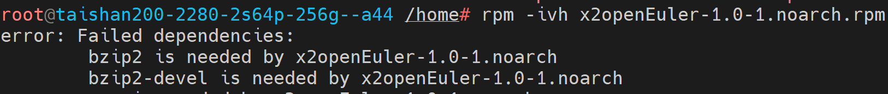

# x2openEuler 用户指南

<!-- TOC -->

- [x2openEuler 用户指南](#x2openeuler-用户指南)
    - [前言](#前言)
        - [概述](#概述)
        - [读者对象](#读者对象)
        - [符号约定](#符号约定)
        - [命令行格式约定](#命令行格式约定)
        - [修改记录](#修改记录)
    - [免责声明](#免责声明)
    - [工具概述](#工具概述)
    - [安装](#安装)
        - [环境要求](#环境要求)
        - [获取软件包](#获取软件包)
        - [软件数字签名验证](#软件数字签名验证)
        - [安装](#安装-1)
        - [验证](#验证)
        - [卸载](#卸载)
    - [特性指南](#特性指南)
        - [软件评估](#软件评估)
        - [配置收集与评估](#配置收集与评估)
        - [硬件评估](#硬件评估)
    - [常用操作](#常用操作)
        - [查看x2openEuler工具命令参数说明](#查看x2openeuler工具命令参数说明)
        - [查看x2openEuler工具版本信息（CLI）](#查看x2openeuler工具版本信息cli)
        - [查看评估报告（CLI）](#查看评估报告cli)
        - [配置操作系统yum源](#配置操作系统yum源)
        - [查询操作系统的版本信息](#查询操作系统的版本信息)
    - [FAQ](#faq)
        - [查看评估报告，页面显示不正常](#查看评估报告页面显示不正常)
        - [安装时出现缺少依赖软件包导致安装失败](#安装时出现缺少依赖软件包导致安装失败)
    - [附录](#附录)
        - [相关链接](#相关链接)
        - [术语](#术语)
        - [缩略语](#缩略语)

<!-- /TOC -->

## 前言

### 概述

本文档介绍了获取x2openEuler工具安装包，以及对其进行安装、使用的方法及各项功能做了详细介绍。

### 读者对象

本文档主要适用于以下人员：

-   openEuler操作系统的用户
-   鲲鹏平台的开发者
-   鲲鹏平台的软件用户
-   ISV开发者

### 符号约定

在本文中可能出现下列标志，它们所代表的含义如下。

<a name="table2622507016410"></a>
<table><thead align="left"><tr id="row1530720816410"><th class="cellrowborder" valign="top" width="20.580000000000002%" id="mcps1.1.3.1.1"><p id="p6450074116410"><a name="p6450074116410"></a><a name="p6450074116410"></a><strong id="b2136615816410"><a name="b2136615816410"></a><a name="b2136615816410"></a>符号</strong></p>
</th>
<th class="cellrowborder" valign="top" width="79.42%" id="mcps1.1.3.1.2"><p id="p5435366816410"><a name="p5435366816410"></a><a name="p5435366816410"></a><strong id="b5941558116410"><a name="b5941558116410"></a><a name="b5941558116410"></a>说明</strong></p>
</th>
</tr>
</thead>
<tbody><tr id="row1372280416410"><td class="cellrowborder" valign="top" width="20.580000000000002%" headers="mcps1.1.3.1.1 "><p id="p3734547016410"><a name="p3734547016410"></a><a name="p3734547016410"></a><a name="image2670064316410"></a><a name="image2670064316410"></a><span></span></p>
</td>
<td class="cellrowborder" valign="top" width="79.42%" headers="mcps1.1.3.1.2 "><p id="p1757432116410"><a name="p1757432116410"></a><a name="p1757432116410"></a>表示如不避免则将会导致死亡或严重伤害的具有高等级风险的危害。</p>
</td>
</tr>
<tr id="row466863216410"><td class="cellrowborder" valign="top" width="20.580000000000002%" headers="mcps1.1.3.1.1 "><p id="p1432579516410"><a name="p1432579516410"></a><a name="p1432579516410"></a><a name="image4895582316410"></a><a name="image4895582316410"></a><span></span></p>
</td>
<td class="cellrowborder" valign="top" width="79.42%" headers="mcps1.1.3.1.2 "><p id="p959197916410"><a name="p959197916410"></a><a name="p959197916410"></a>表示如不避免则可能导致死亡或严重伤害的具有中等级风险的危害。</p>
</td>
</tr>
<tr id="row123863216410"><td class="cellrowborder" valign="top" width="20.580000000000002%" headers="mcps1.1.3.1.1 "><p id="p1232579516410"><a name="p1232579516410"></a><a name="p1232579516410"></a><a name="image1235582316410"></a><a name="image1235582316410"></a><span></span></p>
</td>
<td class="cellrowborder" valign="top" width="79.42%" headers="mcps1.1.3.1.2 "><p id="p123197916410"><a name="p123197916410"></a><a name="p123197916410"></a>表示如不避免则可能导致轻微或中度伤害的具有低等级风险的危害。</p>
</td>
</tr>
<tr id="row5786682116410"><td class="cellrowborder" valign="top" width="20.580000000000002%" headers="mcps1.1.3.1.1 "><p id="p2204984716410"><a name="p2204984716410"></a><a name="p2204984716410"></a><a name="image4504446716410"></a><a name="image4504446716410"></a><span></span></p>
</td>
<td class="cellrowborder" valign="top" width="79.42%" headers="mcps1.1.3.1.2 "><p id="p4388861916410"><a name="p4388861916410"></a><a name="p4388861916410"></a>用于传递设备或环境安全警示信息。如不避免则可能会导致设备损坏、数据丢失、设备性能降低或其它不可预知的结果。</p>
<p id="p1238861916410"><a name="p1238861916410"></a><a name="p1238861916410"></a>“须知”不涉及人身伤害。</p>
</td>
</tr>
<tr id="row2856923116410"><td class="cellrowborder" valign="top" width="20.580000000000002%" headers="mcps1.1.3.1.1 "><p id="p5555360116410"><a name="p5555360116410"></a><a name="p5555360116410"></a><a name="image799324016410"></a><a name="image799324016410"></a><span></span></p>
</td>
<td class="cellrowborder" valign="top" width="79.42%" headers="mcps1.1.3.1.2 "><p id="p4612588116410"><a name="p4612588116410"></a><a name="p4612588116410"></a>对正文中重点信息的补充说明。</p>
<p id="p1232588116410"><a name="p1232588116410"></a><a name="p1232588116410"></a>“说明”不是安全警示信息，不涉及人身、设备及环境伤害信息。</p>
</td>
</tr>
</tbody>
</table>

### 命令行格式约定

<a name="table57396167"></a>
<table><thead align="left"><tr id="row54460779"><th class="cellrowborder" valign="top" width="30%" id="mcps1.1.3.1.1"><p id="p49246997"><a name="p49246997"></a><a name="p49246997"></a>格式</p>
</th>
<th class="cellrowborder" valign="top" width="70%" id="mcps1.1.3.1.2"><p id="p29583811"><a name="p29583811"></a><a name="p29583811"></a>意义</p>
</th>
</tr>
</thead>
<tbody><tr id="row47478494"><td class="cellrowborder" valign="top" width="30%" headers="mcps1.1.3.1.1 "><p id="p20552781"><a name="p20552781"></a><a name="p20552781"></a><strong id="b50757304"><a name="b50757304"></a><a name="b50757304"></a>粗体</strong></p>
</td>
<td class="cellrowborder" valign="top" width="70%" headers="mcps1.1.3.1.2 "><p id="p17700929"><a name="p17700929"></a><a name="p17700929"></a>命令行关键字（命令中保持不变、必须照输的部分）采用<strong id="b25090633"><a name="b25090633"></a><a name="b25090633"></a>加粗</strong>字体表示。</p>
</td>
</tr>
<tr id="row24489106"><td class="cellrowborder" valign="top" width="30%" headers="mcps1.1.3.1.1 "><p id="p37460564"><a name="p37460564"></a><a name="p37460564"></a><em id="i1600758"><a name="i1600758"></a><a name="i1600758"></a>斜体</em></p>
</td>
<td class="cellrowborder" valign="top" width="70%" headers="mcps1.1.3.1.2 "><p id="p62552612"><a name="p62552612"></a><a name="p62552612"></a>命令行参数（命令中必须由实际值进行替代的部分）采用斜体表示。</p>
</td>
</tr>
<tr id="row26102601"><td class="cellrowborder" valign="top" width="30%" headers="mcps1.1.3.1.1 "><p id="p33935949"><a name="p33935949"></a><a name="p33935949"></a>[ ]</p>
</td>
<td class="cellrowborder" valign="top" width="70%" headers="mcps1.1.3.1.2 "><p id="p64457312"><a name="p64457312"></a><a name="p64457312"></a>表示用“[ ]”括起来的部分在命令配置时是可选的。</p>
</td>
</tr>
<tr id="row43244904"><td class="cellrowborder" valign="top" width="30%" headers="mcps1.1.3.1.1 "><p id="p13176344"><a name="p13176344"></a><a name="p13176344"></a>{ x | y | ... }</p>
</td>
<td class="cellrowborder" valign="top" width="70%" headers="mcps1.1.3.1.2 "><p id="p60650924"><a name="p60650924"></a><a name="p60650924"></a>表示从两个或多个选项中选取一个。</p>
</td>
</tr>
<tr id="row8987407"><td class="cellrowborder" valign="top" width="30%" headers="mcps1.1.3.1.1 "><p id="p56891381"><a name="p56891381"></a><a name="p56891381"></a>[ x | y | ... ]</p>
</td>
<td class="cellrowborder" valign="top" width="70%" headers="mcps1.1.3.1.2 "><p id="p44799155"><a name="p44799155"></a><a name="p44799155"></a>表示从两个或多个选项中选取一个或者不选。</p>
</td>
</tr>
<tr id="row539219"><td class="cellrowborder" valign="top" width="30%" headers="mcps1.1.3.1.1 "><p id="p43676810"><a name="p43676810"></a><a name="p43676810"></a>{ x | y | ... }*</p>
</td>
<td class="cellrowborder" valign="top" width="70%" headers="mcps1.1.3.1.2 "><p id="p48160684"><a name="p48160684"></a><a name="p48160684"></a>表示从两个或多个选项中选取多个，最少选取一个，最多选取所有选项。</p>
</td>
</tr>
<tr id="row30792978"><td class="cellrowborder" valign="top" width="30%" headers="mcps1.1.3.1.1 "><p id="p11203266"><a name="p11203266"></a><a name="p11203266"></a>[ x | y | ... ]*</p>
</td>
<td class="cellrowborder" valign="top" width="70%" headers="mcps1.1.3.1.2 "><p id="p35049363"><a name="p35049363"></a><a name="p35049363"></a>表示从两个或多个选项中选取多个或者不选。</p>
</td>
</tr>
<tr id="row47008815"><td class="cellrowborder" valign="top" width="30%" headers="mcps1.1.3.1.1 "><p id="p49617684"><a name="p49617684"></a><a name="p49617684"></a>&amp;&lt;1-n&gt;</p>
</td>
<td class="cellrowborder" valign="top" width="70%" headers="mcps1.1.3.1.2 "><p id="p59609453"><a name="p59609453"></a><a name="p59609453"></a>表示符号“&amp;”前面的参数可以重复1～n次。</p>
</td>
</tr>
<tr id="row66723033"><td class="cellrowborder" valign="top" width="30%" headers="mcps1.1.3.1.1 "><p id="p35856572"><a name="p35856572"></a><a name="p35856572"></a>#</p>
</td>
<td class="cellrowborder" valign="top" width="70%" headers="mcps1.1.3.1.2 "><p id="p18701191"><a name="p18701191"></a><a name="p18701191"></a>表示由“#”开始的行为注释行。</p>
</td>
</tr>
</tbody>
</table>

### 修改记录

<a name="table1557726816410"></a>
<table><thead align="left"><tr id="row2942532716410"><th class="cellrowborder" valign="top" width="20.72%" id="mcps1.1.4.1.1"><p id="p3778275416410"><a name="p3778275416410"></a><a name="p3778275416410"></a><strong id="b5687322716410"><a name="b5687322716410"></a><a name="b5687322716410"></a>文档版本</strong></p>
</th>
<th class="cellrowborder" valign="top" width="26.119999999999997%" id="mcps1.1.4.1.2"><p id="p5627845516410"><a name="p5627845516410"></a><a name="p5627845516410"></a><strong id="b5800814916410"><a name="b5800814916410"></a><a name="b5800814916410"></a>发布日期</strong></p>
</th>
<th class="cellrowborder" valign="top" width="53.16%" id="mcps1.1.4.1.3"><p id="p2382284816410"><a name="p2382284816410"></a><a name="p2382284816410"></a><strong id="b3316380216410"><a name="b3316380216410"></a><a name="b3316380216410"></a>修改说明</strong></p>
</th>
</tr>
</thead>
<tbody><tr id="row5947359616410"><td class="cellrowborder" valign="top" width="20.72%" headers="mcps1.1.4.1.1 "><p id="p2149706016410"><a name="p2149706016410"></a><a name="p2149706016410"></a>01</p>
</td>
<td class="cellrowborder" valign="top" width="26.119999999999997%" headers="mcps1.1.4.1.2 "><p id="p648803616410"><a name="p648803616410"></a><a name="p648803616410"></a>2021-12-30</p>
</td>
<td class="cellrowborder" valign="top" width="53.16%" headers="mcps1.1.4.1.3 "><p id="p1946537916410"><a name="p1946537916410"></a><a name="p1946537916410"></a>第一次正式发布。</p>
</td>
</tr>
</tbody>
</table>

## 免责声明

-   建议您在非生产环境使用本工具，避免影响生产业务运行。
-   您上传及查阅源码前已确认您为源码所有者或者已获得源码所有者的充足授权同意。
-   未经所有者授权，任何个人或组织均不得使用该源码从事任何活动。华为公司不对由此造成的一切后果负责，亦不承担任何法律责任。必要时，将追究其法律责任。
-   未经所有者授权，任何个人或组织均不得私自传播该源码。华为公司不对由此造成的一切后果负责，亦不承担任何法律责任。必要时，将追究其法律责任。
-   该源码及相关评估报告等，仅做查阅参考，不具有法律效力，也不以任何方式或形式构成特定指引和法律建议。
-   除非法律法规或双方合同另有规定，华为对本评估建议及相关内容不做任何明示或暗示的声明或保证，不对本评估建议及相关内容的适销性、满意度、非侵权性或特定用途适用性等做出任何保证或承诺。
-   您根据本评估建议及相关内容所采取的任何行为均由您自行承担风险，华为在任何情况下均不对任何性质的损害或损失负责。
-   点击确认将上传源码至当前服务器工作目录下，用于源码扫描分析。本工具不会将这些源码用于其他目的，通过其他用户名登录同一台服务器的用户无权查看您工作目录的代码。


## 工具概述

x2openEuler迁移评估工具是提供给开发者面向openEuler操作系统进行软件迁移分析的轻量级端到端工具，支持软件评估、配置收集与评估以及硬件评估。x2openEuler插件作为客户端调用服务端的工具，完成扫描迁移任务，可以对待迁移软件进行快速扫描分析，提供专业的代码迁移指导，极大简化客户应用从CentOS迁移到openEuler的过程。当客户有软件需要从CentOS平台迁移到openEuler平台上时，可先用该工具分析可迁移性和迁移投入，以解决客户软件迁移评估中分析投入大、准确率低、整体效率低下的痛点。

根据支持的特性不同，分为轻量级x2openEuler和全量级x2openEuler。轻量级x2openEuler仅支持配置收集与评估和硬件评估特性，全量级x2openEuler支持全部特性。

x2openEuler工具支持的特性功能如下。

-   软件评估

    通过识别应用软件依赖的软件包清单信息，对rpm/tar/zip/gzip/jar/py/pyc/sh/bin应用进行扫描评估，并生成.html评估报告。

-   配置收集与评估

    支持对用户环境数据进行收集并生成json格式文件，支持收集硬件配置、配置接口、内核选项配置参数、系统配置参数（sysctl/proc/sys）、环境变量、服务、进程、端口、命令接口、系统调用项和设备驱动接口等信息，并完成配置信息分析评估。

-   硬件评估

    评估运行环境的整机（x86/aarch64）、整机板卡（RAID/NIC/FC/IB/GPU/SSD/TPM）是否在openEuler兼容性清单。


## 安装


### 环境要求

> **说明：** 
>本工具仅适用于开发和测试环境。

#### 物理机要求

x2openEuler支持在物理机上安装运行，物理机要求如[表1](#zh-cn_topic_0000001115418740_zh-cn_topic_0228242408_zh-cn_topic_0190602888_table38928044)所示。

**表 1**  硬件要求

<a name="zh-cn_topic_0000001115418740_zh-cn_topic_0228242408_zh-cn_topic_0190602888_table38928044"></a>
<table><thead align="left"><tr id="zh-cn_topic_0000001115418740_zh-cn_topic_0228242408_zh-cn_topic_0190602888_row49314056"><th class="cellrowborder" valign="top" width="16.43%" id="mcps1.2.3.1.1"><p id="zh-cn_topic_0000001115418740_zh-cn_topic_0228242408_zh-cn_topic_0190602888_p35015599"><a name="zh-cn_topic_0000001115418740_zh-cn_topic_0228242408_zh-cn_topic_0190602888_p35015599"></a><a name="zh-cn_topic_0000001115418740_zh-cn_topic_0228242408_zh-cn_topic_0190602888_p35015599"></a>硬件类型</p>
</th>
<th class="cellrowborder" valign="top" width="83.57%" id="mcps1.2.3.1.2"><p id="zh-cn_topic_0000001115418740_zh-cn_topic_0228242408_zh-cn_topic_0190602888_p17691262"><a name="zh-cn_topic_0000001115418740_zh-cn_topic_0228242408_zh-cn_topic_0190602888_p17691262"></a><a name="zh-cn_topic_0000001115418740_zh-cn_topic_0228242408_zh-cn_topic_0190602888_p17691262"></a>说明</p>
</th>
</tr>
</thead>
<tbody><tr id="zh-cn_topic_0000001115418740_zh-cn_topic_0228242408_zh-cn_topic_0190602888_row23706142"><td class="cellrowborder" valign="top" width="16.43%" headers="mcps1.2.3.1.1 "><p id="zh-cn_topic_0000001115418740_zh-cn_topic_0228242408_zh-cn_topic_0190602888_p41149367"><a name="zh-cn_topic_0000001115418740_zh-cn_topic_0228242408_zh-cn_topic_0190602888_p41149367"></a><a name="zh-cn_topic_0000001115418740_zh-cn_topic_0228242408_zh-cn_topic_0190602888_p41149367"></a>服务器</p>
</td>
<td class="cellrowborder" valign="top" width="83.57%" headers="mcps1.2.3.1.2 "><a name="zh-cn_topic_0000001115418740_zh-cn_topic_0228242408_zh-cn_topic_0190602888_ul51741352182814"></a><a name="zh-cn_topic_0000001115418740_zh-cn_topic_0228242408_zh-cn_topic_0190602888_ul51741352182814"></a><ul id="zh-cn_topic_0000001115418740_zh-cn_topic_0228242408_zh-cn_topic_0190602888_ul51741352182814"><li>x86服务器</li><li>基于鲲鹏916/920处理器的服务器</li></ul>
</td>
</tr>
<tr id="zh-cn_topic_0000001115418740_zh-cn_topic_0228242408_row1254216504409"><td class="cellrowborder" valign="top" width="16.43%" headers="mcps1.2.3.1.1 "><p id="zh-cn_topic_0000001115418740_zh-cn_topic_0228242408_p12542145015401"><a name="zh-cn_topic_0000001115418740_zh-cn_topic_0228242408_p12542145015401"></a><a name="zh-cn_topic_0000001115418740_zh-cn_topic_0228242408_p12542145015401"></a>CPU</p>
</td>
<td class="cellrowborder" valign="top" width="83.57%" headers="mcps1.2.3.1.2 "><p id="zh-cn_topic_0000001115418740_zh-cn_topic_0228242408_p175426505409"><a name="zh-cn_topic_0000001115418740_zh-cn_topic_0228242408_p175426505409"></a><a name="zh-cn_topic_0000001115418740_zh-cn_topic_0228242408_p175426505409"></a>双核及以上配置</p>
</td>
</tr>
<tr id="zh-cn_topic_0000001115418740_zh-cn_topic_0228242408_row339035314405"><td class="cellrowborder" valign="top" width="16.43%" headers="mcps1.2.3.1.1 "><p id="zh-cn_topic_0000001115418740_zh-cn_topic_0228242408_p13390125318409"><a name="zh-cn_topic_0000001115418740_zh-cn_topic_0228242408_p13390125318409"></a><a name="zh-cn_topic_0000001115418740_zh-cn_topic_0228242408_p13390125318409"></a>内存</p>
</td>
<td class="cellrowborder" valign="top" width="83.57%" headers="mcps1.2.3.1.2 "><p id="zh-cn_topic_0000001115418740_zh-cn_topic_0228242408_p193901753184012"><a name="zh-cn_topic_0000001115418740_zh-cn_topic_0228242408_p193901753184012"></a><a name="zh-cn_topic_0000001115418740_zh-cn_topic_0228242408_p193901753184012"></a>系统空闲内存要求8GB及以上</p>
</td>
</tr>
<tr id="row1950145145212"><td class="cellrowborder" valign="top" width="16.43%" headers="mcps1.2.3.1.1 "><p id="p767617616525"><a name="p767617616525"></a><a name="p767617616525"></a>硬盘</p>
</td>
<td class="cellrowborder" valign="top" width="83.57%" headers="mcps1.2.3.1.2 "><p id="p8676460520"><a name="p8676460520"></a><a name="p8676460520"></a>20GB及以上</p>
</td>
</tr>
</tbody>
</table>

#### 虚拟机要求

x2openEuler支持安装在虚拟机上运行，虚拟机要求如[表2](#table19116152811393)所示。

**表 2**  虚拟机要求

<a name="table19116152811393"></a>
<table><thead align="left"><tr id="row141161128133913"><th class="cellrowborder" valign="top" width="16.43%" id="mcps1.2.3.1.1"><p id="p17116132815394"><a name="p17116132815394"></a><a name="p17116132815394"></a>硬件类型</p>
</th>
<th class="cellrowborder" valign="top" width="83.57%" id="mcps1.2.3.1.2"><p id="p9116182811394"><a name="p9116182811394"></a><a name="p9116182811394"></a>说明</p>
</th>
</tr>
</thead>
<tbody><tr id="row1116132811397"><td class="cellrowborder" valign="top" width="16.43%" headers="mcps1.2.3.1.1 "><p id="p111160281398"><a name="p111160281398"></a><a name="p111160281398"></a>架构</p>
</td>
<td class="cellrowborder" valign="top" width="83.57%" headers="mcps1.2.3.1.2 "><p id="p12421174216461"><a name="p12421174216461"></a><a name="p12421174216461"></a>aarch64或x86_64</p>
</td>
</tr>
<tr id="row1111610288391"><td class="cellrowborder" valign="top" width="16.43%" headers="mcps1.2.3.1.1 "><p id="p11116142803911"><a name="p11116142803911"></a><a name="p11116142803911"></a>CPU</p>
</td>
<td class="cellrowborder" valign="top" width="83.57%" headers="mcps1.2.3.1.2 "><p id="p811672883917"><a name="p811672883917"></a><a name="p811672883917"></a>双核及以上</p>
</td>
</tr>
<tr id="row111682813396"><td class="cellrowborder" valign="top" width="16.43%" headers="mcps1.2.3.1.1 "><p id="p111161828143911"><a name="p111161828143911"></a><a name="p111161828143911"></a>内存</p>
</td>
<td class="cellrowborder" valign="top" width="83.57%" headers="mcps1.2.3.1.2 "><p id="p611652811393"><a name="p611652811393"></a><a name="p611652811393"></a>系统空闲内存要求8GB及以上</p>
</td>
</tr>
<tr id="row812652017504"><td class="cellrowborder" valign="top" width="16.43%" headers="mcps1.2.3.1.1 "><p id="p1312672075016"><a name="p1312672075016"></a><a name="p1312672075016"></a>硬盘</p>
</td>
<td class="cellrowborder" valign="top" width="83.57%" headers="mcps1.2.3.1.2 "><p id="p13126152014502"><a name="p13126152014502"></a><a name="p13126152014502"></a>20GB及以上</p>
</td>
</tr>
</tbody>
</table>

#### 源操作系统要求

运行环境操作系统要求[表3](#table10913153312812)所示。

**表 3**  源操作系统要求

<a name="table10913153312812"></a>
<table><thead align="left"><tr id="row591343318286"><th class="cellrowborder" valign="top" width="33.33333333333333%" id="mcps1.2.4.1.1"><p id="p2913193362819"><a name="p2913193362819"></a><a name="p2913193362819"></a>操作系统名称</p>
</th>
<th class="cellrowborder" valign="top" width="33.33333333333333%" id="mcps1.2.4.1.2"><p id="p491333310281"><a name="p491333310281"></a><a name="p491333310281"></a>版本</p>
</th>
<th class="cellrowborder" valign="top" width="33.33333333333333%" id="mcps1.2.4.1.3"><p id="p49131333142819"><a name="p49131333142819"></a><a name="p49131333142819"></a>操作系统镜像文件名称</p>
</th>
</tr>
</thead>
<tbody><tr id="row1091314333287"><td class="cellrowborder" rowspan="5" valign="top" width="33.33333333333333%" headers="mcps1.2.4.1.1 "><p id="p169139335286"><a name="p169139335286"></a><a name="p169139335286"></a>CentOS</p>
<p id="p20962184912117"><a name="p20962184912117"></a><a name="p20962184912117"></a></p>
</td>
<td class="cellrowborder" valign="top" width="33.33333333333333%" headers="mcps1.2.4.1.2 "><p id="p191333332811"><a name="p191333332811"></a><a name="p191333332811"></a>6.8</p>
</td>
<td class="cellrowborder" valign="top" width="33.33333333333333%" headers="mcps1.2.4.1.3 "><p id="p109131533162810"><a name="p109131533162810"></a><a name="p109131533162810"></a>x86_64:<a href="https://vault.centos.org/6.8/isos/x86_64/CentOS-6.8-x86_64-bin-DVD1.iso" target="_blank" rel="noopener noreferrer">CentOS-6.8-x86_64-bin-DVD1.iso</a></p>
</td>
</tr>
<tr id="row1191323312286"><td class="cellrowborder" rowspan="2" valign="top" headers="mcps1.2.4.1.1 "><p id="p15913933192812"><a name="p15913933192812"></a><a name="p15913933192812"></a>7.6</p>
</td>
<td class="cellrowborder" valign="top" headers="mcps1.2.4.1.2 "><p id="p1091343372814"><a name="p1091343372814"></a><a name="p1091343372814"></a>x86_64:<a href="https://vault.centos.org/7.6.1810/isos/x86_64/CentOS-7-x86_64-Everything-1810.iso" target="_blank" rel="noopener noreferrer">CentOS-7-x86_64-Everything-1810.iso</a></p>
</td>
</tr>
<tr id="row85491652181211"><td class="cellrowborder" valign="top" headers="mcps1.2.4.1.1 "><p id="p95491852121215"><a name="p95491852121215"></a><a name="p95491852121215"></a>aarch:<a href="https://vault.centos.org/altarch/7.6.1810/isos/aarch64/CentOS-7-aarch64-Everything-1810.iso" target="_blank" rel="noopener noreferrer">CentOS-7-aarch64-Everything-1810.iso</a></p>
</td>
</tr>
<tr id="row69133332289"><td class="cellrowborder" rowspan="2" valign="top" headers="mcps1.2.4.1.1 "><p id="p69139337287"><a name="p69139337287"></a><a name="p69139337287"></a>8.2</p>
</td>
<td class="cellrowborder" valign="top" headers="mcps1.2.4.1.2 "><p id="p1991333312281"><a name="p1991333312281"></a><a name="p1991333312281"></a>x86_64:<a href="https://vault.centos.org/8.2.2004/isos/x86_64/CentOS-8.2.2004-x86_64-dvd1.iso" target="_blank" rel="noopener noreferrer">CentOS-8.2.2004-x86_64-dvd1.iso</a></p>
</td>
</tr>
<tr id="row29622497214"><td class="cellrowborder" valign="top" headers="mcps1.2.4.1.1 "><p id="p13962154911212"><a name="p13962154911212"></a><a name="p13962154911212"></a>aarch:<a href="https://vault.centos.org/8.2.2004/isos/aarch64/CentOS-8.2.2004-aarch64-dvd1.iso" target="_blank" rel="noopener noreferrer">CentOS-8.2.2004-aarch64-dvd1.iso</a></p>
</td>
</tr>
</tbody>
</table>

> **说明：** 
>如果当前服务器环境无法联网或修改过操作系统yum源，工具安装过程中需要操作系统镜像文件用于安装依赖包，所需操作系统镜像文件请参见[表3](#table10913153312812)，请自行获取对应操作系统版本的镜像文件。

#### 目标操作系统要求

目标操作系统要求[表4](#table7664131873211)所示。

**表 4**  目标操作系统要求

<a name="table7664131873211"></a>
<table><thead align="left"><tr id="row76649182329"><th class="cellrowborder" valign="top" width="33.33333333333333%" id="mcps1.2.4.1.1"><p id="p20664161812328"><a name="p20664161812328"></a><a name="p20664161812328"></a>操作系统名称</p>
</th>
<th class="cellrowborder" valign="top" width="33.33333333333333%" id="mcps1.2.4.1.2"><p id="p566471863217"><a name="p566471863217"></a><a name="p566471863217"></a>版本</p>
</th>
<th class="cellrowborder" valign="top" width="33.33333333333333%" id="mcps1.2.4.1.3"><p id="p16664161873219"><a name="p16664161873219"></a><a name="p16664161873219"></a>操作系统镜像文件名称</p>
</th>
</tr>
</thead>
<tbody><tr id="row7664918123213"><td class="cellrowborder" rowspan="2" valign="top" width="33.33333333333333%" headers="mcps1.2.4.1.1 "><p id="p5664151813326"><a name="p5664151813326"></a><a name="p5664151813326"></a>openEuler</p>
</td>
<td class="cellrowborder" rowspan="2" valign="top" width="33.33333333333333%" headers="mcps1.2.4.1.2 "><p id="p106645188326"><a name="p106645188326"></a><a name="p106645188326"></a>20.03 LTS SP1</p>
</td>
<td class="cellrowborder" valign="top" width="33.33333333333333%" headers="mcps1.2.4.1.3 "><p id="p13664141810328"><a name="p13664141810328"></a><a name="p13664141810328"></a>x86_64:<a href="https://repo.openeuler.org/openEuler-20.03-LTS-SP1/ISO/x86_64/openEuler-20.03-LTS-SP1-everything-x86_64-dvd.iso" target="_blank" rel="noopener noreferrer">openEuler-20.03-LTS-SP1-everything-x86_64-dvd.iso</a></p>
</td>
</tr>
<tr id="row8624654182312"><td class="cellrowborder" valign="top" headers="mcps1.2.4.1.1 "><p id="p1962505452311"><a name="p1962505452311"></a><a name="p1962505452311"></a>aarch:<a href="https://repo.openeuler.org/openEuler-20.03-LTS-SP1/ISO/aarch64/openEuler-20.03-LTS-SP1-everything-aarch64-dvd.iso" target="_blank" rel="noopener noreferrer">openEuler-20.03-LTS-SP1-everything-aarch64-dvd.iso</a></p>
</td>
</tr>
</tbody>
</table>

#### 依赖要求

x2openEuler自动安装的依赖组件如[表5](#zh-cn_topic_0000001115418740_zh-cn_topic_0228242408_table1537445116472)所示。

**表 5**  依赖组件

<a name="table134317232714"></a>
<table><thead align="left"><tr id="row543102315720"><th class="cellrowborder" valign="top" width="32.72327232723272%" id="mcps1.2.4.1.1"><p id="p44312231711"><a name="p44312231711"></a><a name="p44312231711"></a>分类</p>
</th>
<th class="cellrowborder" valign="top" width="33.943394339433944%" id="mcps1.2.4.1.2"><p id="p6439231279"><a name="p6439231279"></a><a name="p6439231279"></a>组件</p>
</th>
<th class="cellrowborder" valign="top" width="33.33333333333333%" id="mcps1.2.4.1.3"><p id="p1543122319711"><a name="p1543122319711"></a><a name="p1543122319711"></a>说明</p>
</th>
</tr>
</thead>
<tbody><tr id="row15191121914453"><td class="cellrowborder" rowspan="18" valign="top" width="32.72327232723272%" headers="mcps1.2.4.1.1 "><p id="p124315231074"><a name="p124315231074"></a><a name="p124315231074"></a>轻量级x2openEuler工具</p>
</td>
<td class="cellrowborder" valign="top" width="33.943394339433944%" headers="mcps1.2.4.1.2 "><p id="p319261919456"><a name="p319261919456"></a><a name="p319261919456"></a>bzip2</p>
</td>
<td class="cellrowborder" valign="top" width="33.33333333333333%" headers="mcps1.2.4.1.3 "><p id="p919241917456"><a name="p919241917456"></a><a name="p919241917456"></a>解压缩工具。</p>
</td>
</tr>
<tr id="row1448212334445"><td class="cellrowborder" valign="top" headers="mcps1.2.4.1.1 "><p id="p748333316444"><a name="p748333316444"></a><a name="p748333316444"></a>bzip2-devel</p>
</td>
<td class="cellrowborder" valign="top" headers="mcps1.2.4.1.2 "><p id="p10483113319443"><a name="p10483113319443"></a><a name="p10483113319443"></a>解压缩工具。</p>
</td>
</tr>
<tr id="row15635945133610"><td class="cellrowborder" valign="top" headers="mcps1.2.4.1.1 "><p id="p663544553614"><a name="p663544553614"></a><a name="p663544553614"></a>cmake</p>
</td>
<td class="cellrowborder" valign="top" headers="mcps1.2.4.1.2 "><p id="p166352454363"><a name="p166352454363"></a><a name="p166352454363"></a>自动化构建系统。</p>
</td>
</tr>
<tr id="row1580182418547"><td class="cellrowborder" valign="top" headers="mcps1.2.4.1.1 "><p id="p480142419543"><a name="p480142419543"></a><a name="p480142419543"></a>dmidecode</p>
</td>
<td class="cellrowborder" valign="top" headers="mcps1.2.4.1.2 "><p id="p2080142413545"><a name="p2080142413545"></a><a name="p2080142413545"></a>查询硬件信息工具包。</p>
</td>
</tr>
<tr id="row21713234462"><td class="cellrowborder" valign="top" headers="mcps1.2.4.1.1 "><p id="p1717182311467"><a name="p1717182311467"></a><a name="p1717182311467"></a>gcc</p>
</td>
<td class="cellrowborder" valign="top" headers="mcps1.2.4.1.2 "><p id="p1217117239469"><a name="p1217117239469"></a><a name="p1217117239469"></a>C/C++编译器。</p>
</td>
</tr>
<tr id="row38756281027"><td class="cellrowborder" valign="top" headers="mcps1.2.4.1.1 "><p id="p143133019216"><a name="p143133019216"></a><a name="p143133019216"></a>git</p>
</td>
<td class="cellrowborder" valign="top" headers="mcps1.2.4.1.2 "><p id="p38761828623"><a name="p38761828623"></a><a name="p38761828623"></a>版本管理工具。</p>
</td>
</tr>
<tr id="row2568135944617"><td class="cellrowborder" valign="top" headers="mcps1.2.4.1.1 "><p id="p13569145934619"><a name="p13569145934619"></a><a name="p13569145934619"></a>libxml2</p>
</td>
<td class="cellrowborder" valign="top" headers="mcps1.2.4.1.2 "><p id="p15569195918467"><a name="p15569195918467"></a><a name="p15569195918467"></a>xml解析函数库。</p>
</td>
</tr>
<tr id="row7954203310476"><td class="cellrowborder" valign="top" headers="mcps1.2.4.1.1 "><p id="p20954173311472"><a name="p20954173311472"></a><a name="p20954173311472"></a>libxml2-devel</p>
</td>
<td class="cellrowborder" valign="top" headers="mcps1.2.4.1.2 "><p id="p19541633174713"><a name="p19541633174713"></a><a name="p19541633174713"></a>xml解析函数库。</p>
</td>
</tr>
<tr id="row4248181014916"><td class="cellrowborder" valign="top" headers="mcps1.2.4.1.1 "><p id="p324871064918"><a name="p324871064918"></a><a name="p324871064918"></a>libxslt</p>
</td>
<td class="cellrowborder" valign="top" headers="mcps1.2.4.1.2 "><p id="p14618193764912"><a name="p14618193764912"></a><a name="p14618193764912"></a>xml解析库。</p>
</td>
</tr>
<tr id="row197932317492"><td class="cellrowborder" valign="top" headers="mcps1.2.4.1.1 "><p id="p149791023174912"><a name="p149791023174912"></a><a name="p149791023174912"></a>libxslt-devel</p>
</td>
<td class="cellrowborder" valign="top" headers="mcps1.2.4.1.2 "><p id="p873093884916"><a name="p873093884916"></a><a name="p873093884916"></a>xml解析库。</p>
</td>
</tr>
<tr id="row1993151465312"><td class="cellrowborder" valign="top" headers="mcps1.2.4.1.1 "><p id="p3942149539"><a name="p3942149539"></a><a name="p3942149539"></a>net-tools</p>
</td>
<td class="cellrowborder" valign="top" headers="mcps1.2.4.1.2 "><p id="p8941214105319"><a name="p8941214105319"></a><a name="p8941214105319"></a>网络命令工具箱。</p>
</td>
</tr>
<tr id="row62688594494"><td class="cellrowborder" valign="top" headers="mcps1.2.4.1.1 "><p id="p19268145915497"><a name="p19268145915497"></a><a name="p19268145915497"></a>python3</p>
</td>
<td class="cellrowborder" valign="top" headers="mcps1.2.4.1.2 "><p id="p156721116512"><a name="p156721116512"></a><a name="p156721116512"></a>python开发运行环境，要求版本3.7及以上。</p>
</td>
</tr>
<tr id="row1480544513516"><td class="cellrowborder" valign="top" headers="mcps1.2.4.1.1 "><p id="p12806194518515"><a name="p12806194518515"></a><a name="p12806194518515"></a>pciutils</p>
</td>
<td class="cellrowborder" valign="top" headers="mcps1.2.4.1.2 "><p id="p580664514518"><a name="p580664514518"></a><a name="p580664514518"></a>访问PCI总线配置寄存器的可移植库。</p>
</td>
</tr>
<tr id="row3433234714"><td class="cellrowborder" valign="top" headers="mcps1.2.4.1.1 "><p id="p6431723673"><a name="p6431723673"></a><a name="p6431723673"></a>redis</p>
</td>
<td class="cellrowborder" valign="top" headers="mcps1.2.4.1.2 "><p id="p14901931781"><a name="p14901931781"></a><a name="p14901931781"></a>数据库，建议版本4.0.11及以上版本。</p>
</td>
</tr>
<tr id="row158947251319"><td class="cellrowborder" valign="top" headers="mcps1.2.4.1.1 "><p id="p7894425103116"><a name="p7894425103116"></a><a name="p7894425103116"></a>sqlite</p>
</td>
<td class="cellrowborder" valign="top" headers="mcps1.2.4.1.2 "><p id="p14645134418319"><a name="p14645134418319"></a><a name="p14645134418319"></a>数据库，要求版本3.7.17及以上。</p>
<div class="note" id="note1216095293115"><a name="note1216095293115"></a><a name="note1216095293115"></a><span class="notetitle"> 说明： </span><div class="notebody"><p id="p16160175263118"><a name="p16160175263118"></a><a name="p16160175263118"></a>CentOS 6.8 采用x2openEuler工具集成的SQLite数据库。</p>
</div></div>
</td>
</tr>
<tr id="row511802965814"><td class="cellrowborder" valign="top" headers="mcps1.2.4.1.1 "><p id="p5118182995815"><a name="p5118182995815"></a><a name="p5118182995815"></a>util-linux</p>
</td>
<td class="cellrowborder" valign="top" headers="mcps1.2.4.1.2 "><p id="p1211862945814"><a name="p1211862945814"></a><a name="p1211862945814"></a>Linux系统标准软件套件。</p>
</td>
</tr>
<tr id="row11473432005"><td class="cellrowborder" valign="top" headers="mcps1.2.4.1.1 "><p id="p1114816438013"><a name="p1114816438013"></a><a name="p1114816438013"></a>zlib</p>
</td>
<td class="cellrowborder" valign="top" headers="mcps1.2.4.1.2 "><p id="p121488431706"><a name="p121488431706"></a><a name="p121488431706"></a>解压缩工具。</p>
</td>
</tr>
<tr id="row2511155707"><td class="cellrowborder" valign="top" headers="mcps1.2.4.1.1 "><p id="p36331355204"><a name="p36331355204"></a><a name="p36331355204"></a>zlib-devel</p>
</td>
<td class="cellrowborder" valign="top" headers="mcps1.2.4.1.2 "><p id="p155145518015"><a name="p155145518015"></a><a name="p155145518015"></a>解压缩工具。</p>
</td>
</tr>
<tr id="row106271317111411"><td class="cellrowborder" rowspan="28" valign="top" width="32.72327232723272%" headers="mcps1.2.4.1.1 "><p id="p55131015101115"><a name="p55131015101115"></a><a name="p55131015101115"></a>全量级x2openEuler工具</p>
</td>
<td class="cellrowborder" valign="top" width="33.943394339433944%" headers="mcps1.2.4.1.2 "><p id="p56272017121413"><a name="p56272017121413"></a><a name="p56272017121413"></a>bzip2</p>
</td>
<td class="cellrowborder" valign="top" width="33.33333333333333%" headers="mcps1.2.4.1.3 "><p id="p1762713174142"><a name="p1762713174142"></a><a name="p1762713174142"></a>解压缩工具。</p>
</td>
</tr>
<tr id="row18411317224"><td class="cellrowborder" valign="top" headers="mcps1.2.4.1.1 "><p id="p351931229"><a name="p351931229"></a><a name="p351931229"></a>bzip2-devel</p>
</td>
<td class="cellrowborder" valign="top" headers="mcps1.2.4.1.2 "><p id="p10514314223"><a name="p10514314223"></a><a name="p10514314223"></a>解压缩工具。</p>
</td>
</tr>
<tr id="row1035810381755"><td class="cellrowborder" valign="top" headers="mcps1.2.4.1.1 "><p id="p9359113815519"><a name="p9359113815519"></a><a name="p9359113815519"></a>cmake</p>
</td>
<td class="cellrowborder" valign="top" headers="mcps1.2.4.1.2 "><p id="p133591738858"><a name="p133591738858"></a><a name="p133591738858"></a>自动化构建系统。</p>
</td>
</tr>
<tr id="row1832913589143"><td class="cellrowborder" valign="top" headers="mcps1.2.4.1.1 "><p id="p14329858161414"><a name="p14329858161414"></a><a name="p14329858161414"></a>dmidecode</p>
</td>
<td class="cellrowborder" valign="top" headers="mcps1.2.4.1.2 "><p id="p1329358141418"><a name="p1329358141418"></a><a name="p1329358141418"></a>查询硬件信息工具包。</p>
</td>
</tr>
<tr id="row195051021151617"><td class="cellrowborder" valign="top" headers="mcps1.2.4.1.1 "><p id="p4505152141612"><a name="p4505152141612"></a><a name="p4505152141612"></a>gcc</p>
</td>
<td class="cellrowborder" valign="top" headers="mcps1.2.4.1.2 "><p id="p5505132161616"><a name="p5505132161616"></a><a name="p5505132161616"></a>C/C++编译器。</p>
</td>
</tr>
<tr id="row9138184392214"><td class="cellrowborder" valign="top" headers="mcps1.2.4.1.1 "><p id="p141381043202219"><a name="p141381043202219"></a><a name="p141381043202219"></a>git</p>
</td>
<td class="cellrowborder" valign="top" headers="mcps1.2.4.1.2 "><p id="p131381443172211"><a name="p131381443172211"></a><a name="p131381443172211"></a>版本管理工具。</p>
</td>
</tr>
<tr id="row10253537115"><td class="cellrowborder" valign="top" headers="mcps1.2.4.1.1 "><p id="p4253163111111"><a name="p4253163111111"></a><a name="p4253163111111"></a>libxml2</p>
</td>
<td class="cellrowborder" valign="top" headers="mcps1.2.4.1.2 "><p id="p152531235119"><a name="p152531235119"></a><a name="p152531235119"></a>xml解析函数库。</p>
</td>
</tr>
<tr id="row85135155115"><td class="cellrowborder" valign="top" headers="mcps1.2.4.1.1 "><p id="p1151317150113"><a name="p1151317150113"></a><a name="p1151317150113"></a>libxml2-devel</p>
</td>
<td class="cellrowborder" valign="top" headers="mcps1.2.4.1.2 "><p id="p165139158117"><a name="p165139158117"></a><a name="p165139158117"></a>xml解析函数库。</p>
</td>
</tr>
<tr id="row1455035122"><td class="cellrowborder" valign="top" headers="mcps1.2.4.1.1 "><p id="p955133181214"><a name="p955133181214"></a><a name="p955133181214"></a>libxslt</p>
</td>
<td class="cellrowborder" valign="top" headers="mcps1.2.4.1.2 "><p id="p755934128"><a name="p755934128"></a><a name="p755934128"></a>xml解析库。</p>
</td>
</tr>
<tr id="row14334191515120"><td class="cellrowborder" valign="top" headers="mcps1.2.4.1.1 "><p id="p933461517121"><a name="p933461517121"></a><a name="p933461517121"></a>libxslt-devel</p>
</td>
<td class="cellrowborder" valign="top" headers="mcps1.2.4.1.2 "><p id="p533421581220"><a name="p533421581220"></a><a name="p533421581220"></a>xml解析库。</p>
</td>
</tr>
<tr id="row12721552111815"><td class="cellrowborder" valign="top" headers="mcps1.2.4.1.1 "><p id="p62721352181819"><a name="p62721352181819"></a><a name="p62721352181819"></a>libffi</p>
</td>
<td class="cellrowborder" valign="top" headers="mcps1.2.4.1.2 "><p id="p1272411511912"><a name="p1272411511912"></a><a name="p1272411511912"></a>编译python需要的依赖包。</p>
</td>
</tr>
<tr id="row960719881913"><td class="cellrowborder" valign="top" headers="mcps1.2.4.1.1 "><p id="p176071881191"><a name="p176071881191"></a><a name="p176071881191"></a>libffi-devel</p>
</td>
<td class="cellrowborder" valign="top" headers="mcps1.2.4.1.2 "><p id="p1576773361917"><a name="p1576773361917"></a><a name="p1576773361917"></a>编译python需要的依赖包。</p>
</td>
</tr>
<tr id="row98714484130"><td class="cellrowborder" valign="top" headers="mcps1.2.4.1.1 "><p id="p03001649181315"><a name="p03001649181315"></a><a name="p03001649181315"></a>net-tools</p>
</td>
<td class="cellrowborder" valign="top" headers="mcps1.2.4.1.2 "><p id="p6871548151312"><a name="p6871548151312"></a><a name="p6871548151312"></a>网络命令工具箱。</p>
</td>
</tr>
<tr id="row16343948096"><td class="cellrowborder" valign="top" headers="mcps1.2.4.1.1 "><p id="p77522055391"><a name="p77522055391"></a><a name="p77522055391"></a>java-1.8.0-openjdk</p>
</td>
<td class="cellrowborder" valign="top" headers="mcps1.2.4.1.2 "><p id="p53449481895"><a name="p53449481895"></a><a name="p53449481895"></a>Java软件开发工具包。</p>
</td>
</tr>
<tr id="row381417534915"><td class="cellrowborder" valign="top" headers="mcps1.2.4.1.1 "><p id="p19814125311918"><a name="p19814125311918"></a><a name="p19814125311918"></a>java-1.8.0-openjdk-devel</p>
</td>
<td class="cellrowborder" valign="top" headers="mcps1.2.4.1.2 "><p id="p1881415531912"><a name="p1881415531912"></a><a name="p1881415531912"></a>Java软件开发工具包。</p>
</td>
</tr>
<tr id="row42899517918"><td class="cellrowborder" valign="top" headers="mcps1.2.4.1.1 "><p id="p182891851597"><a name="p182891851597"></a><a name="p182891851597"></a>java-1.8.0-openjdk-headless</p>
</td>
<td class="cellrowborder" valign="top" headers="mcps1.2.4.1.2 "><p id="p62891551493"><a name="p62891551493"></a><a name="p62891551493"></a>Java软件开发工具包。</p>
</td>
</tr>
<tr id="row827915781611"><td class="cellrowborder" valign="top" headers="mcps1.2.4.1.1 "><p id="p727920578160"><a name="p727920578160"></a><a name="p727920578160"></a>openssl</p>
</td>
<td class="cellrowborder" valign="top" headers="mcps1.2.4.1.2 "><p id="p1127935715163"><a name="p1127935715163"></a><a name="p1127935715163"></a>编译python需要的依赖包。</p>
</td>
</tr>
<tr id="row2088690121712"><td class="cellrowborder" valign="top" headers="mcps1.2.4.1.1 "><p id="p9886130141711"><a name="p9886130141711"></a><a name="p9886130141711"></a>openssl-devel</p>
</td>
<td class="cellrowborder" valign="top" headers="mcps1.2.4.1.2 "><p id="p48866061713"><a name="p48866061713"></a><a name="p48866061713"></a>编译python需要的依赖包。</p>
</td>
</tr>
<tr id="row1015525512612"><td class="cellrowborder" valign="top" headers="mcps1.2.4.1.1 "><p id="p215511551615"><a name="p215511551615"></a><a name="p215511551615"></a>python3</p>
</td>
<td class="cellrowborder" valign="top" headers="mcps1.2.4.1.2 "><p id="p17155145519620"><a name="p17155145519620"></a><a name="p17155145519620"></a>自动化构建系统。</p>
</td>
</tr>
<tr id="row2834198201314"><td class="cellrowborder" valign="top" headers="mcps1.2.4.1.1 "><p id="p13834208151317"><a name="p13834208151317"></a><a name="p13834208151317"></a>pciutils</p>
</td>
<td class="cellrowborder" valign="top" headers="mcps1.2.4.1.2 "><p id="p1834168121317"><a name="p1834168121317"></a><a name="p1834168121317"></a>访问PCI总线配置寄存器的可移植库。</p>
</td>
</tr>
<tr id="row19455572916"><td class="cellrowborder" valign="top" headers="mcps1.2.4.1.1 "><p id="p204685718917"><a name="p204685718917"></a><a name="p204685718917"></a>redis</p>
</td>
<td class="cellrowborder" valign="top" headers="mcps1.2.4.1.2 "><p id="p15930195311714"><a name="p15930195311714"></a><a name="p15930195311714"></a>数据库，建议版本4.0.11及以上。</p>
</td>
</tr>
<tr id="row2071617380109"><td class="cellrowborder" valign="top" headers="mcps1.2.4.1.1 "><p id="p11717203821014"><a name="p11717203821014"></a><a name="p11717203821014"></a>rpm-build</p>
</td>
<td class="cellrowborder" valign="top" headers="mcps1.2.4.1.2 "><p id="p1971773818106"><a name="p1971773818106"></a><a name="p1971773818106"></a>rpm包制作管理工具。</p>
</td>
</tr>
<tr id="row79560318419"><td class="cellrowborder" valign="top" headers="mcps1.2.4.1.1 "><p id="p1695783118410"><a name="p1695783118410"></a><a name="p1695783118410"></a>sqlite</p>
</td>
<td class="cellrowborder" valign="top" headers="mcps1.2.4.1.2 "><p id="p932314515418"><a name="p932314515418"></a><a name="p932314515418"></a>数据库，要求版本3.7.17及以上。</p>
<div class="note" id="note132312511445"><a name="note132312511445"></a><a name="note132312511445"></a><span class="notetitle"> 说明： </span><div class="notebody"><p id="p103231351846"><a name="p103231351846"></a><a name="p103231351846"></a>CentOS 6.8 采用x2openEuler工具集成的SQLite数据库。</p>
</div></div>
</td>
</tr>
<tr id="row156471821122315"><td class="cellrowborder" valign="top" headers="mcps1.2.4.1.1 "><p id="p7647321182316"><a name="p7647321182316"></a><a name="p7647321182316"></a>tcl</p>
</td>
<td class="cellrowborder" valign="top" headers="mcps1.2.4.1.2 "><p id="p12356930182314"><a name="p12356930182314"></a><a name="p12356930182314"></a>编译SQLite需要的依赖包。</p>
</td>
</tr>
<tr id="row11177173920208"><td class="cellrowborder" valign="top" headers="mcps1.2.4.1.1 "><p id="p1733744019203"><a name="p1733744019203"></a><a name="p1733744019203"></a>sqlite-devel</p>
</td>
<td class="cellrowborder" valign="top" headers="mcps1.2.4.1.2 "><p id="p1717710393202"><a name="p1717710393202"></a><a name="p1717710393202"></a>用于访问SQLite数据的依赖包。</p>
</td>
</tr>
<tr id="row183060366151"><td class="cellrowborder" valign="top" headers="mcps1.2.4.1.1 "><p id="p530633614151"><a name="p530633614151"></a><a name="p530633614151"></a>util-linux</p>
</td>
<td class="cellrowborder" valign="top" headers="mcps1.2.4.1.2 "><p id="p123061336151515"><a name="p123061336151515"></a><a name="p123061336151515"></a>Linux系统标准软件套件。</p>
</td>
</tr>
<tr id="row478811574152"><td class="cellrowborder" valign="top" headers="mcps1.2.4.1.1 "><p id="p137893572155"><a name="p137893572155"></a><a name="p137893572155"></a>zlib</p>
</td>
<td class="cellrowborder" valign="top" headers="mcps1.2.4.1.2 "><p id="p0789125717159"><a name="p0789125717159"></a><a name="p0789125717159"></a>解压缩工具。</p>
</td>
</tr>
<tr id="row5544122122114"><td class="cellrowborder" valign="top" headers="mcps1.2.4.1.1 "><p id="p4544112262111"><a name="p4544112262111"></a><a name="p4544112262111"></a>zlib-devel</p>
</td>
<td class="cellrowborder" valign="top" headers="mcps1.2.4.1.2 "><p id="p35441722102111"><a name="p35441722102111"></a><a name="p35441722102111"></a>解压缩工具。</p>
</td>
</tr>
</tbody>
</table>

### 获取软件包

安装过程中所需软件包如[表6](#zh-cn_topic_0000001161818615_zh-cn_topic_0255418563_zh-cn_topic_0190602888_table960911505409)所示。

**表 6**  获取工具安装包

<a name="zh-cn_topic_0000001161818615_zh-cn_topic_0255418563_zh-cn_topic_0190602888_table960911505409"></a>
<table><thead align="left"><tr id="zh-cn_topic_0000001161818615_zh-cn_topic_0255418563_zh-cn_topic_0190602888_row66102503401"><th class="cellrowborder" valign="top" width="50%" id="mcps1.2.4.1.1"><p id="zh-cn_topic_0000001161818615_zh-cn_topic_0255418563_zh-cn_topic_0190602888_p86102050194016"><a name="zh-cn_topic_0000001161818615_zh-cn_topic_0255418563_zh-cn_topic_0190602888_p86102050194016"></a><a name="zh-cn_topic_0000001161818615_zh-cn_topic_0255418563_zh-cn_topic_0190602888_p86102050194016"></a>软件包名称</p>
</th>
<th class="cellrowborder" valign="top" width="20%" id="mcps1.2.4.1.2"><p id="zh-cn_topic_0000001161818615_zh-cn_topic_0255418563_zh-cn_topic_0190602888_p106105501402"><a name="zh-cn_topic_0000001161818615_zh-cn_topic_0255418563_zh-cn_topic_0190602888_p106105501402"></a><a name="zh-cn_topic_0000001161818615_zh-cn_topic_0255418563_zh-cn_topic_0190602888_p106105501402"></a>软件包说明</p>
</th>
<th class="cellrowborder" valign="top" width="30%" id="mcps1.2.4.1.3"><p id="zh-cn_topic_0000001161818615_zh-cn_topic_0255418563_zh-cn_topic_0190602888_p16610125024012"><a name="zh-cn_topic_0000001161818615_zh-cn_topic_0255418563_zh-cn_topic_0190602888_p16610125024012"></a><a name="zh-cn_topic_0000001161818615_zh-cn_topic_0255418563_zh-cn_topic_0190602888_p16610125024012"></a>获取方法</p>
</th>
</tr>
</thead>
<tbody><tr id="zh-cn_topic_0000001161818615_zh-cn_topic_0255418563_zh-cn_topic_0190602888_row1561155054014"><td class="cellrowborder" valign="top" width="50%" headers="mcps1.2.4.1.1 "><p id="p55021148172513"><a name="p55021148172513"></a><a name="p55021148172513"></a>x2openEuler-x.x-x.noarch.rpm</p>
</td>
<td class="cellrowborder" valign="top" width="20%" headers="mcps1.2.4.1.2 "><p id="zh-cn_topic_0000001161818615_zh-cn_topic_0255418563_zh-cn_topic_0190602888_p2611195014406"><a name="zh-cn_topic_0000001161818615_zh-cn_topic_0255418563_zh-cn_topic_0190602888_p2611195014406"></a><a name="zh-cn_topic_0000001161818615_zh-cn_topic_0255418563_zh-cn_topic_0190602888_p2611195014406"></a>全量级<span id="text13523152262720"><a name="text13523152262720"></a><a name="text13523152262720"></a>x2openEuler</span>软件安装包</p>
</td>
<td class="cellrowborder" rowspan="2" valign="top" width="30%" headers="mcps1.2.4.1.3 "><a name="ul14693194665314"></a><a name="ul14693194665314"></a><ul id="ul14693194665314"><li>企业用户：登录<a href="https://support.huawei.com/enterprise/zh/kunpeng-computing/openeuler-pid-250840395/software" target="_blank" rel="noopener noreferrer">openEuler工具软件下载页面</a>获取软件包。</li><li>运营商用户：登录<a href="https://support.huawei.com/carrier/productNewOffering?col=product&amp;path=PBI1-21430725/PBI1-21430756/PBI1-21431670/PBI1-251366796/PBI1-250840395&amp;resTab=SW" target="_blank" rel="noopener noreferrer">openEuler工具软件下载页面</a>获取软件包。</li></ul>
</td>
</tr>
<tr id="row17423162851118"><td class="cellrowborder" valign="top" headers="mcps1.2.4.1.1 "><p id="p142311288115"><a name="p142311288115"></a><a name="p142311288115"></a>x2openEuler-collect-x.x-x.noarch.rpm</p>
</td>
<td class="cellrowborder" valign="top" headers="mcps1.2.4.1.2 "><p id="p5424128181120"><a name="p5424128181120"></a><a name="p5424128181120"></a>轻量级x2openEuler软件安装包</p>
</td>
</tr>
</tbody>
</table>

> **说明：** 
>软件包名称中的“x.x-x”表示版本号。

### 软件数字签名验证

为了防止软件包在传递过程或存储期间被恶意篡改，下载软件包时需下载对应的数字签名文件用于完整性验证。

在软件包下载之后，请参考《OpenPGP签名验证指南》，对从Support网站下载的软件包进行PGP数字签名校验。如果校验失败，请不要使用该软件包，先联系华为技术支持工程师解决。

使用软件包安装/升级之前，也需要按上述过程先验证软件包的数字签名，确保软件包未被篡改。

运营商客户请访问：[http://support.huawei.com/carrier/digitalSignatureAction](http://support.huawei.com/carrier/digitalSignatureAction)

企业客户请访问：[https://support.huawei.com/enterprise/zh/tool/pgp-verify-TL1000000054](https://support.huawei.com/enterprise/zh/tool/pgp-verify-TL1000000054)

### 安装

#### 前提条件

-   已准备用于安装x2openEuler工具的x86服务器或者基于鲲鹏916/920的服务器。
-   已安装操作系统，操作系统版本要求请参见[表3](#table10913153312812)。
-   已安装远程SSH登录工具，如Xshell、MobaXterm、PuTTY等。

#### 操作步骤

> **须知：** 
>-   安装x2openEuler工具需要保证网络连接正常，若操作系统环境不可以联网，则需要先参考[配置操作系统yum源](#配置操作系统yum源)配置yum源。

本章以CentOS（x86\_64）环境下安装全量级x2openEuler工具为例，轻量级x2openEuler工具安装方法以及其他操作系统环境下安装方法相同。

1.  使用SSH远程登录工具，以root用户进入CentOS操作系统命令行界面。
2.  执行如下命令安装x2openEuler工具的依赖组件。

    ```
    yum install -y bzip2 bzip2-devel gcc git java java-devel libffi-devel libxml2-devel libxslt libxslt-devel net-tools openssl-devel pciutils rpm-build sqlite-devel tcl zlib-devel
    ```

3.  安装Redis数据库。

    > **说明：** 
    >仅安装全量级x2openEuler工具时需要执行本步骤，安装轻量级x2openEuler工具时则不需要。

    ```
    yum install -y redis
    ```

    若回显信息显示“No package redis available”，表示yum源中缺少Redis软件包，Redis数据库安装失败。请到[https://pkgs.org/download/redis](https://pkgs.org/download/redis)网站下载与实际环境匹配的Redis安装包。执行如下命令安装Redis数据库，其中“redis-3.2.12-2.el7.aarch64.rpm”仅为示例，请使用实际下载的Redis安装包进行替换。

    ```
    rpm -ivh redis-3.2.12-2.el7.aarch64.rpm
    ```

4.  使用SSH远程登录工具，将[获取软件包](#获取软件包)中获取的x2openEuler工具安装包拷贝到自定义路径下。
5.  执行如下命令进入存放x2openEuler工具安装包的自定义路径。

    ```
    cd 自定义路径
    ```

6.  执行如下命令安装x2openEuler工具，其中“x2openEuler-x.x-x.noarch.rpm”为x2openEuler工具安装包名称，请使用实际待安装的x2openEuler工具安装包名称进行替换。

    > **须知：** 
    >x2openEuler工具仅支持在x2openEuler用户下使用，因此x2openEuler工具安装过程中会自动创建x2openEuler用户。若系统中已有x2openEuler用户，则在安装x2openEuler工具前需要确认该x2openEuler用户允许被工具使用，否则工具可能无法正常运行。

    ```
    rpm -ivh x2openEuler-x.x-x.noarch.rpm
    ```

    安装完成后，如下为用户相关的目录。

    ```
    /var/log/x2openEuler        # 存放工具日志文件的目录
    /var/log/aparser            # 存放配置收集器日志文件的目录
    /opt/x2openEuler/output     # 报告默认输出目录
    /opt/x2openEuler/update     # 配置文件更新目录（用于存放更新包和对应的 license 文件）
    /etc/x2openEuler/config     # 存放静态配置文件的目录
    /etc/x2openEuler/sqlite     # 存放数据库文件的目录
    /usr/local/x2openEuler      # 程序文件存放路径
    ```

    > **说明：** 
    >安装过程中，若出现“error: Failed dependencies:”提示信息时，表示缺少依赖软件包，请参考[安装时出现缺少依赖软件包导致安装失败](#安装时出现缺少依赖软件包导致安装失败)进行处理。

7.  设置x2openEuler用户密码和权限。
    1.  设置x2openEuler用户密码。

        ```
        passwd x2openEuler
        ```

        > **说明：** 
        >登录用户的密码。密码需要满足如下复杂度要求：
        >-   密码长度为8\~32个字符
        >-   必须包含大写字母、小写字母、数字、特殊字符（\`\~!@\#$%^&\*\(\)-\_=+\\|\[\{\}\];:'",<.\>/?）中的两种及以上类型的组合
        >-   密码不能包含空格
        >-   密码不能是用户名

    2.  执行如下命令编辑/etc/sudoers文件，提升用户权限。

        ```
        visudo
        ```

        > **说明：** 
        >x2openEuler工具需要尽可能的全面采集配置数据，因此需要对x2openEuler用户提升权限以对部分命令进行提权操作。

        /etc/sudoers文件中，在注释\#\# Allow root to run any commands anywhere后添加以下内容允许用户执行配置采集命令。

        ```
        ## Allow root to run any commands anywhere
        x2openEuler ALL=(root) NOPASSWD: /bin/cat /boot/grub2/grub.cfg 
        x2openEuler ALL=(root) NOPASSWD: /usr/sbin/lspci -nvvv 
        x2openEuler ALL=(root) NOPASSWD: /usr/sbin/lspci -xxx 
        x2openEuler ALL=(root) NOPASSWD: /bin/netstat -npl 
        x2openEuler ALL=(root) NOPASSWD: /usr/sbin/sysctl -a 
        x2openEuler ALL=(root) NOPASSWD: /usr/sbin/dmidecode -t bios -t system -t baseboard -t chassis -t processor -t memory -t cache -t connector -t slot 
        ```

        修改完成后，按“Esc”，输入**:wq!**，按“Enter”保存并退出文件编辑。

8.  执行如下命令切换到x2openEuler用户和x2openEuler用户的家目录（/home/x2openEuler）。

    > **须知：** 
    >x2openEuler工具仅支持在x2openEuler用户下使用，使用前请务必切换用户为x2openEuler用户，同时建议将工作目录切换为x2openEuler用户的家目录。

    ```
    su - x2openEuler
    ```

9.  初始化配置Redis数据库。

    > **说明：** 
    >-   仅安装全量级x2openEuler工具时需要执行本步骤，安装轻量级x2openEuler工具时则不需要。
    >-   首次使用x2openEuler工具时需要进行Redis数据库初始化配置，否则在执行x2openEuler工具命令时会出现如下报错信息，无法使用x2openEuler工具。
    >    ```
    >    Please execute "x2openeuler init" first to complete the environment check
    >    ```

    1.  执行如下命令录入Redis数据库IP地址、端口号、数据库索引号（0-16）、数据库密码，此处以本地数据库为例。

        ```
        x2openEuler redis-db -init
        ```

        ```
        Please enter the IP address of redis: 127.0.0.1
        Please enter the port of redis: 6379
        Please enter the database index of redis(from 0 to 16): 0
        Please enter the password of redis:
        ```

        > **说明：** 
        >若Redis密码未设置或者为空时，则按下回车即可。

    2.  执行如下命令导入资源包到Redis数据库，此处以导入安装x2openEuler工具时的默认资源包为例。

        ```
        x2openEuler init /opt/x2openEuler/source_centos7.6-openEuler20.03-LTS-SP1.tar.gz
        ```


### 验证


1.  使用SSH远程登录工具，以任意用户进入CentOS操作系统命令行界面。
2.  执行以下命令，切换至x2openEuler用户。

    ```
    su - x2openEuler
    ```

3.  执行如下命令查看版本信息。

    ```
    x2openEuler -v
    ```

    显示如下格式内容说明安装成功（其中“x.x.x”表示版本号，请以实际情况为准）。

    ```
    x2openEuler x.x.x
    ```


### 卸载

#### 前提条件
没有正在运行中的任务。

#### 操作步骤
1.  使用SSH远程登录工具，以root用户进入操作系统命令行界面_。_
2.  执行如下命令卸载x2openEuler工具。

    **rpm -e x2openEuler**

    > **说明：** 
    >-   当用户执行卸载命令时，如果有正在运行的任务，用户需要先终止或等待运行的任务结束。若用户仍选择卸载，当前运行的任务会直接中断。
    >-   卸载完成后，需手动移除x2openEuler用户，以保证系统环境安全。


## 特性指南

### 软件评估

#### 特性描述

软件迁移评估帮助用户完成从CentOS 7.6（CentOS 8.2、CentOS 6.8）向openEuler 20.03 LTS SP1系统的迁移评估。

#### 特性操作

##### 通过CLI命令进行应用包扫描


###### 前提条件

> **须知：** 
>x2openEuler工具仅支持在x2openEuler用户下使用，使用前请务必切换用户为x2openEuler用户，同时建议将工作目录切换为x2openEuler用户的家目录。

使用SSH远程登录工具以x2openEuler用户登录。

###### 命令功能

对单应用或多应用进行扫描分析，评估应用从源操作系统迁移至目标操作系统的可行性。

###### 命令格式

```
x2openEuler scan [-arch ARCH] [-os_name OS_NAME] [-target_os_name TARGET_OS_NAME] {filename | directoryname}
x2openEuler scan -batch [-arch ARCH] [-os_name OS_NAME] [-target_os_name TARGET_OS_NAME] directoryname
```

###### 参数说明
**表 7**  参数说明

<a name="table421011513314"></a>
<table><thead align="left"><tr id="row1621012510312"><th class="cellrowborder" valign="top" width="15.261526152615263%" id="mcps1.2.4.1.1"><p id="p15210858312"><a name="p15210858312"></a><a name="p15210858312"></a>命令</p>
</th>
<th class="cellrowborder" valign="top" width="21.81218121812181%" id="mcps1.2.4.1.2"><p id="p132108516313"><a name="p132108516313"></a><a name="p132108516313"></a>参数选项</p>
</th>
<th class="cellrowborder" valign="top" width="62.926292629262925%" id="mcps1.2.4.1.3"><p id="p22102056316"><a name="p22102056316"></a><a name="p22102056316"></a>说明</p>
</th>
</tr>
</thead>
<tbody><tr id="row330238104613"><td class="cellrowborder" valign="top" width="15.261526152615263%" headers="mcps1.2.4.1.1 "><p id="p16301538184620"><a name="p16301538184620"></a><a name="p16301538184620"></a>-batch</p>
</td>
<td class="cellrowborder" valign="top" width="21.81218121812181%" headers="mcps1.2.4.1.2 "><p id="p83023810462"><a name="p83023810462"></a><a name="p83023810462"></a>-</p>
</td>
<td class="cellrowborder" valign="top" width="62.926292629262925%" headers="mcps1.2.4.1.3 "><p id="p530538174613"><a name="p530538174613"></a><a name="p530538174613"></a>多应用场景，若无此参数，表示单应用场景。</p>
</td>
</tr>
<tr id="row62101551332"><td class="cellrowborder" valign="top" width="15.261526152615263%" headers="mcps1.2.4.1.1 "><p id="p62103516318"><a name="p62103516318"></a><a name="p62103516318"></a>-arch</p>
</td>
<td class="cellrowborder" valign="top" width="21.81218121812181%" headers="mcps1.2.4.1.2 "><p id="p202321225102811"><a name="p202321225102811"></a><a name="p202321225102811"></a><em id="i112431328285"><a name="i112431328285"></a><a name="i112431328285"></a>ARCH</em></p>
</td>
<td class="cellrowborder" valign="top" width="62.926292629262925%" headers="mcps1.2.4.1.3 "><p id="p91841624162717"><a name="p91841624162717"></a><a name="p91841624162717"></a>操作系统架构</p>
<p id="p12837258273"><a name="p12837258273"></a><a name="p12837258273"></a>可选参数</p>
<p id="p162101151436"><a name="p162101151436"></a><a name="p162101151436"></a>可选x86_64或aarch64，默认为x86_64</p>
<p id="p17551655202710"><a name="p17551655202710"></a><a name="p17551655202710"></a>例如"-arch x86_64"       #选择操作系统架构为x86_64</p>
</td>
</tr>
<tr id="row690019042610"><td class="cellrowborder" valign="top" width="15.261526152615263%" headers="mcps1.2.4.1.1 "><p id="p890019032611"><a name="p890019032611"></a><a name="p890019032611"></a>-os_name</p>
</td>
<td class="cellrowborder" valign="top" width="21.81218121812181%" headers="mcps1.2.4.1.2 "><p id="p15900120142610"><a name="p15900120142610"></a><a name="p15900120142610"></a><em id="i19905411643"><a name="i19905411643"></a><a name="i19905411643"></a>OS_NAME</em></p>
</td>
<td class="cellrowborder" valign="top" width="62.926292629262925%" headers="mcps1.2.4.1.3 "><p id="p1390080162616"><a name="p1390080162616"></a><a name="p1390080162616"></a>源操作系统</p>
<p id="p14988138318"><a name="p14988138318"></a><a name="p14988138318"></a>可选参数</p>
<p id="p1289403083211"><a name="p1289403083211"></a><a name="p1289403083211"></a>默认参数为<span id="ph63171531814"><a name="ph63171531814"></a><a name="ph63171531814"></a>centos7.6</span></p>
<p id="p75576463326"><a name="p75576463326"></a><a name="p75576463326"></a>例如"-os_name <span id="ph1814713118917"><a name="ph1814713118917"></a><a name="ph1814713118917"></a>c</span>entos8.2"       #选择源操作系统为<span id="ph11584612394"><a name="ph11584612394"></a><a name="ph11584612394"></a>CentOS 8.2</span></p>
<div class="note" id="note158951390342"><a name="note158951390342"></a><a name="note158951390342"></a><span class="notetitle"> 说明： </span><div class="notebody"><p id="p1897203963415"><a name="p1897203963415"></a><a name="p1897203963415"></a>当前源操作系统支持Cent<span id="ph7838524993"><a name="ph7838524993"></a><a name="ph7838524993"></a>OS</span> 6.8/Cent<span id="ph16181133393"><a name="ph16181133393"></a><a name="ph16181133393"></a>OS</span> 7.6/Cent<span id="ph878812361997"><a name="ph878812361997"></a><a name="ph878812361997"></a>OS</span> 8.2 。</p>
</div></div>
</td>
</tr>
<tr id="row19758183352914"><td class="cellrowborder" valign="top" width="15.261526152615263%" headers="mcps1.2.4.1.1 "><p id="p1759193322913"><a name="p1759193322913"></a><a name="p1759193322913"></a>-target_os_name</p>
</td>
<td class="cellrowborder" valign="top" width="21.81218121812181%" headers="mcps1.2.4.1.2 "><p id="p1975973319294"><a name="p1975973319294"></a><a name="p1975973319294"></a><em id="i16662164517418"><a name="i16662164517418"></a><a name="i16662164517418"></a>TARGET_OS_NAME</em></p>
</td>
<td class="cellrowborder" valign="top" width="62.926292629262925%" headers="mcps1.2.4.1.3 "><p id="p119912324358"><a name="p119912324358"></a><a name="p119912324358"></a>目标操作系统</p>
<p id="p7199153263519"><a name="p7199153263519"></a><a name="p7199153263519"></a>可选参数</p>
<p id="p16199932103511"><a name="p16199932103511"></a><a name="p16199932103511"></a>默认参数为openEuler20.03-LTS-SP1</p>
<p id="p191991232193516"><a name="p191991232193516"></a><a name="p191991232193516"></a>例如"-target_os_name openEuler20.03-LTS-SP1"       #选择目标操作系统为openEuler20.03-LTS-SP1</p>
<div class="note" id="note2199123219352"><a name="note2199123219352"></a><a name="note2199123219352"></a><span class="notetitle"> 说明： </span><div class="notebody"><p id="p219913211354"><a name="p219913211354"></a><a name="p219913211354"></a>当前目标操作系统仅支持openEuler20.03-LTS-SP1 。</p>
</div></div>
</td>
</tr>
<tr id="row134675363290"><td class="cellrowborder" valign="top" width="15.261526152615263%" headers="mcps1.2.4.1.1 "><p id="p946718362296"><a name="p946718362296"></a><a name="p946718362296"></a>-</p>
</td>
<td class="cellrowborder" valign="top" width="21.81218121812181%" headers="mcps1.2.4.1.2 "><p id="p846793602917"><a name="p846793602917"></a><a name="p846793602917"></a><em id="i58587371541"><a name="i58587371541"></a><a name="i58587371541"></a>filename</em></p>
</td>
<td class="cellrowborder" valign="top" width="62.926292629262925%" headers="mcps1.2.4.1.3 "><p id="p14484155393614"><a name="p14484155393614"></a><a name="p14484155393614"></a>需要扫描的应用包。</p>
<p id="p14841053173619"><a name="p14841053173619"></a><a name="p14841053173619"></a>必选参数</p>
<p id="p19484353113619"><a name="p19484353113619"></a><a name="p19484353113619"></a>例如"x2openEuler scan file_name_version.rpm"       #选择扫描的应用包为file_name_version.rpm</p>
<div class="note" id="note748435310369"><a name="note748435310369"></a><a name="note748435310369"></a><span class="notetitle"> 说明： </span><div class="notebody"><p id="p15484185353618"><a name="p15484185353618"></a><a name="p15484185353618"></a>当前扫描支持rpm/tar/zip/gzip/jar/py/pyc/sh/bin文件。</p>
</div></div>
</td>
</tr>
<tr id="row813345218548"><td class="cellrowborder" valign="top" width="15.261526152615263%" headers="mcps1.2.4.1.1 "><p id="p5133165235411"><a name="p5133165235411"></a><a name="p5133165235411"></a>-</p>
</td>
<td class="cellrowborder" valign="top" width="21.81218121812181%" headers="mcps1.2.4.1.2 "><p id="p813305245410"><a name="p813305245410"></a><a name="p813305245410"></a><em id="i1693235811541"><a name="i1693235811541"></a><a name="i1693235811541"></a>directoryname</em></p>
</td>
<td class="cellrowborder" valign="top" width="62.926292629262925%" headers="mcps1.2.4.1.3 "><p id="p4614194025613"><a name="p4614194025613"></a><a name="p4614194025613"></a>需要扫描的应用包所在目录。</p>
<p id="p813316525541"><a name="p813316525541"></a><a name="p813316525541"></a>必选参数</p>
<p id="p13766942185614"><a name="p13766942185614"></a><a name="p13766942185614"></a>例如"x2openEuler scan directory1"       #选择扫描directory1目录下的单应用包</p>
<p id="p1482310455710"><a name="p1482310455710"></a><a name="p1482310455710"></a>例如"x2openEuler batch scan directory2"       #选择扫描directory2目录下的多应用包</p>
<div class="note" id="note276837195719"><a name="note276837195719"></a><a name="note276837195719"></a><span class="notetitle"> 说明： </span><div class="notebody"><p id="p2076337205712"><a name="p2076337205712"></a><a name="p2076337205712"></a>只支持单层目录，不支持嵌套目录。</p>
</div></div>
</td>
</tr>
</tbody>
</table>

###### 使用实例

此处以评估_wpa\_supplicant-2.6-1.el7.x86\_64.rpm_应用包并输出软件评估报告为例，请根据实际情况选择所需参数并替换为需要扫描的软件包或软件包目录。

```
 x2openEuler scan wpa_supplicant-2.6-1.el7.x86_64.rpm 
```

返回信息如下：

```
2021-11-30 09:12:01,222 - INFO - x2openEuler scan /home/x2openEuler/wpa_supplicant-2.6-12.el7.x86_64.rpm -os_name centos7.6 -target_os_name openEuler20.03-LTS-SP1 -arch x86_64
2021-11-30 09:12:01,224 - INFO - Start unpacking package wpa_supplicant-2.6-12.el7.x86_64.rpm
2021-11-30 09:12:01,768 - INFO - Decompression completed
2021-11-30 09:12:01,768 - INFO - Start scanning so...
2021-11-30 09:12:06,046 - INFO - Start scanning dependencies...
2021-11-30 09:12:09,089 - INFO - Start scanning C/C++ interfaces...
2021-11-30 09:12:26,422 - INFO - Start scanning Jar interfaces...
2021-11-30 09:12:26,423 - WARNING - No jars found
2021-11-30 09:12:27,851 - INFO - Start scanning Python imcenport's package...
2021-11-30 09:12:35,942 - INFO - Start generating HTML report...
2021-11-30 09:12:35,960 - INFO - Generate Success! The results are saved: /opt/x2openEuler/output/wpa_supplicant-2.6-12.el7.x86_64-20211130091235.html
```

返回信息中，“/opt/x2openEuler/output/wpa\_supplicant-2.6-12.el7.x86\_64-20211130091235.html“为评估报告文件。


### 配置收集与评估


#### 特性描述

配置收集与评估功能帮助用户自动识别当前服务器环境架构，同时从用户环境收集配置信息进行评估分析。


#### 特性操作


##### 通过CLI命令进行配置信息和硬件信息收集

###### 前提条件

> **须知：** 
>x2openEuler工具仅支持在x2openEuler用户下使用，使用前请务必切换用户为x2openEuler用户，同时建议将工作目录切换为x2openEuler用户的家目录。

使用SSH远程登录工具以x2openEuler用户登录。

###### 命令功能
收集当前环境的配置信息和硬件信息。

###### 命令格式

```
x2openEuler conf-collect
```

###### 使用实例

此处以收集当前环境配置信息为例，没有其它额外参数。请根据实际情况确定是否需要收集环境配置信息。

```
x2openEuler conf-collect 
```

返回信息如下：

```
2021-11-30 09:13:39,172 - INFO - x2openEuler conf-collect
2021-11-30 09:13:39,173 INFO manager/get_param_config/179: Parameter configuration file loaded.
2021-11-30 09:13:39,197 INFO manager/get_regex_config/218: Regex pattern compiled.
2021-11-30 09:13:39,197 INFO manager/load_parsers/233: All builtin parsers loaded.
2021-11-30 09:13:39,198 INFO manager/load_parsers/236: All custom parsers loaded.
2021-11-30 09:13:39,622 INFO time_utils/wrapper/21: 0.42s taken for running function [get_data]
2021-11-30 09:13:39,644 WARNING list/parse_content/47: no data in ls_usr_bin
2021-11-30 09:13:39,646 WARNING list/parse_content/47: no data in ls_usr_sbin
2021-11-30 09:13:39,720 INFO time_utils/wrapper/21: 0.10s taken for running function [get_parsed_content]
2021-11-30 09:13:39,720 INFO manager/write_res/135: write to /opt/x2openEuler/_tmp_6glzc3gv_/run/c0132d4a-517a-11ec-af45-000c296b94c0/sysconf/kernel_startup_param.json.
2021-11-30 09:13:39,721 INFO manager/write_res/135: write to /opt/x2openEuler/_tmp_6glzc3gv_/run/c0132d4a-517a-11ec-af45-000c296b94c0/sysconf/syscall_interface.json.
2021-11-30 09:13:39,721 INFO manager/write_res/135: write to /opt/x2openEuler/_tmp_6glzc3gv_/run/c0132d4a-517a-11ec-af45-000c296b94c0/sysconf/path.json.
2021-11-30 09:13:39,722 INFO manager/write_res/135: write to /opt/x2openEuler/_tmp_6glzc3gv_/run/c0132d4a-517a-11ec-af45-000c296b94c0/sysconf/port.json.
2021-11-30 09:13:39,722 INFO manager/write_res/135: write to /opt/x2openEuler/_tmp_6glzc3gv_/run/c0132d4a-517a-11ec-af45-000c296b94c0/sysconf/device_interface.json.
2021-11-30 09:13:39,722 INFO manager/write_res/135: write to /opt/x2openEuler/_tmp_6glzc3gv_/run/c0132d4a-517a-11ec-af45-000c296b94c0/sysconf/linux_command.json.
2021-11-30 09:13:39,730 INFO manager/write_res/135: write to /opt/x2openEuler/_tmp_6glzc3gv_/run/c0132d4a-517a-11ec-af45-000c296b94c0/sysconf/hardware_configure.json.
2021-11-30 09:13:39,732 INFO manager/write_res/135: write to /opt/x2openEuler/_tmp_6glzc3gv_/run/c0132d4a-517a-11ec-af45-000c296b94c0/sysconf/proc.json.
2021-11-30 09:13:39,734 INFO manager/write_res/135: write to /opt/x2openEuler/_tmp_6glzc3gv_/run/c0132d4a-517a-11ec-af45-000c296b94c0/sysconf/system_configure.json.
2021-11-30 09:13:39,736 INFO manager/write_res/135: write to /opt/x2openEuler/_tmp_6glzc3gv_/run/c0132d4a-517a-11ec-af45-000c296b94c0/sysconf/system_service.json.
2021-11-30 09:13:39,746 INFO manager/write_res/135: write to /opt/x2openEuler/_tmp_6glzc3gv_/run/c0132d4a-517a-11ec-af45-000c296b94c0/sysconf/kernel_configure.json.
2021-11-30 09:13:39,784 - INFO - The system configs are saved: /opt/x2openEuler/output/sysconf-20211130091339.tar.gz
```

返回信息中，“/opt/x2openEuler/output/sysconf-20211130091339.tar.gz“为收集的信息文件。信息中各json文件含义如下：

-   kernel\_startup\_param.json：配置接口，内核启动参数。
-   syscall\_interface.json：系统调用接口，提供系统调用接口。
-   path.json：环境变量，变量Path信息。
-   port.json：端口，动态信息。
-   device\_interface.json：设备驱动接口，用户态提供设备接口。
-   linux\_command.json：命令接口，Linux命令。
-   hardware\_configure.json：硬件配置，收集 x86/aarch64/ 板卡信息。
-   proc.json：进程，动态信息。
-   system\_configure.json：系统配置参数（sysctl/proc/sys），动态信息。
-   system\_service.json：服务，系统服务。
-   kernel\_configure.json：内核选项配置参数，静态信息。

##### 通过CLI命令进行配置信息分析

###### 前提条件

> **须知：** 
>x2openEuler工具仅支持在x2openEuler用户下使用，使用前请务必切换用户为x2openEuler用户，同时建议将工作目录切换为x2openEuler用户的家目录。

使用SSH远程登录工具以x2openEuler用户登录。

###### 命令功能

对本地扫描或外部导入的配置信息进行分析评估。

###### 命令格式

```
x2openEuler conf-analyse [-os_name OS_NAME][-target_os_name TARGET_OS_NAME] [-local | -load LOAD [-arch ARCH]]
```

###### 参数说明

**表 8**  参数说明

<a name="table421011513314"></a>
<table><thead align="left"><tr id="row1621012510312"><th class="cellrowborder" valign="top" width="15.261526152615263%" id="mcps1.2.4.1.1"><p id="p15210858312"><a name="p15210858312"></a><a name="p15210858312"></a>命令</p>
</th>
<th class="cellrowborder" valign="top" width="21.81218121812181%" id="mcps1.2.4.1.2"><p id="p132108516313"><a name="p132108516313"></a><a name="p132108516313"></a>参数选项</p>
</th>
<th class="cellrowborder" valign="top" width="62.926292629262925%" id="mcps1.2.4.1.3"><p id="p22102056316"><a name="p22102056316"></a><a name="p22102056316"></a>说明</p>
</th>
</tr>
</thead>
<tbody><tr id="row690019042610"><td class="cellrowborder" valign="top" width="15.261526152615263%" headers="mcps1.2.4.1.1 "><p id="p890019032611"><a name="p890019032611"></a><a name="p890019032611"></a>-os_name</p>
</td>
<td class="cellrowborder" valign="top" width="21.81218121812181%" headers="mcps1.2.4.1.2 "><p id="p15900120142610"><a name="p15900120142610"></a><a name="p15900120142610"></a><em id="i1394918261946"><a name="i1394918261946"></a><a name="i1394918261946"></a>OS_NAME</em></p>
</td>
<td class="cellrowborder" valign="top" width="62.926292629262925%" headers="mcps1.2.4.1.3 "><p id="p1390080162616"><a name="p1390080162616"></a><a name="p1390080162616"></a>源操作系统</p>
<p id="p14988138318"><a name="p14988138318"></a><a name="p14988138318"></a>可选参数</p>
<p id="p1289403083211"><a name="p1289403083211"></a><a name="p1289403083211"></a>默认参数为<span id="ph151630421141"><a name="ph151630421141"></a><a name="ph151630421141"></a>centos7.6</span></p>
<p id="p75576463326"><a name="p75576463326"></a><a name="p75576463326"></a>例如"-os_name <span id="ph1497524791413"><a name="ph1497524791413"></a><a name="ph1497524791413"></a>centos8.2</span>"       #选择源操作系统为<span id="ph1195155911148"><a name="ph1195155911148"></a><a name="ph1195155911148"></a>CentOS 8.2</span></p>
<div class="note" id="note158951390342"><a name="note158951390342"></a><a name="note158951390342"></a><span class="notetitle"> 说明： </span><div class="notebody"><p id="p1897203963415"><a name="p1897203963415"></a><a name="p1897203963415"></a>当前源操作系统支持CentOS 6.8/CentOS 7.6 /CentOS 8.2 。</p>
</div></div>
</td>
</tr>
<tr id="row19758183352914"><td class="cellrowborder" valign="top" width="15.261526152615263%" headers="mcps1.2.4.1.1 "><p id="p1759193322913"><a name="p1759193322913"></a><a name="p1759193322913"></a>-target_os_name</p>
</td>
<td class="cellrowborder" valign="top" width="21.81218121812181%" headers="mcps1.2.4.1.2 "><p id="p1975973319294"><a name="p1975973319294"></a><a name="p1975973319294"></a><em id="i7166153010414"><a name="i7166153010414"></a><a name="i7166153010414"></a>TARGET_OS_NAME</em></p>
</td>
<td class="cellrowborder" valign="top" width="62.926292629262925%" headers="mcps1.2.4.1.3 "><p id="p119912324358"><a name="p119912324358"></a><a name="p119912324358"></a>目标操作系统</p>
<p id="p7199153263519"><a name="p7199153263519"></a><a name="p7199153263519"></a>可选参数</p>
<p id="p16199932103511"><a name="p16199932103511"></a><a name="p16199932103511"></a>默认参数为openEuler20.03-LTS-SP1</p>
<p id="p191991232193516"><a name="p191991232193516"></a><a name="p191991232193516"></a>例如"-target_os_name openEuler20.03-LTS-SP1"       #选择目标操作系统为openEuler20.03-LTS-SP1</p>
<div class="note" id="note2199123219352"><a name="note2199123219352"></a><a name="note2199123219352"></a><span class="notetitle"> 说明： </span><div class="notebody"><p id="p219913211354"><a name="p219913211354"></a><a name="p219913211354"></a>当前目标操作系统仅支持openEuler20.03-LTS-SP1 。</p>
</div></div>
</td>
</tr>
<tr id="row134675363290"><td class="cellrowborder" valign="top" width="15.261526152615263%" headers="mcps1.2.4.1.1 "><p id="p946718362296"><a name="p946718362296"></a><a name="p946718362296"></a>-local</p>
</td>
<td class="cellrowborder" valign="top" width="21.81218121812181%" headers="mcps1.2.4.1.2 "><p id="p122261457164219"><a name="p122261457164219"></a><a name="p122261457164219"></a>-</p>
</td>
<td class="cellrowborder" valign="top" width="62.926292629262925%" headers="mcps1.2.4.1.3 "><p id="p14484155393614"><a name="p14484155393614"></a><a name="p14484155393614"></a>指定分析的数据为本地扫描生成数据。</p>
<p id="p14841053173619"><a name="p14841053173619"></a><a name="p14841053173619"></a>可选参数</p>
<p id="p135351812212"><a name="p135351812212"></a><a name="p135351812212"></a>默认参数为-local</p>
<p id="p95571549821"><a name="p95571549821"></a><a name="p95571549821"></a>例如</p>
<p id="p19484353113619"><a name="p19484353113619"></a><a name="p19484353113619"></a>"x2openEuler conf-analyse"       #选择分析数据为本地生成数据</p>
</td>
</tr>
<tr id="row1686612510407"><td class="cellrowborder" valign="top" width="15.261526152615263%" headers="mcps1.2.4.1.1 "><p id="p686610517408"><a name="p686610517408"></a><a name="p686610517408"></a>-load</p>
</td>
<td class="cellrowborder" valign="top" width="21.81218121812181%" headers="mcps1.2.4.1.2 "><p id="p1286695164010"><a name="p1286695164010"></a><a name="p1286695164010"></a><em id="i122232537424"><a name="i122232537424"></a><a name="i122232537424"></a>LOAD</em></p>
</td>
<td class="cellrowborder" valign="top" width="62.926292629262925%" headers="mcps1.2.4.1.3 "><p id="p1482322142015"><a name="p1482322142015"></a><a name="p1482322142015"></a>指定分析的数据为外部导入数据。</p>
<p id="p4824152162010"><a name="p4824152162010"></a><a name="p4824152162010"></a>例如</p>
<p id="p78241211202"><a name="p78241211202"></a><a name="p78241211202"></a>"x2openEuler conf-analyse -load <em id="i138241721172015"><a name="i138241721172015"></a><a name="i138241721172015"></a>file_Name</em>.tar.gz"      #选择分析数据为外部导入数据</p>
<div class="note" id="note1782462113208"><a name="note1782462113208"></a><a name="note1782462113208"></a><span class="notetitle"> 说明： </span><div class="notebody"><p id="p9824172114202"><a name="p9824172114202"></a><a name="p9824172114202"></a>外部导入数据必须为tar.gz文件且必须为配置收集与评估功能收集的数据。</p>
</div></div>
</td>
</tr>
<tr id="row12773185424318"><td class="cellrowborder" valign="top" width="15.261526152615263%" headers="mcps1.2.4.1.1 "><p id="p17774754114314"><a name="p17774754114314"></a><a name="p17774754114314"></a>-arch</p>
</td>
<td class="cellrowborder" valign="top" width="21.81218121812181%" headers="mcps1.2.4.1.2 "><p id="p977411541436"><a name="p977411541436"></a><a name="p977411541436"></a><em id="i12766150448"><a name="i12766150448"></a><a name="i12766150448"></a>ARCH</em></p>
</td>
<td class="cellrowborder" valign="top" width="62.926292629262925%" headers="mcps1.2.4.1.3 "><p id="p91841624162717"><a name="p91841624162717"></a><a name="p91841624162717"></a>操作系统架构</p>
<p id="p12837258273"><a name="p12837258273"></a><a name="p12837258273"></a>可选参数</p>
<p id="p162101151436"><a name="p162101151436"></a><a name="p162101151436"></a>可选x86_64或aarch64，默认为x86_64</p>
<p id="p17551655202710"><a name="p17551655202710"></a><a name="p17551655202710"></a>例如"-arch x86_64"       #选择操作系统架构为x86_64</p>
</td>
</tr>
</tbody>
</table>

###### 使用实例

此处以评估从外部导入的_“sysconf-20211130091339.tar.gz“_配置信息为例，请根据实际情况选择所需参数并替换为需要进行评估的外部导入数据。

```
 x2openEuler conf-analyse -load /opt/x2openEuler/output/sysconf-20211130091339.tar.gz 
```

返回信息如下：

```
2021-11-30 09:24:13,191 - INFO - x2openEuler conf-analyse -load /opt/x2openEuler/output/sysconf-20211130091339.tar.gz -os_name centos7.6 -target_os_name openEuler20.03-LTS-SP1 -arch x86_64 
2021-11-30 09:24:14,052 - INFO - Producing report...
2021-11-30 09:24:14,053 - INFO - Generate Success! The results are saved: /opt/x2openEuler/output/conf_info_report-20211130092414.html
```

返回信息中，“/opt/x2openEuler/output/conf\_info\_report-20211130092414.html“为评估报告文件。


### 硬件评估

#### 特性描述
> **须知：** 
>建议硬件评估任务在物理机上进行，若在虚拟机上执行硬件信息分析，则无法产生分析报告。

硬件评估功能支持对用户环境硬件信息进行分析评估。

#### 特性操作


##### 通过CLI命令进行硬件信息分析

###### 前提条件

> **须知：** 
>x2openEuler工具仅支持在x2openEuler用户下使用，使用前请务必切换用户为x2openEuler用户，同时建议将工作目录切换为x2openEuler用户的家目录。

使用SSH远程登录工具以x2openEuler用户登录。

###### 命令功能

对本地扫描或外部导入的硬件资源进行兼容性评估。

###### 命令格式
```
x2openEuler hardware-analyse [-local | -load LOAD]
```

###### 参数说明

**表 9**  参数说明

<a name="table421011513314"></a>
<table><thead align="left"><tr id="row1621012510312"><th class="cellrowborder" valign="top" width="15.221522152215222%" id="mcps1.2.4.1.1"><p id="p15210858312"><a name="p15210858312"></a><a name="p15210858312"></a>命令</p>
</th>
<th class="cellrowborder" valign="top" width="21.852185218521853%" id="mcps1.2.4.1.2"><p id="p132108516313"><a name="p132108516313"></a><a name="p132108516313"></a>参数选项</p>
</th>
<th class="cellrowborder" valign="top" width="62.926292629262925%" id="mcps1.2.4.1.3"><p id="p22102056316"><a name="p22102056316"></a><a name="p22102056316"></a>说明</p>
</th>
</tr>
</thead>
<tbody><tr id="row134675363290"><td class="cellrowborder" valign="top" width="15.221522152215222%" headers="mcps1.2.4.1.1 "><p id="p946718362296"><a name="p946718362296"></a><a name="p946718362296"></a>-local</p>
</td>
<td class="cellrowborder" valign="top" width="21.852185218521853%" headers="mcps1.2.4.1.2 "><p id="p1490863752818"><a name="p1490863752818"></a><a name="p1490863752818"></a><em id="i13514114020597"><a name="i13514114020597"></a><a name="i13514114020597"></a>-</em></p>
</td>
<td class="cellrowborder" valign="top" width="62.926292629262925%" headers="mcps1.2.4.1.3 "><p id="p14484155393614"><a name="p14484155393614"></a><a name="p14484155393614"></a>指定分析的数据为本地扫描生成数据。</p>
<p id="p14841053173619"><a name="p14841053173619"></a><a name="p14841053173619"></a>可选参数</p>
<p id="p6152159121914"><a name="p6152159121914"></a><a name="p6152159121914"></a>默认参数为-local</p>
<p id="p95571549821"><a name="p95571549821"></a><a name="p95571549821"></a>例如</p>
<p id="p19484353113619"><a name="p19484353113619"></a><a name="p19484353113619"></a>"x2openEuler conf-analyse"       #选择分析数据为本地生成数据</p>
</td>
</tr>
<tr id="row13829202742818"><td class="cellrowborder" valign="top" width="15.221522152215222%" headers="mcps1.2.4.1.1 "><p id="p5830827162812"><a name="p5830827162812"></a><a name="p5830827162812"></a>-load</p>
</td>
<td class="cellrowborder" valign="top" width="21.852185218521853%" headers="mcps1.2.4.1.2 "><p id="p783012752816"><a name="p783012752816"></a><a name="p783012752816"></a><em id="i10309175702814"><a name="i10309175702814"></a><a name="i10309175702814"></a>LOAD</em></p>
</td>
<td class="cellrowborder" valign="top" width="62.926292629262925%" headers="mcps1.2.4.1.3 "><p id="p8830172792810"><a name="p8830172792810"></a><a name="p8830172792810"></a>指定分析的数据为外部导入数据。</p>
<p id="p224218516166"><a name="p224218516166"></a><a name="p224218516166"></a>例如</p>
<p id="p224275131615"><a name="p224275131615"></a><a name="p224275131615"></a>"x2openEuler conf-analyse -load <em id="i112424517167"><a name="i112424517167"></a><a name="i112424517167"></a>file_Name</em>.tar.gz"      #选择分析数据为外部导入数据</p>
<div class="note" id="note182421151181612"><a name="note182421151181612"></a><a name="note182421151181612"></a><span class="notetitle"> 说明： </span><div class="notebody"><p id="p424245110165"><a name="p424245110165"></a><a name="p424245110165"></a>外部导入数据必须为tar.gz文件且必须为配置收集与评估功能收集的数据。</p>
</div></div>
</td>
</tr>
</tbody>
</table>

###### 使用实例

此处以分析本地硬件资源信息为例，请根据实际情况选择分析本地硬件资源信息或外部导入硬件信息数据。

```
 x2openEuler hardware-analyse 
```

返回信息如下：

```
2021-11-30 09:41:20,865 - INFO - Log save directory: /var/log/x2openEuler
2021-11-30 09:41:20,887 - INFO - x2openEuler hardware-analyse
2021-11-30 09:41:20,888 INFO manager/get_param_config/179: Parameter configuration file loaded.
2021-11-30 09:41:20,905 INFO manager/get_regex_config/218: Regex pattern compiled.
2021-11-30 09:41:20,905 INFO manager/load_parsers/233: All builtin parsers loaded.
2021-11-30 09:41:20,905 INFO manager/load_parsers/236: All custom parsers loaded.
2021-11-30 09:41:21,254 INFO time_utils/wrapper/21: 0.35s taken for running function [get_data]
2021-11-30 09:41:21,269 WARNING list/parse_content/47: no data in ls_dev
2021-11-30 09:41:21,377 INFO time_utils/wrapper/21: 0.12s taken for running function [get_parsed_content]
2021-11-30 09:41:21,377 INFO manager/write_res/135: write to /opt/x2openEuler/_tmp_18ambppj_/run/9e81f536-517e-11ec-ae65-a01c8dfeddfa/sysconf/kernel_startup_param.json.
2021-11-30 09:41:21,378 INFO manager/write_res/135: write to /opt/x2openEuler/_tmp_18ambppj_/run/9e81f536-517e-11ec-ae65-a01c8dfeddfa/sysconf/syscall_interface.json.
2021-11-30 09:41:21,378 INFO manager/write_res/135: write to /opt/x2openEuler/_tmp_18ambppj_/run/9e81f536-517e-11ec-ae65-a01c8dfeddfa/sysconf/path.json.
2021-11-30 09:41:21,379 INFO manager/write_res/135: write to /opt/x2openEuler/_tmp_18ambppj_/run/9e81f536-517e-11ec-ae65-a01c8dfeddfa/sysconf/port.json.
2021-11-30 09:41:21,379 INFO manager/write_res/135: write to /opt/x2openEuler/_tmp_18ambppj_/run/9e81f536-517e-11ec-ae65-a01c8dfeddfa/sysconf/device_interface.json.
2021-11-30 09:41:21,380 INFO manager/write_res/135: write to /opt/x2openEuler/_tmp_18ambppj_/run/9e81f536-517e-11ec-ae65-a01c8dfeddfa/sysconf/linux_command.json.
2021-11-30 09:41:21,387 INFO manager/write_res/135: write to /opt/x2openEuler/_tmp_18ambppj_/run/9e81f536-517e-11ec-ae65-a01c8dfeddfa/sysconf/hardware_configure.json.
2021-11-30 09:41:21,396 INFO manager/write_res/135: write to /opt/x2openEuler/_tmp_18ambppj_/run/9e81f536-517e-11ec-ae65-a01c8dfeddfa/sysconf/proc.json.
2021-11-30 09:41:21,404 INFO manager/write_res/135: write to /opt/x2openEuler/_tmp_18ambppj_/run/9e81f536-517e-11ec-ae65-a01c8dfeddfa/sysconf/system_configure.json.
2021-11-30 09:41:21,408 INFO manager/write_res/135: write to /opt/x2openEuler/_tmp_18ambppj_/run/9e81f536-517e-11ec-ae65-a01c8dfeddfa/sysconf/system_service.json.
2021-11-30 09:41:21,412 INFO manager/write_res/135: write to /opt/x2openEuler/_tmp_18ambppj_/run/9e81f536-517e-11ec-ae65-a01c8dfeddfa/sysconf/kernel_configure.json.
2021-11-30 09:41:21,426 - INFO - Producing report...
2021-11-30 09:41:21,427 - INFO - Generate Success! The results are saved: /opt/x2openEuler/output/hw_compat_report-20211130094121.html
```

返回信息中，“/opt/x2openEuler/output/hw\_compat\_report-20211130094121.html“为评估报告文件。

## 常用操作

### 查看x2openEuler工具命令参数说明

> **须知：** 
>当前x2openEuler工具仅支持在x2openEuler用户下使用，使用前请切换用户为已创建的x2openEuler用户。

#### 前提条件
已创建x2openEuler用户。

已安装x2openEuler工具。

#### 操作步骤
1.  使用SSH远程连接工具，以x2openEuler用户登录服务器。
2.  执行以下命令查看所有命令的参数说明。

    **x2openEuler -h**

    返回如下命令参数说明信息。

    ```
    usage: x2openEuler [-h] [-v]
                           {scan,conf-collect,conf-analyse,hardware-analyse,update,init,redis-db}
                           ...
    
    x2openEuler tool chain
    
    optional arguments:
      -h, --help            show this help message and exit
      -v, --version         Display version
    
    subcommands:
      subcommand parser
    
      {scan,conf-collect,conf-analyse,hardware-analyse,update,init,redis-db}
        scan                migration assessment tool
        conf-collect        aparser tool
        conf-analyse        analyse system configures and generate report
        hardware-analyse    analyse system hardware and generate report
        update              update data
        init                init config libraries and environment check
        redis-db            Redis database configuration initialization and update
    
    ```

### 查看x2openEuler工具版本信息（CLI）


#### 命令功能

查看当前安装的x2openEuler工具的版本信息。

#### 命令格式

```
x2openEuler -v
```

> **说明：** 
>“/opt/x2openEuler“为工具安装目录，请根据实际情况替换。

#### 使用实例

查看当前安装的x2openEuler的版本信息。

```
x2openEuler -v
```

返回信息如下所示（其中“x.x.x”表示版本号，请以实际情况为准）：

```
x2openEuler x.x.x
```

### 查看评估报告（CLI）

#### 前提条件

已完成评估并生成评估报告。

#### 操作步骤

1.  使用SSH远程连接工具，以x2openEuler用户登录服务器。
2.  执行如下命令进入评估报告目录。

    ```
    cd /opt/x2openEuler/output
    ```

3.  将需要查看的评估报告通过文件传输工具传输至PC，使用浏览器查看。

    评估报告名称规则如下：

    -   yyy-xxx：软件评估报告，yyy为评估的软件名，xxx为评估时间。
    -   conf\_info\_report-xxx：配置评估报告，xxx为评估时间。
    -   hw\_compat\_report-xxx：硬件评估报告，xxx为评估时间。

    > **说明：** 
    >IE浏览器可能存在不兼容性，导致评估报告显示不正常。推荐使用Chrome浏览器查看已下载的.html评估报告。


### 配置操作系统yum源

> **须知：** 
>如果操作系统环境可以联网，且确保操作系统默认yum源可用，则可跳过本章节。

以下步骤以CentOS 7.6为例，其他操作系统配置yum源的步骤相同。

1.  从CentOS官网下载CentOS镜像文件“CentOS-7-x86\_64-Everything-1810.iso”。
2.  使用SSH远程登录工具，将CentOS 7.6镜像上传至/root目录。
3.  使用SSH远程登录工具，进入CentOS操作系统命令行界面。
4.  执行如下命令将CentOS 7.6的ISO镜像文件挂载到本地目录下。

    ```
    mount /root/CentOS-7-x86_64-Everything-1810.iso /media -o loop
    ```

    > **须知：** 
    >系统重启后需要重新挂载。

5.  执行如下命令备份原始yum源（**mv**命令中的“path”表示备份目录，请用实际情况代替）。

    ```
    cd /etc/yum.repos.d/      //进入yum源配置目录
    mv ./* path       //备份之前的yum源配置
    ```

6.  配置yum源。
    1.  执行如下命令修改“media.repo”文件。

        ```
        vi /etc/yum.repos.d/media.repo
        ```

    2.  按“i”进入编辑模式，在“media.repo”文件中写入如下内容：

        ```
        [InstallMedia]
        name=CentOS7.6
        metadata_expire=-1
        gpgcheck=0
        cost=500
        baseurl=file:///media
        enabled=1
        ```

    3.  按“ESC”，输入“:wq”，按“Enter”保存并退出。

7.  执行如下命令更新yum源本地缓存信息。

    ```
    yum clean all
    yum makecache
    ```


### 查询操作系统的版本信息

执行**uname -r**命令查询cpu硬件架构，工具只支持x86或者基于鲲鹏916/920的服务器。

查询操作系统的版本信息。

-   若不清楚操作系统类型，用户可以依次执行下列命令查看操作系统的版本信息。

    > **说明：** 
    >根据[表10](#zh-cn_topic_0000001115418776_zh-cn_topic_0000001138533003_table16951181710103)所知，查询工具已兼容的操作系统的命令分成以下四种。

    -   cat /etc/os-release
    -   cat /etc/issue
    -   cat /etc/redhat-release
    -   nkvers

-   若已确定操作系统类型，需要查询具体的发行版本，可以根据[表10](#zh-cn_topic_0000001115418776_zh-cn_topic_0000001138533003_table16951181710103)执行对应的命令查询。

**表 10**  查询操作系统版本信息

<a name="zh-cn_topic_0000001115418776_zh-cn_topic_0000001138533003_table16951181710103"></a>
<table><thead align="left"><tr id="zh-cn_topic_0000001115418776_zh-cn_topic_0000001138533003_row1995161771012"><th class="cellrowborder" valign="top" width="24.45244524452445%" id="mcps1.2.4.1.1"><p id="zh-cn_topic_0000001115418776_zh-cn_topic_0000001138533003_p5951101714100"><a name="zh-cn_topic_0000001115418776_zh-cn_topic_0000001138533003_p5951101714100"></a><a name="zh-cn_topic_0000001115418776_zh-cn_topic_0000001138533003_p5951101714100"></a>工具已兼容的操作系统</p>
</th>
<th class="cellrowborder" valign="top" width="20.3020302030203%" id="mcps1.2.4.1.2"><p id="zh-cn_topic_0000001115418776_zh-cn_topic_0000001138533003_p29511917151013"><a name="zh-cn_topic_0000001115418776_zh-cn_topic_0000001138533003_p29511917151013"></a><a name="zh-cn_topic_0000001115418776_zh-cn_topic_0000001138533003_p29511917151013"></a>查看操作系统的命令</p>
</th>
<th class="cellrowborder" valign="top" width="55.24552455245525%" id="mcps1.2.4.1.3"><p id="zh-cn_topic_0000001115418776_zh-cn_topic_0000001138533003_p1495141712108"><a name="zh-cn_topic_0000001115418776_zh-cn_topic_0000001138533003_p1495141712108"></a><a name="zh-cn_topic_0000001115418776_zh-cn_topic_0000001138533003_p1495141712108"></a>操作系统全称</p>
</th>
</tr>
</thead>
<tbody><tr id="zh-cn_topic_0000001115418776_zh-cn_topic_0000001138533003_row1795116173109"><td class="cellrowborder" valign="top" width="24.45244524452445%" headers="mcps1.2.4.1.1 "><p id="zh-cn_topic_0000001115418776_zh-cn_topic_0000001138533003_p16951917201018"><a name="zh-cn_topic_0000001115418776_zh-cn_topic_0000001138533003_p16951917201018"></a><a name="zh-cn_topic_0000001115418776_zh-cn_topic_0000001138533003_p16951917201018"></a>CentOS 7.6/8.2</p>
</td>
<td class="cellrowborder" valign="top" width="20.3020302030203%" headers="mcps1.2.4.1.2 "><p id="zh-cn_topic_0000001115418776_zh-cn_topic_0000001138533003_p18309616171214"><a name="zh-cn_topic_0000001115418776_zh-cn_topic_0000001138533003_p18309616171214"></a><a name="zh-cn_topic_0000001115418776_zh-cn_topic_0000001138533003_p18309616171214"></a>cat /etc/redhat-release</p>
</td>
<td class="cellrowborder" valign="top" width="55.24552455245525%" headers="mcps1.2.4.1.3 "><p id="zh-cn_topic_0000001115418776_zh-cn_topic_0000001138533003_p15267101144"><a name="zh-cn_topic_0000001115418776_zh-cn_topic_0000001138533003_p15267101144"></a><a name="zh-cn_topic_0000001115418776_zh-cn_topic_0000001138533003_p15267101144"></a>CentOS 7.6： CentOS Linux release 7.6.1810（AltArch）</p>
<p id="zh-cn_topic_0000001115418776_zh-cn_topic_0000001138533003_p7974111610154"><a name="zh-cn_topic_0000001115418776_zh-cn_topic_0000001138533003_p7974111610154"></a><a name="zh-cn_topic_0000001115418776_zh-cn_topic_0000001138533003_p7974111610154"></a>CentOS 8.2： CentOS Linux release 8.2.2001（Core）</p>
</td>
</tr>
<tr id="zh-cn_topic_0000001115418776_zh-cn_topic_0000001138533003_row69521817141010"><td class="cellrowborder" valign="top" width="24.45244524452445%" headers="mcps1.2.4.1.1 "><p id="zh-cn_topic_0000001115418776_zh-cn_topic_0000001138533003_p2569967358"><a name="zh-cn_topic_0000001115418776_zh-cn_topic_0000001138533003_p2569967358"></a><a name="zh-cn_topic_0000001115418776_zh-cn_topic_0000001138533003_p2569967358"></a>openEuler 20.03 SP1</p>
</td>
<td class="cellrowborder" valign="top" width="20.3020302030203%" headers="mcps1.2.4.1.2 "><p id="zh-cn_topic_0000001115418776_zh-cn_topic_0000001138533003_p153810249255"><a name="zh-cn_topic_0000001115418776_zh-cn_topic_0000001138533003_p153810249255"></a><a name="zh-cn_topic_0000001115418776_zh-cn_topic_0000001138533003_p153810249255"></a>cat /etc/os-release</p>
</td>
<td class="cellrowborder" valign="top" width="55.24552455245525%" headers="mcps1.2.4.1.3 "><p id="zh-cn_topic_0000001115418776_zh-cn_topic_0000001138533003_p109251723162010"><a name="zh-cn_topic_0000001115418776_zh-cn_topic_0000001138533003_p109251723162010"></a><a name="zh-cn_topic_0000001115418776_zh-cn_topic_0000001138533003_p109251723162010"></a>openEuler 20.03 SP1：openEuler release 20.03（LTS-SP1）</p>
</td>
</tr>
</tbody>
</table>

## FAQ


### 查看评估报告，页面显示不正常


#### 现象描述
查看已下载的.html评估报告时，页面显示不正常。


#### 可能原因

IE浏览器不兼容评估报告页面，导致评估报告显示不正常。

#### 处理步骤

推荐使用Chrome浏览器查看已下载的.html评估报告。


### 安装时出现缺少依赖软件包导致安装失败

#### 现象描述

安装x2openEuler工具过程中，可能出现缺少依赖软件包，从而导致安装被中断，最终安装失败。缺少依赖软件包的提示信息如下所示。

**图 1**  缺少依赖软件包的提示信息<a name="fig6891110151519"></a>  


#### 可能原因

操作系统中未安装x2openEuler工具安装需要的依赖软件包。

#### 处理步骤

1.  根据安装过程中的缺少软件包报错信息，确定待安装的依赖软件包名称，如bzip2，bzip2-devel。
2.  参考[配置操作系统yum源](#配置操作系统yum源)配置yum源。
3.  执行如下命令安装依赖软件包。

    ```
    yum install -y bzip2 bzip2-devel
    ```


## 附录

### 相关链接

**表 11**  相关链接

<a name="table1656344955412"></a>
<table><thead align="left"><tr id="row1856304918547"><th class="cellrowborder" valign="top" width="36.19%" id="mcps1.2.3.1.1"><p id="p9563154911541"><a name="p9563154911541"></a><a name="p9563154911541"></a>相关内容</p>
</th>
<th class="cellrowborder" valign="top" width="63.81%" id="mcps1.2.3.1.2"><p id="p356384917540"><a name="p356384917540"></a><a name="p356384917540"></a>网址</p>
</th>
</tr>
</thead>
<tbody><tr id="row1920775885710"><td class="cellrowborder" valign="top" width="36.19%" headers="mcps1.2.3.1.1 "><p id="p15207258125710"><a name="p15207258125710"></a><a name="p15207258125710"></a>openEuler开源社区</p>
</td>
<td class="cellrowborder" valign="top" width="63.81%" headers="mcps1.2.3.1.2 "><p id="p220725816577"><a name="p220725816577"></a><a name="p220725816577"></a>https://www.openeuler.org/zh/</p>
</td>
</tr>
<tr id="row1456313494548"><td class="cellrowborder" valign="top" width="36.19%" headers="mcps1.2.3.1.1 "><p id="p1856364975417"><a name="p1856364975417"></a><a name="p1856364975417"></a>openEuler开发资源</p>
</td>
<td class="cellrowborder" valign="top" width="63.81%" headers="mcps1.2.3.1.2 "><p id="p3563149105411"><a name="p3563149105411"></a><a name="p3563149105411"></a>https://www.hikunpeng.com/developer/openEuler</p>
</td>
</tr>
<tr id="row72318611015"><td class="cellrowborder" valign="top" width="36.19%" headers="mcps1.2.3.1.1 "><p id="p11243691014"><a name="p11243691014"></a><a name="p11243691014"></a>openEuler repo源</p>
</td>
<td class="cellrowborder" valign="top" width="63.81%" headers="mcps1.2.3.1.2 "><p id="p7241617104"><a name="p7241617104"></a><a name="p7241617104"></a>https://repo.openeuler.org/openEuler-20.03-LTS/ISO/</p>
</td>
</tr>
<tr id="row20826955016"><td class="cellrowborder" valign="top" width="36.19%" headers="mcps1.2.3.1.1 "><p id="p3901102010016"><a name="p3901102010016"></a><a name="p3901102010016"></a>openEuler oec-application项目交流</p>
</td>
<td class="cellrowborder" valign="top" width="63.81%" headers="mcps1.2.3.1.2 "><p id="p1882755906"><a name="p1882755906"></a><a name="p1882755906"></a>https://gitee.com/openeuler/oec-application</p>
</td>
</tr>
<tr id="row178821330135618"><td class="cellrowborder" valign="top" width="36.19%" headers="mcps1.2.3.1.1 "><p id="p088312305566"><a name="p088312305566"></a><a name="p088312305566"></a>华为开源镜像仓</p>
</td>
<td class="cellrowborder" valign="top" width="63.81%" headers="mcps1.2.3.1.2 "><p id="zh-cn_topic_0308075319_p1162181375914"><a name="zh-cn_topic_0308075319_p1162181375914"></a><a name="zh-cn_topic_0308075319_p1162181375914"></a>https://mirrors.huaweicloud.com/repository/conf/CentOS-AltArch-7.repo</p>
<p id="zh-cn_topic_0308075319_p14621713185911"><a name="zh-cn_topic_0308075319_p14621713185911"></a><a name="zh-cn_topic_0308075319_p14621713185911"></a>https://mirrors.huaweicloud.com/epel/7/$basearch</p>
</td>
</tr>
</tbody>
</table>


### 术语
<a name="zh-cn_topic_0229761957_zh-cn_topic_0195271714_table1000233"></a>
<table><tbody><tr id="zh-cn_topic_0229761957_row1364614118328"><td class="cellrowborder" style="border:none" colspan="2" valign="top"><p id="zh-cn_topic_0229761957_p964611163212"><a name="zh-cn_topic_0229761957_p964611163212"></a><a name="zh-cn_topic_0229761957_p964611163212"></a><strong id="b1810417544345"><a name="b1810417544345"></a><a name="b1810417544345"></a>B</strong></p>
</td>
</tr>
<tr id="zh-cn_topic_0229761957_row24341820123119"><td class="cellrowborder" style="border:none" valign="top" width="18.12%"><p id="zh-cn_topic_0229761957_p843452017312"><a name="zh-cn_topic_0229761957_p843452017312"></a><a name="zh-cn_topic_0229761957_p843452017312"></a>板卡</p>
</td>
<td class="cellrowborder" style="border:none" valign="top" width="81.88%"><p id="zh-cn_topic_0229761957_p6434102073119"><a name="zh-cn_topic_0229761957_p6434102073119"></a><a name="zh-cn_topic_0229761957_p6434102073119"></a>指安装有一块芯片的单板插到另外一块单板上去。</p>
</td>
</tr>
<tr id="row189631351114215"><td class="cellrowborder" style="border:none" colspan="2" valign="top"><p id="p09631851154214"><a name="p09631851154214"></a><a name="p09631851154214"></a><strong id="b8427194944317"><a name="b8427194944317"></a><a name="b8427194944317"></a>F</strong></p>
</td>
</tr>
<tr id="row6870055184219"><td class="cellrowborder" style="border:none" valign="top" width="18.12%"><p id="p787025584215"><a name="p787025584215"></a><a name="p787025584215"></a>服务器</p>
</td>
<td class="cellrowborder" style="border:none" valign="top" width="81.88%"><p id="p28701855104216"><a name="p28701855104216"></a><a name="p28701855104216"></a>服务器是在网络环境中为客户（Client）提供各种服务的特殊计算机。</p>
</td>
</tr>
<tr id="zh-cn_topic_0229761957_zh-cn_topic_0195271714_row56859719"><td class="cell-norowborder" style="border:none" colspan="2" valign="top"><p id="zh-cn_topic_0229761957_zh-cn_topic_0195271714_p96820983111"><a name="zh-cn_topic_0229761957_zh-cn_topic_0195271714_p96820983111"></a><a name="zh-cn_topic_0229761957_zh-cn_topic_0195271714_p96820983111"></a><strong id="b732151720360"><a name="b732151720360"></a><a name="b732151720360"></a>W</strong></p>
</td>
</tr>
<tr id="zh-cn_topic_0229761957_zh-cn_topic_0195271714_row53083271"><td class="nocellnorowborder" style="border:none" valign="top" width="18.12%"><p id="zh-cn_topic_0229761957_zh-cn_topic_0195271714_p0682199193114"><a name="zh-cn_topic_0229761957_zh-cn_topic_0195271714_p0682199193114"></a><a name="zh-cn_topic_0229761957_zh-cn_topic_0195271714_p0682199193114"></a>物理机</p>
</td>
<td class="cell-norowborder" style="border:none" valign="top" width="81.88%"><p id="zh-cn_topic_0229761957_zh-cn_topic_0195271714_p1668213913313"><a name="zh-cn_topic_0229761957_zh-cn_topic_0195271714_p1668213913313"></a><a name="zh-cn_topic_0229761957_zh-cn_topic_0195271714_p1668213913313"></a>与宿主机相对，指部署了普通操作系统的主机或未部署操作系统的裸机。</p>
</td>
</tr>
<tr id="row915212143920"><td class="cellrowborder" style="border:none" valign="top" width="18.12%"><p id="p1152162193917"><a name="p1152162193917"></a><a name="p1152162193917"></a><strong id="b1644821814394"><a name="b1644821814394"></a><a name="b1644821814394"></a>X</strong></p>
</td>
<td class="cellrowborder" style="border:none" valign="top" width="81.88%">&nbsp;&nbsp;</td>
</tr>
<tr id="row1539717512399"><td class="cellrowborder" style="border:none" valign="top" width="18.12%"><p id="p53979513394"><a name="p53979513394"></a><a name="p53979513394"></a>虚拟机</p>
</td>
<td class="cellrowborder" style="border:none" valign="top" width="81.88%"><p id="p173979510394"><a name="p173979510394"></a><a name="p173979510394"></a>在计算机科学中的体系结构里，是指一种特殊的软件，他可以在计算机平台和终端用户之间创建一种环境，而终端用户则是基于这个软件所创建的环境来操作软件。</p>
</td>
</tr>
</tbody>
</table>

### 缩略语

<a name="zh-cn_topic_0229761958_zh-cn_topic_0195271715_table166084911276"></a>
<table><tbody><tr id="zh-cn_topic_0229761958_zh-cn_topic_0195271715_row13429252131613"><td class="cell-norowborder" style="border:none" colspan="3" valign="top"><p id="zh-cn_topic_0229761958_zh-cn_topic_0195271715_p15986185513165"><a name="zh-cn_topic_0229761958_zh-cn_topic_0195271715_p15986185513165"></a><a name="zh-cn_topic_0229761958_zh-cn_topic_0195271715_p15986185513165"></a><strong id="b1768811243719"><a name="b1768811243719"></a><a name="b1768811243719"></a>B</strong></p>
</td>
</tr>
<tr id="zh-cn_topic_0229761958_zh-cn_topic_0195271715_row1761104992719"><td class="nocellnorowborder" style="border:none" valign="top" width="10.03684856992455%"><p id="zh-cn_topic_0229761958_zh-cn_topic_0195271715_p19611949172720"><a name="zh-cn_topic_0229761958_zh-cn_topic_0195271715_p19611949172720"></a><a name="zh-cn_topic_0229761958_zh-cn_topic_0195271715_p19611949172720"></a>BIN</p>
</td>
<td class="nocellnorowborder" style="border:none" valign="top" width="18.108440077206527%"><p id="p098315269241"><a name="p098315269241"></a><a name="p098315269241"></a>Binary</p>
</td>
<td class="cell-norowborder" style="border:none" valign="top" width="71.85471135286893%"><p id="p18982152617242"><a name="p18982152617242"></a><a name="p18982152617242"></a>一种二进制文件</p>
</td>
</tr>
<tr id="zh-cn_topic_0229761958_zh-cn_topic_0195271715_row62511248469"><td class="cellrowborder" style="border:none" colspan="3" valign="top"><p id="zh-cn_topic_0229761958_zh-cn_topic_0195271715_p72511142463"><a name="zh-cn_topic_0229761958_zh-cn_topic_0195271715_p72511142463"></a><a name="zh-cn_topic_0229761958_zh-cn_topic_0195271715_p72511142463"></a><strong id="zh-cn_topic_0229761958_zh-cn_topic_0195271715_b46600822316"><a name="zh-cn_topic_0229761958_zh-cn_topic_0195271715_b46600822316"></a><a name="zh-cn_topic_0229761958_zh-cn_topic_0195271715_b46600822316"></a>G</strong></p>
</td>
</tr>
<tr id="zh-cn_topic_0229761958_zh-cn_topic_0195271715_row16131104616"><td class="cellrowborder" style="border:none" valign="top" width="10.03684856992455%"><p id="zh-cn_topic_0229761958_zh-cn_topic_0195271715_p4115110464"><a name="zh-cn_topic_0229761958_zh-cn_topic_0195271715_p4115110464"></a><a name="zh-cn_topic_0229761958_zh-cn_topic_0195271715_p4115110464"></a>GZIP</p>
</td>
<td class="cellrowborder" style="border:none" valign="top" width="18.108440077206527%"><p id="zh-cn_topic_0229761958_zh-cn_topic_0195271715_p21191114612"><a name="zh-cn_topic_0229761958_zh-cn_topic_0195271715_p21191114612"></a><a name="zh-cn_topic_0229761958_zh-cn_topic_0195271715_p21191114612"></a>GNU ZIP</p>
</td>
<td class="cellrowborder" style="border:none" valign="top" width="71.85471135286893%"><p id="zh-cn_topic_0229761958_zh-cn_topic_0195271715_p2110154611"><a name="zh-cn_topic_0229761958_zh-cn_topic_0195271715_p2110154611"></a><a name="zh-cn_topic_0229761958_zh-cn_topic_0195271715_p2110154611"></a>一种文件压缩格式</p>
</td>
</tr>
<tr id="zh-cn_topic_0229761958_zh-cn_topic_0195271715_row5708175710451"><td class="cellrowborder" style="border:none" colspan="3" valign="top"><p id="zh-cn_topic_0229761958_zh-cn_topic_0195271715_p19708155794518"><a name="zh-cn_topic_0229761958_zh-cn_topic_0195271715_p19708155794518"></a><a name="zh-cn_topic_0229761958_zh-cn_topic_0195271715_p19708155794518"></a><strong id="zh-cn_topic_0229761958_zh-cn_topic_0195271715_b4156101822315"><a name="zh-cn_topic_0229761958_zh-cn_topic_0195271715_b4156101822315"></a><a name="zh-cn_topic_0229761958_zh-cn_topic_0195271715_b4156101822315"></a>J</strong></p>
</td>
</tr>
<tr id="zh-cn_topic_0229761958_zh-cn_topic_0195271715_row1657385304516"><td class="cellrowborder" style="border:none" valign="top" width="10.03684856992455%"><p id="zh-cn_topic_0229761958_zh-cn_topic_0195271715_p15573165334519"><a name="zh-cn_topic_0229761958_zh-cn_topic_0195271715_p15573165334519"></a><a name="zh-cn_topic_0229761958_zh-cn_topic_0195271715_p15573165334519"></a>JAR</p>
</td>
<td class="cellrowborder" style="border:none" valign="top" width="18.108440077206527%"><p id="zh-cn_topic_0229761958_zh-cn_topic_0195271715_p057313535456"><a name="zh-cn_topic_0229761958_zh-cn_topic_0195271715_p057313535456"></a><a name="zh-cn_topic_0229761958_zh-cn_topic_0195271715_p057313535456"></a>Java Archive</p>
</td>
<td class="cellrowborder" style="border:none" valign="top" width="71.85471135286893%"><p id="zh-cn_topic_0229761958_zh-cn_topic_0195271715_p457325304514"><a name="zh-cn_topic_0229761958_zh-cn_topic_0195271715_p457325304514"></a><a name="zh-cn_topic_0229761958_zh-cn_topic_0195271715_p457325304514"></a>一种Java软件包格式文件</p>
</td>
</tr>
<tr id="row10395151413201"><td class="cellrowborder" style="border:none" colspan="3" valign="top"><p id="p1872411252202"><a name="p1872411252202"></a><a name="p1872411252202"></a><strong id="b1509193115207"><a name="b1509193115207"></a><a name="b1509193115207"></a>P</strong></p>
</td>
</tr>
<tr id="row1511141813205"><td class="cellrowborder" style="border:none" valign="top" width="10.03684856992455%"><p id="p411115184203"><a name="p411115184203"></a><a name="p411115184203"></a>PY</p>
</td>
<td class="cellrowborder" style="border:none" valign="top" width="18.108440077206527%"><p id="p10111181814206"><a name="p10111181814206"></a><a name="p10111181814206"></a>-</p>
</td>
<td class="cellrowborder" style="border:none" valign="top" width="71.85471135286893%"><p id="p10111918192017"><a name="p10111918192017"></a><a name="p10111918192017"></a>一种Python的脚本文件</p>
</td>
</tr>
<tr id="row39131339182014"><td class="cellrowborder" style="border:none" valign="top" width="10.03684856992455%"><p id="p189131839102011"><a name="p189131839102011"></a><a name="p189131839102011"></a>PYC</p>
</td>
<td class="cellrowborder" style="border:none" valign="top" width="18.108440077206527%"><p id="p0913203972011"><a name="p0913203972011"></a><a name="p0913203972011"></a>-</p>
</td>
<td class="cellrowborder" style="border:none" valign="top" width="71.85471135286893%"><p id="p139131439192014"><a name="p139131439192014"></a><a name="p139131439192014"></a>一种二进制文件</p>
</td>
</tr>
<tr id="zh-cn_topic_0229761958_zh-cn_topic_0195271715_row1570342184715"><td class="cellrowborder" style="border:none" colspan="3" valign="top"><p id="zh-cn_topic_0229761958_zh-cn_topic_0195271715_p137031427475"><a name="zh-cn_topic_0229761958_zh-cn_topic_0195271715_p137031427475"></a><a name="zh-cn_topic_0229761958_zh-cn_topic_0195271715_p137031427475"></a><strong id="zh-cn_topic_0229761958_zh-cn_topic_0195271715_b588532714235"><a name="zh-cn_topic_0229761958_zh-cn_topic_0195271715_b588532714235"></a><a name="zh-cn_topic_0229761958_zh-cn_topic_0195271715_b588532714235"></a>R</strong></p>
</td>
</tr>
<tr id="zh-cn_topic_0229761958_zh-cn_topic_0195271715_row19755359104619"><td class="cellrowborder" style="border:none" valign="top" width="10.03684856992455%"><p id="zh-cn_topic_0229761958_zh-cn_topic_0195271715_p2755105964613"><a name="zh-cn_topic_0229761958_zh-cn_topic_0195271715_p2755105964613"></a><a name="zh-cn_topic_0229761958_zh-cn_topic_0195271715_p2755105964613"></a>RPM</p>
</td>
<td class="cellrowborder" style="border:none" valign="top" width="18.108440077206527%"><p id="zh-cn_topic_0229761958_zh-cn_topic_0195271715_p1375525924616"><a name="zh-cn_topic_0229761958_zh-cn_topic_0195271715_p1375525924616"></a><a name="zh-cn_topic_0229761958_zh-cn_topic_0195271715_p1375525924616"></a>RHEL Package Manager</p>
</td>
<td class="cellrowborder" style="border:none" valign="top" width="71.85471135286893%"><p id="zh-cn_topic_0229761958_zh-cn_topic_0195271715_p6755155994612"><a name="zh-cn_topic_0229761958_zh-cn_topic_0195271715_p6755155994612"></a><a name="zh-cn_topic_0229761958_zh-cn_topic_0195271715_p6755155994612"></a>一种Linux软件包格式</p>
</td>
</tr>
<tr id="zh-cn_topic_0229761958_zh-cn_topic_0195271715_row1137775612468"><td class="cellrowborder" style="border:none" colspan="3" valign="top"><p id="zh-cn_topic_0229761958_zh-cn_topic_0195271715_p1337711567461"><a name="zh-cn_topic_0229761958_zh-cn_topic_0195271715_p1337711567461"></a><a name="zh-cn_topic_0229761958_zh-cn_topic_0195271715_p1337711567461"></a><strong id="zh-cn_topic_0229761958_zh-cn_topic_0195271715_b20954194082312"><a name="zh-cn_topic_0229761958_zh-cn_topic_0195271715_b20954194082312"></a><a name="zh-cn_topic_0229761958_zh-cn_topic_0195271715_b20954194082312"></a>T</strong></p>
</td>
</tr>
<tr id="zh-cn_topic_0229761958_zh-cn_topic_0195271715_row750735264619"><td class="cellrowborder" style="border:none" valign="top" width="10.03684856992455%"><p id="zh-cn_topic_0229761958_zh-cn_topic_0195271715_p2507952114616"><a name="zh-cn_topic_0229761958_zh-cn_topic_0195271715_p2507952114616"></a><a name="zh-cn_topic_0229761958_zh-cn_topic_0195271715_p2507952114616"></a>TAR</p>
</td>
<td class="cellrowborder" style="border:none" valign="top" width="18.108440077206527%"><p id="zh-cn_topic_0229761958_zh-cn_topic_0195271715_p1750717527460"><a name="zh-cn_topic_0229761958_zh-cn_topic_0195271715_p1750717527460"></a><a name="zh-cn_topic_0229761958_zh-cn_topic_0195271715_p1750717527460"></a>-</p>
</td>
<td class="cellrowborder" style="border:none" valign="top" width="71.85471135286893%"><p id="zh-cn_topic_0229761958_zh-cn_topic_0195271715_p2507652134614"><a name="zh-cn_topic_0229761958_zh-cn_topic_0195271715_p2507652134614"></a><a name="zh-cn_topic_0229761958_zh-cn_topic_0195271715_p2507652134614"></a>一种Linux软件包格式</p>
</td>
</tr>
<tr id="zh-cn_topic_0229761958_zh-cn_topic_0195271715_row16927635485"><td class="cellrowborder" style="border:none" colspan="3" valign="top"><p id="zh-cn_topic_0229761958_zh-cn_topic_0195271715_p1292711311482"><a name="zh-cn_topic_0229761958_zh-cn_topic_0195271715_p1292711311482"></a><a name="zh-cn_topic_0229761958_zh-cn_topic_0195271715_p1292711311482"></a><strong id="zh-cn_topic_0229761958_zh-cn_topic_0195271715_b48293142417"><a name="zh-cn_topic_0229761958_zh-cn_topic_0195271715_b48293142417"></a><a name="zh-cn_topic_0229761958_zh-cn_topic_0195271715_b48293142417"></a>Z</strong></p>
</td>
</tr>
<tr id="zh-cn_topic_0229761958_zh-cn_topic_0195271715_row5486102485"><td class="cellrowborder" style="border:none" valign="top" width="10.03684856992455%"><p id="zh-cn_topic_0229761958_zh-cn_topic_0195271715_p194862005485"><a name="zh-cn_topic_0229761958_zh-cn_topic_0195271715_p194862005485"></a><a name="zh-cn_topic_0229761958_zh-cn_topic_0195271715_p194862005485"></a>ZIP</p>
</td>
<td class="cellrowborder" style="border:none" valign="top" width="18.108440077206527%"><p id="zh-cn_topic_0229761958_zh-cn_topic_0195271715_p124863054819"><a name="zh-cn_topic_0229761958_zh-cn_topic_0195271715_p124863054819"></a><a name="zh-cn_topic_0229761958_zh-cn_topic_0195271715_p124863054819"></a>-</p>
</td>
<td class="cellrowborder" style="border:none" valign="top" width="71.85471135286893%"><p id="zh-cn_topic_0229761958_zh-cn_topic_0195271715_p174861301487"><a name="zh-cn_topic_0229761958_zh-cn_topic_0195271715_p174861301487"></a><a name="zh-cn_topic_0229761958_zh-cn_topic_0195271715_p174861301487"></a>一种文件压缩格式</p>
</td>
</tr>
</tbody>
</table>


