# x2openEuler 用户指南（630）
<!-- TOC -->
-   [x2openEuler 用户指南](#x2openeuler-用户指南)
    -   [前言](#前言)
    -   [免责声明](#免责声明)
    -   [工具概述](#工具概述)
    -   [安装](#Install_0)
        -   [安装x2openEuler工具](#安装x2openeuler工具)
            -   [环境要求](#环境要求)
            -   [获取软件包](#获取软件包)
            -   [安装](#安装)
            -   [验证](#验证)
            -   [卸载](#卸载)
    
        -   [安装x2openEuler插件](#安装x2openeuler插件)
    
    -   [特性指南](#特性指南)
        -   [通过插件使用x2openEuler工具](#通过插件使用x2openEuler工具)
            -   [配置远端服务器](#配置远端服务器)
            -   [远端服务器管理](#远端服务器管理)
            -   [软件评估](#软件评估)
                -   [特性描述](#特性描述)
                -   [特性操作](#特性操作)
    
            -   [配置收集与评估](#配置收集与评估)
                -   [特性描述](#information_assessment)
                -   [特性操作](#information_assessment_1)
    
            -   [硬件评估](#硬件评估)
                -   [特性描述](#DeviceConfig)
                -   [特性操作](#DeviceConfig_1)
    
        -   [通过CLI使用x2openEuler工具](#通过cli使用x2openeuler工具)
            -   [软件评估](#SoftwareEvaluation)
                -   [特性描述](#SoftwareEvaluation_1)
                -   [特性操作](#SoftwareEvaluation_2)
                    -   [通过CLI命令进行应用包扫描](#通过cli命令进行应用包扫描)
    
            -   [配置收集与评估](#ConfigurationCollection)
                -   [特性描述](#ConfigurationCollection_1)
                -   [特性操作](#ConfigurationCollection_2)
                    -   [通过CLI命令进行配置信息和硬件信息收集](#通过cli命令进行配置信息和硬件信息收集)
                    -   [通过CLI命令进行配置信息分析](#通过cli命令进行配置信息分析)
    
            -   [硬件评估](#HardwareEvaluation)
                -   [特性描述](#HardwareEvaluation_1)
                -   [特性操作](#HardwareEvaluation_2)
                    -   [通过CLI命令进行硬件信息分析](#通过cli命令进行硬件信息分析)
    
    -   [常用操作](#常用操作)
        -   [查看x2openEuler工具命令参数说明](#查看x2openeuler工具命令参数说明)
        -   [查看x2openEuler工具版本信息（CLI）](#查看x2openeuler工具版本信息cli)
        -   [查看评估报告（CLI）](#查看评估报告cli)
        -   [配置操作系统yum源](#配置操作系统yum源)
        -   [查询操作系统的版本信息](#查询操作系统的版本信息)
        -   [配置超时机制](#配置超时机制)
        -   [反馈建议](#反馈建议)
    
    -   [FAQ](#faq)
        -   [查看评估报告，页面显示不正常](#查看评估报告页面显示不正常)
        -   [安装时出现缺少依赖软件包导致安装失败](#安装时出现缺少依赖软件包导致安装失败)
    
    -   [附录](#附录)
        -   [运行环境数据使用说明](#运行环境数据使用场景说明)
        -   [相关链接](#相关链接)
        -   [术语](#术语)
        -   [缩略语](#缩略语)

<!-- /TOC -->

## 前言

### 概述

本文档介绍了获取x2openEuler工具安装包，以及对其进行安装、使用的方法，对x2openEuler插件的操作界面及各项功能做了详细介绍。

### 读者对象

本文档主要适用于以下人员：

-   openEuler操作系统用户
-   软件开发者

### 符号约定

在本文中可能出现下列标志，它们所代表的含义如下。

<a name="table2622507016410"></a>
<table><thead align="left"><tr id="row1530720816410"><th class="cellrowborder" valign="top" width="20.580000000000002%" id="mcps1.1.3.1.1"><p id="p6450074116410"><a name="p6450074116410"></a><a name="p6450074116410"></a><strong id="b2136615816410"><a name="b2136615816410"></a><a name="b2136615816410"></a>符号</strong></p>
</th>
<th class="cellrowborder" valign="top" width="79.42%" id="mcps1.1.3.1.2"><p id="p5435366816410"><a name="p5435366816410"></a><a name="p5435366816410"></a><strong id="b5941558116410"><a name="b5941558116410"></a><a name="b5941558116410"></a>说明</strong></p>
</th>
</tr>
</thead>
<tbody><tr id="row1372280416410"><td class="cellrowborder" valign="top" width="20.580000000000002%" headers="mcps1.1.3.1.1 "><p id="p3734547016410"><a name="p3734547016410"></a><a name="p3734547016410"></a><a name="image2670064316410"></a><a name="image2670064316410"></a><span></span></p>
</td>
<td class="cellrowborder" valign="top" width="79.42%" headers="mcps1.1.3.1.2 "><p id="p1757432116410"><a name="p1757432116410"></a><a name="p1757432116410"></a>表示如不避免则将会导致死亡或严重伤害的具有高等级风险的危害。</p>
</td>
</tr>
<tr id="row466863216410"><td class="cellrowborder" valign="top" width="20.580000000000002%" headers="mcps1.1.3.1.1 "><p id="p1432579516410"><a name="p1432579516410"></a><a name="p1432579516410"></a><a name="image4895582316410"></a><a name="image4895582316410"></a><span></span></p>
</td>
<td class="cellrowborder" valign="top" width="79.42%" headers="mcps1.1.3.1.2 "><p id="p959197916410"><a name="p959197916410"></a><a name="p959197916410"></a>表示如不避免则可能导致死亡或严重伤害的具有中等级风险的危害。</p>
</td>
</tr>
<tr id="row123863216410"><td class="cellrowborder" valign="top" width="20.580000000000002%" headers="mcps1.1.3.1.1 "><p id="p1232579516410"><a name="p1232579516410"></a><a name="p1232579516410"></a><a name="image1235582316410"></a><a name="image1235582316410"></a><span></span></p>
</td>
<td class="cellrowborder" valign="top" width="79.42%" headers="mcps1.1.3.1.2 "><p id="p123197916410"><a name="p123197916410"></a><a name="p123197916410"></a>表示如不避免则可能导致轻微或中度伤害的具有低等级风险的危害。</p>
</td>
</tr>
<tr id="row5786682116410"><td class="cellrowborder" valign="top" width="20.580000000000002%" headers="mcps1.1.3.1.1 "><p id="p2204984716410"><a name="p2204984716410"></a><a name="p2204984716410"></a><a name="image4504446716410"></a><a name="image4504446716410"></a><span></span></p>
</td>
<td class="cellrowborder" valign="top" width="79.42%" headers="mcps1.1.3.1.2 "><p id="p4388861916410"><a name="p4388861916410"></a><a name="p4388861916410"></a>用于传递设备或环境安全警示信息。如不避免则可能会导致设备损坏、数据丢失、设备性能降低或其它不可预知的结果。</p>
<p id="p1238861916410"><a name="p1238861916410"></a><a name="p1238861916410"></a>“须知”不涉及人身伤害。</p>
</td>
</tr>
<tr id="row2856923116410"><td class="cellrowborder" valign="top" width="20.580000000000002%" headers="mcps1.1.3.1.1 "><p id="p5555360116410"><a name="p5555360116410"></a><a name="p5555360116410"></a><a name="image799324016410"></a><a name="image799324016410"></a><span></span></p>
</td>
<td class="cellrowborder" valign="top" width="79.42%" headers="mcps1.1.3.1.2 "><p id="p4612588116410"><a name="p4612588116410"></a><a name="p4612588116410"></a>对正文中重点信息的补充说明。</p>
<p id="p1232588116410"><a name="p1232588116410"></a><a name="p1232588116410"></a>“说明”不是安全警示信息，不涉及人身、设备及环境伤害信息。</p>
</td>
</tr>
</tbody>
</table>

### 命令行格式约定

<a name="table57396167"></a>
<table><thead align="left"><tr id="row54460779"><th class="cellrowborder" valign="top" width="30%" id="mcps1.1.3.1.1"><p id="p49246997"><a name="p49246997"></a><a name="p49246997"></a>格式</p>
</th>
<th class="cellrowborder" valign="top" width="70%" id="mcps1.1.3.1.2"><p id="p29583811"><a name="p29583811"></a><a name="p29583811"></a>意义</p>
</th>
</tr>
</thead>
<tbody><tr id="row47478494"><td class="cellrowborder" valign="top" width="30%" headers="mcps1.1.3.1.1 "><p id="p20552781"><a name="p20552781"></a><a name="p20552781"></a><strong id="b50757304"><a name="b50757304"></a><a name="b50757304"></a>粗体</strong></p>
</td>
<td class="cellrowborder" valign="top" width="70%" headers="mcps1.1.3.1.2 "><p id="p17700929"><a name="p17700929"></a><a name="p17700929"></a>命令行关键字（命令中保持不变、必须照输的部分）采用<strong id="b25090633"><a name="b25090633"></a><a name="b25090633"></a>加粗</strong>字体表示。</p>
</td>
</tr>
<tr id="row24489106"><td class="cellrowborder" valign="top" width="30%" headers="mcps1.1.3.1.1 "><p id="p37460564"><a name="p37460564"></a><a name="p37460564"></a><em id="i1600758"><a name="i1600758"></a><a name="i1600758"></a>斜体</em></p>
</td>
<td class="cellrowborder" valign="top" width="70%" headers="mcps1.1.3.1.2 "><p id="p62552612"><a name="p62552612"></a><a name="p62552612"></a>命令行参数（命令中必须由实际值进行替代的部分）采用斜体表示。</p>
</td>
</tr>
<tr id="row26102601"><td class="cellrowborder" valign="top" width="30%" headers="mcps1.1.3.1.1 "><p id="p33935949"><a name="p33935949"></a><a name="p33935949"></a>[ ]</p>
</td>
<td class="cellrowborder" valign="top" width="70%" headers="mcps1.1.3.1.2 "><p id="p64457312"><a name="p64457312"></a><a name="p64457312"></a>表示用“[ ]”括起来的部分在命令配置时是可选的。</p>
</td>
</tr>
<tr id="row43244904"><td class="cellrowborder" valign="top" width="30%" headers="mcps1.1.3.1.1 "><p id="p13176344"><a name="p13176344"></a><a name="p13176344"></a>{ x | y | ... }</p>
</td>
<td class="cellrowborder" valign="top" width="70%" headers="mcps1.1.3.1.2 "><p id="p60650924"><a name="p60650924"></a><a name="p60650924"></a>表示从两个或多个选项中选取一个。</p>
</td>
</tr>
<tr id="row8987407"><td class="cellrowborder" valign="top" width="30%" headers="mcps1.1.3.1.1 "><p id="p56891381"><a name="p56891381"></a><a name="p56891381"></a>[ x | y | ... ]</p>
</td>
<td class="cellrowborder" valign="top" width="70%" headers="mcps1.1.3.1.2 "><p id="p44799155"><a name="p44799155"></a><a name="p44799155"></a>表示从两个或多个选项中选取一个或者不选。</p>
</td>
</tr>
<tr id="row539219"><td class="cellrowborder" valign="top" width="30%" headers="mcps1.1.3.1.1 "><p id="p43676810"><a name="p43676810"></a><a name="p43676810"></a>{ x | y | ... }*</p>
</td>
<td class="cellrowborder" valign="top" width="70%" headers="mcps1.1.3.1.2 "><p id="p48160684"><a name="p48160684"></a><a name="p48160684"></a>表示从两个或多个选项中选取多个，最少选取一个，最多选取所有选项。</p>
</td>
</tr>
<tr id="row30792978"><td class="cellrowborder" valign="top" width="30%" headers="mcps1.1.3.1.1 "><p id="p11203266"><a name="p11203266"></a><a name="p11203266"></a>[ x | y | ... ]*</p>
</td>
<td class="cellrowborder" valign="top" width="70%" headers="mcps1.1.3.1.2 "><p id="p35049363"><a name="p35049363"></a><a name="p35049363"></a>表示从两个或多个选项中选取多个或者不选。</p>
</td>
</tr>
<tr id="row47008815"><td class="cellrowborder" valign="top" width="30%" headers="mcps1.1.3.1.1 "><p id="p49617684"><a name="p49617684"></a><a name="p49617684"></a>&amp;&lt;1-n&gt;</p>
</td>
<td class="cellrowborder" valign="top" width="70%" headers="mcps1.1.3.1.2 "><p id="p59609453"><a name="p59609453"></a><a name="p59609453"></a>表示符号“&amp;”前面的参数可以重复1～n次。</p>
</td>
</tr>
<tr id="row66723033"><td class="cellrowborder" valign="top" width="30%" headers="mcps1.1.3.1.1 "><p id="p35856572"><a name="p35856572"></a><a name="p35856572"></a>#</p>
</td>
<td class="cellrowborder" valign="top" width="70%" headers="mcps1.1.3.1.2 "><p id="p18701191"><a name="p18701191"></a><a name="p18701191"></a>表示由“#”开始的行为注释行。</p>
</td>
</tr>
</tbody>
</table>

### 修改记录

<a name="table1557726816410"></a>
<table><thead align="left"><tr id="row2942532716410"><th class="cellrowborder" valign="top" width="20.72%" id="mcps1.1.4.1.1"><p id="p3778275416410"><a name="p3778275416410"></a><a name="p3778275416410"></a><strong id="b5687322716410"><a name="b5687322716410"></a><a name="b5687322716410"></a>文档版本</strong></p>
</th>
<th class="cellrowborder" valign="top" width="26.119999999999997%" id="mcps1.1.4.1.2"><p id="p5627845516410"><a name="p5627845516410"></a><a name="p5627845516410"></a><strong id="b5800814916410"><a name="b5800814916410"></a><a name="b5800814916410"></a>发布日期</strong></p>
</th>
<th class="cellrowborder" valign="top" width="53.16%" id="mcps1.1.4.1.3"><p id="p2382284816410"><a name="p2382284816410"></a><a name="p2382284816410"></a><strong id="b3316380216410"><a name="b3316380216410"></a><a name="b3316380216410"></a>修改说明</strong></p>
</th>
</tr>
</thead>
<tbody><tr id="row159705521204"><td class="cellrowborder" valign="top" width="20.72%" headers="mcps1.1.4.1.1 "><p id="p69701752202020"><a name="p69701752202020"></a><a name="p69701752202020"></a>03</p>
</td>
<td class="cellrowborder" valign="top" width="26.119999999999997%" headers="mcps1.1.4.1.2 "><p id="p139701152142013"><a name="p139701152142013"></a><a name="p139701152142013"></a>2022-03-30</p>
</td>
<td class="cellrowborder" valign="top" width="53.16%" headers="mcps1.1.4.1.3 "><p id="p11970952112019"><a name="p11970952112019"></a><a name="p11970952112019"></a>第三次正式发布。</p>
</td>
</tr>
<tr id="row17666133462019"><td class="cellrowborder" valign="top" width="20.72%" headers="mcps1.1.4.1.1 "><p id="p1966693414204"><a name="p1966693414204"></a><a name="p1966693414204"></a>02</p>
</td>
<td class="cellrowborder" valign="top" width="26.119999999999997%" headers="mcps1.1.4.1.2 "><p id="p38071244142011"><a name="p38071244142011"></a><a name="p38071244142011"></a>2022-01-21</p>
</td>
<td class="cellrowborder" valign="top" width="53.16%" headers="mcps1.1.4.1.3 "><p id="p1807174422011"><a name="p1807174422011"></a><a name="p1807174422011"></a>第二次正式发布。</p>
</td>
</tr>
<tr id="row5947359616410"><td class="cellrowborder" valign="top" width="20.72%" headers="mcps1.1.4.1.1 "><p id="p2149706016410"><a name="p2149706016410"></a><a name="p2149706016410"></a>01</p>
</td>
<td class="cellrowborder" valign="top" width="26.119999999999997%" headers="mcps1.1.4.1.2 "><p id="p648803616410"><a name="p648803616410"></a><a name="p648803616410"></a>2021-12-31</p>
</td>
<td class="cellrowborder" valign="top" width="53.16%" headers="mcps1.1.4.1.3 "><p id="p1946537916410"><a name="p1946537916410"></a><a name="p1946537916410"></a>第一次正式发布。</p>
</td>
</tr>
</tbody>
</table>

## 免责声明

> **须知：** 
>工具会对部分命令进行提权操作，用于进行硬件评估及配置分析。具体命令如下：
>-   /bin/cat /boot/grub2/grub.cfg
>-   /usr/sbin/lspci -nvvv
>-   /usr/sbin/lspci -xxx
>-   /bin/netstat -npl
>-   /usr/sbin/sysctl -a
>-   /usr/sbin/dmidecode -t bios -t system -t baseboard -t chassis -t processor -t memory -t cache -t connector -t slot
>-   /usr/sbin/dmidecode -s system-product-name
>-   /bin/cat /boot/efi/EFI/centos/grub.cfg
>
>工具会分析系统信息，收集系统配置项，用于进行配置分析。对应的文件配置如下：
>-   /boot/grub2/grub.cfg
>-   /etc/default/grub
>-   /usr/include/asm/unistd\_64.h
>-   /etc/fstab
>-   /etc/profile
>-   /etc/sysctl.conf
>-   /boot/conifg-\*

-   建议您在非生产环境使用本工具，避免影响生产业务运行。
-   您上传源码及软件包前已确认您为源码、软件包所有者或者已获得源码、软件包所有者的充足授权同意。
-   未经所有者授权，任何个人或组织均不得使用该源码从事任何活动。
-   未经所有者授权，任何个人或组织均不得私自传播该源码及软件包。
-   相关评估报告仅做查阅参考，不具有法律效力，也不以任何方式或形式构成特定指引和法律建议。
-   您根据本评估建议及相关内容所采取的任何行为均由您自行承担风险。
-   上传源码及软件包至当前服务器工作目录下，用于兼容性评估。本工具不会将这些源码及软件包用于其他目的，通过其他用户名登录同一台服务器的用户无权查看您工作目录下的文件。
-   若软件包中存在jar包，本工具会对jar包进行反编译，用于兼容性评估分析。本工具不会将这些jar包用于其它目的。

## 工具概述

x2openEuler迁移评估工具是基于Visual Studio Code提供给开发者面向openEuler操作系统进行软件迁移分析的轻量级端到端工具，支持软件评估、配置收集与评估以及硬件评估。x2openEuler插件作为客户端调用服务端的工具，完成扫描迁移任务，可以对待迁移软件进行快速扫描分析，提供专业的代码迁移指导，极大简化客户应用从CentOS迁移到openEuler的过程。当客户有软件需要从CentOS平台迁移到openEuler平台上时，可先用该工具分析可迁移性和迁移投入，以解决客户软件迁移评估中分析投入大、准确率低、整体效率低下的痛点。

x2openEuler工具支持的特性功能如下。

-   软件评估

    通过识别应用软件依赖的软件包清单信息，对rpm/tar/zip/gzip/jar/py/pyc/sh/bin应用进行扫描评估，并生成.html评估报告。

-   配置收集与评估

    支持对用户环境数据进行收集并生成json格式文件，支持收集硬件配置、配置接口、内核选项配置参数、系统配置参数（sysctl/proc/sys）、环境变量、服务、进程、端口、命令接口、系统调用项和设备驱动接口等信息，并完成配置信息分析评估。

-   硬件评估

    评估运行环境的整机（x86/aarch64）、整机板卡（RAID/NIC/FC/IB/GPU/SSD/TPM）是否在openEuler兼容性清单。


## <span id = "Install_0">安装</span>
### 安装x2openEuler工具

#### 环境要求

> **说明：** 
>本工具仅适用于开发和测试环境。

##### 物理机要求

x2openEuler支持在物理机上安装运行，物理机要求如[表1](#zh-cn_topic_0000001115418740_zh-cn_topic_0228242408_zh-cn_topic_0190602888_table38928044)所示。

**表 1**  硬件要求

<a id="zh-cn_topic_0000001115418740_zh-cn_topic_0228242408_zh-cn_topic_0190602888_table38928044"></a>
<table><thead align="left"><tr id="zh-cn_topic_0000001115418740_zh-cn_topic_0228242408_zh-cn_topic_0190602888_row49314056"><th class="cellrowborder" valign="top" width="16.43%" id="mcps1.2.3.1.1"><p id="zh-cn_topic_0000001115418740_zh-cn_topic_0228242408_zh-cn_topic_0190602888_p35015599"><a name="zh-cn_topic_0000001115418740_zh-cn_topic_0228242408_zh-cn_topic_0190602888_p35015599"></a><a name="zh-cn_topic_0000001115418740_zh-cn_topic_0228242408_zh-cn_topic_0190602888_p35015599"></a>硬件类型</p>
</th>
<th class="cellrowborder" valign="top" width="83.57%" id="mcps1.2.3.1.2"><p id="zh-cn_topic_0000001115418740_zh-cn_topic_0228242408_zh-cn_topic_0190602888_p17691262"><a name="zh-cn_topic_0000001115418740_zh-cn_topic_0228242408_zh-cn_topic_0190602888_p17691262"></a><a name="zh-cn_topic_0000001115418740_zh-cn_topic_0228242408_zh-cn_topic_0190602888_p17691262"></a>说明</p>
</th>
</tr>
</thead>
<tbody><tr id="zh-cn_topic_0000001115418740_zh-cn_topic_0228242408_zh-cn_topic_0190602888_row23706142"><td class="cellrowborder" valign="top" width="16.43%" headers="mcps1.2.3.1.1 "><p id="zh-cn_topic_0000001115418740_zh-cn_topic_0228242408_zh-cn_topic_0190602888_p41149367"><a name="zh-cn_topic_0000001115418740_zh-cn_topic_0228242408_zh-cn_topic_0190602888_p41149367"></a><a name="zh-cn_topic_0000001115418740_zh-cn_topic_0228242408_zh-cn_topic_0190602888_p41149367"></a>服务器</p>
</td>
<td class="cellrowborder" valign="top" width="83.57%" headers="mcps1.2.3.1.2 "><a name="zh-cn_topic_0000001115418740_zh-cn_topic_0228242408_zh-cn_topic_0190602888_ul51741352182814"></a><a name="zh-cn_topic_0000001115418740_zh-cn_topic_0228242408_zh-cn_topic_0190602888_ul51741352182814"></a><ul id="zh-cn_topic_0000001115418740_zh-cn_topic_0228242408_zh-cn_topic_0190602888_ul51741352182814"><li>x86服务器</li><li>基于鲲鹏916/920处理器的服务器</li></ul>
</td>
</tr>
<tr id="zh-cn_topic_0000001115418740_zh-cn_topic_0228242408_row1254216504409"><td class="cellrowborder" valign="top" width="16.43%" headers="mcps1.2.3.1.1 "><p id="zh-cn_topic_0000001115418740_zh-cn_topic_0228242408_p12542145015401"><a name="zh-cn_topic_0000001115418740_zh-cn_topic_0228242408_p12542145015401"></a><a name="zh-cn_topic_0000001115418740_zh-cn_topic_0228242408_p12542145015401"></a>CPU</p>
</td>
<td class="cellrowborder" valign="top" width="83.57%" headers="mcps1.2.3.1.2 "><p id="zh-cn_topic_0000001115418740_zh-cn_topic_0228242408_p175426505409"><a name="zh-cn_topic_0000001115418740_zh-cn_topic_0228242408_p175426505409"></a><a name="zh-cn_topic_0000001115418740_zh-cn_topic_0228242408_p175426505409"></a>双核及以上配置</p>
</td>
</tr>
<tr id="zh-cn_topic_0000001115418740_zh-cn_topic_0228242408_row339035314405"><td class="cellrowborder" valign="top" width="16.43%" headers="mcps1.2.3.1.1 "><p id="zh-cn_topic_0000001115418740_zh-cn_topic_0228242408_p13390125318409"><a name="zh-cn_topic_0000001115418740_zh-cn_topic_0228242408_p13390125318409"></a><a name="zh-cn_topic_0000001115418740_zh-cn_topic_0228242408_p13390125318409"></a>内存</p>
</td>
<td class="cellrowborder" valign="top" width="83.57%" headers="mcps1.2.3.1.2 "><p id="zh-cn_topic_0000001115418740_zh-cn_topic_0228242408_p193901753184012"><a name="zh-cn_topic_0000001115418740_zh-cn_topic_0228242408_p193901753184012"></a><a name="zh-cn_topic_0000001115418740_zh-cn_topic_0228242408_p193901753184012"></a>系统空闲内存要求8GB及以上</p>
</td>
</tr>
<tr id="row1950145145212"><td class="cellrowborder" valign="top" width="16.43%" headers="mcps1.2.3.1.1 "><p id="p767617616525"><a name="p767617616525"></a><a name="p767617616525"></a>硬盘</p>
</td>
<td class="cellrowborder" valign="top" width="83.57%" headers="mcps1.2.3.1.2 "><p id="p8676460520"><a name="p8676460520"></a><a name="p8676460520"></a>20GB及以上</p>
</td>
</tr>
</tbody>
</table>

##### 虚拟机要求

x2openEuler支持安装在虚拟机上运行，虚拟机要求如[表2](#table19116152811393)所示。

**表 2**  虚拟机要求

<a id="table19116152811393"></a>
<table><thead align="left"><tr id="row141161128133913"><th class="cellrowborder" valign="top" width="16.43%" id="mcps1.2.3.1.1"><p id="p17116132815394"><a name="p17116132815394"></a><a name="p17116132815394"></a>硬件类型</p>
</th>
<th class="cellrowborder" valign="top" width="83.57%" id="mcps1.2.3.1.2"><p id="p9116182811394"><a name="p9116182811394"></a><a name="p9116182811394"></a>说明</p>
</th>
</tr>
</thead>
<tbody><tr id="row1116132811397"><td class="cellrowborder" valign="top" width="16.43%" headers="mcps1.2.3.1.1 "><p id="p111160281398"><a name="p111160281398"></a><a name="p111160281398"></a>架构</p>
</td>
<td class="cellrowborder" valign="top" width="83.57%" headers="mcps1.2.3.1.2 "><p id="p12421174216461"><a name="p12421174216461"></a><a name="p12421174216461"></a>aarch64或x86_64</p>
</td>
</tr>
<tr id="row1111610288391"><td class="cellrowborder" valign="top" width="16.43%" headers="mcps1.2.3.1.1 "><p id="p11116142803911"><a name="p11116142803911"></a><a name="p11116142803911"></a>CPU</p>
</td>
<td class="cellrowborder" valign="top" width="83.57%" headers="mcps1.2.3.1.2 "><p id="p811672883917"><a name="p811672883917"></a><a name="p811672883917"></a>双核及以上</p>
</td>
</tr>
<tr id="row111682813396"><td class="cellrowborder" valign="top" width="16.43%" headers="mcps1.2.3.1.1 "><p id="p111161828143911"><a name="p111161828143911"></a><a name="p111161828143911"></a>内存</p>
</td>
<td class="cellrowborder" valign="top" width="83.57%" headers="mcps1.2.3.1.2 "><p id="p611652811393"><a name="p611652811393"></a><a name="p611652811393"></a>系统空闲内存要求8GB及以上</p>
</td>
</tr>
<tr id="row812652017504"><td class="cellrowborder" valign="top" width="16.43%" headers="mcps1.2.3.1.1 "><p id="p1312672075016"><a name="p1312672075016"></a><a name="p1312672075016"></a>硬盘</p>
</td>
<td class="cellrowborder" valign="top" width="83.57%" headers="mcps1.2.3.1.2 "><p id="p13126152014502"><a name="p13126152014502"></a><a name="p13126152014502"></a>20GB及以上</p>
</td>
</tr>
</tbody>
</table>

##### 源操作系统要求

运行环境操作系统要求[表3](#table10913153312812)所示。

**表 3**  源操作系统要求

<a id="table10913153312812"></a>
<table><thead align="left"><tr id="row591343318286"><th class="cellrowborder" valign="top" width="33.33333333333333%" id="mcps1.2.4.1.1"><p id="p2913193362819"><a name="p2913193362819"></a><a name="p2913193362819"></a>操作系统名称</p>
</th>
<th class="cellrowborder" valign="top" width="33.33333333333333%" id="mcps1.2.4.1.2"><p id="p491333310281"><a name="p491333310281"></a><a name="p491333310281"></a>版本</p>
</th>
<th class="cellrowborder" valign="top" width="33.33333333333333%" id="mcps1.2.4.1.3"><p id="p49131333142819"><a name="p49131333142819"></a><a name="p49131333142819"></a>操作系统镜像文件名称</p>
</th>
</tr>
</thead>
<tbody><tr id="row1091314333287"><td class="cellrowborder" rowspan="5" valign="top" width="33.33333333333333%" headers="mcps1.2.4.1.1 "><p id="p169139335286"><a name="p169139335286"></a><a name="p169139335286"></a>CentOS</p>
<p id="p20962184912117"><a name="p20962184912117"></a><a name="p20962184912117"></a></p>
</td>
<td class="cellrowborder" valign="top" width="33.33333333333333%" headers="mcps1.2.4.1.2 "><p id="p191333332811"><a name="p191333332811"></a><a name="p191333332811"></a>6.8</p>
</td>
<td class="cellrowborder" valign="top" width="33.33333333333333%" headers="mcps1.2.4.1.3 "><p id="p109131533162810"><a name="p109131533162810"></a><a name="p109131533162810"></a>x86_64:<a href="https://vault.centos.org/6.8/isos/x86_64/CentOS-6.8-x86_64-bin-DVD1.iso" target="_blank" rel="noopener noreferrer">CentOS-6.8-x86_64-bin-DVD1.iso</a></p>
</td>
</tr>
<tr id="row1191323312286"><td class="cellrowborder" rowspan="2" valign="top" headers="mcps1.2.4.1.1 "><p id="p15913933192812"><a name="p15913933192812"></a><a name="p15913933192812"></a>7.6</p>
</td>
<td class="cellrowborder" valign="top" headers="mcps1.2.4.1.2 "><p id="p1091343372814"><a name="p1091343372814"></a><a name="p1091343372814"></a>x86_64:<a href="https://vault.centos.org/7.6.1810/isos/x86_64/CentOS-7-x86_64-Everything-1810.iso" target="_blank" rel="noopener noreferrer">CentOS-7-x86_64-Everything-1810.iso</a></p>
</td>
</tr>
<tr id="row85491652181211"><td class="cellrowborder" valign="top" headers="mcps1.2.4.1.1 "><p id="p95491852121215"><a name="p95491852121215"></a><a name="p95491852121215"></a>aarch:<a href="https://vault.centos.org/altarch/7.6.1810/isos/aarch64/CentOS-7-aarch64-Everything-1810.iso" target="_blank" rel="noopener noreferrer">CentOS-7-aarch64-Everything-1810.iso</a></p>
</td>
</tr>
<tr id="row69133332289"><td class="cellrowborder" rowspan="2" valign="top" headers="mcps1.2.4.1.1 "><p id="p69139337287"><a name="p69139337287"></a><a name="p69139337287"></a>8.2</p>
</td>
<td class="cellrowborder" valign="top" headers="mcps1.2.4.1.2 "><p id="p1991333312281"><a name="p1991333312281"></a><a name="p1991333312281"></a>x86_64:<a href="https://mirror.nsc.liu.se/centos-store/8.2.2004/isos/x86_64/CentOS-8.2.2004-x86_64-dvd1.iso" target="_blank" rel="noopener noreferrer">CentOS-8.2.2004-x86_64-dvd1.iso</a></p>
</td>
</tr>
<tr id="row29622497214"><td class="cellrowborder" valign="top" headers="mcps1.2.4.1.1 "><p id="p13962154911212"><a name="p13962154911212"></a><a name="p13962154911212"></a>aarch:<a href="https://mirror.nsc.liu.se/centos-store/8.2.2004/isos/aarch64/CentOS-8.2.2004-aarch64-dvd1.iso" target="_blank" rel="noopener noreferrer">CentOS-8.2.2004-aarch64-dvd1.iso</a></p>
</td>
</tr>
</tbody>
</table>

> **说明：** 
>如果当前服务器环境无法联网或修改过操作系统yum源，工具安装过程中需要操作系统镜像文件用于安装依赖包，所需操作系统镜像文件请参见[表3](#table10913153312812)，请自行获取对应操作系统版本的镜像文件。

##### 目标操作系统要求

目标操作系统要求[表4](#table7664131873211)所示。

**表 4**  目标操作系统要求

<a id="table7664131873211"></a>
<table><thead align="left"><tr id="row76649182329"><th class="cellrowborder" valign="top" width="33.33333333333333%" id="mcps1.2.4.1.1"><p id="p20664161812328"><a name="p20664161812328"></a><a name="p20664161812328"></a>操作系统名称</p>
</th>
<th class="cellrowborder" valign="top" width="33.33333333333333%" id="mcps1.2.4.1.2"><p id="p566471863217"><a name="p566471863217"></a><a name="p566471863217"></a>版本</p>
</th>
<th class="cellrowborder" valign="top" width="33.33333333333333%" id="mcps1.2.4.1.3"><p id="p16664161873219"><a name="p16664161873219"></a><a name="p16664161873219"></a>操作系统镜像文件名称</p>
</th>
</tr>
</thead>
<tbody><tr id="row7664918123213"><td class="cellrowborder" rowspan="2" valign="top" width="33.33333333333333%" headers="mcps1.2.4.1.1 "><p id="p5664151813326"><a name="p5664151813326"></a><a name="p5664151813326"></a>openEuler</p>
</td>
<td class="cellrowborder" rowspan="2" valign="top" width="33.33333333333333%" headers="mcps1.2.4.1.2 "><p id="p106645188326"><a name="p106645188326"></a><a name="p106645188326"></a>20.03 LTS SP1</p>
</td>
<td class="cellrowborder" valign="top" width="33.33333333333333%" headers="mcps1.2.4.1.3 "><p id="p13664141810328"><a name="p13664141810328"></a><a name="p13664141810328"></a>x86_64:<a href="https://repo.openeuler.org/openEuler-20.03-LTS-SP1/ISO/x86_64/openEuler-20.03-LTS-SP1-everything-x86_64-dvd.iso" target="_blank" rel="noopener noreferrer">openEuler-20.03-LTS-SP1-everything-x86_64-dvd.iso</a></p>
</td>
</tr>
<tr id="row8624654182312"><td class="cellrowborder" valign="top" headers="mcps1.2.4.1.1 "><p id="p1962505452311"><a name="p1962505452311"></a><a name="p1962505452311"></a>aarch:<a href="https://repo.openeuler.org/openEuler-20.03-LTS-SP1/ISO/aarch64/openEuler-20.03-LTS-SP1-everything-aarch64-dvd.iso" target="_blank" rel="noopener noreferrer">openEuler-20.03-LTS-SP1-everything-aarch64-dvd.iso</a></p>
</td>
</tr>
</tbody>
</table>

##### 依赖要求

x2openEuler自动安装的依赖组件如[表5](#table134317232714)所示。

**表 5**  依赖组件

<a id="table134317232714"></a>
<table><thead align="left"><tr id="row543102315720"><th class="cellrowborder" valign="top" width="32.803280328032805%" id="mcps1.2.4.1.1"><p id="p44312231711"><a name="p44312231711"></a><a name="p44312231711"></a>分类</p>
</th>
<th class="cellrowborder" valign="top" width="33.863386338633866%" id="mcps1.2.4.1.2"><p id="p6439231279"><a name="p6439231279"></a><a name="p6439231279"></a>组件</p>
</th>
<th class="cellrowborder" valign="top" width="33.33333333333333%" id="mcps1.2.4.1.3"><p id="p1543122319711"><a name="p1543122319711"></a><a name="p1543122319711"></a>说明</p>
</th>
</tr>
</thead>
<tbody><tr id="row106271317111411"><td class="cellrowborder" rowspan="24" valign="top" width="32.803280328032805%" headers="mcps1.2.4.1.1 "><p id="p55131015101115"><a name="p55131015101115"></a><a name="p55131015101115"></a>x2openEuler工具</p>
</td>
<td class="cellrowborder" valign="top" width="33.863386338633866%" headers="mcps1.2.4.1.2 "><p id="p56272017121413"><a name="p56272017121413"></a><a name="p56272017121413"></a>bzip2</p>
</td>
<td class="cellrowborder" valign="top" width="33.33333333333333%" headers="mcps1.2.4.1.3 "><p id="p1762713174142"><a name="p1762713174142"></a><a name="p1762713174142"></a>解压缩工具。</p>
</td>
</tr>
<tr id="row18411317224"><td class="cellrowborder" valign="top" headers="mcps1.2.4.1.1 "><p id="p351931229"><a name="p351931229"></a><a name="p351931229"></a>bzip2-devel</p>
</td>
<td class="cellrowborder" valign="top" headers="mcps1.2.4.1.2 "><p id="p10514314223"><a name="p10514314223"></a><a name="p10514314223"></a>解压缩工具。</p>
</td>
</tr>
<tr id="row1035810381755"><td class="cellrowborder" valign="top" headers="mcps1.2.4.1.1 "><p id="p9359113815519"><a name="p9359113815519"></a><a name="p9359113815519"></a>cmake</p>
</td>
<td class="cellrowborder" valign="top" headers="mcps1.2.4.1.2 "><p id="p133591738858"><a name="p133591738858"></a><a name="p133591738858"></a>自动化构建系统。</p>
</td>
</tr>
<tr id="row1832913589143"><td class="cellrowborder" valign="top" headers="mcps1.2.4.1.1 "><p id="p14329858161414"><a name="p14329858161414"></a><a name="p14329858161414"></a>dmidecode</p>
</td>
<td class="cellrowborder" valign="top" headers="mcps1.2.4.1.2 "><p id="p1329358141418"><a name="p1329358141418"></a><a name="p1329358141418"></a>查询硬件信息工具包。</p>
</td>
</tr>
<tr id="row10253537115"><td class="cellrowborder" valign="top" headers="mcps1.2.4.1.1 "><p id="p4253163111111"><a name="p4253163111111"></a><a name="p4253163111111"></a>libxml2</p>
</td>
<td class="cellrowborder" valign="top" headers="mcps1.2.4.1.2 "><p id="p152531235119"><a name="p152531235119"></a><a name="p152531235119"></a>xml解析函数库。</p>
</td>
</tr>
<tr id="row85135155115"><td class="cellrowborder" valign="top" headers="mcps1.2.4.1.1 "><p id="p1151317150113"><a name="p1151317150113"></a><a name="p1151317150113"></a>libxml2-devel</p>
</td>
<td class="cellrowborder" valign="top" headers="mcps1.2.4.1.2 "><p id="p165139158117"><a name="p165139158117"></a><a name="p165139158117"></a>xml解析函数库。</p>
</td>
</tr>
<tr id="row1455035122"><td class="cellrowborder" valign="top" headers="mcps1.2.4.1.1 "><p id="p955133181214"><a name="p955133181214"></a><a name="p955133181214"></a>libxslt</p>
</td>
<td class="cellrowborder" valign="top" headers="mcps1.2.4.1.2 "><p id="p755934128"><a name="p755934128"></a><a name="p755934128"></a>xml解析库。</p>
</td>
</tr>
<tr id="row14334191515120"><td class="cellrowborder" valign="top" headers="mcps1.2.4.1.1 "><p id="p933461517121"><a name="p933461517121"></a><a name="p933461517121"></a>libxslt-devel</p>
</td>
<td class="cellrowborder" valign="top" headers="mcps1.2.4.1.2 "><p id="p533421581220"><a name="p533421581220"></a><a name="p533421581220"></a>xml解析库。</p>
</td>
</tr>
<tr id="row12721552111815"><td class="cellrowborder" valign="top" headers="mcps1.2.4.1.1 "><p id="p62721352181819"><a name="p62721352181819"></a><a name="p62721352181819"></a>libffi</p>
</td>
<td class="cellrowborder" valign="top" headers="mcps1.2.4.1.2 "><p id="p1272411511912"><a name="p1272411511912"></a><a name="p1272411511912"></a>编译python需要的依赖包。</p>
</td>
</tr>
<tr id="row960719881913"><td class="cellrowborder" valign="top" headers="mcps1.2.4.1.1 "><p id="p176071881191"><a name="p176071881191"></a><a name="p176071881191"></a>libffi-devel</p>
</td>
<td class="cellrowborder" valign="top" headers="mcps1.2.4.1.2 "><p id="p1576773361917"><a name="p1576773361917"></a><a name="p1576773361917"></a>编译python需要的依赖包。</p>
</td>
</tr>
<tr id="row98714484130"><td class="cellrowborder" valign="top" headers="mcps1.2.4.1.1 "><p id="p03001649181315"><a name="p03001649181315"></a><a name="p03001649181315"></a>net-tools</p>
</td>
<td class="cellrowborder" valign="top" headers="mcps1.2.4.1.2 "><p id="p6871548151312"><a name="p6871548151312"></a><a name="p6871548151312"></a>网络命令工具箱。</p>
</td>
</tr>
<tr id="row16343948096"><td class="cellrowborder" valign="top" headers="mcps1.2.4.1.1 "><p id="p77522055391"><a name="p77522055391"></a><a name="p77522055391"></a>java-1.8.0-openjdk</p>
</td>
<td class="cellrowborder" valign="top" headers="mcps1.2.4.1.2 "><p id="p53449481895"><a name="p53449481895"></a><a name="p53449481895"></a>Java软件开发工具包。</p>
</td>
</tr>
<tr id="row381417534915"><td class="cellrowborder" valign="top" headers="mcps1.2.4.1.1 "><p id="p19814125311918"><a name="p19814125311918"></a><a name="p19814125311918"></a>java-1.8.0-openjdk-devel</p>
</td>
<td class="cellrowborder" valign="top" headers="mcps1.2.4.1.2 "><p id="p1881415531912"><a name="p1881415531912"></a><a name="p1881415531912"></a>Java软件开发工具包。</p>
</td>
</tr>
<tr id="row42899517918"><td class="cellrowborder" valign="top" headers="mcps1.2.4.1.1 "><p id="p182891851597"><a name="p182891851597"></a><a name="p182891851597"></a>java-1.8.0-openjdk-headless</p>
</td>
<td class="cellrowborder" valign="top" headers="mcps1.2.4.1.2 "><p id="p62891551493"><a name="p62891551493"></a><a name="p62891551493"></a>Java软件开发工具包。</p>
</td>
</tr>
<tr id="row827915781611"><td class="cellrowborder" valign="top" headers="mcps1.2.4.1.1 "><p id="p727920578160"><a name="p727920578160"></a><a name="p727920578160"></a>openssl</p>
</td>
<td class="cellrowborder" valign="top" headers="mcps1.2.4.1.2 "><p id="p1127935715163"><a name="p1127935715163"></a><a name="p1127935715163"></a>编译python需要的依赖包。</p>
</td>
</tr>
<tr id="row2088690121712"><td class="cellrowborder" valign="top" headers="mcps1.2.4.1.1 "><p id="p9886130141711"><a name="p9886130141711"></a><a name="p9886130141711"></a>openssl-devel</p>
</td>
<td class="cellrowborder" valign="top" headers="mcps1.2.4.1.2 "><p id="p48866061713"><a name="p48866061713"></a><a name="p48866061713"></a>编译python需要的依赖包。</p>
</td>
</tr>
<tr id="row1015525512612"><td class="cellrowborder" valign="top" headers="mcps1.2.4.1.1 "><p id="p215511551615"><a name="p215511551615"></a><a name="p215511551615"></a>python3</p>
</td>
<td class="cellrowborder" valign="top" headers="mcps1.2.4.1.2 "><p id="p17155145519620"><a name="p17155145519620"></a><a name="p17155145519620"></a>自动化构建系统。</p>
</td>
</tr>
<tr id="row2834198201314"><td class="cellrowborder" valign="top" headers="mcps1.2.4.1.1 "><p id="p13834208151317"><a name="p13834208151317"></a><a name="p13834208151317"></a>pciutils</p>
</td>
<td class="cellrowborder" valign="top" headers="mcps1.2.4.1.2 "><p id="p1834168121317"><a name="p1834168121317"></a><a name="p1834168121317"></a>访问PCI总线配置寄存器的可移植库。</p>
</td>
</tr>
<tr id="row2071617380109"><td class="cellrowborder" valign="top" headers="mcps1.2.4.1.1 "><p id="p11717203821014"><a name="p11717203821014"></a><a name="p11717203821014"></a>rpm-build</p>
</td>
<td class="cellrowborder" valign="top" headers="mcps1.2.4.1.2 "><p id="p1971773818106"><a name="p1971773818106"></a><a name="p1971773818106"></a>rpm包制作管理工具。</p>
</td>
</tr>
<tr id="row79560318419"><td class="cellrowborder" valign="top" headers="mcps1.2.4.1.1 "><p id="p1695783118410"><a name="p1695783118410"></a><a name="p1695783118410"></a>sqlite</p>
</td>
<td class="cellrowborder" valign="top" headers="mcps1.2.4.1.2 "><p id="p932314515418"><a name="p932314515418"></a><a name="p932314515418"></a>数据库，要求版本3.7.17及以上。</p>
<div class="note" id="note132312511445"><a name="note132312511445"></a><a name="note132312511445"></a><span class="notetitle"> 说明： </span><div class="notebody"><p id="p103231351846"><a name="p103231351846"></a><a name="p103231351846"></a>CentOS 6.8 采用x2openEuler工具集成的SQLite数据库。</p>
</div></div>
</td>
</tr>
<tr id="row11177173920208"><td class="cellrowborder" valign="top" headers="mcps1.2.4.1.1 "><p id="p1733744019203"><a name="p1733744019203"></a><a name="p1733744019203"></a>sqlite-devel</p>
</td>
<td class="cellrowborder" valign="top" headers="mcps1.2.4.1.2 "><p id="p1717710393202"><a name="p1717710393202"></a><a name="p1717710393202"></a>用于访问SQLite数据的依赖包。</p>
</td>
</tr>
<tr id="row183060366151"><td class="cellrowborder" valign="top" headers="mcps1.2.4.1.1 "><p id="p530633614151"><a name="p530633614151"></a><a name="p530633614151"></a>util-linux</p>
</td>
<td class="cellrowborder" valign="top" headers="mcps1.2.4.1.2 "><p id="p123061336151515"><a name="p123061336151515"></a><a name="p123061336151515"></a>Linux系统标准软件套件。</p>
</td>
</tr>
<tr id="row478811574152"><td class="cellrowborder" valign="top" headers="mcps1.2.4.1.1 "><p id="p137893572155"><a name="p137893572155"></a><a name="p137893572155"></a>zlib</p>
</td>
<td class="cellrowborder" valign="top" headers="mcps1.2.4.1.2 "><p id="p0789125717159"><a name="p0789125717159"></a><a name="p0789125717159"></a>解压缩工具。</p>
</td>
</tr>
<tr id="row5544122122114"><td class="cellrowborder" valign="top" headers="mcps1.2.4.1.1 "><p id="p4544112262111"><a name="p4544112262111"></a><a name="p4544112262111"></a>zlib-devel</p>
</td>
<td class="cellrowborder" valign="top" headers="mcps1.2.4.1.2 "><p id="p35441722102111"><a name="p35441722102111"></a><a name="p35441722102111"></a>解压缩工具。</p>
</td>
</tr>
</tbody>
</table>

#### 获取软件包
安装过程中所需软件包如[表6](#zh-cn_topic_0000001161818615_zh-cn_topic_0255418563_zh-cn_topic_0190602888_table960911505409)所示。

**表 6**  获取工具安装包

<a id="zh-cn_topic_0000001161818615_zh-cn_topic_0255418563_zh-cn_topic_0190602888_table960911505409"></a>
<table><thead align="left"><tr id="zh-cn_topic_0000001161818615_zh-cn_topic_0255418563_zh-cn_topic_0190602888_row66102503401"><th class="cellrowborder" valign="top" width="50%" id="mcps1.2.4.1.1"><p id="zh-cn_topic_0000001161818615_zh-cn_topic_0255418563_zh-cn_topic_0190602888_p86102050194016"><a name="zh-cn_topic_0000001161818615_zh-cn_topic_0255418563_zh-cn_topic_0190602888_p86102050194016"></a><a name="zh-cn_topic_0000001161818615_zh-cn_topic_0255418563_zh-cn_topic_0190602888_p86102050194016"></a>软件包名称</p>
</th>
<th class="cellrowborder" valign="top" width="20%" id="mcps1.2.4.1.2"><p id="zh-cn_topic_0000001161818615_zh-cn_topic_0255418563_zh-cn_topic_0190602888_p106105501402"><a name="zh-cn_topic_0000001161818615_zh-cn_topic_0255418563_zh-cn_topic_0190602888_p106105501402"></a><a name="zh-cn_topic_0000001161818615_zh-cn_topic_0255418563_zh-cn_topic_0190602888_p106105501402"></a>软件包说明</p>
</th>
<th class="cellrowborder" valign="top" width="30%" id="mcps1.2.4.1.3"><p id="zh-cn_topic_0000001161818615_zh-cn_topic_0255418563_zh-cn_topic_0190602888_p16610125024012"><a name="zh-cn_topic_0000001161818615_zh-cn_topic_0255418563_zh-cn_topic_0190602888_p16610125024012"></a><a name="zh-cn_topic_0000001161818615_zh-cn_topic_0255418563_zh-cn_topic_0190602888_p16610125024012"></a>获取方法</p>
</th>
</tr>
</thead>
<tbody><tr id="zh-cn_topic_0000001161818615_zh-cn_topic_0255418563_zh-cn_topic_0190602888_row1561155054014"><td class="cellrowborder" valign="top" width="50%" headers="mcps1.2.4.1.1 "><p id="p55021148172513"><a name="p55021148172513"></a><a name="p55021148172513"></a>x2openEuler-x.x-x.aarch64.rpm</p>
<p id="p135420127383"><a name="p135420127383"></a><a name="p135420127383"></a>x2openEuler-x.x-x.x86_64.rpm</p>
</td>
<td class="cellrowborder" valign="top" width="20%" headers="mcps1.2.4.1.2 "><p id="zh-cn_topic_0000001161818615_zh-cn_topic_0255418563_zh-cn_topic_0190602888_p2611195014406"><a name="zh-cn_topic_0000001161818615_zh-cn_topic_0255418563_zh-cn_topic_0190602888_p2611195014406"></a><a name="zh-cn_topic_0000001161818615_zh-cn_topic_0255418563_zh-cn_topic_0190602888_p2611195014406"></a><span id="text13523152262720"><a name="text13523152262720"></a><a name="text13523152262720"></a>x2openEuler</span>软件安装包</p>
</td>
<td class="cellrowborder" valign="top" width="20%" headers="mcps1.2.4.1.3 "><a name="ul14693194665314"></a><a name="ul14693194665314"></a><ul id="ul14693194665314"><a href="https://repo.oepkgs.net/openEuler/rpm/openEuler-20.03-LTS-SP1/contrib/x2openEuler/" target="_blank" rel="noopener noreferrer">oepkgs社区</a>获取软件包</ul>
</td>
</tr>
</tbody>
</table>

> **说明：** 
>软件包名称中的“x.x-x”表示版本号。

#### 安装
##### 前提条件

-   已准备用于安装x2openEuler工具的x86服务器或者基于鲲鹏916/920的服务器。
-   已安装操作系统，操作系统版本要求请参见[表3](#table10913153312812)。
-   已安装远程SSH登录工具，如Xshell、MobaXterm、PuTTY等。

##### 操作步骤

> **须知：** 
>-   安装x2openEuler工具需要保证网络连接正常，若操作系统环境不可以联网，则需要先参考[配置操作系统yum源](#配置操作系统yum源)配置yum源。
>-   重新安装前需要卸载其它版本的x2openEuler工具。

本章以CentOS（x86\_64）环境下安装x2openEuler工具为例，可以通过以下两种方式安装x2openEuler工具：

##### 选择手动下载并在服务器上安装x2openEuler工具

1.  使用SSH远程登录工具，以普通用户进入CentOS操作系统命令行界面。
2.  执行以下命令切换至root用户。

    ```
    su - root
    ```

3.  使用SSH远程登录工具，将[获取软件包](#获取软件包)中获取的x2openEuler工具安装包拷贝到自定义路径下。
4.  执行如下命令进入存放x2openEuler工具安装包的自定义路径。

    ```
    cd 自定义路径
    ```

5.  执行如下命令安装x2openEuler工具，其中“x2openEuler-x.x-x.x86\_64.rpm”为x2openEuler工具安装包名称，请使用实际待安装的x2openEuler工具安装包名称进行替换。

    > **须知：** 
    >x2openEuler工具仅支持在x2openEuler用户下使用，因此x2openEuler工具安装过程中会自动创建x2openEuler用户。若系统中已有x2openEuler用户，则在安装x2openEuler工具前需要确认该x2openEuler用户允许被工具使用，否则工具可能无法正常运行。

    ```
    yum install x2openEuler-x.x-x.x86_64.rpm
    ```

    安装完成后，如下为用户相关的目录。

    ```
    /var/log/x2openEuler        # 存放工具日志文件的目录
    /var/log/aparser            # 存放配置收集器日志文件的目录
    /opt/x2openEuler/output     # 报告默认输出目录
    /opt/x2openEuler/update     # 配置文件更新目录（用于存放更新包和对应的 license 文件）
    /etc/x2openEuler/config     # 存放静态配置文件的目录
    /etc/x2openEuler/sqlite     # 存放数据库文件的目录
    /usr/local/x2openEuler      # 程序文件存放路径
    /opt/x2openEuler/source     # 存放兼容性数据文件的目录
    ```

    > **说明：** 
    >安装过程中，若出现“error: Failed dependencies:”提示信息时，表示缺少依赖软件包，请参考[安装时出现缺少依赖软件包导致安装失败](#安装时出现缺少依赖软件包导致安装失败)进行处理。

6.  设置x2openEuler用户密码。

    ```
    passwd x2openEuler
    ```

    > **说明：** 
    >登录用户的密码。密码建议满足如下复杂度要求：
    >-   密码长度为8\~32个字符
    >-   必须包含大写字母、小写字母、数字、特殊字符（\`\~!@\#$%^&\*\(\)-\_=+\\|\[\{\}\];:'",<.\>/?）中的两种及以上类型的组合
    >-   密码不能包含空格
    >-   密码不能是用户名


7.  执行如下命令切换到x2openEuler用户和x2openEuler用户的家目录（/home/x2openEuler）。

    > **须知：** 
    >x2openEuler工具仅支持在x2openEuler用户下使用，使用前请务必切换用户为x2openEuler用户，同时建议将工作目录切换为x2openEuler用户的家目录。

    ```
    su - x2openEuler
    ```


##### 选择使用插件部署功能一键式安装
1.  [安装x2openEuler插件](#安装x2openeuler插件)后，单击，阅读并确认接受免责声明后，进入x2openEuler插件配置指引界面。选择“x2openEuler工具部署“进入工具部署界面。

    **图 1**  配置指引界面<a id="fig18564682219"></a>  
    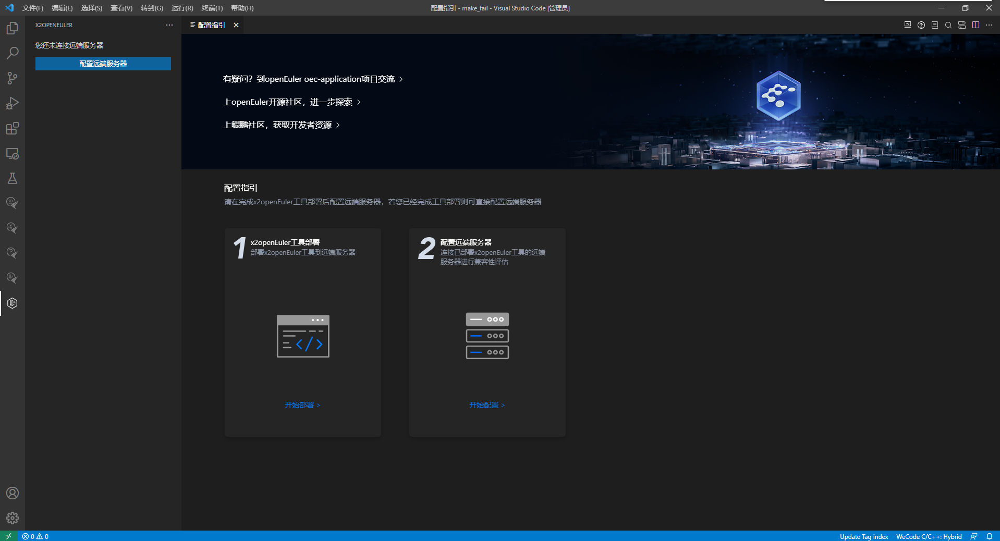

2.  在工具部署界面，配置工具部署参数进行x2openEuler工具安装，参数描述如[表7](#table689465815346)。

    **图 2**  工具部署界面<a id="fig136096478334"></a>  
    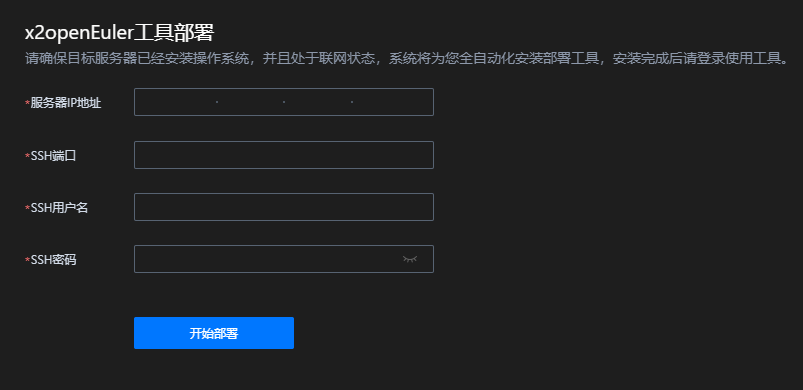

    **表 7**  配置工具部署参数说明

    <a id="table689465815346"></a>
    <table><thead align="left"><tr id="row1789445813411"><th class="cellrowborder" valign="top" width="24.08%" id="mcps1.2.3.1.1"><p id="p2894195820342"><a name="p2894195820342"></a><a name="p2894195820342"></a>参数</p>
    </th>
    <th class="cellrowborder" valign="top" width="75.92%" id="mcps1.2.3.1.2"><p id="p68943582343"><a name="p68943582343"></a><a name="p68943582343"></a>说明</p>
    </th>
    </tr>
    </thead>
    <tbody><tr id="row1289405863417"><td class="cellrowborder" valign="top" width="24.08%" headers="mcps1.2.3.1.1 "><p id="p689413585348"><a name="p689413585348"></a><a name="p689413585348"></a>服务器IP地址</p>
    </td>
    <td class="cellrowborder" valign="top" width="75.92%" headers="mcps1.2.3.1.2 "><p id="p289475810348"><a name="p289475810348"></a><a name="p289475810348"></a>部署x2openEuler工具的目标服务器IP地址。</p>
    </td>
    </tr>
    <tr id="row6894558123415"><td class="cellrowborder" valign="top" width="24.08%" headers="mcps1.2.3.1.1 "><p id="p178943589343"><a name="p178943589343"></a><a name="p178943589343"></a>SSH端口</p>
    </td>
    <td class="cellrowborder" valign="top" width="75.92%" headers="mcps1.2.3.1.2 "><p id="p7894115819349"><a name="p7894115819349"></a><a name="p7894115819349"></a>登录至目标服务器的SSH端口，默认为22。</p>
    </td>
    </tr>
    <tr id="row20894135820344"><td class="cellrowborder" valign="top" width="24.08%" headers="mcps1.2.3.1.1 "><p id="p148943583346"><a name="p148943583346"></a><a name="p148943583346"></a>SSH用户名</p>
    </td>
    <td class="cellrowborder" valign="top" width="75.92%" headers="mcps1.2.3.1.2 "><p id="p7894125803420"><a name="p7894125803420"></a><a name="p7894125803420"></a>部署x2openEuler工具需要以root用户登录至目标服务器进行安装，该参数应为root用户。</p>
    <div class="note" id="note1866716712453"><a name="note1866716712453"></a><a name="note1866716712453"></a><span class="notetitle"> 说明： </span><div class="notebody"><p id="p2066710754518"><a name="p2066710754518"></a><a name="p2066710754518"></a>由于root用户拥有极高的权限，建议您在完成工具部署后，配置禁止root用户SSH登录，以保证运行环境安全。</p>
    </div></div>
    </td>
    </tr>
    <tr id="row08941158173419"><td class="cellrowborder" valign="top" width="24.08%" headers="mcps1.2.3.1.1 "><p id="p11894135843416"><a name="p11894135843416"></a><a name="p11894135843416"></a>SSH密码</p>
    </td>
    <td class="cellrowborder" valign="top" width="75.92%" headers="mcps1.2.3.1.2 "><p id="p6894558103415"><a name="p6894558103415"></a><a name="p6894558103415"></a>登录至目标服务器进行工具部署的root用户密码。</p>
    </td>
    </tr>
    </tbody>
    </table>

3.  单击“开始部署“后，进入“安装前准备“界面。设置x2openEuler用户密码，若目标服务器未联网则需上传x2openEuler软件安装包。单击“下一步“进行工具部署。

    **图 3**  安装前准备<a id="fig05381329135314"></a>  
    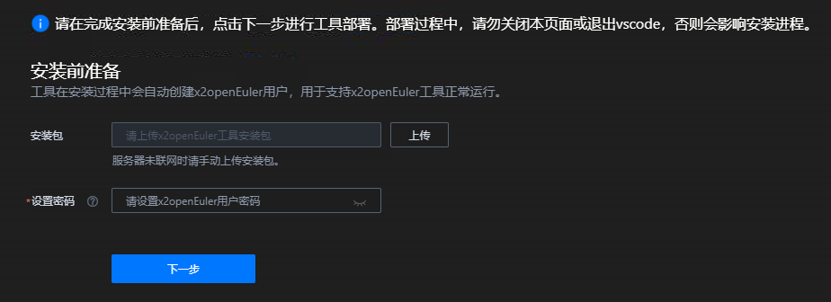

    > **说明：** 
    >设置的密码需要满足如下复杂度要求：
    >-   密码长度为8\~32个字符
    >-   必须包含大写字母、小写字母、数字、特殊字符（\`\~!@\#$%^&\*\(\)-\_=+\\|\[\{\}\];:'",<.\>/?）中的两种及以上类型的组合
    >-   密码不能包含空格
    >-   密码不能是用户名

4.  工具部署安装完成后，界面会提示“x2openEuler工具部署成功“，可单击“配置远端服务器“，参考[配置远端服务器](#配置远端服务器)进行配置。若工具部署失败，请参考VS Code底部输出框信息重新进行工具部署。


#### 验证

##### 验证安装的插件模式

登录x2openEuler插件界面，详细步骤请参见[通过插件使用x2openEuler工具](#通过插件使用x2openeuler工具)，能够成功登录说明x2openEuler工具安装成功。

##### 验证安装的CLI模式

1.  使用SSH远程登录工具，以任意用户进入CentOS操作系统命令行界面。
2.  执行以下命令，切换至x2openEuler用户。

    ```
    su - x2openEuler
    ```

3.  执行如下命令查看版本信息。

    ```
    x2openEuler -v
    ```

    显示如下格式内容说明安装成功（其中“x.x.x”表示版本号，请以实际情况为准）。

    ```
    x2openEuler x.x.x
    ```
#### 卸载
##### 前提条件<a name="zh-cn_topic_0000001115258840_zh-cn_topic_0228242372_zh-cn_topic_0190602892_section19751229183511"></a>

没有正在运行中的任务。

##### 操作步骤<a name="zh-cn_topic_0000001115258840_zh-cn_topic_0228242372_zh-cn_topic_0190602892_section1963172611259"></a>

1.  使用SSH远程登录工具，以root用户进入操作系统命令行界面。
2.  执行如下命令卸载x2openEuler工具。

    **rpm -e x2openEuler**

    > **说明：** 
    >-   当用户执行卸载命令时，如果有正在运行的任务，用户需要先终止或等待运行的任务结束。若用户仍选择卸载，当前运行的任务会直接中断。
    >-   卸载完成后，需手动移除x2openEuler用户，以保证系统环境安全。


### 安装x2openEuler插件

#### 环境要求

当前版本已在如下操作系统上验证：

-   Windows 10
-   macOS 10.0 x86
-   macOS 10.0 ARM

#### 安装方式
> **说明：** 
>该插件兼容VS Code最新版本。


##### 在Visual Studio Code应用商店安装x2openEuler插件

在Visual Studio Code扩展菜单中搜索“x2openEuler”，单击“安装”。（或在Visual Studio Code应用商店中安装）。<br>
安装完成后，在左侧菜单栏中单击打开x2openEuler工具。

## 特性指南

> **须知：** 
>-   用户在登录服务器后长时间处于空置状态，可能会存在安全风险。建议您在服务器中[配置超时机制](#配置超时机制)，以提升系统安全性。
>-   不建议多个客户端同时操作同一远端服务器上的x2openEuler工具。
>-   不同客户端在同一远端服务器上传相同文件名称的文件时，会导致先上传的文件被覆盖。

### 通过插件使用x2openEuler工具
 
#### 配置远端服务器

##### 前提条件

已成功安装x2openEuler工具和x2openEuler插件。

##### 操作步骤

1.  在VS Code左侧菜单栏，单击打开x2openEuler插件。
2.  在VS Code左侧侧边栏，单击“配置远端服务器”，打开如[图1](#zh-cn_topic_0303172996_zh-cn_topic_0301201532_fig15306105118267)所示界面，参数描述如[表8](#zh-cn_topic_0303172992_zh-cn_topic_0301071780_table1357716326151)所示。

    **图 4**  配置远端服务器<a id="zh-cn_topic_0303172996_zh-cn_topic_0301201532_fig15306105118267"></a>  
    

    **表 8**  配置远端服务器参数说明

    <a id="zh-cn_topic_0303172992_zh-cn_topic_0301071780_table1357716326151"></a>
    <table><thead align="left"><tr id="zh-cn_topic_0303172992_zh-cn_topic_0301071780_row205771932111515"><th class="cellrowborder" valign="top" width="24%" id="mcps1.2.3.1.1"><p id="zh-cn_topic_0303172992_zh-cn_topic_0301071780_p1357713241519"><a name="zh-cn_topic_0303172992_zh-cn_topic_0301071780_p1357713241519"></a><a name="zh-cn_topic_0303172992_zh-cn_topic_0301071780_p1357713241519"></a>参数</p>
    </th>
    <th class="cellrowborder" valign="top" width="76%" id="mcps1.2.3.1.2"><p id="zh-cn_topic_0303172992_zh-cn_topic_0301071780_p0577232191520"><a name="zh-cn_topic_0303172992_zh-cn_topic_0301071780_p0577232191520"></a><a name="zh-cn_topic_0303172992_zh-cn_topic_0301071780_p0577232191520"></a>说明</p>
    </th>
    </tr>
    </thead>
    <tbody><tr id="zh-cn_topic_0303172992_zh-cn_topic_0301071780_row25781532161513"><td class="cellrowborder" valign="top" width="24%" headers="mcps1.2.3.1.1 "><p id="zh-cn_topic_0303172992_zh-cn_topic_0301071780_p55781932131514"><a name="zh-cn_topic_0303172992_zh-cn_topic_0301071780_p55781932131514"></a><a name="zh-cn_topic_0303172992_zh-cn_topic_0301071780_p55781932131514"></a>服务器IP地址</p>
    </td>
    <td class="cellrowborder" valign="top" width="76%" headers="mcps1.2.3.1.2 "><p id="zh-cn_topic_0303172992_zh-cn_topic_0301071780_p12578732141510"><a name="zh-cn_topic_0303172992_zh-cn_topic_0301071780_p12578732141510"></a><a name="zh-cn_topic_0303172992_zh-cn_topic_0301071780_p12578732141510"></a>成功部署x2openEuler工具的远端服务器IP地址。</p>
    </td>
    </tr>
    <tr id="zh-cn_topic_0303172992_zh-cn_topic_0301071780_row957814326154"><td class="cellrowborder" valign="top" width="24%" headers="mcps1.2.3.1.1 "><p id="zh-cn_topic_0303172992_zh-cn_topic_0301071780_p1257883211520"><a name="zh-cn_topic_0303172992_zh-cn_topic_0301071780_p1257883211520"></a><a name="zh-cn_topic_0303172992_zh-cn_topic_0301071780_p1257883211520"></a>SSH端口</p>
    </td>
    <td class="cellrowborder" valign="top" width="76%" headers="mcps1.2.3.1.2 "><p id="zh-cn_topic_0303172992_zh-cn_topic_0301071780_p191432022192511"><a name="zh-cn_topic_0303172992_zh-cn_topic_0301071780_p191432022192511"></a><a name="zh-cn_topic_0303172992_zh-cn_topic_0301071780_p191432022192511"></a>工具安装过程中设置的SSH端口。</p>
    <div class="note" id="zh-cn_topic_0303172992_zh-cn_topic_0301071780_note17100172632511"><a name="zh-cn_topic_0303172992_zh-cn_topic_0301071780_note17100172632511"></a><a name="zh-cn_topic_0303172992_zh-cn_topic_0301071780_note17100172632511"></a><span class="notetitle"> 说明： </span><div class="notebody"><p id="zh-cn_topic_0303172992_zh-cn_topic_0301071780_p1510072642512"><a name="zh-cn_topic_0303172992_zh-cn_topic_0301071780_p1510072642512"></a><a name="zh-cn_topic_0303172992_zh-cn_topic_0301071780_p1510072642512"></a>如果服务器已开通防火墙，使用x2openEuler工具前请确认服务器OS防火墙已开通SSH端口（默认为22）。</p>
    </div></div>
    </td>
    </tr>
    <tr id="zh-cn_topic_0303172992_row82481366213"><td class="cellrowborder" valign="top" width="24%" headers="mcps1.2.3.1.1 "><p id="p8722101917387"><a name="p8722101917387"></a><a name="p8722101917387"></a>SSH用户名</p>
    </td>
    <td class="cellrowborder" valign="top" width="76%" headers="mcps1.2.3.1.2 "><p id="p317810436378"><a name="p317810436378"></a><a name="p317810436378"></a>工具安装过程中设置的SSH用户名（x2openEuler）。</p>
    </td>
    </tr>
    <tr id="row12312324113819"><td class="cellrowborder" valign="top" width="24%" headers="mcps1.2.3.1.1 "><p id="p331292416389"><a name="p331292416389"></a><a name="p331292416389"></a>SSH密码</p>
    </td>
    <td class="cellrowborder" valign="top" width="76%" headers="mcps1.2.3.1.2 "><p id="p203128247387"><a name="p203128247387"></a><a name="p203128247387"></a>工具安装过程中设置的SSH密码（x2openEuler用户密码）。</p>
    </td>
    </tr>
    </tbody>
    </table>

3.  根据实际环境输入各参数值，单击“开始配置“。

    配置成功后，进入“x2openEuler向导“界面，如[图5](#zh-cn_topic_0303172996_zh-cn_topic_0301201532_fig162740213572)所示。在“x2openEuler向导“中可立即创建评估任务。

    **图 5**  x2openEuler向导<a id="zh-cn_topic_0303172996_zh-cn_topic_0301201532_fig162740213572"></a>  
    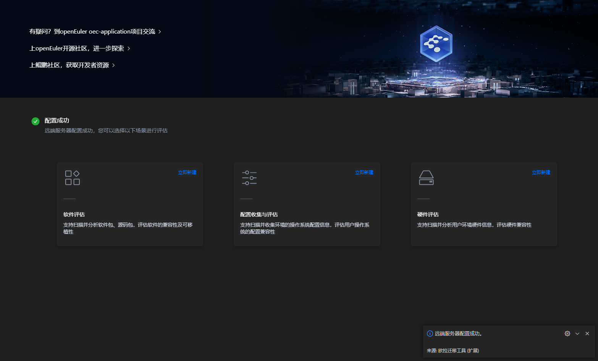

#### 远端服务器管理

##### 前提条件

-   已成功安装x2openEuler插件。
-   已完成配置远端服务器。

##### 操作步骤

1.  在VS Code左侧侧边栏选中“远端服务器管理“，单击进行[配置远端服务器](#配置远端服务器)。

    **图 6**  远端服务器管理<a id="fig6482251121820"></a>  
    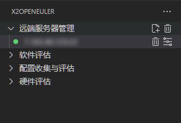

2.  在VS Code左侧侧边栏选择“远端服务器管理“，单击清空服务器记录。在右下角弹出框中，选择“确定“清空服务器记录。

    **图 7**  清空服务器记录<a id="fig5228134851419"></a>  
    

3.  在VS Code左侧侧边栏选择“远端服务器管理“，单击展开服务器记录列表。选中任意服务器记录，可单击进行删除服务器记录，单击进行编辑服务器。

#### 软件评估

##### 特性描述

软件迁移评估帮助用户完成从CentOS 7.6（CentOS 8.2、CentOS 6.8）向openEuler 20.03 LTS SP1系统的迁移评估。

##### 特性操作

###### 前提条件

已安装x2openEuler插件并配置远端服务器成功。

已完成x2openEuler工具部署。

###### 操作步骤

1.  在页面左侧，选择“软件评估”，点击创建任务。
2.  在创建分析任务区选择“单应用“或“多应用“，并对以下参数进行配置。

    > **说明：** 
    >“单应用“和“多应用“相互独立，可根据实际需求选择其中的一个。

    **图 8**  创建软件评估任务<a id="zh-cn_topic_0303172996_zh-cn_topic_0301201532_fig15306105118267"></a>  
    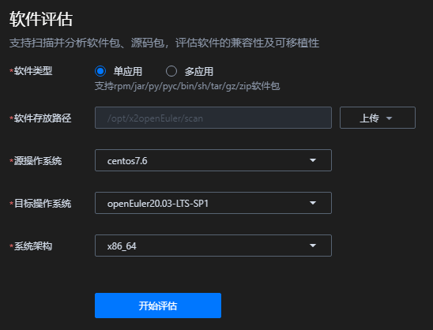

    **表 9**  创建软件评估参数项说明

    <a id="zh-cn_topic_0303172996_zh-cn_topic_0301201532_table1342162861919"></a>
    <table><thead align="left"><tr id="zh-cn_topic_0303172996_zh-cn_topic_0301201532_row1342122820197"><th class="cellrowborder" valign="top" width="25.81%" id="mcps1.2.3.1.1"><p id="zh-cn_topic_0303172996_zh-cn_topic_0301201532_p53433283196"><a name="zh-cn_topic_0303172996_zh-cn_topic_0301201532_p53433283196"></a><a name="zh-cn_topic_0303172996_zh-cn_topic_0301201532_p53433283196"></a>参数</p>
    </th>
    <th class="cellrowborder" valign="top" width="74.19%" id="mcps1.2.3.1.2"><p id="zh-cn_topic_0303172996_zh-cn_topic_0301201532_p1634342821915"><a name="zh-cn_topic_0303172996_zh-cn_topic_0301201532_p1634342821915"></a><a name="zh-cn_topic_0303172996_zh-cn_topic_0301201532_p1634342821915"></a>说明</p>
    </th>
    </tr>
    </thead>
    <tbody><tr id="zh-cn_topic_0303172996_zh-cn_topic_0301201532_row113435282199"><td class="cellrowborder" valign="top" width="25.81%" headers="mcps1.2.3.1.1 "><p id="zh-cn_topic_0303172996_zh-cn_topic_0301201532_p133431628131916"><a name="zh-cn_topic_0303172996_zh-cn_topic_0301201532_p133431628131916"></a><a name="zh-cn_topic_0303172996_zh-cn_topic_0301201532_p133431628131916"></a>软件类型</p>
    </td>
    <td class="cellrowborder" valign="top" width="74.19%" headers="mcps1.2.3.1.2 "><a name="ul17227257459"></a><a name="ul17227257459"></a><ul id="ul17227257459"><li>单应用：支持rpm/tar/zip/gzip/jar/py/pyc/sh/bin软件包。</li><li>多应用：支持对同一目录下的多个bin文件进行评估分析，并对每个bin文件产生评估报告。</li></ul>
    </td>
    </tr>
    <tr id="zh-cn_topic_0303172996_zh-cn_topic_0301201532_row1352711322206"><td class="cellrowborder" valign="top" width="25.81%" headers="mcps1.2.3.1.1 "><p id="zh-cn_topic_0303172996_zh-cn_topic_0301201532_p125272032152011"><a name="zh-cn_topic_0303172996_zh-cn_topic_0301201532_p125272032152011"></a><a name="zh-cn_topic_0303172996_zh-cn_topic_0301201532_p125272032152011"></a>软件存放路径</p>
    </td>
    <td class="cellrowborder" valign="top" width="74.19%" headers="mcps1.2.3.1.2 "><p id="zh-cn_topic_0303172996_zh-cn_topic_0301201532_p052720327206"><a name="zh-cn_topic_0303172996_zh-cn_topic_0301201532_p052720327206"></a><a name="zh-cn_topic_0303172996_zh-cn_topic_0301201532_p052720327206"></a>单击“上传”按钮上传软件包。</p>
    <div class="note" id="zh-cn_topic_0303172996_zh-cn_topic_0301201532_note8722162652217"><a name="zh-cn_topic_0303172996_zh-cn_topic_0301201532_note8722162652217"></a><a name="zh-cn_topic_0303172996_zh-cn_topic_0301201532_note8722162652217"></a><span class="notetitle"> 说明： </span><div class="notebody"><a name="zh-cn_topic_0303172996_zh-cn_topic_0284246214_ul01971525134213"></a><a name="zh-cn_topic_0303172996_zh-cn_topic_0284246214_ul01971525134213"></a><ul id="zh-cn_topic_0303172996_zh-cn_topic_0284246214_ul01971525134213"><li>多应用下只能上传包含多个bin文件的文件夹。</li><li>只允许同时上传一个软件包，软件包小于或等于2GB，且解压后小于或等于剩余磁盘空间的一半。</li><li>软件包支持rpm/tar/zip/gzip/jar/py/pyc/sh/bin类型。</li></ul>
    </div></div>
    </td>
    </tr>
    <tr id="zh-cn_topic_0303172996_zh-cn_topic_0301201532_row143431228141912"><td class="cellrowborder" valign="top" width="25.81%" headers="mcps1.2.3.1.1 "><p id="zh-cn_topic_0303172996_zh-cn_topic_0301201532_p5343112851919"><a name="zh-cn_topic_0303172996_zh-cn_topic_0301201532_p5343112851919"></a><a name="zh-cn_topic_0303172996_zh-cn_topic_0301201532_p5343112851919"></a>源操作系统</p>
    </td>
    <td class="cellrowborder" valign="top" width="74.19%" headers="mcps1.2.3.1.2 "><p id="zh-cn_topic_0303172996_zh-cn_topic_0301201532_p15343192813190"><a name="zh-cn_topic_0303172996_zh-cn_topic_0301201532_p15343192813190"></a><a name="zh-cn_topic_0303172996_zh-cn_topic_0301201532_p15343192813190"></a>选择目标系统版本。可选择：</p>
    <a name="ul1360149175511"></a><a name="ul1360149175511"></a><ul id="ul1360149175511"><li>CentOS 6.8</li><li>CentOS 7.6</li><li>CentOS 8.2</li></ul>
    </td>
    </tr>
    <tr id="zh-cn_topic_0303172996_zh-cn_topic_0301201532_row163441028151920"><td class="cellrowborder" valign="top" width="25.81%" headers="mcps1.2.3.1.1 "><p id="zh-cn_topic_0303172996_zh-cn_topic_0301201532_p93441628191913"><a name="zh-cn_topic_0303172996_zh-cn_topic_0301201532_p93441628191913"></a><a name="zh-cn_topic_0303172996_zh-cn_topic_0301201532_p93441628191913"></a>目标系统</p>
    </td>
    <td class="cellrowborder" valign="top" width="74.19%" headers="mcps1.2.3.1.2 "><p id="zh-cn_topic_0303172996_zh-cn_topic_0301201532_p1434432815197"><a name="zh-cn_topic_0303172996_zh-cn_topic_0301201532_p1434432815197"></a><a name="zh-cn_topic_0303172996_zh-cn_topic_0301201532_p1434432815197"></a>选择目标系统版本。可选择：</p>
    <p id="p7533121420569"><a name="p7533121420569"></a><a name="p7533121420569"></a>openEuler 20.03-LTS-SP1</p>
    </td>
    </tr>
    <tr id="row52112218588"><td class="cellrowborder" valign="top" width="25.81%" headers="mcps1.2.3.1.1 "><p id="p22115221587"><a name="p22115221587"></a><a name="p22115221587"></a>系统架构</p>
    </td>
    <td class="cellrowborder" valign="top" width="74.19%" headers="mcps1.2.3.1.2 "><p id="p92142285818"><a name="p92142285818"></a><a name="p92142285818"></a>选择系统架构。可选择：</p>
    <a name="ul198673985812"></a><a name="ul198673985812"></a><ul id="ul198673985812"><li>x86_64</li><li>aarch64</li></ul>
    </td>
    </tr>
    </tbody>
    </table>

3.  单击“开始评估“，生成评估报告。

    评估完成后，自动跳转至分析报告详情界面，如[图9](#zh-cn_topic_0303172996_fig1916475495217)所示，参数描述如[表10](#zh-cn_topic_0303172996_zh-cn_topic_0301201532_table102746212572)所示。

    > **说明：** 
    >-   用户可在任务进行过程中单击“取消评估“，取消评估任务。
    >-   用户可以在历史报告的列表中，单击指定分析任务的报告名称查看分析报告。
    >-   分析报告的名称为扫描的软件包名称和生成报告的时间组合。

    **图 9**  软件评估报告结果<a id="zh-cn_topic_0303172996_fig1916475495217"></a>  
    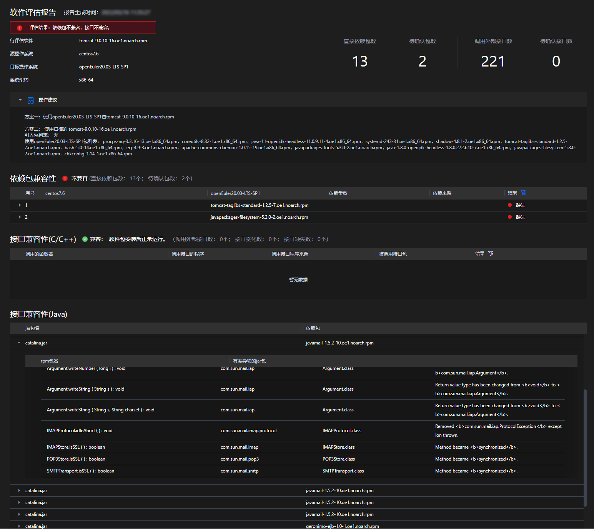

    **表 10**  软件评估报告结果参数说明

    <a id="zh-cn_topic_0303172996_zh-cn_topic_0301201532_table102746212572"></a>
    <table><thead align="left"><tr id="zh-cn_topic_0303172996_zh-cn_topic_0284251757_row171675241281"><th class="cellrowborder" valign="top" width="24.09%" id="mcps1.2.3.1.1"><p id="zh-cn_topic_0303172996_zh-cn_topic_0284251757_p1316713247285"><a name="zh-cn_topic_0303172996_zh-cn_topic_0284251757_p1316713247285"></a><a name="zh-cn_topic_0303172996_zh-cn_topic_0284251757_p1316713247285"></a>参数</p>
    </th>
    <th class="cellrowborder" valign="top" width="75.91%" id="mcps1.2.3.1.2"><p id="zh-cn_topic_0303172996_zh-cn_topic_0284251757_p10167132422819"><a name="zh-cn_topic_0303172996_zh-cn_topic_0284251757_p10167132422819"></a><a name="zh-cn_topic_0303172996_zh-cn_topic_0284251757_p10167132422819"></a>说明</p>
    </th>
    </tr>
    </thead>
    <tbody><tr id="zh-cn_topic_0303172996_zh-cn_topic_0284251757_row8321944141610"><td class="cellrowborder" valign="top" width="24.09%" headers="mcps1.2.3.1.1 "><p id="zh-cn_topic_0303172996_zh-cn_topic_0284251757_p19321044131618"><a name="zh-cn_topic_0303172996_zh-cn_topic_0284251757_p19321044131618"></a><a name="zh-cn_topic_0303172996_zh-cn_topic_0284251757_p19321044131618"></a>评估结果</p>
    </td>
    <td class="cellrowborder" valign="top" width="75.91%" headers="mcps1.2.3.1.2 "><p id="zh-cn_topic_0303172996_zh-cn_topic_0284251757_p1232194421610"><a name="zh-cn_topic_0303172996_zh-cn_topic_0284251757_p1232194421610"></a><a name="zh-cn_topic_0303172996_zh-cn_topic_0284251757_p1232194421610"></a>显示评估软件名称、源操作系统、目标操作系统、系统架构以及评估结果等评估任务信息。</p>
    </td>
    </tr>
    <tr id="row199271743191916"><td class="cellrowborder" valign="top" width="24.09%" headers="mcps1.2.3.1.1 "><p id="p17928943151914"><a name="p17928943151914"></a><a name="p17928943151914"></a>操作建议</p>
    </td>
    <td class="cellrowborder" valign="top" width="75.91%" headers="mcps1.2.3.1.2 "><p id="p102412211204"><a name="p102412211204"></a><a name="p102412211204"></a>依据评估报告中的兼容性结果，提供对应解决方案建议。</p>
    </td>
    </tr>
    <tr id="zh-cn_topic_0303172996_zh-cn_topic_0284251757_row4141183071214"><td class="cellrowborder" valign="top" width="24.09%" headers="mcps1.2.3.1.1 "><p id="zh-cn_topic_0303172996_zh-cn_topic_0284251757_p1514418300123"><a name="zh-cn_topic_0303172996_zh-cn_topic_0284251757_p1514418300123"></a><a name="zh-cn_topic_0303172996_zh-cn_topic_0284251757_p1514418300123"></a>依赖包兼容性</p>
    </td>
    <td class="cellrowborder" valign="top" width="75.91%" headers="mcps1.2.3.1.2 "><p id="zh-cn_topic_0303172996_zh-cn_topic_0284251757_p1972516235213"><a name="zh-cn_topic_0303172996_zh-cn_topic_0284251757_p1972516235213"></a><a name="zh-cn_topic_0303172996_zh-cn_topic_0284251757_p1972516235213"></a>显示软件安装所需要的直接依赖以及依赖文件在各个系统上对应的rpm包。</p>
    <a name="ul128786216505"></a><a name="ul128786216505"></a><ul id="ul128786216505"><li>若查询到的直接依赖的rpm的名字和版本都一样，会显示<strong id="b158505286164"><a name="b158505286164"></a><a name="b158505286164"></a> 版本未变更</strong></li><li>若查询到的直接依赖的rpm的版本不一样，但接口无差异，会显示 <strong id="b4550174319266"><a name="b4550174319266"></a><a name="b4550174319266"></a>版本有变更</strong></li><li>若查询到的直接依赖的rpm的包名发生变化，但接口无差异，会显示 <strong id="b18719201102816"><a name="b18719201102816"></a><a name="b18719201102816"></a>包名有变更</strong></li><li>若源操作系统查到rpm，目标操作系统没有查到，会显示 <strong id="b8591917122810"><a name="b8591917122810"></a><a name="b8591917122810"></a>缺失</strong></li><li>若源操作系统没有查到rpm，目标操作系统有查到，或者所在包有接口变化则会显示 <strong id="b1323592572814"><a name="b1323592572814"></a><a name="b1323592572814"></a>需要检查</strong></li><li>若源操作系统和目标操作系统都没有查到rpm，则会放到 other 里边，并显示 <strong id="b6143192612919"><a name="b6143192612919"></a><a name="b6143192612919"></a>需要检查</strong></li></ul>
    </td>
    </tr>
    <tr id="row19363134015510"><td class="cellrowborder" valign="top" width="24.09%" headers="mcps1.2.3.1.1 "><p id="p93635405511"><a name="p93635405511"></a><a name="p93635405511"></a>接口兼容性（C/C++）</p>
    </td>
    <td class="cellrowborder" valign="top" width="75.91%" headers="mcps1.2.3.1.2 "><a name="ul17593171015716"></a><a name="ul17593171015716"></a><ul id="ul17593171015716"><li>调用函数名称：表示被评估软件中调用的函数名称。</li><li>调用的接口程序：表示被评估软件中被存在差异的外部接口调用的程序。</li><li>结果：<a name="ul1219994015015"></a><a name="ul1219994015015"></a><ul id="ul1219994015015"><li>已移除：表示缺失的接口。</li><li>已变更：表示函数入参，返回值，或者实现有变化</li></ul>
    </li><li>展开的详细信息中：<a name="ul3678201912312"></a><a name="ul3678201912312"></a><ul id="ul3678201912312"><li>操作系统：表示迁移评估的系统名称。</li><li>函数名：接口表示。</li><li>文件名：表示外部接口所在的文件名。</li><li>依赖包：表示接口所在的外部so库。</li><li>接口差异项：表示外部接口的变化差异，如果是已移除接口，则此项为空。</li></ul>
    </li></ul>
    </td>
    </tr>
    <tr id="row1161611412259"><td class="cellrowborder" valign="top" width="24.09%" headers="mcps1.2.3.1.1 "><p id="p66172452511"><a name="p66172452511"></a><a name="p66172452511"></a>接口兼容性（JDK）</p>
    </td>
    <td class="cellrowborder" valign="top" width="75.91%" headers="mcps1.2.3.1.2 "><p id="p1461718417253"><a name="p1461718417253"></a><a name="p1461718417253"></a>表示扫描Jar包中调用的jdk接口在待迁移的系统上对应满足运行条件的最小jdk上发生的变更。</p>
    <a name="ul180521153612"></a><a name="ul180521153612"></a><ul id="ul180521153612"><li>openEuler jdk：openEuler上满足Jar包运行环境的最小jdk版本。</li><li>对象构建jdk：扫描jar包对应构建的jdk版本。</li><li>jar包名：扫描的jar包名称。</li><li>方法名：存在接口差异的方法名。</li><li>函数调用签名：存在接口差异的方法函数签名。</li><li>包名：存在接口差异的方法所在的包（packageName+className）。</li><li>差异项：接口差异选项。</li></ul>
    </td>
    </tr>
    <tr id="row647911561358"><td class="cellrowborder" valign="top" width="24.09%" headers="mcps1.2.3.1.1 "><p id="p4346301760"><a name="p4346301760"></a><a name="p4346301760"></a>接口兼容性（Java）</p>
    </td>
    <td class="cellrowborder" valign="top" width="75.91%" headers="mcps1.2.3.1.2 "><p id="p1479956654"><a name="p1479956654"></a><a name="p1479956654"></a>Jar接口差异主要描述了当前jar包接口在待迁移的系统上发生的变更。</p>
    <a name="ul118954081110"></a><a name="ul118954081110"></a><ul id="ul118954081110"><li>调用的jar包：表示当前被调用的jar包名称。</li><li>所属的rpm包：表示当前的jar包所属的rpm包。</li><li>展开的详细信息中：<a name="ul1615774151116"></a><a name="ul1615774151116"></a><ul id="ul1615774151116"><li>centos7.6 Methods：表示CentOS 7.6上不兼容的接口名称。</li><li>package：表示不兼容的接口所属的jar包。</li><li>class：表示不兼容的接口所属的类。</li><li>openEuler20.03-LTS-SP1 Change：表示不兼容的接口在openEuler20.03-LTS-SP1上发生的变更，这部分变更描述包含了方法的移除，方法返回参数、方法签名、方法修饰、异常等变更。</li></ul>
    </li></ul>
    </td>
    </tr>
    </tbody>
    </table>

4.  返回创建任务页面，在右侧历史报告中，可进行软件评估报告下载、删除等操作。

    > **说明：** 
    >评估报告存储在运行环境的“/opt/x2openEuler/output/“目录下，从页面历史报告中进行的删除操作不会完全移除评估报告，如需完全移除，请在运行环境中进行删除操作。


#### 配置收集与评估
##### <span id ="information_assessment">特性描述</span>

配置与收集评估功能帮助用户自动识别当前服务器环境架构，同时从用户环境收集配置信息进行评估分析。

##### <span id ="information_assessment_1">特性操作</span>

###### 前提条件

已安装x2openEuler插件并配置远端服务器成功。

已完成x2openEuler工具部署。

###### 操作步骤

1.  在页面左侧，选择“配置收集与评估”，点击创建任务。
2.  在创建分析任务区选择“评估“或“收集“，并对以下参数进行配置。

    > **说明：** 
    >-   “评估“和“收集“相互独立，可根据实际需求选择其中的一个。
    >-   “评估“既能评估当前服务器环境配置信息，也可以通过“外部导入“对其它服务器环境进行分析。

    **图 10**  创建配置收集与评估任务<a id="zh-cn_topic_0303172996_zh-cn_topic_0301201532_fig15306105118267"></a>  
    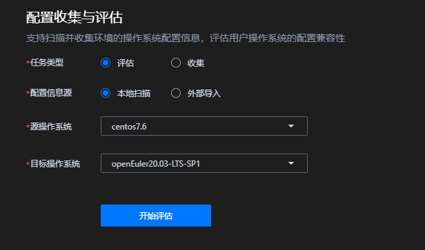

    **表 11**  创建配置收集与评估参数项说明

    <a id="zh-cn_topic_0303172996_zh-cn_topic_0301201532_table1342162861919"></a>
    <table><thead align="left"><tr id="zh-cn_topic_0303172996_zh-cn_topic_0301201532_row1342122820197"><th class="cellrowborder" valign="top" width="25.81%" id="mcps1.2.3.1.1"><p id="zh-cn_topic_0303172996_zh-cn_topic_0301201532_p53433283196"><a name="zh-cn_topic_0303172996_zh-cn_topic_0301201532_p53433283196"></a><a name="zh-cn_topic_0303172996_zh-cn_topic_0301201532_p53433283196"></a>参数</p>
    </th>
    <th class="cellrowborder" valign="top" width="74.19%" id="mcps1.2.3.1.2"><p id="zh-cn_topic_0303172996_zh-cn_topic_0301201532_p1634342821915"><a name="zh-cn_topic_0303172996_zh-cn_topic_0301201532_p1634342821915"></a><a name="zh-cn_topic_0303172996_zh-cn_topic_0301201532_p1634342821915"></a>说明</p>
    </th>
    </tr>
    </thead>
    <tbody><tr id="zh-cn_topic_0303172996_zh-cn_topic_0301201532_row113435282199"><td class="cellrowborder" valign="top" width="25.81%" headers="mcps1.2.3.1.1 "><p id="zh-cn_topic_0303172996_zh-cn_topic_0301201532_p133431628131916"><a name="zh-cn_topic_0303172996_zh-cn_topic_0301201532_p133431628131916"></a><a name="zh-cn_topic_0303172996_zh-cn_topic_0301201532_p133431628131916"></a>任务类型</p>
    </td>
    <td class="cellrowborder" valign="top" width="74.19%" headers="mcps1.2.3.1.2 "><a name="ul17227257459"></a><a name="ul17227257459"></a><ul id="ul17227257459"><li>评估：自动识别当前服务器环境架构及配置信息进行评估。</li><li>收集：对当前服务器配置信息和硬件信息进行收集。</li></ul>
    </td>
    </tr>
    <tr id="zh-cn_topic_0303172996_zh-cn_topic_0301201532_row1352711322206"><td class="cellrowborder" valign="top" width="25.81%" headers="mcps1.2.3.1.1 "><p id="p1232083718193"><a name="p1232083718193"></a><a name="p1232083718193"></a>配置信息源</p>
    </td>
    <td class="cellrowborder" valign="top" width="74.19%" headers="mcps1.2.3.1.2 "><a name="ul9818175261915"></a><a name="ul9818175261915"></a><ul id="ul9818175261915"><li>本地扫描：对当前服务器环境进行配置信息扫描与收集。</li><li>外部导入：上传通过配置与评估中收集的信息，格式为tar.gz。<div class="note" id="note1347151022115"><a name="note1347151022115"></a><a name="note1347151022115"></a><span class="notetitle"> 说明： </span><div class="notebody"><p id="p14350111010218"><a name="p14350111010218"></a><a name="p14350111010218"></a>不支持输入外部配置信息路径。</p>
    </div></div>
    </li></ul>
    </td>
    </tr>
    <tr id="zh-cn_topic_0303172996_zh-cn_topic_0301201532_row143431228141912"><td class="cellrowborder" valign="top" width="25.81%" headers="mcps1.2.3.1.1 "><p id="zh-cn_topic_0303172996_zh-cn_topic_0301201532_p5343112851919"><a name="zh-cn_topic_0303172996_zh-cn_topic_0301201532_p5343112851919"></a><a name="zh-cn_topic_0303172996_zh-cn_topic_0301201532_p5343112851919"></a>源操作系统</p>
    </td>
    <td class="cellrowborder" valign="top" width="74.19%" headers="mcps1.2.3.1.2 "><p id="zh-cn_topic_0303172996_zh-cn_topic_0301201532_p15343192813190"><a name="zh-cn_topic_0303172996_zh-cn_topic_0301201532_p15343192813190"></a><a name="zh-cn_topic_0303172996_zh-cn_topic_0301201532_p15343192813190"></a>选择目标系统版本。可选择：</p>
    <a name="ul1360149175511"></a><a name="ul1360149175511"></a><ul id="ul1360149175511"><li>CentOS 6.8</li><li>CentOS 7.6</li><li>CentOS 8.2</li></ul>
    </td>
    </tr>
    <tr id="zh-cn_topic_0303172996_zh-cn_topic_0301201532_row163441028151920"><td class="cellrowborder" valign="top" width="25.81%" headers="mcps1.2.3.1.1 "><p id="zh-cn_topic_0303172996_zh-cn_topic_0301201532_p93441628191913"><a name="zh-cn_topic_0303172996_zh-cn_topic_0301201532_p93441628191913"></a><a name="zh-cn_topic_0303172996_zh-cn_topic_0301201532_p93441628191913"></a>目标系统</p>
    </td>
    <td class="cellrowborder" valign="top" width="74.19%" headers="mcps1.2.3.1.2 "><p id="zh-cn_topic_0303172996_zh-cn_topic_0301201532_p1434432815197"><a name="zh-cn_topic_0303172996_zh-cn_topic_0301201532_p1434432815197"></a><a name="zh-cn_topic_0303172996_zh-cn_topic_0301201532_p1434432815197"></a>选择目标系统版本。可选择：</p>
    <p id="p7533121420569"><a name="p7533121420569"></a><a name="p7533121420569"></a>openEuler 20.03-LTS-SP1</p>
    </td>
    </tr>
    <tr id="row52112218588"><td class="cellrowborder" valign="top" width="25.81%" headers="mcps1.2.3.1.1 "><p id="p22115221587"><a name="p22115221587"></a><a name="p22115221587"></a>系统架构</p>
    </td>
    <td class="cellrowborder" valign="top" width="74.19%" headers="mcps1.2.3.1.2 "><p id="p92142285818"><a name="p92142285818"></a><a name="p92142285818"></a>选择系统架构。可选择：</p>
    <a name="ul198673985812"></a><a name="ul198673985812"></a><ul id="ul198673985812"><li>x86_64</li><li>aarch64</li></ul>
    </td>
    </tr>
    </tbody>
    </table>

3.  单击“开始评估“，生成评估报告。

    评估完成后，自动跳转至分析报告详情界面，如[图11](#zh-cn_topic_0303172996_fig1916475495217)所示，参数描述如[表12](#zh-cn_topic_0303172996_zh-cn_topic_0301201532_table102746212572)所示。

    > **说明：** 
    >-   用户可在任务进行过程中单击取消评估，取消评估任务。
    >-   用户可以在分析报告的列表中，单击指定分析任务的报告名称查看分析报告。

    **图 11**  配置收集与评估报告结果<a id="zh-cn_topic_0303172996_fig1916475495217"></a>  
    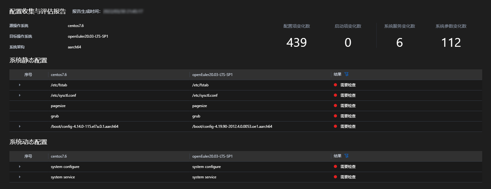

    **表 12**  配置收集与评估报告结果参数说明

    <a id="zh-cn_topic_0303172996_zh-cn_topic_0301201532_table102746212572"></a>
    <table><thead align="left"><tr id="zh-cn_topic_0303172996_zh-cn_topic_0284251757_row171675241281"><th class="cellrowborder" valign="top" width="24.09%" id="mcps1.2.3.1.1"><p id="zh-cn_topic_0303172996_zh-cn_topic_0284251757_p1316713247285"><a name="zh-cn_topic_0303172996_zh-cn_topic_0284251757_p1316713247285"></a><a name="zh-cn_topic_0303172996_zh-cn_topic_0284251757_p1316713247285"></a>参数</p>
    </th>
    <th class="cellrowborder" valign="top" width="75.91%" id="mcps1.2.3.1.2"><p id="zh-cn_topic_0303172996_zh-cn_topic_0284251757_p10167132422819"><a name="zh-cn_topic_0303172996_zh-cn_topic_0284251757_p10167132422819"></a><a name="zh-cn_topic_0303172996_zh-cn_topic_0284251757_p10167132422819"></a>说明</p>
    </th>
    </tr>
    </thead>
    <tbody><tr id="zh-cn_topic_0303172996_zh-cn_topic_0284251757_row8321944141610"><td class="cellrowborder" valign="top" width="24.09%" headers="mcps1.2.3.1.1 "><p id="zh-cn_topic_0303172996_zh-cn_topic_0284251757_p19321044131618"><a name="zh-cn_topic_0303172996_zh-cn_topic_0284251757_p19321044131618"></a><a name="zh-cn_topic_0303172996_zh-cn_topic_0284251757_p19321044131618"></a>评估结果</p>
    </td>
    <td class="cellrowborder" valign="top" width="75.91%" headers="mcps1.2.3.1.2 "><p id="zh-cn_topic_0303172996_zh-cn_topic_0284251757_p1232194421610"><a name="zh-cn_topic_0303172996_zh-cn_topic_0284251757_p1232194421610"></a><a name="zh-cn_topic_0303172996_zh-cn_topic_0284251757_p1232194421610"></a>显示配置评估系统的架构信息和迁移说明。</p>
    </td>
    </tr>
    <tr id="zh-cn_topic_0303172996_zh-cn_topic_0284251757_row4141183071214"><td class="cellrowborder" valign="top" width="24.09%" headers="mcps1.2.3.1.1 "><p id="zh-cn_topic_0303172996_zh-cn_topic_0284251757_p1514418300123"><a name="zh-cn_topic_0303172996_zh-cn_topic_0284251757_p1514418300123"></a><a name="zh-cn_topic_0303172996_zh-cn_topic_0284251757_p1514418300123"></a>系统静态配置</p>
    </td>
    <td class="cellrowborder" valign="top" width="75.91%" headers="mcps1.2.3.1.2 "><p id="p1013323616182"><a name="p1013323616182"></a><a name="p1013323616182"></a>对比五项系统信息：内核配置、内核启动参数、内存页大小、内核参数和挂载参数。</p>
    <div class="note" id="note1015916432513"><a name="note1015916432513"></a><a name="note1015916432513"></a><span class="notetitle"> 说明： </span><div class="notebody"><p id="p161597432519"><a name="p161597432519"></a><a name="p161597432519"></a>若上述对比信息发生变化则结论会显示 <strong id="b78863741715"><a name="b78863741715"></a><a name="b78863741715"></a>需要检查</strong>，需要用户手动查看相应配置信息。若没有发生变化，会显示 <strong id="b14187204018170"><a name="b14187204018170"></a><a name="b14187204018170"></a>未改变</strong>。</p>
    </div></div>
    </td>
    </tr>
    <tr id="row19363134015510"><td class="cellrowborder" valign="top" width="24.09%" headers="mcps1.2.3.1.1 "><p id="p93635405511"><a name="p93635405511"></a><a name="p93635405511"></a>系统动态配置</p>
    </td>
    <td class="cellrowborder" valign="top" width="75.91%" headers="mcps1.2.3.1.2 "><p id="p7363164020515"><a name="p7363164020515"></a><a name="p7363164020515"></a>对比两项系统信息：系统配置和系统服务。</p>
    <div class="note" id="note1746191112253"><a name="note1746191112253"></a><a name="note1746191112253"></a><span class="notetitle"> 说明： </span><div class="notebody"><p id="p8746411172520"><a name="p8746411172520"></a><a name="p8746411172520"></a>若上述对比信息发生变化则结论会显示 需要检查，需要用户手动查看相应配置信息。若没有发生变化，会显示 <strong id="b1049474419173"><a name="b1049474419173"></a><a name="b1049474419173"></a>未改变</strong>。</p>
    </div></div>
    </td>
    </tr>
    </tbody>
    </table>

    返回创建任务页面，在右侧历史报告中，可进行配置评估报告下载、删除等操作。

    > **说明：** 
    >评估报告存储在运行环境的“/opt/x2openEuler/output/“目录下，从页面历史报告中进行的删除操作不会完全移除评估报告，如需完全移除，请在运行环境中进行删除操作。

#### 硬件评估

##### <span id="DeviceConfig">特性描述</span>
硬件评估功能支持用户环境收集硬件信息进行分析评估。

> **说明：** 
>硬件评估任务只能在物理机上进行。

##### <span id="DeviceConfig_1">特性操作</span>
###### 前提条件

已安装x2openEuler插件并配置远端服务器成功。

已完成x2openEuler工具部署。

###### 操作步骤

1.  在页面左侧，选择“硬件评估”，点击创建任务。
2.  在创建分析任务区选择“本地扫描“或“外部导入“，并对以下参数进行配置。

    > **说明：** 
    >-   “本地扫描“和“外部导入“相互独立，可根据实际需求选择其中的一个。
    >-   “硬件评估“建议在物理环境中执行。

    **图 12**  创建硬件评估任务<a id="zh-cn_topic_0303172996_zh-cn_topic_0301201532_fig15306105118267"></a>  
    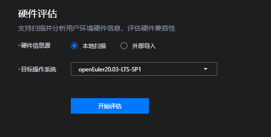

    **表 13**  创建配置收集与评估参数项说明

    <a id="zh-cn_topic_0303172996_zh-cn_topic_0301201532_table1342162861919"></a>
    <table><thead align="left"><tr id="zh-cn_topic_0303172996_zh-cn_topic_0301201532_row1342122820197"><th class="cellrowborder" valign="top" width="25.81%" id="mcps1.2.3.1.1"><p id="zh-cn_topic_0303172996_zh-cn_topic_0301201532_p53433283196"><a name="zh-cn_topic_0303172996_zh-cn_topic_0301201532_p53433283196"></a><a name="zh-cn_topic_0303172996_zh-cn_topic_0301201532_p53433283196"></a>参数</p>
    </th>
    <th class="cellrowborder" valign="top" width="74.19%" id="mcps1.2.3.1.2"><p id="zh-cn_topic_0303172996_zh-cn_topic_0301201532_p1634342821915"><a name="zh-cn_topic_0303172996_zh-cn_topic_0301201532_p1634342821915"></a><a name="zh-cn_topic_0303172996_zh-cn_topic_0301201532_p1634342821915"></a>说明</p>
    </th>
    </tr>
    </thead>
    <tbody><tr id="zh-cn_topic_0303172996_zh-cn_topic_0301201532_row113435282199"><td class="cellrowborder" valign="top" width="25.81%" headers="mcps1.2.3.1.1 "><p id="p20653144143517"><a name="p20653144143517"></a><a name="p20653144143517"></a>硬件信息源</p>
    </td>
    <td class="cellrowborder" valign="top" width="74.19%" headers="mcps1.2.3.1.2 "><a name="ul17227257459"></a><a name="ul17227257459"></a><ul id="ul17227257459"><li>本地扫描：自动扫描收集当前服务器硬件配置信息进行评估。</li><li>外部导入：导入通过配置与评估中收集的信息，格式为tar.gz。<div class="note" id="note1347151022115"><a name="note1347151022115"></a><a name="note1347151022115"></a><span class="notetitle"> 说明： </span><div class="notebody"><p id="p14350111010218"><a name="p14350111010218"></a><a name="p14350111010218"></a>不支持输入外部硬件信息路径。</p>
    </div></div>
    </li></ul>
    </td>
    </tr>
    <tr id="zh-cn_topic_0303172996_zh-cn_topic_0301201532_row163441028151920"><td class="cellrowborder" valign="top" width="25.81%" headers="mcps1.2.3.1.1 "><p id="zh-cn_topic_0303172996_zh-cn_topic_0301201532_p93441628191913"><a name="zh-cn_topic_0303172996_zh-cn_topic_0301201532_p93441628191913"></a><a name="zh-cn_topic_0303172996_zh-cn_topic_0301201532_p93441628191913"></a>目标操作系统</p>
    </td>
    <td class="cellrowborder" valign="top" width="74.19%" headers="mcps1.2.3.1.2 "><p id="zh-cn_topic_0303172996_zh-cn_topic_0301201532_p1434432815197"><a name="zh-cn_topic_0303172996_zh-cn_topic_0301201532_p1434432815197"></a><a name="zh-cn_topic_0303172996_zh-cn_topic_0301201532_p1434432815197"></a>选择目标系统版本。可选择：</p>
    <p id="p7533121420569"><a name="p7533121420569"></a><a name="p7533121420569"></a>openEuler20.03-LTS-SP1</p>
    </td>
    </tr>
    </tbody>
    </table>

3.  单击“开始评估“，生成评估报告。

    评估完成后，自动跳转至分析报告详情界面，如[图13](#zh-cn_topic_0303172996_fig1916475495217)所示，参数描述如[表14](#zh-cn_topic_0303172996_zh-cn_topic_0301201532_table102746212572)所示。

    > **说明：** 
    >-   用户可在任务进行过程中单击取消评估，取消评估任务。
    >-   用户可以在分析报告的列表中，单击指定分析任务的报告名称查看分析报告。

    **图 13**  硬件评估报告结果<a id="zh-cn_topic_0303172996_fig1916475495217"></a>  
    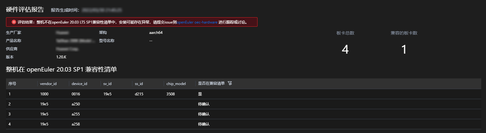

    **表 14**  硬件评估报告结果参数说明

    <a id="zh-cn_topic_0303172996_zh-cn_topic_0301201532_table102746212572"></a>
    <table><thead align="left"><tr id="zh-cn_topic_0303172996_zh-cn_topic_0284251757_row171675241281"><th class="cellrowborder" valign="top" width="24.09%" id="mcps1.2.3.1.1"><p id="zh-cn_topic_0303172996_zh-cn_topic_0284251757_p1316713247285"><a name="zh-cn_topic_0303172996_zh-cn_topic_0284251757_p1316713247285"></a><a name="zh-cn_topic_0303172996_zh-cn_topic_0284251757_p1316713247285"></a>参数</p>
    </th>
    <th class="cellrowborder" valign="top" width="75.91%" id="mcps1.2.3.1.2"><p id="zh-cn_topic_0303172996_zh-cn_topic_0284251757_p10167132422819"><a name="zh-cn_topic_0303172996_zh-cn_topic_0284251757_p10167132422819"></a><a name="zh-cn_topic_0303172996_zh-cn_topic_0284251757_p10167132422819"></a>说明</p>
    </th>
    </tr>
    </thead>
    <tbody><tr id="zh-cn_topic_0303172996_zh-cn_topic_0284251757_row8321944141610"><td class="cellrowborder" valign="top" width="24.09%" headers="mcps1.2.3.1.1 "><p id="zh-cn_topic_0303172996_zh-cn_topic_0284251757_p19321044131618"><a name="zh-cn_topic_0303172996_zh-cn_topic_0284251757_p19321044131618"></a><a name="zh-cn_topic_0303172996_zh-cn_topic_0284251757_p19321044131618"></a>评估结果</p>
    </td>
    <td class="cellrowborder" valign="top" width="75.91%" headers="mcps1.2.3.1.2 "><p id="zh-cn_topic_0303172996_zh-cn_topic_0284251757_p1232194421610"><a name="zh-cn_topic_0303172996_zh-cn_topic_0284251757_p1232194421610"></a><a name="zh-cn_topic_0303172996_zh-cn_topic_0284251757_p1232194421610"></a>显示评估环境中的系统、基本系统、CPU以及整机兼容性信息。</p>
    </td>
    </tr>
    <tr id="zh-cn_topic_0303172996_zh-cn_topic_0284251757_row4141183071214"><td class="cellrowborder" valign="top" width="24.09%" headers="mcps1.2.3.1.1 "><p id="zh-cn_topic_0303172996_zh-cn_topic_0284251757_p1514418300123"><a name="zh-cn_topic_0303172996_zh-cn_topic_0284251757_p1514418300123"></a><a name="zh-cn_topic_0303172996_zh-cn_topic_0284251757_p1514418300123"></a>板卡在openEuler 20.03 LTS SP1 兼容性清单</p>
    </td>
    <td class="cellrowborder" valign="top" width="75.91%" headers="mcps1.2.3.1.2 "><p id="p2014862381310"><a name="p2014862381310"></a><a name="p2014862381310"></a>板卡兼容必须满足 vendorID、deviceID、svID、 ssID 与已有板卡清单列表中的信息都保持一致才算兼容。若对比字段信息不完全一致，则属于待确认板卡。</p>
    </td>
    </tr>
    </tbody>
    </table>

    返回创建任务页面，在右侧历史报告中，可进行硬件评估报告下载、删除等操作。

    > **说明：** 
    >评估报告存储在运行环境的“/opt/x2openEuler/output/“目录下，从页面历史报告中进行的删除操作不会完全移除评估报告，如需完全移除，请在运行环境中进行删除操作。

### 通过CLI使用x2openEuler工具
#### <span id="SoftwareEvaluation">软件评估</span>

##### <span id="SoftwareEvaluation_1">特性描述</span>

软件迁移评估帮助用户完成从CentOS 7.6（CentOS 8.2、CentOS 6.8）向openEuler 20.03 LTS SP1系统的迁移评估。

##### <span id="SoftwareEvaluation_2">特性操作</span>
  

###### 通过CLI命令进行应用包扫描

前提条件

> **须知：** 
>x2openEuler工具仅支持在x2openEuler用户下使用，使用前请务必切换用户为x2openEuler用户，同时建议将工作目录切换为x2openEuler用户的家目录。

使用SSH远程登录工具以x2openEuler用户登录。

命令功能

对单应用或多应用进行扫描分析，评估应用从源操作系统迁移至目标操作系统的可行性。

命令格式

```
x2openEuler scan [-arch ARCH] [-os_name OS_NAME] [-target_os_name TARGET_OS_NAME] {filename | directoryname}
x2openEuler scan -batch [-arch ARCH] [-os_name OS_NAME] [-target_os_name TARGET_OS_NAME] directoryname
```

参数说明

**表 15**  参数说明

<a id="table421011513314"></a>
<table><thead align="left"><tr id="row1621012510312"><th class="cellrowborder" valign="top" width="15.261526152615263%" id="mcps1.2.4.1.1"><p id="p15210858312"><a name="p15210858312"></a><a name="p15210858312"></a>命令</p>
</th>
<th class="cellrowborder" valign="top" width="21.81218121812181%" id="mcps1.2.4.1.2"><p id="p132108516313"><a name="p132108516313"></a><a name="p132108516313"></a>参数选项</p>
</th>
<th class="cellrowborder" valign="top" width="62.926292629262925%" id="mcps1.2.4.1.3"><p id="p22102056316"><a name="p22102056316"></a><a name="p22102056316"></a>说明</p>
</th>
</tr>
</thead>
<tbody><tr id="row330238104613"><td class="cellrowborder" valign="top" width="15.261526152615263%" headers="mcps1.2.4.1.1 "><p id="p16301538184620"><a name="p16301538184620"></a><a name="p16301538184620"></a>-batch</p>
</td>
<td class="cellrowborder" valign="top" width="21.81218121812181%" headers="mcps1.2.4.1.2 "><p id="p83023810462"><a name="p83023810462"></a><a name="p83023810462"></a>-</p>
</td>
<td class="cellrowborder" valign="top" width="62.926292629262925%" headers="mcps1.2.4.1.3 "><p id="p530538174613"><a name="p530538174613"></a><a name="p530538174613"></a>多应用场景，若无此参数，表示单应用场景。</p>
</td>
</tr>
<tr id="row62101551332"><td class="cellrowborder" valign="top" width="15.261526152615263%" headers="mcps1.2.4.1.1 "><p id="p62103516318"><a name="p62103516318"></a><a name="p62103516318"></a>-arch</p>
</td>
<td class="cellrowborder" valign="top" width="21.81218121812181%" headers="mcps1.2.4.1.2 "><p id="p202321225102811"><a name="p202321225102811"></a><a name="p202321225102811"></a><em id="i112431328285"><a name="i112431328285"></a><a name="i112431328285"></a>ARCH</em></p>
</td>
<td class="cellrowborder" valign="top" width="62.926292629262925%" headers="mcps1.2.4.1.3 "><p id="p91841624162717"><a name="p91841624162717"></a><a name="p91841624162717"></a>操作系统架构</p>
<p id="p12837258273"><a name="p12837258273"></a><a name="p12837258273"></a>可选参数</p>
<p id="p162101151436"><a name="p162101151436"></a><a name="p162101151436"></a>可选x86_64或aarch64，默认为x86_64</p>
<p id="p17551655202710"><a name="p17551655202710"></a><a name="p17551655202710"></a>例如"-arch x86_64"       #选择操作系统架构为x86_64</p>
</td>
</tr>
<tr id="row690019042610"><td class="cellrowborder" valign="top" width="15.261526152615263%" headers="mcps1.2.4.1.1 "><p id="p890019032611"><a name="p890019032611"></a><a name="p890019032611"></a>-os_name</p>
</td>
<td class="cellrowborder" valign="top" width="21.81218121812181%" headers="mcps1.2.4.1.2 "><p id="p15900120142610"><a name="p15900120142610"></a><a name="p15900120142610"></a><em id="i19905411643"><a name="i19905411643"></a><a name="i19905411643"></a>OS_NAME</em></p>
</td>
<td class="cellrowborder" valign="top" width="62.926292629262925%" headers="mcps1.2.4.1.3 "><p id="p1390080162616"><a name="p1390080162616"></a><a name="p1390080162616"></a>源操作系统</p>
<p id="p14988138318"><a name="p14988138318"></a><a name="p14988138318"></a>可选参数</p>
<p id="p1289403083211"><a name="p1289403083211"></a><a name="p1289403083211"></a>默认参数为centos7.6</p>
<p id="p75576463326"><a name="p75576463326"></a><a name="p75576463326"></a>例如"-os_name centos8.2"       #选择源操作系统为CentOS 8.2</p>
<div class="note" id="note158951390342"><a name="note158951390342"></a><a name="note158951390342"></a><span class="notetitle"> 说明： </span><div class="notebody"><p id="p1897203963415"><a name="p1897203963415"></a><a name="p1897203963415"></a>当前源操作系统支持CentOS 6.8/CentOS 7.6/CentOS 8.2 。</p>
</div></div>
</td>
</tr>
<tr id="row19758183352914"><td class="cellrowborder" valign="top" width="15.261526152615263%" headers="mcps1.2.4.1.1 "><p id="p1759193322913"><a name="p1759193322913"></a><a name="p1759193322913"></a>-target_os_name</p>
</td>
<td class="cellrowborder" valign="top" width="21.81218121812181%" headers="mcps1.2.4.1.2 "><p id="p1975973319294"><a name="p1975973319294"></a><a name="p1975973319294"></a><em id="i16662164517418"><a name="i16662164517418"></a><a name="i16662164517418"></a>TARGET_OS_NAME</em></p>
</td>
<td class="cellrowborder" valign="top" width="62.926292629262925%" headers="mcps1.2.4.1.3 "><p id="p119912324358"><a name="p119912324358"></a><a name="p119912324358"></a>目标操作系统</p>
<p id="p7199153263519"><a name="p7199153263519"></a><a name="p7199153263519"></a>可选参数</p>
<p id="p16199932103511"><a name="p16199932103511"></a><a name="p16199932103511"></a>默认参数为openEuler20.03-LTS-SP1</p>
<p id="p191991232193516"><a name="p191991232193516"></a><a name="p191991232193516"></a>例如"-target_os_name openEuler20.03-LTS-SP1"       #选择目标操作系统为openEuler20.03-LTS-SP1</p>
<div class="note" id="note2199123219352"><a name="note2199123219352"></a><a name="note2199123219352"></a><span class="notetitle"> 说明： </span><div class="notebody"><p id="p219913211354"><a name="p219913211354"></a><a name="p219913211354"></a>当前目标操作系统仅支持openEuler20.03-LTS-SP1 。</p>
</div></div>
</td>
</tr>
<tr id="row134675363290"><td class="cellrowborder" valign="top" width="15.261526152615263%" headers="mcps1.2.4.1.1 "><p id="p946718362296"><a name="p946718362296"></a><a name="p946718362296"></a>-</p>
</td>
<td class="cellrowborder" valign="top" width="21.81218121812181%" headers="mcps1.2.4.1.2 "><p id="p846793602917"><a name="p846793602917"></a><a name="p846793602917"></a><em id="i58587371541"><a name="i58587371541"></a><a name="i58587371541"></a>filename</em></p>
</td>
<td class="cellrowborder" valign="top" width="62.926292629262925%" headers="mcps1.2.4.1.3 "><p id="p14484155393614"><a name="p14484155393614"></a><a name="p14484155393614"></a>需要扫描的应用包。</p>
<p id="p14841053173619"><a name="p14841053173619"></a><a name="p14841053173619"></a>必选参数</p>
<p id="p19484353113619"><a name="p19484353113619"></a><a name="p19484353113619"></a>例如"x2openEuler scan file_name_version.rpm"       #选择扫描的应用包为file_name_version.rpm</p>
<div class="note" id="note748435310369"><a name="note748435310369"></a><a name="note748435310369"></a><span class="notetitle"> 说明： </span><div class="notebody"><p id="p15484185353618"><a name="p15484185353618"></a><a name="p15484185353618"></a>当前扫描支持rpm/tar/zip/gzip/jar/py/pyc/sh/bin文件。</p>
</div></div>
</td>
</tr>
<tr id="row813345218548"><td class="cellrowborder" valign="top" width="15.261526152615263%" headers="mcps1.2.4.1.1 "><p id="p5133165235411"><a name="p5133165235411"></a><a name="p5133165235411"></a>-</p>
</td>
<td class="cellrowborder" valign="top" width="21.81218121812181%" headers="mcps1.2.4.1.2 "><p id="p813305245410"><a name="p813305245410"></a><a name="p813305245410"></a><em id="i1693235811541"><a name="i1693235811541"></a><a name="i1693235811541"></a>directoryname</em></p>
</td>
<td class="cellrowborder" valign="top" width="62.926292629262925%" headers="mcps1.2.4.1.3 "><p id="p4614194025613"><a name="p4614194025613"></a><a name="p4614194025613"></a>需要扫描的应用包所在目录。</p>
<p id="p813316525541"><a name="p813316525541"></a><a name="p813316525541"></a>必选参数</p>
<p id="p13766942185614"><a name="p13766942185614"></a><a name="p13766942185614"></a>例如"x2openEuler scan directory1"       #选择扫描directory1目录下的单应用包</p>
<p id="p1482310455710"><a name="p1482310455710"></a><a name="p1482310455710"></a>例如"x2openEuler scan -batch directory2"       #选择扫描directory2目录下的多应用包</p>
<div class="note" id="note276837195719"><a name="note276837195719"></a><a name="note276837195719"></a><span class="notetitle"> 说明： </span><div class="notebody"><p id="p2076337205712"><a name="p2076337205712"></a><a name="p2076337205712"></a>只支持单层目录，不支持嵌套目录。</p>
</div></div>
</td>
</tr>
</tbody>
</table>

使用实例

此处以评估_wpa\_supplicant-2.6-1.el7.x86\_64.rpm_应用包并输出软件评估报告为例，请根据实际情况选择所需参数并替换为需要扫描的软件包或软件包目录。

```
 x2openEuler scan wpa_supplicant-2.6-1.el7.x86_64.rpm 
```

返回信息如下：

```
2021-11-30 09:12:01,222 - INFO - x2openEuler scan /home/x2openEuler/wpa_supplicant-2.6-12.el7.x86_64.rpm -os_name centos7.6 -target_os_name openEuler20.03-LTS-SP1 -arch x86_64
2021-11-30 09:12:01,224 - INFO - Start unpacking package wpa_supplicant-2.6-12.el7.x86_64.rpm
2021-11-30 09:12:01,768 - INFO - Decompression completed
2021-11-30 09:12:01,768 - INFO - Start scanning so...
2021-11-30 09:12:06,046 - INFO - Start scanning dependencies...
2021-11-30 09:12:09,089 - INFO - Start scanning C/C++ interfaces...
2021-11-30 09:12:26,422 - INFO - Start scanning Jar interfaces...
2021-11-30 09:12:26,423 - WARNING - No jars found
2021-11-30 09:12:27,851 - INFO - Start scanning Python imcenport's package...
2021-11-30 09:12:35,942 - INFO - Start generating HTML report...
2021-11-30 09:12:35,960 - INFO - Generate Success! The results are saved: /opt/x2openEuler/output/wpa_supplicant-2.6-12.el7.x86_64-20211130091235.html
```

返回信息中，“/opt/x2openEuler/output/wpa\_supplicant-2.6-12.el7.x86\_64-20211130091235.html“为评估报告文件。

> **说明：** 
>软件兼容性评估报告分四块内容展示软件兼容性，分别是依赖包兼容性、C/C++接口兼容性、jdk接口兼容性和java接口兼容性。
>-   依赖包兼容性：反映了软件包安装过程中的直接依赖，非100%表明无法正确安装。
>-   接口兼容性：反映的是单个软件运行过程中对其他软件包、动态库或系统接口的调用变化，非100%表明在某个功能调用时可能会触发异常。
>部分结果建议人工复核，最终软件包使用优先级建议 openEuler已移植包\>openEuler上人工重编译包\>centos软件包。

#### <span id="ConfigurationCollection">配置收集与评估</span>


##### <span id="ConfigurationCollection_1">特性描述</span>
配置收集与评估功能帮助用户自动识别当前服务器环境架构，同时从用户环境收集配置信息进行评估分析。

##### <span id="ConfigurationCollection_2">特性操作</span>
 
###### 通过CLI命令进行配置信息和硬件信息收集

前提条件

> **须知：** 
>-   x2openEuler工具仅支持在x2openEuler用户下使用，使用前请务必切换用户为x2openEuler用户，同时建议将工作目录切换为x2openEuler用户的家目录。
>-   使用该功能需要多次输入x2openEuler的用户密码。

使用SSH远程登录工具以x2openEuler用户登录。

命令功能

收集当前环境的配置信息和硬件信息。

命令格式

```
x2openEuler conf-collect
```

使用实例

此处以收集当前环境配置信息为例，没有其它额外参数。请根据实际情况确定是否需要收集环境配置信息。

```
x2openEuler conf-collect 
```

返回信息如下：

```
2021-11-30 09:13:39,172 - INFO - x2openEuler conf-collect
2021-11-30 09:13:39,173 INFO manager/get_param_config/179: Parameter configuration file loaded.
2021-11-30 09:13:39,197 INFO manager/get_regex_config/218: Regex pattern compiled.
2021-11-30 09:13:39,197 INFO manager/load_parsers/233: All builtin parsers loaded.
2021-11-30 09:13:39,198 INFO manager/load_parsers/236: All custom parsers loaded.
2021-11-30 09:13:39,622 INFO time_utils/wrapper/21: 0.42s taken for running function [get_data]
2021-11-30 09:13:39,644 WARNING list/parse_content/47: no data in ls_usr_bin
2021-11-30 09:13:39,646 WARNING list/parse_content/47: no data in ls_usr_sbin
2021-11-30 09:13:39,720 INFO time_utils/wrapper/21: 0.10s taken for running function [get_parsed_content]
2021-11-30 09:13:39,720 INFO manager/write_res/135: write to /opt/x2openEuler/_tmp_6glzc3gv_/run/c0132d4a-517a-11ec-af45-000c296b94c0/sysconf/kernel_startup_param.json.
2021-11-30 09:13:39,721 INFO manager/write_res/135: write to /opt/x2openEuler/_tmp_6glzc3gv_/run/c0132d4a-517a-11ec-af45-000c296b94c0/sysconf/syscall_interface.json.
2021-11-30 09:13:39,721 INFO manager/write_res/135: write to /opt/x2openEuler/_tmp_6glzc3gv_/run/c0132d4a-517a-11ec-af45-000c296b94c0/sysconf/path.json.
2021-11-30 09:13:39,722 INFO manager/write_res/135: write to /opt/x2openEuler/_tmp_6glzc3gv_/run/c0132d4a-517a-11ec-af45-000c296b94c0/sysconf/port.json.
2021-11-30 09:13:39,722 INFO manager/write_res/135: write to /opt/x2openEuler/_tmp_6glzc3gv_/run/c0132d4a-517a-11ec-af45-000c296b94c0/sysconf/device_interface.json.
2021-11-30 09:13:39,722 INFO manager/write_res/135: write to /opt/x2openEuler/_tmp_6glzc3gv_/run/c0132d4a-517a-11ec-af45-000c296b94c0/sysconf/linux_command.json.
2021-11-30 09:13:39,730 INFO manager/write_res/135: write to /opt/x2openEuler/_tmp_6glzc3gv_/run/c0132d4a-517a-11ec-af45-000c296b94c0/sysconf/hardware_configure.json.
2021-11-30 09:13:39,732 INFO manager/write_res/135: write to /opt/x2openEuler/_tmp_6glzc3gv_/run/c0132d4a-517a-11ec-af45-000c296b94c0/sysconf/proc.json.
2021-11-30 09:13:39,734 INFO manager/write_res/135: write to /opt/x2openEuler/_tmp_6glzc3gv_/run/c0132d4a-517a-11ec-af45-000c296b94c0/sysconf/system_configure.json.
2021-11-30 09:13:39,736 INFO manager/write_res/135: write to /opt/x2openEuler/_tmp_6glzc3gv_/run/c0132d4a-517a-11ec-af45-000c296b94c0/sysconf/system_service.json.
2021-11-30 09:13:39,746 INFO manager/write_res/135: write to /opt/x2openEuler/_tmp_6glzc3gv_/run/c0132d4a-517a-11ec-af45-000c296b94c0/sysconf/kernel_configure.json.
2021-11-30 09:13:39,784 - INFO - The system configs are saved: /opt/x2openEuler/output/sysconf-20211130091339.tar.gz
```

返回信息中，“/opt/x2openEuler/output/sysconf-20211130091339.tar.gz“为收集的信息文件。信息中各json文件含义如下：

-   kernel\_startup\_param.json：配置接口，内核启动参数。
-   syscall\_interface.json：系统调用接口，提供系统调用接口。
-   path.json：环境变量，变量Path信息。
-   port.json：端口，动态信息。
-   device\_interface.json：设备驱动接口，用户态提供设备接口。
-   linux\_command.json：命令接口，Linux命令。
-   hardware\_configure.json：硬件配置，收集x86/aarch64/ 板卡信息。
-   proc.json：进程，动态信息。
-   system\_configure.json：系统配置参数（sysctl/proc/sys），动态信息。
-   system\_service.json：服务，系统服务。
-   kernel\_configure.json：内核选项配置参数，静态信息。

###### 通过CLI命令进行配置信息分析
前提条件

> **须知：** 
>-   x2openEuler工具仅支持在x2openEuler用户下使用，使用前请务必切换用户为x2openEuler用户，同时建议将工作目录切换为x2openEuler用户的家目录。
>-   使用该功能需要多次输入x2openEuler的用户密码。

使用SSH远程登录工具以x2openEuler用户登录。

命令功能

对本地扫描或外部导入的配置信息进行分析评估。

命令格式

```
x2openEuler conf-analyse [-os_name OS_NAME][-target_os_name TARGET_OS_NAME] [-local | -load LOAD [-arch ARCH]]
```

参数说明
**表 16**  参数说明

<a id="table421011513314"></a>
<table><thead align="left"><tr id="row1621012510312"><th class="cellrowborder" valign="top" width="15.261526152615263%" id="mcps1.2.4.1.1"><p id="p15210858312"><a name="p15210858312"></a><a name="p15210858312"></a>命令</p>
</th>
<th class="cellrowborder" valign="top" width="21.81218121812181%" id="mcps1.2.4.1.2"><p id="p132108516313"><a name="p132108516313"></a><a name="p132108516313"></a>参数选项</p>
</th>
<th class="cellrowborder" valign="top" width="62.926292629262925%" id="mcps1.2.4.1.3"><p id="p22102056316"><a name="p22102056316"></a><a name="p22102056316"></a>说明</p>
</th>
</tr>
</thead>
<tbody><tr id="row690019042610"><td class="cellrowborder" valign="top" width="15.261526152615263%" headers="mcps1.2.4.1.1 "><p id="p890019032611"><a name="p890019032611"></a><a name="p890019032611"></a>-os_name</p>
</td>
<td class="cellrowborder" valign="top" width="21.81218121812181%" headers="mcps1.2.4.1.2 "><p id="p15900120142610"><a name="p15900120142610"></a><a name="p15900120142610"></a><em id="i1394918261946"><a name="i1394918261946"></a><a name="i1394918261946"></a>OS_NAME</em></p>
</td>
<td class="cellrowborder" valign="top" width="62.926292629262925%" headers="mcps1.2.4.1.3 "><p id="p1390080162616"><a name="p1390080162616"></a><a name="p1390080162616"></a>源操作系统</p>
<p id="p14988138318"><a name="p14988138318"></a><a name="p14988138318"></a>可选参数</p>
<p id="p1289403083211"><a name="p1289403083211"></a><a name="p1289403083211"></a>默认参数为centos7.6</p>
<p id="p75576463326"><a name="p75576463326"></a><a name="p75576463326"></a>例如"-os_name centos8.2"       #选择源操作系统为CentOS 8.2</p>
<div class="note" id="note158951390342"><a name="note158951390342"></a><a name="note158951390342"></a><span class="notetitle"> 说明： </span><div class="notebody"><p id="p1897203963415"><a name="p1897203963415"></a><a name="p1897203963415"></a>当前源操作系统支持CentOS 6.8/CentOS 7.6 /CentOS 8.2 。</p>
</div></div>
</td>
</tr>
<tr id="row19758183352914"><td class="cellrowborder" valign="top" width="15.261526152615263%" headers="mcps1.2.4.1.1 "><p id="p1759193322913"><a name="p1759193322913"></a><a name="p1759193322913"></a>-target_os_name</p>
</td>
<td class="cellrowborder" valign="top" width="21.81218121812181%" headers="mcps1.2.4.1.2 "><p id="p1975973319294"><a name="p1975973319294"></a><a name="p1975973319294"></a><em id="i7166153010414"><a name="i7166153010414"></a><a name="i7166153010414"></a>TARGET_OS_NAME</em></p>
</td>
<td class="cellrowborder" valign="top" width="62.926292629262925%" headers="mcps1.2.4.1.3 "><p id="p119912324358"><a name="p119912324358"></a><a name="p119912324358"></a>目标操作系统</p>
<p id="p7199153263519"><a name="p7199153263519"></a><a name="p7199153263519"></a>可选参数</p>
<p id="p16199932103511"><a name="p16199932103511"></a><a name="p16199932103511"></a>默认参数为openEuler20.03-LTS-SP1</p>
<p id="p191991232193516"><a name="p191991232193516"></a><a name="p191991232193516"></a>例如"-target_os_name openEuler20.03-LTS-SP1"       #选择目标操作系统为openEuler20.03-LTS-SP1</p>
<div class="note" id="note2199123219352"><a name="note2199123219352"></a><a name="note2199123219352"></a><span class="notetitle"> 说明： </span><div class="notebody"><p id="p219913211354"><a name="p219913211354"></a><a name="p219913211354"></a>当前目标操作系统仅支持openEuler20.03-LTS-SP1 。</p>
</div></div>
</td>
</tr>
<tr id="row134675363290"><td class="cellrowborder" valign="top" width="15.261526152615263%" headers="mcps1.2.4.1.1 "><p id="p946718362296"><a name="p946718362296"></a><a name="p946718362296"></a>-local</p>
</td>
<td class="cellrowborder" valign="top" width="21.81218121812181%" headers="mcps1.2.4.1.2 "><p id="p122261457164219"><a name="p122261457164219"></a><a name="p122261457164219"></a>-</p>
</td>
<td class="cellrowborder" valign="top" width="62.926292629262925%" headers="mcps1.2.4.1.3 "><p id="p14484155393614"><a name="p14484155393614"></a><a name="p14484155393614"></a>指定分析的数据为本地扫描生成数据。</p>
<p id="p14841053173619"><a name="p14841053173619"></a><a name="p14841053173619"></a>可选参数</p>
<p id="p135351812212"><a name="p135351812212"></a><a name="p135351812212"></a>默认参数为-local</p>
<p id="p95571549821"><a name="p95571549821"></a><a name="p95571549821"></a>例如</p>
<p id="p19484353113619"><a name="p19484353113619"></a><a name="p19484353113619"></a>"x2openEuler conf-analyse"       #选择分析数据为本地生成数据</p>
</td>
</tr>
<tr id="row1686612510407"><td class="cellrowborder" valign="top" width="15.261526152615263%" headers="mcps1.2.4.1.1 "><p id="p686610517408"><a name="p686610517408"></a><a name="p686610517408"></a>-load</p>
</td>
<td class="cellrowborder" valign="top" width="21.81218121812181%" headers="mcps1.2.4.1.2 "><p id="p1286695164010"><a name="p1286695164010"></a><a name="p1286695164010"></a><em id="i122232537424"><a name="i122232537424"></a><a name="i122232537424"></a>LOAD</em></p>
</td>
<td class="cellrowborder" valign="top" width="62.926292629262925%" headers="mcps1.2.4.1.3 "><p id="p1482322142015"><a name="p1482322142015"></a><a name="p1482322142015"></a>指定分析的数据为外部导入数据。</p>
<p id="p4824152162010"><a name="p4824152162010"></a><a name="p4824152162010"></a>例如</p>
<p id="p78241211202"><a name="p78241211202"></a><a name="p78241211202"></a>"x2openEuler conf-analyse -load <em id="i138241721172015"><a name="i138241721172015"></a><a name="i138241721172015"></a>file_Name</em>.tar.gz"      #选择分析数据为外部导入数据</p>
<div class="note" id="note1782462113208"><a name="note1782462113208"></a><a name="note1782462113208"></a><span class="notetitle"> 说明： </span><div class="notebody"><p id="p9824172114202"><a name="p9824172114202"></a><a name="p9824172114202"></a>外部导入数据必须为tar.gz文件且必须为配置收集与评估功能收集的数据。</p>
</div></div>
</td>
</tr>
<tr id="row12773185424318"><td class="cellrowborder" valign="top" width="15.261526152615263%" headers="mcps1.2.4.1.1 "><p id="p17774754114314"><a name="p17774754114314"></a><a name="p17774754114314"></a>-arch</p>
</td>
<td class="cellrowborder" valign="top" width="21.81218121812181%" headers="mcps1.2.4.1.2 "><p id="p977411541436"><a name="p977411541436"></a><a name="p977411541436"></a><em id="i12766150448"><a name="i12766150448"></a><a name="i12766150448"></a>ARCH</em></p>
</td>
<td class="cellrowborder" valign="top" width="62.926292629262925%" headers="mcps1.2.4.1.3 "><p id="p91841624162717"><a name="p91841624162717"></a><a name="p91841624162717"></a>操作系统架构</p>
<p id="p12837258273"><a name="p12837258273"></a><a name="p12837258273"></a>可选参数</p>
<p id="p162101151436"><a name="p162101151436"></a><a name="p162101151436"></a>可选x86_64或aarch64，默认为x86_64</p>
<p id="p17551655202710"><a name="p17551655202710"></a><a name="p17551655202710"></a>例如"-arch x86_64"       #选择操作系统架构为x86_64</p>
</td>
</tr>
</tbody>
</table>

使用实例

此处以评估从外部导入的_“sysconf-20211130091339.tar.gz“_配置信息为例，请根据实际情况选择所需参数并替换为需要进行评估的外部导入数据。

```
 x2openEuler conf-analyse -load /opt/x2openEuler/output/sysconf-20211130091339.tar.gz 
```

返回信息如下：

```
2021-11-30 09:24:13,191 - INFO - x2openEuler conf-analyse -load /opt/x2openEuler/output/sysconf-20211130091339.tar.gz -os_name centos7.6 -target_os_name openEuler20.03-LTS-SP1 -arch x86_64 
2021-11-30 09:24:14,052 - INFO - Producing report...
2021-11-30 09:24:14,053 - INFO - Generate Success! The results are saved: /opt/x2openEuler/output/conf_info_report-20211130092414.html
```

返回信息中，“/opt/x2openEuler/output/conf\_info\_report-20211130092414.html“为评估报告文件。

#### <span id="HardwareEvaluation">硬件评估</span>


##### <span id="HardwareEvaluation_1">特性描述</span>
> **须知：** 
>-   建议硬件评估任务在物理机上进行，若在虚拟机上执行硬件信息分析，则无法产生分析报告。
>-   使用该功能需要多次输入x2openEuler的用户密码。

硬件评估功能支持对用户环境硬件信息进行分析评估。

##### <span id="HardwareEvaluation_2">特性操作</span>

###### 通过CLI命令进行硬件信息分析

前提条件

> **须知：** 
>x2openEuler工具仅支持在x2openEuler用户下使用，使用前请务必切换用户为x2openEuler用户，同时建议将工作目录切换为x2openEuler用户的家目录。

使用SSH远程登录工具以x2openEuler用户登录。

命令功能

对本地扫描或外部导入的硬件资源进行兼容性评估。

命令格式

```
x2openEuler hardware-analyse [-local | -load LOAD]
```

参数说明

**表 17**  参数说明

<a id="table421011513314"></a>
<table><thead align="left"><tr id="row1621012510312"><th class="cellrowborder" valign="top" width="15.221522152215222%" id="mcps1.2.4.1.1"><p id="p15210858312"><a name="p15210858312"></a><a name="p15210858312"></a>命令</p>
</th>
<th class="cellrowborder" valign="top" width="21.852185218521853%" id="mcps1.2.4.1.2"><p id="p132108516313"><a name="p132108516313"></a><a name="p132108516313"></a>参数选项</p>
</th>
<th class="cellrowborder" valign="top" width="62.926292629262925%" id="mcps1.2.4.1.3"><p id="p22102056316"><a name="p22102056316"></a><a name="p22102056316"></a>说明</p>
</th>
</tr>
</thead>
<tbody><tr id="row134675363290"><td class="cellrowborder" valign="top" width="15.221522152215222%" headers="mcps1.2.4.1.1 "><p id="p946718362296"><a name="p946718362296"></a><a name="p946718362296"></a>-local</p>
</td>
<td class="cellrowborder" valign="top" width="21.852185218521853%" headers="mcps1.2.4.1.2 "><p id="p1490863752818"><a name="p1490863752818"></a><a name="p1490863752818"></a><em id="i13514114020597"><a name="i13514114020597"></a><a name="i13514114020597"></a>-</em></p>
</td>
<td class="cellrowborder" valign="top" width="62.926292629262925%" headers="mcps1.2.4.1.3 "><p id="p14484155393614"><a name="p14484155393614"></a><a name="p14484155393614"></a>指定分析的数据为本地扫描生成数据。</p>
<p id="p14841053173619"><a name="p14841053173619"></a><a name="p14841053173619"></a>可选参数</p>
<p id="p6152159121914"><a name="p6152159121914"></a><a name="p6152159121914"></a>默认参数为-local</p>
<p id="p95571549821"><a name="p95571549821"></a><a name="p95571549821"></a>例如</p>
<p id="p19484353113619"><a name="p19484353113619"></a><a name="p19484353113619"></a>"x2openEuler hardware-analyse"       #选择分析数据为本地生成数据</p>
</td>
</tr>
<tr id="row13829202742818"><td class="cellrowborder" valign="top" width="15.221522152215222%" headers="mcps1.2.4.1.1 "><p id="p5830827162812"><a name="p5830827162812"></a><a name="p5830827162812"></a>-load</p>
</td>
<td class="cellrowborder" valign="top" width="21.852185218521853%" headers="mcps1.2.4.1.2 "><p id="p783012752816"><a name="p783012752816"></a><a name="p783012752816"></a><em id="i10309175702814"><a name="i10309175702814"></a><a name="i10309175702814"></a>LOAD</em></p>
</td>
<td class="cellrowborder" valign="top" width="62.926292629262925%" headers="mcps1.2.4.1.3 "><p id="p8830172792810"><a name="p8830172792810"></a><a name="p8830172792810"></a>指定分析的数据为外部导入数据。</p>
<p id="p224218516166"><a name="p224218516166"></a><a name="p224218516166"></a>例如</p>
<p id="p224275131615"><a name="p224275131615"></a><a name="p224275131615"></a>"x2openEuler hardware-analyse -load <em id="i112424517167"><a name="i112424517167"></a><a name="i112424517167"></a>file_Name</em>.tar.gz"      #选择分析数据为外部导入数据</p>
<div class="note" id="note182421151181612"><a name="note182421151181612"></a><a name="note182421151181612"></a><span class="notetitle"> 说明： </span><div class="notebody"><p id="p424245110165"><a name="p424245110165"></a><a name="p424245110165"></a>外部导入数据必须为tar.gz文件且必须为配置收集与评估功能收集的数据。</p>
</div></div>
</td>
</tr>
</tbody>
</table>

使用实例

此处以分析本地硬件资源信息为例，请根据实际情况选择分析本地硬件资源信息或外部导入硬件信息数据。

```
 x2openEuler hardware-analyse 
```

返回信息如下：

```
2021-11-30 09:41:20,865 - INFO - Log save directory: /var/log/x2openEuler
2021-11-30 09:41:20,887 - INFO - x2openEuler hardware-analyse
2021-11-30 09:41:20,888 INFO manager/get_param_config/179: Parameter configuration file loaded.
2021-11-30 09:41:20,905 INFO manager/get_regex_config/218: Regex pattern compiled.
2021-11-30 09:41:20,905 INFO manager/load_parsers/233: All builtin parsers loaded.
2021-11-30 09:41:20,905 INFO manager/load_parsers/236: All custom parsers loaded.
2021-11-30 09:41:21,254 INFO time_utils/wrapper/21: 0.35s taken for running function [get_data]
2021-11-30 09:41:21,269 WARNING list/parse_content/47: no data in ls_dev
2021-11-30 09:41:21,377 INFO time_utils/wrapper/21: 0.12s taken for running function [get_parsed_content]
2021-11-30 09:41:21,377 INFO manager/write_res/135: write to /opt/x2openEuler/_tmp_18ambppj_/run/9e81f536-517e-11ec-ae65-a01c8dfeddfa/sysconf/kernel_startup_param.json.
2021-11-30 09:41:21,378 INFO manager/write_res/135: write to /opt/x2openEuler/_tmp_18ambppj_/run/9e81f536-517e-11ec-ae65-a01c8dfeddfa/sysconf/syscall_interface.json.
2021-11-30 09:41:21,378 INFO manager/write_res/135: write to /opt/x2openEuler/_tmp_18ambppj_/run/9e81f536-517e-11ec-ae65-a01c8dfeddfa/sysconf/path.json.
2021-11-30 09:41:21,379 INFO manager/write_res/135: write to /opt/x2openEuler/_tmp_18ambppj_/run/9e81f536-517e-11ec-ae65-a01c8dfeddfa/sysconf/port.json.
2021-11-30 09:41:21,379 INFO manager/write_res/135: write to /opt/x2openEuler/_tmp_18ambppj_/run/9e81f536-517e-11ec-ae65-a01c8dfeddfa/sysconf/device_interface.json.
2021-11-30 09:41:21,380 INFO manager/write_res/135: write to /opt/x2openEuler/_tmp_18ambppj_/run/9e81f536-517e-11ec-ae65-a01c8dfeddfa/sysconf/linux_command.json.
2021-11-30 09:41:21,387 INFO manager/write_res/135: write to /opt/x2openEuler/_tmp_18ambppj_/run/9e81f536-517e-11ec-ae65-a01c8dfeddfa/sysconf/hardware_configure.json.
2021-11-30 09:41:21,396 INFO manager/write_res/135: write to /opt/x2openEuler/_tmp_18ambppj_/run/9e81f536-517e-11ec-ae65-a01c8dfeddfa/sysconf/proc.json.
2021-11-30 09:41:21,404 INFO manager/write_res/135: write to /opt/x2openEuler/_tmp_18ambppj_/run/9e81f536-517e-11ec-ae65-a01c8dfeddfa/sysconf/system_configure.json.
2021-11-30 09:41:21,408 INFO manager/write_res/135: write to /opt/x2openEuler/_tmp_18ambppj_/run/9e81f536-517e-11ec-ae65-a01c8dfeddfa/sysconf/system_service.json.
2021-11-30 09:41:21,412 INFO manager/write_res/135: write to /opt/x2openEuler/_tmp_18ambppj_/run/9e81f536-517e-11ec-ae65-a01c8dfeddfa/sysconf/kernel_configure.json.
2021-11-30 09:41:21,426 - INFO - Producing report...
2021-11-30 09:41:21,427 - INFO - Generate Success! The results are saved: /opt/x2openEuler/output/hw_compat_report-20211130094121.html
```

返回信息中，“/opt/x2openEuler/output/hw\_compat\_report-20211130094121.html“为评估报告文件。

## 常用操作
### 查看x2openEuler工具命令参数说明

> **须知：** 
>当前x2openEuler工具仅支持在x2openEuler用户下使用，使用前请切换用户为已创建的x2openEuler用户。

#### 前提条件

已创建x2openEuler用户。

已安装x2openEuler工具。

#### 操作步骤

1.  使用SSH远程连接工具，以x2openEuler用户登录服务器。
2.  执行以下命令查看所有命令的参数说明。

    **x2openEuler -h**

    返回如下命令参数说明信息。

    ```
    usage: x2openEuler [-h] [-v]
                           {scan,conf-collect,conf-analyse,hardware-analyse,update}
                           ...
    
    x2openEuler tool chain
    
    optional arguments:
      -h, --help            show this help message and exit
      -v, --version         Display version
    
    subcommands:
      subcommand parser
    
      {scan,conf-collect,conf-analyse,hardware-analyse,update}
        scan                migration assessment tool
        conf-collect        aparser tool
        conf-analyse        analyse system configures and generate report
        hardware-analyse    analyse system hardware and generate report
        update              update data
    ```


### 查看x2openEuler工具版本信息（CLI）

#### 命令功能

查看当前安装的x2openEuler工具的版本信息。

#### 命令格式

```
x2openEuler -v
```

> **说明：** 
>“/opt/x2openEuler“为工具安装目录，请根据实际情况替换。

#### 使用实例

查看当前安装的x2openEuler的版本信息。

```
x2openEuler -v
```

返回信息如下所示（其中“x.x.x”表示版本号，请以实际情况为准）：

```
x2openEuler x.x.x
```
### 查看评估报告（CLI）

#### 前提条件

已完成评估并生成评估报告。

#### 操作步骤

1.  使用SSH远程连接工具，以x2openEuler用户登录服务器。
2.  执行如下命令进入评估报告目录。

    ```
    cd /opt/x2openEuler/output
    ```

3.  将需要查看的评估报告通过文件传输工具传输至PC，使用浏览器查看。

    评估报告名称规则如下：

    -   yyy-xxx：软件评估报告，yyy为评估的软件名，xxx为评估时间。
    -   conf\_info\_report-xxx：配置评估报告，xxx为评估时间。
    -   hw\_compat\_report-xxx：硬件评估报告，xxx为评估时间。

    > **说明：** 
    >IE浏览器可能存在不兼容性，导致评估报告显示不正常。推荐使用Chrome浏览器查看已下载的.html评估报告。


### 配置操作系统yum源

> **须知：** 
>如果操作系统环境可以联网，且确保操作系统默认yum源可用，则可跳过本章节。

以下步骤以CentOS 7.6为例，其他操作系统配置yum源的步骤相同。

1.  从CentOS官网下载CentOS镜像文件“CentOS-7-x86\_64-Everything-1810.iso”。
2.  使用SSH远程登录工具，将CentOS 7.6镜像上传至/root目录。
3.  使用SSH远程登录工具，进入CentOS操作系统命令行界面。
4.  执行如下命令将CentOS 7.6的ISO镜像文件挂载到本地目录下。

    ```
    mount /root/CentOS-7-x86_64-Everything-1810.iso /media -o loop
    ```

    > **须知：** 
    >系统重启后需要重新挂载。

5.  执行如下命令备份原始yum源（**mv**命令中的“path”表示备份目录，请用实际情况代替）。

    ```
    cd /etc/yum.repos.d/      //进入yum源配置目录
    mv ./* path       //备份之前的yum源配置
    ```

6.  配置yum源。
    1.  执行如下命令修改“media.repo”文件。

        ```
        vi /etc/yum.repos.d/media.repo
        ```

    2.  按“i”进入编辑模式，在“media.repo”文件中写入如下内容：

        ```
        [InstallMedia]
        name=CentOS7.6
        metadata_expire=-1
        gpgcheck=0
        cost=500
        baseurl=file:///media
        enabled=1
        ```

    3.  按“ESC”，输入“:wq”，按“Enter”保存并退出。

7.  执行如下命令更新yum源本地缓存信息。

    ```
    yum clean all
    yum makecache
    ```


### 查询操作系统的版本信息

执行**uname -a**命令查询cpu硬件架构，工具只支持x86或者基于鲲鹏916/920的服务器。

查询操作系统的版本信息。

-   若不清楚操作系统类型，用户可以依次执行下列命令查看操作系统的版本信息。

    > **说明：** 
    >根据[表18](#zh-cn_topic_0000001115418776_zh-cn_topic_0000001138533003_table16951181710103)所知，查询工具已兼容的操作系统的命令分成以下四种。

    -   cat /etc/os-release
    -   cat /etc/issue
    -   cat /etc/redhat-release
    -   nkvers

-   若已确定操作系统类型，需要查询具体的发行版本，可以根据[表18](#zh-cn_topic_0000001115418776_zh-cn_topic_0000001138533003_table16951181710103)执行对应的命令查询。

**表 18**  查询操作系统版本信息

<a id="zh-cn_topic_0000001115418776_zh-cn_topic_0000001138533003_table16951181710103"></a>
<table><thead align="left"><tr id="zh-cn_topic_0000001115418776_zh-cn_topic_0000001138533003_row1995161771012"><th class="cellrowborder" valign="top" width="24.45244524452445%" id="mcps1.2.4.1.1"><p id="zh-cn_topic_0000001115418776_zh-cn_topic_0000001138533003_p5951101714100"><a name="zh-cn_topic_0000001115418776_zh-cn_topic_0000001138533003_p5951101714100"></a><a name="zh-cn_topic_0000001115418776_zh-cn_topic_0000001138533003_p5951101714100"></a>工具已兼容的操作系统</p>
</th>
<th class="cellrowborder" valign="top" width="20.3020302030203%" id="mcps1.2.4.1.2"><p id="zh-cn_topic_0000001115418776_zh-cn_topic_0000001138533003_p29511917151013"><a name="zh-cn_topic_0000001115418776_zh-cn_topic_0000001138533003_p29511917151013"></a><a name="zh-cn_topic_0000001115418776_zh-cn_topic_0000001138533003_p29511917151013"></a>查看操作系统的命令</p>
</th>
<th class="cellrowborder" valign="top" width="55.24552455245525%" id="mcps1.2.4.1.3"><p id="zh-cn_topic_0000001115418776_zh-cn_topic_0000001138533003_p1495141712108"><a name="zh-cn_topic_0000001115418776_zh-cn_topic_0000001138533003_p1495141712108"></a><a name="zh-cn_topic_0000001115418776_zh-cn_topic_0000001138533003_p1495141712108"></a>操作系统全称</p>
</th>
</tr>
</thead>
<tbody><tr id="zh-cn_topic_0000001115418776_zh-cn_topic_0000001138533003_row1795116173109"><td class="cellrowborder" valign="top" width="24.45244524452445%" headers="mcps1.2.4.1.1 "><p id="zh-cn_topic_0000001115418776_zh-cn_topic_0000001138533003_p16951917201018"><a name="zh-cn_topic_0000001115418776_zh-cn_topic_0000001138533003_p16951917201018"></a><a name="zh-cn_topic_0000001115418776_zh-cn_topic_0000001138533003_p16951917201018"></a>CentOS 7.6/8.2</p>
</td>
<td class="cellrowborder" valign="top" width="20.3020302030203%" headers="mcps1.2.4.1.2 "><p id="zh-cn_topic_0000001115418776_zh-cn_topic_0000001138533003_p18309616171214"><a name="zh-cn_topic_0000001115418776_zh-cn_topic_0000001138533003_p18309616171214"></a><a name="zh-cn_topic_0000001115418776_zh-cn_topic_0000001138533003_p18309616171214"></a>cat /etc/redhat-release</p>
</td>
<td class="cellrowborder" valign="top" width="55.24552455245525%" headers="mcps1.2.4.1.3 "><p id="zh-cn_topic_0000001115418776_zh-cn_topic_0000001138533003_p15267101144"><a name="zh-cn_topic_0000001115418776_zh-cn_topic_0000001138533003_p15267101144"></a><a name="zh-cn_topic_0000001115418776_zh-cn_topic_0000001138533003_p15267101144"></a>CentOS 7.6： CentOS Linux release 7.6.1810（AltArch）</p>
<p id="zh-cn_topic_0000001115418776_zh-cn_topic_0000001138533003_p7974111610154"><a name="zh-cn_topic_0000001115418776_zh-cn_topic_0000001138533003_p7974111610154"></a><a name="zh-cn_topic_0000001115418776_zh-cn_topic_0000001138533003_p7974111610154"></a>CentOS 8.2： CentOS Linux release 8.2.2001（Core）</p>
</td>
</tr>
<tr id="zh-cn_topic_0000001115418776_zh-cn_topic_0000001138533003_row69521817141010"><td class="cellrowborder" valign="top" width="24.45244524452445%" headers="mcps1.2.4.1.1 "><p id="zh-cn_topic_0000001115418776_zh-cn_topic_0000001138533003_p2569967358"><a name="zh-cn_topic_0000001115418776_zh-cn_topic_0000001138533003_p2569967358"></a><a name="zh-cn_topic_0000001115418776_zh-cn_topic_0000001138533003_p2569967358"></a>openEuler 20.03 SP1</p>
</td>
<td class="cellrowborder" valign="top" width="20.3020302030203%" headers="mcps1.2.4.1.2 "><p id="zh-cn_topic_0000001115418776_zh-cn_topic_0000001138533003_p153810249255"><a name="zh-cn_topic_0000001115418776_zh-cn_topic_0000001138533003_p153810249255"></a><a name="zh-cn_topic_0000001115418776_zh-cn_topic_0000001138533003_p153810249255"></a>cat /etc/os-release</p>
</td>
<td class="cellrowborder" valign="top" width="55.24552455245525%" headers="mcps1.2.4.1.3 "><p id="zh-cn_topic_0000001115418776_zh-cn_topic_0000001138533003_p1354914112256"><a name="zh-cn_topic_0000001115418776_zh-cn_topic_0000001138533003_p1354914112256"></a><a name="zh-cn_topic_0000001115418776_zh-cn_topic_0000001138533003_p1354914112256"></a></p>
<p id="zh-cn_topic_0000001115418776_zh-cn_topic_0000001138533003_p109251723162010"><a name="zh-cn_topic_0000001115418776_zh-cn_topic_0000001138533003_p109251723162010"></a><a name="zh-cn_topic_0000001115418776_zh-cn_topic_0000001138533003_p109251723162010"></a>openEuler 20.03 SP1：openEuler release 20.03（LTS-SP1）</p>
<p id="zh-cn_topic_0000001115418776_zh-cn_topic_0000001138533003_p3884183962020"><a name="zh-cn_topic_0000001115418776_zh-cn_topic_0000001138533003_p3884183962020"></a><a name="zh-cn_topic_0000001115418776_zh-cn_topic_0000001138533003_p3884183962020"></a></p>
</td>
</tr>
</tbody>
</table>

### 配置超时机制

#### 前提条件

-   已经完成x2openEuler工具部署。
-   已经完成x2openEuler插件安装。

#### 操作步骤

1.  使用SSH远程登录工具，以普通用户进入运行环境命令行界面。
2.  执行以下命令切换至root用户。

    ```
    su - root
    ```

3.  执行以下命令修改SSH配置文件“/etc/ssh/sshd\_config“。

    ```
    vi /etc/ssh/sshd_config
    ```

    配置如下参数：

    ```
    TCPKeepAlive yes
    ClientAliveInterval 60
    ClientAliveCountMax 5
    ```

    修改完成后，按“Esc”，输入“:wq!”，按“Enter”保存并退出文件编辑。

4.  重启SSH服务。

### 反馈建议

如对工具及插件有任何建议，请提交issue至以下链接。
问题反馈：https://gitee.com/openeuler/oec-application/issues

## FAQ

### 查看评估报告，页面显示不正常

#### 现象描述

查看已下载的.html评估报告时，页面显示不正常。


#### 可能原因

IE浏览器不兼容评估报告页面，导致评估报告显示不正常。

#### 处理步骤

推荐使用Chrome浏览器查看已下载的.html评估报告。

### 安装时出现缺少依赖软件包导致安装失败

#### 现象描述

安装x2openEuler工具过程中，可能出现缺少依赖软件包，从而导致安装被中断，最终安装失败。缺少依赖软件包的提示信息如下所示。

**图 14**  缺少依赖软件包的提示信息<a id="fig6891110151519"></a>  
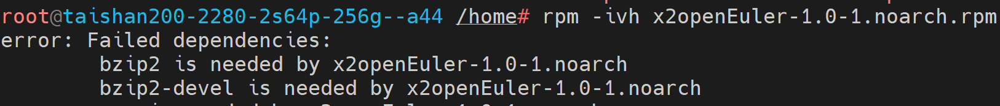

#### 可能原因

操作系统中未安装x2openEuler工具安装需要的依赖软件包。

#### 处理步骤

1.  根据安装过程中的缺少软件包报错信息，确定待安装的依赖软件包名称，如bzip2，bzip2-devel。
2.  参考[配置操作系统yum源](#配置操作系统yum源)配置yum源。
3.  执行如下命令安装依赖软件包。

    ```
    yum install -y bzip2 bzip2-devel
    ```


## 附录


### 运行环境数据使用说明

#### 注意事项
请注意，产品功能涉及的数据使用场景如下[表19](#table5582131519592)所示，请注意信息保护。

#### 运行环境数据使用场景说明

**表 19**  数据使用信息说明

<a id="table5582131519592"></a>
<table><thead align="left"><tr id="row19582171535915"><th class="cellrowborder" valign="top" width="14.6985301469853%" id="mcps1.2.8.1.1"><p id="p14582121518596"><a name="p14582121518596"></a><a name="p14582121518596"></a>收集信息的场景或功能</p>
</th>
<th class="cellrowborder" valign="top" width="31.096890310968906%" id="mcps1.2.8.1.2"><p id="p10846103513116"><a name="p10846103513116"></a><a name="p10846103513116"></a>收集信息使用的命令或文件</p>
</th>
<th class="cellrowborder" valign="top" width="6.979302069793021%" id="mcps1.2.8.1.3"><p id="p9851719124514"><a name="p9851719124514"></a><a name="p9851719124514"></a>信息采集必要性</p>
</th>
<th class="cellrowborder" valign="top" width="7.179282071792821%" id="mcps1.2.8.1.4"><p id="p181626618460"><a name="p181626618460"></a><a name="p181626618460"></a>有无额外收集数据</p>
</th>
<th class="cellrowborder" valign="top" width="14.378562143785622%" id="mcps1.2.8.1.5"><p id="p1858210155597"><a name="p1858210155597"></a><a name="p1858210155597"></a>信息使用目的</p>
</th>
<th class="cellrowborder" valign="top" width="11.538846115388461%" id="mcps1.2.8.1.6"><p id="p55825152595"><a name="p55825152595"></a><a name="p55825152595"></a>信息存储及保护措施</p>
</th>
<th class="cellrowborder" valign="top" width="14.128587141285873%" id="mcps1.2.8.1.7"><p id="p11582131511595"><a name="p11582131511595"></a><a name="p11582131511595"></a>信息销毁</p>
</th>
</tr>
</thead>
<tbody><tr id="row2058214154598"><td class="cellrowborder" rowspan="2" valign="top" width="14.6985301469853%" headers="mcps1.2.8.1.1 "><a name="ul187572817495"></a><a name="ul187572817495"></a><ul id="ul187572817495"><li>配置与硬件信息收集</li><li>配置信息差异分析</li><li>硬件兼容性评估</li></ul>
</td>
<td class="cellrowborder" valign="top" width="31.096890310968906%" headers="mcps1.2.8.1.2 "><a name="ul199307145106"></a><a name="ul199307145106"></a><ul id="ul199307145106"><li>/bin/cat /boot/grub2/grub.cfg</li><li>/usr/sbin/lspci -nvvv</li><li>/usr/sbin/lspci -xxx</li><li>/bin/netstat -npl</li><li>/usr/sbin/sysctl -a</li><li>/usr/sbin/dmidecode -t bios -t system -t baseboard -t chassis -t processor -t memory -t cache -t connector -t slot</li><li>/usr/sbin/dmidecode -s system-product-name</li><li>/bin/cat /boot/efi/EFI/centos/grub.cfg</li></ul>
</td>
<td class="cellrowborder" valign="top" width="6.979302069793021%" headers="mcps1.2.8.1.3 "><p id="p785116194452"><a name="p785116194452"></a><a name="p785116194452"></a>必须采集</p>
</td>
<td class="cellrowborder" valign="top" width="7.179282071792821%" headers="mcps1.2.8.1.4 "><p id="p20162963462"><a name="p20162963462"></a><a name="p20162963462"></a>无</p>
</td>
<td class="cellrowborder" valign="top" width="14.378562143785622%" headers="mcps1.2.8.1.5 "><p id="p13605012145413"><a name="p13605012145413"></a><a name="p13605012145413"></a>用于进行硬件兼容性评估和配置信息差异分析。</p>
</td>
<td class="cellrowborder" rowspan="2" valign="top" width="11.538846115388461%" headers="mcps1.2.8.1.6 "><a name="ul4726811425"></a><a name="ul4726811425"></a><ul id="ul4726811425"><li>硬件兼容性评估采集的数据存放到内存中，不做持久化保存。</li><li>配置与硬件信息收集采集的数据，保存在文件中，文件属主、属组为x2openEuler，其它用户无权限。可以通过IDE下载，需要用户自行保存。</li></ul>
</td>
<td class="cellrowborder" rowspan="2" valign="top" width="14.128587141285873%" headers="mcps1.2.8.1.7 "><a name="ul1193584016294"></a><a name="ul1193584016294"></a><ul id="ul1193584016294"><li>x2openEuler用户可以删除<span class="filepath" id="zh-cn_topic_0000001255987443_filepath16903015141915"><a name="zh-cn_topic_0000001255987443_filepath16903015141915"></a><a name="zh-cn_topic_0000001255987443_filepath16903015141915"></a>“/opt/x2openEuler/output/”</span>目录下存储的配置与硬件信息收集采集的数据文件。</li><li>工具卸载时会完全删除<span class="filepath" id="filepath924210143016"><a name="filepath924210143016"></a><a name="filepath924210143016"></a>“/opt/x2openEuler/output/”</span>目录下存储的配置与硬件信息收集采集的数据文件。</li></ul>
</td>
</tr>
<tr id="row2058215156593"><td class="cellrowborder" valign="top" headers="mcps1.2.8.1.1 "><a name="ul143341119191010"></a><a name="ul143341119191010"></a><ul id="ul143341119191010"><li>/boot/grub2/grub.cfg</li><li>/etc/default/grub</li><li>/usr/include/asm/unistd_64.h</li><li>/etc/fstab</li><li>/etc/profile</li><li>/etc/sysctl.conf</li><li>/boot/conifg-*</li></ul>
</td>
<td class="cellrowborder" valign="top" headers="mcps1.2.8.1.2 "><p id="p385161916455"><a name="p385161916455"></a><a name="p385161916455"></a>必须采集</p>
</td>
<td class="cellrowborder" valign="top" headers="mcps1.2.8.1.3 "><p id="p6162116174611"><a name="p6162116174611"></a><a name="p6162116174611"></a>无</p>
</td>
<td class="cellrowborder" valign="top" headers="mcps1.2.8.1.4 "><p id="p17192918185414"><a name="p17192918185414"></a><a name="p17192918185414"></a>用于进行配置差异分析。</p>
</td>
</tr>
</tbody>
</table>

### 相关链接
**表 20**  相关链接

<a id="table1656344955412"></a>
<table><thead align="left"><tr id="row1856304918547"><th class="cellrowborder" valign="top" width="36.19%" id="mcps1.2.3.1.1"><p id="p9563154911541"><a name="p9563154911541"></a><a name="p9563154911541"></a>相关内容</p>
</th>
<th class="cellrowborder" valign="top" width="63.81%" id="mcps1.2.3.1.2"><p id="p356384917540"><a name="p356384917540"></a><a name="p356384917540"></a>网址</p>
</th>
</tr>
</thead>
<tbody><tr id="row1920775885710"><td class="cellrowborder" valign="top" width="36.19%" headers="mcps1.2.3.1.1 "><p id="p15207258125710"><a name="p15207258125710"></a><a name="p15207258125710"></a>openEuler开源社区</p>
</td>
<td class="cellrowborder" valign="top" width="63.81%" headers="mcps1.2.3.1.2 "><p id="p220725816577"><a name="p220725816577"></a><a name="p220725816577"></a>https://www.openeuler.org/zh/</p>
</td>
</tr>
<tr id="row1456313494548"><td class="cellrowborder" valign="top" width="36.19%" headers="mcps1.2.3.1.1 "><p id="p1856364975417"><a name="p1856364975417"></a><a name="p1856364975417"></a>openEuler开发资源</p>
</td>
<td class="cellrowborder" valign="top" width="63.81%" headers="mcps1.2.3.1.2 "><p id="p3563149105411"><a name="p3563149105411"></a><a name="p3563149105411"></a>https://www.hikunpeng.com/developer/openEuler</p>
</td>
</tr>
<tr id="row72318611015"><td class="cellrowborder" valign="top" width="36.19%" headers="mcps1.2.3.1.1 "><p id="p11243691014"><a name="p11243691014"></a><a name="p11243691014"></a>openEuler repo源</p>
</td>
<td class="cellrowborder" valign="top" width="63.81%" headers="mcps1.2.3.1.2 "><p id="p7241617104"><a name="p7241617104"></a><a name="p7241617104"></a>https://repo.openeuler.org/openEuler-20.03-LTS/ISO/</p>
</td>
</tr>
<tr id="row20826955016"><td class="cellrowborder" valign="top" width="36.19%" headers="mcps1.2.3.1.1 "><p id="p3901102010016"><a name="p3901102010016"></a><a name="p3901102010016"></a>openEuler oec-application项目交流</p>
</td>
<td class="cellrowborder" valign="top" width="63.81%" headers="mcps1.2.3.1.2 "><p id="p1882755906"><a name="p1882755906"></a><a name="p1882755906"></a>https://gitee.com/openeuler/oec-application</p>
</td>
</tr>
<tr id="row178821330135618"><td class="cellrowborder" valign="top" width="36.19%" headers="mcps1.2.3.1.1 "><p id="p088312305566"><a name="p088312305566"></a><a name="p088312305566"></a>华为云开源镜像仓</p>
</td>
<td class="cellrowborder" valign="top" width="63.81%" headers="mcps1.2.3.1.2 "><p id="zh-cn_topic_0308075319_p1162181375914"><a name="zh-cn_topic_0308075319_p1162181375914"></a><a name="zh-cn_topic_0308075319_p1162181375914"></a>https://mirrors.huaweicloud.com/repository/conf/CentOS-AltArch-7.repo</p>
<p id="zh-cn_topic_0308075319_p14621713185911"><a name="zh-cn_topic_0308075319_p14621713185911"></a><a name="zh-cn_topic_0308075319_p14621713185911"></a>https://mirrors.huaweicloud.com/epel/7/$basearch</p>
</td>
</tr>
</tbody>
</table>

### 术语

<a name="zh-cn_topic_0229761957_zh-cn_topic_0195271714_table1000233"></a>
<table><tbody><tr id="zh-cn_topic_0229761957_row1364614118328"><td class="cellrowborder" style="border:none" colspan="2" valign="top"><p id="zh-cn_topic_0229761957_p964611163212"><a name="zh-cn_topic_0229761957_p964611163212"></a><a name="zh-cn_topic_0229761957_p964611163212"></a><strong id="b1810417544345"><a name="b1810417544345"></a><a name="b1810417544345"></a>B</strong></p>
</td>
</tr>
<tr id="zh-cn_topic_0229761957_row24341820123119"><td class="cellrowborder" style="border:none" valign="top" width="18.12%"><p id="zh-cn_topic_0229761957_p843452017312"><a name="zh-cn_topic_0229761957_p843452017312"></a><a name="zh-cn_topic_0229761957_p843452017312"></a>板卡</p>
</td>
<td class="cellrowborder" style="border:none" valign="top" width="81.88%"><p id="zh-cn_topic_0229761957_p6434102073119"><a name="zh-cn_topic_0229761957_p6434102073119"></a><a name="zh-cn_topic_0229761957_p6434102073119"></a>指安装有一块芯片的单板插到另外一块单板上去。</p>
</td>
</tr>
<tr id="row189631351114215"><td class="cellrowborder" style="border:none" colspan="2" valign="top"><p id="p09631851154214"><a name="p09631851154214"></a><a name="p09631851154214"></a><strong id="b8427194944317"><a name="b8427194944317"></a><a name="b8427194944317"></a>F</strong></p>
</td>
</tr>
<tr id="row6870055184219"><td class="cellrowborder" style="border:none" valign="top" width="18.12%"><p id="p787025584215"><a name="p787025584215"></a><a name="p787025584215"></a>服务器</p>
</td>
<td class="cellrowborder" style="border:none" valign="top" width="81.88%"><p id="p28701855104216"><a name="p28701855104216"></a><a name="p28701855104216"></a>服务器是在网络环境中为客户（Client）提供各种服务的特殊计算机。</p>
</td>
</tr>
<tr id="zh-cn_topic_0229761957_zh-cn_topic_0195271714_row56859719"><td class="cell-norowborder" style="border:none" colspan="2" valign="top"><p id="zh-cn_topic_0229761957_zh-cn_topic_0195271714_p96820983111"><a name="zh-cn_topic_0229761957_zh-cn_topic_0195271714_p96820983111"></a><a name="zh-cn_topic_0229761957_zh-cn_topic_0195271714_p96820983111"></a><strong id="b732151720360"><a name="b732151720360"></a><a name="b732151720360"></a>W</strong></p>
</td>
</tr>
<tr id="zh-cn_topic_0229761957_zh-cn_topic_0195271714_row53083271"><td class="nocellnorowborder" style="border:none" valign="top" width="18.12%"><p id="zh-cn_topic_0229761957_zh-cn_topic_0195271714_p0682199193114"><a name="zh-cn_topic_0229761957_zh-cn_topic_0195271714_p0682199193114"></a><a name="zh-cn_topic_0229761957_zh-cn_topic_0195271714_p0682199193114"></a>物理机</p>
</td>
<td class="cell-norowborder" style="border:none" valign="top" width="81.88%"><p id="zh-cn_topic_0229761957_zh-cn_topic_0195271714_p1668213913313"><a name="zh-cn_topic_0229761957_zh-cn_topic_0195271714_p1668213913313"></a><a name="zh-cn_topic_0229761957_zh-cn_topic_0195271714_p1668213913313"></a>与宿主机相对，指部署了普通操作系统的主机或未部署操作系统的裸机。</p>
</td>
</tr>
<tr id="row915212143920"><td class="cellrowborder" style="border:none" valign="top" width="18.12%"><p id="p1152162193917"><a name="p1152162193917"></a><a name="p1152162193917"></a><strong id="b1644821814394"><a name="b1644821814394"></a><a name="b1644821814394"></a>X</strong></p>
</td>
<td class="cellrowborder" style="border:none" valign="top" width="81.88%">&nbsp;&nbsp;</td>
</tr>
<tr id="row1539717512399"><td class="cellrowborder" style="border:none" valign="top" width="18.12%"><p id="p53979513394"><a name="p53979513394"></a><a name="p53979513394"></a>虚拟机</p>
</td>
<td class="cellrowborder" style="border:none" valign="top" width="81.88%"><p id="p173979510394"><a name="p173979510394"></a><a name="p173979510394"></a>在计算机科学中的体系结构里，是指一种特殊的软件，他可以在计算机平台和终端用户之间创建一种环境，而终端用户则是基于这个软件所创建的环境来操作软件。</p>
</td>
</tr>
</tbody>
</table>

### 缩略语
<a name="zh-cn_topic_0229761958_zh-cn_topic_0195271715_table166084911276"></a>
<table><tbody><tr id="zh-cn_topic_0229761958_zh-cn_topic_0195271715_row13429252131613"><td class="cell-norowborder" style="border:none" colspan="3" valign="top"><p id="zh-cn_topic_0229761958_zh-cn_topic_0195271715_p15986185513165"><a name="zh-cn_topic_0229761958_zh-cn_topic_0195271715_p15986185513165"></a><a name="zh-cn_topic_0229761958_zh-cn_topic_0195271715_p15986185513165"></a><strong id="b1768811243719"><a name="b1768811243719"></a><a name="b1768811243719"></a>B</strong></p>
</td>
</tr>
<tr id="zh-cn_topic_0229761958_zh-cn_topic_0195271715_row1761104992719"><td class="nocellnorowborder" style="border:none" valign="top" width="10.03684856992455%"><p id="zh-cn_topic_0229761958_zh-cn_topic_0195271715_p19611949172720"><a name="zh-cn_topic_0229761958_zh-cn_topic_0195271715_p19611949172720"></a><a name="zh-cn_topic_0229761958_zh-cn_topic_0195271715_p19611949172720"></a>BIN</p>
</td>
<td class="nocellnorowborder" style="border:none" valign="top" width="18.108440077206527%"><p id="p098315269241"><a name="p098315269241"></a><a name="p098315269241"></a>Binary</p>
</td>
<td class="cell-norowborder" style="border:none" valign="top" width="71.85471135286893%"><p id="p18982152617242"><a name="p18982152617242"></a><a name="p18982152617242"></a>一种二进制文件</p>
</td>
</tr>
<tr id="zh-cn_topic_0229761958_zh-cn_topic_0195271715_row62511248469"><td class="cellrowborder" style="border:none" colspan="3" valign="top"><p id="zh-cn_topic_0229761958_zh-cn_topic_0195271715_p72511142463"><a name="zh-cn_topic_0229761958_zh-cn_topic_0195271715_p72511142463"></a><a name="zh-cn_topic_0229761958_zh-cn_topic_0195271715_p72511142463"></a><strong id="zh-cn_topic_0229761958_zh-cn_topic_0195271715_b46600822316"><a name="zh-cn_topic_0229761958_zh-cn_topic_0195271715_b46600822316"></a><a name="zh-cn_topic_0229761958_zh-cn_topic_0195271715_b46600822316"></a>G</strong></p>
</td>
</tr>
<tr id="zh-cn_topic_0229761958_zh-cn_topic_0195271715_row16131104616"><td class="cellrowborder" style="border:none" valign="top" width="10.03684856992455%"><p id="zh-cn_topic_0229761958_zh-cn_topic_0195271715_p4115110464"><a name="zh-cn_topic_0229761958_zh-cn_topic_0195271715_p4115110464"></a><a name="zh-cn_topic_0229761958_zh-cn_topic_0195271715_p4115110464"></a>GZIP</p>
</td>
<td class="cellrowborder" style="border:none" valign="top" width="18.108440077206527%"><p id="zh-cn_topic_0229761958_zh-cn_topic_0195271715_p21191114612"><a name="zh-cn_topic_0229761958_zh-cn_topic_0195271715_p21191114612"></a><a name="zh-cn_topic_0229761958_zh-cn_topic_0195271715_p21191114612"></a>GNU ZIP</p>
</td>
<td class="cellrowborder" style="border:none" valign="top" width="71.85471135286893%"><p id="zh-cn_topic_0229761958_zh-cn_topic_0195271715_p2110154611"><a name="zh-cn_topic_0229761958_zh-cn_topic_0195271715_p2110154611"></a><a name="zh-cn_topic_0229761958_zh-cn_topic_0195271715_p2110154611"></a>一种文件压缩格式</p>
</td>
</tr>
<tr id="zh-cn_topic_0229761958_zh-cn_topic_0195271715_row5708175710451"><td class="cellrowborder" style="border:none" colspan="3" valign="top"><p id="zh-cn_topic_0229761958_zh-cn_topic_0195271715_p19708155794518"><a name="zh-cn_topic_0229761958_zh-cn_topic_0195271715_p19708155794518"></a><a name="zh-cn_topic_0229761958_zh-cn_topic_0195271715_p19708155794518"></a><strong id="zh-cn_topic_0229761958_zh-cn_topic_0195271715_b4156101822315"><a name="zh-cn_topic_0229761958_zh-cn_topic_0195271715_b4156101822315"></a><a name="zh-cn_topic_0229761958_zh-cn_topic_0195271715_b4156101822315"></a>J</strong></p>
</td>
</tr>
<tr id="zh-cn_topic_0229761958_zh-cn_topic_0195271715_row1657385304516"><td class="cellrowborder" style="border:none" valign="top" width="10.03684856992455%"><p id="zh-cn_topic_0229761958_zh-cn_topic_0195271715_p15573165334519"><a name="zh-cn_topic_0229761958_zh-cn_topic_0195271715_p15573165334519"></a><a name="zh-cn_topic_0229761958_zh-cn_topic_0195271715_p15573165334519"></a>JAR</p>
</td>
<td class="cellrowborder" style="border:none" valign="top" width="18.108440077206527%"><p id="zh-cn_topic_0229761958_zh-cn_topic_0195271715_p057313535456"><a name="zh-cn_topic_0229761958_zh-cn_topic_0195271715_p057313535456"></a><a name="zh-cn_topic_0229761958_zh-cn_topic_0195271715_p057313535456"></a>Java Archive</p>
</td>
<td class="cellrowborder" style="border:none" valign="top" width="71.85471135286893%"><p id="zh-cn_topic_0229761958_zh-cn_topic_0195271715_p457325304514"><a name="zh-cn_topic_0229761958_zh-cn_topic_0195271715_p457325304514"></a><a name="zh-cn_topic_0229761958_zh-cn_topic_0195271715_p457325304514"></a>一种Java软件包格式文件</p>
</td>
</tr>
<tr id="row10395151413201"><td class="cellrowborder" style="border:none" colspan="3" valign="top"><p id="p1872411252202"><a name="p1872411252202"></a><a name="p1872411252202"></a><strong id="b1509193115207"><a name="b1509193115207"></a><a name="b1509193115207"></a>P</strong></p>
</td>
</tr>
<tr id="row1511141813205"><td class="cellrowborder" style="border:none" valign="top" width="10.03684856992455%"><p id="p411115184203"><a name="p411115184203"></a><a name="p411115184203"></a>PY</p>
</td>
<td class="cellrowborder" style="border:none" valign="top" width="18.108440077206527%"><p id="p10111181814206"><a name="p10111181814206"></a><a name="p10111181814206"></a>-</p>
</td>
<td class="cellrowborder" style="border:none" valign="top" width="71.85471135286893%"><p id="p10111918192017"><a name="p10111918192017"></a><a name="p10111918192017"></a>一种Python的脚本文件</p>
</td>
</tr>
<tr id="row39131339182014"><td class="cellrowborder" style="border:none" valign="top" width="10.03684856992455%"><p id="p189131839102011"><a name="p189131839102011"></a><a name="p189131839102011"></a>PYC</p>
</td>
<td class="cellrowborder" style="border:none" valign="top" width="18.108440077206527%"><p id="p0913203972011"><a name="p0913203972011"></a><a name="p0913203972011"></a>-</p>
</td>
<td class="cellrowborder" style="border:none" valign="top" width="71.85471135286893%"><p id="p139131439192014"><a name="p139131439192014"></a><a name="p139131439192014"></a>一种二进制文件</p>
</td>
</tr>
<tr id="zh-cn_topic_0229761958_zh-cn_topic_0195271715_row1570342184715"><td class="cellrowborder" style="border:none" colspan="3" valign="top"><p id="zh-cn_topic_0229761958_zh-cn_topic_0195271715_p137031427475"><a name="zh-cn_topic_0229761958_zh-cn_topic_0195271715_p137031427475"></a><a name="zh-cn_topic_0229761958_zh-cn_topic_0195271715_p137031427475"></a><strong id="zh-cn_topic_0229761958_zh-cn_topic_0195271715_b588532714235"><a name="zh-cn_topic_0229761958_zh-cn_topic_0195271715_b588532714235"></a><a name="zh-cn_topic_0229761958_zh-cn_topic_0195271715_b588532714235"></a>R</strong></p>
</td>
</tr>
<tr id="zh-cn_topic_0229761958_zh-cn_topic_0195271715_row19755359104619"><td class="cellrowborder" style="border:none" valign="top" width="10.03684856992455%"><p id="zh-cn_topic_0229761958_zh-cn_topic_0195271715_p2755105964613"><a name="zh-cn_topic_0229761958_zh-cn_topic_0195271715_p2755105964613"></a><a name="zh-cn_topic_0229761958_zh-cn_topic_0195271715_p2755105964613"></a>RPM</p>
</td>
<td class="cellrowborder" style="border:none" valign="top" width="18.108440077206527%"><p id="zh-cn_topic_0229761958_zh-cn_topic_0195271715_p1375525924616"><a name="zh-cn_topic_0229761958_zh-cn_topic_0195271715_p1375525924616"></a><a name="zh-cn_topic_0229761958_zh-cn_topic_0195271715_p1375525924616"></a>RHEL Package Manager</p>
</td>
<td class="cellrowborder" style="border:none" valign="top" width="71.85471135286893%"><p id="zh-cn_topic_0229761958_zh-cn_topic_0195271715_p6755155994612"><a name="zh-cn_topic_0229761958_zh-cn_topic_0195271715_p6755155994612"></a><a name="zh-cn_topic_0229761958_zh-cn_topic_0195271715_p6755155994612"></a>一种Linux软件包格式</p>
</td>
</tr>
<tr id="zh-cn_topic_0229761958_zh-cn_topic_0195271715_row1137775612468"><td class="cellrowborder" style="border:none" colspan="3" valign="top"><p id="zh-cn_topic_0229761958_zh-cn_topic_0195271715_p1337711567461"><a name="zh-cn_topic_0229761958_zh-cn_topic_0195271715_p1337711567461"></a><a name="zh-cn_topic_0229761958_zh-cn_topic_0195271715_p1337711567461"></a><strong id="zh-cn_topic_0229761958_zh-cn_topic_0195271715_b20954194082312"><a name="zh-cn_topic_0229761958_zh-cn_topic_0195271715_b20954194082312"></a><a name="zh-cn_topic_0229761958_zh-cn_topic_0195271715_b20954194082312"></a>T</strong></p>
</td>
</tr>
<tr id="zh-cn_topic_0229761958_zh-cn_topic_0195271715_row750735264619"><td class="cellrowborder" style="border:none" valign="top" width="10.03684856992455%"><p id="zh-cn_topic_0229761958_zh-cn_topic_0195271715_p2507952114616"><a name="zh-cn_topic_0229761958_zh-cn_topic_0195271715_p2507952114616"></a><a name="zh-cn_topic_0229761958_zh-cn_topic_0195271715_p2507952114616"></a>TAR</p>
</td>
<td class="cellrowborder" style="border:none" valign="top" width="18.108440077206527%"><p id="zh-cn_topic_0229761958_zh-cn_topic_0195271715_p1750717527460"><a name="zh-cn_topic_0229761958_zh-cn_topic_0195271715_p1750717527460"></a><a name="zh-cn_topic_0229761958_zh-cn_topic_0195271715_p1750717527460"></a>-</p>
</td>
<td class="cellrowborder" style="border:none" valign="top" width="71.85471135286893%"><p id="zh-cn_topic_0229761958_zh-cn_topic_0195271715_p2507652134614"><a name="zh-cn_topic_0229761958_zh-cn_topic_0195271715_p2507652134614"></a><a name="zh-cn_topic_0229761958_zh-cn_topic_0195271715_p2507652134614"></a>一种Linux软件包格式</p>
</td>
</tr>
<tr id="zh-cn_topic_0229761958_zh-cn_topic_0195271715_row16927635485"><td class="cellrowborder" style="border:none" colspan="3" valign="top"><p id="zh-cn_topic_0229761958_zh-cn_topic_0195271715_p1292711311482"><a name="zh-cn_topic_0229761958_zh-cn_topic_0195271715_p1292711311482"></a><a name="zh-cn_topic_0229761958_zh-cn_topic_0195271715_p1292711311482"></a><strong id="zh-cn_topic_0229761958_zh-cn_topic_0195271715_b48293142417"><a name="zh-cn_topic_0229761958_zh-cn_topic_0195271715_b48293142417"></a><a name="zh-cn_topic_0229761958_zh-cn_topic_0195271715_b48293142417"></a>Z</strong></p>
</td>
</tr>
<tr id="zh-cn_topic_0229761958_zh-cn_topic_0195271715_row5486102485"><td class="cellrowborder" style="border:none" valign="top" width="10.03684856992455%"><p id="zh-cn_topic_0229761958_zh-cn_topic_0195271715_p194862005485"><a name="zh-cn_topic_0229761958_zh-cn_topic_0195271715_p194862005485"></a><a name="zh-cn_topic_0229761958_zh-cn_topic_0195271715_p194862005485"></a>ZIP</p>
</td>
<td class="cellrowborder" style="border:none" valign="top" width="18.108440077206527%"><p id="zh-cn_topic_0229761958_zh-cn_topic_0195271715_p124863054819"><a name="zh-cn_topic_0229761958_zh-cn_topic_0195271715_p124863054819"></a><a name="zh-cn_topic_0229761958_zh-cn_topic_0195271715_p124863054819"></a>-</p>
</td>
<td class="cellrowborder" style="border:none" valign="top" width="71.85471135286893%"><p id="zh-cn_topic_0229761958_zh-cn_topic_0195271715_p174861301487"><a name="zh-cn_topic_0229761958_zh-cn_topic_0195271715_p174861301487"></a><a name="zh-cn_topic_0229761958_zh-cn_topic_0195271715_p174861301487"></a>一种文件压缩格式</p>
</td>
</tr>
</tbody>
</table>


