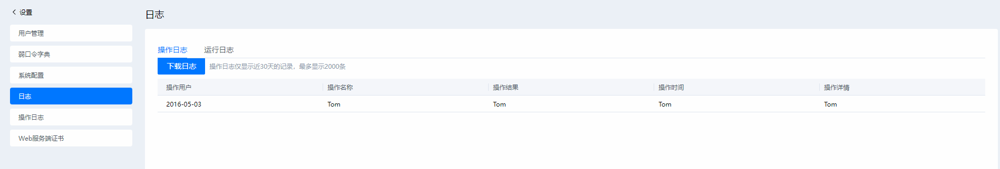

# 配置repo源<a id="configkey"></a>
##### 前提条件
-   已登录x2openEuler工具
-   创建升级、信息收集分析或配置迁移任务
##### 操作步骤
1.  在工具创建任务时，单击“添加节点”，下拉至“repo源名称”选项。单击右侧“选择”，进入选择repo源界面，如图[图1](#figure1)。

    > **说明：** 
    >工具默认提供openEuler 20.03-LTS-SP1操作系统的aarch和x86\_64源。

    **图 1**  选择repo源<a id="figure1"></a>  
    

2.  在左侧“repo源名称”列表中，选择相应repo源，单击“确定”即完成repo源选择。
3.  （可选）repo源管理。

    > **须知：** 
    >-   请务必添加工具已支持的目标操作系统repo源，否则会导致升级出现异常，添加的repo源中最少需要包含everything和update。
    >-   修改repo源可能会导致使用该repo源的其他节点无法正常运行，请谨慎操作。
    >-   删除repo源可能会导致使用该repo源的其他节点无法正常运行，请谨慎操作。

    -   添加repo源

        单击右上角“添加repo源”进入repo源配置界面参考默认repo源进行配置，repo源名称后缀为“.repo”，配置完成后单击“保存”即可完成repo源添加。

    -   修改repo源

        在左侧repo源列表中选择需要进行修改的repo源，单击对repo源进行修改。

    -   删除repo源

        在左侧repo源列表中选择需要删除的repo源，单击删除repo源。

# （可选）为x2openEuler工具导入根证书<a id="importcert"></a>
使用浏览器登录x2openEuler工具时，若弹出安全告警提示，可以在浏览器中为x2openEuler工具导入根证书来屏蔽此安全告警提示。

本指南以Chrome 105.0为例介绍为x2openEuler工具导入根证书的操作步骤。

1.  登录x2openEuler工具，在页面右上方选择“  \> web服务端证书”，单击“下载根证书“下载根证书。
2.  打开浏览器，依次选择“设置 \> 隐私设置和安全性 \> 安全\>管理证书”。
3.  在弹出“证书”的对话框中，选择“受信任的根证书颁发机构”页签，单击“导入”，如[图1](#figure2)所示。

    **图 2**  证书<a id="figure2"></a>  
    

4.  在弹出的“证书导入向导”对话框中，单击“下一步”，如[图3](#figure3)所示。

    **图 3**  证书导入向导欢迎页面<a id="figure3" ></a>  
    

5.  进入选择证书页面，单击“浏览”，如[图4](#figure4)所示。

    **图 4**  导入证书文件<a id="figure4"></a>  
    

6.  从本地PC路径中选择待导入的证书。
7.  单击“下一步”。

    进入选择证书存储位置页面，选择如[图5](#figure5)中的存放位置。

    **图 5**  选择证书存储位置<a id="figure5"></a>  
    

8.  单击“下一步 \> 完成”。

    弹出“安全警告”对话框。

9.  单击“是”。

    弹出“导入成功”提示框，则表示成功导入证书。

10. 单击“确定”完成证书导入。
11. 由于颁发的证书是针对工具的名称，需要修改本地的Hosts映射。
    1.  在“C:\\Windows\\System32\\drivers\\etc”路径下，打开“hosts”文件。

        **图 6**  hosts文件<a id="figure6"></a>  
        

    2.  在“hosts”文件中增加如下内容后保存并退出。

        _服务器__IP__地址_  x2openEuler

        例如：10.254.206.190 x2openEuler

12. 打开本地PC机的浏览器，在地址栏输入**https://x2openEuler_:端口号_**（例如：https://x2openEuler:8084），按“Enter”。


# SSH配置
修改工具中的SSH配置文件，实现对SSH的超时配置。

1.  登录x2openEuler工具部署节点，执行以下命令，进入相应路径后修改“conf.ini”文件。

    ```
    cd /usr/local/x2openEuler/portal/src/
    vi conf.ini
    ```

2.  参考[表 SSH参数说明](#sheet1)根据需要修改配置文件中的部分内容。

    **表 1**  SSH参数说明
    <a id="sheet1"></a>
    <table>
        <tr>
            <th>参数</th>
            <th>说明</th>
        </tr>
        <tr>
            <td>long_cmd_timeout</td>
            <td>长命令执行超时时间，比如获取节点日志的命令，默认值为600。</td>
        </tr>
        <tr>
            <td>tail_line_number</td>
            <td>获取节点日志时，tail追踪的日志行数，默认值为100。</td>
        </tr>
        <tr>
            <td>hostname_length</td>
            <td>主机名的长度，用于动态配置命令回显一行的长度，默认值为100。</td>
        </tr>
        <tr>
            <td>cmd_timeout</td>
            <td>短命令执行超时时间，比如whoami命令，默认值为10。</td>
        </tr>
    </table>

3.  按“ESC”，输入“:wq”，按“Enter”保存并退出。
4.  执行以下命令重启SSH服务以生效配置。

    ```
    systemctl restart sshd.service
    ```

# 关闭SELinux<a id="offse"></a>
若存在环境节点需要关闭SElinux强制模式，执行以下操作。

-   **临时关闭**

    1.  执行以下命令查询SELinux状态。

        ```
        sestatus
        ```

        “Current mode“显示“enforcing“表示SELinux已开启强制模式。

    2.  执行如下命令将SELinux模式设置为“permissive“。

        ```
        setenforce 0
        ```

    3.  再次查询SELinux状态。

        “Current mode“显示“permissive“表示SELinux已临时关闭强制模式。

    > **须知：** 
    >服务器重启后失效，工具使用过程中可能会出现服务异常。

-   **永久关闭**
    1.  执行以下命令查询SELinux状态。

        ```
        sestatus
        ```

        “SELinux status“显示“enabled“表示SELinux已开启。

    2.  执行如下命令修改“/etc/selinux/config“文件。

        ```
        vi /etc/selinux/config
        ```

    3.  按“i”进入编辑模式，将“SELINUX=enforcing“改为“SELINUX=disabled“。
    4.  按“ESC”，输入“:wq”，按“Enter”保存并退出。
    5.  执行以下命令重启服务器。

        ```
        reboot
        ```

    6.  再次查询SELinux状态。

        “SELinux status“显示“disabled“表示SELinux已关闭。

# 修改x2openEuler工具的IP和端口
##### 前提条件
已部署x2openEuler工具
##### 操作步骤
1.  使用SSH工具远程登录x2openEuler部署环境，进入Linux操作系统命令行界面。
2.  执行以下命令停止x2openEuler工具。

    > **说明：** 
    >用户须停止x2openEuler工具后，才能完成后续的修改IP和端口的操作。

    ```
    systemctl stop nginx_x2openEuler.service
    systemctl stop gunicorn_x2openEuler.service
    ```

3.  执行如下命令修改IP或端口。

    ```
    cd /usr/local/x2openEuler/portal/service/
    bash change_ip_x2openEuler.sh
    ```

    回显交互信息如下：

    ```
    Start Nginx service and Gunicorn service
    =====================================================
    Original IP address and x2openEuler number: x.x.x.x:18082
    =====================================================
    Ip address list:
    sequence_number         ip_address              device
    [1]                     x.x.x.x                 br0
    [2]                     y.y.y.y                 br1
    Enter the sequence number of listed ip as web server ip(default: 1): 1
    Set the web server IP address y.y.y.y
    Please enter HTTPS port(default: 18082):19082
    The HTTPS port 19082 is valid.  Set the HTTPS port to 19082 (y/n default: y):y
    Set the HTTPS port 19082
    Please enter gunicorn port(default: 18080):
    The GUNICORN port 18080 is valid.  Set the GUNICORN port to 18080 (y/n default: y):
    Set the GUNICORN port 18080
    The Nginx and Gunicorn ports are set up successfully.
    ```

    > **说明：** 
    >其中，x.x.x.x 和 y.y.y.y 为工具部署环境IP地址。
    >-   在执行修改IP和端口命令前，需要先进入“/usr/local/x2openEuler/portal/service”目录。
    >-   执行命令后会系统会列出可用的IP地址，用户可以自行选择。
    >-   执行命令进行修改端口时，需确认该端口未被占用，避免产生端口冲突。若工具部署环境已经开启防火墙，则需要确保开通修改后端口，若修改前端口不再被使用，则需对其做关闭处理，避免影响部署环境安全。
    >-   修改完端口后,重启工具相关服务，请参考章节[启动/停止/重启服务](#servicemanager)。

# 启动/停止/重启服务<a id="servicemanager"></a>
#### 前提条件
已部署x2openEuler工具
#### 操作步骤
1.  使用SSH工具远程登录x2openEuler部署环境，进入Linux操作系统命令行界面。
2.  执行以下命令进行工具服务启动/停止/重启操作。

    ```
    systemctl start/stop/restart/status nginx_x2openEuler.service
    systemctl start/stop/restart/status gunicorn_x2openEuler.service
    ```

# 管理日志
## 日志说明
##### 操作日志说明
操作日志主要用来记录用户的各种修改操作信息或者系统定时任务信息，记录的信息如下所示：

-   用户登录或退出
-   上传文件
-   创建任务
-   创建/删除用户
-   用户锁定/解锁
-   更改用户配置
-   修改密码
-   下载/删除报告
-   设置最大在线用户
-   设置运行日志级别
-   导入/替换证书
-   设置证书过期告警阈值
-   管理弱口令字典
-   更新工作密钥

##### 运行日志说明
运行日志主要用来记录程序运行过程中一些必要的信息，用于帮助开发人员或客户快速定位问题，处理程序运行中的异常信息。

一键下载的日志压缩包中包含如下模块：

**表 2** 运行日志模块说明
<a id="sheet2"></a>
<table>
    <tr>
        <th>运行日志模块</th> 
        <th>说明</th> 
    </tr>
    <tr>
        <td>certificate_manager.log</td>
        <td>记录工具证书管理操作信息。</td>
    </tr>
    <tr>
        <td>config.log</td>
        <td>记录工具配置操作信息。</td>
    </tr>
    <tr>
        <td>operationlog_manager.log</td>
        <td>记录操作日志管理操作信息。</td>
    </tr>
    <tr>
        <td>requests.log</td>
        <td>记录访问请求信息。</td>
    </tr>
    <tr>
        <td>ssh_connect.log</td>
        <td>记录使用SSH协议进行连接的信息。</td>
    </tr>
    <tr>
        <td>user_manager.log</td>
        <td>记录用户管理信息操作的日志文件。</td>
    </tr>
    <tr>
        <td>work_key_manager.log</td>
        <td>记录工作密钥相关操作日志。</td>
    </tr>
    <tr>
        <td>cipher.log</td>
        <td>记录登录用户密码变更操作的日志文件。</td>
    </tr>
    <tr>
        <td>get_node_finger_print.log</td>
        <td>获取节点指纹信息输出日志。</td>
    </tr>
    <tr>
        <td>permission.log</td>
        <td>工具权限控制变更日志。</td>
    </tr>
    <tr>
        <td>runlog_manager.log</td>
        <td>主要用来记录获取运行日志操作时的动作信息。</td>
    </tr>
    <tr>
        <td>task_manager.log</td>
        <td>记录升级任务的操作信息。</td>
    </tr>
    <tr>
        <td>weakpassword_manager.log</td>
        <td>弱口令管理变更日志。</td>
    </tr>
    <tr>
        <td>pre-execute.log</td>
        <td>从本地获取在升级节点执行前置脚本的日志。</td>
    </tr>
    <tr>
        <td>post-execute.log</td>
        <td>从本地获取在升级节点执行升级后重启后后置脚本的日志。</td>
    </tr>
    <tr>
        <td>execute.log</td>
        <td>从本地获取在升级节点执行升级后重启前后置脚本的日志。</td>
    </tr>
    <tr>
        <td colspan="2">说明：
运行日志保存在“/usr/local/x2openEuler/portal/logs/backend”目录下。

前置脚本执行日志保存在“ /opt/x2openEuler/scripts-execute/n-x.x.x.x/pre-execute/”。

重启后后置脚本执行日志保存在“/opt/x2openEuler/scripts-execute/n-x.x.x.x/post-execute/”。

重启前后置脚本执行日志保存在“ /opt/x2openEuler/scripts-execute/n-x.x.x.x/post-execute-before-reboot”。

其中，

n表示待升级任务ID，x.x.x.x表示待升级节点IP地址。</td>
    </tr>
</table>

## 操作日志管理
###### 前提条件
已成功登录x2openEuler工具。

> **说明：** 
>-   普通用户只可查看和下载自己的操作日志，管理员可以查看所有用户的操作日志。
>-   操作日志保存在MariaDB的x2openEuler数据库中operaitonlogmanager\_operationlog表中，日志文件为“/usr/local/x2openEuler/portal/logs/backend/operationlog\_manager.log”。
>-   操作日志默认保存30天，工具每天凌晨1点自动检查、删除超过30天的操作日志。

###### 操作步骤
1.  在页面右上角下拉菜单中，选择“日志“。

    打开“日志“界面，选择“操作日志“，如[图7](#figure7)所示。

    **图 7**  操作日志<a id="figure7"></a>  
    

2.  （可选）下载操作日志。

    单击页面上的“下载”下载csv格式日志文件。
## 运行日志管理
##### 前提条件
已成功登录x2openEuler工具。

> **说明：** 
>-   只有管理员（**x2openEulerAdmin**）可以查看，下载运行日志和修改运行日志级别。
>-   管理员可以在工具首页下拉菜单的“系统配置“，手动设置“日志级别“，工具只会记录配置的级别及以上级别的日志。
##### 操作步骤
1.  在页面右上角下拉菜单中，选择“日志“。

    打开“日志“界面，选择“运行日志“，如[图8](#figure8)所示。

    **图 8**  运行日志<a id="figure8"></a>  
    

2.  单击“一键下载”，可下载运行日志。

    下载的运行日志的格式如下：

    [时间\] [日志级别\] [进程ID\] [线程名称\] [模块名称:函数名:行数\] 日志详情

    例如：

    ```
    [2020-08-20 09:50:21] [INFO] [processID:18508] [MainThread] [solution_api:get_solution_category:143] get_solution_category
    ```

    日志级别用来表示日志信息的重要程度，默认为INFO。工具运行日志级别分DEBUG、INFO、WARNING、ERROR四级。

    -   DEBUG：调试级别，记录调试信息，便于开发人员或维护人员定位问题。
    -   INFO：信息级别，记录服务正常运行的关键信息。
    -   WARNING：警告级别，记录系统和预期的状态不一致的事件，但这些事件不影响整个系统的运行。
    -   ERROR：一般错误级别，记录错误事件，但应用可能还能继续运行。

# 管理用户
## 重置密码
##### 前提条件
已成功登录x2openEuler工具。

> **说明：** 
>只有管理员（**x2openEulerAdmin**）可以执行重置密码操作。
##### 操作步骤
1.  在页面右上角下拉菜单中，选择“用户管理“。

    打开用户管理界面。

2.  单击操作栏中指定用户后的“重置密码”。打开“重置密码”界面，如[图9](#figure9)所示，需配置的参数如[表2](#sheet2)所示。

    **图 9**  重置密码<a id="figure9"></a>  
    

    **表 2**  重置密码参数说明
    <a id="sheet2"></a>
    <table>
        <tr>
            <th>参数</th>
            <th>说明</th>
        </tr>
        <tr>
            <td>用户名</td>
            <td>待重置密码的用户名。重置密码时不允许修改。</td>
        </tr>
        <tr>
            <td>管理员密码</td>
            <td>输入管理员密码。</td>
        </tr>
        <tr>
            <td>密码</td>
            <td>
                <p>输入新建用户的密码。密码需要满足如下复杂度要求：</p>
                <ul>
                    <li>密码长度为8~32个字符</li>
                    <li>必须包含大写字母、小写字母、数字、特殊字符（`~!@#$%^&*()-_=+\|[{}];:'",<.>/?）中的两种及以上类型的组合</li>
                    <li>密码不能包含空格</li>
                    <li>密码不能是用户名</li>
                    <li>密码不能在弱口令字典中</li>
                </ul>
            </td>
        </tr>
        <tr>
            <td>确认密码</td>
            <td>再次输入设置的密码。</td>
        </tr>
    </table>

3.  参考[表2](#sheet2)重置完密码后，单击“确认”。

    > **说明：** 
    >重置密码后，被重置密码的用户如果处于登录状态将会自动退出到登陆页面，需要使用重置后的密码重新登录入页面。

## 删除用户 
##### 前提条件
已成功登录。

> **说明：** 
>-   只有管理员（**x2openEulerAdmin**）可以执行删除用户操作。
>-   系统默认的管理员不可删除。
##### 操作步骤
1.  在页面右上角下拉菜单中，选择“用户管理“。

    打开用户管理界面。

2.  单击操作栏中指定用户后的“删除”。

    > **须知：** 
    >删除用户后，该用户相关的所有历史数据都会被删除，请谨慎操作。

3.  输入管理员的密码，单击“确认”。
## 修改当前登录用户密码
##### 前提条件
已成功登录x2openEuler工具。

> **说明：** 
>x2openEuler工具用户的密码默认有效期为90天，建议在密码有效期到达之前设置新密码。若密码已过期，则需要在登录后先进行密码修改操作。
##### 操作步骤
1.  在页面右上角登录用户的下拉菜单中，选择“修改密码“。

    打开用户修改密码界面，如[图10](#figure10)所示，需配置的参数如[表3](#sheet3)所示。

    **图 10**  修改密码<a id="figure10"></a>  
    

    **表 3**  修改密码参数说明
    <a id="sheet3"></a>
    <table>
        <tr>
            <th>参数</th>
            <th>说明</th>
        </tr>
        <tr>
            <td>用户名</td>
            <td>当前登录用户的用户名。</td>
        </tr>
        <tr>
            <td>旧密码</td>
            <td>输入用户当前密码。</td>
        </tr>
        <tr>
            <td>新密码</td>
            <td>
                <p>输入新密码。密码需要满足如下复杂度要求：</p>
                <ul>
                    <li>密码长度为8~32个字符</li>
                    <li>必须包含大写字母、小写字母、数字、特殊字符（`~!@#$%^&*()-_=+\|[{}];:'",<.>/?）中的两种及以上类型的组合</li>
                    <li>密码不能包含空格</li>
                    <li>密码不能是用户名</li>
                    <li>新密码与旧密码必须不同</li>
                    <li>新密码不能是旧密码的逆序</li>
                    <li>新密码不能在弱口令字典中</li>
                </ul>
            </td>
        </tr>
        <tr>
            <td>确认密码</td>
            <td>再次输入设置的密码。</td>
        </tr>
    </table>

2.  参考[表3](#sheet3)修改密码后，单击“确认”。

    > **说明：** 
    >密码修改完成后，当前用户会退出到登录页面，需要使用修改后的密码重新进行登录。

# 管理弱口令字典<a id="weakpasswd"></a>
弱口令通常是指容易被别人猜测到或被破解工具破解的口令。在设置或修改密码时，如果密码是弱口令字典中的口令，则系统会强制用户重新设置，以提升用户密码的安全性。
##### 前提条件
已成功登录x2openEuler工具。

> **说明：** 
>-   用户可以查看和搜索弱口令。
>-   只有管理员（**x2openEulerAdmin**）可以添加和删除弱口令。
>-   工具提供52条默认的弱口令。
>-   最多可添加至1000条弱口令。
##### 操作步骤
1.  在菜单选项中选择“弱口令字典“。
2.  单击“添加“，弹出对话框，如所示。

    **图 11**  添加弱口令<a id="figure11"></a>  
    
3.  在文本框中输入需要添加的弱口令。弱口令需要满足如下要求：
    -   长度为8\~32个字符
    -   至少包含以下字符中的两种：
        -   大写字母：A\~Z
        -   小写字母：a\~z
        -   数字：0\~9
        -   特殊字符：\`\~!@\#$%^&\*\(\)-\_=+\\|[\{\}\];:'",<.\>/?

4.  单击“确认”添加弱口令。

    > **说明：** 
    >如需删除弱口令，单击对应弱口令“操作”列的“删除”。在弹出的“删除弱口令”对话框中单击“确认”。

# 管理web服务端证书
web服务端证书用于客户端浏览器和web服务器之间的通讯，实现数据信息在客户端和web服务器之间的加密传输，可以防止数据信息的泄露。为提高安全性，建议替换成自己的证书，并及时更新证书，保证证书的有效性。
##### 前提条件
已成功登录x2openEuler工具。

> **说明：** 
>只有管理员（**x2openEulerAdmin**）可以执行生成CSR文件、导入web服务器证书、下载根证书，重启和更换工作密钥的操作。
##### 操作步骤
1.  在页面右上方选择“  \> web服务端证书”。
2.  查看证书信息，如[图12](#figure12)所示，界面参数描述如[表4](#sheet4)所示。

    **图 12**  web服务端证书信息<a id="figure12"></a>  
    

    **表 4**  web服务端证书参数说明
    <a id="sheet4"></a>
    <table>
        <tr>
            <th>参数</th>
            <th>说明</th>
        </tr>
        <tr>
            <td>证书名称</td>
            <td>显示证书名称。</td>
        </tr>
        <tr>
            <td>证书到期时间</td>
            <td>显示证书到期时间。</td>
        </tr>
        <tr>
            <td>状态</td>
            <td>显示证书的当前状态。<br>
            有效：证书剩余有效时间超过证书过期告警阈值。<br>
            即将过期：证书剩余有效时间小于或等于证书过期告警阈值。<br>
            已过期：已过证书到期时间。<br>
            说明：
            <ul>
                <li>工具每天自动检查并更新证书状态</li>
                <li>web服务证书自动告警时间默认为90天。管理员可在x2openEuler工具首页中的选项中选择“系统配置”，手动配置“证书过期告警阈值”，可配置范围为7~180天。</li>
            </ul>
            </td>
        </tr>
        <tr>
            <td>操作</td>
            <td>可执行操作：
                <ul>
                    <li>下载根证书
                    说明：<br>
                    使用浏览器登录x2openEuler工具时，若弹出安全告警提示，可以在浏览器中为x2openEuler工具导入根证书来屏蔽此安全告警提示</li>
                    <li>生成CSR文件<br>
                    说明：<br>
                    CSR（Certificate Signing Request）是证书请求文件。证书申请者在申请数字证书时，由CSP（加密服务提供者）在生成私钥的同时也生成证书请求文件。证书申请者把CSR文件提交给证书颁发机构后，证书颁发机构使用其根证书私钥签名就生成了证书公钥文件，即证书。
                    </li>
                    <li>导入web服务器证书</li>
                    <li>重启服务</li>
                    <li>更新工作密钥</li>
                </ul>
            </td>
        </tr>
    </table>
##### 自定义服务器证书信息并导入
1.  在“web服务端证书”页面中单击“生成CSR文件”。

    打开“生成CSR文件”对话框，如[图13](#figure13)所示，界面参数描述如[表5](#sheet5)所示。

    **图 13**  生成CSR文件<a id="figure13"></a>  
    

    **表 5**  CSR文件参数说明
    <a id="sheet5"></a>
    <table>
        <tr>
            <th>参数</th>
            <th>说明</th>
        </tr>
        <tr>
            <td>国家</td>
            <td>使用者所在的国家。<br>支持字母，长度为2个字符，为必填项。</td>
        </tr>
        <tr>
            <td>省份</td>
            <td>使用者所在的省份。<br>支持字母、数字、“-”、“_”、“.”和空格，最大长度128个字符。</td>
        </tr>
        <tr>
            <td>城市</td>
            <td>使用者所在的城市。<br>支持字母、数字、“-”、“_”、“.”和空格，最大长度128个字符。</td>
        </tr>
        <tr>
            <td>公司</td>
            <td>使用者所在的公司。<br>支持字母、数字、“-”、“_”、“.”和空格，最大长度64个字符。</td>
        </tr>
        <tr>
            <td>部门</td>
            <td>使用者所在部门。<br>支持字母、数字、“-”、“_”、“.”和空格，最大长度64个字符。</td>
        </tr>
        <tr>
            <td>常用名</td>
            <td>使用者的名称。<br>支持字母、数字、“-”、“_”、“.”和空格，最大长度64个字符，为必填项。</td>
        </tr>
    </table>

2.  单击“确认“生成CSR文件。
3.  将导出的CSR文件发往SSL证书颁发机构，并申请SSL证书。获取到正式的证书后，保存到本地。

    > **说明：** 
    >用户也可以使用其根证书进行自签名获取正式的证书。

4.  单击“导入web服务端证书“。弹出“导入web服务端证书“对话框。
5.  单击，选择需要导入证书文件，单击“导入“。

    > **说明：** 
    >-   导入的证书文件不得大于1MB，支持的格式为\*.crt、\*.cer、\*.pem。
    >-   [1](#zh-cn_topic_0000001278745013_zh-cn_topic_0254527453_zh-cn_topic_0251823105_li681951883619)中生成的CSR文件与向CA机构申请的服务器证书是一一对应的，在导入服务器证书之前请不要再次生成新的CSR文件，否则需要向CA机构重新申请服务器证书。
    >-   导入的SSL证书如果不是从正式的证书颁发机构获取，而是用户自己使用工具生成，在导入该SSL证书后，还需要确认客户端浏览器中是否已存在对应的根证书。

6.  单击“确认“导入web服务端证书。
7.  单击“更多  \>  重启服务“使证书生效。

    > **说明：** 
    >用户手动在服务器上重启Nginx服务，证书不会生效，必须在web上进行重启操作。

##### 更新工作密钥
工作密钥用于加密启动Nginx服务的口令。为提高系统安全性，建议定期更新。

1.  在页面右上方选项中选择“web服务端证书”。
2.  单击“更多  \>  更新工作密钥“，如[图14](#figure14)所示。

    **图 14**  更新工作密钥<a id="figure14"></a>  
    

3.  单击“更多  \>  重启服务“使工作密钥生效。
# 查询工具发布信息
##### 前提条件
已成功登录x2openEuler工具。
##### 操作步骤
1.  在页面右上方选择“  \> 关于”。
2.  查询工具的版本信息和发布时间，如[图15](#figure15)所示。

    **图 15**  工具详细发布信息<a id="figure15"></a>  
    

# 查看工具免责声明
###### 前提条件
已成功登录x2openEuler工具。
###### 操作步骤
1.  在页面右上方选择“  \> 免责声明”，如[图16](#figure16)所示。

    **图 16**  免责声明<a name="figure16"></a>  
    

2.  仔细阅读免责声明。

# 版本查看（CLI）
##### 命令功能
查看当前安装的x2openEuler工具的版本信息。
##### 命令格式

```
x2openEuler -v
```

> **说明：** 
>“/usr/local/x2openEuler“为工具安装目录，请根据实际情况替换。
##### 使用实例
1.  执行以下命令确定x2openEuler用户是否具备登录权限。

    ```
    vi /etc/passwd
    ```

    若回显信息中包含如下信息，则表示具备登录权限，否则需修改以下内容至“/etc/passwd”中并保存。

    ```
    x2openEuler:x:1000:1000::/home/x2openEuler:/bin/bash
    ```

    > **说明：** 
    >完成操作任务后需恢复原配置，确保运行环境安全。

2.  执行以下命令切换到x2openEuler用户。

    ```
    su x2openEuler
    ```

    执行以下命令查看x2openEuler工具版本信息。

    ```
    x2openEuler -v
    ```

3.  返回信息即为x2openEuler工具版本信息。

    ```
    x2openEuler x.x.x.x
    ```

# 回退一致性配置<a id="backupsync"></a>
##### 前提条件
已成功登录x2openEuler工具。
##### 操作步骤
1.  在页面右上方选择“  \> 回退一致性检查过滤”，进入“回退一致性检查过滤”页面。
2.  在“回退一致性检查过滤”页面中参考[表6](#sheet6)配置需要在回退一致性检查中过滤的内容，配置内容支持正则表达式。

    **表 6**  参数配置
    <a id="sheet6"></a>
    <table>
        <tr>
            <th>参数项</th>
            <th>描述</th>
        </tr>
        <tr>
            <td>软件配置</td>
            <td>不需要进行一致性检查的软件配置项。</td>
        </tr>
        <tr>
            <td>软件包</td>
            <td>不需要进行一致性检查的软件包。</td>
        </tr>
        <tr>
            <td>文件</td>
            <td>不需要进行一致性检查的文件。</td>
        </tr>
        <tr>
            <td>服务配置</td>
            <td>不需要进行一致性检查的服务配置。</td>
        </tr>
        <tr>
            <td>内核参数</td>
            <td>不需要进行一致性检查的内核参数。</td>
        </tr>
    </table>
3.  配置完成后，单击“确定”保存。

    > **说明：** 
    >回退过程中出现的不一致项，在进行回退一致性配置后， 配置内容将不会进行一致性检查。配置之后仅在下一次回退才会生效。

# 配置生成秘钥<a id="configkey"></a>
##### 前提条件
-   已部署x2openEuler工具
-   本地已安装SSH远程连接工具
##### 操作步骤
1.  使用SSH工具远程登录待升级节点，进入Linux操作系统命令行界面。执行以下命令生成秘钥并修改公钥名称。

    ```
    ssh-keygen
    cd /root/.ssh
    mv id_rsa.pub authorized_keys
    ```

    > **说明：** 
    >1.  执行**ssh-keygen**命令后，请根据终端交互信息进行操作。
    >2.  修改“id\_rsa.pub”文件名称时，需确认“/etc/ssh/sshd\_config”文件中“AuthorizedKeysFile”参数为“.ssh/authorized\_keys”。

2.  执行以下命令配置“/etc/ssh/sshd\_config”文件，开启秘钥连接。

    ```
    vi /etc/ssh/sshd_config
    ```

    去掉如下内容注释：

    ```
    PubkeyAuthentication yes
    ```

    修改完成后，按“ESC”，输入“:wq”，按“Enter”保存并退出。

3.  执行以下命令重启SSH服务使配置内容生效。

    ```
    systemctl restart sshd
    ```

4.  将id\_rsa文件传输至x2openEuler部署节点。
5.  使用SSH工具远程登录待升级节点，进入Linux操作系统命令行界面。
6.  将待升级节点id\_rsa文件移动至“/opt/x2openEuler”目录下，执行以下命令修改id\_rsa文件权限及属主属组。

    ```
    chown x2openEuler:x2openEuler id_rsa 
    chmod 600 id_rsa
    ```

7.  在x2openEuler工具进行“批量导入”或“添加节点”时，选择“认证方式”为“秘钥认证”。


# 上传操作系统数据库支持包<a id="updatedatabasepackage"></a>
##### 前提条件
已成功安装x2openEuler工具。

已获取操作系统数据库支持包到本地。
##### 操作步骤
1.  访问[openEuler 扩展仓库](https://repo.oepkgs.net/openEuler/rpm/)获取操作系统数据库支持包到本地。

    本文以上传支持CentOS 7.3升级到openEuler 22.03-LTS所需的操作系统数据库支持包为例为例.

    1.  进入以下路径。

        ```
        openEuler-22.03-LTS/contrib/x2openEuler/noarch/Packages/
        ```

        > **说明：** 
        >其中，
        >-   openEuler-22.03-LTS为升级目标操作系统。
        >-   noarch为操作系统硬件平台，可根据硬件平台环境选择aarch或x86\_64目录。

    2.  获取以下操作系统包。

        **表 7** 操作系统包
        <a id="sheet7"></a>
        <table>
            <tr>
                <th>操作系统包</th>
                <th>描述</th>
            </tr>
            <tr>
                <td>x2openEuler-database-centos7.3-openEuler22.03-LTS-2.0.0.630-1.noarch.rpm</td>
                <td>源操作系统升级至目标操作系统的数据库支持包。</td>
            </tr>
            <tr>
                <td>x2openEuler-database-centos7.3-2.0.0.630-1.noarch.rpm</td>
                <td>源操作系统数据库支持包。</td>
            </tr>
            <tr>
                <td>x2openEuler-database-openEuler22.03-LTS-2.0.0.630-1.noarch.rpm</td>
                <td>目标操作系统数据库支持包。</td>
            </tr>
        </table>
2.  使用SSH工具远程登录x2openEuler部署环境，上传操作系统数据库支持包至以下目录。

    ```
    /etc/x2openEuler/rpms/databases
    ```

    > **说明：** 
    >工具默认支持源操作系统CentOS7.6 和 目标操作系统 openEuler 20.03-LTS-SP1，因此当需要升级其它系统至openEuler 20.03-LTS-SP1时，无需再次上传目标操作系统支持包。

3.  登录x2openEuler工具Web页面，在创建任务时，“源操作系统版本”选项中，选择“centos7.3”，目标操作系统选择“openEuler 22.03-LTS”即可。
# 自定义健康巡检<a id="healthcheck"></a>
##### 前提条件
-   已部署x2openEuler工具。
-   已完成对待升级节点的环境检查。
##### 操作步骤
1.  使用SSH工具登录待升级节点，进入以下路径。

    ```
    /usr/lib/x2openEuler-upgrade/src/env_check/check_actor/
    ```

2.  参考如下代码新增actor,以下代码展示了可用内存是否大于1G的检查项编写。

    > **说明：** 
    >actor是一个python文件，如果在本地编写完actor代码，需将代码上传至待升级节点“/lib/sut/env\_check/check\_actor/check_actor”路径下。工具会自动读取check_actor下的所有actor文件并完成解析，并在指定的流程中执行检查项。
    >该actor无需远程连接，可直接执行。

    ```
    # -*- coding: utf-8 -*- 
    from src.env_check.check_actor.base_check_actor import BaseCheckActor, ReturnMessage 
    from src.env_check.check_scheduler.register import register_func 
    from src.utils.command.command_executor import CommandExecutor 
    from src.utils.log.logger_generator import LoggerGenerator 
    LOG = LoggerGenerator().get_logger() 
 
 
    @register_func.register                               #注册器，会自动注册该用例，必须存在 
    class MemoryUsageStatisticsActor(BaseCheckActor): 
        name = "MemoryUsageStatisticsActor"               #用例名称，会显示在前端 
        description = "get memory usage statistics"       #用例描述，会显示在前端 
        level = "Low"                                     #用例level，预留字段，当前未使用 
        sort = "100"                                      #优先级，支持小数，数字越低，优先级越高，不能低于10 
        priority = "unnecessary"                          #用例等级，分必选和可选，必选失败会导致步骤失败，必选为mandatory，可选为unnecessary 
        task_type = (BaseCheckActor.task_type.SYSTEM_UPGRADE,)         #用例type，只有用例于对应type匹配上，才会在对应类型的任务下执行，SYSTEM_UPGRADE为环境巡检字段 
    
        @staticmethod            
        def run(node: dict):                              #node为记录了节点相关信息的字典，如需查看内容，可以使用LOG.info(node)将其记录到日志中，run()方法必须实现 
            LOG.info("start to get memory usage info...") 
            used_size, total_size = MemoryUsageStatisticsActor._get_memory_usage()                         #获取内存数据 
            if used_size < 0 or total_size < 0 or total_size < 1024*1024:                                  #内存值比较 
                return ReturnMessage(result=BaseCheckActor.FAIL,                                                                      
                                    solution="请检查 free -k 命令回显", 
                                    failed_reason="通过 free -k 获取内存使用情况失败，或者内存值小于1G")                     #必须返回ReturnMessage数据类型   
            info = f"内存使用情况(已使用/总内存)：{round(used_size / 1024, 1)}MB / {round(total_size / 1024, 1)}MB"      
            return ReturnMessage(result=BaseCheckActor.SUCCESS, solution=info, failed_reason="")           #必须返回ReturnMessage数据类型，如果该用例未通过，failed_reason与solution会展示到前端 
    
        @staticmethod 
        def _get_memory_usage() -> (int, int): 
            cmd = ["free", "-k"]                                                                           #使用free -k命令获取使用内存 
            stdout, _, return_code = CommandExecutor.run_single_cmd(cmd, timeout=15)                       #下发命令，第一个返回值为命令输出，第二个为错误输出，第三个为命令退出码 
            if return_code or not stdout: 
                return -1, -1 
            for line in stdout.splitlines(): 
                if not line.startswith('Mem:'):                                                            #获取关键信息 
                    continue 
                words = line.split() 
                total_size = int(words[1]) 
                used_size = int(words[2]) 
                return used_size, total_size
    ```

3.  登录x2openEuler工具，创建升级任务。

# 自定义环境检查<a id="envcheck"></a>
##### 前提条件
已部署x2openEuler工具。
##### 操作步骤
1.  使用SSH工具登录x2openEuler工具部署节点，进入以下路径。

    ```
    /usr/lib/x2openEuler-upgrade/src/env_check/check_actor/
    ```

2.  参考如下代码新增actor。

    > **说明：** 
    >actor是一个python文件，如果在本地编写完actor代码，需将代码上传至x2openEuler工具部署节点“/usr/local/x2openEuler/portal/src/taskmanager/actors/env_check_actor”路径下，工具会自动读取check_actor下的所有actor文件并完成解析，并在指定的流程中执行对应代码。
    >该actor无需远程连接，可直接执行。

    ```
    # -*- coding: utf-8 -*- 
    from src.env_check.check_actor.base_check_actor import BaseCheckActor, ReturnMessage 
    from src.env_check.check_scheduler.register import register_func 
    from src.utils.command.command_executor import CommandExecutor 
    from src.utils.log.logger_generator import LoggerGenerator 
    LOG = LoggerGenerator().get_logger() 
    
    
    @register_func.register                               #注册器，会自动注册该用例，必须存在 
    class MemoryUsageStatisticsActor(BaseCheckActor): 
        name = "MemoryUsageStatisticsActor"               #用例名称，会显示在前端 
        description = "get memory usage statistics"       #用例描述，会显示在前端 
        level = "Low"                                     #用例level，预留字段，当前未使用 
        sort = "100"                                      #优先级，支持小数，数字越低，优先级越高，不能低于10 
        priority = "unnecessary"                          #用例等级，分必选和可选，必选失败会导致步骤失败，必选为mandatory，可选为unnecessary 
        task_type = (BaseCheckActor.task_type.PRE_SYSTEM_UPGRADE,)         #用例type，只有用例于对应type匹配上，才会在对应类型的任务下执行，PRE_SYSTEM_UPGRADE为环境巡检字段 
    
        @staticmethod            
        def run(node: dict):                              #node为记录了节点相关信息的字典，如需查看内容，可以使用LOG.info(node)将其记录到日志中，run()方法必须实现 
            LOG.info("start to get memory usage info...") 
            used_size, total_size = MemoryUsageStatisticsActor._get_memory_usage()                         #获取内存数据 
            if used_size < 0 or total_size < 0 or total_size < 1024*1024:                                  #内存值比较 
                return ReturnMessage(result=BaseCheckActor.FAIL,                                                                      
                                    solution="请检查 free -k 命令回显", 
                                    failed_reason="通过 free -k 获取内存使用情况失败，或者内存值小于1G")                     #必须返回ReturnMessage数据类型   
            info = f"内存使用情况(已使用/总内存)：{round(used_size / 1024, 1)}MB / {round(total_size / 1024, 1)}MB"      
            return ReturnMessage(result=BaseCheckActor.SUCCESS, solution=info, failed_reason="")           #必须返回ReturnMessage数据类型，如果该用例未通过，failed_reason与solution会展示到前端 
    
        @staticmethod 
        def _get_memory_usage() -> (int, int): 
            cmd = ["free", "-k"]                                                                           #使用free -k命令获取使用内存 
            stdout, _, return_code = CommandExecutor.run_single_cmd(cmd, timeout=15)                       #下发命令，第一个返回值为命令输出，第二个为错误输出，第三个为命令退出码 
            if return_code or not stdout: 
                return -1, -1 
            for line in stdout.splitlines(): 
                if not line.startswith('Mem:'):                                                            #获取关键信息 
                    continue 
                words = line.split() 
                total_size = int(words[1]) 
                used_size = int(words[2]) 
                return used_size, total_size
    ```

3.  actor完成新增后，执行以下命令重启“gunicorn服务”。

    ```
    systemctl restart gunicorn_x2openEuler.service
    ```

4.  重新登录x2openEuler工具web页面，进行环境检查任务。
# 自定义升级前检查
##### 前提条件
已部署x2openEuler工具。

已创建升级任务。
##### 操作步骤
1.  使用SSH工具登录待升级节点，进入以下目录。

    ```
    /usr/lib/x2openEuler-upgrade/src/env_check/check_actor/
    ```

2.  参考如下代码新增actor以自定义升级前检查，以下代码展示了可用内存是否大于1G的检查项编写。

    > **说明：** 
    >actor是一个python文件，如果在本地编写完actor代码，需将代码上传至部署x2openEuler-upgrade的待升级环境“/usr/lib/x2openEuler-upgrade/src/env_check/check_actor/”路径下，工具会自动读取check_actor下的所有actor文件并完成解析，并在指定的流程中执行对应代码
    >该actor无需远程连接，可直接执行。

    ```
    # -*- coding: utf-8 -*- 
    from src.env_check.check_actor.base_check_actor import BaseCheckActor, ReturnMessage 
    from src.env_check.check_scheduler.register import register_func 
    from src.utils.command.command_executor import CommandExecutor 
    from src.utils.log.logger_generator import LoggerGenerator 
    LOG = LoggerGenerator().get_logger() 
    
    
    @register_func.register                               #注册器，会自动注册该用例，必须存在 
    class MemoryUsageStatisticsActor(BaseCheckActor): 
        name = "MemoryUsageStatisticsActor"               #用例名称，会显示在前端 
        description = "get memory usage statistics"       #用例描述，会显示在前端 
        level = "Low"                                     #用例level，预留字段，当前未使用 
        sort = "100"                                      #优先级，支持小数，数字越低，优先级越高，不能低于10 
        priority = "unnecessary"                          #用例等级，分必选和可选，必选失败会导致步骤失败，必选为mandatory，可选为unnecessary 
        task_type = (BaseCheckActor.task_type.PRE_SYSTEM_UPGRADE,)         #用例type，只有用例于对应type匹配上，才会在对应类型的任务下执行，PRE_SYSTEM_UPGRADE为环境巡检字段 
    
        @staticmethod            
        def run(node: dict):                              #node为记录了节点相关信息的字典，如需查看内容，可以使用LOG.info(node)将其记录到日志中，run()方法必须实现 
            LOG.info("start to get memory usage info...") 
            used_size, total_size = MemoryUsageStatisticsActor._get_memory_usage()                         #获取内存数据 
            if used_size < 0 or total_size < 0 or total_size < 1024*1024:                                  #内存值比较 
                return ReturnMessage(result=BaseCheckActor.FAIL,                                                                      
                                    solution="请检查 free -k 命令回显", 
                                    failed_reason="通过 free -k 获取内存使用情况失败，或者内存值小于1G")                     #必须返回ReturnMessage数据类型   
            info = f"内存使用情况(已使用/总内存)：{round(used_size / 1024, 1)}MB / {round(total_size / 1024, 1)}MB"      
            return ReturnMessage(result=BaseCheckActor.SUCCESS, solution=info, failed_reason="")           #必须返回ReturnMessage数据类型，如果该用例未通过，failed_reason与solution会展示到前端 
    
        @staticmethod 
        def _get_memory_usage() -> (int, int): 
            cmd = ["free", "-k"]                                                                           #使用free -k命令获取使用内存 
            stdout, _, return_code = CommandExecutor.run_single_cmd(cmd, timeout=15)                       #下发命令，第一个返回值为命令输出，第二个为错误输出，第三个为命令退出码 
            if return_code or not stdout: 
                return -1, -1 
            for line in stdout.splitlines(): 
                if not line.startswith('Mem:'):                                                            #获取关键信息 
                    continue 
                words = line.split() 
                total_size = int(words[1]) 
                used_size = int(words[2]) 
                return used_size, total_size
    ```

3.  重新登录x2openEuler工具web页面，进行升级前检查任务。


# 强制删除节点
##### 前提条件
已安装x2openEuler工具

已创建涉及节点操作的相关任务
##### 操作步骤
> **须知：** 
>为确保x2openEuler部署节点的环境安全，请勿在非必要情况下操作数据库。

1.  使用SSH工具登录x2openEuler工具节点，执行以下命令输入密码后登录数据库。

    ```
    mysql -u user -p
    ```

    > **说明：** 
    >其中，user为数据库用户。

2.  在数据库终端执行以下SQL语句，强制删除节点。

    ```
    delete from taskmanager_report where step_id in (select id from taskmanager_step where node_id = (select id from taskmanager_node where ip_address='x.x.x.x' and port=22));
    delete from taskmanager_step where node_id = (select id from taskmanager_node where ip_address='x.x.x.x' and port=22);
    delete from taskmanager_node where ip_address='x.x.x.x' and port=22;
    ```

    > **说明：** 
    >其中，x.x.x.x为待升级节点ip地址，22为待升级节点ssh端口。

# 强制修改数据库密码
##### 前提条件
已安装部署x2openEuler工具。
##### 操作步骤

> **须知：** 
>为确保x2openEuler部署节点的环境安全，请勿在非必要情况下操作数据库。

1.  使用SSH远程登录工具，进入Linux操作系统命令行界面。
2.  执行以下命令登录MariaDB。

    ```
    mysql -u root -p;
    ```

3.  进入数据库以后，执行以下SQL语句修改x2openEuler用户密码。

    ```
    use mysql;
    UPDATE mysql.user SET Password=PASSWORD('password') WHERE User='x2openEuler';
    flush privileges;
    ```

    > **说明：** 
    >其中，password参数为设置的新密码。

    设置完成密码后，退出数据库操作界面。

4.  执行以下命令同步修改后的密码到x2openEuler 工具。

    ```
    bash /usr/local/x2openEuler/portal/service/update_db_pwd.sh
    ```
