# x2openEuler升级失败-救援模式
##### 现象描述
升级完成后，无法进入操作系统且无法通过回退方式恢复源操作系统，可通过使用ISO镜像光驱进入救援模式进行系统救援。
##### 处理步骤
此处以x86\_64系统为例。

1.  获取标准ISO发布镜像。（例如  [openEuler-20.03-LTS-SP1-everthing-x86\_64-dvd.iso](https://repo.openeuler.org/openEuler-20.03-LTS-SP1/ISO/x86_64/openEuler-20.03-LTS-SP1-everything-x86_64-dvd.iso)）
2.  光驱挂载ISO镜像并重启机器通过光驱引导。
3.  在光驱的GRUB菜单界面中进入“系统救援”，具体操作如下：
    -   UEFI启动模式
        1.  选择“Troubleshooting”

            **图 1**  UEFI grub菜单<a id="figure1"></a>  
            

        2.  选择“rescue”

            **图 2**  选择恢复模式<a id="figure2"></a>  
            

    -   Legacy启动模式
        1.  选择“Troubleshooting”

            **图 3**  Legacy grub菜单<a id="figure3"></a>  
            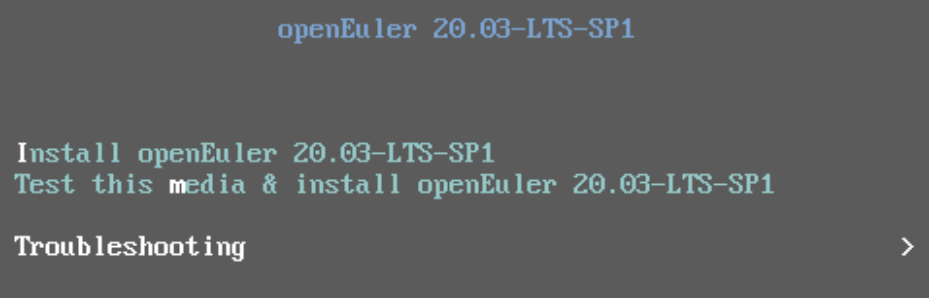

        2.  选择“rescue”

            **图 4**  选择恢复模式<a id="figure4"></a>  
            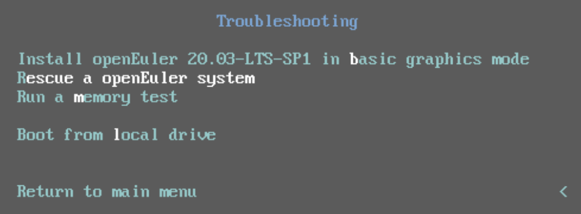


4.  进入“救援模式”后，按下数字键“1”选择“Continue”。

    **图 5**  救援模式<a id="figure5"></a>  
    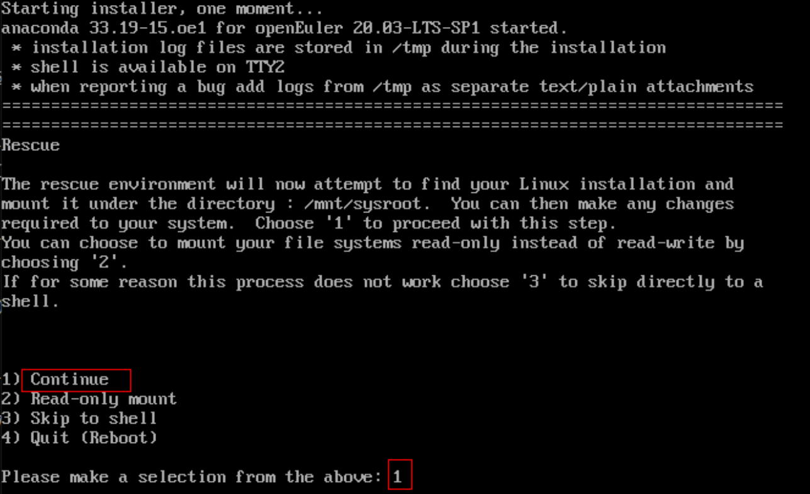

    按下回车键后，进入“Rescue Shell”

    **图 6**  Rescue Shell<a id="figure6"></a>  
    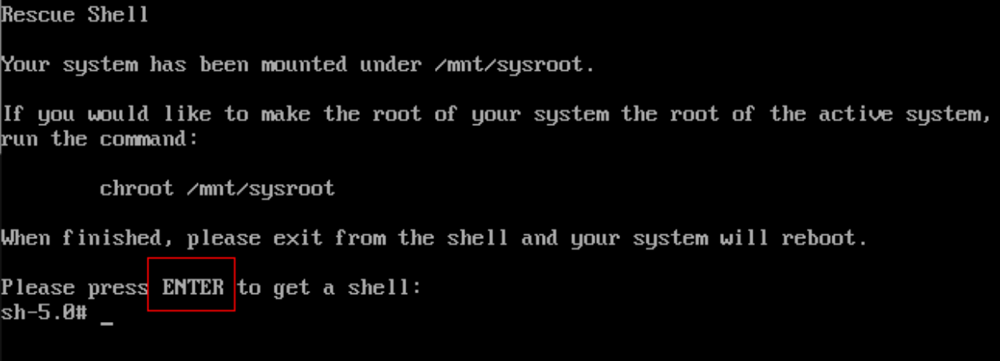

5.  执行以下命令检查当前环境是否存在x2openEuler-upgrade 软件包，若存在则跳转至[7](#li0265188125315)。

    ```
    find / -name x2openEuler-upgrade
    ```

    **图 7**  检查x2openEuler-upgrade 软件包<a id="figure7"></a>  
    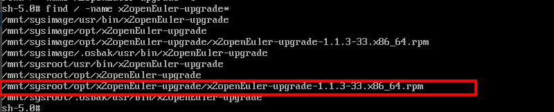

6.  为当前环境配置可用的ip地址。

    **图 8**  配置可用ip地址<a id="figure8"></a>  
    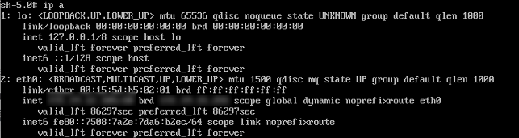

7.  <a name="li0265188125315"></a>执行以下命令，开启SSH服务，上传x2openEuler-upgrade软件包至“/root”目录下。

    ```
    mv /etc/ssh/sshd_config.anaconda /etc/ssh/sshd_config
    systemctl restart sshd
    scp root@xxx.xxx.xxx.xxx:/xxx/x2oepnEuler-upgrade* /root/ 
    ```

    **图 9**  启动SSH服务<a id="figure9"></a>  
    

    **图 10**  上传x2openEuler工具安装包至/root目录下<a id="figure10"></a>  
    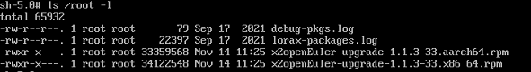

8.  执行以下命令解压安装包获取x2openEuler-upgrade软件包并进行安装。

    ```
    ln -s /usr/bin/python3 /usr/bin/python
    rpm -ivh /root/x2openEuler-upgrade-* --nodeps
    source /root/.bashrc
    ```

    **图 11**  安装x2openEuler-upgrade软件包<a id="figure11"></a>  
    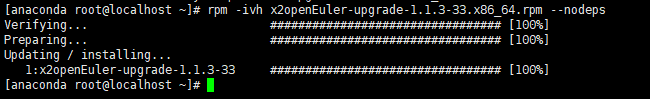

9.  执行以下命令，修改x2openEuler-upgrade配置文件，不对“/run/install”进行回滚。

    ```
    vim /mnt/sysroot/etc/sut/sut.conf 
    ```

    **图 12**  修改x2openEuler-upgrade配置文件<a id="figure12"></a>  
    

10. 执行以下命令，进行系统救援。

    ```
    x2openEuler rescue -p /mnt/sysroot/
    ```

    **图 13**  系统救援<a id="figure13"></a>  
    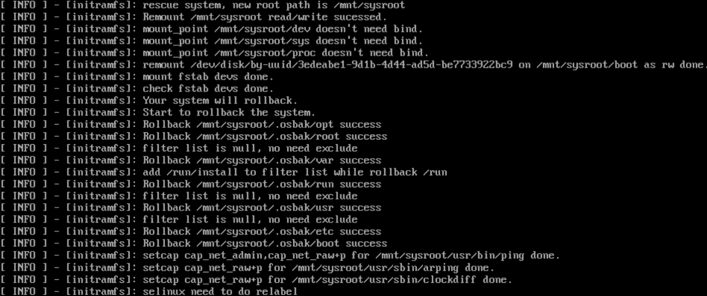

11. 系统救援完成后，执行以下命令重启系统。

    ```
    reboot
    ```

    > **说明：** 
    >系统重启之后，SELinux会进行relabel动作，物理机可能耗时较长。relabel动作触发完成后，系统会自动进行重启，此时才真正回退至最初的源操作系统。

12. 执行以下命令进行系统救援结果验证。

    ```
    cat /etc/os-release
    ```

    **图 14**  验证结果<a id="figure14"></a>  
    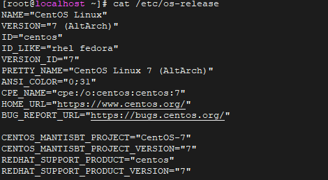

    > **说明：** 
    >-   救援完成后，可执行源操作系统命令进行验证。
    >-   可根据业务需求，执行业务恢复或适配脚本。

# 升级后部分命令无法执行
##### 现象描述
升级完成后，目标操作系统部分命令无法正常执行，报错原因为“找不到符号链接”。
##### 可能原因
升级前配置了高版本的动态依赖库，升级后会出现系统冲突。
##### 处理步骤
排查“/etc/ld.so.conf.d”目录下是存在和系统目录下的so文件冲突的配置。

# 升级失败-DNF升级报错
##### 现象描述
升级失败，排查日志为DNF软件升级报错。
##### 可能原因
查看repo源配置，检查升级软件数量。正常情况下，90%的软件包都可以升级，若升级数量较低需要检查配置的repo源是否正确，是否存在配置repo源不完全的情况。
##### 处理步骤
完整配置 everything、epol和update源。
# 升级过程漫长
##### 现象描述
源操作系统升级至目标操作系统过程耗费时间过长。
##### 可能原因
固定备份目录下存在大文件。
##### 处理步骤
1.  执行以下命令查看升级节点的文件系统，查看固定备份目录下是否存在大文件。

    ```
    df -h
    ```

2.  如有需要将对应目录填写在排查目录中。

# 升级前检查grub2版本不满足要求
##### 现象描述
升级前检查报告grub2版本不满足要求。
##### 处理步骤
若升级的目标系统为“openEuler-20.03-LTS-SP1”,需要挂载update源。
# 升级前检查报错
##### 现象描述
升级前检查报错，回显信息如下：

```
Abnormal exit,error:/etc/x2openEuler/database_2.0.0.630/centos7.4/x86_64/primary not exist
```

##### 处理步骤
1.  访问[OEPKGS](https://repo.oepkgs.net/openEuler/rpm/openEuler-20.03-LTS-SP1/contrib/x2openEuler/noarch/Packages/)，根据报错回显信息，获取对应版本数据包，例如“缺少CentOS 7.4 的数据库包需要安装x2openEuler-database-centos7.4-2.0.0.630-1.noarch.rpm，x2openEuler-database-centos7.4-openEuler20.03-LTS-SP1-2.0.0.630-1.noarch.rpm”。
2.  上传获取的数据包至部署x2openEuler工具的环境，并使用SSH远程登录工具登录。
3.  进入执行以下命令进行安装，此处以安装CentOS 7.4 对应版本数据包为例。

    ```
    rpm -ivh x2openEuler-database-centos7.4-2.0.0.630-1.noarch.rpm
    rpm -ivh x2openEuler-database-centos7.4-openEuler20.03-LTS-SP1-2.0.0.630-1.noarch.rpm
    ```

4.  进入升级任务，重新开始升级前检查。
# QEMU相关问题处理
##### 现象描述1
安装了qemu-kvm软件，在操作系统升级之后，发现软件被卸载。
##### 处理步骤
执行以下命令安装qemu软件后，再次启动虚拟机。

```
yum install qemu
```

##### 现象描述2

系统升级后安装qemu，启动虚拟机报错如下：

```
Process exited prior to exec: libvirt: QEMU Driver error : Unable to get devmapper targets for /data1/var/lib/scevm/instances/xxxxxxx/disk.qcow2: Success
```

##### 处理步骤

由于主机没有加载dm\_mod.ko导致，可以通过modprobedm\_mod来解决该异常，执行如下命令:

```
modprobe dm_mod
```


##### 现象描述3
升级完成后虚拟机启动提示machine不匹配相关异常。

##### 处理步骤
由于升级后machine不匹配，首先执行以下命令查询openEuler支持的machine类型。

```
qemu-kvm -machine help
```

之后执行以下命令修改对应虚拟机的machine参数为openEuler支持的类型，并再次启动虚拟机。

```
virsh edit
```

# 工具Web服务启动失败，提示MariaDB is not installed.
##### 现象描述
在安装x2openEuler工具之前已通过编译安装的方式安装了MariaDB。x2openEuler工具安装完成后启动工具web服务时，返回如下信息。
**图 15** 启动web服务回显信息
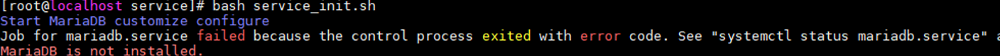
##### 可能原因
x2openEuler工具不能通过mysql.sock连接到MariaDB。
##### 处理步骤
1.  执行以下命令查询MariaDB进程的PID。
    ```
    ps -ef | grep mariadb
    ```
    获取到mariadb的PID后执行以下命令终止进程。
    ```
    kill -9 PID
    ```

2.  注释“/etc/my.cnf”中socket参数。
    1.  执行以下命令编辑my.cnf文件，按下“i”进入编辑模式。
        ```
        vi /etc/my.cnf
        ```
    2.  注释“[mysqld]”字段下的socket参数。
        ```
        # socket=/var/lib/mysql/mysql.sock
        ```
    3.  按“ESC”，输入“:wq”，按“Enter”保存并退出。

3.  执行以下命令重启MariaDB服务。
    ```
    systemctl start mariadb.service
    ```
4.  重新启动x2openEuler工具web服务。