# 通过web界面使用x2openEuler工具
## 系统升级
系统升级特性帮助用户将待升级节点的操作系统升级为目标操作系统，以保障业务的连续性和安全性。
### 创建升级任务
##### 前提条件
系统升级特性帮助用户将待升级节点的操作系统升级为目标操作系统，以保障业务的连续性和安全性。
##### 操作步骤
> **须知：** 
>x2openEuler工具单个升级任务最多支持1000个节点。
1.  在页面左侧，单击“新建任务”，选择“升级任务”进入“新建升级任务”界面，工具默认会自动生成任务名称，可修改该名称。
2.  在“新建升级任务”确认“任务名称”后，选择“批量导入”或“添加节点”，并对以下参数进行配置。
    -   批量导入:通过模板表格导入多个节点的节点信息。

        > **说明：** 
        >批量导入节点过程中，工具会对导入的节点信息进行校验，若校验不通过则需按照提示修改导入信息，并重新进行批量导入操作。

        1.  在批量导入界面中，单击“模板表格”获取模板后参考[表1](#sheet1)填写节点信息。

            **图 1**  批量导入<a id="figure1"></a>  
            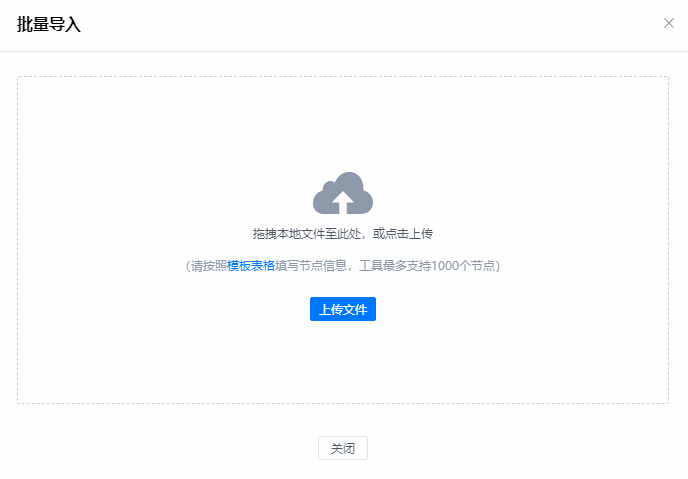

        2.  完成节点信息的填写后单击“上传文件”阅读“SSH传输须知”，选择已填写节点信息的批量导入文件进行上传。

            **图 2**  SSH传输须知<a id="figure2"></a>  
            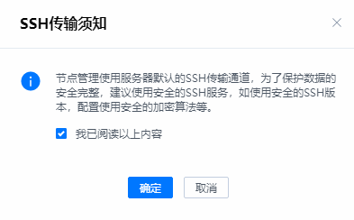

    -   添加节点：添加单个节点的节点节点信息。

        在“添加节点”页面，参考[表1](#sheet1)输入相应信息后，单击“确定”进行节点添加。

        **表 1**  节点信息参数说明
        <a id="sheet1"></a>
        <table><thead align="left">
            <tr>
                <th>参数</th>
                <th>说明</th>
            </tr>
            <tr>
                <td>SSH传输须知</td>
                <td>节点管理使用服务器默认的SSH传输通道，为了保护数据的安全完整，建议使用安全的ssh服务，如使用安全的ssh版本，配置使用安全的加密算法等。</td>
            </tr>
            <tr>
                <td>待升级节点IP</td>
                <td>待升级节点IP地址。<br>说明：</br>待升级节点与部署openEuler web工具的环境需要保持可联通状态。</td>
            </tr>
            <tr>
                <td>节点别名</td>
                <td>待升级节点别名，该别名用于标记该节点用途。</td>
            </tr>
            <tr>
                <td>端口</td>
                <td>登录待升级节点的SSH协议端口。</td>
            </tr>
            <tr>
                <td>用户名</td>
                <td>登录待升级节点的用户名。</td>
            </tr>
            <tr>
                <td rowspan="2">认证方式</td>
                <td>密钥认证：通过私钥文件和私钥文件的密码短语进行认证。
                    <ul>
                        <li>私钥文件：登录待升级节点私钥文件的绝对路径。
                        </li>
                        <li>密码短语：登录待升级节点私钥文件的密码短语。配置秘钥认证方式请参考<a href="CommonOperation.md#configkey">配置生成秘钥</a>。</li>
                    </ul>
                </td>
            </tr>
            <tr>
                <td>
                口令认证：通过口令进行认证。<br>口令：登录待升级节点的密码口令。<br>说明：
                <ul>
                    <li>若登录用户为普通用户，需要输入root用户口令切换到root用户进行具体操作，由于root用户拥有最高权限，直接使用root用户登录服务器可能会存在安全风险。您可以通过配置禁止root用户SSH登录的选项，来提升系统安全性。具体配置如下：先以普通用户登录服务器，切换至root登录后检查/etc/ssh/sshd_config配置项PermitRootlogin，如果显示no，说明禁止了root用户登录；如果显示yes，则需要将配置项PermitRootlogin设置为no。配置完成后需要重启sshd服务确保配置生效。</li>
                    <li>配置的节点信息中涉及用户密码输入，请注意定期维护账户信息，确保环境安全。</li>
                </ul>
                </td>
            </tr>
            <tr>
                <td>源操作系统版本</td>
                <td>待升级节点的操作系统，默认为CentOS 7.6，可通过<a href="CommonOperation.md#updatedatabasepackage">上传操作系统数据库支持包</a>支持更多操作系统。</td>
            </tr>
            <tr>
                <td>目标操作系统版本</td>
                <td>待升级节点的操作系统，默认为openEuler 20.03-LTS-SP1，可通过<a href="CommonOperation.md#updatedatabasepackage">上传操作系统数据库支持包</a>支持更多操作系统。</td>
            </tr>
            <tr>
                <td>repo源配置</td>
                <td>输入已配置的repo源名称或单击右侧“选择”进行选择已配置的待升级节点在升级过程中需要的repo源，可参考<a href="CommonOperation.md#configrepo">配置repo源</a>进行配置。</td>
            </tr>
            <tr>
                <td>业务软件</td>
                <td>须知：
                    <ul>
                        <li>未填写业务软件则不会生成软件评估报告。不需升级的业务软件（rpm包）优先级高于业务软件（rpm包）。</li>
                        <li>输入多个软件目录或rpm包名称时，请用英文逗号分隔。</li>
                        <li>业务软件（rpm包）：使用rpm包安装的业务软件，只需填写主软件名称即可，例如安装了docker只需填写docker既可。 工具将检查该软件是否存在对应的openEuler版本，存在则自动升级软件。 若不存在，将进行软件兼容性检查，如果该软件兼容openEuler，则保留该业务软件，检查不通过则无法升级节点。</li>
                        <li>业务软件（目录）：使用解压包，源码编译安装的软件，需填写业务软件实际的路径， 该路径只能包含业务软件，不能包含其他与业务软件不相关的文件。 工具将检查该软件在openEuler操作系统上的兼容性， 检查通过后即可升级节点并保留原始业务软件，检查不通过则无法升级节点。</li>
                        <li>不需升级的业务软件（rpm包）：使用rpm包安装的业务软件，只需填写主软件名称即可，例如安装了docker只需填写docker即可。 工具将检查该软件在openEuler操作系统上的兼容性，检查通过后即可升级节点并保留原始版本包。 检查不通过则无法升级节点。</li>
                        <li>升级后新安装软件：使用rpm包安装的业务软件，只需填写主软件名称即可。例如操作系统升级后安装了docker只需填写docker即可。工具将检查该软件在openEuler操作系统上的兼容性，检查通过后即可在升级后安装该软件。检查不通过则无法安装该软件。</li>
                    </ul>
                </td>
            </tr>
            <tr>
                <td colspan="2">高级配置</td>
            </tr>
            <tr>
                <td>升级方案</td>
                <td>升级方案名称</td>
            </tr>
            <tr>
                <td>备份目录</td>
                <td><p>待升级操作系统需要进行备份的目录。</p>
                    <p>默认备份目录：/etc,/usr,/boot,/var,/run,/opt/sutcheck_result,以及所有rpm包文件，多个备份目录间需要用逗号隔开。</p>
                    说明：
                    <ul>
                        <li>升级过程中会自动备份数据。默认备份<b>/usr</b> 、<b>/run</b> 、<b>/boot</b> 、<b>/var</b>和<b>/etc</b>目录当中的文件，备份文件将被储存在<b>/.osbak</b>目录下。</li>
                        <li>只需备份系统运行需要的文件目录，无需备份业务数据，如果业务数据直接存放在默认备份系统目录下， 或者通过挂载方式挂载在默认备份系统目录下，则需要将业务数据目录填写在排除目录一栏。备份目录一般情况无需额外填写。</li>
                    </ul>
                </td>
            </tr>
            <tr>
                <td>备份文件存放位置</td>
                <td>用于指定节点升级时，备份文件存放的目录，不填写则默认存放在/.osbak</td>
            </tr>
            <tr>
                <td>排除目录</td>
                <td>待升级操作系统中不需要备份的目录，多个备份目录间需要用用逗号隔开。</td>
            </tr>
            <tr>
                <td>冲突软件配置</td>
                <td>升级前检查检测得到的冲突包一起被删除（注意：有些系统依赖的重要软件包不能被删除）， 若不填写，则默认使用升级前检查得到的冲突包。</td>
            </tr>
            <tr>
                <td>cmdline配置</td>
                <td>升级后目标操作系统内核启动项，不填写则和升级前保持一致。</td>
            </tr>
            <tr>
                <td>swap软件包配置</td>
                <td>部分软件包无法被升级，需要手动替换，如想将A包在升级后替换成B包，则需填写A->B。</td>
            </tr>
            <tr>
                <td colspan="2">须知：
                    <ol>
                        <li>前后置脚本上传格式为固定xxx.tar.gz包，xxx是压缩目录名称且解压目录一级必须有“run.sh”文件做为脚本执行入口，工具会根据“run.sh”的返回值来判断脚本是否执行成功。 脚本将在待升级节点上运行，请确保上传脚本无安全风险。</li>
                        <li>脚本上传路径默认为“/opt/x2openEuler/scripts-execute/upload/”。</li>
                        <li>使用chown -R x2openEuler:x2openEuler xxx.tar.gz修改文件拥有者和群组。</li>
                    </ol>
                </td>
            </tr>
            <tr>
                <td>前置脚本</td>
                <td>启用该项后，需填写前置脚本路径，前置脚本运行在环境检查后。</td>
            </tr>
            <tr>
                <td>后置脚本（重启前）</td>
                <td>启用该项后，需填写后置脚本（重启前）路径，该脚本运行在升级完成重启前。</td>
            </tr>
            <tr>
                <td>后置脚本（重启后）</td>
                <td>启用该项后，需填写后置脚本（重启后）路径，该脚本运行在升级完成重启后。</td>
            </tr>
        </table>
3.  此处以添加单个节点进行指纹验证为例，工具对导入的节点信息校验完成后，进入节点指纹验证页面，确认节点指纹无误后，单击“确定”。

    **图 3**  指纹验证<a id="figure3"></a>  
    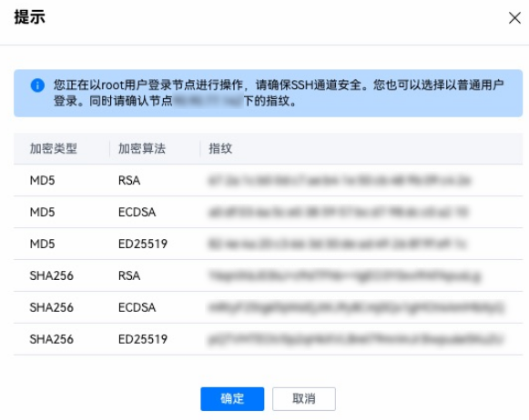

4.  节点添加完成，确认添加节点信息无误后，单击任务名称右侧“确定”，完成升级任务创建。若需要修改或删除相应节点，单击右侧“操作”项下的“修改”或“删除”对节点进行操作。单击右下角“确认”启动升级任务，单击右下角“取消”，取消升级任务。

    > **说明：** 
    >升级任务创建完成后，工具会自动对升级任务中配置的待升级节点进行环境检查，环境检查通过后才能进行后续升级操作。若环境检查失败，请检查并修改节点配置信息。

    **图 4**  升级任务信息确认<a id="figure4"></a>  
    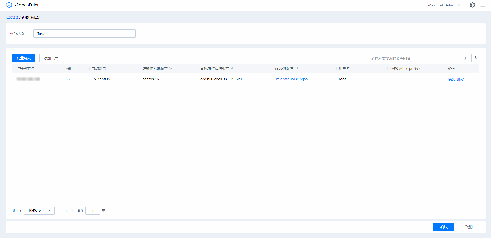
   

### 进行节点升级
##### 前提条件
-   已登录x2openEuler工具。
-   已创建升级任务。
##### 操作步骤
1.  在页面“全部任务”下选择需要进行升级的任务，单击右侧“进入任务”，进入任务详情页面。
2.  单击节点信息右侧的“开始分析”，可对单个节点进行升级。同时勾选多个节点，单击左上角“批量操作”，可对多个节点启动分析任务。

    节点升级过程分为多个阶段，其中任意阶段失败都可能会导致后续升级过程终止。

    > **说明：** 
    >-   升级过程中在不同的升级阶段结束后可单击右下角“初始化”，使待升级节点回归待测试状态。
    >-   导入前后置脚本后，升级任务中会增加“前置脚本执行”和“后置脚本执行”阶段。
    >-   若升级过程中需要进行回退，可进行[回退一致性配置](CommonOperation.md#backupsync)， 配置内容将不会进行一致性检查。配置之后仅在下一次回退才会生效。

    **图 5**  初始化节点<a id="figure5"></a>  
    
    1.  环境检查

        环境检查用于分析x2openEuler工具与待升级节点的环境连通性，验证repo源是否处于可用状态，若环境检查无法通过，则需参考对应检查项操作建议修改节点配置信息。如需进行自定义环境检查请参考[自定义环境检查](CommonOperation.md#envcheck)。

        **图 6**  环境检查页面<a id="figure6"></a>  
        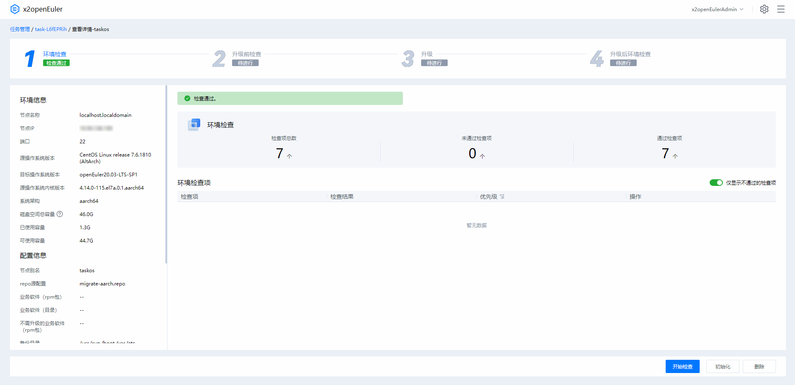

    2.  升级前检查
        针对待升级节点进行配置文件升级策略、软件、硬件兼容性评估及软件和服务冲突检查，产生相应评估报告，确认待升级节点是否符合升级要求。若出现兼容性不通过的情况，则需参考评估报告进行软件适配。评估报告参数详细说明请参考[表 升级前检查报告参数说明](#sheet2)、[表3](#sheet3)、[表4](#sheet4)、[表5](#sheet5)和[表6](#sheet6)。

        **图 7**  升级前检查<a id="figure7"></a>  
        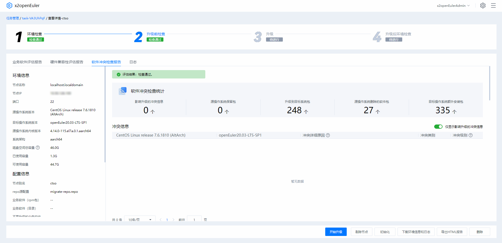

        **表 2**  升级前检查报告参数说明
        <a id="sheet2"></a>
        <table><thead align="left">
            <tr>
                <th>参数</th>
                <th>说明</th>
            </tr>
            <tr>
                <td>检查项</td>
                <td>检查项为从源操作系统升级到目标操作系统的服务、相关策略和配置。</td>
            </tr>
            <tr>
                <td>检查结果</td>
                <td><p>显示检查项是否通过升级前检查。</p>
                    <ul>
                        <li>通过</li>
                        <li>不通过</li>
                    </ul>
                </td>
            </tr>
            <tr>
                <td>优先级</td>
                <td><p>显示检查项对升级的影响：</p>
                    <ul>
                        <li>高：可能会导致升级出现中止异常。</li>
                        <li>中：可能会导致升级过程中出现异常，但不一定会中止升级进程。</li>
                        <li>低：可能导致升级过程中出现异常，但不会影响升级进程。</li>
                    </ul>
                </td>
            </tr>
            <tr>
                <td>操作</td>
                <td>针对不通过检查项提供不通过原因和解决方案。</td>
            </tr>
        </table>

        **表 3** 配置文件升级策略
        <a id="sheet3"></a>
        <table><thead align="left">
            <tr>
                <th>参数</th>
                <th>说明</th>
            </tr>
            <tr>
                <td>源操作系统软件包及配置</td>
                <td>
                    显示源操作系统升级过程中涉及的软件包及其相关信息。
                </td>
            </tr>
            <tr>
                <td>升级策略</td>
                <td>
                    <p>针对源操作系统中升级涉及的软件包的相应策略：</p>
                    <ul>
                        <li>覆盖：升级完成后将覆盖安装该软件包。</li>
                        <li>保留：升级完成后将继续保留该软件包。</li>
                        <li>删除：升级完成后移除该软件。</li>
                    </ul>  
                </td>
            </tr>
        </table>

        **表 4** 业务软件评估报告结果参数说明
        <a id="sheet4"></a>
        <table><thead align="left">
            <tr>
                <th>参数</th>
                <th>说明</th>
            </tr>
            <tr>
                <td>评估结果</td>
                <td>显示评估软件名称、源操作系统、目标操作系统、系统架构以及评估结果等评估任务信息。</td>
            </tr>
            <tr>
                <td>操作建议</td>
                <td>依据评估报告中的兼容性结果，提供对应解决方案建议。</td>
            </tr>
            <tr>
                <td>依赖包兼容性</td>
                <td><p>显示软件安装所需要的直接依赖以及依赖文件在各个系统上对应的rpm包。</p>
                <ul>
                    <li>若查询到的直接依赖的rpm的名字和版本都一样，会显示 <b>版本未变更</b></li>
                    <li>若查询到的直接依赖的rpm的版本不一样，但接口无差异，会显示 <b>版本有变更</b></li>
                    <li>若查询到的直接依赖的rpm的包名发生变化，但接口无差异，会显示 <b>包名有变更</b></li>
                    <li>若源操作系统查到rpm，目标操作系统没有查到，会显示 <b>缺失</b></li>
                    <li>若源操作系统没有查到rpm，目标操作系统有查到，或者所在包有接口变化则会显示， <b>需要检查</b></li>
                    <li>若源操作系统和目标操作系统都没有查到rpm，则会放到 other 里边，并显示 <b>需要检查</b></li>
                </ul>
                </td>
            </tr>
            <tr>
                <td>接口兼容性（C/C++）</td>
                <td>
                    <ul>
                        <li>调用函数名称：表示被评估软件中调用的函数名称。</li>
                        <li>调用的接口程序：表示被评估软件中被存在差异的外部接口调用的程序。</li>
                        <li>结果：<ul>
                            <li>已移除：表示缺失的接口。</li>
                            <li>已变更：表示函数入参，返回值，或者实现有变化</li>
                        </ul></li>
                        <li>展开的详细信息中：
                            <ul>
                                <li>操作系统：表示迁移评估的系统名称。</li>
                                <li>函数名：接口表示。</li>
                                <li>文件名：表示外部接口所在的文件名。</li>
                                <li>依赖包：表示接口所在的外部so库。</li>
                                <li>接口差异项：表示外部接口的变化差异，如果是已移除接口，则此项为空。</li>
                            </ul>
                        </li>
                    </ul>
                </td>
            </tr>
            <tr>
                <td>接口兼容性（JDK）</td>
                <td>
                    <p>表示扫描Jar包中调用的jdk接口在待迁移的系统上对应满足运行条件的最小jdk上发生的变更。</p>
                    <ul>
                        <li>openEuler jdk：openEuler上满足Jar包运行环境的最小jdk版本。</li>
                        <li>对象构建jdk：扫描jar包对应构建的jdk版本。</li>
                        <li>jar包名：扫描的jar包名称。</li>
                        <li>方法名：存在接口差异的方法名。</li>
                        <li>函数调用签名：存在接口差异的方法函数签名。</li>
                        <li>包名：存在接口差异的方法所在的包（packageName+className）。</li>
                        <li>差异项：接口差异选项。</li>                    
                    </ul>
                </td>
            </tr>
            <tr>
                <td>接口兼容性（Java）</td>
                <td>
                    <p>Jar接口差异主要描述了当前jar包接口在待迁移的系统上发生的变更。</p>
                    <ul>
                        <li>调用的jar包：表示当前被调用的jar包名称。</li>
                        <li>所属的rpm包：表示当前的jar包所属的rpm包。</li>
                        <li>展开的详细信息中：
                            <ul>
                                <li>centos7.6 Methods：表示CentOS 7.6上不兼容的接口名称。</li>
                                <li>package：表示不兼容的接口所属的jar包。</li>
                                <li>class：表示不兼容的接口所属的类。</li>
                                <li>openEuler20.03-LTS-SP1 Change：表示不兼容的接口在openEuler20.03-LTS-SP1上发生的变更，这部分变更描述包含了方法的移除，方法返回参数、方法签名、方法修饰、异常等变更。</li>
                            </ul>
                        </li>
                    </ul>
                </td>
            </tr>
        </table>

        **表 5** 硬件兼容性评估报告结果参数说明
        <a id="sheet5"></a>
        <table><thead align="left">
            <tr>
                <th>参数</th>
                <th>说明</th>
            </tr>
            <tr>
                <td>评估结果</td>
                <td>显示评估环境中的系统、基本系统、CPU以及整机兼容性信息。</td>
            </tr>
            <tr>
                <td>板卡在openEuler 20.03 LTS SP1 兼容性清单</td>
                <td>
                    <p>板卡兼容必须满足兼容性清单中参数与已有板卡清单列表中的信息都保持一致才算兼容。若对比字段信息不完全一致，则属于待确认板卡。</p>
                    <ul>
                        <li>芯片厂商ID</li>
                        <li>设备ID</li>
                        <li>二级厂商制造ID</li>
                        <li>二级设备ID</li>
                        <li>芯片型号</li>
                        <li>是否在兼容性清单：确认该硬件是否兼容目标操作系统</li>
                        <li>风险级别：对硬件兼容性影响升级的风险进行等级评估</li>
                    </ul>   
                </td>
            </tr>
        </table>

        **表 6** 软件冲突检查报告结果参数说明
        <a id="sheet6"></a>
        <table><thead align="left">
            <tr>
                <th>参数</th>
                <th>说明</th>
            </tr>
            <tr>
                <td>软件冲突检查统计</td>
                <td>显示评估环境升级中存在的冲突信息、源操作系统保留包、升级到目标系统包、升级到openEuler拓展仓库包、源操作系统删除的软件包和目标操作系统额外安装包等相关信息。</td>
            </tr>
            <tr>
                <td>冲突信息</td>
                <td>描述了源操作系统与升级目标操作系统中存在的软件包冲突信息。</td>
            </tr>
            <tr>
                <td>源操作系统保留包</td>
                <td>升级至目标操作系统后保留的源操作系统软件包。</td>
            </tr>
            <tr>
                <td>升级到目标系统包</td>
                <td>升级至目标操作系统后的同时升级的软件包信息。</td>
            </tr>
            <tr>
                <td>升级到openEuler拓展仓库包</td>
                <td>升级至openEuler操作系统后拓展的软件包信息。</td>
            </tr>
            <tr>
                <td>源操作系统删除的软件包</td>
                <td>升级至目标操作系统后移除的源操作系统软件包。</td>
            </tr>
            <tr>
                <td>目标操作系统额外安装包</td>
                <td>升级至目标操作系统后额外安装的软件包。</td>
            </tr>
        </table>
        升级前检查完成后，单击右下角“导出HTML报告”即可导出检查报告。单击“下载环境信息和日志”获取检查过程中收集的环境信息和任务执行日志。若升级前检查未通过，可单击右下角“重试”重新尝试升级检查或单击“剔除节点”清除该节点当前状态，剔除后单击“恢复”可恢复至剔除前状态。
    
    3.  升级和数据备份

        > **说明：**
        >升级过程中会自动备份数据。默认备份/usr 、/run、/boot、/var和/etc目录当中的文件，备份文件将被储存在/.osbak目录下。
            
        环境检查和升级前检查通过后，进入节点升级阶段。升级完成后，单击“重启节点”或手动启动升级节点，确保升级完成。单击“下载环境信息和日志”获取升级过程中收集的环境信息和运行日志。
        **图 8**  节点升级<a id="figure8"></a>  
        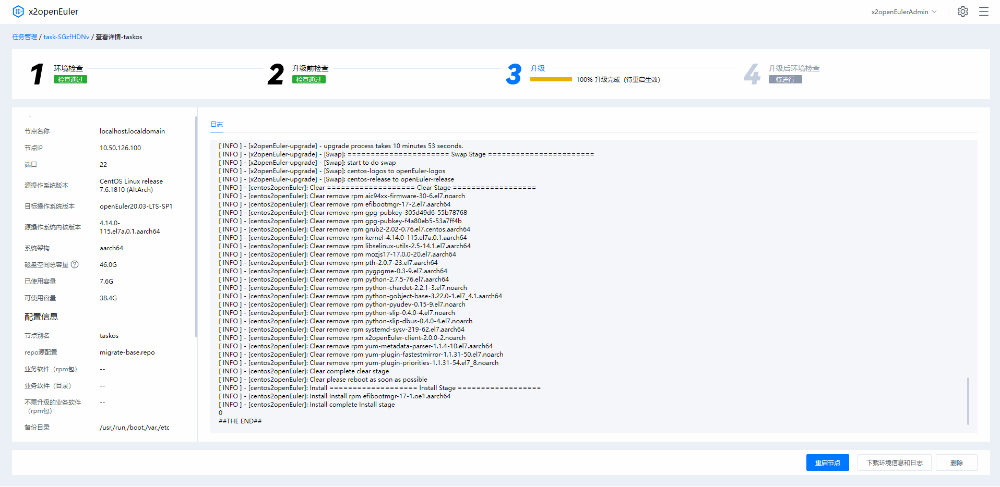

        节点重启成功后，单击“开始检查”进入“升级后环境检查”阶段。

    4.  升级后环境检查

        升级后环境检查会对升级后操作系统命令、软件包及服务等进行检查并生成巡检报告，如需自定义巡检项则可参考[自定义健康巡检](CommonOperation.md#healthcheck)。升级完成后建议清理备份数据，以节约节点空间。如需进行回退操作，则可以选择保留备份数据。

        > **说明：** 
        >升级完成后，需进行业务运行验证，若业务运行正常，即可进行备份数据清理，以释放占用空间。

3.  升级完成后，参考[升级后验证](#upgradeeverfy)进行升级后环境验证。

    > **说明：** 
    >系统重启之后，SELinux会进行relabel动作，物理机可能耗时较长。relabel动作触发完成后，系统会自动进行重启，此时才真正升级至目标操作系统。

### 升级后验证<a id="upgradeeverfy"></a>
##### 前提条件

升级完成后，需进行以下操作对升级后环境进行验证，确保升级完成。

##### 操作步骤

1.  执行以下命令，检查操作系统版本是否已升级至目标操作系统。

    ```
    cat /etc/os-release
    ```

    如显示以下信息则表示已升级至目标操作系统。

    ```
    NAME="openEuler"
    VERSION="20.03 (LTS-SP1)"
    ID="openEuler"
    VERSION_ID="20.03"
    PRETTY_NAME="openEuler 20.03 (LTS-SP1)"
    ANSI_COLOR="0;31"
    ```

2.  进行openEuler系统命令验证，能够正常运行即表示已升级至目标操作系统。
3.  （可选）升级完成后，可根据业务需求，执行业务恢复或适配脚本。
4.  检查业务状态是否运行正常。

## 系统信息收集评估
系统信息收集评估任务收集待升级节点信息，针对待升级节点进行软件、硬件兼容性评估及软件冲突检查，产生相应评估报告，确认待升级节点是否符合升级要求。
### 创建系统信息收集评估
##### 前提条件
已登录x2openEuler工具。
##### 操作步骤
1.  在页面左侧，单击“新建任务”，选择“系统信息收集评估”进入“新建升级任务”界面，工具默认会自动生成任务名称，可修改该名称。

2.  在“新建系统信息收集评估任务”确认“任务名称”后，选择“批量导入”或“添加节点”，并对以下参数进行配置。
    -   批量导入:通过模板表格导入多个节点的节点信息。

        > **说明：** 
        >批量导入节点过程中，工具会对导入的节点信息进行校验，若校验不通过则需按照提示修改导入信息，并重新进行批量导入操作。

        1.  在批量导入界面中，单击“模板表格”获取模板后参考[表7](#sheet7)填写节点信息。

            **图 9**  批量导入<a name="figure9"></a>  
            

        2.  完成节点信息的填写后单击“上传文件”阅读“SSH传输须知”，选择已填写节点信息的批量导入文件进行上传。

            **图 10**  SSH传输须知<a name="figure10"></a>  
            

    -   添加节点：添加单个节点的节点节点信息。
        在“添加节点”页面，参考[表7](#sheet7)输入相应信息后，单击“确定”进行节点添加。
        **表 7**  节点信息参数说明
        <a id="sheet7"></a>
        <table><thead align="left">
            <tr>
                <th>参数</th>
                <th>说明</th>
            </tr>
            <tr>
                <td>SSH传输须知</td>
                <td>节点管理使用服务器默认的SSH传输通道，为了保护数据的安全完整，建议使用安全的ssh服务，如使用安全的ssh版本，配置使用安全的加密算法等。</td>
            </tr>
            <tr>
                <td>待升级节点IP</td>
                <td>待升级节点IP地址。<br>说明：</br>待升级节点与部署openEuler web工具的环境需要保持可联通状态。</td>
            </tr>
            <tr>
                <td>节点别名</td>
                <td>待升级节点别名，该别名用于标记该节点用途。</td>
            </tr>
            <tr>
                <td>端口</td>
                <td>登录待升级节点的SSH协议端口。</td>
            </tr>
            <tr>
                <td>用户名</td>
                <td>登录待升级节点的用户名。</td>
            </tr>
            <tr>
                <td rowspan="2">认证方式</td>
                <td>密钥认证：通过私钥文件和私钥文件的密码短语进行认证。
                    <ul>
                        <li>私钥文件：登录待升级节点私钥文件的绝对路径。
                        </li>
                        <li>密码短语：登录待升级节点私钥文件的密码短语。配置秘钥认证方式请参考<a href="CommonOperation.md#configkey">配置生成秘钥</a>。</li>
                    </ul>
                </td>
            </tr>
            <tr>
                <td>
                口令认证：通过口令进行认证。<br>口令：登录待升级节点的密码口令。<br>说明：
                <ul>
                    <li>若登录用户为普通用户，需要输入root用户口令切换到root用户进行具体操作，由于root用户拥有最高权限，直接使用root用户登录服务器可能会存在安全风险。您可以通过配置禁止root用户SSH登录的选项，来提升系统安全性。具体配置如下：先以普通用户登录服务器，切换至root登录后检查/etc/ssh/sshd_config配置项PermitRootlogin，如果显示no，说明禁止了root用户登录；如果显示yes，则需要将配置项PermitRootlogin设置为no。配置完成后需要重启sshd服务确保配置生效。</li>
                    <li>配置的节点信息中涉及用户密码输入，请注意定期维护账户信息，确保环境安全。</li>
                </ul>
                </td>
            </tr>
            <tr>
                <td>源操作系统版本</td>
                <td>待升级节点的操作系统，默认为CentOS 7.6，可通过<a href="CommonOperation.md#updatedatabasepackage">上传操作系统数据库支持包</a>支持更多操作系统。</td>
            </tr>
            <tr>
                <td>目标操作系统版本</td>
                <td>待升级节点的操作系统，默认为openEuler 20.03-LTS-SP1，可通过<a href="CommonOperation.md#updatedatabasepackage">上传操作系统数据库支持包</a>支持更多操作系统。</td>
            </tr>
            <tr>
                <td>repo源配置</td>
                <td>输入已配置的repo源名称或单击右侧“选择”进行选择已配置的待升级节点在升级过程中需要的repo源，可参考<a href="CommonOperation.md#configrepo">配置repo源</a>进行配置。</td>
            </tr>
            <tr>
                <td>业务软件</td>
                <td>须知：
                    <ul>
                        <li>未填写业务软件则不会生成软件评估报告。不需升级的业务软件（rpm包）优先级高于业务软件（rpm包）。</li>
                        <li>输入多个软件目录或rpm包名称时，请用英文逗号分隔。</li>
                        <li>业务软件（rpm包）：使用rpm包安装的业务软件，只需填写主软件名称即可，例如安装了docker只需填写docker既可。 工具将检查该软件是否存在对应的openEuler版本，存在则自动升级软件。 若不存在，将进行软件兼容性检查，如果该软件兼容openEuler，则保留该业务软件，检查不通过则无法升级节点。</li>
                        <li>业务软件（目录）：使用解压包，源码编译安装的软件，需填写业务软件实际的路径， 该路径只能包含业务软件，不能包含其他与业务软件不相关的文件。 工具将检查该软件在openEuler操作系统上的兼容性， 检查通过后即可升级节点并保留原始业务软件，检查不通过则无法升级节点。</li>
                        <li>不需升级的业务软件（rpm包）：使用rpm包安装的业务软件，只需填写主软件名称即可，例如安装了docker只需填写docker即可。 工具将检查该软件在openEuler操作系统上的兼容性，检查通过后即可升级节点并保留原始版本包。 检查不通过则无法升级节点。</li>
                        <li>升级后新安装软件：使用rpm包安装的业务软件，只需填写主软件名称即可。例如操作系统升级后安装了docker只需填写docker即可。工具将检查该软件在openEuler操作系统上的兼容性，检查通过后即可在升级后安装该软件。检查不通过则无法安装该软件。</li>
                    </ul>
                </td>
            </tr>  
        </table>
        
3.  此处以添加单个节点进行指纹验证为例，工具对导入的节点信息校验完成后，进入  节点指纹验证页面，确认节点指纹无误后，单击“确定”。

    **图 11**  指纹验证<a id="figure11"></a>  
    

4.  节点添加完成，确认添加节点信息无误后，单击任务名称右侧“确定”，完成系统信息收集评估任务创建。若需要修改或删除相应节点，单击右侧“操作”项下的“修改”或“删除”对节点进行操作。单击右下角“确认”启动升级任务，单击右下角“取消”，取消任务。

    > **说明：** 
    >任务创建完成后，工具会自动对系统信息收集评估任务中配置的待升级节点进行环境检查，环境检查通过后才能进行后续收集分析任务。若环境检查失败，请检查并修改节点配置信息。

    **图 12**  系统信息收集评估任务创建信息确认<a id="figure12"></a>  
    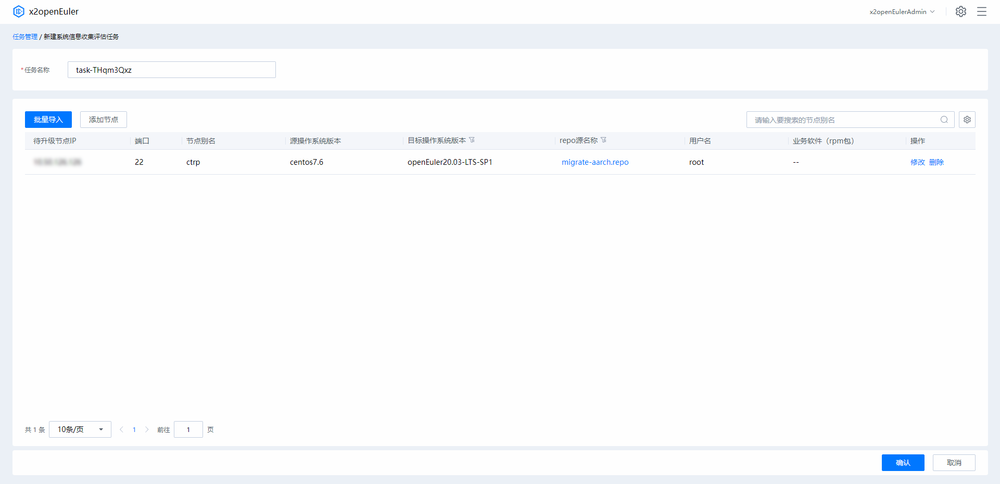

### 进行系统信息收集评估
##### 前提条件

已创建系统信息收集评估任务。

##### 操作步骤

1.  在页面“全部任务”下选择系统信息收集评估任务，单击右侧“进入任务”，进入任务详情页面。

2.  单击节点信息右侧的“开始测试”，可对单个节点进行环境检查。同时勾选多个节点，单击左上角“批量操作”，可对多个节点启动评估任务。

    节点信息收集评估任务分为2个阶段，其中任意阶段失败都会导致任务终止。

    > **说明：** 
    >-   升级过程中在不同的升级阶段结束后可单击右下角“初始化”，使待升级节点回归待测试状态。
    >-   导入前后置脚本后，升级任务中会增加“前置脚本执行”和“后置脚本执行”阶段。
    >-   若升级过程中需要进行回退，可进行[回退一致性配置](CommonOperation.md#backupsync)， 配置内容将不会进行一致性检查。配置之后仅在下一次回退才会生效。

    **图 13** 初始化节点<a id="figure13"></a>
    

    1.  环境检查

        环境检查用于分析x2openEuler工具与待升级节点的连通性，验证环境信息是否正常，若环境检查无法通过，则需修改节点配置信息。

        **图 11**  环境检查页面<a id="figure11"></a>  
        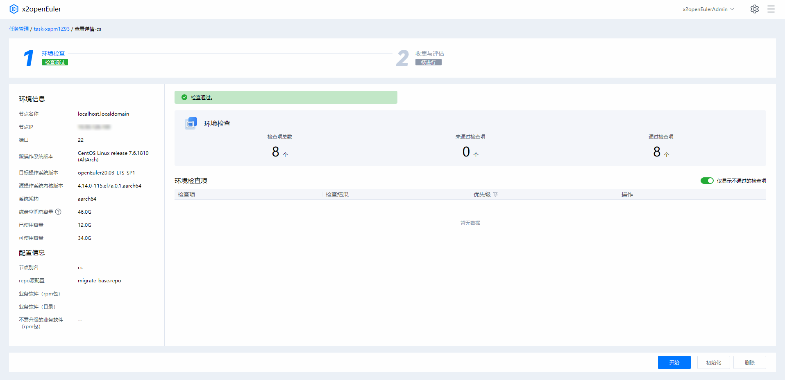    

    2.  收集与评估

        针对待升级节点进行软件、硬件兼容性评估及软件冲突检查，产生相应评估报告，确认待升级节点是否符合升级要求。若出现兼容性不通过的情况，则需参考评估报告进行软件适配。评估报告参数详细说明请参考[表8](#sheet8)、[表9](#sheet9)和[表10](#sheet10)。

        **图 12**  收集与评估<a id="figure12"></a>  
        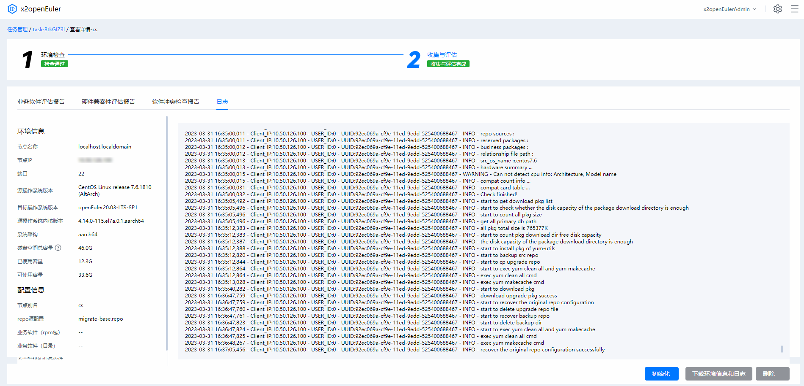

        **表 8**  业务软件评估报告结果参数说明
        <a id="sheet8"></a>
        <table><thead align="left">
            <tr>
                <th>参数</th>
                <th>说明</th>
            </tr>
            <tr>
                <td>评估结果</td>
                <td>显示评估软件名称、源操作系统、目标操作系统、系统架构以及评估结果等评估任务信息。</td>
            </tr>
            <tr>
                <td>操作建议</td>
                <td>依据评估报告中的兼容性结果，提供对应解决方案建议。</td>
            </tr>
            <tr>
                <td>依赖包兼容性</td>
                <td><p>显示软件安装所需要的直接依赖以及依赖文件在各个系统上对应的rpm包。</p>
                <ul>
                    <li>若查询到的直接依赖的rpm的名字和版本都一样，会显示 <b>版本未变更</b></li>
                    <li>若查询到的直接依赖的rpm的版本不一样，但接口无差异，会显示 <b>版本有变更</b></li>
                    <li>若查询到的直接依赖的rpm的包名发生变化，但接口无差异，会显示 <b>包名有变更</b></li>
                    <li>若源操作系统查到rpm，目标操作系统没有查到，会显示 <b>缺失</b></li>
                    <li>若源操作系统没有查到rpm，目标操作系统有查到，或者所在包有接口变化则会显示， <b>需要检查</b></li>
                    <li>若源操作系统和目标操作系统都没有查到rpm，则会放到 other 里边，并显示 <b>需要检查</b></li>
                </ul>
                </td>
            </tr>
            <tr>
                <td>接口兼容性（C/C++）</td>
                <td>
                    <ul>
                        <li>调用函数名称：表示被评估软件中调用的函数名称。</li>
                        <li>调用的接口程序：表示被评估软件中被存在差异的外部接口调用的程序。</li>
                        <li>结果：<ul>
                            <li>已移除：表示缺失的接口。</li>
                            <li>已变更：表示函数入参，返回值，或者实现有变化</li>
                        </ul></li>
                        <li>展开的详细信息中：
                            <ul>
                                <li>操作系统：表示迁移评估的系统名称。</li>
                                <li>函数名：接口表示。</li>
                                <li>文件名：表示外部接口所在的文件名。</li>
                                <li>依赖包：表示接口所在的外部so库。</li>
                                <li>接口差异项：表示外部接口的变化差异，如果是已移除接口，则此项为空。</li>
                            </ul>
                        </li>
                    </ul>
                </td>
            </tr>
            <tr>
                <td>接口兼容性（JDK）</td>
                <td>
                    <p>表示扫描Jar包中调用的jdk接口在待迁移的系统上对应满足运行条件的最小jdk上发生的变更。</p>
                    <ul>
                        <li>openEuler jdk：openEuler上满足Jar包运行环境的最小jdk版本。</li>
                        <li>对象构建jdk：扫描jar包对应构建的jdk版本。</li>
                        <li>jar包名：扫描的jar包名称。</li>
                        <li>方法名：存在接口差异的方法名。</li>
                        <li>函数调用签名：存在接口差异的方法函数签名。</li>
                        <li>包名：存在接口差异的方法所在的包（packageName+className）。</li>
                        <li>差异项：接口差异选项。</li>                    
                    </ul>
                </td>
            </tr>
            <tr>
                <td>接口兼容性（Java）</td>
                <td>
                    <p>Jar接口差异主要描述了当前jar包接口在待迁移的系统上发生的变更。</p>
                    <ul>
                        <li>调用的jar包：表示当前被调用的jar包名称。</li>
                        <li>所属的rpm包：表示当前的jar包所属的rpm包。</li>
                        <li>展开的详细信息中：
                            <ul>
                                <li>centos7.6 Methods：表示CentOS 7.6上不兼容的接口名称。</li>
                                <li>package：表示不兼容的接口所属的jar包。</li>
                                <li>class：表示不兼容的接口所属的类。</li>
                                <li>openEuler20.03-LTS-SP1 Change：表示不兼容的接口在openEuler20.03-LTS-SP1上发生的变更，这部分变更描述包含了方法的移除，方法返回参数、方法签名、方法修饰、异常等变更。</li>
                            </ul>
                        </li>
                    </ul>
                </td>
            </tr>
        </table>

        **表 9** 硬件兼容性评估报告结果参数说明
        <a id="sheet9"></a>
        <table><thead align="left">
            <tr>
                <th>参数</th>
                <th>说明</th>
            </tr>
            <tr>
                <td>评估结果</td>
                <td>显示评估环境中的系统、基本系统、CPU以及整机兼容性信息。</td>
            </tr>
            <tr>
                <td>板卡在openEuler 20.03 LTS SP1 兼容性清单</td>
                <td>
                    <p>板卡兼容必须满足兼容性清单中参数与已有板卡清单列表中的信息都保持一致才算兼容。若对比字段信息不完全一致，则属于待确认板卡。</p>
                    <ul>
                        <li>芯片厂商ID</li>
                        <li>设备ID</li>
                        <li>二级厂商制造ID</li>
                        <li>二级设备ID</li>
                        <li>芯片型号</li>
                        <li>是否在兼容性清单：确认该硬件是否兼容目标操作系统</li>
                        <li>风险级别：对硬件兼容性影响升级的风险进行等级评估</li>
                    </ul>   
                </td>
            </tr>
        </table>

        **表 10** 软件冲突检查报告结果参数说明
        <a id="sheet10"></a>
        <table><thead align="left">
            <tr>
                <th>参数</th>
                <th>说明</th>
            </tr>
            <tr>
                <td>软件冲突检查统计</td>
                <td>显示评估环境升级中存在的冲突信息、源操作系统保留包、升级到目标系统包、升级到openEuler拓展仓库包、源操作系统删除的软件包和目标操作系统额外安装包等相关信息。</td>
            </tr>
            <tr>
                <td>冲突信息</td>
                <td>描述了源操作系统与升级目标操作系统中存在的软件包冲突信息。</td>
            </tr>
            <tr>
                <td>源操作系统保留包</td>
                <td>升级至目标操作系统后保留的源操作系统软件包。</td>
            </tr>
            <tr>
                <td>升级到目标系统包</td>
                <td>升级至目标操作系统后的同时升级的软件包信息。</td>
            </tr>
            <tr>
                <td>升级到openEuler拓展仓库包</td>
                <td>升级至openEuler操作系统后拓展的软件包信息。</td>
            </tr>
            <tr>
                <td>源操作系统删除的软件包</td>
                <td>升级至目标操作系统后移除的源操作系统软件包。</td>
            </tr>
            <tr>
                <td>目标操作系统额外安装包</td>
                <td>升级至目标操作系统后额外安装的软件包。</td>
            </tr>
        </table>
3.  （可选）单击右下角“初始化”回归待测试阶段，单击“下载环境信息和日志”获取环境信息和工具运行日志结果。

## 系统配置迁移
配置迁移任务分析节点环境中的相关配置信息并迁移至目标环境中，实现业务连续运行。
### 创建系统配置迁移任务
##### 前提条件
已成功登录x2openEuler工具。
##### 操作步骤
1.  在页面左侧，单击“新建任务”，选择“配置迁移任务”进入“新建配置迁移任务”界面。
2.  在“新建升级任务”输入“任务名称”后，选择“迁移类型”，此处以“分析并迁移为例”，并对以下参数进行配置。

    > **须知：** 
    >迁移类型分为以下三类，针对不同情况进行选择即可。
    >-   仅分析配置：仅对源节点配置信息进行分析，支持分析后导出。
    >-   仅迁移配置：仅支持将配置信息迁移至目标节点。
    >-   分析配置并迁移：对源节点配置信息进行分析并迁移至目标节点。

    -   批量导入:通过模板表格导入多个节点的节点信息。

        > **说明：** 
        >批量导入节点过程中，工具会对导入的节点信息进行校验，若校验不通过则需按照提示修改导入信息，并重新进行批量导入操作。

        1.  在批量导入界面中，单击“模板表格”获取模板后参考[表11](#sheet11)填写节点信息。

            **图 13**  批量导入<a id="figure13"></a>  
            

        2.  完成节点信息的填写后单击“上传文件”阅读“SSH传输须知”，选择已填写节点信息的批量导入文件进行上传。

            **图 14**  SSH传输须知<a id="figure14"></a>  
            

    -   添加节点：添加单个节点的节点信息。
        1.  在“添加节点”页面，参考[表11](#sheet11)输入相应信息后，单击“确定”进行节点添加。

            **图 15**  添加节点<a id="figure15"></a>  
            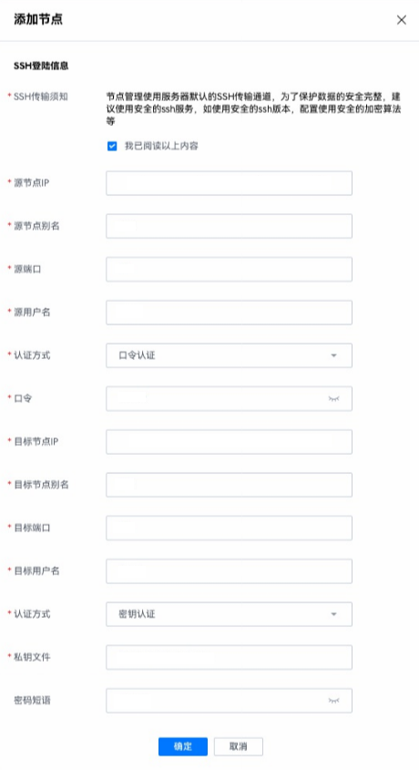

    **表 11** 节点信息参数说明
    <a id="sheet11"></a>
    <table><thead align="left">
        <tr>
            <th>参数</th>
            <th>说明</th>
        </tr>
        <tr>
            <td>SSH传输须知</td>
            <td>节点管理使用服务器默认的SSH传输通道，为了保护数据的安全完整，建议使用安全的ssh服务，如使用安全的ssh版本，配置使用安全的加密算法等。</td>
        </tr>
        <tr>
            <td>源节点IP地址</td>
            <td>源节点IP地址。</br>
            说明：<br>
            源节点与部署openEuler web工具的环境需要保持可联通状态。</td>
        </tr>
        <tr>
            <td>源节点别名</td>
            <td>源节点别名，该别名用于标记该节点用途。</td>
        </tr>
        <tr>
            <td>源端口</td>
            <td>登录源节点的SSH协议端口。</td>
        </tr>
        <tr>
            <td>源用户名</td>
            <td>登录源节点的用户名。</td>
        </tr>
        <tr>
            <td>源端口</td>
            <td>登录源节点的SSH协议端口。</td>
        </tr>
        <tr>
            <td rowspan="2">认证方式</td>
            <td>
                <p>密钥认证：通过私钥文件和私钥文件的密码短语进行认证。</p>
                <ul>
                    <li>私钥文件：登录源节点私钥文件的绝对路径。</li>
                    <li>密码短语：登录源节点私钥文件的密码短语。
                        配置秘钥认证方式请参考配置生成秘钥。<br>
                        说明：
                        <ul>
                            <li>若登录用户为普通用户，需要输入root用户口令切换到root用户进行具体操作。</li>
                            <li>由于root用户拥有最高权限，直接使用root用户登录服务器可能会存在安全风险。您可以通过配置禁止root用户SSH登录的选项，来提升系统安全性。具体配置如下：先以普通用户登录服务器，切换至root登录后检查/etc/ssh/sshd_config配置项PermitRootlogin，如果显示no，说明禁止了root用户登录；如果显示yes，则需要将配置项PermitRootlogin设置为no。配置完成后需要重启sshd服务确保配置生效。</li>
                            <li>配置的节点信息中涉及用户密码输入，请注意定期维护账户信息，确保环境安全。</li>
                        </ul>                   
                    </li>
                </ul>
            </td>
        </tr>
        <tr>
            <td>
                <p>口令认证：通过口令进行认证。</p>
                <p>口令：登录源节点的密码口令。</p>
                说明：<br>
                <ul>
                    <li>若登录用户为普通用户，需要输入root用户口令切换到root用户进行具体操作。</li>
                    <li>由于root用户拥有最高权限，直接使用root用户登录服务器可能会存在安全风险。您可以通过配置禁止root用户SSH登录的选项，来提升系统安全性。具体配置如下：先以普通用户登录服务器，切换至root登录后检查/etc/ssh/sshd_config配置项PermitRootlogin，如果显示no，说明禁止了root用户登录；如果显示yes，则需要将配置项PermitRootlogin设置为no。</li>
                </ul>
            </td>
        </tr>
        <tr>
            <td>源操作系统版本</td>
            <td>待迁移节点的操作系统，默认为CentOS 7.6，可通过<a href="CommonOperation.md#updatedatabasepackage">上传操作系统数据库支持包</a>支持更多操作系统。</td>
        </tr>
        <tr>
            <td>目标节点IP</td>
            <td><p>目标节点IP地址。</p>
            说明：<br>目标节点与部署openEuler web工具的环境需要保持可联通状态</td>
        </tr>
        <tr>
            <td>目标端口</td>
            <td>登录至目标节点的SSH协议端口。</td>
        </tr>
        <tr>
            <td>目标用户名</td>
            <td>登录至目标节点的用户名。</td>
        </tr>
        <tr>
                <td rowspan="2">认证方式</td>
                <td>密钥认证：通过私钥文件和私钥文件的密码短语进行认证。
                    <ul>
                        <li>私钥文件：登录待升级节点私钥文件的绝对路径。
                        </li>
                        <li>密码短语：登录待升级节点私钥文件的密码短语。配置秘钥认证方式请参考<a href="CommonOperation.md#configkey">配置生成秘钥</a>。</li>
                    </ul>
                </td>
            </tr>
            <tr>
                <td>
                口令认证：通过口令进行认证。<br>口令：登录待升级节点的密码口令。<br>说明：
                <ul>
                    <li>若登录用户为普通用户，需要输入root用户口令切换到root用户进行具体操作，由于root用户拥有最高权限，直接使用root用户登录服务器可能会存在安全风险。您可以通过配置禁止root用户SSH登录的选项，来提升系统安全性。具体配置如下：先以普通用户登录服务器，切换至root登录后检查/etc/ssh/sshd_config配置项PermitRootlogin，如果显示no，说明禁止了root用户登录；如果显示yes，则需要将配置项PermitRootlogin设置为no。配置完成后需要重启sshd服务确保配置生效。</li>
                    <li>配置的节点信息中涉及用户密码输入，请注意定期维护账户信息，确保环境安全。</li>
                </ul>
                </td>
            </tr>
        <tr>
            <td>目标操作系统版本</td>
            <td>待迁移节点进行升级的目标操作系统，默认为openEuler 20.03-LTS-SP1，可通过<a href="CommonOperation.md#updatedatabasepackage">上传操作系统支持包</a>支持更多操作系统。</td>
        </tr>        
    </table>        
3.  此处以添加单个节点进行指纹验证为例，工具对导入的节点信息校验完成后，进入节点指纹验证页面，确认节点指纹无误后，单击“确定”。

    **图 16**  指纹验证<a id="figure16"></a>  
    

4.  节点添加完成，确认添加节点信息无误后，单击任务名称右侧“确定”，完成配置迁移任务创建。若需要修改或删除相应节点，单击右侧“操作”项下的“修改”或“删除”对节点进行操作。单击右下角“确认”启动配置迁移任务，单击右下角“取消”，取消配置迁移任务。

    **图 17**  配置迁移任务信息确认<a id="figure17"></a>  
    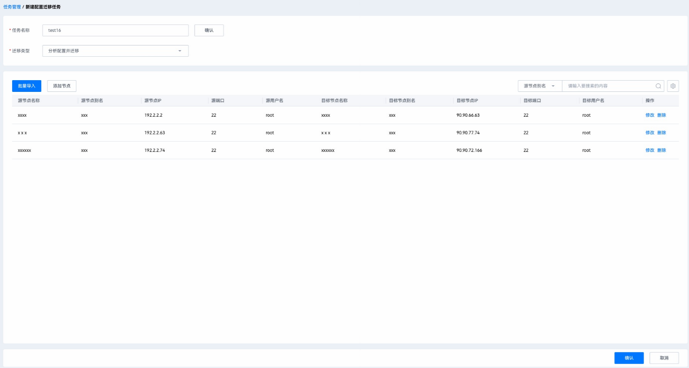
### 进行系统配置迁移
##### 前提条件
-   已登录x2openEuler工具。
-   已创建配置迁移任务。
##### 操作步骤
1.  在页面“全部任务”下选择已创建的配置迁移任务，单击右侧“进入任务”，进入任务详情页面。
2.  单击节点信息右侧的“开始分析”，可对单个节点进行分析配置迁移。同时勾选多个节点，单击左上角“批量操作”，可对多个节点启动分析配置迁移。

    配置分析迁移过程分为4个阶段，其中任意阶段失败都会导致后续任务执行过程终止。

    1.  环境检查

        环境检查用于分析x2openEuler工具与源目节点的连通性，验证环境信息是否正常，若环境检查无法通过，则需修改节点配置信息。

        **图 18**  环境检查页面<a id="figure18"></a>  
        

    2.  配置分析

        针对源节点进行配置分析，产生配置分析报告，确认源节点可以进行迁移配置信息。配置分析报告参数详细说明请参考[表12](#sheet12)。

        **图 19**  配置分析<a id="figure19"></a>  
        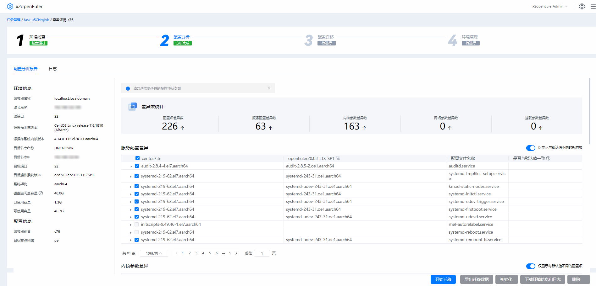
        **表 12** 配置分析报表参数说明
        <a id="sheet12"></a>
        <table><thead align="left">
            <tr>
                <th>参数</th>
                <th>说明</th>
            </tr>
            <tr>
                <td>变化数统计</td>
                <td>显示源节点配置项变化数、服务配置变化数、内核参数变化数、网络参数变化数、挂载参数变化数。</td>
            </tr>
            <tr>
                <td>服务配置变化</td>
                <td>对比源目节点服务配置变化。</td>
            </tr>
            <tr>
                <td>内核参数变化</td>
                <td>对比源目节点内核参数变化。</td>
            </tr>
            <tr>
                <td>网络参数变化</td>
                <td>对比源目节点网络参数变化。</td>
            </tr>
            <tr>
                <td>挂载参数变化</td>
                <td>对比源目节点挂载参数变化。</td>
            </tr>
        </table>
    3.  配置迁移
        勾选需要迁移的配置信息，单击右下角“开始迁移”进行配置迁移。

        **图 20**  配置迁移<a id="figure20"></a>  
        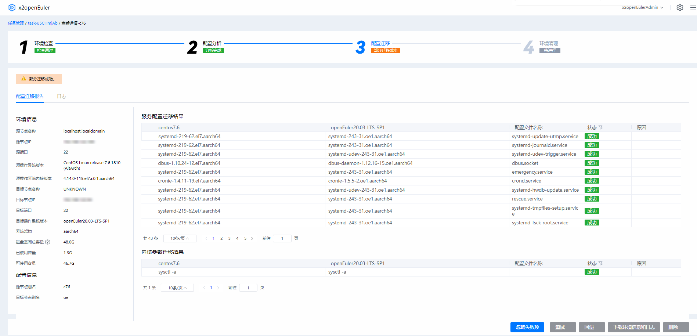

        > **说明：** 
        >配置迁移过程中，部分源操作系统服务或应用配置可能因其本身无法迁移而导致迁移失败，对于该部分配置内容可单击“忽略失败项”进行处理。后续可在目标操作系统上重新部署。

    4.  环境清理

        配置迁移完成后建议进行业务测试，测试稳定后再执行环境清理操作，以节约环境空间。如需进行回退操作，则可以选择保留。

        > **说明：** 
        >-   升级完成后，需进行业务运行验证，若业务运行正常，即可进行环境清理，以释放占用空间。
        >-   环境清理将清理备份文件并卸载x2openEuler-client软件。
3.  配置迁移完成后，请在目标节点上进行业务测试，以确认业务运行正常，如需进行回退操作，可进入节点详情页面，单击右下角“回退”。
## 软件包评估
对源操作系统升级到目标操作系统的软件包进行评估，确保升级后业务正常运行。
##### 前提条件
已安装x2openEuler工具
##### 操作步骤
1.  单击页面左侧“新建任务”，在下拉菜单中选择“软件包评估”。在弹出框“新建软件评估任务”界面中输入任务名称，单击确定进入评估任务界面。
2.  单击左上角“选择软件包”，进入如[图 选择软件包](#figure21)所示界面，参考[表 软件包扫描参数说明](#sheet13)上传需要评估的软件包。

    **图 21**  选择软件包<a id="figure21"></a>  
    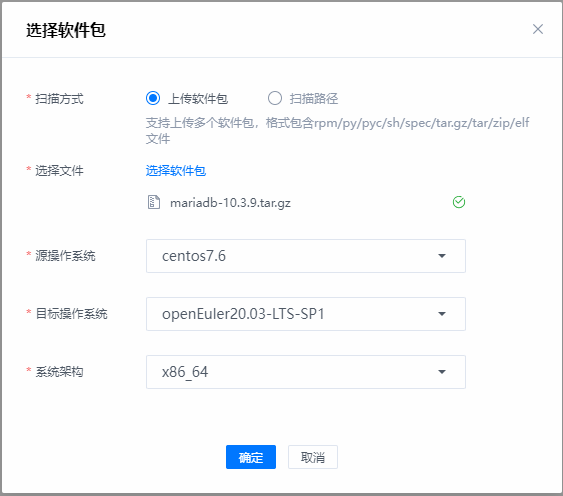

    **表 13**  软件包扫描参数说明
    <a id="sheet13"></a>
    <table>
        <tr>
            <th>参数</th>
            <th>说明</th>
        </tr>
        <tr>
            <td rowspan="2">扫描方式</td>
            <td>上传软件包：支持上传多个软件包，支持elf/python/jar/shell/spec等类型的软件包。</td>
        </tr>
        <tr>
            <td><p>扫描路径：扫描x2openEuler安装节点上已存在的软件包。</p>
            说明：<br>
            仅支持扫描“/opt/x2openEuler/scan”路径下的文件。</td>
        </tr>
        <tr>
            <td>源操作系统</td>
            <td>待升级节点的操作系统，默认为CentOS 7.6，可通过上传操作系统数据库支持包支持更多操作系统。</td>
        </tr>
        <tr>
            <td>目标操作系统</td>
            <td>升级节点进行升级的目标操作系统，默认为openEuler 20.03-LTS-SP1，可通过上传操作系统支持包支持更多操作系统。</td>
        </tr>
        <tr>
            <td>系统架构</td>
            <td>源目操作系统所依托的硬件架构。
                <ul>
                    <li>x86_64</li>
                    <li>aarch64</li>
                </ul>
            </td>
        </tr>
    </table>
3.  单击“确定“，执行软件评估任务。评估完成后，工具将自动跳转至分析结果界面，分析结果分为软件依赖关系图和软件评估报告，如[图22](#figure22)所示，软件评估报告详细参数描述如[表14](#sheet14)所示。

    > **说明：** 
    >-   用户可以在软件包评估任务的列表中，单击指定已完成分析任务的任务名称查看分析报告。
    >-   用户可以通过软件依赖关系图，分析软件包的依赖关系及在openEuler系统上的替换包。
    >-   分析报告的名称为扫描的软件包名称和生成报告的时间组合。

    **图 22**  软件依赖关系图<a id="figure22"></a>  
    

    **表 14**  业务软件评估报告结果参数说明
    <a id="sheet14"></a>
    <table><thead align="left">
        <tr>
            <th>参数</th>
            <th>说明</th>
        </tr>
        <tr>
            <td>评估结果</td>
            <td>显示评估软件名称、源操作系统、目标操作系统、系统架构以及评估结果等评估任务信息。</td>
        </tr>
        <tr>
            <td>操作建议</td>
            <td>依据评估报告中的兼容性结果，提供对应解决方案建议。</td>
        </tr>
        <tr>
            <td>依赖包兼容性</td>
            <td>显示软件安装所需要的直接依赖以及依赖文件在各个系统上对应的rpm包。
                <ul>
                    <li>若查询到的直接依赖的rpm的名字和版本都一样，会显示 <b>版本未变更</b></li>
                    <li>若查询到的直接依赖的rpm的版本不一样，但接口无差异，会显示 <b>版本有变更</b></li>
                    <li>若查询到的直接依赖的rpm的包名发生变化，但接口无差异，会显示 <b>包名有变更</b></li>
                    <li>若源操作系统查到rpm，目标操作系统没有查到，会显示 <b>缺失</b></li>
                    <li>若源操作系统没有查到rpm，目标操作系统有查到，或者所在包有接口变化则会显示， <b>需要检查</b></li>
                    <li>若源操作系统和目标操作系统都没有查到rpm，则会放到 other 里边，并显示 <b>需要检查</b></li>
                </ul>
            </td>
        </tr>
        <tr>
            <td>接口兼容性（C/C++）</td>
            <td>
                <ul>
                    <li>调用函数名称：表示被评估软件中调用的函数名称。</li>                
                    <li>调用的接口程序：表示被评估软件中被存在差异的外部接口调用的程序。</li>                
                    <li>结果：
                        <ul>
                            <li>已移除：表示缺失的接口。</li>
                            <li>已变更：表示函数入参，返回值，或者实现有变化</li>
                        </ul>
                    </li>                
                    <li>展开的详细信息中：
                        <ul>
                            <li>操作系统：表示迁移评估的系统名称。</li>
                            <li>函数名：接口表示。</li>
                            <li>文件名：表示外部接口所在的文件名。</li>
                            <li>依赖包：表示接口所在的外部so库。</li>
                            <li>接口差异项：表示外部接口的变化差异，如果是已移除接口，则此项为空。</li>
                        </ul>
                    </li>                
                </ul>
            </td>
        </tr>
        <tr>
            <td>接口兼容性（JDK）</td>
            <td>
                <p>表示扫描Jar包中调用的jdk接口在待迁移的系统上对应满足运行条件的最小jdk上发生的变更。</p>
                <ul>
                    <li>openEuler jdk：openEuler上满足Jar包运行环境的最小jdk版本。</li>
                    <li>对象构建jdk：扫描jar包对应构建的jdk版本。</li>
                    <li>jar包名：扫描的jar包名称。</li>
                    <li>方法名：存在接口差异的方法名。</li>
                    <li>函数调用签名：存在接口差异的方法函数签名。</li>
                    <li>包名：存在接口差异的方法所在的包（packageName+className）。</li>
                    <li>差异项：接口差异选项。</li>
                </ul>
            </td>
        </tr>
        <tr>
            <td>接口兼容性（Java）</td>
            <td>
                <p>Jar接口差异主要描述了当前jar包接口在待迁移的系统上发生的变更。</p>
                <ul>
                    <li>调用的jar包：表示当前被调用的jar包名称。</li>                
                    <li>所属的rpm包：表示当前的jar包所属的rpm包。</li>                
                    <li>展开的详细信息中：
                        <ul>
                            <li>centos7.6 Methods：表示CentOS 7.6上不兼容的接口名称。</li>
                            <li>package：表示不兼容的接口所属的jar包。</li>
                            <li>class：表示不兼容的接口所属的类。</li>
                            <li>openEuler20.03-LTS-SP1 Change：表示不兼容的接口在openEuler20.03-LTS-SP1上发生的变更，这部分变更描述包含了方法的移除，方法返回参数、方法签名、方法修饰、异常等变更。</li>
                        </ul>
                    </li>                
                </ul>
            </td>
        </tr>
    </table>
4.  单击右下角“下载环境信息和日志”获取环境信息和日志文件，单击“导出HTML报告”导出当前评估任务的分析结果。

# 通过CLI命令行使用x2openEuler工具
## 升级前检查
##### 前提条件
远程服务器已部署x2openEuler。
待升级节点与远程服务器能够联通。
##### 操作步骤
1.  使用SSH工具登录远程服务器，执行以下命令将远程服务器的“x2openEuler-client”、“x2openEuler-upgrade”软件包传输至待升级节点并安装。
    1.  在远程服务器执行以下命令传输软件包。

        ```
        scp /etc/x2openEuler/rpms/x2openEuler-client-2.0.0.noarch.rpm /etc/x2openEuler/rpms/x2openEuler-upgrade-1.1.3-33.x86_64.rpm root@192.168.137.21:/root
        ```

        如下图：

        **图 23**  传输软件包<a id="figure23"></a>  
        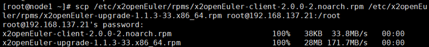

    2.  在待升级节点上执行以下命令安装软件包。

        ```
        rpm –ivh x2openEuler-client-2.0.0-2.noarch.rpm
        yum install -y x2openEuler-upgrade-1.1.3-33.x86_64.rpm
        ```

        如下图：

        **图 24**  安装软件包<a id="figure24"></a>  
        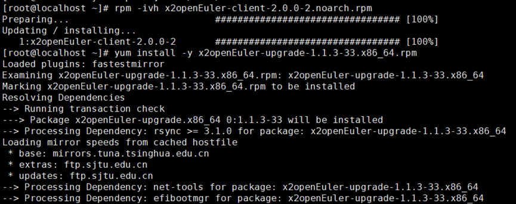

2.  安装完成后在待升级节点上执行以下命令，使环境变量生效。

    ```
    source .bashrc
    ```

    如下图：

    **图 25**  生效环境变量<a id="figure25"></a>  
    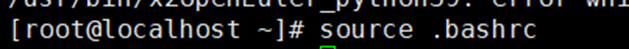

3.  执行以下命令将远程服务器端的CentOS 7.6 数据库包传输到待升级节点并安装。
    1.  在远程服务器执行以下命令传输软件包。

        ```
        # scp -r /etc/x2openEuler/rpms/databases/ root@192.168.137.21:/root
        ```

    2.  在待升级节点上执行以下命令安装软件包。

        ```
        rpm –ivh x2openEuler-database-*
        ```

        如下图：

        **图 26**  安装数据库包<a id="figure26"></a>  
        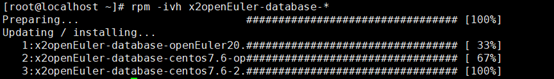

4.  <a id="collectinfo"></a>（可选）在待升级节点上执行以下命令收集系统环境信息。

    > **说明：** 
    >进行系统环境信息的收集是为了在回退后进行系统一致性检查的输入。

    ```
    x2openEuler-client system-info-collect -t {collect_step} -d /opt/x2openEuler-client/output/
    ```

    **表 15**  参数描述
    <a id="sheet15"></a>
    <table>
        <tr>
            <th>参数</th>
            <th>描述</th>
        </tr>
        <tr>
            <td>pre_upgrade</td>
            <td>升级前收集系统环境信息</td>
        </tr>
        <tr>
            <td>after_rollback</td>
            <td>回滚后收集系统环境信息</td>
        </tr>
    </table>

    **图 27**  升级前系统环境信息收集<a id="figure27"></a>  
    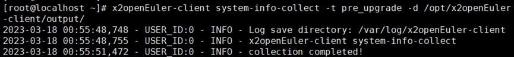

5.  在待升级节点上执行以下命令进行软件冲突信息收集。

    ```
    x2openEuler-client upgrade-check-collect
    ```

    **图 28**  软件冲突信息收集<a id="figure28"></a>  
    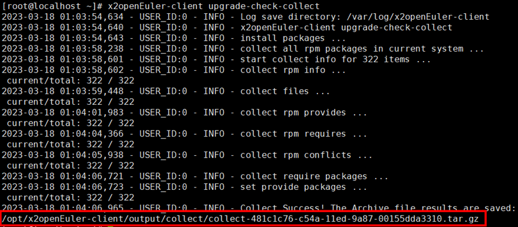

6.  在待升级节点上执行以下命令进行软件冲突检查。

    ```
    x2openEuler-upgrade-check upgrade-check
    ```

    示例如下：

    ```
    x2openEuler-upgrade-check upgrade-check -repo=repo_source1,repo_source2,repo_source3 -o /fake_path/collect-{uuid}.tar.gz -schema 2 -os_name os
    ```

    **表 16**  参数说明
    <a id="sheet16"></a>
    <table>
        <tr>
            <th>参数</th>
            <th>描述</th>
        </tr>
        <tr>
            <td>-repo</td>
            <td>指定repo源，例：-repo repo1,repo2,repo3</td>
        </tr>
        <tr>
            <td>-o</td>
            <td>指定报告输出路径，例：-o collect-{uuid}.tar.gz 路径</td>
        </tr>
        <tr>
            <td>-target_os_name</td>
            <td>目标操作系统，例：-target_os_name openEuler20.03-LTS-SP1</td>
        </tr>
        <tr>
            <td>-os_name</td>
            <td>待升级节点操作系统，例：-os_name centos7.6</td>
        </tr>
        <tr>
            <td>-r</td>
            <td>保留包，例：-r 保留包1,保留包2,…</td>
        </tr>
        <tr>
            <td>-b</td>
            <td>业务包，例：-b 业务包1,业务包2,…</td>
        </tr>
    </table>

    **图 30**  软件冲突检查<a id="figure30"></a>  
    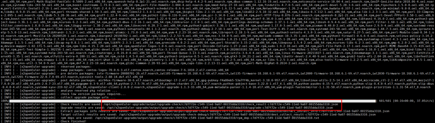

    > **说明：** 
    >输出报告中，
    >-   冲突报告为check\_result-\{uuid\}.json,可以查看升级前检查结果
    >-   升级报告为upgrade-\{uuid\}.json，用作执行升级命令的输入

7.  根据检查结果，在待升级节点执行以下命令获取目标操作系统软件包。

    ```
    x2openEuler-upgrade-check upgrade-check download-upgrade-pkg
    ```

    **表 17**  参数描述
    <a id="sheet17"></a>
    <table>
        <tr>
            <th>参数</th>
            <th>描述</th>
        </tr>
        <tr>
            <td>-d</td>
            <td>{uuid}，uuid为收集信息时产生的随机数</td>
        </tr>
        <tr>
            <td>-c</td>
            <td>冲突报告check_result-{uuid}.json路径</td>
        </tr>
        <tr>
            <td>-s</td>
            <td>repodata数据库路径:/opt/x2openEuler-upgrade/output/upgrade-check-debug/{uuid}/dest_data/source</td>
        </tr>
        <tr>
            <td>-r</td>
            <td>repo文件路径</td>
        </tr>
        <tr>
            <td>-p</td>
            <td>目标系统软件包保存路径:/opt/x2openEuler-upgrade/pkg_download_dir</td>
        </tr>
    </table>

    **图 31**  获取目标操作系统软件包<a id="figure31"></a>  
    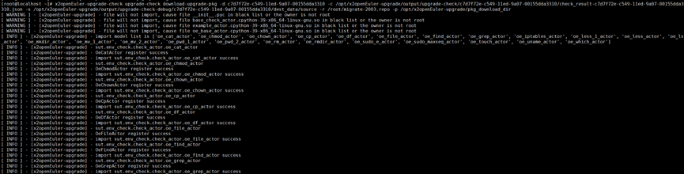

8.  （可选）查看步骤6中具体失败原因，执行以下命令在待升级节点分析保留包和保留路径的兼容性。
    1.  输出兼容性信息压缩包，命令如下：

        ```
        x2openEuler-client compat-collect 保留包1,保留包2,保留路径1,保留路径2…
        ```

        > **说明：** 
        >其中，
        >-   保留包为check\_result-\{uuid\}.json中src\_reserve\_pkg字段的保留包。
        >-   保留路径为用户自定义的保留路径。
        >    执行该命令后会在指定路径下输出兼容性信息压缩包“collect-\{uuid2\}.tar.gz”

    2.  <a id="upgradecheck"></a>进行兼容性升级检查，命令如下：

        ```
        x2openEuler-upgrade-check upgrade-check
        ```

        **表 18**  参数描述
        <a id="sheet18"></a>
        <table>
            <tr>
                <th>参数</th>
                <th>描述</th>
            </tr>
            <tr>
                <td>-o</td>
                <td>collect-{uuid2}.tar.gz</td>
            </tr>
            <tr>
                <td>-s</td>
                <td><p>{uuid}/software_relation</p>
                说明：<br>
                4中冲突分析得到的software_relation文件夹路径。</td>
            </tr>
            <tr>
                <td>-target_os_name</td>
                <td>目标操作系统</td>
            </tr>
        </table>
 
9.  在待升级节点执行以下命令进行硬件环境检查，输出硬件信息压缩包“collect-\{uuid2\}.tar.gz”。

    ```
    x2openEuler-client hardware-collect
    ```

    > **说明：** 
    >输出硬件环境信息压缩包后，重复执行[兼容性升级检查](#upgradecheck)，仅需要“-o”参数。    


## 升级
##### 前提条件
已完成升级前检查。
##### 操作步骤
1.  首先执行升级命令，再执行centos2openEuler 脚本。

    ```
    sh /usr/bin/centos2openEuler.sh upgrade upgrade-{uuid}.json migrate-{filename}.repo 备份目录 不备份目录 备份保存路径 内核启动参数 软件包路径
    ```

    > **说明：** 
    >其中，
    >-   upgrade.json为升级步骤6输出文件
    >-   repo文件格式固定为migrate-\{filename\}.repo
    >-   备份的目录：默认填/usr,/run,/boot,/var,/etc
    >-   不备份的目录：可选，不需要填empty\_dir（目录均以,隔开）
    >-   保存备份的路径：（示例/.osbak）
    >-   内核启动参数：可选，不需要填empty\_value（参数均以空格隔开）
    >-   软件包路径：/opt/x2openEuler-upgrade/pkg\_download\_dir
    >-   nohup防止挂断信号终止升级任务；命令最后加日志保存的路径，方便回看终端日志。

    **图 32**  升级过程<a id="figure32"></a>  
    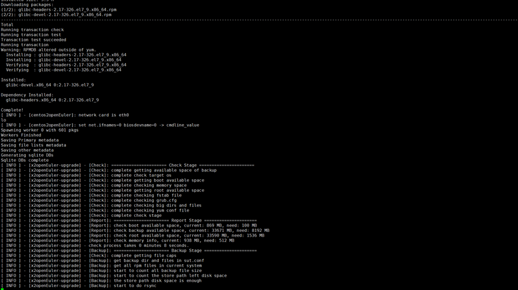
## 升级后验证与回滚
### 升级后验证
##### 前提条件
待升级节点已经完成升级且升级过程无报错信息。
##### 操作步骤
1.  执行以下命令查看操作系统版本。

    ```
    cat /etc/os-release
    ```

2.  尽快执行以下命令重启机器进入openEuler系统。

    ```
    reboot
    ```

### 升级后回退
##### 前提条件
待升级节点已经完成升级。
##### 操作步骤
> **须知：** 
>若要进行回退操作，必须先重启机器，否则会导致回退异常。

1.  重启系统后执行以下命令进行回退操作。

    ```
    sh /usr/bin/centos2openEuler rollback
    ```

    **图 33**  回退过程<a id="figure33"></a>  
    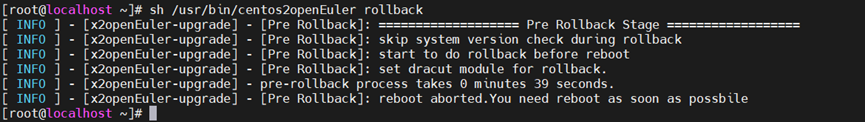

2.  （可选）检查回退一致性，重启系统后需要手动执行收集系统信息和系统信息对比的命令。
    1.  收集回滚后系统信息请参考[4](#collectinfo)。
    2.  执行以下命令进行回滚后系统信息对比。

        ```
        x2openEuler-client system-info-compare -d /opt/x2openEuler-client/output/
        ```

        **图 34**  回滚后系统信息对比<a id="figure34"></a>  
        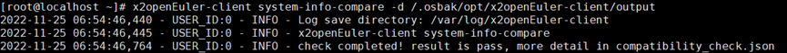
