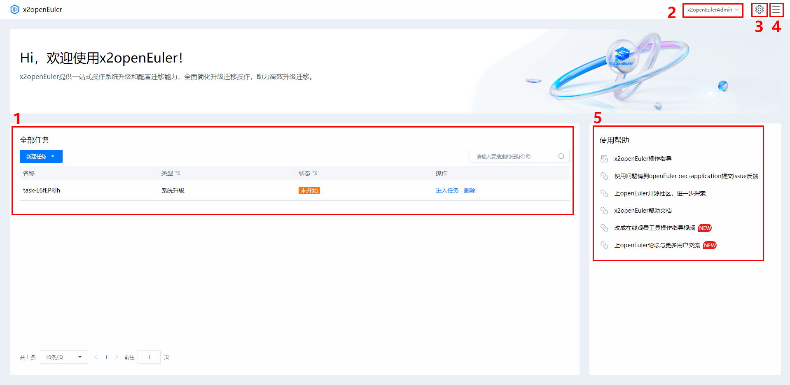
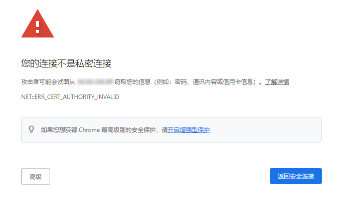
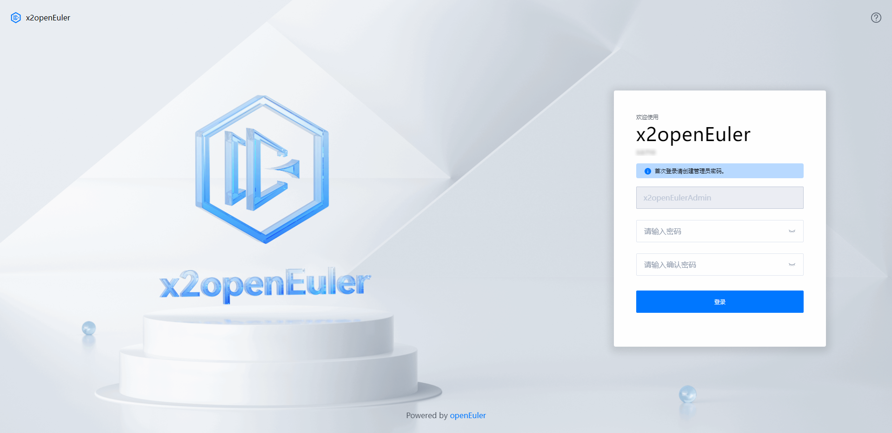
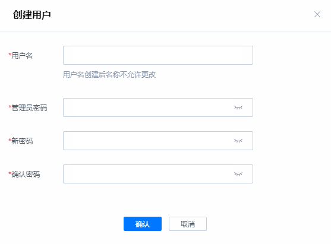
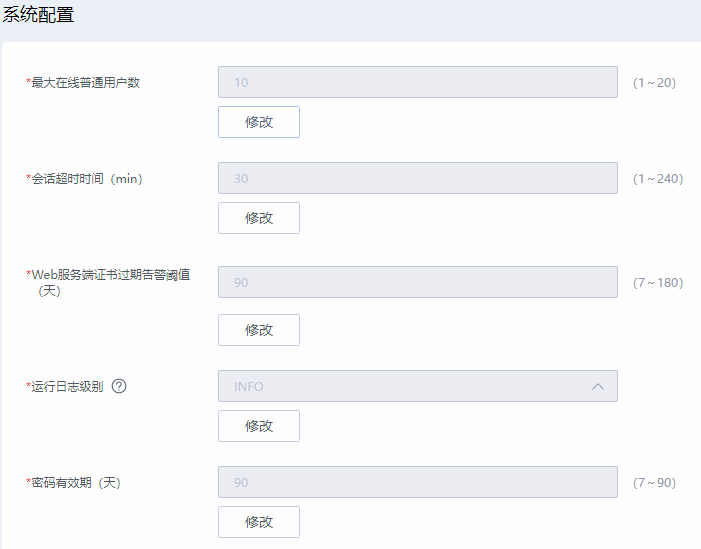

# 前言

##### 概述
本文档介绍了获取x2openEuler工具安装包，以及对其进行安装、使用的方法，对x2openEuler工具的web界面的各项功能做了详细介绍，同时提供了常见的问题解答及故障处理方法，详细请参考对应手册。

##### 读者对象
本文档主要适用于升级的操作人员。操作人员必须具备以下经验和技能：

-   熟悉待升级操作系统相关情况。
-   有服务器维护操作经验。

##### 符号约定
在本文中可能出现下列标志，它们所代表的的含义如下。

<table><thead align="left">      
        <tr>
            <th>符号</th>
            <th>说明</th>
        </tr>
        <tr>
            <td></td>
            <td>表示如不避免则将会导致死亡或严重伤害的具有高等级风险的危害。</td>
        </tr>
        <tr>
            <td></td>
            <td>表示如不避免则可能导致死亡或严重伤害的具有中等级风险的危害。</td>
        </tr>
        <tr>
            <td></td>
            <td>表示如不避免则可能导致轻微或中度伤害的具有低等级风险的危害。</td>
        </tr>
        <tr>
            <td></td>
            <td><p>用于传递设备或环境安全警示信息。如不避免则可能会导致设备损坏、数据丢失、设备性能降低或其它不可预知的结果。</p>
            <p>“须知”不涉及人身伤害。</p>
            </td>
        </tr>
        <tr>
            <td></td>
            <td><p>对正文中重点信息的补充说明。</p>
            <p>“说明”不是安全警示信息，不涉及人身、设备及环境伤害信息。</p>
            </td>
        </tr>
</table>

##### 命令行格式约定
<table><thead align="left">      
        <tr>
            <th>格式</th>
            <th>意义</th>
        </tr>
        <tr>
            <td><b>粗体</b></td>
            <td>命令行关键字（命令中保持不变、必须照输的部分）采用<b>加粗</b>字体表示。</td>
        </tr>
        <tr>
            <td><i>斜体</i></td>
            <td>命令行参数（命令中必须由实际值进行替代的部分）采用<i>斜体</i>表示。</td>
        </tr>
        <tr>
            <td>[ ]</td>
            <td>表示用“[ ]”括起来的部分在命令配置时是可选的。</td>
        </tr>
        <tr>
            <td>{ x | y | ... }</td>
            <td>表示从两个或多个选项中选取一个。
            </td>
        </tr>
        <tr>
            <td>[ x | y | ... ]</td>
            <td>表示从两个或多个选项中选取一个或者不选。</td>
        </tr>
        <tr>
            <td>{ x | y | ... }*</td>
            <td>表示从两个或多个选项中选取多个，最少选取一个，最多选取所有选项。</td>
        </tr>
        <tr>
            <td>[ x | y | ... ]*</td>
            <td>表示从两个或多个选项中选取多个或者不选。
            </td>
        </tr>
        <tr>
            <td>&amp;&lt;1-n&gt;</td>
            <td>表示符号“&amp;”前面的参数可以重复1～n次。
            </td>
        </tr>
        <tr>
            <td>#</td>
            <td>表示由“#”开始的行为注释行。
            </td>
        </tr>
</table>

##### 修订记录
<table><thead align="left">
    <tr>
        <th>文档版本</th>
        <th>发布日期</th>
        <th>修改说明</th>
    </tr>
    <tr>
        <td>06</td>
        <td>2023-06-30</td>
        <td>第六次正式发布</br>
            新增软件包评估
        </td>
    </tr>
    <tr>
        <td>05</td>
        <td>2023-03-30</td>
        <td>第五次正式发布
            <li>刷新系统升级</li>
            <li>新增配置生成秘钥、配置代理、回退一致性、上传操作系统数据库支持包等章节</li>
        </td>
    </tr>
    <tr>
        <td>04</td>
        <td>2022-12-30</td>
        <td>第四次正式发布
            <li>新增特性-系统信息收集评估、系统配置迁移</li>
            <li>新增常用操作和FAQ章节</li>
        </td>     
    </tr>
    <tr>
        <td>03</td>
        <td>2022-10-30</td>
        <td>第三次正式发布</td>
    </tr>
    <tr>
        <td>02</td>
        <td>2022-09-30</td>
        <td>第二次正式发布</td>
    </tr>
    <tr>
        <td>01</td>
        <td>2022-08-20</td>
        <td>第一次正式发布</td>
    </tr>
</table>

# 介绍
## 免责声明
-   建议您在非生产环境使用本工具，避免影响生产业务运行。
-   使用过程中涉及的非工具本身验证功能所用的用户名和密码，不作他用，且不会被保存在系统环境中。
-   在您进行分析或操作前应当确认您为应用程序的所有者或已获得所有者的充足授权同意。
-   分析结果中可能包含您所分析应用的内部信息和相关数据，请妥善管理。
-   除非法律法规或双方合同另有规定，华为公司对分析结果不做任何明示或暗示的声明和保证,不对分析结果的适销性、满意度、非侵权性或特定用途适用性等作出任何保证或者承诺。
-   您根据分析记录所采取的任何行为均应符合法律法规的要求，并由您自行承担风险。
-   未经所有者授权，任何个人或组织均不得使用应用程序及相关分析记录从事任何活动。华为公司不对由此造成的一切后果负责，亦不承担任何法律责任。必要时，将追究其法律责任。

## x2openEuler 原地升级工具简介
x2openEuler工具是一款将源操作系统升级为目标操作系统的搬迁工具套件，工具支持原地升级功能。

当客户运行环境的操作系统生命周期即将EOS，但依托于业务运行的相关应用软件和产品还未到结束生命周期时，为了保障业务的持续性和安全性，可使用x2openEuler工具将源操作系统升级到新的目标操作系统。

x2openEuler工具提供web界面方式进行操作，以供使用者能够在图形化界面便捷的进行升级操作。

同时，为了面向全面的数字化改造，配合产品信息化改造，使用x2openEuler工具升级的目标操作系统采用欧拉技术线，对于已有的业务系统完成数字化改造后可实现无缝迁移，保证业务的稳定性和高可用性。

## 应用场景
升级任务：当用户运行环境操作系统生命周期即将EOS时，可使用该工具将本地操作系统升级到新的目标操作系统。

系统信息收集评估任务：系统信息收集评估任务收集待升级节点信息，针对待升级节点进行软件、硬件兼容性评估及软件冲突检查，产生相应评估报告，确认待升级节点是否符合升级要求。

配置迁移任务：帮助用户迁移本地环境上运行的业务相关配置到升级后的目标操作系统，以保证业务正常运行。

软件包评估：对源操作系统升级到目标操作系统的软件包进行评估，确保升级后业务正常运行。

## 部署方式
单机部署，即将x2openEuler工具部署在用户的安装Cent OS 7.6或openEuler服务器上。
## 访问和使用
x2openEuler工具提供命令行或者web使用方式，用户在安装完成后选择使用方式。工具的使用方法请参考章节[特性指南](FeatureGuide.md)。

> **须知：** 
>-   待升级节点升级过程中需要root权限，由于root用户拥有最高权限，直接使用root用户登录服务器可能会存在安全风险。您可以通过配置禁止root用户SSH登录的选项，来提升系统安全性。具体配置如下：先以普通用户登录服务器，切换至root登录后检查/etc/ssh/sshd\_config配置项PermitRootlogin，如果显示no，说明禁止了root用户登录；如果显示yes，则需要将配置项PermitRootlogin设置为no，配置修改后重启sshd服务以生效。
>-   “配置迁移任务”只支持web方式使用。

### 界面说明

##### 界面分区
x2openEuler工具首页界面主要由如所示的区域组成，各个区域的作用如[图1](#figure1)所示。

**图 1**  x2openEuler工具首页界面<a id="figure1"></a>  


**表 1** x2openEuler工具首页界面参数说明
<a id="sheet1"></a>
<table><thead align="left">
    <tr>
        <th>区域</th>
        <th>名称</th>
        <th>说明</th>    
    </tr>
    <tr>
        <td>1</td>
        <td>任务管理区</td>
        <td>工具任务管理入口，用户可进行创建、启动、删除任务等操作。</td>
    </tr>
    <tr>
        <td>2</td>
        <td>当前用户</td>
        <td>展示当前登录用户，并提供修改密码和用户登出的操作入口。</td>
    </tr>
    <tr>
        <td>3</td>
        <td>配置</td>
        <td>提供用户管理，弱口令字典，系统配置，日志，web服务端证书和回退一致性检查过滤等功能入口。</td>
    </tr>
    <tr>
        <td>4</td>
        <td>更多</td>
        <td>提供深色/浅色模式切换，联机帮助、免责声明和x2openEuler工具发布信息入口。</td>
    </tr>
    <tr>
        <td>5</td>
        <td>案例链接区</td>
        <td>提供典型案例链接，并为每个功能提供示例代码。</td>
    </tr>
</table>

##### 图标及按钮说明
x2openEuler工具中出现的图标/按钮及其说明如[表2](#sheet2)所示。

**表 2**  图标/按钮说明

<a id="sheet2"></a>
<table><thead align="left">
    <tr>
        <th>类型</th>
        <th>图标/按钮</th>
        <th>说明</th>    
    </tr>
    <tr>
        <td rowspan="2">信息图标</td>
        <td></td>
        <td>配置</td>
    </tr>
    <tr>
        <td></td>
        <td>更多</td>
    </tr>
    <tr>
        <td rowspan="3">标志符号</td>
        <td></td>
        <td>用于提示操作警示信息</td>
    </tr>
    <tr>
        <td></td>
        <td>用于提示操作提醒信息</td>
    </tr>
    <tr>
        <td></td>
        <td>用于提示操作异常信息</td>
    </tr>
    <tr>
        <td rowspan="12">用户控件图标</td>
        <td></td>
        <td>下载：将操作对象保存在本地</td>
    </tr>
    <tr>
        <td></td>
        <td>删除所选条目</td>
    </tr>
    <tr>
        <td></td>
        <td>展开：展开已折叠的列表项</td>
    </tr>
    <tr>
        <td></td>
        <td>折叠：折叠已展开的列表项</td>
    </tr>
    <tr>
        <td></td>
        <td>保存：保存修改</td>
    </tr>
    <tr>
        <td></td>
        <td>回退：回退到前一步</td>
    </tr>
    <tr>
        <td></td>
        <td>取消：取消修改</td>
    </tr>
    <tr>
        <td></td>
        <td>上一个：移动到上一个建议修改处</td>
    </tr>
    <tr>
        <td></td>
        <td>下一个：移动到下一个建议修改处</td>
    </tr>
    <tr>
        <td></td>
        <td>排序</td>
    </tr>
    <tr>
        <td></td>
        <td>建议反馈</td>
    </tr>
    <tr>
        <td></td>
        <td>条件选择筛选</td>
    </tr>
</table>

### 登录x2openEuler工具web界面<a id="loginweb"></a>
本章节以Windows 10操作系统安装的Chrome 105.0浏览器为例介绍登录x2openEuler工具web界面的操作步骤。

##### 浏览器要求
浏览器要求如[表3](#sheet3)所示。
**表 3** 浏览器要求
<a id="sheet3"></a>
<table>
    <tr><thead align="left">
        <th>浏览器类型</th>
        <th>说明</th>
    </tr>
    <tr>
        <td>Google Chrome</td>
        <td>Google Chrome 72.0及以上版本</td>
    </tr>
    <tr>
        <td>Mozilla Firefox</td>
        <td>Firefox Browser 89及以上版本</td>
    </tr>
    <tr>
        <td>Microsoft Edge</td>
        <td>Microsoft Edge 79.0及以上版本</td>
    </tr>
</table>

##### 操作步骤
> **须知：** 
>-   默认连续5次登录失败，系统将对此用户进行锁定，锁定3分钟后可以重新登录。
>-   默认情况下，系统超时时间为30分钟，即在30分钟内，如果您未在webUI界面执行任何操作，系统将自动登出，此时需输入用户名和密码重新登录webUI界面。管理员可在x2openEuler工具首页中的选项中选择“系统配置”，手动配置会话超时时间，可配置范围为10\~240分钟。
>-   为保证系统的安全性，初次登录时，请及时修改初始密码，并定期更新。
>-   默认允许10个普通用户同时登录使用，管理员用户不受此限制。管理员用户可在x2openEuler工具首页中的菜单选项中选择“系统配置”，手动配置“最大在线普通用户数”，可配置范围为1\~20。
>-   单个用户只允许1个活跃会话，如果当前用户已经在登录使用，重复登录会挤掉前面的登录。
>-   用户首次登录时会弹出免责声明弹窗，用户仔细阅读后，勾选“我已阅读以上内容“，点击“确认“后才能使用本工具，如点击“取消“将会退出工具。

1.  打开本地PC机的浏览器，在地址栏输入**https://_部署服务器的ip__:端口号_**（例如：https://10.254.206.190:18082），按“Enter”。

    > **说明：** 
    >HTTPS默认端口为18082，请确认使用该工具之前OS防火墙已开通18082端口。
2.  在如[图2](#figure2)所示的安全告警窗口中选择“继续浏览此网站”。

    > **说明：** 
    >登录时可能会弹出“安全告警”界面，您可以选择忽略此告警信息或者下载华为根证书屏蔽该界面，详细步骤请参见[为x2openEuler Upgrade工具导入根证书](CommonOperation.md#importcert)。

    **图 2**  安全告警<a id="figure2"></a>  
    

    打开首次登录界面，如[图3](#figure3)所示，参数说明如[表4](#sheet4)所示。

    **图 3**  首次登录x2openEuler工具<a id="figure3"></a>  
    

    **表 4**  首次登录x2openEuler工具参数说明
    <a id="sheet4"></a>
    <table><thead align="left">
        <tr>
            <th>参数</th>
            <th>说明</th>
        </tr>
        <tr>
            <td>用户名</td>
            <td>登录x2openEuler工具的用户</br>说明：</br>系统的默认管理员为<b>x2openEulerAdmin</b>，工具安装完成后首次登录需要设置管理员密码</td>
        </tr>
        <tr>
            <td>密码</td>
            <td>登录用户的密码。密码需要满足如下复杂度要求：
                <ul>
                    <li>密码长度为8~32个字符</li>
                    <li>必须包含大写字母、小写字母、数字、特殊字符（`~!@#$%^&amp;*()-_=+\|[{}];:'",&lt;.&gt;/?）中的两种及以上类型的组合</li>
                    <li>密码不能包含空格</li>
                    <li>密码不能是用户名</li>
                    <li>密码不能在<a href="CommonOperation.md#weakpasswd">弱口令字典</a>中</li>
                </ul>
            </td>
        </tr>
        <tr>
            <td>确认密码</td>
            <td>再次输入设置的密码</td>
        </tr>
    </table>
3.  设置管理员密码，单击“确认”。

    打开登录界面，如[图4](#figure4)所示，参数说明如[表5](#sheet5)所示。

    **图 4**  非首次登录x2openEuler工具<a id="figure4"></a>  
    

    **表 5**  非首次登录x2openEuler工具参数说明
    <a id="sheet5"></a>
    <table><thead aligh="left">
         <tr>
            <th>参数</th>
            <th>说明</th>
        </tr>
        <tr>
            <td>用户名</td>
            <td>登录x2openEuler工具的用户</br>说明：</br>系统的默认管理员为<b>x2openEulerAdmin</b></td>
        </tr>
        <tr>
            <td>密码</td>
            <td>登录用户的密码。为了保证安全，用户应定期修改自己的登录密码。</td>
        </tr>
        <tr>
            <td>已同意免责声明</td>
            <td>工具免责声明。用户需阅读并同意后才能登录工具。</td>
        </tr>
    </table>

4.  输入用户名和密码，单击“登录“。

    首次登录web的普通用户，系统提示修改默认密码。请按提示修改密码，密码需要满足如下复杂度要求：

    -   密码长度为8\~32个字符
    -   密码至少包含以下字符中的两种：
        -   大写字母：A\~Z
        -   小写字母：a\~z
        -   数字：0\~9
        -   特殊字符：\`\~!@\#$%^&\*\(\)-\_=+\\|\[\{\}];:'",<.\>/?

    -   密码不能是用户名。
    -   新密码与旧密码必须不同。
    -   新密码不能是旧密码的逆序。
    -   新密码不能在<a href="CommonOperation.md#weakpasswd">弱口令字典</a>中。

    > **说明：** 
    >x2openEuler工具用户的密码默认有效期为90天，建议在密码有效期到达之前设置新密码。若密码已过期，则需要在登录后先进行密码修改操作。

    成功登录后，显示首页界面，界面右上角将显示登录的用户名。

### 使用前配置

#### 创建用户
##### 前提条件
已成功登录x2openEuler工具。

> **说明：** 
>只有管理员用户（x2openEulerAdmin）可以执行创建用户操作。
##### 操作步骤
1.  单击页面右上角，在下拉菜单中选择“用户管理“，打开用户管理界面。
2.  单击“创建“，打开“创建”界面，如[图5](#figure5)所示，需配置的参数如[表6](#sheet6)所示。

    **图 5**  创建用户<a id="figure5"></a>  
    

    **表 6**  创建用户参数说明
    <a id="sheet6"></a>
    <table><thead align="left">
        <tr>
            <th>参数</th>
            <th>说明</th>
        </tr>
        <tr>
            <td>用户名</td>
            <td>输入新建用户的名称。用户名需要满足如下要求：
                <ul>
                    <li>用户名必须以英文字母开头</li>
                    <li>默认长度范围为：6~32</li>
                    <li>可以包含字母、数字、“-”和“_”</li>
                </ul>
            </td>
        </tr>
        <tr>
            <td>管理员密码</td>
            <td>再次输入设置的密码</td>
        </tr>
        <tr>
            <td>密码</td>
            <td>登录用户的密码。密码需要满足如下复杂度要求：
                <ul>
                    <li>密码长度为8~32个字符</li>
                    <li>必须包含大写字母、小写字母、数字、特殊字符（`~!@#$%^&amp;*()-_=+\|[{}];:'",&lt;.&gt;/?）中的两种及以上类型的组合</li>
                    <li>密码不能包含空格</li>
                    <li>密码不能是用户名</li>
                    <li>密码不能在<a href="管理弱口令字典.md">弱口令字典</a>中</li>
                </ul>
            </td>
        </tr>
        <tr>
            <td>确认密码</td>
            <td>再次输入设置的密码</td>
        </tr>
    </table> 
3.  参考[表6](#sheet6)配置新用户后，单击“确认”。

    > **说明：** 
    >-   创建的普通用户数量没有限制。
    >-   普通用户支持创建系统升级、系统信息收集和系统配置迁移任务；支持查看和下载操作日志；支持查看web服务端证书信息；支持查看和搜索弱口令；所有用户都只能查看、下载自己的升级任务相关报告。

#### 系统配置
##### 前提条件
已成功登录x2openEuler工具。

> **说明：** 
>只有管理员用户（x2openEulerAdmin）可以执行创建用户操作。
##### 操作步骤
1.  单击页面右上角，在下拉菜单中选择“系统配置“，打开系统配置界面。
2.  系统配置界面如[图6](#figure6)所示，单击“修改”，对配置项进行修改，需配置的参数如[表7](#sheet7)所示。

    **图 6**  系统配置<a id="figure6"></a>  
    

    **表 7**  系统配置项说明
    <a id="sheet7"></a>
    <table><thead align="left">
        <tr>
            <th>配置项</th>
            <th>说明</th>
        </tr>
        <tr>
            <td>最大在线普通用户数</td>
            <td>表示工具最多同时允许用户在线数量，默认为10，可配置范围1~20，最大支持同时在线用户数20。其中，管理员用户不受此限制。</td>
        </tr>
         <tr>
            <td>会话超时时间（min）</td>
            <td>表示工具会话超时时间，默认值30分钟，可配置范围1~240分钟。</td>
        </tr>
         <tr>
            <td>Web服务端证书过期警告阈值（天）</td>
            <td>表示服务端证书告警阈值，默认值90天，可配置范围7~180天。</td>
        </tr>
         <tr>
            <td>运行日志级别</td>
            <td>日志级别用来表示日志信息的重要程度，默认为INFO。工具运行日志级别分DEBUG、INFO、WARNING、ERROR四级。
                <ul>
                <li>DEBUG：调试级别，记录调试信息，便于开发人员或维护人员定位问题。</li>
                <li>INFO：信息级别，记录服务正常运行的关键信息。</li>
                <li>WARNING：警告级别，记录系统和预期的状态不一致的事件，但这些事件不影响整个系统的运行。</li>
                <li>ERROR：一般错误级别，记录错误事件，但应用可能还能继续运行。</li>
                </ul>
            </td>
        </tr>
         <tr>
            <td>密码有效期（天）</td>
            <td>表示用户密码有效期限，默认值90天，可配置范围7~90天。</td>
        </tr>
    </table>
3.  选择对应配置项完成修改后，单击“确定”保存修改内容，单击“取消”放弃修改内容。

#### （可选）配置代理
##### 前提条件
-   x2openEuler工具已部署。
-   x2openEuler工具部署环境需要配置代理。
##### 操作步骤
如果x2openEuler工具部署环境需要配置代理，则可参考如下操作步骤进行代理配置。如果无需配置代理，则可跳过该章节。

1.  使用SSH工具远程登录x2openEuler部署环境，进入Linux操作系统命令行界面。
2.  执行以下命令配置“/etc/systemd/system/gunicorn\_x2openEuler.service”文件。

    ```
    vi /etc/systemd/system/gunicorn_x2openEuler.service
    ```

3.  在“gunicorn\_x2openEuler.service”文件中的“[Service]”字段后面增加如下两个环境变量。

    ```
    Environment="http_proxy=ip:port"
    Environment="https_proxy=ip:port"
    ```

    > **说明：** 
    >“_ip:port_”是代理服务器的地址和端口号。

4.  按“ESC”，输入“:wq”，按“Enter”保存并退出。
5.  执行以下命令重启“gunicorn\_x2openEuler”服务使配置文件生效。

    ```
    systemctl restart gunicorn_x2openEuler
    ```
